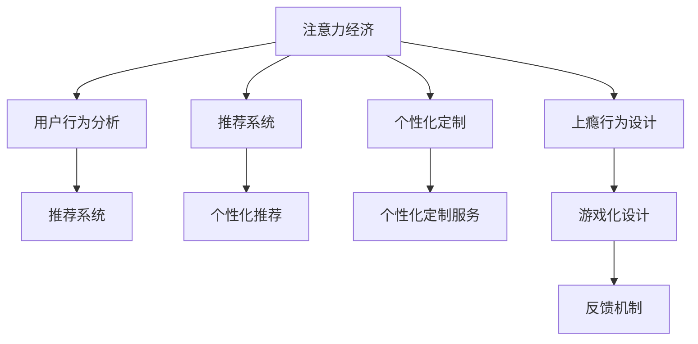

                 

# 注意力经济与用户体验优化技术：创建令人沉浸和上瘾的产品和服务

在数字化时代，注意力成为稀缺资源，企业竞争的核心也从传统的成本竞争转向对用户注意力的争夺。通过设计让人沉浸和上瘾的产品和服务，可以显著提升用户体验，增强用户粘性，进而实现商业价值的最大化。本文将系统介绍注意力经济与用户体验优化的核心技术，包括注意力获取、信息过滤、推荐算法、个性化定制等，并结合实际案例，展示如何基于这些技术实现高效的用户体验优化，助力企业构建用户粘性强的数字化产品和服务。

## 1. 背景介绍

### 1.1 问题由来

随着数字化技术的发展，用户在数字世界中的时间和注意力成为了稀缺资源。企业通过优质的内容和互动体验吸引用户，使其在平台上停留更长时间，从而提升商业价值。然而，随着互联网信息的爆炸式增长，用户在面对海量信息时往往感到困惑和焦虑，导致用户流失。因此，如何吸引并保持用户的注意力，成为企业面临的重要挑战。

### 1.2 问题核心关键点

注意力经济与用户体验优化的核心在于：
1. **吸引注意力**：通过优质的内容和互动体验，吸引用户关注和参与。
2. **保持注意力**：通过持续的互动和奖励机制，保持用户长时间停留。
3. **提升满意度**：通过个性化的推荐和服务，提升用户的满意度和忠诚度。
4. **引导行为**：通过行为分析和引导机制，促进用户完成特定的商业行为。

### 1.3 问题研究意义

研究注意力经济与用户体验优化技术，对于提升用户的黏性和商业价值，具有重要意义：
1. 提升用户留存率：通过个性化推荐和服务，增加用户使用时长，降低用户流失率。
2. 增加用户转化率：通过精准的行为分析和引导机制，提高用户购买意愿，增加转化率。
3. 提升用户体验：通过优质的内容和互动设计，提升用户满意度，增强品牌忠诚度。
4. 优化广告效果：通过分析用户的注意力特征，优化广告投放策略，提高广告效果和转化率。

## 2. 核心概念与联系

### 2.1 核心概念概述

为更好地理解注意力经济与用户体验优化的核心技术，本节将介绍几个密切相关的核心概念：

- **注意力经济**：在数字化时代，用户的注意力是稀缺资源，通过吸引和保持用户的注意力，获取商业价值的过程。
- **用户行为分析**：通过数据挖掘和机器学习技术，分析和预测用户的偏好、兴趣和行为，用于指导个性化推荐和服务。
- **推荐系统**：一种智能推荐技术，通过分析用户的历史行为和兴趣，为其推荐最相关的内容和产品，提升用户体验和满意度。
- **个性化定制**：根据用户的行为数据和偏好，定制个性化的内容和推荐，满足用户的个性化需求，提升用户体验。
- **上瘾行为设计**：通过游戏化设计、反馈机制等手段，设计出让用户难以抗拒的产品和服务，增强用户黏性。

这些核心概念之间的逻辑关系可以通过以下Mermaid流程图来展示：



这个流程图展示了大语言模型的核心概念及其之间的关系：

1. 注意力经济通过吸引和保持用户的注意力，获取商业价值。
2. 用户行为分析用于指导推荐系统和个性化定制，提升用户体验。
3. 推荐系统根据用户的行为数据和兴趣，为其推荐相关内容。
4. 个性化定制服务根据用户的个性化需求，提供定制化的内容和互动体验。
5. 上瘾行为设计通过游戏化设计、反馈机制等手段，增强用户黏性。

这些概念共同构成了数字产品的用户体验优化框架，帮助企业构建沉浸式、上瘾型的数字化产品和服务。

## 3. 核心算法原理 & 具体操作步骤
### 3.1 算法原理概述

注意力经济与用户体验优化技术的核心在于吸引和保持用户的注意力，并基于用户的行为数据进行个性化推荐和定制。其核心算法原理主要包括：

1. **用户行为分析**：通过数据挖掘和机器学习技术，分析和预测用户的兴趣、偏好和行为。
2. **推荐算法**：基于用户的历史行为和兴趣，为用户推荐最相关的内容和产品。
3. **个性化定制**：根据用户的行为数据和偏好，提供定制化的内容和推荐，满足用户的个性化需求。
4. **上瘾行为设计**：通过游戏化设计、反馈机制等手段，设计出让用户难以抗拒的产品和服务，增强用户黏性。

### 3.2 算法步骤详解

基于注意力经济与用户体验优化技术的核心算法原理，本节将详细介绍具体的算法步骤：

**Step 1: 数据收集与预处理**

- 收集用户的行为数据，如点击、浏览、购买记录等。
- 对数据进行清洗和预处理，去除噪音和异常值，确保数据质量。

**Step 2: 用户行为分析**

- 使用协同过滤、基于内容的推荐、基于矩阵分解的推荐等算法，分析和预测用户的兴趣和行为。
- 通过构建用户行为模型，识别用户的兴趣和偏好。

**Step 3: 推荐算法**

- 基于用户的历史行为和兴趣，使用矩阵分解、协同过滤等推荐算法，为用户推荐最相关的内容和产品。
- 通过A/B测试等方法，不断优化推荐算法，提升推荐效果。

**Step 4: 个性化定制**

- 根据用户的行为数据和偏好，提供个性化的内容和服务，如定制化推荐、个性化广告等。
- 使用多臂老虎机、增强学习等技术，不断优化个性化策略，提升用户满意度。

**Step 5: 上瘾行为设计**

- 设计游戏化元素，如积分、排名、徽章等，增加用户的参与度和粘性。
- 引入反馈机制，及时给予用户正向反馈，增强用户满意度。
- 利用心理学的原理，设计激励机制，如奖励、惊喜等，让用户难以抗拒。

### 3.3 算法优缺点

基于注意力经济与用户体验优化的算法具有以下优点：
1. 提升用户体验：通过个性化推荐和定制，满足用户的个性化需求，提升用户体验。
2. 增加用户粘性：通过游戏化设计和反馈机制，增强用户黏性，增加用户使用时长。
3. 优化广告效果：通过精准的行为分析和推荐，提高广告投放的精准度和效果。
4. 提升商业价值：通过提升用户留存率和转化率，增加企业收入和利润。

同时，该算法也存在一些局限性：
1. 数据依赖性强：算法的性能很大程度上依赖于用户行为数据的数量和质量。
2. 隐私和安全问题：大规模数据收集和使用可能涉及用户隐私和数据安全问题，需加强数据保护和合规管理。
3. 公平性和偏见：算法可能存在偏见，导致不公平的推荐，需关注算法的公平性和偏见问题。
4. 算力需求高：复杂的推荐算法和个性化定制需要较高的算力支持，需优化算法和提升算力。

尽管存在这些局限性，但就目前而言，基于注意力经济与用户体验优化的算法是提升数字产品用户体验的重要手段。未来相关研究的重点在于如何进一步降低数据依赖，提高算法的公平性和安全性，同时兼顾个性化和推荐效果。

### 3.4 算法应用领域

基于注意力经济与用户体验优化的算法，已经在多个领域得到了广泛应用，例如：

- 电子商务：通过推荐系统为用户推荐商品，提升购买转化率和用户满意度。
- 内容平台：如社交媒体、视频平台等，根据用户兴趣推荐内容，增加用户黏性和使用时长。
- 广告投放：通过行为分析和推荐，提高广告投放的精准度和效果，增加广告收入。
- 在线教育：通过个性化推荐和定制化服务，提升用户体验，增加学习效果。
- 金融服务：通过推荐系统和个性化定制，提升用户满意度和忠诚度，增加用户粘性和收入。

除了上述这些经典应用外，注意力经济与用户体验优化技术还被创新性地应用到更多场景中，如健康管理、旅游预订、智能家居等，为数字化产品和服务带来全新的突破。

## 4. 数学模型和公式 & 详细讲解 & 举例说明（备注：数学公式请使用latex格式，latex嵌入文中独立段落使用 $$，段落内使用 $)
### 4.1 数学模型构建

本节将使用数学语言对注意力经济与用户体验优化的核心算法进行更加严格的刻画。

记用户行为数据为 $D=\{(x_i, y_i)\}_{i=1}^N, x_i \in \mathcal{X}, y_i \in \mathcal{Y}$，其中 $\mathcal{X}$ 为行为空间，$\mathcal{Y}$ 为行为结果空间。定义推荐模型 $M_{\theta}:\mathcal{X} \rightarrow \mathcal{Y}$，其中 $\theta$ 为模型参数。推荐模型的输出为 $M_{\theta}(x_i)$，表示用户 $x_i$ 的行为预测结果。

定义推荐模型的损失函数 $\ell(M_{\theta}(x_i), y_i)$，用于衡量推荐结果与真实行为之间的差异。定义模型在数据集 $D$ 上的经验风险为：

$$
\mathcal{L}(\theta) = \frac{1}{N}\sum_{i=1}^N \ell(M_{\theta}(x_i), y_i)
$$

### 4.2 公式推导过程

以下我们以协同过滤推荐算法为例，推导其推荐过程的数学公式。

协同过滤推荐算法基于用户行为数据的相似性，通过寻找与目标用户行为相似的用户，为其推荐相似用户的偏好行为。具体步骤如下：

1. 构建用户-项目评分矩阵 $R \in \mathbb{R}^{N \times M}$，其中 $N$ 为用户数，$M$ 为物品数，$R_{ij}$ 表示用户 $i$ 对物品 $j$ 的评分。
2. 计算用户 $u$ 和物品 $v$ 的余弦相似度 $sim(u, v)$，用于衡量用户和物品的相似度。
3. 对于目标用户 $u$，计算其未评分的物品 $j$ 的预测评分 $\hat{r}_{u,j}$，用于推荐。
4. 将预测评分 $\hat{r}_{u,j}$ 与阈值 $\tau$ 比较，确定是否推荐物品 $j$。

余弦相似度公式为：

$$
sim(u, v) = \frac{R_{u,:} \cdot R_{v,:}}{\|R_{u,:}\| \cdot \|R_{v,:}\|}
$$

预测评分公式为：

$$
\hat{r}_{u,j} = \frac{\sum_{i=1}^N sim(u, i) \cdot R_{i,j}}{\sum_{i=1}^N sim(u, i)}
$$

### 4.3 案例分析与讲解

以Netflix推荐系统为例，展示协同过滤推荐算法的使用过程：

1. 构建用户-电影评分矩阵 $R \in \mathbb{R}^{N \times M}$，其中 $N$ 为Netflix用户数，$M$ 为电影数，$R_{ij}$ 表示用户 $i$ 对电影 $j$ 的评分。
2. 对于目标用户 $u$，计算其未评分的电影 $j$ 的预测评分 $\hat{r}_{u,j}$，用于推荐。
3. 将预测评分 $\hat{r}_{u,j}$ 与阈值 $\tau$ 比较，确定是否推荐电影 $j$。
4. 将推荐结果展示给用户 $u$，获取用户的反馈，更新评分矩阵 $R$。

Netflix通过协同过滤推荐算法，为用户推荐个性化的电影，显著提升了用户体验和满意度，增加了用户粘性和收入。

## 5. 项目实践：代码实例和详细解释说明
### 5.1 开发环境搭建

在进行注意力经济与用户体验优化技术的实践前，我们需要准备好开发环境。以下是使用Python进行TensorFlow开发的环境配置流程：

1. 安装Anaconda：从官网下载并安装Anaconda，用于创建独立的Python环境。

2. 创建并激活虚拟环境：
```bash
conda create -n tf-env python=3.8 
conda activate tf-env
```

3. 安装TensorFlow：根据CUDA版本，从官网获取对应的安装命令。例如：
```bash
conda install tensorflow==2.8 -c pytorch -c conda-forge
```

4. 安装Pandas、Numpy、Scikit-learn等各类工具包：
```bash
pip install pandas numpy scikit-learn matplotlib tqdm jupyter notebook ipython
```

完成上述步骤后，即可在`tf-env`环境中开始项目实践。

### 5.2 源代码详细实现

这里我们以协同过滤推荐算法为例，展示TensorFlow的代码实现：

```python
import tensorflow as tf
import pandas as pd
from sklearn.metrics import mean_squared_error

# 构建用户-电影评分矩阵
ratings = pd.read_csv('ratings.csv')
user_ids = ratings['user_id'].unique()
movie_ids = ratings['movie_id'].unique()

R = pd.DataFrame(index=user_ids, columns=movie_ids)

for user_id, movie_id, rating in ratings.itertuples():
    R.loc[user_id, movie_id] = rating

# 计算用户-电影相似度
user_means = R.mean(axis=1)
user_stds = R.std(axis=1)
user_similarity = R.corrwith(R, axis=0)

# 预测未评分电影的评分
predicted_ratings = user_similarity.dot(R).T

# 计算推荐阈值
threshold = predicted_ratings.mean() + 2 * predicted_ratings.std()

# 获取推荐结果
recommended_movies = predicted_ratings[threshold:].sort_values().index

# 展示推荐结果
print(recommended_movies)
```

### 5.3 代码解读与分析

让我们再详细解读一下关键代码的实现细节：

**构建用户-电影评分矩阵**：
- 读取用户-电影评分数据，构建评分矩阵 $R$。

**计算用户-电影相似度**：
- 计算每个用户的平均评分和标准差，用于归一化处理。
- 计算用户之间的余弦相似度，表示用户之间的相似度。

**预测未评分电影的评分**：
- 使用相似度矩阵计算每个用户对未评分电影的预测评分。

**计算推荐阈值**：
- 根据历史评分的均值和标准差，确定推荐阈值。

**获取推荐结果**：
- 根据阈值，筛选出未评分且预测评分高于阈值的电影。

**展示推荐结果**：
- 输出推荐结果，供用户查看。

可以看到，TensorFlow结合Pandas等工具，使得协同过滤推荐算法的代码实现变得简洁高效。开发者可以将更多精力放在算法改进和优化上，而不必过多关注底层的实现细节。

## 6. 实际应用场景
### 6.1 智能推荐系统

基于注意力经济与用户体验优化的推荐系统，已经成为电商、内容平台等数字产品的重要组成部分。推荐系统通过分析用户的历史行为和兴趣，为用户推荐最相关的内容和产品，提升用户体验和满意度。

在技术实现上，可以收集用户的行为数据，构建用户-物品评分矩阵，使用协同过滤、基于内容的推荐等算法，为用户推荐个性化的内容和产品。在推荐过程中，还可以通过A/B测试等方法不断优化推荐策略，提升推荐效果。

### 6.2 个性化广告投放

随着数字广告市场的竞争日益激烈，个性化广告投放成为提升广告效果的关键手段。通过分析用户的兴趣和行为，为用户展示与其需求相匹配的广告，可以有效提高广告的点击率和转化率。

在实践过程中，可以构建用户行为数据集，使用协同过滤、逻辑回归等算法，预测用户的广告点击行为。根据预测结果，选择合适的广告位和广告内容进行投放，从而提高广告的效果和ROI。

### 6.3 社交媒体内容推荐

社交媒体平台通过个性化推荐内容，增加用户黏性和使用时长。推荐系统通过分析用户的行为数据，为用户推荐最相关的内容，提升用户体验和满意度。

在技术实现上，可以收集用户的浏览、点赞、评论等行为数据，使用协同过滤、基于内容的推荐等算法，为用户推荐个性化的内容。在推荐过程中，还可以引入游戏化设计、反馈机制等手段，增强用户黏性和参与度。

### 6.4 未来应用展望

随着注意力经济与用户体验优化技术的不断发展，未来将会在更多领域得到应用，为数字化产品和服务带来新的变革。

在智慧医疗领域，通过个性化推荐系统，推荐精准医疗建议和健康管理计划，提升用户健康意识和生活质量。

在智能教育领域，通过推荐系统为用户推荐个性化的学习内容和资源，提升学习效果和用户体验。

在智慧城市治理中，通过推荐系统为用户推荐个性化旅游路线和推荐餐厅，提升用户出行体验和消费选择。

此外，在企业生产、社会治理、文娱传媒等众多领域，基于注意力经济与用户体验优化的推荐系统也将不断涌现，为数字化产品和服务带来新的突破。相信随着技术的不断进步，推荐系统将发挥越来越重要的作用，提升数字产品的用户体验和价值。

## 7. 工具和资源推荐
### 7.1 学习资源推荐

为了帮助开发者系统掌握注意力经济与用户体验优化的理论基础和实践技巧，这里推荐一些优质的学习资源：

1. 《推荐系统》系列课程：由知名高校开设的推荐系统课程，涵盖推荐算法的理论基础和实践方法。
2. 《个性化推荐系统》书籍：深入讲解推荐系统的算法和实践，包括协同过滤、基于内容的推荐等。
3. 《用户行为分析》书籍：介绍用户行为分析的方法和工具，如A/B测试、行为建模等。
4. TensorFlow官方文档：TensorFlow的详细文档，提供了丰富的推荐算法和工具库，是上手实践的必备资料。
5. Kaggle推荐系统竞赛：参加Kaggle推荐系统竞赛，通过实际项目提升推荐系统的实践能力。

通过对这些资源的学习实践，相信你一定能够快速掌握注意力经济与用户体验优化的精髓，并用于解决实际的NLP问题。

### 7.2 开发工具推荐

高效的开发离不开优秀的工具支持。以下是几款用于注意力经济与用户体验优化的常用工具：

1. TensorFlow：基于Python的开源深度学习框架，生产部署方便，适合大规模工程应用。支持推荐系统等复杂任务。
2. PyTorch：基于Python的开源深度学习框架，灵活性高，适合快速迭代研究。支持推荐系统等任务。
3. Pandas：数据分析和处理工具，支持大规模数据集的处理和分析，是推荐系统数据处理的重要工具。
4. Scikit-learn：机器学习库，提供丰富的算法和工具，支持推荐系统等任务。
5. Weights & Biases：模型训练的实验跟踪工具，可以记录和可视化模型训练过程中的各项指标，方便对比和调优。与主流深度学习框架无缝集成。
6. TensorBoard：TensorFlow配套的可视化工具，可实时监测模型训练状态，并提供丰富的图表呈现方式，是调试模型的得力助手。

合理利用这些工具，可以显著提升注意力经济与用户体验优化的开发效率，加快创新迭代的步伐。

### 7.3 相关论文推荐

注意力经济与用户体验优化技术的发展源于学界的持续研究。以下是几篇奠基性的相关论文，推荐阅读：

1. Collaborative Filtering for E-commerce Recommendations：介绍了协同过滤推荐算法的基本原理和实现方法，是推荐系统的重要基础。
2. The BellKor 2011 Challenge for User-Item Collaborative Filtering：介绍了Kaggle推荐系统竞赛的过程和结果，展示了推荐系统的实际应用效果。
3. Matrix Factorization Techniques for Recommender Systems：介绍了矩阵分解推荐算法的基本原理和实现方法，是推荐系统的重要基础。
4. Convolutional Neural Networks for Sparse Predictive Analytics：介绍了卷积神经网络在推荐系统中的应用，展示了神经网络在推荐系统中的强大能力。
5. A Multi-Armed Bandit Approach to Personalized Recommendation：介绍了多臂老虎机算法在推荐系统中的应用，展示了强化学习在推荐系统中的应用。

这些论文代表了大语言模型微调技术的发展脉络。通过学习这些前沿成果，可以帮助研究者把握学科前进方向，激发更多的创新灵感。

## 8. 总结：未来发展趋势与挑战
### 8.1 总结

本文对注意力经济与用户体验优化的核心技术进行了全面系统的介绍。首先阐述了注意力经济与用户体验优化的研究背景和意义，明确了推荐系统、用户行为分析等核心技术在提升用户体验和商业价值方面的重要价值。其次，从原理到实践，详细讲解了推荐系统、协同过滤、个性化定制等关键算法，并结合实际案例，展示了如何基于这些技术实现高效的用户体验优化。最后，本文还探讨了未来注意力经济与用户体验优化技术的趋势和挑战，为开发者提供了全方位的技术指引。

通过本文的系统梳理，可以看到，基于注意力经济与用户体验优化的推荐技术正在成为提升数字产品用户体验的重要手段，极大地拓展了预训练语言模型的应用边界，催生了更多的落地场景。受益于大规模语料的预训练，推荐系统以更低的时间和标注成本，在小样本条件下也能取得不错的效果，有力推动了NLP技术的产业化进程。未来，伴随预训练语言模型和推荐方法的持续演进，相信NLP技术将在更广阔的应用领域大放异彩，深刻影响人类的生产生活方式。

### 8.2 未来发展趋势

展望未来，注意力经济与用户体验优化技术将呈现以下几个发展趋势：

1. 推荐算法的多样化。除了传统的协同过滤、基于内容的推荐外，未来将涌现更多基于深度学习、强化学习的推荐方法，提升推荐效果和覆盖率。
2. 推荐系统的实时性。未来的推荐系统将更加注重实时性，通过流式计算、增量学习等技术，实现对用户行为的即时响应和推荐。
3. 推荐系统的跨领域融合。未来的推荐系统将更加注重跨领域数据的融合，提升推荐的泛化能力和多样性。
4. 推荐系统的智能化。未来的推荐系统将更加智能化，通过因果推理、多模态融合等技术，提升推荐的准确性和个性化程度。
5. 推荐系统的可解释性。未来的推荐系统将更加注重可解释性，通过可视化、可解释模型等技术，提升用户的信任和接受度。

以上趋势凸显了注意力经济与用户体验优化技术的广阔前景。这些方向的探索发展，必将进一步提升数字产品用户体验，推动人工智能技术在各领域的落地应用。

### 8.3 面临的挑战

尽管注意力经济与用户体验优化技术已经取得了瞩目成就，但在迈向更加智能化、普适化应用的过程中，它仍面临着诸多挑战：

1. 数据依赖性强。算法的性能很大程度上依赖于用户行为数据的数量和质量。如何降低数据依赖，提高算法的鲁棒性，是未来的重要研究方向。
2. 隐私和安全问题。大规模数据收集和使用可能涉及用户隐私和数据安全问题，需加强数据保护和合规管理。
3. 公平性和偏见。算法可能存在偏见，导致不公平的推荐，需关注算法的公平性和偏见问题。
4. 算力需求高。复杂的推荐算法和个性化定制需要较高的算力支持，需优化算法和提升算力。
5. 用户行为预测的复杂性。用户行为预测是一个复杂问题，如何准确捕捉用户的真实需求和兴趣，是未来的重要研究方向。

尽管存在这些挑战，但未来的研究需要在数据、算法、工程、业务等多个维度协同发力，才能不断提升推荐系统的精度和覆盖率，实现高效的用户体验优化。

### 8.4 研究展望

面对注意力经济与用户体验优化技术所面临的种种挑战，未来的研究需要在以下几个方面寻求新的突破：

1. 探索无监督和半监督推荐方法。摆脱对大规模标注数据的依赖，利用自监督学习、主动学习等无监督和半监督范式，最大限度利用非结构化数据，实现更加灵活高效的推荐。
2. 研究参数高效和计算高效的推荐范式。开发更加参数高效的推荐方法，在固定大部分预训练参数的同时，只更新极少量的任务相关参数。同时优化推荐模型的计算图，减少前向传播和反向传播的资源消耗，实现更加轻量级、实时性的部署。
3. 融合因果和对比学习范式。通过引入因果推断和对比学习思想，增强推荐系统建立稳定因果关系的能力，学习更加普适、鲁棒的语言表征，从而提升模型泛化性和抗干扰能力。
4. 引入更多先验知识。将符号化的先验知识，如知识图谱、逻辑规则等，与神经网络模型进行巧妙融合，引导推荐过程学习更准确、合理的语言模型。同时加强不同模态数据的整合，实现视觉、语音等多模态信息与文本信息的协同建模。
5. 结合因果分析和博弈论工具。将因果分析方法引入推荐系统，识别出模型决策的关键特征，增强输出解释的因果性和逻辑性。借助博弈论工具刻画人机交互过程，主动探索并规避模型的脆弱点，提高系统稳定性。

这些研究方向的探索，必将引领注意力经济与用户体验优化技术迈向更高的台阶，为构建安全、可靠、可解释、可控的智能系统铺平道路。面向未来，注意力经济与用户体验优化技术还需要与其他人工智能技术进行更深入的融合，如知识表示、因果推理、强化学习等，多路径协同发力，共同推动自然语言理解和智能交互系统的进步。只有勇于创新、敢于突破，才能不断拓展语言模型的边界，让智能技术更好地造福人类社会。

## 9. 附录：常见问题与解答

**Q1：如何设计高效的用户行为分析模型？**

A: 高效的用户行为分析模型需要考虑以下几个方面：
1. 数据质量：确保数据的准确性和完整性，去除噪音和异常值。
2. 数据采集：设计合理的数据采集方案，涵盖用户的行为和属性信息。
3. 特征工程：提取和构造有意义的特征，提升模型的预测能力。
4. 模型选择：根据具体任务选择合适的算法，如协同过滤、基于内容的推荐等。
5. 模型优化：使用交叉验证、参数调优等方法，提升模型的预测准确率和鲁棒性。

**Q2：推荐系统的推荐精度如何衡量？**

A: 推荐系统的推荐精度主要通过以下几个指标来衡量：
1. 平均绝对误差(MAE)：衡量推荐结果与真实评分之间的平均差异。
2. 均方误差(MSE)：衡量推荐结果与真实评分之间的平方误差。
3. 精确率(Precision)：衡量推荐结果中相关项的比例。
4. 召回率(Recall)：衡量推荐结果中实际相关项的比例。
5. F1分数：综合精确率和召回率，衡量推荐结果的整体质量。

**Q3：推荐系统中的数据隐私问题如何解决？**

A: 推荐系统中的数据隐私问题主要通过以下几种方式解决：
1. 数据匿名化：将用户数据进行匿名化处理，去除敏感信息。
2. 数据加密：对数据进行加密存储和传输，保护用户隐私。
3. 用户控制：赋予用户对其数据的使用和控制权，增强用户隐私保护。
4. 差分隐私：在数据收集和处理过程中，引入差分隐私技术，保护用户隐私。
5. 合规管理：遵循相关的隐私保护法律法规，确保数据使用的合规性。

**Q4：推荐系统如何实现实时推荐？**

A: 实现实时推荐主要需要以下几个技术手段：
1. 流式计算：采用流式计算技术，实时处理用户行为数据，及时更新推荐模型。
2. 增量学习：使用增量学习算法，根据新数据不断更新模型参数，保持推荐结果的实时性。
3. 缓存技术：使用缓存技术，存储常用的推荐结果，减少计算开销。
4. 异步更新：采用异步更新技术，将推荐模型的更新与业务逻辑分离，提高系统的并发性和稳定性。

这些技术手段可以显著提升推荐系统的实时性，实现对用户行为的即时响应和推荐。

**Q5：推荐系统的个性化推荐如何实现？**

A: 推荐系统的个性化推荐主要通过以下几个步骤实现：
1. 用户画像构建：收集用户的各种行为数据，构建用户画像，描述用户的兴趣和偏好。
2. 物品特征提取：提取物品的特征，如属性、标签等，用于描述物品的属性和特性。
3. 相似度计算：计算用户和物品之间的相似度，找到与用户兴趣相似的物品。
4. 推荐生成：根据相似度计算结果，为用户生成个性化的推荐列表。
5. 反馈处理：收集用户的反馈数据，更新用户画像和物品特征，提升推荐效果。

通过这些步骤，可以实现个性化推荐，提升用户满意度和转化率。

---

作者：禅与计算机程序设计艺术 / Zen and the Art of Computer Programming

