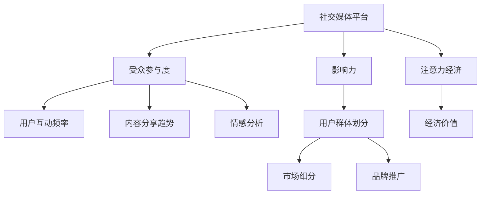

                 

# 注意力经济与社交媒体分析洞察力：了解受众参与度和影响力的秘密

在数字时代，社交媒体已经成为了信息传播和人际互动的重要平台。然而，如何理解和分析这些平台上的受众参与度和影响力，成为了一个复杂且关键的问题。本文将深入探讨注意力经济在社交媒体中的应用，并分析社交媒体分析的洞察力技术，帮助读者了解受众参与度和影响力的秘密。

## 1. 背景介绍

### 1.1 问题由来
社交媒体平台如Facebook、Twitter、Instagram等，已经成为人们获取信息、交流思想、塑造个人形象和参与社会活动的核心场所。这些平台不仅改变了人们获取和传播信息的方式，也深刻影响了社会的政治、经济和文化格局。然而，如何有效地分析这些平台上的数据，理解受众的参与度和影响力，是一个巨大的挑战。

### 1.2 问题核心关键点
社交媒体分析的核心在于理解受众在平台上的行为模式，评估他们的参与度和影响力。这些分析包括但不限于用户互动频率、内容分享趋势、情感分析、用户群体划分等。通过这些分析，企业、政府机构和社会团体可以更好地制定策略，提高影响力和用户参与度，从而实现其目标。

### 1.3 问题研究意义
深入理解社交媒体上的受众参与度和影响力，对于改进社交媒体产品的设计，提升品牌知名度，优化内容创作，增强用户互动体验具有重要意义。同时，对受众进行分析还能帮助企业发现新的市场机会，提升决策的科学性和准确性。

## 2. 核心概念与联系

### 2.1 核心概念概述

为了更好地理解社交媒体分析的洞察力，本节将介绍几个关键概念：

- **社交媒体平台**：如Facebook、Twitter、Instagram等，是用户生成和分享内容的平台，也是企业进行品牌推广和用户互动的渠道。
- **注意力经济**：指通过吸引和维持用户的注意力，创造经济价值的过程。在社交媒体上，用户的注意力被视为一种稀缺资源。
- **受众参与度**：指用户在社交媒体上的互动频率、参与行为等指标，反映了他们对平台内容的兴趣和参与程度。
- **影响力**：指用户在社交媒体上的影响力和权威性，包括他们对他人行为和决策的影响力。

这些核心概念之间的逻辑关系可以通过以下Mermaid流程图来展示：



这个流程图展示了社交媒体平台的注意力经济是如何通过受众参与度和影响力产生经济价值的。其中，用户互动频率、内容分享趋势、情感分析和用户群体划分等关键指标，有助于深入理解受众的行为模式和偏好，进而提升参与度和影响力。

## 3. 核心算法原理 & 具体操作步骤

### 3.1 算法原理概述

社交媒体分析的核心算法原理是数据驱动的洞察力提取。通过收集和分析社交媒体平台上的数据，可以提取出有关受众参与度和影响力的关键信息。这些信息包括但不限于用户互动频率、内容分享趋势、情感分析结果、用户群体划分等。

### 3.2 算法步骤详解

基于社交媒体分析的洞察力提取，通常包括以下几个关键步骤：

**Step 1: 数据收集与预处理**
- 收集社交媒体平台上的相关数据，包括用户的互动数据、发布的内容、评论、点赞、分享等。
- 对数据进行清洗和预处理，去除噪声和异常值，确保数据的准确性和完整性。

**Step 2: 特征提取与选择**
- 从数据中提取有用的特征，如用户的互动频率、内容的情感倾向、发布时间等。
- 使用特征选择技术，选择对受众参与度和影响力具有较强预测能力的特征。

**Step 3: 模型训练与评估**
- 选择合适的机器学习模型，如线性回归、决策树、随机森林、神经网络等。
- 使用交叉验证等技术对模型进行训练和评估，确保模型的泛化能力和稳定性。

**Step 4: 洞察力提取与分析**
- 通过训练好的模型，对社交媒体平台上的数据进行预测和分析，提取出有关受众参与度和影响力的关键洞察力。
- 可视化展示洞察力结果，如图表、热力图、网络图等，帮助理解数据背后的故事。

### 3.3 算法优缺点

基于社交媒体分析的洞察力提取方法具有以下优点：
- 数据丰富：社交媒体平台上的数据量巨大，为分析提供了丰富的样本。
- 多维度分析：可以同时考虑用户互动频率、内容分享趋势、情感分析等多维度的数据，提供全面的洞察力。
- 实时性：社交媒体上的数据实时更新，可以迅速获得最新的洞察力结果。

同时，该方法也存在一定的局限性：
- 数据隐私：社交媒体平台上的数据通常包含用户隐私信息，需遵守相关的隐私法律法规。
- 数据噪声：社交媒体平台上的数据可能存在噪声和虚假信息，影响分析结果的准确性。
- 模型依赖：模型的选择和调参对分析结果有较大影响，需要专业的知识和经验。

### 3.4 算法应用领域

社交媒体分析的洞察力提取方法，在多个领域得到了广泛应用，例如：

- **品牌营销**：通过分析社交媒体上的用户互动和分享数据，评估品牌的影响力和用户参与度，优化营销策略。
- **用户研究**：了解用户的兴趣、偏好和行为模式，改进产品设计和用户体验。
- **内容创作**：分析用户对内容的情感反应和互动情况，指导内容创作和发布策略。
- **危机管理**：监控社交媒体上的负面评论和舆论，及时响应和处理，维护品牌形象。

## 4. 数学模型和公式 & 详细讲解

### 4.1 数学模型构建

社交媒体分析的核心数学模型包括线性回归模型、决策树模型、随机森林模型和神经网络模型等。以线性回归模型为例，其数学表达式如下：

$$
y = \beta_0 + \beta_1 x_1 + \beta_2 x_2 + \ldots + \beta_n x_n + \epsilon
$$

其中，$y$为因变量（受众参与度或影响力），$x_i$为自变量（用户互动频率、内容分享趋势、情感分析结果等），$\beta_i$为回归系数，$\epsilon$为随机误差项。

### 4.2 公式推导过程

以线性回归模型为例，其基本原理是通过最小化残差平方和（RSS），找到最优的回归系数$\beta_i$。公式推导过程如下：

1. 定义残差平方和（RSS）：

$$
RSS = \sum_{i=1}^{n} (y_i - \hat{y}_i)^2
$$

其中，$\hat{y}_i$为模型预测值，$y_i$为实际观测值。

2. 最小化RSS：

$$
\min_{\beta} RSS = \min_{\beta} \sum_{i=1}^{n} (y_i - \beta_0 - \beta_1 x_{i1} - \ldots - \beta_n x_{in})^2
$$

3. 求解$\beta_i$：

$$
\beta_i = \frac{\sum_{i=1}^{n} x_i y_i}{\sum_{i=1}^{n} x_i^2} - \frac{\sum_{i=1}^{n} x_i x_i}{\sum_{i=1}^{n} x_i^2} \beta_0
$$

其中，$\beta_0$为截距项，$x_{ij}$为第$i$个样本的第$j$个特征。

### 4.3 案例分析与讲解

以Facebook用户的互动频率和影响力为例，我们可以构建线性回归模型，评估不同互动频率的用户对品牌的影响力。具体步骤如下：

1. 收集Facebook用户的互动数据，包括点赞、评论、分享等。
2. 提取用户互动频率和品牌的总体影响力作为因变量和自变量。
3. 使用线性回归模型训练模型，找到最优的回归系数。
4. 分析模型结果，找出互动频率与品牌影响力之间的相关性。
5. 可视化分析结果，如图表展示。

## 5. 项目实践：代码实例和详细解释说明

### 5.1 开发环境搭建

在进行社交媒体分析的洞察力提取实践前，我们需要准备好开发环境。以下是使用Python进行Pandas、Scikit-Learn等库开发的环境配置流程：

1. 安装Anaconda：从官网下载并安装Anaconda，用于创建独立的Python环境。

2. 创建并激活虚拟环境：
```bash
conda create -n social-media-env python=3.8 
conda activate social-media-env
```

3. 安装相关库：
```bash
conda install pandas scikit-learn numpy matplotlib jupyter notebook
```

完成上述步骤后，即可在`social-media-env`环境中开始项目实践。

### 5.2 源代码详细实现

以下是使用Pandas、Scikit-Learn等库对Facebook用户互动数据进行线性回归分析的代码实现。

```python
import pandas as pd
from sklearn.linear_model import LinearRegression
from sklearn.model_selection import train_test_split
from sklearn.metrics import mean_squared_error

# 读取数据
df = pd.read_csv('facebook_interactions.csv')

# 数据预处理
X = df[['interaction_frequency']]
y = df['brand_impact']

# 划分训练集和测试集
X_train, X_test, y_train, y_test = train_test_split(X, y, test_size=0.2, random_state=42)

# 训练模型
model = LinearRegression()
model.fit(X_train, y_train)

# 预测并评估
y_pred = model.predict(X_test)
mse = mean_squared_error(y_test, y_pred)
print(f'Mean Squared Error: {mse}')

# 可视化结果
import matplotlib.pyplot as plt
plt.scatter(X_test, y_test, label='True Values')
plt.plot(X_test, y_pred, color='red', label='Predictions')
plt.legend()
plt.show()
```

以上就是使用Pandas、Scikit-Learn等库对Facebook用户互动数据进行线性回归分析的完整代码实现。可以看到，使用这些库可以方便地进行数据处理、模型训练和结果展示。

### 5.3 代码解读与分析

让我们再详细解读一下关键代码的实现细节：

**数据读取与预处理**：
- 使用`pd.read_csv()`函数读取CSV文件，将数据加载到Pandas数据帧中。
- 通过`X`和`y`变量分别表示自变量和因变量，进行数据划分。

**模型训练与评估**：
- 使用`LinearRegression()`创建线性回归模型。
- 通过`fit()`方法对模型进行训练。
- 使用`mean_squared_error()`函数评估模型预测结果的均方误差。

**结果可视化**：
- 使用`matplotlib`库绘制散点图和拟合直线，展示预测结果与真实值之间的关系。

可以看到，使用Python和相关库可以很方便地进行社交媒体分析的洞察力提取实践。

## 6. 实际应用场景

### 6.1 品牌营销

在品牌营销领域，通过分析社交媒体上的用户互动数据，可以评估不同营销策略的影响力。例如，可以通过分析用户点赞、评论和分享的数量，评估品牌广告的曝光率和参与度。根据分析结果，可以优化广告投放策略，提升品牌知名度和用户参与度。

### 6.2 用户研究

在用户研究领域，通过分析用户的互动数据和发布内容，可以了解用户的兴趣、偏好和行为模式。例如，可以通过分析用户对特定内容的互动频率，了解他们对不同类型内容的偏好。根据分析结果，可以改进产品设计和用户体验，提升用户满意度。

### 6.3 内容创作

在内容创作领域，通过分析用户对内容的情感反应和互动情况，可以指导内容创作和发布策略。例如，可以通过分析用户对某一主题的评论和分享，评估其受欢迎程度。根据分析结果，可以调整内容创作方向，提高内容的影响力和用户参与度。

### 6.4 危机管理

在危机管理领域，通过监控社交媒体上的负面评论和舆论，可以及时响应和处理，维护品牌形象。例如，可以通过分析用户对某一事件的评论，评估其对品牌形象的影响。根据分析结果，可以制定应对策略，缓解负面影响，提升品牌形象。

## 7. 工具和资源推荐

### 7.1 学习资源推荐

为了帮助开发者系统掌握社交媒体分析的洞察力提取理论基础和实践技巧，这里推荐一些优质的学习资源：

1. 《社交媒体分析》系列书籍：介绍社交媒体数据分析的基本概念、方法和实践案例。
2. Coursera《数据科学与机器学习》课程：斯坦福大学开设的课程，涵盖数据预处理、机器学习、模型评估等内容。
3. Kaggle社交媒体分析竞赛：通过参加实际竞赛，学习和应用社交媒体分析的洞察力提取技术。
4. HuggingFace官方文档：介绍多种NLP任务的代码实现和应用示例。
5. Google Colab：谷歌推出的在线Jupyter Notebook环境，方便开发者快速实验和学习最新技术。

通过对这些资源的学习实践，相信你一定能够快速掌握社交媒体分析的洞察力提取方法，并用于解决实际的分析问题。

### 7.2 开发工具推荐

高效的开发离不开优秀的工具支持。以下是几款用于社交媒体分析洞察力提取开发的常用工具：

1. Python：作为数据分析和机器学习的主流语言，Python具有强大的数据处理能力和丰富的库支持。
2. Pandas：用于数据处理和分析，提供了高效的数据结构和数据操作函数。
3. Scikit-Learn：用于机器学习模型的训练和评估，提供了多种模型和评估工具。
4. Matplotlib：用于数据可视化，提供了丰富的图表展示方式。
5. Jupyter Notebook：用于数据处理和模型训练，支持代码和数据联合编辑和展示。

合理利用这些工具，可以显著提升社交媒体分析洞察力提取的开发效率，加快创新迭代的步伐。

### 7.3 相关论文推荐

社交媒体分析的洞察力提取技术的发展源于学界的持续研究。以下是几篇奠基性的相关论文，推荐阅读：

1. "Data Mining and Statistical Learning" by Mark A. Hall：介绍数据挖掘和统计学习的基本方法和技术，涵盖回归分析、聚类分析等内容。
2. "Machine Learning Yearning" by Andrew Ng：由Google深度学习专家撰写，涵盖机器学习项目开发的全流程，包括数据预处理、模型训练、结果分析等内容。
3. "Social Media Analysis and Data Mining" by Yan Zhang：介绍社交媒体数据分析的方法和工具，涵盖用户行为分析、情感分析、话题建模等内容。
4. "A Survey on Social Media Analytics: Data Collection, Preprocessing, and Statistical Learning" by Amina Attar et al.：综述了社交媒体分析的主要技术和方法，提供了丰富的文献和案例。

这些论文代表了大数据分析和机器学习领域的发展脉络。通过学习这些前沿成果，可以帮助研究者把握学科前进方向，激发更多的创新灵感。

## 8. 总结：未来发展趋势与挑战

### 8.1 总结

本文对社交媒体分析的洞察力提取方法进行了全面系统的介绍。首先阐述了社交媒体分析的研究背景和意义，明确了洞察力提取在提升品牌知名度、优化用户体验、指导内容创作等方面的重要性。其次，从原理到实践，详细讲解了线性回归等核心算法，并给出了代码实例和详细解释说明。同时，本文还探讨了社交媒体分析在品牌营销、用户研究、内容创作和危机管理等实际应用场景中的应用，展示了洞察力提取技术的广阔前景。

通过本文的系统梳理，可以看到，社交媒体分析的洞察力提取技术正在成为品牌和企业在数字时代的重要工具，为提升品牌影响力和用户参与度提供了强有力的支持。未来，伴随数据分析技术和机器学习模型的不断发展，相信社交媒体分析将进一步深入人心，为数字时代的品牌和商业创新注入新的活力。

### 8.2 未来发展趋势

展望未来，社交媒体分析的洞察力提取技术将呈现以下几个发展趋势：

1. **多模态分析**：社交媒体上的数据不仅仅是文本，还包含图像、视频、音频等多模态信息。未来的分析技术将能够更好地整合这些信息，提升分析的全面性和准确性。
2. **实时分析**：社交媒体上的数据实时更新，未来的分析技术将能够实现实时分析，及时获取最新的洞察力结果。
3. **自动化分析**：随着自动机器学习（AutoML）技术的发展，未来的分析将更加自动化，用户可以通过简单的交互界面快速获得分析结果。
4. **模型融合**：未来的分析技术将结合多种模型和方法，提升分析的稳定性和准确性。例如，结合深度学习、图神经网络等技术，提升社交网络分析的深度和广度。
5. **跨领域应用**：未来的分析技术将应用于更多领域，如市场营销、公共政策、社会治理等，推动跨领域的协同创新。

以上趋势凸显了社交媒体分析技术的广泛应用前景。这些方向的探索发展，必将进一步提升品牌和企业在数字时代的影响力和竞争力。

### 8.3 面临的挑战

尽管社交媒体分析的洞察力提取技术已经取得了显著成果，但在迈向更加智能化、普适化应用的过程中，它仍面临着诸多挑战：

1. **数据质量**：社交媒体平台上的数据通常存在噪声和虚假信息，影响分析结果的准确性。如何提高数据质量，是未来需要解决的重要问题。
2. **用户隐私**：社交媒体平台上的数据通常包含用户隐私信息，如何保护用户隐私，遵守相关的隐私法律法规，是未来需要关注的重点。
3. **模型鲁棒性**：社交媒体平台上的数据分布多样，模型可能面临过拟合或泛化性能不足的问题。如何提高模型的鲁棒性，是未来需要解决的重要问题。
4. **计算资源**：社交媒体平台上的数据量巨大，如何高效处理和分析这些数据，需要优化计算资源的使用。
5. **可解释性**：模型输出的结果往往是黑盒的，如何提高模型的可解释性，帮助用户理解分析结果，是未来需要解决的重要问题。

### 8.4 研究展望

面对社交媒体分析洞察力提取技术面临的挑战，未来的研究需要在以下几个方面寻求新的突破：

1. **数据增强技术**：通过数据增强技术，提高数据质量，减少数据噪声。例如，通过数据清洗、异常值检测等技术，提升数据质量。
2. **隐私保护技术**：通过隐私保护技术，保护用户隐私，遵守相关的隐私法律法规。例如，通过数据匿名化、差分隐私等技术，保护用户隐私。
3. **模型融合技术**：通过模型融合技术，提高模型的鲁棒性和泛化性能。例如，通过集成多种模型和方法，提升模型的稳定性和准确性。
4. **高效计算技术**：通过高效计算技术，优化计算资源的使用。例如，通过分布式计算、GPU加速等技术，提升计算效率。
5. **模型可解释性技术**：通过模型可解释性技术，提高模型的可解释性，帮助用户理解分析结果。例如，通过可解释机器学习模型、模型解释工具等技术，提升模型的可解释性。

这些研究方向将推动社交媒体分析洞察力提取技术的发展，为品牌和企业在数字时代的决策和创新提供更强大的支持。

## 9. 附录：常见问题与解答

**Q1: 社交媒体分析的洞察力提取方法适用于所有社交媒体平台吗？**

A: 社交媒体分析的洞察力提取方法适用于大多数社交媒体平台，如Facebook、Twitter、Instagram等。但是，不同平台的互动方式和数据格式不同，需要根据具体情况进行适当调整。

**Q2: 如何选择和训练模型？**

A: 选择和训练模型的过程需要考虑数据的特点和分析目标。通常，可以采用线性回归、决策树、随机森林、神经网络等模型进行训练。在选择模型时，需要考虑模型的简单性、准确性和可解释性等因素。在训练模型时，需要选择合适的训练算法和超参数，并使用交叉验证等技术进行评估。

**Q3: 如何进行数据分析和可视化？**

A: 数据分析和可视化是社交媒体分析的核心步骤。可以使用Pandas、NumPy、Matplotlib等库进行数据处理和可视化。常用的可视化方式包括散点图、热力图、柱状图、折线图等。在进行可视化时，需要选择合适的图表类型和展示方式，确保数据一目了然。

**Q4: 如何保护用户隐私？**

A: 在社交媒体分析中，保护用户隐私至关重要。可以通过数据匿名化、差分隐私等技术保护用户隐私。在收集数据时，需要明确告知用户数据的使用目的，并获取用户的同意。在使用数据时，需要遵守相关的隐私法律法规，确保用户隐私安全。

**Q5: 如何进行多模态分析？**

A: 社交媒体上的数据通常包含多种模态，如文本、图像、视频等。进行多模态分析需要整合多种数据源，并使用相应的分析技术。例如，可以通过图像识别技术提取图像特征，并将其与文本特征结合，进行综合分析。

通过这些常见问题的解答，相信读者对社交媒体分析的洞察力提取方法有了更深入的了解，能够更好地应用和开发相关技术。

