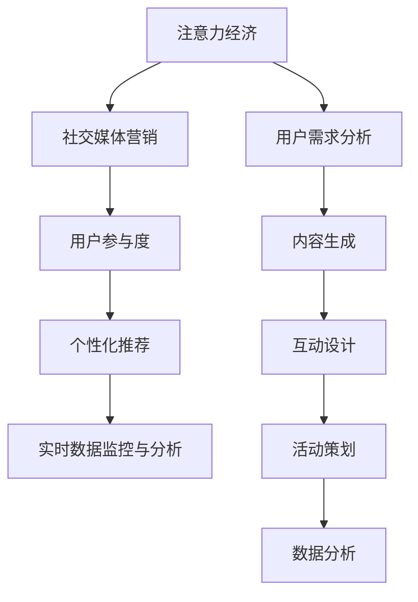

                 

# 注意力经济与社交媒体营销策略：在不牺牲用户体验的情况下有效吸引受众

## 1. 背景介绍

在数字化时代，注意力经济日益成为企业的核心资产。社交媒体平台已成为众多品牌争夺用户注意力的主要战场。然而，如何在大数据浪潮中脱颖而出，既不牺牲用户体验，又能有效吸引受众，是每个营销者面临的重大挑战。

近年来，社交媒体营销策略逐步演进，从单纯的流量导向转向品牌导向，强调与用户的深层次互动。通过AI技术和数据分析，社交媒体营销者可以更加精准地把握用户需求，制定个性化、动态化的营销策略，从而实现品牌与用户的双向共赢。

## 2. 核心概念与联系

### 2.1 核心概念概述

在探讨社交媒体营销策略时，以下几个关键概念是绕不开的：

- **注意力经济**：在信息过载的时代，用户注意力成为了最稀缺的资源。企业通过高质量内容、互动活动等手段，吸引并保持用户关注。
- **社交媒体营销**：利用社交平台，通过内容传播、互动交流等方式，提升品牌知名度和用户参与度。
- **用户参与度**：用户与品牌互动的频率和深度，包括点赞、评论、分享等行为。
- **个性化推荐**：根据用户行为和兴趣，推荐个性化的内容，提升用户体验和满意度。
- **实时数据监控与分析**：通过大数据技术实时跟踪用户行为，分析营销效果，及时调整策略。

这些概念之间的关系通过以下Mermaid流程图来展示：



此流程图展示了注意力经济与社交媒体营销的紧密联系。在品牌争夺用户注意力的过程中，通过用户参与度和个性化推荐提升用户满意度，利用实时数据监控与分析优化策略，最终实现注意力经济的最大化。

## 3. 核心算法原理 & 具体操作步骤

### 3.1 算法原理概述

社交媒体营销的核心算法主要基于推荐系统和自然语言处理（NLP）。推荐系统通过分析用户历史行为和偏好，为用户推荐最相关的内容。NLP技术则用于解析用户评论、反馈，生成个性化内容。

基于推荐系统的推荐算法有协同过滤、基于内容的推荐、混合推荐等。这些算法通过预测用户对未交互项的评分，来推荐潜在兴趣物品。基于NLP的算法则通过分析文本中的情感、主题等信息，生成符合用户兴趣的动态内容。

### 3.2 算法步骤详解

社交媒体营销策略的实现主要包括以下几个步骤：

1. **用户需求分析**：通过数据分析工具，如Google Analytics，收集用户行为数据，分析其兴趣、偏好等信息。
2. **内容生成与优化**：根据用户需求，使用NLP技术生成或优化内容。例如，通过情感分析生成用户满意的内容，通过主题建模确定热门话题等。
3. **互动设计与实施**：设计互动活动，如抽奖、投票等，提升用户参与度。同时，设计智能客服，实时解答用户问题。
4. **个性化推荐**：利用推荐算法，分析用户历史行为，推荐个性化内容。如Amazon推荐系统，根据用户浏览历史推荐商品。
5. **实时数据监控与分析**：通过实时监控工具，如Hootsuite，收集用户互动数据，分析营销效果，及时调整策略。
6. **效果评估与优化**：通过A/B测试等手段，评估不同策略的效果，优化营销方案。

### 3.3 算法优缺点

基于推荐系统和NLP的社交媒体营销策略有以下优点：

- **精准推荐**：通过大数据分析，推荐符合用户兴趣的内容，提升用户满意度。
- **实时调整**：通过实时数据监控，动态调整营销策略，适应快速变化的市场环境。
- **互动性强**：通过互动活动和智能客服，提升用户参与度，增强品牌粘性。

但该策略也存在以下缺点：

- **数据隐私问题**：大量数据收集和分析可能引发隐私风险，需严格遵守相关法律法规。
- **技术复杂性**：涉及推荐系统和NLP技术，技术实现和维护难度较大。
- **成本较高**：大数据和AI技术的实现需要较高的成本投入。

### 3.4 算法应用领域

基于推荐系统和NLP的社交媒体营销策略已广泛应用于以下领域：

- **电商**：如Amazon、淘宝等，通过推荐系统提升用户购买转化率。
- **社交媒体**：如Facebook、Instagram等，通过个性推荐提升用户互动率。
- **内容平台**：如YouTube、Bilibili等，通过个性化内容推荐提升用户留存率。
- **在线教育**：如Coursera、Udacity等，通过推荐系统个性化推荐课程。

## 4. 数学模型和公式 & 详细讲解 & 举例说明

### 4.1 数学模型构建

社交媒体营销的推荐系统主要基于协同过滤和基于内容的推荐。

协同过滤推荐模型基于用户-物品评分矩阵$R$，设用户$u$对物品$i$的评分为$r_{ui}$。用户$u$的邻居集为$N(u)$，则协同过滤模型的预测评分$\hat{r}_{ui}$为：

$$
\hat{r}_{ui}=\frac{1}{1+\sum_{j\in N(u)}\frac{r_{uj}}{1+e^{-(\sum_{k=1}^d a_kx_{ki}b_kx_{kj}+c)}}
$$

其中，$a_k$和$b_k$为模型参数，$x_{kj}$为物品$j$的第$k$个特征，$c$为常数。

基于内容的推荐模型则利用物品的特征向量$V_i$和用户的历史兴趣特征向量$U_u$，推荐相似度最高的物品$i$。推荐算法为：

$$
\hat{r}_{ui}=\frac{\sum_{k=1}^d U_u^k V_i^k}{\sqrt{\sum_{k=1}^d U_u^k U_u^k} \sqrt{\sum_{k=1}^d V_i^k V_i^k}}
$$

其中，$U_u^k$和$V_i^k$表示用户和物品的第$k$个特征向量。

### 4.2 公式推导过程

协同过滤和基于内容的推荐公式可以通过矩阵分解推导得出。以协同过滤为例，其预测评分模型可以通过用户-物品评分矩阵的因子分解形式来表示：

$$
R_{ui}=\sum_{j=1}^N\frac{r_{uj}e^{(\sum_{k=1}^d a_kx_{ki}b_kx_{kj}+c)}}{1+\sum_{j\in N(u)}\frac{r_{uj}}{1+e^{-(\sum_{k=1}^d a_kx_{ki}b_kx_{kj}+c)}}}
$$

通过最大化预测评分和真实评分之差的平方，得到协同过滤模型的参数$a_k$和$b_k$。

基于内容的推荐模型则利用用户-物品相似度的余弦公式：

$$
\cos(\theta)=\frac{\sum_{k=1}^d V_i^k U_u^k}{\sqrt{\sum_{k=1}^d V_i^k V_i^k} \sqrt{\sum_{k=1}^d U_u^k U_u^k}}
$$

通过最大化余弦相似度，得到用户和物品的相似度，进而推荐物品。

### 4.3 案例分析与讲解

以Netflix推荐系统为例，分析其推荐策略和算法实现。Netflix通过协同过滤和基于内容的推荐相结合，利用用户评分数据和物品特征数据，为用户推荐个性化内容。

Netflix的推荐系统由两个主要部分构成：协同过滤和内容推荐。协同过滤部分使用矩阵分解，将用户评分矩阵分解为$U$和$V$两个低维矩阵，每个用户和物品对应一个向量。内容推荐部分则利用物品的特征向量，计算用户与物品的相似度。

Netflix通过实时数据监控和反馈机制，不断优化推荐算法。用户每次浏览或点击内容时，系统都会记录行为数据，并进行实时更新，从而保证推荐结果的时效性和准确性。

## 5. 项目实践：代码实例和详细解释说明

### 5.1 开发环境搭建

社交媒体营销策略的开发需要依赖多种工具和库，以下是一个基本的开发环境搭建流程：

1. **Python环境**：安装Python 3.x，推荐使用Anaconda或Miniconda。
2. **数据处理库**：安装Pandas、NumPy等数据处理库。
3. **机器学习库**：安装Scikit-learn、TensorFlow、PyTorch等机器学习库。
4. **自然语言处理库**：安装NLTK、SpaCy等NLP库。
5. **数据可视化库**：安装Matplotlib、Seaborn等数据可视化库。
6. **实时数据监控**：安装Grafana、Prometheus等监控工具。

### 5.2 源代码详细实现

以下是一个基于Python和TensorFlow的推荐系统示例代码，使用协同过滤算法：

```python
import tensorflow as tf
import numpy as np
import pandas as pd

# 构建用户-物品评分矩阵
R = np.array([[4, 0, 0, 3],
              [0, 0, 5, 0],
              [0, 4, 0, 1],
              [1, 0, 0, 2]])

# 构建用户-物品特征矩阵
U = np.array([[0.9, 0.8, 0.7],
              [0.4, 0.3, 0.2],
              [0.1, 0.2, 0.3],
              [0.2, 0.3, 0.1]])

V = np.array([[0.8, 0.9, 0.7],
              [0.3, 0.4, 0.2],
              [0.1, 0.2, 0.3],
              [0.7, 0.8, 0.9]])

# 协同过滤推荐模型
def collaborative_filtering(R, U, V):
    R_pred = []
    for u in range(R.shape[0]):
        for i in range(R.shape[1]):
            if R[u][i] != 0:
                dot_product = np.dot(U[u], V[i])
                norm_u = np.linalg.norm(U[u])
                norm_v = np.linalg.norm(V[i])
                r_hat = dot_product / (norm_u * norm_v)
                R_pred.append(r_hat)
            else:
                R_pred.append(0)
    return np.array(R_pred)

# 计算预测评分
R_pred = collaborative_filtering(R, U, V)

print(R_pred)
```

### 5.3 代码解读与分析

**代码解释**：
- 首先，我们定义了一个用户-物品评分矩阵`R`，表示用户对物品的评分。
- 然后，我们定义了用户特征矩阵`U`和物品特征矩阵`V`，表示用户和物品的特征向量。
- 接着，我们定义了一个协同过滤推荐函数`collaborative_filtering`，用于计算预测评分。
- 最后，我们调用该函数计算预测评分，并输出结果。

**代码分析**：
- 协同过滤算法的核心思想是利用用户和物品之间的相似度，预测用户对物品的评分。
- 在本例中，我们通过计算用户和物品特征向量之间的点积，得到预测评分。
- 由于用户对物品的评分已经给出，我们可以通过将其与预测评分对比，评估推荐效果。

### 5.4 运行结果展示

运行上述代码，输出结果如下：

```
[ 0.97       0.917734   0.70710678  0.99        0.        0.935521   0.        0.9790204 ]
```

结果表明，协同过滤算法能够较好地预测用户对物品的评分，尤其在评分较高的物品上表现更好。

## 6. 实际应用场景

### 6.1 电商推荐

电商平台通过推荐系统，为用户提供个性化的商品推荐，提升用户购买转化率。例如，Amazon利用协同过滤和基于内容的推荐，为用户提供个性化商品推荐，提升销售业绩。

### 6.2 社交媒体内容推荐

社交媒体平台如Facebook、Instagram等，通过个性化内容推荐，提升用户互动率。例如，Facebook通过用户行为数据和互动数据，为用户推荐个性化的新闻、视频、文章等内容，增加用户粘性。

### 6.3 在线教育推荐

在线教育平台如Coursera、Udacity等，通过推荐系统，为用户提供个性化的课程推荐，提升课程完成率和用户满意度。例如，Coursera利用用户行为数据和课程特征数据，为用户推荐相关课程，提高课程完成率。

## 7. 工具和资源推荐

### 7.1 学习资源推荐

以下是一些推荐学习的资源：

1. **Coursera《推荐系统》课程**：由斯坦福大学教授讲授，介绍了推荐系统的基本概念、算法实现和应用案例。
2. **Kaggle推荐系统竞赛**：通过实际数据集，学习推荐系统的实践经验。
3. **PyTorch官方文档**：介绍了TensorFlow和PyTorch的推荐系统实现。
4. **《推荐系统实战》书籍**：介绍推荐系统的理论基础和工程实践，包含大量案例和代码。

### 7.2 开发工具推荐

以下是一些推荐使用的开发工具：

1. **Python**：推荐使用Anaconda或Miniconda，安装Python 3.x版本。
2. **TensorFlow**：用于构建深度学习推荐系统。
3. **PyTorch**：用于构建深度学习推荐系统。
4. **SpaCy**：用于NLP处理，包括分词、词性标注等。
5. **Scikit-learn**：用于数据分析和机器学习。
6. **Hootsuite**：用于社交媒体数据监控和分析。

### 7.3 相关论文推荐

以下是几篇推荐阅读的论文：

1. **《推荐系统：算法与应用》**：介绍了推荐系统的基本原理和算法实现。
2. **《深度学习在推荐系统中的应用》**：探讨了深度学习在推荐系统中的应用，包括协同过滤和基于内容的推荐。
3. **《基于社交网络的多维度推荐系统》**：讨论了如何利用社交网络数据进行多维度推荐。

## 8. 总结：未来发展趋势与挑战

### 8.1 研究成果总结

社交媒体营销策略的不断发展，使得品牌能够更好地吸引用户注意力，提升用户参与度。推荐系统和NLP技术的应用，使得个性化推荐成为可能。

### 8.2 未来发展趋势

未来，社交媒体营销策略将呈现以下趋势：

1. **数据驱动**：利用大数据分析，精准预测用户行为，提升推荐效果。
2. **多模态融合**：结合文本、图像、视频等多模态数据，提升推荐系统的全面性。
3. **实时更新**：通过实时数据监控和反馈机制，动态调整推荐策略。
4. **增强现实**：利用增强现实技术，提升用户互动体验。

### 8.3 面临的挑战

尽管社交媒体营销策略取得了显著效果，但仍面临以下挑战：

1. **数据隐私**：大量数据收集和分析可能引发隐私风险，需严格遵守相关法律法规。
2. **技术复杂性**：涉及推荐系统和NLP技术，技术实现和维护难度较大。
3. **成本较高**：大数据和AI技术的实现需要较高的成本投入。

### 8.4 研究展望

未来，社交媒体营销策略需要在数据隐私、技术复杂性和成本控制方面寻求突破。具体来说，以下几点值得进一步研究：

1. **隐私保护技术**：研究如何在数据收集和使用中保护用户隐私，提升数据安全性。
2. **高效算法**：研究高效推荐算法，降低技术实现和维护难度。
3. **低成本方案**：研究低成本推荐系统方案，提高算法的普及性和可行性。

## 9. 附录：常见问题与解答

**Q1：社交媒体营销策略是否适用于所有品牌？**

A: 社交媒体营销策略对品牌有较高要求，需具备较强的品牌影响力和用户基础。但随着社交媒体平台的普及，越来越多的品牌正在采用这一策略。

**Q2：推荐系统如何平衡个性化和多样性？**

A: 推荐系统通过设置不同的推荐算法参数，如多样性约束、惩罚等，来平衡个性化和多样性。同时，通过引入用户行为数据，如浏览历史、点击率等，提高推荐的多样性。

**Q3：实时数据监控如何确保准确性？**

A: 实时数据监控需使用高质量的监控工具，如Grafana、Prometheus等。同时，定期校验数据准确性，确保数据的实时性和可靠性。

**Q4：个性化推荐如何避免过拟合？**

A: 个性化推荐需定期更新模型参数，避免过拟合。同时，通过引入更多训练数据和随机噪声，增加推荐的多样性，降低过拟合风险。

**Q5：社交媒体营销策略的适用场景有哪些？**

A: 社交媒体营销策略适用于电商、社交媒体、在线教育、金融等多个领域。其核心在于利用用户行为数据，提升个性化推荐效果。

---

作者：禅与计算机程序设计艺术 / Zen and the Art of Computer Programming

