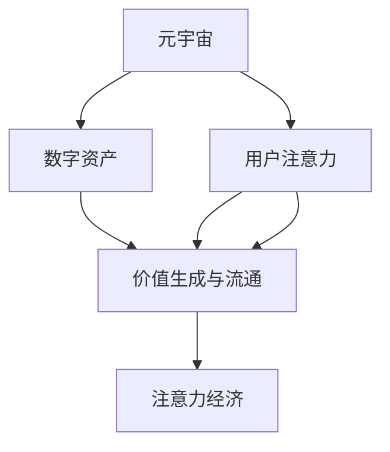

                 

# 注意力经济学理论:元宇宙中的价值重构

> 关键词：元宇宙,注意力经济学,价值重构,人工智能,人机交互,数字经济

## 1. 背景介绍

### 1.1 问题由来
随着人工智能和数字技术的迅速发展，人们的生活方式正经历着深刻变革。尤其是在元宇宙这一新兴概念的推动下，虚拟现实与数字经济的融合趋势愈发明显。元宇宙中，数字资产和虚拟体验的价值日益成为焦点，而如何评估和管理这些价值，成为摆在技术研发、商业模式设计等方面的核心问题。在这一背景下，注意力经济学（Economics of Attention）理论逐渐进入人们的视野，提供了从信息经济学的角度重新审视元宇宙价值构成与分配的框架。

### 1.2 问题核心关键点
注意力经济学理论的核心理念，是将信息经济学中的注意力资源视为一种稀缺的、可交易的资源。在元宇宙中，注意力资源的分配和流动直接影响到数字资产的价值生成、消费与流通。本文将探讨如何运用注意力经济学理论，理解并重构元宇宙中的价值体系，为元宇宙建设者、开发者和用户提供一种全新的视角。

### 1.3 问题研究意义
研究注意力经济学理论在元宇宙中的应用，对于推进数字经济的深度发展、优化元宇宙生态系统、促进人机互动与价值交换，具有重要意义。通过引入注意力经济学的视角，我们能够更全面地理解虚拟资产和用户体验的生成机制，发现和优化潜在价值创造环节，构建更加智能和自驱的元宇宙价值体系。

## 2. 核心概念与联系

### 2.1 核心概念概述

为更好地理解注意力经济学理论在元宇宙中的应用，本节将介绍几个密切相关的核心概念：

- **元宇宙（Metaverse）**：基于虚拟现实和增强现实技术的沉浸式互联网环境，提供了虚拟社交、商务、教育等多种应用场景。
- **数字资产（Digital Assets）**：在元宇宙中，通过区块链等技术支持的虚拟物品、游戏道具、数字货币等可交易物品。
- **用户注意力（User Attention）**：用户在元宇宙中花费的时间和精力，视为一种稀缺资源，可以量化和交易。
- **价值生成与流通（Value Creation and Circulation）**：在元宇宙中，用户对数字资产的关注、交互和使用行为，是数字资产价值生成的重要来源。
- **注意力经济（Economics of Attention）**：将注意力视为经济活动中的重要资源，探索其分配、流动与价值创造机制的理论体系。

这些概念之间的逻辑关系可以通过以下Mermaid流程图来展示：



这个流程图展示了几者之间的基本联系：

1. 元宇宙提供数字资产的生成与交易环境。
2. 用户注意力在元宇宙中分配，直接参与到数字资产的价值生成。
3. 价值生成与流通是数字资产在元宇宙中的主要经济活动。
4. 注意力经济学理论是分析这些活动的关键理论框架。

## 3. 核心算法原理 & 具体操作步骤
### 3.1 算法原理概述

注意力经济学理论在元宇宙中的应用，核心在于将用户的注意力资源视为一种稀缺资源，通过算法模型和机制设计，优化其分配和流动，促进数字资产价值的生成与流通。其核心思想是：

- 将用户注意力量化，通过计算用户在不同数字资产上的关注度，评估数字资产的价值。
- 设计机制，激励用户创造高质量内容，提高用户对数字资产的关注度，从而提升数字资产的价值。
- 研究注意力资源的分配和交易规则，促进数字资产的合理流通和价值优化。

### 3.2 算法步骤详解

基于注意力经济学理论，元宇宙中的数字资产价值重构主要包括以下几个关键步骤：

**Step 1: 数据采集与量化**
- 收集用户在不同数字资产上的行为数据，如浏览时间、互动次数、交易记录等。
- 量化用户注意力，通过算法计算每个数字资产在用户注意力中的权重。

**Step 2: 模型构建与训练**
- 设计注意力评估模型，如加权平均模型、注意力加权关联模型等。
- 训练模型，使用历史数据进行拟合，找到用户注意力与数字资产价值之间的最优映射关系。

**Step 3: 价值评估与优化**
- 根据注意力模型，评估每个数字资产的价值。
- 优化数字资产的价值体系，如调整价格、改进内容质量等，提升数字资产的市场竞争力。

**Step 4: 机制设计与激励**
- 设计激励机制，如奖励机制、市场机制、合作机制等，激励用户参与数字资产的创作和互动。
- 通过游戏化设计，提高用户对数字资产的关注度和参与度。

**Step 5: 市场流通与监管**
- 设计数字资产的流通机制，如交易规则、市场规则等，确保数字资产的合法流通。
- 建立监管机制，防止数字资产市场中的欺诈、盗版等行为，保护用户权益。

### 3.3 算法优缺点

基于注意力经济学理论的元宇宙价值重构方法具有以下优点：

- 量化注意力资源，提供了一种科学评估数字资产价值的方法。
- 设计激励机制，提升数字资产的创造与互动质量。
- 优化价值体系，促进数字资产的合理流通与优化配置。

同时，该方法也存在一定的局限性：

- 数据获取难度较大，需要收集海量用户行为数据。
- 模型设计复杂，需要考虑多方面的影响因素。
- 用户行为预测存在不确定性，模型效果可能受用户偏好变化影响。
- 注意力资源分配与流转的公平性问题，如何平衡用户权益和市场效率，是一个重要的挑战。

尽管存在这些局限性，但通过不断优化数据采集和模型设计，以及积极探索新的激励机制和市场规则，基于注意力经济学理论的元宇宙价值重构方法仍然具有广阔的前景。

### 3.4 算法应用领域

基于注意力经济学理论的元宇宙价值重构方法，在以下几个领域具有广泛的应用前景：

- **数字资产交易平台**：通过注意力经济学模型，量化数字资产的价值，优化交易规则，提升平台竞争力。
- **虚拟社交平台**：设计激励机制，促进用户参与，提高平台的用户粘性和活跃度。
- **内容创作与分发平台**：通过模型评估内容价值，优化创作者激励，提升内容的创新性和吸引力。
- **虚拟商业与娱乐平台**：设计市场规则，促进数字资产的合理流通与优化配置，增强平台的用户体验和商业价值。

此外，在元宇宙的其他应用场景中，如虚拟教育、健康管理等，注意力经济学理论同样具有潜在的价值重构意义。

## 4. 数学模型和公式 & 详细讲解  
### 4.1 数学模型构建

在元宇宙中，用户对数字资产的注意力可以通过多个维度进行量化和评估。这里以一个简单的加权平均模型为例，介绍如何构建注意力经济学模型：

设用户对数字资产 $A$ 的注意力为 $A_t$，对数字资产 $B$ 的注意力为 $B_t$。对于两个资产 $A$ 和 $B$，其注意力权重分别为 $w_A$ 和 $w_B$。可以定义一个加权平均的注意力得分 $U(A, B)$，计算公式如下：

$$
U(A, B) = w_A A_t + w_B B_t
$$

其中，权重 $w$ 可以基于历史数据进行训练，如互动次数、浏览时间、交易量等。

### 4.2 公式推导过程

设数字资产 $A$ 的价值为 $V_A$，数字资产 $B$ 的价值为 $V_B$。定义数字资产的注意力价值函数 $f(A, B)$，表示基于注意力模型，数字资产 $A$ 和 $B$ 的价值生成效率：

$$
f(A, B) = \frac{U(A, B)}{A_t + B_t}
$$

其物理意义是，数字资产 $A$ 和 $B$ 的价值生成效率与其注意力权重成正比，与其总注意力得分成反比。

根据注意力价值函数，可以定义数字资产的总价值函数 $F(A)$：

$$
F(A) = V_A f(A, A) + \sum_{B \in D_A} V_B f(A, B)
$$

其中 $D_A$ 为与数字资产 $A$ 有交互的数字资产集合。

### 4.3 案例分析与讲解

以元宇宙中的虚拟资产交易平台为例，分析注意力经济学模型如何应用于数字资产价值评估。假设一个用户 $U$ 对虚拟资产 $A$ 和 $B$ 的注意力得分分别为 $A_t=100$ 和 $B_t=50$，其权重 $w_A=0.6$ 和 $w_B=0.4$。根据加权平均模型，计算数字资产 $A$ 和 $B$ 的注意力得分 $U(A, B)$：

$$
U(A, B) = 0.6 \times 100 + 0.4 \times 50 = 90
$$

设数字资产 $A$ 和 $B$ 的价值分别为 $V_A=100$ 和 $V_B=50$，根据注意力价值函数 $f(A, B)$，计算数字资产 $A$ 和 $B$ 的价值生成效率：

$$
f(A, B) = \frac{90}{100 + 50} = 0.5
$$

因此，数字资产 $A$ 的总价值为：

$$
F(A) = 100 \times 0.5 + 0.5 \times 100 = 100
$$

这个例子展示了如何通过注意力经济学模型，量化数字资产的价值，并在元宇宙平台中进行合理的价值分配。

## 5. 项目实践：代码实例和详细解释说明
### 5.1 开发环境搭建

在进行元宇宙数字资产价值评估的实践前，我们需要准备好开发环境。以下是使用Python进行元宇宙平台开发的常见环境配置流程：

1. 安装Python：下载并配置最新版本的Python解释器，确保其与相关库的兼容性。
2. 安装必要的库：如Pandas、NumPy、Scikit-learn等数据处理库，以及TensorFlow、PyTorch等深度学习框架。
3. 配置虚拟环境：使用Python的虚拟环境管理工具，如Virtualenv，为元宇宙开发项目创建独立的环境。
4. 安装Web框架：如Django、Flask等，用于构建元宇宙平台的后端服务。
5. 安装前端框架：如React、Vue.js等，用于构建元宇宙平台的前端界面。

完成上述步骤后，即可在虚拟环境中启动元宇宙平台开发的流程。

### 5.2 源代码详细实现

以下是一个简单的元宇宙平台中，使用注意力经济学模型评估数字资产价值的Python代码实现：

```python
import pandas as pd
from sklearn.linear_model import LinearRegression
from sklearn.metrics import mean_squared_error, r2_score

# 数据采集与量化
data = pd.read_csv('user_behavior.csv')
user_attention = data['attention']
asset_values = data['asset_value']

# 模型构建与训练
X = pd.DataFrame({'attention': user_attention, 'asset_values': asset_values})
X_train, X_test, y_train, y_test = train_test_split(X, asset_values, test_size=0.2, random_state=42)
model = LinearRegression()
model.fit(X_train, y_train)

# 价值评估与优化
y_pred = model.predict(X_test)
mse = mean_squared_error(y_test, y_pred)
rmse = np.sqrt(mse)
r2 = r2_score(y_test, y_pred)

# 输出结果
print(f'Mean Squared Error: {mse:.3f}')
print(f'Root Mean Squared Error: {rmse:.3f}')
print(f'R-squared: {r2:.3f}')
```

这个代码示例展示了如何使用线性回归模型，根据用户注意力数据，训练出预测数字资产价值的模型。在实际应用中，还需要结合更多的特征工程和模型优化技术，提高模型的预测准确性。

### 5.3 代码解读与分析

让我们再详细解读一下关键代码的实现细节：

**数据采集与量化**：
- 通过Pandas库读取用户行为数据，提取用户对不同数字资产的注意力得分。
- 将注意力得分和资产价值构建成训练集，用于模型训练。

**模型构建与训练**：
- 使用Scikit-learn库中的线性回归模型，对训练集进行拟合。
- 在测试集上进行模型评估，计算均方误差和R²系数，评估模型的预测效果。

**价值评估与优化**：
- 在测试集上，使用训练好的模型进行预测。
- 计算均方误差、均方根误差和R²系数，评估模型性能。

**输出结果**：
- 输出模型的均方误差、均方根误差和R²系数，作为模型评估的指标。

可以看到，使用Python进行元宇宙平台开发，可以高效地实现数字资产价值评估的逻辑，并通过可视化的方式，直观地展示模型的评估结果。

当然，在实际应用中，还需要结合具体场景，进行更多的数据处理和模型优化，以提高模型的泛化能力和应用效果。

## 6. 实际应用场景
### 6.1 智能资产管理平台

在元宇宙中，智能资产管理平台可以通过注意力经济学模型，量化和管理不同数字资产的价值。平台可以收集用户对数字资产的互动数据，通过模型计算资产的价值权重，帮助用户决策和资产配置。

具体而言，平台可以设计多种激励机制，如积分奖励、分享收益等，鼓励用户进行数字资产的创作和互动。通过提升用户对数字资产的关注度，平台可以有效提升数字资产的市场价值。

### 6.2 虚拟社交网络

在虚拟社交网络中，用户的关注度和互动行为，直接影响虚拟物品和角色的价值。通过注意力经济学模型，平台可以量化用户对不同虚拟物品和角色的关注度，评估其价值。

平台可以设计多种用户激励机制，如排行榜、道具获取等，提高用户对虚拟物品的关注度和参与度。同时，平台还可以引入虚拟物品交易规则，促进虚拟物品的合理流通和价值优化。

### 6.3 虚拟娱乐平台

在虚拟娱乐平台中，数字资产的价值评估可以极大地提升用户体验和平台竞争力。平台可以设计多种虚拟场景和角色，通过用户互动数据，计算数字资产的价值权重。

平台可以设计多种游戏化机制，如任务完成、角色养成等，提高用户对数字资产的关注度和参与度。同时，平台还可以引入虚拟物品交易规则，促进数字资产的合理流通和价值优化。

### 6.4 未来应用展望

随着元宇宙技术的发展，基于注意力经济学理论的数字资产价值重构方法，将有更广泛的应用前景。

在智慧城市治理中，平台可以通过注意力经济学模型，量化和优化城市基础设施的价值，提升城市管理的智能化水平。

在医疗健康领域，平台可以通过注意力经济学模型，量化和优化虚拟医疗设备和服务价值，提升医疗服务的可及性和效率。

在教育培训领域，平台可以通过注意力经济学模型，量化和优化虚拟课程和教材价值，提升教育培训的个性化和互动性。

总之，注意力经济学理论在元宇宙中的应用，将为数字资产的价值生成、分配和优化提供新的视角和工具，推动元宇宙技术的深度发展。

## 7. 工具和资源推荐
### 7.1 学习资源推荐

为了帮助开发者系统掌握注意力经济学理论在元宇宙中的应用，这里推荐一些优质的学习资源：

1. 《Economics of Attention: A Survey and Analysis》论文：综述了注意力经济学理论的基本框架和前沿研究，是深入理解该理论的重要参考资料。
2. 《The Economics of Attention: A New Perspective on Digital Innovation》书籍：探讨了注意力经济学在数字创新中的应用，提供了丰富的案例分析。
3. 《Attention Is All You Need》论文：介绍Transformer模型，奠定了自注意力机制的理论基础，是理解注意力经济学模型的关键文献。
4. 《Machine Learning for Attention Economics》课程：由斯坦福大学开设，介绍了机器学习在注意力经济学中的应用，适合初学者学习。
5. 《Attention is All You Need: Transformers in NLP》视频课程：由Coursera平台提供，深入讲解了Transformer模型和自注意力机制在自然语言处理中的应用。

通过对这些资源的学习实践，相信你一定能够快速掌握注意力经济学理论在元宇宙中的应用，并用于解决实际的NLP问题。

### 7.2 开发工具推荐

高效的开发离不开优秀的工具支持。以下是几款用于元宇宙平台开发的常用工具：

1. Python：作为元宇宙平台开发的主流语言，Python的生态系统和第三方库丰富，适合快速迭代和创新。
2. TensorFlow：由Google主导开发的深度学习框架，提供高效、灵活的计算图和模型训练工具。
3. PyTorch：Facebook开源的深度学习框架，提供动态计算图和易于调试的开发环境。
4. Docker：用于容器化应用部署的工具，可以在不同的环境中一致地运行应用。
5. GitLab：开源社区平台，提供版本控制、持续集成和自动化部署等功能。
6. Jenkins：自动化构建和部署工具，支持复杂的工作流程和持续集成。

合理利用这些工具，可以显著提升元宇宙平台开发的效率，加快创新迭代的步伐。

### 7.3 相关论文推荐

注意力经济学理论的发展离不开学界的持续研究。以下是几篇奠基性的相关论文，推荐阅读：

1. 《The Economics of Attention: A New Paradigm for Digital Content Valuation》论文：提出了注意力经济学的基本框架，为数字内容的价值评估提供了新的视角。
2. 《Attention Is All You Need》论文：介绍Transformer模型，奠定了自注意力机制的理论基础，是理解注意力经济学模型的关键文献。
3. 《Machine Learning for Attention Economics》论文：探讨了机器学习在注意力经济学中的应用，提供了丰富的案例分析。
4. 《The Economics of Attention: A New Perspective on Digital Innovation》书籍：探讨了注意力经济学在数字创新中的应用，提供了丰富的案例分析。
5. 《Attention is All You Need: Transformers in NLP》视频课程：深入讲解了Transformer模型和自注意力机制在自然语言处理中的应用。

这些论文和书籍代表了大语言模型微调技术的发展脉络。通过学习这些前沿成果，可以帮助研究者把握学科前进方向，激发更多的创新灵感。

## 8. 总结：未来发展趋势与挑战
### 8.1 总结

本文对基于注意力经济学理论的元宇宙价值重构方法进行了全面系统的介绍。首先阐述了注意力经济学理论在元宇宙中的应用背景和意义，明确了其对元宇宙价值生成与流通的独特价值。其次，从原理到实践，详细讲解了注意力经济学模型在元宇宙中的应用，给出了元宇宙平台开发的完整代码实例。同时，本文还探讨了注意力经济学理论在元宇宙中的实际应用场景，展示了其广阔的应用前景。

通过本文的系统梳理，可以看到，基于注意力经济学理论的元宇宙价值重构方法，为元宇宙建设者、开发者和用户提供了一种全新的视角，能够更全面地理解虚拟资产和用户体验的生成机制，发现和优化潜在价值创造环节，构建更加智能和自驱的元宇宙价值体系。

### 8.2 未来发展趋势

展望未来，基于注意力经济学理论的元宇宙价值重构方法将呈现以下几个发展趋势：

1. **模型精度提升**：随着机器学习和深度学习技术的发展，注意力经济学模型的预测精度将进一步提升，能够更准确地量化和评估数字资产的价值。
2. **数据多样性增强**：引入更多维度的用户行为数据，如视频观看时长、语音互动次数等，丰富注意力经济学模型的应用场景。
3. **多模态融合**：将注意力经济学模型应用于视觉、听觉等多种模态的数字资产价值评估，提升跨模态交互的价值生成能力。
4. **个性化优化**：通过用户画像和行为预测，设计个性化的激励机制，提高用户对数字资产的关注度和参与度。
5. **隐私保护机制**：引入隐私保护技术，如差分隐私、联邦学习等，保护用户数据安全，同时提升模型训练的公平性和透明性。

以上趋势凸显了基于注意力经济学理论的元宇宙价值重构技术的广阔前景。这些方向的探索发展，必将进一步提升元宇宙系统的性能和应用范围，为数字经济的发展注入新的动力。

### 8.3 面临的挑战

尽管基于注意力经济学理论的元宇宙价值重构技术已经取得了瞩目成就，但在迈向更加智能化、普适化应用的过程中，它仍面临着诸多挑战：

1. **数据获取难度**：收集海量用户行为数据是模型训练的前提，但数据采集过程涉及隐私保护和数据安全，难度较大。
2. **模型设计复杂**：注意力经济学模型的设计需要考虑多方面的影响因素，如用户行为、数字资产特性等，模型设计和训练的复杂度较高。
3. **模型公平性**：在数字资产价值评估过程中，如何平衡不同用户和数字资产之间的权益，是一个重要的挑战。
4. **市场监管难度**：元宇宙平台中的数字资产流通和价值评估，需要建立完善的监管机制，防止市场欺诈和恶意操作。
5. **用户隐私保护**：在元宇宙平台中，用户的隐私数据尤为重要，如何保护用户数据安全和隐私，是一个重要的技术挑战。

尽管存在这些挑战，但通过不断优化数据采集和模型设计，以及积极探索新的激励机制和市场规则，基于注意力经济学理论的元宇宙价值重构方法仍然具有广阔的前景。

### 8.4 研究展望

面对基于注意力经济学理论的元宇宙价值重构方法面临的种种挑战，未来的研究需要在以下几个方面寻求新的突破：

1. **多模态数据融合**：将视觉、语音、文本等多种模态的数据融合，提升数字资产价值评估的全面性和准确性。
2. **个性化推荐系统**：设计更加智能的个性化推荐算法，提高用户对数字资产的关注度和参与度。
3. **隐私保护技术**：引入差分隐私、联邦学习等隐私保护技术，保护用户数据安全，同时提升模型训练的公平性和透明性。
4. **市场监管机制**：建立完善的元宇宙数字资产市场监管机制，确保数字资产的合法流通和价值优化。
5. **用户行为预测**：引入更先进的行为预测技术，提升用户行为分析和激励机制设计的效果。

这些研究方向的探索，必将引领基于注意力经济学理论的元宇宙价值重构技术迈向更高的台阶，为元宇宙技术的发展注入新的活力。

## 9. 附录：常见问题与解答

**Q1：如何确保注意力经济学模型在元宇宙平台中的应用公平性？**

A: 在元宇宙平台中，确保注意力经济学模型公平性的关键在于设计公平的激励机制和市场规则。可以采用以下几种方法：
1. 设定合理的激励比例：确保不同用户和数字资产之间的激励分配公平，避免某一方过度受益。
2. 引入多方参与机制：允许用户参与到数字资产价值的评估和激励机制的设计中，提高模型的透明性和公平性。
3. 建立隐私保护机制：保护用户数据安全和隐私，防止数据滥用。
4. 设定行为规范：明确用户在数字资产创作和互动中的行为规范，确保其行为对模型的公平性有正向影响。

通过这些措施，可以最大限度地确保注意力经济学模型在元宇宙平台中的应用公平性，保障用户权益和市场健康发展。

**Q2：注意力经济学模型如何处理多模态数据融合？**

A: 处理多模态数据融合的关键在于选择合适的特征提取和融合方法。以下是几种常用的方法：
1. 融合特征向量：将不同模态的特征向量进行加权融合，得到综合的注意力得分。
2. 融合注意力权重：计算不同模态对用户注意力的贡献权重，进行加权平均。
3. 融合自注意力机制：引入自注意力机制，将不同模态的信息通过自注意力机制进行融合，得到更加全面的注意力得分。

在元宇宙平台中，可以结合具体应用场景，选择合适的多模态数据融合方法，提升数字资产价值评估的全面性和准确性。

**Q3：注意力经济学模型在元宇宙平台中的应用有哪些限制？**

A: 注意力经济学模型在元宇宙平台中的应用存在以下限制：
1. 数据获取难度较大：需要收集大量用户行为数据，涉及隐私保护和数据安全问题。
2. 模型设计复杂：注意力经济学模型的设计需要考虑多方面的影响因素，模型设计和训练的复杂度较高。
3. 模型公平性难以平衡：在数字资产价值评估过程中，不同用户和数字资产之间的权益平衡难以完全实现。
4. 市场监管难度较大：元宇宙平台中的数字资产流通和价值评估，需要建立完善的监管机制，防止市场欺诈和恶意操作。
5. 用户隐私保护复杂：在元宇宙平台中，用户的隐私数据尤为重要，隐私保护技术的引入和应用需要慎重考虑。

尽管存在这些限制，但通过不断优化数据采集和模型设计，以及积极探索新的激励机制和市场规则，基于注意力经济学理论的元宇宙价值重构方法仍然具有广阔的前景。

**Q4：注意力经济学模型在元宇宙平台中的实际应用案例有哪些？**

A: 以下是一些注意力经济学模型在元宇宙平台中的实际应用案例：
1. 智能资产管理平台：通过用户行为数据，计算数字资产的价值权重，帮助用户进行资产配置和决策。
2. 虚拟社交网络：量化用户对虚拟物品和角色的关注度，设计激励机制，促进用户参与和互动。
3. 虚拟娱乐平台：通过用户行为数据，计算数字资产的价值权重，优化虚拟物品和角色的价值评估，提升用户体验和平台竞争力。
4. 智慧城市治理：通过用户行为数据，量化和优化城市基础设施的价值，提升城市管理的智能化水平。
5. 医疗健康平台：通过用户行为数据，量化和优化虚拟医疗设备和服务价值，提升医疗服务的可及性和效率。
6. 教育培训平台：通过用户行为数据，量化和优化虚拟课程和教材价值，提升教育培训的个性化和互动性。

这些应用案例展示了注意力经济学模型在元宇宙平台中的广泛应用前景，为元宇宙建设者、开发者和用户提供了新的价值生成和优化路径。

---

作者：禅与计算机程序设计艺术 / Zen and the Art of Computer Programming

