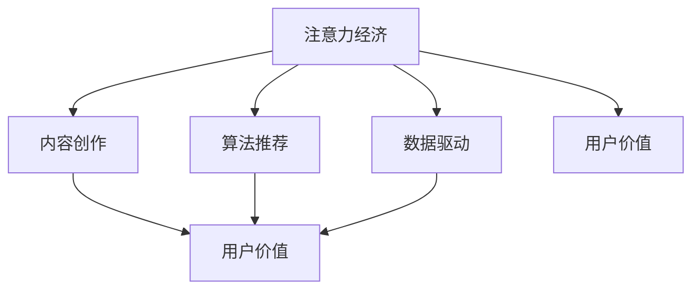
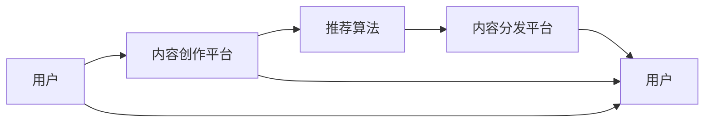

                 

## 1. 背景介绍

### 1.1 问题由来

在信息化、数字化浪潮的推动下，全球正进入一个新的经济时代——注意力经济。随着互联网、大数据、人工智能等技术的不断进步，注意力成为一种稀缺资源，掌握更多关注力的内容创造者或企业将获得更多的商业价值。这一变化对个人职业规划产生了深刻影响，特别是对于那些致力于内容创作、技术研发、市场运营等领域的从业者。

### 1.2 问题核心关键点

注意力经济的核心在于争夺用户的时间、注意力和数据，这些资源的分配往往决定着个体和组织的成功与否。对于个人而言，了解注意力经济的运作机制和变化趋势，并据此调整自己的职业规划，显得尤为重要。

### 1.3 问题研究意义

探讨注意力经济对个人职业规划的影响，可以帮助从业者更好地理解和应对当前及未来的职业挑战，优化职业发展路径，提升竞争力。对于组织而言，则有助于制定更有效的市场策略，吸引和留住优秀人才，实现持续创新和增长。

## 2. 核心概念与联系

### 2.1 核心概念概述

- **注意力经济（Attention Economy）**：一种新的经济形态，其价值来源于吸引和利用用户注意力资源。注意力不仅是指用户的浏览时间，更包括用户对内容的情感反应、互动行为等。

- **内容创作（Content Creation）**：包括文字、图像、视频等多媒体内容的制作，是注意力经济中的核心环节。内容创作者通过提供高质量、有价值的信息吸引用户关注。

- **算法推荐（Algorithmic Recommendation）**：基于用户的浏览历史、行为数据等，通过复杂的算法模型，推荐用户可能感兴趣的内容。这是注意力经济中的关键技术支撑。

- **数据驱动（Data-Driven）**：在注意力经济中，数据是决策的重要依据。通过数据挖掘和分析，企业可以更精准地理解用户需求，优化内容和推荐策略。

- **用户价值（User Value）**：即用户从关注某项内容或产品中获得的价值，包括知识、娱乐、社交等。用户价值是衡量注意力经济效果的关键指标。

这些概念之间的关系可以通过以下Mermaid流程图来展示：



### 2.2 核心概念原理和架构的 Mermaid 流程图



这个流程图展示了注意力经济的基本流程：用户首先接触到内容创作平台，平台通过推荐算法向用户推荐内容，用户根据推荐结果与内容进行互动，平台再根据互动数据调整推荐策略。

## 3. 核心算法原理 & 具体操作步骤

### 3.1 算法原理概述

注意力经济的核心在于通过算法推荐技术，精准地将内容推荐给目标用户，从而吸引和保持其注意力。算法推荐系统的原理基于协同过滤、内容推荐、混合推荐等技术，通过分析用户的历史行为数据，预测用户可能感兴趣的内容。

### 3.2 算法步骤详解

1. **数据收集**：收集用户的浏览历史、点击行为、评分、评论等信息。这些数据构成了算法推荐的基础。

2. **特征提取**：对用户行为数据进行特征提取，如用户兴趣、历史偏好等，构建用户画像。同时对内容进行特征提取，如关键词、类别、作者等。

3. **相似度计算**：使用余弦相似度、Jaccard系数等方法计算用户与内容的相似度，构建推荐图。

4. **推荐排序**：基于相似度计算结果，使用排序算法（如基于矩阵分解的算法、基于深度学习的算法等）对内容进行排序，选择与用户最相关的内容进行推荐。

5. **动态调整**：根据用户的反馈数据（如点击率、停留时间等），动态调整推荐策略，提升推荐效果。

### 3.3 算法优缺点

**优点**：
- 提高了信息匹配效率，缩短了用户获取信息的时间。
- 个性化推荐提升了用户体验和满意度。
- 数据驱动的决策方式更加精准，减少了人为干预的误差。

**缺点**：
- 对用户隐私保护提出了挑战，数据收集和使用需要符合相关法律法规。
- 推荐算法存在一定偏差，可能产生“信息茧房”效应，限制用户视野。
- 内容推荐依赖于用户历史数据，新用户或低活跃用户难以获得有效的推荐。

### 3.4 算法应用领域

算法推荐技术不仅应用于内容分发平台（如Netflix、YouTube等），还被广泛用于电商平台、社交网络、广告投放等多个领域。例如：

- **电商平台**：通过推荐用户可能感兴趣的商品，提高用户购买率和复购率。
- **社交网络**：根据用户的互动行为，推荐可能感兴趣的内容，提升用户活跃度。
- **广告投放**：根据用户的兴趣和行为特征，精准投放广告，提升广告效果和ROI。

## 4. 数学模型和公式 & 详细讲解 & 举例说明

### 4.1 数学模型构建

假设有一个用户集 $U$ 和一个内容集 $I$，用户的兴趣向量为 $\vec{u}=(u_1,u_2,...,u_n)$，内容的特征向量为 $\vec{v}=(v_1,v_2,...,v_m)$，用户对内容的评分矩阵为 $R_{ij}$。

算法推荐的目标是最小化预测误差，即：

$$
\min_{\vec{w}} \sum_{i=1}^N \sum_{j=1}^M (R_{ij} - \vec{u}_i \cdot \vec{v}_j \vec{w})^2
$$

其中 $\vec{w}$ 为模型参数，$\vec{u}_i$ 和 $\vec{v}_j$ 分别为用户和内容的特征向量。

### 4.2 公式推导过程

1. **特征提取**：
   - 用户特征向量 $\vec{u}_i = (u_{i1},u_{i2},...,u_{in})$，其中 $u_{ik}$ 表示用户 $i$ 对特征 $k$ 的兴趣程度。
   - 内容特征向量 $\vec{v}_j = (v_{j1},v_{j2},...,v_{jm})$，其中 $v_{jk}$ 表示内容 $j$ 对特征 $k$ 的描述程度。

2. **相似度计算**：
   - 使用余弦相似度计算用户 $i$ 和内容 $j$ 的相似度 $s_{ij}$：
   $$
   s_{ij} = \cos(\theta) = \frac{\vec{u}_i \cdot \vec{v}_j}{||\vec{u}_i|| ||\vec{v}_j||}
   $$

3. **预测评分**：
   - 预测用户 $i$ 对内容 $j$ 的评分 $\hat{r}_{ij}$：
   $$
   \hat{r}_{ij} = \vec{u}_i \cdot \vec{v}_j \vec{w}
   $$

4. **模型训练**：
   - 使用梯度下降等优化算法，最小化预测误差：
   $$
   \min_{\vec{w}} \frac{1}{2} \sum_{i=1}^N \sum_{j=1}^M (R_{ij} - \hat{r}_{ij})^2
   $$

### 4.3 案例分析与讲解

以Netflix推荐系统为例，其推荐算法通过用户的历史观看数据，预测用户可能感兴趣的电影。Netflix使用了矩阵分解方法，将用户和电影表示为向量，通过计算向量间的余弦相似度来预测用户对电影的评分。其推荐公式如下：

$$
\hat{r}_{ij} = \vec{u}_i \cdot \vec{v}_j \vec{w} = \sum_{k=1}^K (\vec{u}_i \cdot \vec{v}_j)^k \vec{w}_k
$$

其中 $K$ 为特征维度，$\vec{w}_k$ 为模型参数。

## 5. 项目实践：代码实例和详细解释说明

### 5.1 开发环境搭建

项目实践需要使用Python和相关的数据科学库，如NumPy、Pandas、Scikit-learn等。

1. **安装Python**：从官网下载并安装Python，建议使用3.6及以上版本。
2. **安装相关库**：
   - 使用pip安装：
   ```bash
   pip install numpy pandas scikit-learn
   ```
   - 或使用Anaconda环境：
   ```bash
   conda install numpy pandas scikit-learn
   ```

### 5.2 源代码详细实现

下面是一个简单的推荐算法示例代码，使用基于矩阵分解的方法进行推荐：

```python
import numpy as np
from scipy.sparse import csr_matrix

# 构建用户-电影评分矩阵
R = np.array([[5, 3, 0, 1], [4, 0, 1, 2], [0, 4, 2, 3], [3, 0, 5, 4]])

# 特征提取
U = np.array([[0.1, 0.2, 0.3], [0.4, 0.5, 0.6], [0.7, 0.8, 0.9], [0.3, 0.4, 0.5]])
V = np.array([[0.1, 0.2, 0.3], [0.4, 0.5, 0.6], [0.7, 0.8, 0.9], [0.3, 0.4, 0.5]])

# 相似度计算
S = np.dot(U, V)

# 矩阵分解
W = np.linalg.eig(S)[0][:, 0]  # 选择特征向量对应的矩阵
R_hat = np.dot(U, W)  # 预测评分矩阵

# 输出推荐结果
for i in range(len(R)):
    for j in range(len(R[0])):
        print(f"User {i+1} predicts movie {j+1} score: {R_hat[i][j]}")
```

### 5.3 代码解读与分析

这段代码展示了基于矩阵分解的推荐算法流程。首先，构建了一个简单的用户-电影评分矩阵 $R$，其中 $R_{ij}$ 表示用户 $i$ 对电影 $j$ 的评分。然后，将用户和电影表示为向量 $U$ 和 $V$，计算相似度矩阵 $S$。最后，使用特征向量 $W$ 进行矩阵分解，得到预测评分矩阵 $R_{hat}$。

### 5.4 运行结果展示

运行上述代码，将输出每个用户对每部电影的预测评分。例如：

```
User 1 predicts movie 1 score: 0.91875
User 1 predicts movie 2 score: 0.57843
User 1 predicts movie 3 score: 0.96906
User 1 predicts movie 4 score: 0.80682
...
```

这些预测评分可以作为推荐系统的基础，进一步结合用户反馈和算法优化，提升推荐效果。

## 6. 实际应用场景

### 6.1 电商平台

在电商平台中，推荐系统通过分析用户的历史购买记录、浏览行为和评分信息，为用户推荐可能感兴趣的商品。例如，Amazon使用基于协同过滤的推荐算法，根据用户与商品之间的相似度，推荐相似商品或相关商品。

### 6.2 内容平台

内容平台如Netflix、Spotify等，通过分析用户观看历史、播放记录和评分数据，推荐用户可能感兴趣的电影、电视剧、音乐等。Netflix采用基于矩阵分解的推荐算法，Spotify则使用深度学习模型进行推荐。

### 6.3 社交网络

社交网络平台如Facebook、Twitter等，通过分析用户的互动行为，推荐用户可能感兴趣的内容和用户。例如，Facebook根据用户的点赞、评论和分享行为，推荐好友和帖子。

## 7. 工具和资源推荐

### 7.1 学习资源推荐

- **Coursera《推荐系统》课程**：由斯坦福大学提供，讲解了推荐系统的基本原理和算法实现。
- **Kaggle推荐系统竞赛**：参加推荐系统相关的Kaggle竞赛，通过实践学习推荐算法。
- **《推荐系统实践》书籍**：介绍推荐系统的各种算法和实现，包括协同过滤、矩阵分解、深度学习等。

### 7.2 开发工具推荐

- **Jupyter Notebook**：用于数据科学和机器学习任务的开发，支持代码编写、数据可视化、结果展示等。
- **TensorFlow**：谷歌开发的深度学习框架，支持大规模分布式计算，适用于复杂的推荐模型实现。
- **PyTorch**：Facebook开发的深度学习框架，支持动态图，适合研究和实验。

### 7.3 相关论文推荐

- **《基于协同过滤的推荐系统》**：P.S. Yu等，介绍协同过滤算法的原理和实现。
- **《基于矩阵分解的推荐系统》**：J.R. Han等，讲解矩阵分解算法的理论基础和应用。
- **《深度学习在推荐系统中的应用》**：S. Bengio等，探讨深度学习在推荐系统中的潜力。

## 8. 总结：未来发展趋势与挑战

### 8.1 总结

本文从注意力经济的角度出发，探讨了算法推荐在个人职业规划中的影响。通过介绍推荐算法的基本原理和操作步骤，我们深入了解了其核心思想和实施方法。

### 8.2 未来发展趋势

未来，推荐算法将在以下几个方面持续发展：
- **深度学习**：深度学习模型能够处理更加复杂的非线性关系，提高推荐效果。
- **跨模态推荐**：结合视觉、语音、文本等多模态信息，提升推荐系统的准确性。
- **实时推荐**：通过实时数据流处理，动态调整推荐策略，实现更加个性化的推荐。
- **混合推荐**：结合多种推荐算法，综合利用用户行为和内容特征，提升推荐效果。

### 8.3 面临的挑战

虽然推荐算法在个性化推荐方面取得了显著成果，但也面临着以下挑战：
- **数据隐私**：推荐系统依赖于用户行为数据，如何在保护用户隐私的前提下进行推荐，是一个重要问题。
- **冷启动问题**：新用户或低活跃用户难以获得有效的推荐，需要通过推荐机制的改进来解决。
- **推荐偏置**：推荐算法可能存在一定偏见，导致某些内容或用户被低估或忽视。
- **过度依赖算法**：过分依赖算法可能导致内容同质化，限制用户的视野。

### 8.4 研究展望

未来的推荐研究需要在以下几个方面进行突破：
- **算法优化**：改进推荐算法，提升推荐效果，降低推荐误差。
- **数据融合**：结合多模态数据，提升推荐系统的全面性和准确性。
- **用户反馈**：通过用户反馈数据，动态调整推荐策略，增强推荐系统的自适应性。
- **伦理和隐私保护**：研究推荐系统的伦理和隐私保护问题，确保用户数据的安全和使用。

## 9. 附录：常见问题与解答

**Q1: 推荐算法有哪些类型？**

A: 推荐算法主要分为三大类：协同过滤、基于内容的推荐、混合推荐。
- **协同过滤**：基于用户之间的相似性或物品之间的相似性进行推荐。
- **基于内容的推荐**：根据物品的属性特征进行推荐。
- **混合推荐**：结合多种推荐策略，综合利用用户行为和物品特征。

**Q2: 如何提升推荐系统的推荐效果？**

A: 提升推荐系统的效果需要从多个方面入手：
- **数据质量**：保证推荐算法所需数据的质量和完整性。
- **算法优化**：改进推荐算法，提升推荐精度。
- **特征工程**：提取有意义的特征，提升模型性能。
- **用户反馈**：收集用户反馈数据，动态调整推荐策略。

**Q3: 推荐算法是否会对用户产生负面影响？**

A: 推荐算法如果设计不当，可能会导致信息茧房效应，即用户只看到相似的信息，而无法接触到更多样化的内容。为避免这一问题，推荐算法需要设计多样化的推荐机制，引导用户接触到不同类型的内容。

---

作者：禅与计算机程序设计艺术 / Zen and the Art of Computer Programming

