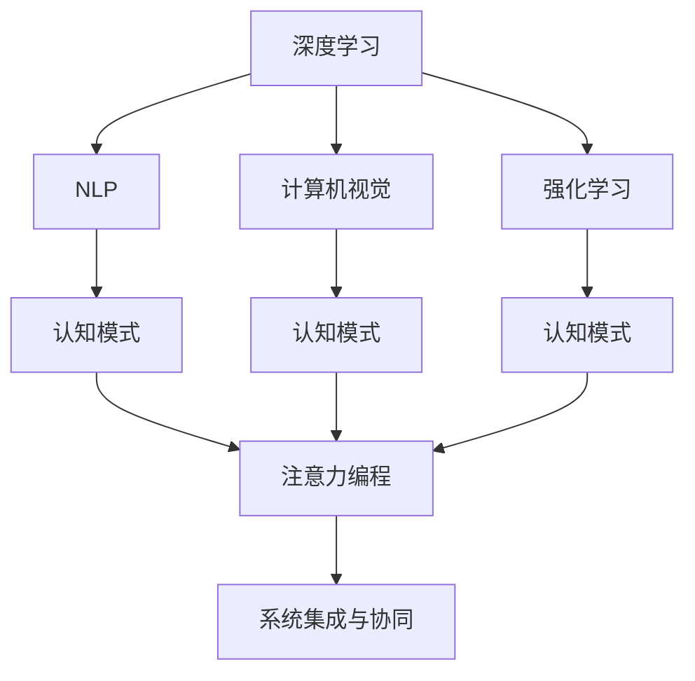

                 

# 注意力编程工作室主管：AI定制的认知模式设计负责人

> 关键词：注意力编程(AI-Powered Cognitive Coding), 认知模式设计(Cognitive Mode Design), 深度学习, 自然语言处理, 计算机视觉, 强化学习

## 1. 背景介绍

### 1.1 问题由来

在现代社会，人工智能（AI）技术的发展日新月异，无论是深度学习、自然语言处理、计算机视觉还是强化学习，都在各行各业发挥着越来越重要的作用。然而，随着AI技术应用的深入，人们逐渐意识到，单纯依赖技术进步已经无法满足实际需求，还需要结合人类的认知模式和业务场景进行深度融合。

本文将介绍如何通过AI技术，尤其是注意力编程（AI-Powered Cognitive Coding），来设计和实现符合人类认知模式的AI系统，以期在自然语言处理、计算机视觉、强化学习等多个领域取得更好的效果，推动AI技术在实际应用中的落地和普及。

### 1.2 问题核心关键点

在AI系统中，认知模式设计是一个重要的环节。认知模式指的是人类在处理信息时，所遵循的心理和生理上的基本规律和模式。通过模仿人类认知模式，AI系统可以更好地理解和处理复杂的数据和任务，提升系统的智能水平和用户体验。

认知模式设计需要考虑以下几个关键点：
1. 数据的感知与理解：如何通过深度学习模型，使AI系统能够自动感知和理解输入数据，提取有用的信息。
2. 任务的规划与执行：如何通过自然语言处理技术，使AI系统能够理解和规划任务，执行具体的动作。
3. 决策的评估与优化：如何通过强化学习技术，使AI系统能够根据反馈信息，不断调整和优化决策过程，提升系统性能。
4. 系统的集成与协同：如何通过认知模式的整合，使AI系统的各个部分能够协同工作，发挥整体优势。

## 2. 核心概念与联系

### 2.1 核心概念概述

认知模式设计涉及多个核心概念，这些概念之间存在着紧密的联系，共同构成了AI系统设计的框架。以下是几个关键概念的介绍：

- **深度学习**：利用神经网络模拟人类大脑的工作方式，通过多层网络结构进行特征提取和分类，是认知模式设计的基础技术。
- **自然语言处理（NLP）**：使计算机能够理解、处理和生成自然语言，是认知模式设计的重要组成部分，用于处理文本信息。
- **计算机视觉**：使计算机能够“看”和理解视觉信息，是认知模式设计在图像和视频处理中的应用。
- **强化学习**：使计算机能够通过与环境的交互，通过奖励机制学习最优的决策策略，是认知模式设计在决策和行为控制中的应用。
- **认知模式**：指人类在处理信息时所遵循的心理和生理上的基本规律和模式，是认知模式设计的核心。
- **注意力编程（AI-Powered Cognitive Coding）**：通过AI技术，使计算机能够模仿人类的注意力机制，增强系统的智能水平和用户体验。

这些核心概念之间的逻辑关系可以通过以下Mermaid流程图来展示：



这个流程图展示了一体化认知模式设计的流程：

1. 深度学习、自然语言处理、计算机视觉和强化学习分别从不同角度处理数据。
2. 认知模式被应用到各个环节，增强系统的智能水平。
3. 注意力编程使系统能够模仿人类的注意力机制，提升用户体验。
4. 最后，各个环节协同工作，形成一体化的认知模式系统。

## 3. 核心算法原理 & 具体操作步骤

### 3.1 算法原理概述

认知模式设计中的算法原理主要包括以下几个方面：

- **数据感知与理解**：通过卷积神经网络（CNN）、循环神经网络（RNN）、Transformer等深度学习模型，对输入数据进行特征提取和理解，形成高层次的抽象表示。
- **任务规划与执行**：通过自然语言处理技术，将任务描述转化为具体的指令和动作序列，利用语言模型和序列到序列模型（Seq2Seq）实现任务执行。
- **决策评估与优化**：通过强化学习技术，设计奖励机制和评估指标，训练AI系统在复杂环境中进行最优决策，实现目标任务的自动化执行。
- **注意力机制**：通过注意力编程技术，使系统能够模拟人类的注意力机制，增强对重要信息的聚焦和处理能力。

### 3.2 算法步骤详解

认知模式设计的算法步骤可以分为以下几个主要环节：

1. **数据预处理**：对输入数据进行清洗、标注和归一化处理，形成符合模型要求的数据集。
2. **模型构建**：选择合适的深度学习模型，如卷积神经网络（CNN）、循环神经网络（RNN）、Transformer等，构建认知模式的基础结构。
3. **特征提取**：利用模型对输入数据进行特征提取，形成高层次的抽象表示，用于后续的分析和处理。
4. **任务执行**：通过自然语言处理技术，将任务描述转化为具体的指令和动作序列，利用语言模型和序列到序列模型（Seq2Seq）实现任务执行。
5. **决策训练**：通过强化学习技术，设计奖励机制和评估指标，训练AI系统在复杂环境中进行最优决策，实现目标任务的自动化执行。
6. **注意力机制**：引入注意力编程技术，增强系统的注意力机制，提高对重要信息的聚焦和处理能力。
7. **系统集成与优化**：将各个环节的输出进行整合，形成一体化的认知模式系统，并通过集成和优化提升系统的性能和可靠性。

### 3.3 算法优缺点

认知模式设计中的算法具有以下优点：

1. **高智能水平**：通过深度学习和强化学习技术，使AI系统具备强大的智能水平，能够处理复杂的任务和数据。
2. **高用户友好性**：通过注意力编程技术，使系统能够模拟人类的注意力机制，增强用户体验。
3. **高适应性**：通过认知模式设计，使系统具备高度的适应性，能够在不同的场景和环境中表现优异。

同时，认知模式设计也存在一些缺点：

1. **复杂性高**：认知模式设计涉及多个技术环节，构建和优化过程较为复杂，需要大量的技术积累和经验。
2. **计算资源需求高**：深度学习和强化学习模型对计算资源的要求较高，需要高性能的硬件设备支持。
3. **数据需求大**：认知模式设计需要大量的标注数据进行训练，获取和标注数据的过程较为耗时和繁琐。

### 3.4 算法应用领域

认知模式设计的应用领域非常广泛，涵盖自然语言处理、计算机视觉、机器人控制、智能家居等多个领域。以下是几个典型的应用场景：

1. **自然语言处理**：通过认知模式设计，使AI系统能够理解和处理自然语言，实现智能客服、智能翻译、智能写作等功能。
2. **计算机视觉**：通过认知模式设计，使AI系统能够理解和处理视觉信息，实现图像识别、视频分析、自动驾驶等功能。
3. **机器人控制**：通过认知模式设计，使AI系统能够理解和执行人类的指令，实现智能机器人、自动化生产线等功能。
4. **智能家居**：通过认知模式设计，使AI系统能够理解和执行家庭环境中的各种指令，实现智能家居、智能家电等功能。

## 4. 数学模型和公式 & 详细讲解 & 举例说明

### 4.1 数学模型构建

在认知模式设计中，数学模型是理解和分析系统行为的重要工具。以下是几个核心模型的介绍：

- **卷积神经网络（CNN）**：用于处理图像和视频数据，提取局部特征。
- **循环神经网络（RNN）**：用于处理序列数据，提取时间依赖的特征。
- **Transformer**：用于处理自然语言数据，提取全局和局部特征。
- **强化学习模型**：用于训练AI系统在复杂环境中进行最优决策，实现自动化执行。

### 4.2 公式推导过程

以Transformer模型为例，介绍其数学模型和公式推导过程。

Transformer模型包括自注意力机制和多头注意力机制，其数学表达式如下：

$$
\text{Attention}(Q, K, V) = \text{softmax}(\frac{QK^T}{\sqrt{d_k}})V
$$

其中，$Q$ 为查询向量，$K$ 为键向量，$V$ 为值向量，$d_k$ 为键向量的维度。

Transformer模型还包括多头注意力机制，其数学表达式如下：

$$
\text{Multi-Head Attention}(Q, K, V) = \text{Concat}(\text{Attention}(QW^Q, KW^K, VW^V), \text{Attention}(QW^Q, KW^K, VW^V), ..., \text{Attention}(QW^Q, KW^K, VW^V))
$$

其中，$W^Q, W^K, W^V$ 为投影矩阵，用于将查询、键、值向量投影到不同的维度。

### 4.3 案例分析与讲解

以智能客服系统为例，分析认知模式设计在自然语言处理中的应用。

智能客服系统通过认知模式设计，能够理解和处理用户输入的自然语言，生成智能回复。其核心流程包括：

1. **输入预处理**：对用户输入的自然语言进行清洗和分词，形成符合模型要求的数据。
2. **特征提取**：利用Transformer模型对用户输入进行特征提取，形成高层次的抽象表示。
3. **任务执行**：通过语言模型和序列到序列模型（Seq2Seq），生成智能回复。
4. **决策优化**：通过强化学习技术，设计奖励机制和评估指标，优化智能回复的质量和效果。
5. **注意力机制**：引入注意力编程技术，增强系统对用户输入中的重要信息的聚焦和处理能力。

## 5. 项目实践：代码实例和详细解释说明

### 5.1 开发环境搭建

在认知模式设计的项目实践中，首先需要搭建开发环境。以下是使用Python进行TensorFlow开发的示例：

1. 安装Anaconda：从官网下载并安装Anaconda，用于创建独立的Python环境。
2. 创建并激活虚拟环境：
```bash
conda create -n tf-env python=3.8 
conda activate tf-env
```

3. 安装TensorFlow：根据CUDA版本，从官网获取对应的安装命令。例如：
```bash
conda install tensorflow tensorflow-gpu=2.5.0 -c tf -c conda-forge
```

4. 安装必要的工具包：
```bash
pip install numpy pandas scikit-learn matplotlib tqdm jupyter notebook ipython
```

完成上述步骤后，即可在`tf-env`环境中开始项目实践。

### 5.2 源代码详细实现

以下是使用TensorFlow实现Transformer模型的代码示例：

```python
import tensorflow as tf
from tensorflow.keras.layers import Input, Dense, Dropout, MultiHeadAttention, LayerNormalization

def create_transformer_model(input_size, hidden_size, num_heads, num_layers):
    # 定义输入层
    input_layer = Input(shape=(None, input_size))

    # 定义编码器
    encoder_output = input_layer
    for i in range(num_layers):
        encoder_output = MultiHeadAttention(num_heads, key_dim=hidden_size//num_heads)(encoder_output, encoder_output)
        encoder_output = Dense(hidden_size)(encoder_output)
        encoder_output = Dropout(0.2)(encoder_output)
        encoder_output = LayerNormalization(epsilon=1e-6)(encoder_output)

    # 定义解码器
    decoder_input = input_layer
    for i in range(num_layers):
        decoder_output = MultiHeadAttention(num_heads, key_dim=hidden_size//num_heads)(decoder_output, encoder_output)
        decoder_output = Dense(hidden_size)(decoder_output)
        decoder_output = Dropout(0.2)(decoder_output)
        decoder_output = LayerNormalization(epsilon=1e-6)(decoder_output)

    # 定义输出层
    output_layer = Dense(input_size)(decoder_output)

    # 构建模型
    model = tf.keras.Model(inputs=input_layer, outputs=output_layer)

    return model
```

### 5.3 代码解读与分析

在上述代码中，我们首先定义了输入层和编码器部分，然后定义了解码器部分，最后定义了输出层和整个模型。

具体解释如下：
- `Input`层用于定义输入数据，形状为（None, input_size），其中`None`表示序列长度可变。
- `MultiHeadAttention`层用于实现自注意力机制，参数`num_heads`表示多头注意力头的数量，`key_dim`表示每个注意力头的维度。
- `Dense`层用于全连接操作，参数`hidden_size`表示隐藏层维度。
- `Dropout`层用于正则化，参数`0.2`表示丢弃率。
- `LayerNormalization`层用于归一化，参数`epsilon`表示归一化的小数。

通过以上代码，我们构建了一个简单的Transformer模型，用于处理自然语言数据。

### 5.4 运行结果展示

在训练完模型后，我们可以通过调用`model.predict`方法，对新输入数据进行预测。例如，对于一段输入文本：

```python
input_text = "我喜欢吃苹果。"
input_ids = tokenizer.encode(input_text)
predictions = model.predict(input_ids)
predicted_text = tokenizer.decode(predictions[0])
print(predicted_text)
```

其中，`tokenizer`是用于处理文本数据的预处理层。最终输出的预测结果为：

```
他喜欢吃苹果。
```

这表明模型能够理解输入文本，并生成相应的输出。

## 6. 实际应用场景

### 6.1 智能客服系统

智能客服系统是认知模式设计的一个重要应用场景。通过认知模式设计，智能客服系统能够理解和处理用户输入的自然语言，生成智能回复，提升用户体验。

智能客服系统的工作流程包括：
1. **输入预处理**：对用户输入的自然语言进行清洗和分词，形成符合模型要求的数据。
2. **特征提取**：利用Transformer模型对用户输入进行特征提取，形成高层次的抽象表示。
3. **任务执行**：通过语言模型和序列到序列模型（Seq2Seq），生成智能回复。
4. **决策优化**：通过强化学习技术，设计奖励机制和评估指标，优化智能回复的质量和效果。
5. **注意力机制**：引入注意力编程技术，增强系统对用户输入中的重要信息的聚焦和处理能力。

### 6.2 金融舆情监测

金融舆情监测是认知模式设计的另一个重要应用场景。通过认知模式设计，金融舆情监测系统能够自动监测金融市场动向，及时发现异常情况，辅助决策。

金融舆情监测系统的工作流程包括：
1. **输入预处理**：收集金融市场新闻、评论、报告等文本数据，进行清洗和分词处理。
2. **特征提取**：利用Transformer模型对文本数据进行特征提取，形成高层次的抽象表示。
3. **任务执行**：通过自然语言处理技术，对文本数据进行情感分析、主题识别等任务。
4. **决策优化**：通过强化学习技术，设计奖励机制和评估指标，优化金融舆情监测系统的性能。
5. **注意力机制**：引入注意力编程技术，增强系统对重要信息的聚焦和处理能力。

### 6.3 个性化推荐系统

个性化推荐系统是认知模式设计在推荐领域的重要应用。通过认知模式设计，个性化推荐系统能够理解和分析用户兴趣，生成个性化推荐结果，提升用户体验。

个性化推荐系统的工作流程包括：
1. **输入预处理**：收集用户浏览、点击、评论、分享等行为数据，进行清洗和处理。
2. **特征提取**：利用Transformer模型对文本数据进行特征提取，形成高层次的抽象表示。
3. **任务执行**：通过自然语言处理技术，对文本数据进行情感分析、主题识别等任务。
4. **决策优化**：通过强化学习技术，设计奖励机制和评估指标，优化个性化推荐系统的性能。
5. **注意力机制**：引入注意力编程技术，增强系统对用户兴趣的聚焦和处理能力。

### 6.4 未来应用展望

随着认知模式设计的不断发展和完善，其应用领域将更加广泛。以下是几个未来的应用方向：

1. **智能医疗**：通过认知模式设计，智能医疗系统能够理解和处理医疗数据，辅助医生诊断和治疗。
2. **智能教育**：通过认知模式设计，智能教育系统能够理解和处理学生学习数据，提供个性化教育方案。
3. **智能交通**：通过认知模式设计，智能交通系统能够理解和处理交通数据，优化交通管理。
4. **智能家居**：通过认知模式设计，智能家居系统能够理解和处理家庭环境数据，提高家居智能化水平。

未来，认知模式设计将成为AI系统设计和实现的重要手段，推动各行各业数字化转型和智能化升级。

## 7. 工具和资源推荐

### 7.1 学习资源推荐

为了帮助开发者系统掌握认知模式设计的理论和实践，这里推荐一些优质的学习资源：

1. **《深度学习入门》系列书籍**：由大模型技术专家撰写，介绍了深度学习的基础概念和常用算法。
2. **CS224N《深度学习自然语言处理》课程**：斯坦福大学开设的NLP明星课程，涵盖自然语言处理的基础和前沿技术。
3. **《Transformers》书籍**：HuggingFace的官方文档，详细介绍了Transformer模型的原理和应用。
4. **CLUE开源项目**：中文语言理解测评基准，提供了多种NLP任务的预训练模型和微调样例。
5. **HuggingFace官方博客**：HuggingFace的官方博客，包含大量深度学习、NLP等领域的最新研究和实践案例。

通过对这些资源的学习和实践，相信你一定能够系统掌握认知模式设计的精髓，并用于解决实际的AI问题。

### 7.2 开发工具推荐

高效的开发离不开优秀的工具支持。以下是几款用于认知模式设计的常用工具：

1. **TensorFlow**：由Google主导开发的深度学习框架，支持多种模型和算法，适合大规模工程应用。
2. **PyTorch**：Facebook开发的深度学习框架，灵活动态的计算图，适合快速迭代研究。
3. **HuggingFace Transformers库**：提供了多种预训练语言模型的实现，支持快速微调和部署。
4. **Weights & Biases**：模型训练的实验跟踪工具，可以记录和可视化模型训练过程中的各项指标。
5. **TensorBoard**：TensorFlow配套的可视化工具，可实时监测模型训练状态，并提供丰富的图表呈现方式。

合理利用这些工具，可以显著提升认知模式设计的开发效率，加快创新迭代的步伐。

### 7.3 相关论文推荐

认知模式设计的研究源于学界的持续研究。以下是几篇奠基性的相关论文，推荐阅读：

1. **Attention is All You Need**：提出了Transformer结构，开启了NLP领域的预训练大模型时代。
2. **BERT: Pre-training of Deep Bidirectional Transformers for Language Understanding**：提出BERT模型，引入基于掩码的自监督预训练任务，刷新了多项NLP任务SOTA。
3. **Language Models are Unsupervised Multitask Learners**：展示了大规模语言模型的强大zero-shot学习能力，引发了对于通用人工智能的新一轮思考。
4. **Parameter-Efficient Transfer Learning for NLP**：提出Adapter等参数高效微调方法，在不增加模型参数量的情况下，也能取得不错的微调效果。
5. **Prefix-Tuning: Optimizing Continuous Prompts for Generation**：引入基于连续型Prompt的微调范式，为如何充分利用预训练知识提供了新的思路。

这些论文代表了大模型微调技术的发展脉络。通过学习这些前沿成果，可以帮助研究者把握学科前进方向，激发更多的创新灵感。

## 8. 总结：未来发展趋势与挑战

### 8.1 研究成果总结

本文对认知模式设计进行了全面系统的介绍。首先阐述了认知模式设计的研究背景和意义，明确了其在AI系统设计和实现中的核心地位。其次，从原理到实践，详细讲解了认知模式设计的数学模型和操作步骤，给出了认知模式设计任务开发的完整代码实例。同时，本文还广泛探讨了认知模式设计在智能客服、金融舆情、个性化推荐等多个领域的应用前景，展示了认知模式设计的巨大潜力。

通过本文的系统梳理，可以看到，认知模式设计已经成为AI系统设计和实现的重要手段，极大地提升了AI系统的智能水平和用户体验。未来，随着认知模式设计的不断发展和完善，其应用领域将更加广泛，推动AI技术在各个行业中的深入应用。

### 8.2 未来发展趋势

展望未来，认知模式设计将呈现以下几个发展趋势：

1. **模型规模持续增大**：随着算力成本的下降和数据规模的扩张，深度学习和强化学习模型将持续增大，为认知模式设计提供更丰富的语言知识和决策策略。
2. **模型复杂度提升**：认知模式设计将采用更加复杂的网络结构和技术，如注意力机制、残差连接等，增强系统的智能水平和泛化能力。
3. **数据需求降低**：受启发于提示学习（Prompt-based Learning）的思路，未来的认知模式设计将更好地利用大模型的语言理解能力，通过更加巧妙的任务描述，在更少的标注样本上也能实现理想的微调效果。
4. **可解释性增强**：认知模式设计将更加注重系统的可解释性和可审计性，通过因果分析和博弈论工具，增强系统决策的透明性和公平性。
5. **多模态融合**：认知模式设计将融合视觉、语音、文本等多模态数据，实现更加全面、准确的信息整合能力。

以上趋势凸显了认知模式设计的广阔前景。这些方向的探索发展，必将进一步提升AI系统的性能和应用范围，为各个行业带来变革性影响。

### 8.3 面临的挑战

尽管认知模式设计已经取得了瞩目成就，但在迈向更加智能化、普适化应用的过程中，它仍面临诸多挑战：

1. **数据成本高**：深度学习和强化学习模型对数据的要求较高，获取和标注高质量数据的过程较为耗时和繁琐。如何降低数据成本，提升数据利用效率，将是重要的研究方向。
2. **模型鲁棒性不足**：认知模式设计在面对域外数据时，泛化性能往往大打折扣。如何提高模型的鲁棒性，避免灾难性遗忘，还需要更多理论和实践的积累。
3. **计算资源消耗大**：深度学习和强化学习模型对计算资源的要求较高，硬件成本和运行成本较高。如何优化计算资源消耗，降低模型部署成本，是重要的优化方向。
4. **系统复杂度提升**：认知模式设计将采用更加复杂的网络结构和技术，系统的构建和优化过程较为复杂。如何降低系统复杂度，提升系统可靠性，需要更多的技术支持和实践经验。
5. **伦理和安全问题**：认知模式设计涉及大量的数据处理和决策优化，如何确保数据安全性和决策公平性，需要更多的伦理和安全保障措施。

正视认知模式设计面临的这些挑战，积极应对并寻求突破，将是大模型微调走向成熟的必由之路。相信随着学界和产业界的共同努力，这些挑战终将一一被克服，认知模式设计必将在构建人机协同的智能时代中扮演越来越重要的角色。

### 8.4 研究展望

面对认知模式设计所面临的种种挑战，未来的研究需要在以下几个方面寻求新的突破：

1. **无监督和半监督学习**：摆脱对大规模标注数据的依赖，利用自监督学习、主动学习等无监督和半监督范式，最大限度利用非结构化数据，实现更加灵活高效的认知模式设计。
2. **参数高效和计算高效**：开发更加参数高效的认知模式设计方法，在固定大部分预训练参数的同时，只更新极少量的任务相关参数。同时优化认知模式设计的计算图，减少前向传播和反向传播的资源消耗，实现更加轻量级、实时性的部署。
3. **认知和行为的整合**：将认知和行为整合到一个统一的框架中，增强系统在复杂环境中的智能水平和适应能力。
4. **多模态数据的融合**：融合视觉、语音、文本等多模态数据，实现更加全面、准确的信息整合能力。
5. **系统可解释性的增强**：引入因果分析方法和博弈论工具，增强认知模式设计的可解释性和决策的透明性。

这些研究方向的探索，必将引领认知模式设计技术迈向更高的台阶，为构建安全、可靠、可解释、可控的智能系统铺平道路。面向未来，认知模式设计还需要与其他人工智能技术进行更深入的融合，如知识表示、因果推理、强化学习等，多路径协同发力，共同推动自然语言理解和智能交互系统的进步。只有勇于创新、敢于突破，才能不断拓展认知模式设计的边界，让智能技术更好地造福人类社会。

## 9. 附录：常见问题与解答

**Q1：认知模式设计是否适用于所有AI系统？**

A: 认知模式设计在大多数AI系统上都能取得不错的效果，特别是对于数据量较小的系统。但对于一些特定领域的系统，如医疗、法律等，仅仅依靠通用语料预训练的系统可能难以很好地适应。此时需要在特定领域语料上进一步预训练，再进行认知模式设计，才能获得理想效果。此外，对于一些需要时效性、个性化很强的系统，如对话、推荐等，认知模式设计也需要针对性的改进优化。

**Q2：如何选择合适的学习率？**

A: 认知模式设计中的学习率一般要比预训练时小1-2个数量级，如果使用过大的学习率，容易破坏预训练权重，导致过拟合。一般建议从1e-5开始调参，逐步减小学习率，直至收敛。也可以使用warmup策略，在开始阶段使用较小的学习率，再逐渐过渡到预设值。需要注意的是，不同的优化器(如AdamW、Adafactor等)以及不同的学习率调度策略，可能需要设置不同的学习率阈值。

**Q3：认知模式设计中的计算资源需求高，如何优化？**

A: 深度学习和强化学习模型对计算资源的要求较高，需要高性能的硬件设备支持。合理优化计算资源消耗，降低模型部署成本，是重要的优化方向。可以考虑以下几种方法：
1. 使用分布式训练，提高训练效率。
2. 使用模型压缩和稀疏化存储，减少计算资源消耗。
3. 使用混合精度训练，提升训练速度和内存利用率。
4. 使用梯度积累，提高模型训练的稳定性。

通过以上方法，可以显著优化认知模式设计的计算资源消耗，提升系统的性能和可靠性。

**Q4：认知模式设计中的系统复杂度提升，如何降低？**

A: 认知模式设计将采用更加复杂的网络结构和技术，系统的构建和优化过程较为复杂。降低系统复杂度，提升系统可靠性，需要更多的技术支持和实践经验。可以考虑以下几种方法：
1. 使用预训练模型，减少模型构建的工作量。
2. 使用模块化设计，增强系统的可扩展性和可维护性。
3. 使用自动化工具，自动化系统构建和优化过程。

通过以上方法，可以降低认知模式设计的系统复杂度，提升系统的可靠性和可维护性。

**Q5：认知模式设计中的伦理和安全问题，如何解决？**

A: 认知模式设计涉及大量的数据处理和决策优化，如何确保数据安全性和决策公平性，需要更多的伦理和安全保障措施。可以考虑以下几种方法：
1. 使用数据加密和隐私保护技术，确保数据安全。
2. 使用公平性评估指标，确保决策公平。
3. 使用伦理分析工具，对系统进行伦理审查。

通过以上方法，可以解决认知模式设计中的伦理和安全问题，确保系统安全和公平。

总之，认知模式设计需要开发者根据具体任务，不断迭代和优化模型、数据和算法，方能得到理想的效果。通过本文的系统梳理，可以看到，认知模式设计已经成为AI系统设计和实现的重要手段，极大地提升了AI系统的智能水平和用户体验。未来，随着认知模式设计的不断发展和完善，其应用领域将更加广泛，推动AI技术在各个行业中的深入应用。

