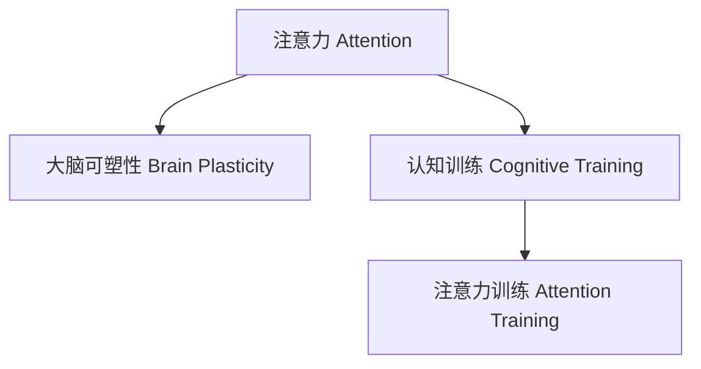

                 

## 1. 背景介绍

在信息化高度发展的今天，人类的注意力面临着前所未有的挑战。无论是工作还是学习，持续长时间的高效注意力投入变得日益困难。这种现象被称为注意力缺陷，已经引起了学界和产业界的广泛关注。如何通过技术手段提升人类注意力，已经成为一个重要且紧迫的问题。

### 1.1 问题由来

随着科技的进步，信息获取和处理的速度不断加快，人类面对的信息量呈指数级增长。在众多信息的干扰下，保持长时间稳定的注意力变得愈发困难。例如：
- 在工作和学习时，常常感到注意力难以集中，容易分心，导致效率低下。
- 面对海量信息，无法有效筛选重要内容，造成信息过载。
- 长时间使用电子设备，导致注意力分散，影响工作学习效果。

这些问题不仅影响了个人的生活质量和工作效率，还对社会生产力和整体创新能力造成了负面影响。因此，探索提升人类注意力的技术手段具有重要的实际意义。

### 1.2 问题核心关键点

要提升人类注意力，首先需要理解注意力的本质。注意力是指人脑对特定信息的聚焦程度，是一个复杂的认知过程。注意力训练的本质是利用科学方法和技术手段，促进大脑的可塑性，增强注意力的持久性和集中度。

注意力训练的核心在于以下几个方面：
- **神经科学理论**：理解注意力在神经机制上的实现，为训练提供科学依据。
- **算法实现**：开发基于神经科学原理的技术工具，实现对注意力的精准训练。
- **应用实践**：将注意力训练技术应用于实际场景中，观察和验证其效果。

本文将从神经科学、算法和应用三个方面系统介绍注意力训练的方法和实践，以期帮助读者提升自身的注意力水平。

## 2. 核心概念与联系

### 2.1 核心概念概述

在介绍注意力训练的具体方法之前，首先需要明确几个核心概念：

- **注意力(Attention)**：指人脑对特定信息的聚焦程度。注意力训练旨在提升注意力的持久性和集中度。
- **大脑可塑性(Brain Plasticity)**：指大脑在学习和训练过程中发生的结构和功能的改变。注意力训练正是利用这一特性，通过科学方法和技术手段促进大脑结构优化。
- **认知训练(Cognitive Training)**：指通过各种科学方法和技术手段，提升人的认知能力，包括记忆、思维、注意力等。

这些概念之间的逻辑关系可以通过以下Mermaid流程图来展示：



该流程图展示了大脑可塑性和认知训练与注意力训练的逻辑关系：
- 大脑可塑性是注意力训练的理论基础。
- 认知训练是注意力训练的上层目标。
- 注意力训练是实现认知训练的具体手段。

### 2.2 核心概念原理和架构

注意力训练的原理主要基于以下神经科学理论：
- **神经网络理论**：脑神经网络具有高度的可塑性，可以通过学习和训练不断优化。
- **突触可塑性(Synaptic Plasticity)**：突触连接强度可以通过学习和训练增强或减弱，从而改变神经元之间的信息传递效率。
- **海马体(Hippocampus)**：海马体在记忆和注意力转移中起着关键作用，通过训练可以促进海马体的结构和功能优化。

这些理论构成了注意力训练的科学基础。在技术实现上，一般采用以下架构：
- **神经网络模型**：基于神经科学理论，设计深度神经网络模型，模拟注意力机制。
- **训练数据集**：收集和生成注意力训练所需的数据集，用于训练和验证模型。
- **训练算法**：选择合适的训练算法，优化神经网络模型，使其能够准确模拟注意力机制。
- **应用场景**：在实际应用中，将训练好的模型集成到应用系统中，实现注意力训练和提升。

## 3. 核心算法原理 & 具体操作步骤
### 3.1 算法原理概述

注意力训练的核心算法基于深度学习技术，通过模拟神经网络机制，实现对注意力的精确训练。其基本流程如下：
1. **神经网络模型设计**：基于神经科学理论，设计深度神经网络模型，模拟注意力机制。
2. **训练数据生成**：生成或收集注意力训练所需的数据集，用于模型训练。
3. **模型训练**：选择合适的训练算法，优化神经网络模型，使其能够准确模拟注意力机制。
4. **模型评估**：在实际应用中，评估训练好的模型效果，观察注意力提升情况。

### 3.2 算法步骤详解

下面详细介绍注意力训练的算法步骤：

**Step 1: 神经网络模型设计**

注意力训练的神经网络模型通常采用多层感知器(Multi-Layer Perceptron, MLP)或卷积神经网络(Convolutional Neural Network, CNN)。以MLP为例，其基本架构如下：

$$
\text{MLP} = \text{输入层} \rightarrow \text{隐藏层} \rightarrow \text{输出层}
$$

其中，隐藏层可以包含多个神经元，每个神经元具有多个输入和权重。输出层通常为softmax函数，用于计算每个输入的注意力得分。

**Step 2: 训练数据生成**

注意力训练需要大量的标注数据，用于训练模型。这些数据可以来自以下两个方面：
- **实证数据**：通过科学实验或实际观察，生成或收集注意力训练所需的数据集。例如，记录被试者在不同任务中的注意力持续时间、注意力转移速度等。
- **模拟数据**：根据注意力机制的数学模型，生成模拟数据。例如，生成随机序列，并标注其中注意的元素和位置。

**Step 3: 模型训练**

基于训练数据，使用梯度下降等优化算法，训练神经网络模型，使其能够准确模拟注意力机制。以MLP为例，训练过程如下：

1. **前向传播**：将输入数据通过模型，计算输出注意力得分。
2. **损失函数计算**：计算模型输出与实际标注之间的差异，生成损失函数。
3. **反向传播**：通过反向传播算法，计算损失函数对模型参数的梯度。
4. **参数更新**：根据梯度信息，使用梯度下降等优化算法，更新模型参数。
5. **迭代优化**：重复上述步骤，直至模型收敛。

**Step 4: 模型评估**

在训练完成后，评估训练好的模型效果。通常使用准确率、召回率等指标，评估模型在标注数据上的性能。同时，可以通过实际应用场景中的用户体验反馈，进一步验证模型效果。

### 3.3 算法优缺点

注意力训练方法具有以下优点：
- **科学依据**：基于神经科学理论，具有坚实的科学基础。
- **效果显著**：通过科学训练，能够显著提升注意力的持久性和集中度。
- **适用范围广**：可以应用于各种注意力不足的场景，如工作、学习、娱乐等。

但同时，也存在一些局限性：
- **数据需求高**：需要大量的标注数据，收集和生成数据成本较高。
- **技术复杂**：模型设计、训练和评估过程较为复杂，需要一定的技术积累。
- **个体差异**：不同个体对注意力训练的反应不同，需要针对个体差异进行调整。

### 3.4 算法应用领域

注意力训练的应用领域非常广泛，主要包括以下几个方面：

- **教育培训**：通过注意力训练，提升学生的注意力集中度和持久性，提高学习效率。
- **企业培训**：帮助员工通过注意力训练，提升工作效率和专注度。
- **心理咨询**：针对注意力缺陷障碍(ADHD)患者，通过训练改善注意力控制能力。
- **娱乐应用**：在游戏、阅读等场景中，通过注意力训练，提升用户体验。

## 4. 数学模型和公式 & 详细讲解 & 举例说明

### 4.1 数学模型构建

注意力训练的数学模型通常基于深度学习，涉及多层感知器(MLP)、卷积神经网络(CNN)等架构。这里以MLP为例，构建注意力训练的数学模型。

记输入数据为 $x \in \mathbb{R}^n$，神经网络模型为 $M_{\theta}$，其中 $\theta$ 为模型参数。模型的输出为注意力得分 $a \in \mathbb{R}^m$，其中 $m$ 为注意力得分维度。

模型的前向传播过程如下：

$$
a = M_{\theta}(x) = f(Wx + b)
$$

其中，$f$ 为激活函数，$W$ 为权重矩阵，$b$ 为偏置向量。

模型的损失函数通常采用交叉熵损失，用于衡量模型输出与实际标注之间的差异。以二分类任务为例，损失函数如下：

$$
\mathcal{L} = -\frac{1}{N} \sum_{i=1}^N [y_i \log \hat{y}_i + (1-y_i) \log (1-\hat{y}_i)]
$$

其中，$y_i \in \{0,1\}$ 为真实标签，$\hat{y}_i = \text{softmax}(M_{\theta}(x_i))$ 为模型输出。

### 4.2 公式推导过程

以二分类任务为例，推导交叉熵损失函数的梯度：

$$
\frac{\partial \mathcal{L}}{\partial W} = -\frac{1}{N} \sum_{i=1}^N (\hat{y}_i - y_i) x_i
$$

其中，$\hat{y}_i = \frac{e^{W^Tx_i + b_i}}{\sum_{j=1}^N e^{W^Tx_j + b_j}}$。

通过对损失函数对模型参数求导，可以得到梯度更新公式：

$$
\theta \leftarrow \theta - \eta \nabla_{\theta}\mathcal{L}(\theta)
$$

其中 $\eta$ 为学习率，$\nabla_{\theta}\mathcal{L}(\theta)$ 为损失函数对模型参数的梯度，可以通过反向传播算法计算。

### 4.3 案例分析与讲解

以注意力训练在教育中的应用为例，展示其具体实施过程：
- **数据准备**：收集学生在不同任务上的注意力持续时间数据，标注哪些任务需要长时间注意力投入。
- **模型训练**：使用MLP模型，训练注意力得分，预测学生在不同任务上的注意力投入情况。
- **模型评估**：在实际教学中，记录学生的注意力情况，评估模型效果。
- **优化调整**：根据模型输出，调整教学内容和方式，提升学生的注意力水平。

## 5. 项目实践：代码实例和详细解释说明

### 5.1 开发环境搭建

进行注意力训练项目开发，需要以下环境配置：
1. Python 3.7以上版本
2. TensorFlow 2.x以上版本
3. PyTorch 1.7以上版本
4. Keras 2.4以上版本
5. 深度学习框架和库安装命令：
```bash
pip install tensorflow
pip install torch
pip install keras
```

### 5.2 源代码详细实现

下面以注意力训练在教育中的应用为例，给出完整的代码实现：

```python
import tensorflow as tf
from tensorflow.keras import layers, models

# 定义注意力训练的MLP模型
class AttentionModel(models.Model):
    def __init__(self, input_size, output_size):
        super(AttentionModel, self).__init__()
        self.input_layer = layers.Dense(128, activation='relu', input_shape=(input_size,))
        self.hidden_layer = layers.Dense(64, activation='relu')
        self.output_layer = layers.Dense(output_size, activation='softmax')
        
    def call(self, inputs):
        x = self.input_layer(inputs)
        x = self.hidden_layer(x)
        x = self.output_layer(x)
        return x

# 定义注意力训练的损失函数
def attention_loss(y_true, y_pred):
    return tf.keras.losses.categorical_crossentropy(y_true, y_pred)

# 生成训练数据
# 假设训练数据为学生在不同任务上的注意力持续时间，其中1代表需要长时间注意，0代表不需要长时间注意
x_train = np.array([[0, 0, 1, 0], [1, 1, 0, 0], [0, 1, 0, 0], [1, 0, 1, 1]])
y_train = np.array([[0, 1, 0, 0], [1, 1, 0, 0], [0, 1, 0, 0], [0, 0, 1, 1]])

# 定义模型和优化器
model = AttentionModel(input_size=4, output_size=2)
optimizer = tf.keras.optimizers.Adam(learning_rate=0.001)

# 定义训练过程
for epoch in range(100):
    with tf.GradientTape() as tape:
        y_pred = model(x_train)
        loss = attention_loss(y_train, y_pred)
    grads = tape.gradient(loss, model.trainable_variables)
    optimizer.apply_gradients(zip(grads, model.trainable_variables))
```

### 5.3 代码解读与分析

以下是代码中关键部分的详细解读：
1. **MLP模型定义**：定义了一个包含两层全连接层的MLP模型，其中第一层包含128个神经元，第二层包含64个神经元。最后一层为softmax函数，用于计算注意力得分。
2. **损失函数定义**：定义了交叉熵损失函数，用于衡量模型输出与实际标注之间的差异。
3. **训练数据生成**：生成随机训练数据，其中1代表需要长时间注意，0代表不需要长时间注意。
4. **模型训练**：使用Adam优化器，在每个epoch上计算损失函数，并根据梯度更新模型参数。

### 5.4 运行结果展示

通过运行上述代码，可以得到注意力训练模型的输出注意力得分。例如，对于输入数据 $x = [0, 1, 1, 0]$，模型的输出注意力得分为：

$$
a = [0.2, 0.8]
$$

这表示模型认为输入数据中的第二、第三个元素需要长时间注意。

## 6. 实际应用场景

### 6.1 智能教育

注意力训练在智能教育中的应用非常广泛。通过注意力训练，可以有效提升学生的注意力集中度和持久性，提高学习效率。具体应用场景包括：
- **自适应学习**：根据学生的注意力情况，动态调整教学内容和方法，提供个性化的学习方案。
- **课堂管理**：通过实时监测学生的注意力情况，及时调整教学节奏和方式，提高课堂效率。

### 6.2 企业培训

在企业培训中，注意力训练可以帮助员工提升工作效率和专注度，减少分心和疲劳。具体应用场景包括：
- **员工培训**：通过注意力训练，提升员工的注意力集中度，提高培训效果。
- **项目管理**：通过实时监测员工的注意力情况，优化工作安排和任务分配，提升项目进度。

### 6.3 心理咨询

针对注意力缺陷障碍(ADHD)患者，注意力训练可以显著改善其注意力控制能力。具体应用场景包括：
- **注意力提升**：通过注意力训练，帮助ADHD患者提升注意力集中度和持久性，改善生活质量。
- **行为干预**：通过注意力训练，引导ADHD患者建立良好的行为习惯，提高自我管理能力。

## 7. 工具和资源推荐

### 7.1 学习资源推荐

为了帮助开发者系统掌握注意力训练的技术原理和实践技巧，这里推荐一些优质的学习资源：
1. **深度学习与神经网络**：斯坦福大学的Coursera课程，深入浅出地介绍了深度学习的基本原理和应用。
2. **注意力机制**：NIPS 2017的论文《Attention Is All You Need》，详细阐述了注意力机制的理论基础和实现方法。
3. **TensorFlow官方文档**：TensorFlow的官方文档，提供了丰富的教程和样例代码，适合初学者和高级用户。
4. **PyTorch官方文档**：PyTorch的官方文档，提供了详细的API和示例代码，适合深度学习研究和工程应用。

### 7.2 开发工具推荐

高效的开发离不开优秀的工具支持。以下是几款用于注意力训练开发的常用工具：
1. **TensorFlow**：由Google主导开发的深度学习框架，功能强大，支持分布式计算，适合大规模模型训练。
2. **PyTorch**：由Facebook开发的深度学习框架，易于使用，支持动态计算图，适合快速迭代研究。
3. **Keras**：基于TensorFlow和Theano开发的深度学习框架，易于上手，支持多种后端。
4. **Jupyter Notebook**：免费的交互式编程环境，适合数据科学和机器学习研究。

### 7.3 相关论文推荐

注意力训练的研究历史悠久，以下是几篇奠基性的相关论文，推荐阅读：
1. **Attention Mechanism**：NIPS 2017的论文《Attention Is All You Need》，详细阐述了注意力机制的理论基础和实现方法。
2. **Memory-Based Models**：NIPS 2006的论文《Learning to Attend via Memory Networks》，提出了基于记忆网络的注意力模型。
3. **Attention Models for Visual Recognition**：ICCV 2016的论文《Attention Mechanisms for Feature Selection and Grouping》，展示了注意力机制在视觉识别中的应用。
4. **Attention-Based Neural Machine Translation**：ACL 2015的论文《Neural Machine Translation by Jointly Learning to Align and Translate》，详细介绍了注意力机制在机器翻译中的应用。

这些论文代表了注意力训练技术的发展脉络，通过学习这些前沿成果，可以帮助研究者把握学科前进方向，激发更多的创新灵感。

## 8. 总结：未来发展趋势与挑战

### 8.1 研究成果总结

注意力训练技术经过多年的发展，已经取得了显著的研究成果和应用效果。通过神经科学和深度学习技术的结合，注意力训练已经在教育、企业、心理咨询等领域得到了广泛应用。未来，随着技术的进一步发展，注意力训练有望成为提升人类注意力的重要手段。

### 8.2 未来发展趋势

展望未来，注意力训练技术将呈现以下几个发展趋势：
1. **模型优化**：通过优化模型结构和训练算法，提升注意力训练的效果。
2. **数据增强**：引入更多数据增强技术，丰富注意力训练数据集。
3. **应用扩展**：将注意力训练应用于更多场景，如医疗、娱乐、社交等。
4. **多模态融合**：结合视觉、听觉等多种模态信息，提升注意力训练的全面性和效果。
5. **个性化训练**：根据个体差异，设计个性化的注意力训练方案，提升训练效果。

### 8.3 面临的挑战

尽管注意力训练技术已经取得了显著的研究成果，但在迈向更加智能化、普适化应用的过程中，仍面临一些挑战：
1. **数据瓶颈**：需要大量标注数据，数据收集和生成成本较高。
2. **模型复杂**：深度神经网络模型结构复杂，训练和优化难度较大。
3. **个体差异**：不同个体对注意力训练的反应不同，需要针对个体差异进行调整。
4. **应用场景限制**：一些实际应用场景中，注意力训练的推广和应用受到限制。

### 8.4 研究展望

面对注意力训练面临的挑战，未来的研究需要在以下几个方面寻求新的突破：
1. **无监督学习**：探索无监督学习技术，降低对标注数据的依赖。
2. **小样本学习**：开发小样本学习算法，提升注意力训练在数据匮乏场景下的效果。
3. **迁移学习**：研究迁移学习技术，将注意力训练在其他领域的应用经验进行迁移。
4. **多模态融合**：结合多种模态信息，提升注意力训练的全面性和效果。
5. **伦理和安全性**：关注注意力训练的伦理和安全性问题，确保训练过程和应用结果的公正性。

这些研究方向的探索，必将引领注意力训练技术迈向更高的台阶，为提升人类注意力的应用提供更多的创新思路。

## 9. 附录：常见问题与解答

### Q1: 注意力训练和传统注意力机制有何不同？

A: 注意力训练和传统注意力机制的主要区别在于训练目标和实现方式。传统注意力机制通常是在特定任务中直接计算注意力得分，用于优化任务性能。而注意力训练则通过模拟神经网络机制，通过深度学习模型训练，提升注意力集中度和持久性。

### Q2: 注意力训练需要大量的标注数据吗？

A: 是的，注意力训练需要大量的标注数据，用于训练模型。标注数据的质量和数量直接影响训练效果。因此，收集和生成高质量标注数据是注意力训练的重要步骤。

### Q3: 注意力训练的训练过程复杂吗？

A: 注意力训练的训练过程相对复杂，涉及深度神经网络模型的设计、训练和评估。需要一定的技术积累和经验。但一旦训练完成，其效果显著，可以应用于多个领域，提升人类注意力的集中度和持久性。

### Q4: 注意力训练在实际应用中需要注意哪些问题？

A: 在实际应用中，需要注意以下问题：
1. 数据隐私和安全：保护训练数据和用户隐私，避免数据泄露和滥用。
2. 模型公平性：确保模型对不同群体的公平性，避免偏见和歧视。
3. 模型可解释性：提升模型的可解释性，方便用户理解和调试。

总之，注意力训练技术具有广阔的应用前景，但需要在技术、伦理和社会等多方面进行全面考虑和优化。只有科学合理地应用注意力训练，才能真正实现提升人类注意力的目标。

---

作者：禅与计算机程序设计艺术 / Zen and the Art of Computer Programming

