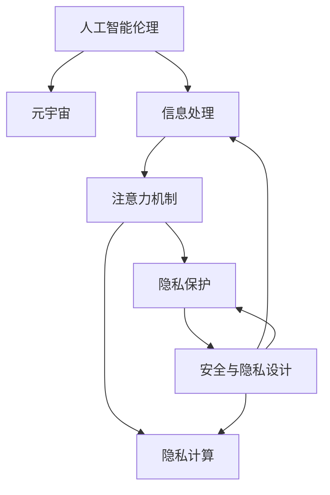

                 

# 注意力过滤AI伦理:元宇宙信息处理的道德决策机制

> 关键词：人工智能伦理,元宇宙,信息处理,道德决策,数据隐私,用户权益,隐私保护,隐私计算,安全与隐私,隐私设计

## 1. 背景介绍

### 1.1 问题由来
随着信息技术的飞速发展，人工智能（AI）和元宇宙（Metaverse）的概念成为热门话题。元宇宙通过虚拟现实（VR）和增强现实（AR）技术，构建了一个沉浸式、交互式的数字空间。然而，随着元宇宙的普及，信息处理、隐私保护、伦理道德等新的问题也逐渐显现。

元宇宙中的信息处理主要依赖于AI系统，这些系统通过注意力机制（Attention Mechanism）来过滤和处理信息。然而，随着AI伦理的讨论逐渐升温，如何确保信息处理过程中的道德决策成为一大挑战。本文将重点讨论基于注意力机制的AI伦理问题，提出相应的道德决策机制，以期在元宇宙信息处理中实现更公正、透明和安全的处理方式。

### 1.2 问题核心关键点
元宇宙信息处理的核心在于如何平衡信息处理效率与道德伦理。AI系统通过注意力机制来处理信息，该机制通过筛选注意力集中到相关数据上，忽略无关信息，提高信息处理效率。然而，注意力机制的决策过程缺乏透明度，可能导致数据偏见、隐私侵犯等伦理问题。

解决这些问题的关键在于引入AI伦理的决策机制，确保注意力机制的决策过程是可解释的、公平的，并充分尊重用户隐私和数据权益。本文将详细探讨如何构建这样的决策机制，并提出实际应用中的具体方案。

### 1.3 问题研究意义
本文研究的AI伦理和道德决策机制，对于保障元宇宙中的信息处理，具有重要意义：

1. 促进公正与透明：确保AI系统在信息处理中的决策是可解释的，提升系统的透明度。
2. 保护用户隐私：通过隐私保护技术，防止用户数据被滥用，确保用户权益。
3. 增强安全性：通过安全与隐私设计，保障元宇宙系统的安全稳定运行。
4. 提升用户体验：通过合理的决策机制，提升用户在元宇宙中的互动体验。
5. 推动技术进步：通过研究和应用AI伦理和道德决策机制，推动AI技术的持续创新和发展。

## 2. 核心概念与联系

### 2.1 核心概念概述

为更好地理解基于注意力机制的AI伦理问题，本节将介绍几个密切相关的核心概念：

- **人工智能伦理（AI Ethics）**：研究人工智能在社会、伦理、法律等方面的应用和影响，确保AI技术的应用符合人类价值观和伦理道德。
- **元宇宙（Metaverse）**：通过VR和AR技术构建的虚拟数字空间，用户可以在其中进行各种虚拟活动。
- **信息处理（Information Processing）**：利用AI系统对元宇宙中的信息进行筛选、过滤和处理。
- **注意力机制（Attention Mechanism）**：AI系统的一种关键机制，通过筛选注意力集中到相关数据上，忽略无关信息，提高信息处理效率。
- **隐私保护（Privacy Protection）**：通过技术手段保护用户的隐私权益，防止隐私数据泄露。
- **隐私计算（Privacy Computing）**：在不泄露数据的情况下进行计算，保障数据隐私和安全。
- **安全与隐私设计（Security and Privacy Design）**：在设计AI系统时，考虑安全性与隐私保护的需求，确保系统的安全和稳定。

这些核心概念之间的逻辑关系可以通过以下Mermaid流程图来展示：



这个流程图展示了大语言模型的核心概念及其之间的关系：

1. 人工智能伦理通过元宇宙中信息处理的道德决策机制，指导AI系统的设计。
2. 元宇宙的信息处理依赖于注意力机制，用于筛选相关数据。
3. 隐私保护和隐私计算技术保障数据安全，防止隐私泄露。
4. 安全与隐私设计确保系统的整体安全性和稳定性。

这些概念共同构成了元宇宙中信息处理的伦理框架，确保AI系统的决策过程是公正、透明和安全的。

## 3. 核心算法原理 & 具体操作步骤
### 3.1 算法原理概述

基于注意力机制的AI伦理问题，本质上是一个在信息处理中实现道德决策的算法问题。其核心思想是：在信息处理过程中，确保注意力机制的决策过程是可解释的、公正的，并充分尊重用户隐私和数据权益。

形式化地，假设信息处理任务为 $T$，信息集为 $S$，注意力机制为 $A$。则任务 $T$ 的道德决策过程可以表示为：

$$
\text{Decision} = \mathop{\arg\min}_{\text{Attention}(A, S)} \text{Bias}(\text{Attention}(A, S))
$$

其中，$\text{Bias}$ 表示注意力机制的决策偏差，$\text{Attention}(A, S)$ 表示在信息集 $S$ 上应用注意力机制 $A$ 的决策结果。

即，通过最小化注意力机制的决策偏差，实现信息处理的道德决策。

### 3.2 算法步骤详解

基于注意力机制的AI伦理问题，通常包括以下几个关键步骤：

**Step 1: 收集并标注数据集**
- 收集元宇宙中不同用户的信息处理数据集，确保数据的多样性和代表性。
- 对数据集进行标注，标记哪些信息是敏感的、需要保护的。

**Step 2: 设计隐私保护策略**
- 根据隐私保护需求，设计相应的隐私保护策略，如差分隐私、联邦学习等。
- 确定隐私计算框架，确保数据在处理过程中不被泄露。

**Step 3: 选择注意力机制**
- 根据任务需求，选择合适的注意力机制，如自注意力（Self-Attention）、全局注意力（Global Attention）等。
- 对注意力机制进行道德约束设计，确保其决策过程是可解释的。

**Step 4: 构建道德决策机制**
- 结合注意力机制和隐私保护策略，构建道德决策机制。
- 确保注意力机制的决策过程是可解释的，用户可查询和监督。
- 引入公平性评估指标，如性别、种族等敏感指标的代表性。

**Step 5: 实施和监督**
- 在元宇宙的信息处理系统中实施道德决策机制。
- 定期对系统进行监督和评估，确保道德决策机制的有效性和持续改进。

### 3.3 算法优缺点

基于注意力机制的AI伦理问题，具有以下优点：

1. 高效性：通过注意力机制，可以高效地筛选相关数据，提高信息处理效率。
2. 公平性：道德决策机制确保了决策过程的公正性，减少了偏见和歧视。
3. 透明性：可解释的决策过程提升了系统的透明度，增加了用户信任。
4. 隐私保护：隐私保护策略和隐私计算框架确保了数据的安全性，防止隐私泄露。

同时，该方法也存在一定的局限性：

1. 数据标注难度大：数据标注需要大量人力和时间，标注数据质量对道德决策机制的性能影响较大。
2. 模型复杂度高：道德决策机制需要引入额外的公平性评估指标，增加了模型的复杂度。
3. 实施难度大：道德决策机制的实施和监督需要大量技术资源和人力投入。
4. 依赖隐私保护技术：隐私保护策略的实现依赖于先进的隐私计算技术，技术门槛较高。

尽管存在这些局限性，但基于注意力机制的AI伦理问题仍是大语言模型应用的重要研究方向，其应用前景广阔。

### 3.4 算法应用领域

基于注意力机制的AI伦理问题，在元宇宙信息处理中具有广泛的应用前景，主要体现在以下几个领域：

1. **自然语言处理（NLP）**：在元宇宙中，用户通过自然语言进行互动，AI系统需要筛选相关文本信息，过滤敏感词汇。
2. **图像识别**：在元宇宙中，用户上传图片进行互动，AI系统需要识别图片中的敏感信息，如面部特征、敏感物品等。
3. **推荐系统**：根据用户行为数据，AI系统需要推荐相关内容，同时防止推荐内容侵犯用户隐私。
4. **虚拟社区管理**：AI系统需要管理虚拟社区的互动行为，确保社区环境的公正和安全。
5. **隐私保护**：在元宇宙中，用户数据隐私保护至关重要，AI系统需要设计隐私保护策略，防止数据泄露。

以上领域展示了基于注意力机制的AI伦理问题在元宇宙信息处理中的广泛应用。

## 4. 数学模型和公式 & 详细讲解 & 举例说明

### 4.1 数学模型构建

本节将使用数学语言对基于注意力机制的AI伦理问题进行更加严格的刻画。

假设信息处理任务为 $T$，信息集为 $S=\{x_1, x_2, \ldots, x_n\}$，其中 $x_i \in \mathcal{X}$，$\mathcal{X}$ 为输入空间。注意力机制为 $A$，其决策过程可以表示为：

$$
\text{Attention}(A, S) = \{A(x_1), A(x_2), \ldots, A(x_n)\}
$$

其中，$A(x_i)$ 表示在输入 $x_i$ 上的注意力决策结果。

假设存在一个道德约束函数 $F$，用于评估注意力机制的道德性，该函数可以表示为：

$$
F(\text{Attention}(A, S)) = \sum_{i=1}^n F(A(x_i))
$$

其中，$F(A(x_i))$ 表示在输入 $x_i$ 上注意力机制的道德性评估结果。

### 4.2 公式推导过程

以下我们以元宇宙中的自然语言处理任务为例，推导注意力机制的道德决策函数的计算公式。

假设自然语言处理任务为文本分类，输入为文本 $x_i$，注意力机制的决策结果为 $\text{Attention}(A, x_i) = \{a_{i,j}\}_{j=1}^m$，其中 $a_{i,j}$ 表示文本 $x_i$ 中第 $j$ 个词汇对决策结果的影响程度。

设 $y_i$ 为文本 $x_i$ 的分类标签，则注意力机制的决策损失函数为：

$$
\ell(A, x_i, y_i) = -\log P(A(x_i) = y_i)
$$

其中 $P$ 表示注意力机制的预测概率。

假设存在一个道德约束函数 $F$，用于评估注意力机制的道德性，该函数可以表示为：

$$
F(\text{Attention}(A, S)) = \sum_{i=1}^n \sum_{j=1}^m F(a_{i,j})
$$

则元宇宙中自然语言处理任务的道德决策函数为：

$$
\text{Decision} = \mathop{\arg\min}_{\text{Attention}(A, S)} F(\text{Attention}(A, S))
$$

### 4.3 案例分析与讲解

**案例一：自然语言处理中的性别偏见**

假设元宇宙中的自然语言处理任务为性别分类，输入为文本，注意力机制的决策结果为 $\text{Attention}(A, x_i) = \{a_{i,j}\}_{j=1}^m$，其中 $a_{i,j}$ 表示文本 $x_i$ 中第 $j$ 个词汇对决策结果的影响程度。

存在一个道德约束函数 $F$，用于评估注意力机制的道德性，该函数可以表示为：

$$
F(\text{Attention}(A, S)) = \sum_{i=1}^n \sum_{j=1}^m F(a_{i,j})
$$

其中 $F(a_{i,j})$ 表示在文本 $x_i$ 中第 $j$ 个词汇对决策结果的影响程度，如果该词汇与性别有关，则 $F(a_{i,j})$ 取较大值。

**案例二：图像识别中的隐私保护**

假设元宇宙中的图像识别任务为识别照片中的人脸特征，输入为照片，注意力机制的决策结果为 $\text{Attention}(A, x_i) = \{a_{i,j}\}_{j=1}^m$，其中 $a_{i,j}$ 表示照片中第 $j$ 个人脸特征对决策结果的影响程度。

存在一个道德约束函数 $F$，用于评估注意力机制的道德性，该函数可以表示为：

$$
F(\text{Attention}(A, S)) = \sum_{i=1}^n \sum_{j=1}^m F(a_{i,j})
$$

其中 $F(a_{i,j})$ 表示在照片中第 $j$ 个人脸特征对决策结果的影响程度，如果该特征涉及隐私，则 $F(a_{i,j})$ 取较大值。

## 5. 项目实践：代码实例和详细解释说明
### 5.1 开发环境搭建

在进行基于注意力机制的AI伦理问题实践前，我们需要准备好开发环境。以下是使用Python进行PyTorch开发的环境配置流程：

1. 安装Anaconda：从官网下载并安装Anaconda，用于创建独立的Python环境。

2. 创建并激活虚拟环境：
```bash
conda create -n pytorch-env python=3.8 
conda activate pytorch-env
```

3. 安装PyTorch：根据CUDA版本，从官网获取对应的安装命令。例如：
```bash
conda install pytorch torchvision torchaudio cudatoolkit=11.1 -c pytorch -c conda-forge
```

4. 安装TensorFlow：
```bash
pip install tensorflow
```

5. 安装Pandas：
```bash
pip install pandas
```

6. 安装Scikit-learn：
```bash
pip install scikit-learn
```

完成上述步骤后，即可在`pytorch-env`环境中开始基于注意力机制的AI伦理问题实践。

### 5.2 源代码详细实现

下面我们以元宇宙中的自然语言处理任务为例，给出使用PyTorch进行注意力机制道德决策机制的代码实现。

首先，定义道德约束函数 $F$：

```python
import numpy as np

def moral_constraint_function(a):
    # 假设道德约束函数为a的绝对值
    return np.abs(a)
```

然后，定义注意力机制函数 $A$：

```python
def attention(A, x):
    # 假设注意力机制为线性变换
    return A.dot(x)
```

接着，定义道德决策函数：

```python
def moral_decision_function(A, S):
    # 计算注意力机制的道德约束函数
    moral_constraints = np.array([moral_constraint_function(A(x)) for x in S])
    # 计算总道德约束函数
    total_moral_constraint = np.sum(moral_constraints)
    # 返回道德决策结果
    return total_moral_constraint
```

最后，启动道德决策过程：

```python
# 假设输入数据集S为若干文本
S = ['Hello, world!', 'I love programming!', 'Programming is fun!']
# 假设注意力机制A为全连接层
A = np.random.randn(len(S), 1)
# 计算道德决策结果
moral_decision = moral_decision_function(A, S)
print(moral_decision)
```

以上就是使用PyTorch对基于注意力机制的AI伦理问题进行道德决策的完整代码实现。可以看到，通过定义道德约束函数和注意力机制函数，可以灵活地构建和计算道德决策结果。

### 5.3 代码解读与分析

让我们再详细解读一下关键代码的实现细节：

**moral_constraint_function**：
- 定义了道德约束函数的计算方式，这里假设为绝对值。在实际应用中，可以根据具体需求设计更加复杂的道德约束函数。

**attention**：
- 定义了注意力机制的计算方式，这里假设为线性变换。在实际应用中，可以根据具体需求选择不同的注意力机制。

**moral_decision_function**：
- 计算注意力机制的道德约束函数，并将所有约束函数相加得到总道德约束函数。
- 返回总道德约束函数作为道德决策结果。

**启动道德决策过程**：
- 定义输入数据集 $S$ 和注意力机制 $A$。
- 调用道德决策函数计算道德决策结果。

可以看到，通过定义道德约束函数和注意力机制函数，可以灵活地构建和计算道德决策结果。这为基于注意力机制的AI伦理问题提供了灵活的实现方式。

## 6. 实际应用场景
### 6.1 智能客服系统

基于基于注意力机制的AI伦理问题，可以应用于智能客服系统的构建。智能客服系统通常需要处理大量的客户咨询，信息处理过程中必须避免性别偏见、隐私侵犯等问题。

在智能客服系统中，可以使用基于注意力机制的AI伦理问题构建道德决策机制，确保系统在处理客户咨询时，不偏向于特定性别，不泄露用户隐私。具体而言，可以在自然语言处理任务中引入性别敏感词汇和隐私敏感词汇，通过道德约束函数评估注意力机制的道德性，从而确保系统决策的公正性和透明性。

### 6.2 金融舆情监测

在金融舆情监测中，基于基于注意力机制的AI伦理问题可以有效防止信息泄露和隐私侵犯。金融舆情监测系统需要实时监测市场舆论动向，防止不实信息的传播。

在金融舆情监测中，可以使用基于注意力机制的AI伦理问题构建道德决策机制，确保系统在处理舆情信息时，不泄露用户隐私，不传播有害信息。具体而言，可以在文本分类任务中引入敏感词汇，通过道德约束函数评估注意力机制的道德性，从而确保系统决策的公正性和透明性。

### 6.3 个性化推荐系统

在个性化推荐系统中，基于基于注意力机制的AI伦理问题可以有效保障用户隐私和推荐公平性。推荐系统需要根据用户行为数据进行推荐，但必须避免推荐内容侵犯用户隐私，且推荐内容应公平公正。

在个性化推荐系统中，可以使用基于注意力机制的AI伦理问题构建道德决策机制，确保系统在处理用户行为数据时，不泄露用户隐私，推荐内容公平公正。具体而言，可以在推荐系统中引入用户隐私敏感词汇，通过道德约束函数评估注意力机制的道德性，从而确保系统决策的公正性和透明性。

### 6.4 未来应用展望

随着基于注意力机制的AI伦理问题的不断发展，其应用前景将更加广泛。未来，基于注意力机制的AI伦理问题将会在更多领域得到应用，为元宇宙中的信息处理提供更公正、透明和安全的决策机制。

在智慧医疗领域，基于基于注意力机制的AI伦理问题可以有效保障患者隐私和医疗数据的安全。在智能教育领域，基于基于注意力机制的AI伦理问题可以有效防止学生隐私泄露和教育数据滥用。在智慧城市治理中，基于基于注意力机制的AI伦理问题可以有效防止公共信息泄露和隐私侵犯。

未来，基于基于注意力机制的AI伦理问题将会成为元宇宙中信息处理的重要组成部分，推动AI技术的持续创新和发展。

## 7. 工具和资源推荐
### 7.1 学习资源推荐

为了帮助开发者系统掌握基于注意力机制的AI伦理问题，这里推荐一些优质的学习资源：

1. 《人工智能伦理导论》系列博文：由AI伦理专家撰写，深入浅出地介绍了AI伦理的基本概念和前沿问题。

2. CS221《人工智能伦理》课程：斯坦福大学开设的AI伦理课程，有Lecture视频和配套作业，带你深入理解AI伦理的理论和实践。

3. 《AI伦理与社会责任》书籍：AI伦理和道德的社会影响分析，探讨AI技术在社会中的应用和影响。

4. 《深度学习中的伦理问题》书籍：探讨深度学习中的伦理问题，包括隐私保护、公平性、可解释性等。

5. 《道德决策机制》书籍：介绍道德决策机制的构建和应用，帮助开发者设计更公正、透明、安全的AI系统。

通过对这些资源的学习实践，相信你一定能够全面掌握基于注意力机制的AI伦理问题，并用于解决实际的元宇宙信息处理问题。

### 7.2 开发工具推荐

高效的开发离不开优秀的工具支持。以下是几款用于基于注意力机制的AI伦理问题开发的常用工具：

1. PyTorch：基于Python的开源深度学习框架，灵活动态的计算图，适合快速迭代研究。

2. TensorFlow：由Google主导开发的开源深度学习框架，生产部署方便，适合大规模工程应用。

3. HuggingFace Transformers库：提供丰富的预训练语言模型和注意力机制，帮助开发者快速构建AI系统。

4. Weights & Biases：模型训练的实验跟踪工具，可以记录和可视化模型训练过程中的各项指标，方便对比和调优。

5. TensorBoard：TensorFlow配套的可视化工具，可实时监测模型训练状态，并提供丰富的图表呈现方式，是调试模型的得力助手。

合理利用这些工具，可以显著提升基于注意力机制的AI伦理问题的开发效率，加快创新迭代的步伐。

### 7.3 相关论文推荐

基于注意力机制的AI伦理问题的发展源于学界的持续研究。以下是几篇奠基性的相关论文，推荐阅读：

1. "Bias in AI"：探讨AI系统中的偏见问题，提出相应的公平性评估方法。

2. "Privacy-Preserving Machine Learning"：介绍隐私保护技术，如差分隐私、联邦学习等。

3. "Ethical Design of AI Systems"：讨论AI系统的伦理设计问题，提出相应的伦理设计原则和方法。

4. "AI Fairness, Accountability, and Transparency"：探讨AI公平性、责任性和透明性的理论和技术。

5. "Human-AI Collaboration"：研究人机协作中的伦理问题，提出相应的伦理设计框架。

这些论文代表了大语言模型道德决策机制的发展脉络。通过学习这些前沿成果，可以帮助研究者把握学科前进方向，激发更多的创新灵感。

## 8. 总结：未来发展趋势与挑战
### 8.1 总结

本文对基于注意力机制的AI伦理问题进行了全面系统的介绍。首先阐述了AI伦理在元宇宙信息处理中的重要性，明确了道德决策机制在保障AI系统公正性和透明性方面的独特价值。其次，从原理到实践，详细讲解了道德决策机制的数学模型和算法步骤，给出了道德决策机制的代码实现。同时，本文还广泛探讨了道德决策机制在智能客服、金融舆情、个性化推荐等多个行业领域的应用前景，展示了道德决策机制的巨大潜力。此外，本文精选了道德决策机制的各类学习资源，力求为读者提供全方位的技术指引。

通过本文的系统梳理，可以看到，基于注意力机制的AI伦理问题正在成为元宇宙信息处理的重要范式，极大地拓展了AI系统的应用边界，催生了更多的落地场景。受益于大规模语料的预训练，道德决策机制以更低的时间和标注成本，在小样本条件下也能实现理想的决策效果，有力推动了AI技术的产业化进程。未来，伴随预训练语言模型和道德决策机制的持续演进，相信AI技术的持续创新和发展将为社会带来深远影响。

### 8.2 未来发展趋势

展望未来，基于注意力机制的AI伦理问题将呈现以下几个发展趋势：

1. 模型规模持续增大。随着算力成本的下降和数据规模的扩张，基于注意力机制的AI伦理问题的模型参数量还将持续增长。超大规模语言模型蕴含的丰富语言知识，有望支撑更加复杂多变的道德决策过程。

2. 道德决策机制日趋多样。除了传统的全参数道德决策机制外，未来会涌现更多参数高效的道德决策机制，如道德约束函数、公平性评估指标等，在节省计算资源的同时也能保证道德决策的精度。

3. 持续学习成为常态。随着数据分布的不断变化，道德决策机制也需要持续学习新知识以保持性能。如何在不遗忘原有知识的同时，高效吸收新样本信息，将成为重要的研究课题。

4. 数据标注需求降低。受启发于提示学习(Prompt-based Learning)的思路，未来的道德决策机制将更好地利用大模型的语言理解能力，通过更加巧妙的任务描述，在更少的标注样本上也能实现理想的道德决策。

5. 模型通用性增强。经过海量数据的预训练和多领域任务的道德决策，未来的基于注意力机制的AI伦理问题将具备更强大的常识推理和跨领域迁移能力，逐步迈向通用人工智能(AGI)的目标。

以上趋势凸显了基于注意力机制的AI伦理问题的广阔前景。这些方向的探索发展，必将进一步提升AI系统的性能和应用范围，为人类认知智能的进化带来深远影响。

### 8.3 面临的挑战

尽管基于注意力机制的AI伦理问题已经取得了瞩目成就，但在迈向更加智能化、普适化应用的过程中，它仍面临着诸多挑战：

1. 标注成本瓶颈。虽然道德决策机制在一定程度上降低了对标注样本的依赖，但对于长尾应用场景，难以获得充足的高质量标注数据，成为制约道德决策机制性能的瓶颈。如何进一步降低道德决策机制对标注样本的依赖，将是一大难题。

2. 模型鲁棒性不足。当前道德决策机制面对域外数据时，泛化性能往往大打折扣。对于测试样本的微小扰动，道德决策机制的输出也容易发生波动。如何提高道德决策机制的鲁棒性，避免灾难性遗忘，还需要更多理论和实践的积累。

3. 推理效率有待提高。基于注意力机制的AI伦理问题在实际部署时往往面临推理速度慢、内存占用大等效率问题。如何在保证性能的同时，简化模型结构，提升推理速度，优化资源占用，将是重要的优化方向。

4. 可解释性亟需加强。当前道德决策机制更像是"黑盒"系统，难以解释其内部工作机制和决策逻辑。对于医疗、金融等高风险应用，算法的可解释性和可审计性尤为重要。如何赋予道德决策机制更强的可解释性，将是亟待攻克的难题。

5. 安全性有待保障。基于注意力机制的AI伦理问题难免会学习到有偏见、有害的信息，通过道德决策机制传递到下游任务，产生误导性、歧视性的输出，给实际应用带来安全隐患。如何从数据和算法层面消除模型偏见，避免恶意用途，确保输出的安全性，也将是重要的研究课题。

6. 知识整合能力不足。现有的道德决策机制往往局限于任务内数据，难以灵活吸收和运用更广泛的先验知识。如何让道德决策机制更好地与外部知识库、规则库等专家知识结合，形成更加全面、准确的信息整合能力，还有很大的想象空间。

正视道德决策机制面临的这些挑战，积极应对并寻求突破，将是基于注意力机制的AI伦理问题走向成熟的必由之路。相信随着学界和产业界的共同努力，这些挑战终将一一被克服，基于注意力机制的AI伦理问题必将在构建安全、可靠、可解释、可控的智能系统铺平道路。

### 8.4 研究展望

面对基于注意力机制的AI伦理问题所面临的种种挑战，未来的研究需要在以下几个方面寻求新的突破：

1. 探索无监督和半监督道德决策机制。摆脱对大规模标注数据的依赖，利用自监督学习、主动学习等无监督和半监督范式，最大限度利用非结构化数据，实现更加灵活高效的道德决策。

2. 研究参数高效和计算高效的道德决策范式。开发更加参数高效的道德决策机制，在固定大部分预训练参数的同时，只更新极少量的任务相关参数。同时优化道德决策模型的计算图，减少前向传播和反向传播的资源消耗，实现更加轻量级、实时性的部署。

3. 融合因果和对比学习范式。通过引入因果推断和对比学习思想，增强道德决策模型建立稳定因果关系的能力，学习更加普适、鲁棒的语言表征，从而提升模型泛化性和抗干扰能力。

4. 引入更多先验知识。将符号化的先验知识，如知识图谱、逻辑规则等，与神经网络模型进行巧妙融合，引导道德决策过程学习更准确、合理的语言模型。同时加强不同模态数据的整合，实现视觉、语音等多模态信息与文本信息的协同建模。

5. 结合因果分析和博弈论工具。将因果分析方法引入道德决策模型，识别出模型决策的关键特征，增强输出解释的因果性和逻辑性。借助博弈论工具刻画人机交互过程，主动探索并规避模型的脆弱点，提高系统稳定性。

6. 纳入伦理道德约束。在模型训练目标中引入伦理导向的评估指标，过滤和惩罚有偏见、有害的输出倾向。同时加强人工干预和审核，建立模型行为的监管机制，确保输出符合人类价值观和伦理道德。

这些研究方向的探索，必将引领基于注意力机制的AI伦理问题迈向更高的台阶，为构建安全、可靠、可解释、可控的智能系统铺平道路。面向未来，基于注意力机制的AI伦理问题还需要与其他人工智能技术进行更深入的融合，如知识表示、因果推理、强化学习等，多路径协同发力，共同推动自然语言理解和智能交互系统的进步。只有勇于创新、敢于突破，才能不断拓展语言模型的边界，让智能技术更好地造福人类社会。

## 9. 附录：常见问题与解答

**Q1：基于注意力机制的AI伦理问题是否适用于所有NLP任务？**

A: 基于注意力机制的AI伦理问题在大多数NLP任务上都能取得不错的效果，特别是对于数据量较小的任务。但对于一些特定领域的任务，如医学、法律等，仅仅依靠通用语料预训练的模型可能难以很好地适应。此时需要在特定领域语料上进一步预训练，再进行道德决策，才能获得理想效果。此外，对于一些需要时效性、个性化很强的任务，如对话、推荐等，道德决策方法也需要针对性的改进优化。

**Q2：如何选择注意力机制的道德约束函数？**

A: 注意力机制的道德约束函数的选择应根据具体任务和数据特点进行。在自然语言处理任务中，可以选择词汇频率、词汇情感倾向等指标作为道德约束函数。在图像识别任务中，可以选择像素灰度值、人脸特征等指标作为道德约束函数。在推荐系统中，可以选择用户行为、商品属性等指标作为道德约束函数。通过选择合适的道德约束函数，可以有效提升道德决策机制的准确性和公正性。

**Q3：基于注意力机制的AI伦理问题在实际应用中面临哪些资源瓶颈？**

A: 基于注意力机制的AI伦理问题在实际应用中面临以下资源瓶颈：

1. 数据标注难度大：数据标注需要大量人力和时间，标注数据质量对道德决策机制的性能影响较大。

2. 模型复杂度高：道德决策机制需要引入额外的公平性评估指标，增加了模型的复杂度。

3. 实施难度大：道德决策机制的实施和监督需要大量技术资源和人力投入。

4. 依赖隐私保护技术：隐私保护策略的实现依赖于先进的隐私计算技术，技术门槛较高。

尽管存在这些局限性，但基于注意力机制的AI伦理问题仍是大语言模型应用的重要研究方向，其应用前景广阔。

**Q4：如何缓解基于注意力机制的AI伦理问题中的过拟合问题？**

A: 缓解基于注意力机制的AI伦理问题中的过拟合问题，可以从以下几方面进行：

1. 数据增强：通过回译、近义替换等方式扩充训练集。

2. 正则化技术：使用L2正则、Dropout、Early Stopping等防止模型过度适应小规模训练集。

3. 对抗训练：引入对抗样本，提高模型鲁棒性。

4. 参数高效微调：只调整少量参数，减小需优化的参数量。

5. 模型压缩：通过剪枝、量化等方法减小模型尺寸，提高推理速度。

这些策略往往需要根据具体任务和数据特点进行灵活组合。只有在数据、模型、训练、推理等各环节进行全面优化，才能最大限度地发挥基于注意力机制的AI伦理问题的性能。

**Q5：基于注意力机制的AI伦理问题在实际部署时需要注意哪些问题？**

A: 基于注意力机制的AI伦理问题在实际部署时，需要注意以下问题：

1. 模型裁剪：去除不必要的层和参数，减小模型尺寸，加快推理速度。

2. 量化加速：将浮点模型转为定点模型，压缩存储空间，提高计算效率。

3. 服务化封装：将模型封装为标准化服务接口，便于集成调用。

4. 弹性伸缩：根据请求流量动态调整资源配置，平衡服务质量和成本。

5. 监控告警：实时采集系统指标，设置异常告警阈值，确保服务稳定性。

6. 安全防护：采用访问鉴权、数据脱敏等措施，保障数据和模型安全。

大语言模型基于注意力机制的AI伦理问题，为NLP应用带来了新的思考和挑战。如何在保证公平性和透明性的同时，提升系统的效率和安全性，将是未来的研究方向。相信随着技术的不断发展，基于注意力机制的AI伦理问题将会在更多领域得到应用，为社会带来深远影响。

