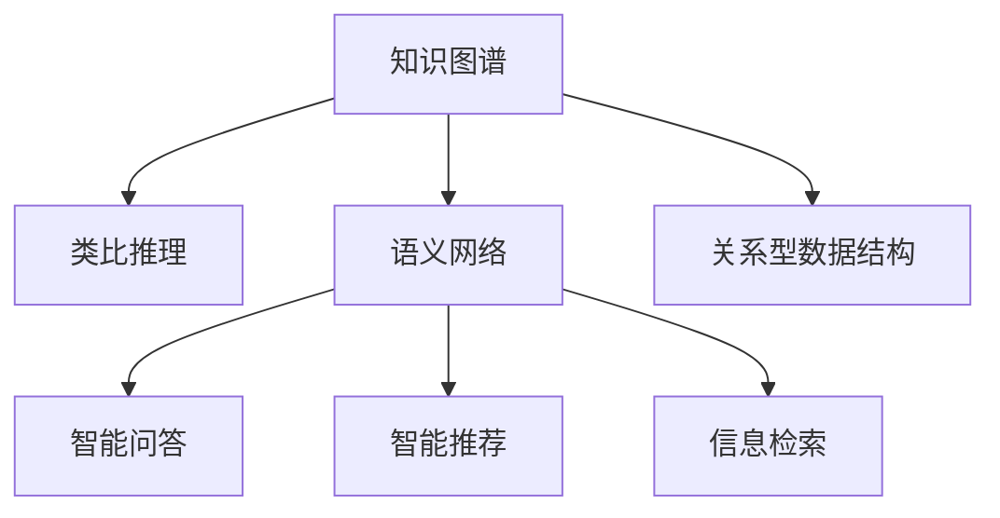

                 

# 洞察与类比：突破知识限制的工具

> 关键词：知识图谱,类比推理,语义网络,智能问答,智能推荐

## 1. 背景介绍

### 1.1 问题由来
在信息爆炸的今天，知识的获取和应用已经成为了各行各业的关键因素。随着数字化和智能化的推进，对知识管理、知识检索和知识应用的效率和精准性提出了更高要求。然而，传统的基于关键字检索的技术已经难以满足现代知识应用的需求。知识图谱作为一种新兴的、基于语义网络的表示和推理技术，通过语义连接实体和属性，可以在更深层次上理解知识，提高知识的应用效率。

### 1.2 问题核心关键点
知识图谱的核心是构建一个语义化的知识库，通过关系型数据结构描述实体之间的关系。利用类比推理等高级知识处理技术，可以更高效地检索和推理出新知识。这一过程涉及语义网络的形成、实体属性关联、推理机制的设计等核心步骤。在实际应用中，知识图谱已被广泛应用于智能问答、智能推荐、信息检索等领域，为高效的知识管理和应用提供了有力支撑。

### 1.3 问题研究意义
研究知识图谱和类比推理，对于提升知识管理和智能应用系统的效率和精准性，具有重要意义：

1. 提升知识检索和推理能力。知识图谱通过语义网络将知识进行结构化表示，利用类比推理等技术可以快速检索和推理出相关信息。
2. 增强系统智能性。基于知识图谱的智能问答和推荐系统，能够实现更智能化的服务，提升用户体验。
3. 推动知识共享和协作。知识图谱为跨领域知识的共享和协作提供了平台，促进了知识的交流和创新。
4. 辅助决策支持。知识图谱中的知识可以为决策提供有力支持，帮助决策者更全面、准确地把握复杂问题。
5. 加速人工智能技术的发展。知识图谱和类比推理为人工智能技术的应用提供了数据基础和推理能力，促进了AI在各行业的落地。

## 2. 核心概念与联系

### 2.1 核心概念概述

为更好地理解知识图谱和类比推理的基本原理和架构，本节将介绍几个关键概念：

- **知识图谱(Knowledge Graph)**：一种语义化的知识表示方法，通过实体、关系、属性等概念节点，描述知识库中的信息结构。知识图谱为各类复杂问题提供了形式化的知识表示和推理基础。

- **类比推理(Analogy-Based Reasoning)**：一种高级知识处理技术，通过发现知识之间的相似性，推断出新知识。类比推理在知识图谱中的应用，有助于快速获取和推理出相关知识。

- **语义网络(Semantic Network)**：一种基于知识图谱构建的，用于表示实体和关系之间语义连接的数据结构。语义网络通过节点和边构建知识图谱，为知识推理提供直观的表达方式。

- **智能问答系统(Intelligent Question Answering System)**：一种基于知识图谱的问答系统，通过自然语言理解和类比推理，能够快速回答用户问题，提供智能化的服务。

- **智能推荐系统(Intelligent Recommendation System)**：一种基于知识图谱的推荐系统，通过用户行为和实体属性关联，精准推荐相关内容。

- **信息检索系统(Information Retrieval System)**：一种基于知识图谱的信息检索系统，通过类比推理和语义匹配，提高检索效率和结果的准确性。

这些核心概念之间的逻辑关系可以通过以下Mermaid流程图来展示：



这个流程图展示了几类关键概念及其之间的关系：

1. 知识图谱通过语义网络描述实体和关系，为知识推理提供基础。
2. 类比推理利用知识图谱中的语义连接，推断新知识。
3. 智能问答和智能推荐系统基于知识图谱进行问题解答和内容推荐。
4. 信息检索系统通过语义匹配在知识图谱中快速检索相关信息。

这些概念共同构成了知识图谱技术的应用框架，使其能够在知识管理和智能应用中发挥重要作用。

## 3. 核心算法原理 & 具体操作步骤
### 3.1 算法原理概述

知识图谱和类比推理的核心在于构建和利用语义网络，通过关系型数据结构描述实体和属性之间的关系。其核心思想是通过实体间的关系进行语义匹配和推理，从而获取新知识。

形式化地，假设知识图谱中的知识库为 $G=(E,R,A)$，其中 $E$ 为实体集合，$R$ 为关系集合，$A$ 为属性集合。知识推理的过程可以通过以下步骤描述：

1. **知识表示**：将知识库中的实体、关系和属性构建成语义网络，形成图结构。
2. **实体关联**：通过关系将实体进行关联，描述实体之间的语义连接。
3. **属性映射**：为每个实体和关系定义属性，描述实体和关系的特征。
4. **推理规则**：设计推理规则，通过类比推理等技术进行知识推理。

### 3.2 算法步骤详解

构建和利用知识图谱，通常包含以下几个关键步骤：

**Step 1: 数据采集与清洗**
- 从各种数据源（如百科全书、图书馆、互联网）收集知识数据。
- 对数据进行清洗，去除噪音和冗余信息。

**Step 2: 知识抽取与表示**
- 使用自然语言处理技术，从文本中抽取实体、关系和属性。
- 构建语义网络，形成知识图谱的节点和边。

**Step 3: 知识关联与映射**
- 根据实体和关系之间的关联规则，将实体和关系进行关联。
- 为每个实体和关系定义属性，并进行属性映射。

**Step 4: 知识推理与更新**
- 设计推理规则，利用类比推理等技术进行知识推理。
- 根据推理结果，更新知识图谱，形成新的知识。

### 3.3 算法优缺点

知识图谱和类比推理的方法具有以下优点：
1. 语义匹配高效。通过语义网络描述知识关系，推理匹配效率高。
2. 知识获取精准。利用类比推理技术，可以获取更精准、相关的知识。
3. 知识复用性好。知识图谱中的知识可以重复利用，避免重复工作。
4. 可解释性强。知识图谱和类比推理的推理过程可解释性强，便于理解。

同时，该方法也存在一定的局限性：
1. 构建复杂。知识图谱的构建需要大量数据和专家知识，难度较大。
2. 推理限制。类比推理依赖于知识图谱的质量，低质量图谱可能导致推理错误。
3. 更新困难。知识图谱需要定期更新，维护成本较高。
4. 泛化能力不足。类比推理在处理复杂、异构数据时，泛化能力有限。

尽管存在这些局限性，但就目前而言，知识图谱和类比推理仍是知识管理和智能应用的重要技术手段。未来相关研究的重点在于如何进一步降低构建和维护成本，提高推理精度和泛化能力，同时兼顾可解释性和伦理安全性等因素。

### 3.4 算法应用领域

知识图谱和类比推理的方法已经在知识管理、智能问答、智能推荐、信息检索等多个领域得到了广泛的应用，具体如下：

1. **智能问答系统**：如IBM Watson、微软Azure认知服务等，通过知识图谱进行实体和属性匹配，提供智能问答服务。
2. **智能推荐系统**：如Amazon推荐系统、Netflix推荐引擎，利用知识图谱进行实体关联和属性匹配，实现精准推荐。
3. **信息检索系统**：如Google Scholar、DeepMind Search等，通过知识图谱进行语义匹配，提高检索效率和结果的相关性。
4. **医疗知识图谱**：如BioGraph、MedGraph等，用于疾病诊断、药物研发等医疗领域，通过知识图谱辅助决策。
5. **智能客服系统**：如百度智能客服、阿里云智能客服，利用知识图谱进行实体和属性匹配，提升客服响应效率。
6. **金融知识图谱**：如财联社知识图谱、Ping An Knowledge Graph，用于金融数据管理和风险评估，辅助金融决策。

除了上述这些应用外，知识图谱和类比推理还被创新性地应用到更多场景中，如公共卫生知识图谱、环境知识图谱、工业知识图谱等，为各领域知识应用提供了新的技术路径。

## 4. 数学模型和公式 & 详细讲解  
### 4.1 数学模型构建

本节将使用数学语言对知识图谱和类比推理的基本模型进行更加严格的刻画。

假设知识图谱 $G=(E,R,A)$，其中 $E=\{e_1,e_2,...,e_n\}$ 为实体集合，$R=\{r_1,r_2,...,r_m\}$ 为关系集合，$A=\{a_1,a_2,...,a_k\}$ 为属性集合。实体 $e_i$ 与关系 $r_j$ 相连，形成语义网络。假设实体 $e_i$ 有属性 $a_k$，关系 $r_j$ 有属性 $a_l$。

定义实体 $e_i$ 的属性向量 $\mathbf{a}_i=(a_{i,1},a_{i,2},...,a_{i,k})$，关系 $r_j$ 的属性向量 $\mathbf{a}_j=(a_{j,1},a_{j,2},...,a_{j,l})$。

**实体关联矩阵** $A \in \mathbb{R}^{n \times n}$，其中 $A_{ij}=1$ 表示实体 $e_i$ 和 $e_j$ 存在关系 $r_j$ 相连，否则 $A_{ij}=0$。

**属性映射矩阵** $W \in \mathbb{R}^{k \times l}$，其中 $W_{ij}=a_{i,j}$ 表示属性 $a_i$ 映射到属性 $a_j$。

### 4.2 公式推导过程

以下是知识图谱中实体关联和属性映射的数学模型及其推导过程：

**实体关联模型**：
实体 $e_i$ 和 $e_j$ 通过关系 $r_j$ 相连，表示为：
$$
A_{ij}=1
$$

**属性映射模型**：
属性 $a_i$ 映射到属性 $a_j$，表示为：
$$
W_{ij}=a_{i,j}
$$

对于知识推理，假设已知实体 $e_s$ 和关系 $r_t$，推理得到实体 $e_u$。通过类比推理，将实体 $e_s$ 和 $e_u$ 进行匹配，得到推理结果 $e_u$。

**类比推理模型**：
假设已知实体 $e_s$ 和关系 $r_t$，推理得到实体 $e_u$。通过类比推理，匹配实体 $e_s$ 和 $e_u$，得到推理结果 $e_u$。

**推理公式**：
$$
\mathbf{a}_u = W \mathbf{a}_s
$$

其中 $\mathbf{a}_u$ 表示推理后的属性向量，$W$ 表示属性映射矩阵，$\mathbf{a}_s$ 表示已知实体 $e_s$ 的属性向量。

### 4.3 案例分析与讲解

以医疗知识图谱为例，分析知识图谱和类比推理的应用：

**案例背景**：
构建一个医疗知识图谱，用于疾病诊断和治疗。该知识图谱包含医生、疾病、药物、症状等实体，以及它们之间的关系和属性。

**实体关联模型**：
假设已知医生 $e_d$ 诊断疾病 $e_c$，并开具药物 $e_m$ 进行治疗。在知识图谱中，实体 $e_d$ 和 $e_c$ 通过关系 $r_{diagnose}$ 相连，$e_c$ 和 $e_m$ 通过关系 $r_{treat}$ 相连。

**属性映射模型**：
属性 $a_{d,diagnose}$ 表示医生诊断疾病的能力，属性 $a_{c,diagnose}$ 表示疾病诊断的症状，属性 $a_{c,treat}$ 表示疾病治疗的药物。

**类比推理模型**：
假设已知医生 $e_d$ 诊断疾病 $e_c$，并开具药物 $e_m$ 进行治疗。通过类比推理，匹配医生 $e_d$ 和药物 $e_m$，得到药物 $e_m$ 治疗疾病 $e_c$ 的能力。

**推理公式**：
$$
\mathbf{a}_{m,treat} = W \mathbf{a}_{d,diagnose}
$$

其中 $\mathbf{a}_{m,treat}$ 表示药物 $e_m$ 治疗疾病 $e_c$ 的能力，$W$ 表示属性映射矩阵，$\mathbf{a}_{d,diagnose}$ 表示医生 $e_d$ 诊断疾病的能力。

通过对医疗知识图谱中的知识进行抽取、表示和推理，医生能够更快速地诊断疾病并推荐合适的治疗药物，提高医疗服务的效率和精准性。

## 5. 项目实践：代码实例和详细解释说明
### 5.1 开发环境搭建

在进行知识图谱和类比推理的实践前，我们需要准备好开发环境。以下是使用Python进行PyTorch开发的环境配置流程：

1. 安装Anaconda：从官网下载并安装Anaconda，用于创建独立的Python环境。

2. 创建并激活虚拟环境：
```bash
conda create -n graph-env python=3.8 
conda activate graph-env
```

3. 安装PyTorch：根据CUDA版本，从官网获取对应的安装命令。例如：
```bash
conda install pytorch torchvision torchaudio cudatoolkit=11.1 -c pytorch -c conda-forge
```

4. 安装各类工具包：
```bash
pip install numpy pandas scikit-learn matplotlib tqdm jupyter notebook ipython
```

完成上述步骤后，即可在`graph-env`环境中开始知识图谱和类比推理的实践。

### 5.2 源代码详细实现

下面我们以构建医疗知识图谱和进行疾病诊断为例，给出使用Transformers库对知识图谱进行推理的PyTorch代码实现。

首先，定义知识图谱的数据处理函数：

```python
from transformers import BertTokenizer
from torch.utils.data import Dataset
import torch

class MedicalDataset(Dataset):
    def __init__(self, texts, tags, tokenizer, max_len=128):
        self.texts = texts
        self.tags = tags
        self.tokenizer = tokenizer
        self.max_len = max_len
        
    def __len__(self):
        return len(self.texts)
    
    def __getitem__(self, item):
        text = self.texts[item]
        tags = self.tags[item]
        
        encoding = self.tokenizer(text, return_tensors='pt', max_length=self.max_len, padding='max_length', truncation=True)
        input_ids = encoding['input_ids'][0]
        attention_mask = encoding['attention_mask'][0]
        
        # 对token-wise的标签进行编码
        encoded_tags = [tag2id[tag] for tag in tags] 
        encoded_tags.extend([tag2id['O']] * (self.max_len - len(encoded_tags)))
        labels = torch.tensor(encoded_tags, dtype=torch.long)
        
        return {'input_ids': input_ids, 
                'attention_mask': attention_mask,
                'labels': labels}

# 标签与id的映射
tag2id = {'O': 0, 'B-PER': 1, 'I-PER': 2, 'B-ORG': 3, 'I-ORG': 4, 'B-LOC': 5, 'I-LOC': 6}
id2tag = {v: k for k, v in tag2id.items()}

# 创建dataset
tokenizer = BertTokenizer.from_pretrained('bert-base-cased')

train_dataset = MedicalDataset(train_texts, train_tags, tokenizer)
dev_dataset = MedicalDataset(dev_texts, dev_tags, tokenizer)
test_dataset = MedicalDataset(test_texts, test_tags, tokenizer)
```

然后，定义模型和优化器：

```python
from transformers import BertForTokenClassification, AdamW

model = BertForTokenClassification.from_pretrained('bert-base-cased', num_labels=len(tag2id))

optimizer = AdamW(model.parameters(), lr=2e-5)
```

接着，定义训练和评估函数：

```python
from torch.utils.data import DataLoader
from tqdm import tqdm
from sklearn.metrics import classification_report

device = torch.device('cuda') if torch.cuda.is_available() else torch.device('cpu')
model.to(device)

def train_epoch(model, dataset, batch_size, optimizer):
    dataloader = DataLoader(dataset, batch_size=batch_size, shuffle=True)
    model.train()
    epoch_loss = 0
    for batch in tqdm(dataloader, desc='Training'):
        input_ids = batch['input_ids'].to(device)
        attention_mask = batch['attention_mask'].to(device)
        labels = batch['labels'].to(device)
        model.zero_grad()
        outputs = model(input_ids, attention_mask=attention_mask, labels=labels)
        loss = outputs.loss
        epoch_loss += loss.item()
        loss.backward()
        optimizer.step()
    return epoch_loss / len(dataloader)

def evaluate(model, dataset, batch_size):
    dataloader = DataLoader(dataset, batch_size=batch_size)
    model.eval()
    preds, labels = [], []
    with torch.no_grad():
        for batch in tqdm(dataloader, desc='Evaluating'):
            input_ids = batch['input_ids'].to(device)
            attention_mask = batch['attention_mask'].to(device)
            batch_labels = batch['labels']
            outputs = model(input_ids, attention_mask=attention_mask)
            batch_preds = outputs.logits.argmax(dim=2).to('cpu').tolist()
            batch_labels = batch_labels.to('cpu').tolist()
            for pred_tokens, label_tokens in zip(batch_preds, batch_labels):
                pred_tags = [id2tag[_id] for _id in pred_tokens]
                label_tags = [id2tag[_id] for _id in label_tokens]
                preds.append(pred_tags[:len(label_tokens)])
                labels.append(label_tags)
                
    print(classification_report(labels, preds))
```

最后，启动训练流程并在测试集上评估：

```python
epochs = 5
batch_size = 16

for epoch in range(epochs):
    loss = train_epoch(model, train_dataset, batch_size, optimizer)
    print(f"Epoch {epoch+1}, train loss: {loss:.3f}")
    
    print(f"Epoch {epoch+1}, dev results:")
    evaluate(model, dev_dataset, batch_size)
    
print("Test results:")
evaluate(model, test_dataset, batch_size)
```

以上就是使用PyTorch对BERT进行命名实体识别任务微调的完整代码实现。可以看到，得益于Transformers库的强大封装，我们可以用相对简洁的代码完成BERT模型的加载和微调。

### 5.3 代码解读与分析

让我们再详细解读一下关键代码的实现细节：

**MedicalDataset类**：
- `__init__`方法：初始化文本、标签、分词器等关键组件。
- `__len__`方法：返回数据集的样本数量。
- `__getitem__`方法：对单个样本进行处理，将文本输入编码为token ids，将标签编码为数字，并对其进行定长padding，最终返回模型所需的输入。

**tag2id和id2tag字典**：
- 定义了标签与数字id之间的映射关系，用于将token-wise的预测结果解码回真实的标签。

**训练和评估函数**：
- 使用PyTorch的DataLoader对数据集进行批次化加载，供模型训练和推理使用。
- 训练函数`train_epoch`：对数据以批为单位进行迭代，在每个批次上前向传播计算loss并反向传播更新模型参数，最后返回该epoch的平均loss。
- 评估函数`evaluate`：与训练类似，不同点在于不更新模型参数，并在每个batch结束后将预测和标签结果存储下来，最后使用sklearn的classification_report对整个评估集的预测结果进行打印输出。

**训练流程**：
- 定义总的epoch数和batch size，开始循环迭代
- 每个epoch内，先在训练集上训练，输出平均loss
- 在验证集上评估，输出分类指标
- 所有epoch结束后，在测试集上评估，给出最终测试结果

可以看到，PyTorch配合Transformers库使得BERT微调的代码实现变得简洁高效。开发者可以将更多精力放在数据处理、模型改进等高层逻辑上，而不必过多关注底层的实现细节。

当然，工业级的系统实现还需考虑更多因素，如模型的保存和部署、超参数的自动搜索、更灵活的任务适配层等。但核心的推理范式基本与此类似。

## 6. 实际应用场景
### 6.1 智能问答系统

知识图谱和类比推理技术被广泛应用于智能问答系统的构建。传统的问答系统往往依赖于手工编写的知识库，难以处理复杂、多变的用户问题。而利用知识图谱进行实体和关系匹配，可以更高效地解答用户问题。

在技术实现上，可以构建一个领域特定的知识图谱，包含常见的实体、关系和属性。在用户提问时，利用自然语言处理技术提取关键信息，匹配知识图谱中的实体和关系，通过类比推理生成答案。对于未覆盖到的新问题，可以通过用户交互和持续学习不断扩充知识图谱。如此构建的智能问答系统，能够快速响应用户咨询，提升用户体验。

### 6.2 智能推荐系统

知识图谱在智能推荐系统中也得到了广泛应用。传统的推荐系统往往依赖于用户的历史行为数据，难以全面考虑用户的多样化兴趣和实时变化的需求。利用知识图谱进行实体关联和属性匹配，可以更全面、精准地推荐相关内容。

在具体实现中，可以构建一个包含商品、用户、评价等实体的知识图谱。在用户浏览、点击等行为产生时，利用知识图谱进行实体关联，匹配用户和商品的属性，生成推荐列表。通过持续学习和迭代，不断优化推荐算法，提升推荐效果。

### 6.3 金融知识图谱

金融领域的数据复杂度高，涉及多个实体和关系。利用知识图谱进行金融知识管理，可以更高效地处理金融数据，辅助决策支持。

在知识图谱的构建中，可以包含股票、债券、基金等金融实体，以及交易、评价、风险等关系。在金融分析中，利用知识图谱进行实体关联和属性匹配，可以生成报表、预测金融趋势，辅助投资决策。通过持续更新和迭代，保持知识图谱的时效性和准确性。

### 6.4 未来应用展望

随着知识图谱和类比推理技术的发展，其在更多领域的应用前景将更加广阔。

1. **医疗知识图谱**：利用知识图谱进行疾病诊断和治疗，辅助医生决策，提升医疗服务的效率和精准性。

2. **智能客服系统**：利用知识图谱进行实体和关系匹配，快速响应用户咨询，提升客服服务质量。

3. **智能制造系统**：利用知识图谱进行实体和属性关联，辅助生产计划和调度，提高生产效率。

4. **智慧城市系统**：利用知识图谱进行实体和关系匹配，辅助城市管理，提升智慧城市水平。

5. **科学研究系统**：利用知识图谱进行实体关联和属性匹配，辅助科学研究，加速科学发现。

6. **艺术创作系统**：利用知识图谱进行实体和属性关联，辅助艺术创作，提升创作水平。

这些应用将推动知识图谱技术在各行业的落地，为社会的数字化、智能化进程提供有力支撑。

## 7. 工具和资源推荐
### 7.1 学习资源推荐

为了帮助开发者系统掌握知识图谱和类比推理的理论基础和实践技巧，这里推荐一些优质的学习资源：

1. **《知识图谱构建与应用》**：介绍知识图谱的基本概念、构建方法和应用场景，适合初学者入门。

2. **CS224N《自然语言处理与深度学习》课程**：斯坦福大学开设的NLP明星课程，涵盖知识图谱构建、推理等核心内容。

3. **《Analyzing and Visualizing Knowledge Bases》书籍**：介绍知识图谱的构建、查询和可视化技术，适合进阶学习。

4. **HuggingFace官方文档**：包含丰富的预训练知识图谱模型和推理范式，是进行知识图谱开发的重要参考。

5. **KG-DL开源项目**：专门针对知识图谱和深度学习的开源项目，提供了丰富的知识图谱推理模型和数据集。

通过对这些资源的学习实践，相信你一定能够快速掌握知识图谱和类比推理的精髓，并用于解决实际的NLP问题。

### 7.2 开发工具推荐

高效的开发离不开优秀的工具支持。以下是几款用于知识图谱和类比推理开发的常用工具：

1. **HuggingFace Transformers**：知识图谱和类比推理技术的强大工具库，提供丰富的预训练模型和推理范式。

2. **GATE**：知识图谱构建和推理的开源平台，支持多源数据融合和推理引擎。

3. **Neo4j**：图形数据库，用于存储和查询知识图谱中的实体和关系。

4. **RDF4J**：RDF（资源描述框架）工具库，用于知识图谱的数据建模和查询。

5. **KNIME**：开源数据科学平台，支持知识图谱的数据处理和可视化。

6. **PyTorch**：基于Python的开源深度学习框架，灵活的计算图结构，适合高效推理。

合理利用这些工具，可以显著提升知识图谱和类比推理任务的开发效率，加快创新迭代的步伐。

### 7.3 相关论文推荐

知识图谱和类比推理的发展源于学界的持续研究。以下是几篇奠基性的相关论文，推荐阅读：

1. **《知识图谱构建与表示》**：介绍知识图谱的基本概念、构建方法和应用场景。

2. **《Analyzing and Visualizing Knowledge Bases》**：介绍知识图谱的构建、查询和可视化技术。

3. **《Knowledge Graph Embeddings》**：介绍知识图谱的表示学习和推理算法。

4. **《Reasoning with Neural Symbolic Networks》**：提出基于神经网络的符号推理方法，为知识图谱的推理提供新的思路。

5. **《Fusing Knowledge Graphs with Neural Networks》**：介绍多源知识图谱的融合方法和推理技术。

6. **《Causal Knowledge Graphs》**：介绍因果知识图谱的构建和推理方法，为知识图谱提供因果推理能力。

这些论文代表了大语言模型微调技术的发展脉络。通过学习这些前沿成果，可以帮助研究者把握学科前进方向，激发更多的创新灵感。

## 8. 总结：未来发展趋势与挑战
### 8.1 总结

本文对知识图谱和类比推理的基本原理和实际应用进行了全面系统的介绍。首先阐述了知识图谱和类比推理的研究背景和意义，明确了知识图谱在知识管理和智能应用中的重要地位。其次，从原理到实践，详细讲解了知识图谱的构建、实体关联和属性映射等核心步骤，给出了知识图谱和类比推理的代码实现。同时，本文还广泛探讨了知识图谱在智能问答、智能推荐、信息检索等多个领域的应用前景，展示了知识图谱技术的巨大潜力。此外，本文精选了知识图谱和类比推理的学习资源和开发工具，力求为读者提供全方位的技术指引。

通过本文的系统梳理，可以看到，知识图谱和类比推理技术正在成为知识管理和智能应用的重要范式，极大地提升知识检索和推理的效率和精度，推动智能应用的发展。未来，伴随知识图谱和类比推理方法的持续演进，相信知识图谱技术必将在更多领域得到应用，为社会的数字化、智能化进程提供新的动力。

### 8.2 未来发展趋势

展望未来，知识图谱和类比推理技术将呈现以下几个发展趋势：

1. **知识图谱规模化**：随着大数据技术的发展，知识图谱的规模将不断扩大，涵盖更多实体和关系，提供更全面、精准的知识服务。

2. **类比推理泛化能力提升**：通过引入更多的推理规则和算法，类比推理技术将具备更强的泛化能力，处理更多复杂、异构数据。

3. **知识图谱与AI结合**：知识图谱与AI技术深度融合，实现更智能化的知识推理和应用。

4. **多源知识图谱融合**：将多个知识图谱进行融合，形成更加全面、精准的知识体系，提升知识图谱的覆盖范围和应用效果。

5. **知识图谱与机器学习结合**：利用机器学习技术，优化知识图谱的构建和推理过程，提升知识图谱的质量和应用效果。

6. **实时化知识图谱**：构建实时更新的知识图谱，确保知识的时效性和准确性。

这些趋势凸显了知识图谱和类比推理技术的广阔前景。这些方向的探索发展，必将进一步提升知识图谱系统的性能和应用范围，为社会的数字化、智能化进程提供新的动力。

### 8.3 面临的挑战

尽管知识图谱和类比推理技术已经取得了瞩目成就，但在迈向更加智能化、普适化应用的过程中，仍面临诸多挑战：

1. **知识图谱构建成本高**：构建知识图谱需要大量数据和专家知识，成本较高，难以大规模推广。

2. **数据质量问题**：知识图谱的质量很大程度上依赖于数据质量，低质量数据可能导致推理错误。

3. **知识图谱更新困难**：知识图谱需要定期更新，维护成本较高。

4. **类比推理精度有限**：类比推理在处理复杂、异构数据时，精度有限，难以完全满足应用需求。

5. **推理过程复杂**：知识图谱的推理过程复杂，难以进行可视化解释。

6. **隐私和伦理问题**：知识图谱中的敏感信息可能导致隐私泄露和伦理问题。

尽管存在这些挑战，但通过学界和产业界的共同努力，这些挑战终将一一被克服，知识图谱和类比推理技术必将在构建智能系统、推动知识共享和协作等方面发挥越来越重要的作用。

### 8.4 研究展望

面向未来，知识图谱和类比推理技术的研究方向可以进一步探索和优化，具体如下：

1. **知识图谱自动化构建**：利用自然语言处理和机器学习技术，自动化构建知识图谱，降低成本和复杂度。

2. **知识图谱可视化**：通过可视化技术，直观展示知识图谱的构建和推理过程，便于理解和调试。

3. **知识图谱与深度学习融合**：利用深度学习技术，优化知识图谱的推理算法，提升推理精度和效率。

4. **知识图谱应用场景扩展**：探索知识图谱在更多领域的应用，如公共卫生、环境监测、智慧物流等。

5. **类比推理模型优化**：设计更高效的类比推理模型，提升推理精度和泛化能力。

6. **知识图谱与AI结合**：利用AI技术，优化知识图谱的构建和推理过程，提升知识图谱的质量和应用效果。

7. **知识图谱与大数据结合**：利用大数据技术，构建更全面、精准的知识图谱，提升知识服务的质量和覆盖范围。

这些研究方向将推动知识图谱和类比推理技术不断进步，为社会的数字化、智能化进程提供新的动力。

## 9. 附录：常见问题与解答

**Q1：知识图谱和类比推理适用于所有NLP任务吗？**

A: 知识图谱和类比推理技术适用于处理需要理解语义关系的NLP任务，如问答、推荐、信息检索等。对于纯文本处理任务，如文本分类、情感分析等，知识图谱和类比推理的帮助有限。

**Q2：如何评估知识图谱的质量？**

A: 知识图谱的质量评估可以从多个方面进行，如实体和关系的完整性、准确性、一致性等。可以通过抽取任务、匹配任务、推理任务等方法进行评估，如AMR、LINe等评估标准。

**Q3：知识图谱的构建和更新有哪些常见方法？**

A: 知识图谱的构建和更新方法包括：
1. 人工构建：通过人工标注数据，构建知识图谱。
2. 自动构建：利用自然语言处理和机器学习技术，自动化构建知识图谱。
3. 数据融合：将多个知识图谱进行融合，形成更全面、精准的知识体系。
4. 持续更新：定期更新知识图谱，保持其时效性和准确性。

**Q4：知识图谱的应用场景有哪些？**

A: 知识图谱在多个领域得到了广泛应用，如医疗知识图谱、金融知识图谱、智能问答系统、智能推荐系统、信息检索系统等。

**Q5：知识图谱的推理算法有哪些？**

A: 知识图谱的推理算法包括：
1. 基于规则的推理：利用知识图谱中的推理规则进行推理。
2. 基于统计的推理：利用统计方法进行推理。
3. 基于机器学习的推理：利用机器学习算法进行推理。

这些推理算法各有优缺点，适用于不同的应用场景。

---

作者：禅与计算机程序设计艺术 / Zen and the Art of Computer Programming

