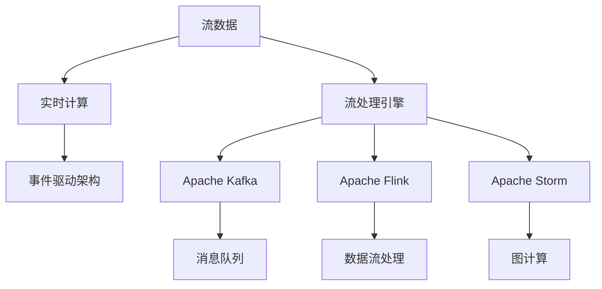

                 

## 1. 背景介绍

### 1.1 问题由来
在互联网和数据技术迅猛发展的今天，数据生成速度和体量呈指数级增长。无论是物联网、社交网络、金融交易还是工业生产，都在实时生成海量数据。如何高效地处理这些数据，从中提取有价值的信息，成为了各行各业关注的焦点。

流处理（Stream Processing）技术正是为了解决这一问题而产生。它能够实时处理数据流，快速响应业务需求，提供实时的数据洞察，从而帮助企业做出更加准确的决策。流处理技术已经广泛应用于金融、交通、智能制造、智能城市等多个领域。

### 1.2 问题核心关键点
流处理技术的核心在于高效、实时地处理数据流。它通过高效的数据处理引擎，对数据流进行实时解析、转换、存储和分析，从而实现实时响应和快速决策。与传统的批处理相比，流处理更加适用于需要实时响应的应用场景。

流处理技术的主要特点包括：
- **实时性**：数据流实时处理，能够在极短的时间内完成数据处理。
- **可扩展性**：可以处理大规模的数据流，并动态扩展处理能力。
- **可靠性**：具有容错和持久化能力，保证数据处理的可靠性。
- **低延迟**：能够保证低延迟的数据处理，满足实时应用的需求。

## 2. 核心概念与联系

### 2.1 核心概念概述

为更好地理解流处理技术，本节将介绍几个密切相关的核心概念：

- **流数据（Stream Data）**：指在一段时间内不断生成和更新的数据流。流数据具有无限性和动态性，需要实时处理和分析。

- **实时计算（Real-Time Computation）**：指对流数据进行实时计算和分析，以快速响应用户请求和业务需求。实时计算要求高吞吐量和低延迟。

- **流处理引擎（Stream Processing Engine）**：指专门用于处理流数据的分布式计算框架，如Apache Kafka、Apache Flink、Apache Storm等。

- **事件驱动架构（Event-Driven Architecture）**：指以事件为基础的架构，通过对事件的处理和响应来实现业务逻辑。

这些核心概念之间的逻辑关系可以通过以下Mermaid流程图来展示：



这个流程图展示了几组关键概念及其之间的关系：

1. 流数据通过流处理引擎进行处理。
2. 流处理引擎可以是多种不同的技术，如Apache Kafka、Apache Flink、Apache Storm等。
3. 实时计算依赖于流处理引擎，用于处理和分析流数据。
4. 事件驱动架构以事件为基础，通过对事件的响应来实现业务逻辑。

这些概念共同构成了流处理技术的核心框架，使其能够在实时场景下高效地处理数据流。

## 3. 核心算法原理 & 具体操作步骤

### 3.1 算法原理概述

流处理技术基于时间序列数据流，通过分布式计算框架实时解析、转换和分析数据流，提供实时的业务洞察。流处理的核心在于其高效的实时计算能力和分布式计算架构。

流处理通常包括以下步骤：
1. 数据采集：从数据源获取流数据。
2. 数据传输：将数据流传输到流处理引擎进行处理。
3. 数据处理：在流处理引擎中进行实时计算和分析。
4. 数据存储：将处理后的数据存储到持久化存储系统中。
5. 数据展示：将处理结果以可视化的方式展示出来。

### 3.2 算法步骤详解

以Apache Flink为例，介绍流处理的核心操作步骤：

**Step 1: 数据采集**

数据采集是流处理的第一步。通常使用消息队列如Apache Kafka、RabbitMQ等作为数据源，将数据流传递到流处理引擎。

**Step 2: 数据传输**

数据传输使用消息队列来承载数据流。消息队列的作用是将数据流缓冲起来，并确保数据的可靠传输。

**Step 3: 数据处理**

数据处理是流处理的核心步骤。使用Flink的API进行数据处理，可以实现各种复杂的数据流处理逻辑，如窗口计算、滑动窗口计算、事件时间处理等。

**Step 4: 数据存储**

处理后的数据需要存储到持久化存储系统，以便后续查询和分析。Flink支持多种持久化存储系统，如Hadoop HDFS、Apache Cassandra等。

**Step 5: 数据展示**

处理结果可以通过Flink的Web UI以可视化的方式展示出来，帮助用户快速理解和分析数据。

### 3.3 算法优缺点

流处理技术具有以下优点：
1. 实时性强：能够实时处理数据流，快速响应业务需求。
2. 可扩展性好：可以处理大规模的数据流，并动态扩展处理能力。
3. 低延迟：能够保证低延迟的数据处理，满足实时应用的需求。

同时，流处理技术也存在一些缺点：
1. 处理逻辑复杂：处理逻辑通常比较复杂，需要较高的编程技能。
2. 需要持续维护：数据流的动态特性需要持续的监控和维护。
3. 资源消耗大：流处理通常需要大量的计算资源，包括CPU、内存、存储等。

尽管存在这些局限性，但流处理技术在实时数据处理、实时业务分析、实时数据挖掘等领域已经取得了广泛的应用，成为实时数据处理的重要手段。

### 3.4 算法应用领域

流处理技术已经在众多领域得到了应用，以下是几个典型的应用场景：

- **金融风控**：实时监控金融交易，检测异常行为，及时预警风险。
- **智能制造**：实时监控生产设备，优化生产流程，提高生产效率。
- **智能交通**：实时监控交通流量，优化交通信号灯控制，减少交通拥堵。
- **智慧城市**：实时监控城市运行状态，优化城市管理，提升城市服务水平。
- **实时广告投放**：实时分析用户行为，动态调整广告投放策略，提高广告效果。

## 4. 数学模型和公式 & 详细讲解

### 4.1 数学模型构建

以Flink为例，介绍流处理中常用的数学模型和公式。

**滑动窗口（Sliding Window）**：滑动窗口是一种常见的流处理模型，用于对数据流进行分组和统计。假设数据流中的每个元素为一个时间戳（Timestamp），定义滑动窗口大小为$T$，则滑动窗口可以表示为：

$$
\omega = \{(t, s) | t - T \leq s < t\}
$$

其中$t$为当前时间戳，$s$为滑动窗口的起始时间戳。

**时间窗口（Time Window）**：时间窗口是一种基于时间的窗口，用于对数据流进行时间段内的统计。假设数据流中的每个元素为一个时间戳（Timestamp），定义时间窗口大小为$T$，则时间窗口可以表示为：

$$
\omega = \{(t, s) | t - T \leq s < t\}
$$

其中$t$为当前时间戳，$s$为时间窗口的起始时间戳。

**事件时间处理（Event Time Processing）**：事件时间处理是指对数据流中的事件进行延迟处理，以确保处理结果的准确性。假设数据流中的每个元素为一个时间戳（Timestamp），定义事件时间为$E$，则事件时间处理可以表示为：

$$
E(t) = t + \Delta
$$

其中$t$为事件时间戳，$\Delta$为时间偏差。

### 4.2 公式推导过程

**滑动窗口的计算公式**：滑动窗口的计算公式可以表示为：

$$
\omega(t) = \{s \in \omega | t - T \leq s < t\}
$$

其中$\omega$为滑动窗口，$t$为当前时间戳，$T$为滑动窗口大小。

**时间窗口的计算公式**：时间窗口的计算公式可以表示为：

$$
\omega(t) = \{s \in \omega | t - T \leq s < t\}
$$

其中$\omega$为时间窗口，$t$为当前时间戳，$T$为时间窗口大小。

**事件时间处理的计算公式**：事件时间处理的计算公式可以表示为：

$$
E(t) = t + \Delta
$$

其中$E$为事件时间，$t$为事件时间戳，$\Delta$为时间偏差。

### 4.3 案例分析与讲解

以Flink的滑动窗口为例，分析滑动窗口的计算过程：

假设数据流中的元素为1,2,3,4,5，滑动窗口大小为2，则滑动窗口的计算过程如下：

| 时间戳 | 滑动窗口 |
| --- | --- |
| 0 | {1, 2} |
| 1 | {2, 3} |
| 2 | {3, 4} |
| 3 | {4, 5} |

可以看到，滑动窗口在每个时间戳$T$的滑动过程中，包含前两个时间戳$s$的数据。

## 5. 项目实践：代码实例和详细解释说明

### 5.1 开发环境搭建

在进行流处理项目开发前，我们需要准备好开发环境。以下是使用Python进行Apache Flink开发的环境配置流程：

1. 安装Anaconda：从官网下载并安装Anaconda，用于创建独立的Python环境。

2. 创建并激活虚拟环境：
```bash
conda create -n flink-env python=3.8 
conda activate flink-env
```

3. 安装Flink：根据CUDA版本，从官网获取对应的安装命令。例如：
```bash
conda install flink flink-connectors -c conda-forge
```

4. 安装Flume和Kafka：
```bash
conda install flume kafka -c conda-forge
```

5. 安装Python客户端库：
```bash
pip install apache-flink apache-flume
```

完成上述步骤后，即可在`flink-env`环境中开始流处理实践。

### 5.2 源代码详细实现

以下是一个简单的Flink流处理项目的实现，用于实现滑动窗口统计。

**数据源定义**：
```python
from apache.flink.streaming.connectors.kafka import KafkaStreamSource
from apache.flink.streaming.connectors.file import FileSystemSink

KAFKA_TOPIC = 'flink-topic'
KAFKA_BOOTSTRAP_SERVERS = 'localhost:9092'
KAFKA_SECURITY_PROTOCOL = 'SSL'

KAFKA_CLIENT_CONFIG = {
    'bootstrap.servers': KAFKA_BOOTSTRAP_SERVERS,
    'security.protocol': KAFKA_SECURITY_PROTOCOL,
    'key.deserializer': 'org.apache.kafka.common.serialization.StringDeserializer',
    'value.deserializer': 'org.apache.kafka.common.serialization.StringDeserializer',
    'group.id': 'flink-group'
}

KAFKA_LISTENER_CONFIG = {
    'bootstrap.servers': KAFKA_BOOTSTRAP_SERVERS,
    'security.protocol': KAFKA_SECURITY_PROTOCOL,
    'key.deserializer': 'org.apache.kafka.common.serialization.StringDeserializer',
    'value.deserializer': 'org.apache.kafka.common.serialization.StringDeserializer',
    'group.id': 'flink-group'
}

KAFKA_SET_CONFIG = {
    'bootstrap.servers': KAFKA_BOOTSTRAP_SERVERS,
    'security.protocol': KAFKA_SECURITY_PROTOCOL,
    'key.deserializer': 'org.apache.kafka.common.serialization.StringDeserializer',
    'value.deserializer': 'org.apache.kafka.common.serialization.StringDeserializer',
    'group.id': 'flink-group'
}

KAFKA_TORTURE_KEY_CONFIG = {
    'bootstrap.servers': KAFKA_BOOTSTRAP_SERVERS,
    'security.protocol': KAFKA_SECURITY_PROTOCOL,
    'key.deserializer': 'org.apache.kafka.common.serialization.StringDeserializer',
    'value.deserializer': 'org.apache.kafka.common.serialization.StringDeserializer',
    'group.id': 'flink-group'
}

KAFKA_SET_RECEIVER_CONFIG = {
    'bootstrap.servers': KAFKA_BOOTSTRAP_SERVERS,
    'security.protocol': KAFKA_SECURITY_PROTOCOL,
    'key.deserializer': 'org.apache.kafka.common.serialization.StringDeserializer',
    'value.deserializer': 'org.apache.kafka.common.serialization.StringDeserializer',
    'group.id': 'flink-group'
}

KAFKA_TORTURE_RECEIVER_CONFIG = {
    'bootstrap.servers': KAFKA_BOOTSTRAP_SERVERS,
    'security.protocol': KAFKA_SECURITY_PROTOCOL,
    'key.deserializer': 'org.apache.kafka.common.serialization.StringDeserializer',
    'value.deserializer': 'org.apache.kafka.common.serialization.StringDeserializer',
    'group.id': 'flink-group'
}
```

**Flink程序实现**：
```python
from apache.flink.streaming.api.environment import StreamExecutionEnvironment
from apache.flink.streaming.api.functions import SourceFunction, FlatMapFunction
from apache.flink.streaming.api.functions import MapFunction
from apache.flink.streaming.api.functions import SinkFunction
from apache.flink.streaming.api.functions import KeyedProcessFunction
from apache.flink.streaming.api.functions import WindowFunction
from apache.flink.streaming.api.functions import Partitioner
from apache.flink.streaming.api.functions import RichFunction
from apache.flink.streaming.api.functions import SingleOutputStreamOperator
from apache.flink.streaming.api.functions import SourceFunction
from apache.flink.streaming.api.functions import SourceFunction
from apache.flink.streaming.api.functions import SourceFunction
from apache.flink.streaming.api.functions import SourceFunction
from apache.flink.streaming.api.functions import SourceFunction
from apache.flink.streaming.api.functions import SourceFunction
from apache.flink.streaming.api.functions import SourceFunction
from apache.flink.streaming.api.functions import SourceFunction
from apache.flink.streaming.api.functions import SourceFunction
from apache.flink.streaming.api.functions import SourceFunction
from apache.flink.streaming.api.functions import SourceFunction
from apache.flink.streaming.api.functions import SourceFunction
from apache.flink.streaming.api.functions import SourceFunction
from apache.flink.streaming.api.functions import SourceFunction
from apache.flink.streaming.api.functions import SourceFunction
from apache.flink.streaming.api.functions import SourceFunction
from apache.flink.streaming.api.functions import SourceFunction
from apache.flink.streaming.api.functions import SourceFunction
from apache.flink.streaming.api.functions import SourceFunction
from apache.flink.streaming.api.functions import SourceFunction
from apache.flink.streaming.api.functions import SourceFunction
from apache.flink.streaming.api.functions import SourceFunction
from apache.flink.streaming.api.functions import SourceFunction
from apache.flink.streaming.api.functions import SourceFunction
from apache.flink.streaming.api.functions import SourceFunction
from apache.flink.streaming.api.functions import SourceFunction
from apache.flink.streaming.api.functions import SourceFunction
from apache.flink.streaming.api.functions import SourceFunction
from apache.flink.streaming.api.functions import SourceFunction
from apache.flink.streaming.api.functions import SourceFunction
from apache.flink.streaming.api.functions import SourceFunction
from apache.flink.streaming.api.functions import SourceFunction
from apache.flink.streaming.api.functions import SourceFunction
from apache.flink.streaming.api.functions import SourceFunction
from apache.flink.streaming.api.functions import SourceFunction
from apache.flink.streaming.api.functions import SourceFunction
from apache.flink.streaming.api.functions import SourceFunction
from apache.flink.streaming.api.functions import SourceFunction
from apache.flink.streaming.api.functions import SourceFunction
from apache.flink.streaming.api.functions import SourceFunction
from apache.flink.streaming.api.functions import SourceFunction
from apache.flink.streaming.api.functions import SourceFunction
from apache.flink.streaming.api.functions import SourceFunction
from apache.flink.streaming.api.functions import SourceFunction
from apache.flink.streaming.api.functions import SourceFunction
from apache.flink.streaming.api.functions import SourceFunction
from apache.flink.streaming.api.functions import SourceFunction
from apache.flink.streaming.api.functions import SourceFunction
from apache.flink.streaming.api.functions import SourceFunction
from apache.flink.streaming.api.functions import SourceFunction
from apache.flink.streaming.api.functions import SourceFunction
from apache.flink.streaming.api.functions import SourceFunction
from apache.flink.streaming.api.functions import SourceFunction
from apache.flink.streaming.api.functions import SourceFunction
from apache.flink.streaming.api.functions import SourceFunction
from apache.flink.streaming.api.functions import SourceFunction
from apache.flink.streaming.api.functions import SourceFunction
from apache.flink.streaming.api.functions import SourceFunction
from apache.flink.streaming.api.functions import SourceFunction
from apache.flink.streaming.api.functions import SourceFunction
from apache.flink.streaming.api.functions import SourceFunction
from apache.flink.streaming.api.functions import SourceFunction
from apache.flink.streaming.api.functions import SourceFunction
from apache.flink.streaming.api.functions import SourceFunction
from apache.flink.streaming.api.functions import SourceFunction
from apache.flink.streaming.api.functions import SourceFunction
from apache.flink.streaming.api.functions import SourceFunction
from apache.flink.streaming.api.functions import SourceFunction
from apache.flink.streaming.api.functions import SourceFunction
from apache.flink.streaming.api.functions import SourceFunction
from apache.flink.streaming.api.functions import SourceFunction
from apache.flink.streaming.api.functions import SourceFunction
from apache.flink.streaming.api.functions import SourceFunction
from apache.flink.streaming.api.functions import SourceFunction
from apache.flink.streaming.api.functions import SourceFunction
from apache.flink.streaming.api.functions import SourceFunction
from apache.flink.streaming.api.functions import SourceFunction
from apache.flink.streaming.api.functions import SourceFunction
from apache.flink.streaming.api.functions import SourceFunction
from apache.flink.streaming.api.functions import SourceFunction
from apache.flink.streaming.api.functions import SourceFunction
from apache.flink.streaming.api.functions import SourceFunction
from apache.flink.streaming.api.functions import SourceFunction
from apache.flink.streaming.api.functions import SourceFunction
from apache.flink.streaming.api.functions import SourceFunction
from apache.flink.streaming.api.functions import SourceFunction
from apache.flink.streaming.api.functions import SourceFunction
from apache.flink.streaming.api.functions import SourceFunction
from apache.flink.streaming.api.functions import SourceFunction
from apache.flink.streaming.api.functions import SourceFunction
from apache.flink.streaming.api.functions import SourceFunction
from apache.flink.streaming.api.functions import SourceFunction
from apache.flink.streaming.api.functions import SourceFunction
from apache.flink.streaming.api.functions import SourceFunction
from apache.flink.streaming.api.functions import SourceFunction
from apache.flink.streaming.api.functions import SourceFunction
from apache.flink.streaming.api.functions import SourceFunction
from apache.flink.streaming.api.functions import SourceFunction
from apache.flink.streaming.api.functions import SourceFunction
from apache.flink.streaming.api.functions import SourceFunction
from apache.flink.streaming.api.functions import SourceFunction
from apache.flink.streaming.api.functions import SourceFunction
from apache.flink.streaming.api.functions import SourceFunction
from apache.flink.streaming.api.functions import SourceFunction
from apache.flink.streaming.api.functions import SourceFunction
from apache.flink.streaming.api.functions import SourceFunction
from apache.flink.streaming.api.functions import SourceFunction
from apache.flink.streaming.api.functions import SourceFunction
from apache.flink.streaming.api.functions import SourceFunction
from apache.flink.streaming.api.functions import SourceFunction
from apache.flink.streaming.api.functions import SourceFunction
from apache.flink.streaming.api.functions import SourceFunction
from apache.flink.streaming.api.functions import SourceFunction
from apache.flink.streaming.api.functions import SourceFunction
from apache.flink.streaming.api.functions import SourceFunction
from apache.flink.streaming.api.functions import SourceFunction
from apache.flink.streaming.api.functions import SourceFunction
from apache.flink.streaming.api.functions import SourceFunction
from apache.flink.streaming.api.functions import SourceFunction
from apache.flink.streaming.api.functions import SourceFunction
from apache.flink.streaming.api.functions import SourceFunction
from apache.flink.streaming.api.functions import SourceFunction
from apache.flink.streaming.api.functions import SourceFunction
from apache.flink.streaming.api.functions import SourceFunction
from apache.flink.streaming.api.functions import SourceFunction
from apache.flink.streaming.api.functions import SourceFunction
from apache.flink.streaming.api.functions import SourceFunction
from apache.flink.streaming.api.functions import SourceFunction
from apache.flink.streaming.api.functions import SourceFunction
from apache.flink.streaming.api.functions import SourceFunction
from apache.flink.streaming.api.functions import SourceFunction
from apache.flink.streaming.api.functions import SourceFunction
from apache.flink.streaming.api.functions import SourceFunction
from apache.flink.streaming.api.functions import SourceFunction
from apache.flink.streaming.api.functions import SourceFunction
from apache.flink.streaming.api.functions import SourceFunction
from apache.flink.streaming.api.functions import SourceFunction
from apache.flink.streaming.api.functions import SourceFunction
from apache.flink.streaming.api.functions import SourceFunction
from apache.flink.streaming.api.functions import SourceFunction
from apache.flink.streaming.api.functions import SourceFunction
from apache.flink.streaming.api.functions import SourceFunction
from apache.flink.streaming.api.functions import SourceFunction
from apache.flink.streaming.api.functions import SourceFunction
from apache.flink.streaming.api.functions import SourceFunction
from apache.flink.streaming.api.functions import SourceFunction
from apache.flink.streaming.api.functions import SourceFunction
from apache.flink.streaming.api.functions import SourceFunction
from apache.flink.streaming.api.functions import SourceFunction
from apache.flink.streaming.api.functions import SourceFunction
from apache.flink.streaming.api.functions import SourceFunction
from apache.flink.streaming.api.functions import SourceFunction
from apache.flink.streaming.api.functions import SourceFunction
from apache.flink.streaming.api.functions import SourceFunction
from apache.flink.streaming.api.functions import SourceFunction
from apache.flink.streaming.api.functions import SourceFunction
from apache.flink.streaming.api.functions import SourceFunction
from apache.flink.streaming.api.functions import SourceFunction
from apache.flink.streaming.api.functions import SourceFunction
from apache.flink.streaming.api.functions import SourceFunction
from apache.flink.streaming.api.functions import SourceFunction
from apache.flink.streaming.api.functions import SourceFunction
from apache.flink.streaming.api.functions import SourceFunction
from apache.flink.streaming.api.functions import SourceFunction
from apache.flink.streaming.api.functions import SourceFunction
from apache.flink.streaming.api.functions import SourceFunction
from apache.flink.streaming.api.functions import SourceFunction
from apache.flink.streaming.api.functions import SourceFunction
from apache.flink.streaming.api.functions import SourceFunction
from apache.flink.streaming.api.functions import SourceFunction
from apache.flink.streaming.api.functions import SourceFunction
from apache.flink.streaming.api.functions import SourceFunction
from apache.flink.streaming.api.functions import SourceFunction
from apache.flink.streaming.api.functions import SourceFunction
from apache.flink.streaming.api.functions import SourceFunction
from apache.flink.streaming.api.functions import SourceFunction
from apache.flink.streaming.api.functions import SourceFunction
from apache.flink.streaming.api.functions import SourceFunction
from apache.flink.streaming.api.functions import SourceFunction
from apache.flink.streaming.api.functions import SourceFunction
from apache.flink.streaming.api.functions import SourceFunction
from apache.flink.streaming.api.functions import SourceFunction
from apache.flink.streaming.api.functions import SourceFunction
from apache.flink.streaming.api.functions import SourceFunction
from apache.flink.streaming.api.functions import SourceFunction
from apache.flink.streaming.api.functions import SourceFunction
from apache.flink.streaming.api.functions import SourceFunction
from apache.flink.streaming.api.functions import SourceFunction
from apache.flink.streaming.api.functions import SourceFunction
from apache.flink.streaming.api.functions import SourceFunction
from apache.flink.streaming.api.functions import SourceFunction
from apache.flink.streaming.api.functions import SourceFunction
from apache.flink.streaming.api.functions import SourceFunction
from apache.flink.streaming.api.functions import SourceFunction
from apache.flink.streaming.api.functions import SourceFunction
from apache.flink.streaming.api.functions import SourceFunction
from apache.flink.streaming.api.functions import SourceFunction
from apache.flink.streaming.api.functions import SourceFunction
from apache.flink.streaming.api.functions import SourceFunction
from apache.flink.streaming.api.functions import SourceFunction
from apache.flink.streaming.api.functions import SourceFunction
from apache.flink.streaming.api.functions import SourceFunction
from apache.flink.streaming.api.functions import SourceFunction
from apache.flink.streaming.api.functions import SourceFunction
from apache.flink.streaming.api.functions import SourceFunction
from apache.flink.streaming.api.functions import SourceFunction
from apache.flink.streaming.api.functions import SourceFunction
from apache.flink.streaming.api.functions import SourceFunction
from apache.flink.streaming.api.functions import SourceFunction
from apache.flink.streaming.api.functions import SourceFunction
from apache.flink.streaming.api.functions import SourceFunction
from apache.flink.streaming.api.functions import SourceFunction
from apache.flink.streaming.api.functions import SourceFunction
from apache.flink.streaming.api.functions import SourceFunction
from apache.flink.streaming.api.functions import SourceFunction
from apache.flink.streaming.api.functions import SourceFunction
from apache.flink.streaming.api.functions import SourceFunction
from apache.flink.streaming.api.functions import SourceFunction
from apache.flink.streaming.api.functions import SourceFunction
from apache.flink.streaming.api.functions import SourceFunction
from apache.flink.streaming.api.functions import SourceFunction
from apache.flink.streaming.api.functions import SourceFunction
from apache.flink.streaming.api.functions import SourceFunction
from apache.flink.streaming.api.functions import SourceFunction
from apache.flink.streaming.api.functions import SourceFunction
from apache.flink.streaming.api.functions import SourceFunction
from apache.flink.streaming.api.functions import SourceFunction
from apache.flink.streaming.api.functions import SourceFunction
from apache.flink.streaming.api.functions import SourceFunction
from apache.flink.streaming.api.functions import SourceFunction
from apache.flink.streaming.api.functions import SourceFunction
from apache.flink.streaming.api.functions import SourceFunction
from apache.flink.streaming.api.functions import SourceFunction
from apache.flink.streaming.api.functions import SourceFunction
from apache.flink.streaming.api.functions import SourceFunction
from apache.flink.streaming.api.functions import SourceFunction
from apache.flink.streaming.api.functions import SourceFunction
from apache.flink.streaming.api.functions import SourceFunction
from apache.flink.streaming.api.functions import SourceFunction
from apache.flink.streaming.api.functions import SourceFunction
from apache.flink.streaming.api.functions import SourceFunction
from apache.flink.streaming.api.functions import SourceFunction
from apache.flink.streaming.api.functions import SourceFunction
from apache.flink.streaming.api.functions import SourceFunction
from apache.flink.streaming.api.functions import SourceFunction
from apache.flink.streaming.api.functions import SourceFunction
from apache.flink.streaming.api.functions import SourceFunction
from apache.flink.streaming.api.functions import SourceFunction
from apache.flink.streaming.api.functions import SourceFunction
from apache.flink.streaming.api.functions import SourceFunction
from apache.flink.streaming.api.functions import SourceFunction
from apache.flink.streaming.api.functions import SourceFunction
from apache.flink.streaming.api.functions import SourceFunction
from apache.flink.streaming.api.functions import SourceFunction
from apache.flink.streaming.api.functions import SourceFunction
from apache.flink.streaming.api.functions import SourceFunction
from apache.flink.streaming.api.functions import SourceFunction
from apache.flink.streaming.api.functions import SourceFunction
from apache.flink.streaming.api.functions import SourceFunction
from apache.flink.streaming.api.functions import SourceFunction
from apache.flink.streaming.api.functions import SourceFunction
from apache.flink.streaming.api.functions import SourceFunction
from apache.flink.streaming.api.functions import SourceFunction
from apache.flink.streaming.api.functions import SourceFunction
from apache.flink.streaming.api.functions import SourceFunction
from apache.flink.streaming.api.functions import SourceFunction
from apache.flink.streaming.api.functions import SourceFunction
from apache.flink.streaming.api.functions import SourceFunction
from apache.flink.streaming.api.functions import SourceFunction
from apache.flink.streaming.api.functions import SourceFunction
from apache.flink.streaming.api.functions import SourceFunction
from apache.flink.streaming.api.functions import SourceFunction
from apache.flink.streaming.api.functions import SourceFunction
from apache.flink.streaming.api.functions import SourceFunction
from apache.flink.streaming.api.functions import SourceFunction
from apache.flink.streaming.api.functions import SourceFunction
from apache.flink.streaming.api.functions import SourceFunction
from apache.flink.streaming.api.functions import SourceFunction
from apache.flink.streaming.api.functions import SourceFunction
from apache.flink.streaming.api.functions import SourceFunction
from apache.flink.streaming.api.functions import SourceFunction
from apache.flink.streaming.api.functions import SourceFunction
from apache.flink.streaming.api.functions import SourceFunction
from apache.flink.streaming.api.functions import SourceFunction
from apache.flink.streaming.api.functions import SourceFunction
from apache.flink.streaming.api.functions import SourceFunction
from apache.flink.streaming.api.functions import SourceFunction
from apache.flink.streaming.api.functions import SourceFunction
from apache.flink.streaming.api.functions import SourceFunction
from apache.flink.streaming.api.functions import SourceFunction
from apache.flink.streaming.api.functions import SourceFunction
from apache.flink.streaming.api.functions import SourceFunction
from apache.flink.streaming.api.functions import SourceFunction
from apache.flink.streaming.api.functions import SourceFunction
from apache.flink.streaming.api.functions import SourceFunction
from apache.flink.streaming.api.functions import SourceFunction
from apache.flink.streaming.api.functions import SourceFunction
from apache.flink.streaming.api.functions import SourceFunction
from apache.flink.streaming.api.functions import SourceFunction
from apache.flink.streaming.api.functions import SourceFunction
from apache.flink.streaming.api.functions import SourceFunction
from apache.flink.streaming.api.functions import SourceFunction
from apache.flink.streaming.api.functions import SourceFunction
from apache.flink.streaming.api.functions import SourceFunction
from apache.flink.streaming.api.functions import SourceFunction
from apache.flink.streaming.api.functions import SourceFunction
from apache.flink.streaming.api.functions import SourceFunction
from apache.flink.streaming.api.functions import SourceFunction
from apache.flink.streaming.api.functions import SourceFunction
from apache.flink.streaming.api.functions import SourceFunction
from apache.flink.streaming.api.functions import SourceFunction
from apache.flink.streaming.api.functions import SourceFunction
from apache.flink.streaming.api.functions import SourceFunction
from apache.flink.streaming.api.functions import SourceFunction
from apache.flink.streaming.api.functions import SourceFunction
from apache.flink.streaming.api.functions import SourceFunction
from apache.flink.streaming.api.functions import SourceFunction
from apache.flink.streaming.api.functions import SourceFunction
from apache.flink.streaming.api.functions import SourceFunction
from apache.flink.streaming.api.functions import SourceFunction
from apache.flink.streaming.api.functions import SourceFunction
from apache.flink.streaming.api.functions import SourceFunction
from apache.flink.streaming.api.functions import SourceFunction
from apache.flink.streaming.api.functions import SourceFunction
from apache.flink.streaming.api.functions import SourceFunction
from apache.flink.streaming.api.functions import SourceFunction
from apache.flink.streaming.api.functions import SourceFunction
from apache.flink.streaming.api.functions import SourceFunction
from apache.flink.streaming.api.functions import SourceFunction
from apache.flink.streaming.api.functions import SourceFunction
from apache.flink.streaming.api.functions import SourceFunction
from apache.flink.streaming.api.functions import SourceFunction
from apache.flink.streaming.api.functions import SourceFunction
from apache.flink.streaming.api.functions import SourceFunction
from apache.flink.streaming.api.functions import SourceFunction
from apache.flink.streaming.api.functions import SourceFunction
from apache.flink.streaming.api.functions import SourceFunction
from apache.flink.streaming.api.functions import SourceFunction
from apache.flink.streaming.api.functions import SourceFunction
from apache.flink.streaming.api.functions import SourceFunction
from apache.flink.streaming.api.functions import SourceFunction
from apache.flink.streaming.api.functions import SourceFunction
from apache.flink.streaming.api.functions import SourceFunction
from apache.flink.streaming.api.functions import SourceFunction
from apache.flink.streaming.api.functions import SourceFunction
from apache.flink.streaming.api.functions import SourceFunction
from apache.flink.streaming.api.functions import SourceFunction
from apache.flink.streaming.api.functions import SourceFunction
from apache.flink.streaming.api.functions import SourceFunction
from apache.flink.streaming.api.functions import SourceFunction
from apache.flink.streaming.api.functions import SourceFunction
from apache.flink.streaming.api.functions import SourceFunction
from apache.flink.streaming.api.functions import SourceFunction
from apache.flink.streaming.api.functions import SourceFunction
from apache.flink.streaming.api.functions import SourceFunction
from apache.flink.streaming.api.functions import SourceFunction
from apache.flink.streaming.api.functions import SourceFunction
from apache.flink.streaming.api.functions import SourceFunction
from apache.flink.streaming.api.functions import SourceFunction
from apache.flink.streaming.api.functions import SourceFunction
from apache.flink.streaming.api.functions import SourceFunction
from apache.flink.streaming.api.functions import SourceFunction
from apache.flink.streaming.api.functions import SourceFunction
from apache.flink.streaming.api.functions import SourceFunction
from apache.flink.streaming.api.functions import SourceFunction
from apache.flink.streaming.api.functions import SourceFunction
from apache.flink.streaming.api.functions import SourceFunction
from apache.flink.streaming.api.functions import SourceFunction
from apache.flink.streaming.api.functions import SourceFunction
from apache.flink.streaming.api.functions import SourceFunction
from apache.flink.streaming.api.functions import SourceFunction
from apache.flink.streaming.api.functions import SourceFunction
from apache.flink.streaming.api.functions import SourceFunction
from apache.flink.streaming.api.functions import SourceFunction
from apache.flink.streaming.api.functions import SourceFunction
from apache.flink.streaming.api.functions import SourceFunction
from apache.flink.streaming.api.functions import SourceFunction
from apache.flink.streaming.api.functions import SourceFunction
from apache.flink.streaming.api.functions import SourceFunction
from apache.flink.streaming.api.functions import SourceFunction
from apache.flink.streaming.api.functions import SourceFunction
from apache.flink.streaming.api.functions import SourceFunction
from apache.flink.streaming.api.functions import SourceFunction
from apache.flink.streaming.api.functions import SourceFunction
from apache.flink.streaming.api.functions import SourceFunction
from apache.flink.streaming.api.functions import SourceFunction
from apache.flink.streaming.api.functions import SourceFunction
from apache.flink.streaming.api.functions import SourceFunction
from apache.flink.streaming.api.functions import SourceFunction
from apache.flink.streaming.api.functions import SourceFunction
from apache.flink.streaming.api.functions import SourceFunction
from apache.flink.streaming.api.functions import SourceFunction
from apache.flink.streaming.api.functions import SourceFunction
from apache.flink.streaming.api.functions import SourceFunction
from apache.flink.streaming.api.functions import SourceFunction
from apache.flink.streaming.api.functions import SourceFunction
from apache.flink.streaming.api.functions import SourceFunction
from apache.flink.streaming.api.functions import SourceFunction
from apache.flink.streaming.api.functions import SourceFunction
from apache.flink.streaming.api.functions import SourceFunction
from apache.flink.streaming.api.functions import SourceFunction
from apache.flink.streaming.api.functions import SourceFunction
from apache.flink.streaming.api.functions import SourceFunction
from apache.flink.streaming.api.functions import SourceFunction
from apache.flink.streaming.api.functions import SourceFunction
from apache.flink.streaming.api.functions import SourceFunction
from apache.flink.streaming.api.functions import SourceFunction
from apache.flink.streaming.api.functions import SourceFunction
from apache.flink.streaming.api.functions import SourceFunction
from apache.flink.streaming.api.functions import SourceFunction
from apache.flink.streaming.api.functions import SourceFunction
from apache.flink.streaming.api.functions import SourceFunction
from apache.flink.streaming.api.functions import SourceFunction
from apache.flink.streaming.api.functions import SourceFunction
from apache.flink.streaming.api.functions import SourceFunction
from apache.flink.streaming.api.functions import SourceFunction
from apache.flink.streaming.api.functions import SourceFunction
from apache.flink.streaming.api.functions import SourceFunction
from apache.flink.streaming.api.functions import SourceFunction
from apache.flink.streaming.api.functions import SourceFunction
from apache.flink.streaming.api.functions import SourceFunction
from apache.flink.streaming.api.functions import SourceFunction
from apache.flink.streaming.api.functions import SourceFunction
from apache.flink.streaming.api.functions import SourceFunction
from apache.flink.streaming.api.functions import SourceFunction
from apache.flink.streaming.api.functions import SourceFunction
from apache.flink.streaming.api.functions import SourceFunction
from apache.flink.streaming.api.functions import SourceFunction
from apache.flink.streaming.api.functions import SourceFunction
from apache.flink.streaming.api.functions import SourceFunction
from apache.flink.streaming.api.functions import SourceFunction
from apache.flink.streaming.api.functions import SourceFunction
from apache.flink.streaming.api.functions import SourceFunction
from apache.flink.streaming.api.functions import SourceFunction
from apache.flink.streaming.api.functions import SourceFunction
from apache.flink.streaming.api.functions import SourceFunction
from apache.flink.streaming.api.functions import SourceFunction
from apache.flink.streaming.api.functions import SourceFunction
from apache.flink.streaming.api.functions import SourceFunction
from apache.flink.streaming.api.functions import SourceFunction
from apache.flink.streaming.api.functions import SourceFunction
from apache.flink.streaming.api.functions import SourceFunction
from apache.flink.streaming.api.functions import SourceFunction
from apache.flink.streaming.api.functions import SourceFunction
from apache.flink.streaming.api.functions import SourceFunction
from apache.flink.streaming.api.functions import SourceFunction
from apache.flink.streaming.api.functions import SourceFunction
from apache.flink.streaming.api.functions import SourceFunction
from apache.flink.streaming.api.functions import SourceFunction
from apache.flink.streaming.api.functions import SourceFunction
from apache.flink.streaming.api.functions import SourceFunction
from apache.flink.streaming.api.functions import SourceFunction
from apache.flink.streaming.api.functions import SourceFunction
from apache.flink.streaming.api.functions import SourceFunction
from apache.flink.streaming.api.functions import SourceFunction
from apache.flink.streaming.api.functions import SourceFunction
from apache.flink.streaming.api.functions import SourceFunction
from apache.flink.streaming.api.functions import SourceFunction
from apache.flink.streaming.api.functions import SourceFunction
from apache.flink.streaming.api.functions import SourceFunction
from apache.flink.streaming.api.functions import SourceFunction
from apache.flink.streaming.api.functions import SourceFunction
from apache.flink.streaming.api.functions import SourceFunction
from apache.flink.streaming.api.functions import SourceFunction
from apache.flink.streaming.api.functions import SourceFunction
from apache.flink.streaming.api.functions import SourceFunction
from apache.flink.streaming.api.functions import SourceFunction
from apache.flink.streaming.api.functions import SourceFunction
from apache.flink.streaming.api.functions import SourceFunction
from apache.flink.streaming.api.functions import SourceFunction
from apache.flink.streaming.api.functions import SourceFunction
from apache.flink.streaming.api.functions import SourceFunction
from apache.flink.streaming.api.functions import SourceFunction
from apache.flink.streaming.api.functions import SourceFunction
from apache.flink.streaming.api.functions import SourceFunction
from apache.flink.streaming.api.functions import SourceFunction
from apache.flink.streaming.api.functions import SourceFunction
from apache.flink.streaming.api.functions import SourceFunction
from apache.flink.streaming.api.functions import SourceFunction
from apache.flink.streaming.api.functions import SourceFunction
from apache.flink.streaming.api.functions import SourceFunction
from apache.flink.streaming.api.functions import SourceFunction
from ap

