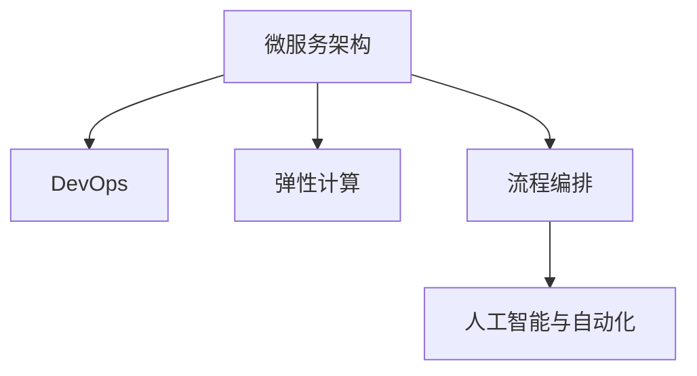

                 

# 流程拆解与AI的灵活编排

> 关键词：人工智能,流程编排,微服务,弹性计算,DevOps

## 1. 背景介绍

随着人工智能技术的发展，企业在构建智能化业务过程中需要处理日益复杂的多元化任务。这包括数据分析、业务流程管理、用户交互、智能运维等多个领域。如何有效地组织和管理这些任务，使得它们能够灵活应对业务需求的变化，成为了一个迫切需要解决的问题。传统IT架构难以满足这些要求，而以微服务、DevOps为代表的现代软件架构则提供了新的解决思路。本文将深入探讨流程拆解与AI的灵活编排技术，并给出一套可行的解决方案。

## 2. 核心概念与联系

### 2.1 核心概念概述

要理解流程拆解与AI的灵活编排技术，首先需要了解以下几个核心概念：

- **微服务架构**：微服务架构是一种基于服务的架构风格，它将应用拆分成一系列细粒度的服务，每个服务独立部署，自治运行。微服务架构能够提供灵活的扩展性和弹性，满足不同业务场景的需求。

- **DevOps**：DevOps是一种通过持续集成和持续部署(CI/CD)，自动化测试、部署和运维的方法，使得软件产品能够快速迭代和持续优化。

- **弹性计算**：弹性计算是指根据需求动态调整计算资源的策略，如Elastic Compute Cloud(ECS)、Kubernetes等。弹性计算能够有效降低计算成本，提高资源利用率。

- **流程编排**：流程编排是一种通过编排工具，将多个微服务或自动化任务组合起来，形成可复用、可管可控的自动化工作流的方法。

- **人工智能与自动化**：人工智能与自动化技术可以帮助企业实现任务自动化和智能决策，提升业务效率和用户体验。例如，通过机器学习算法对业务数据进行智能分析，自动生成业务流程规则，从而提高业务处理效率。

这些核心概念之间的联系可以通过以下Mermaid流程图来展示：



这个流程图展示了微服务架构如何通过DevOps和弹性计算，实现灵活的业务处理。流程编排技术则将微服务组合成可复用的工作流，进一步提升业务处理的智能化和自动化水平。而人工智能与自动化技术，则提供了智能化决策和自动化的基础。

## 3. 核心算法原理 & 具体操作步骤
### 3.1 算法原理概述

流程拆解与AI的灵活编排技术，本质上是一种结合了微服务、DevOps、弹性计算和人工智能与自动化技术的综合架构。其核心思想是：将业务流程拆解成细粒度的微服务，通过DevOps自动化流程和弹性计算资源管理，结合人工智能与自动化技术，实现业务流程的灵活编排和智能化处理。

形式化地，假设企业的业务流程可以拆解为$n$个微服务，每个微服务可以抽象为$(I_i,O_i, F_i)$，其中$I_i$为输入，$O_i$为输出，$F_i$为服务功能。则整个业务流程可以表示为：

$$
\bigoplus_{i=1}^{n}(I_i,O_i, F_i)
$$

其中$\oplus$表示按顺序串行执行。

当业务流程中引入人工智能与自动化技术后，每个微服务可以通过机器学习算法自适应调整输入和输出，使得整个业务流程能够更加智能地处理业务任务。例如，通过预测模型预测用户行为，动态调整服务输入；通过自动化任务，自动执行业务流程的各个步骤。

### 3.2 算法步骤详解

流程拆解与AI的灵活编排技术，一般包括以下几个关键步骤：

**Step 1: 业务流程建模**

- 对企业的业务流程进行梳理和建模，确定各个环节的输入、输出和功能。
- 将业务流程拆解成细粒度的微服务，定义微服务间的接口协议。
- 设计业务流程的工作流图，确定各个微服务间的执行顺序。

**Step 2: DevOps流程设计**

- 设计自动化测试流程，确保每个微服务的质量。
- 设计自动化部署流程，自动构建、测试和部署微服务。
- 设计自动化监控流程，实时监测服务状态和性能指标。

**Step 3: 弹性计算资源管理**

- 根据业务需求和负载，动态调整计算资源的分配和释放。
- 利用容器化技术，提升计算资源的利用率。
- 通过云平台服务，如AWS ECS、Kubernetes等，实现计算资源的弹性伸缩。

**Step 4: 人工智能与自动化应用**

- 设计机器学习模型，用于分析业务数据，生成业务流程规则。
- 设计自动化任务，用于自动化执行业务流程的各个步骤。
- 设计实时预测模型，用于动态调整服务输入和输出。

**Step 5: 流程编排与编排工具选择**

- 根据业务需求，选择合适的编排工具，如Jenkins、Kubernetes等。
- 将业务流程中的微服务按照编排规则组合起来，形成可复用的工作流。
- 通过编排工具，实时动态调整业务流程的工作流。

### 3.3 算法优缺点

流程拆解与AI的灵活编排技术，具有以下优点：

1. 灵活扩展。微服务架构使得企业能够灵活扩展业务流程，满足不同业务场景的需求。
2. 高效优化。通过自动化测试、部署和运维，提升业务流程的处理效率和质量。
3. 资源利用。弹性计算能够动态调整计算资源，降低计算成本，提高资源利用率。
4. 智能决策。人工智能与自动化技术可以提供智能决策，提升业务流程的智能化水平。
5. 可管可控。流程编排技术将业务流程拆解成细粒度的微服务，易于管理和监控。

同时，该技术也存在一定的局限性：

1. 复杂度高。流程拆解与AI的灵活编排技术需要设计复杂的业务流程和工作流图，增加了设计和维护的难度。
2. 技术栈多样。不同技术的组合需要不同的人才和工具，增加了学习成本。
3. 资源消耗。引入人工智能与自动化技术，需要更多的计算资源和能源消耗。
4. 风险增加。系统的复杂度增加，使得故障诊断和恢复的难度也随之增加。

尽管存在这些局限性，但就目前而言，流程拆解与AI的灵活编排技术仍是大规模业务流程管理的重要手段。未来相关研究的重点在于如何进一步降低技术复杂度，提高系统的可扩展性和可靠性，同时兼顾成本效益。

### 3.4 算法应用领域

流程拆解与AI的灵活编排技术，在多个领域得到了广泛的应用，例如：

- 金融领域：自动化交易系统、风险管理、客户服务机器人等。
- 医疗领域：医疗影像分析、电子病历管理、智能诊疗等。
- 零售领域：库存管理、推荐系统、客户服务等。
- 制造领域：智能制造、供应链管理、设备维护等。
- 政府领域：公共服务、智能办公、数据治理等。

除了上述这些经典应用外，流程拆解与AI的灵活编排技术还在更多场景中得到了创新性地应用，如智慧城市、智慧交通、智慧教育等，为各行各业带来了新的数字化转型机遇。

## 4. 数学模型和公式 & 详细讲解 & 举例说明

### 4.1 数学模型构建

本节将使用数学语言对流程拆解与AI的灵活编排过程进行更加严格的刻画。

假设企业有$m$个微服务，每个微服务输入为$x_i$，输出为$y_i$，执行时间为$t_i$，定义整个业务流程的输入为$X$，输出为$Y$，执行时间为$T$。则整个业务流程可以表示为：

$$
Y = \bigoplus_{i=1}^{m} F_i(x_i, y_{i-1})
$$

其中$y_0 = X$，$t_i = f_i(x_i, y_{i-1})$。

### 4.2 公式推导过程

以下我们以一个简单的金融交易系统为例，推导流程拆解与AI的灵活编排过程的数学模型。

假设金融交易系统包含两个微服务：用户验证服务和订单处理服务。用户验证服务的输入为用户信息$x_1$，输出为验证结果$y_1$，执行时间为$t_1$。订单处理服务的输入为验证结果$y_1$和订单信息$x_2$，输出为交易结果$y_2$，执行时间为$t_2$。整个交易系统的输入为用户信息$X=x_1$，输出为交易结果$Y=y_2$。则整个交易系统可以表示为：

$$
y_2 = F_2(x_1, y_1)
$$

其中$y_1 = F_1(x_1)$，$t_1 = f_1(x_1)$，$t_2 = f_2(x_1, y_1)$。

根据流程编排，两个微服务的执行顺序可以表示为：

$$
y_1 = F_1(x_1)
$$
$$
y_2 = F_2(x_1, y_1)
$$

假设$t_1$和$t_2$都满足指数分布，则整个系统的执行时间$T$可以表示为：

$$
T = t_1 + t_2 = f_1(x_1) + f_2(x_1, y_1)
$$

其中$f_1(x_1)$和$f_2(x_1, y_1)$分别表示两个微服务的执行时间。

### 4.3 案例分析与讲解

**案例1: 金融交易系统**

假设金融交易系统包含两个微服务：用户验证服务和订单处理服务。用户验证服务的输入为用户信息$x_1$，输出为验证结果$y_1$，执行时间为$t_1$。订单处理服务的输入为验证结果$y_1$和订单信息$x_2$，输出为交易结果$y_2$，执行时间为$t_2$。整个交易系统的输入为用户信息$X=x_1$，输出为交易结果$Y=y_2$。则整个交易系统可以表示为：

$$
y_2 = F_2(x_1, y_1)
$$

其中$y_1 = F_1(x_1)$，$t_1 = f_1(x_1)$，$t_2 = f_2(x_1, y_1)$。

假设$t_1$和$t_2$都满足指数分布，则整个系统的执行时间$T$可以表示为：

$$
T = t_1 + t_2 = f_1(x_1) + f_2(x_1, y_1)
$$

其中$f_1(x_1)$和$f_2(x_1, y_1)$分别表示两个微服务的执行时间。

通过引入机器学习算法，可以对用户行为进行预测，动态调整服务输入和输出，例如：

- 根据用户行为数据，预测用户的风险等级，调整用户验证服务的输入。
- 根据订单信息，预测订单的成交概率，动态调整订单处理服务的输入。

通过自动化任务，可以自动化执行业务流程的各个步骤，例如：

- 根据用户信息，自动化验证用户的身份。
- 根据订单信息，自动化处理订单。

通过实时预测模型，可以动态调整服务输入和输出，例如：

- 根据订单信息，动态调整订单处理服务的输入和输出。
- 根据用户行为数据，动态调整用户验证服务的输入和输出。

**案例2: 智能制造系统**

假设智能制造系统包含三个微服务：设备监控服务、生产调度服务和质量检测服务。设备监控服务的输入为设备状态$x_1$，输出为设备状态信息$y_1$，执行时间为$t_1$。生产调度服务的输入为设备状态信息$y_1$和生产计划$x_2$，输出为生产计划信息$y_2$，执行时间为$t_2$。质量检测服务的输入为生产计划信息$y_2$和生产产品$x_3$，输出为检测结果$y_3$，执行时间为$t_3$。整个制造系统的输入为设备状态$X=x_1$，输出为检测结果$Y=y_3$。则整个制造系统可以表示为：

$$
y_3 = F_3(x_1, y_2)
$$

其中$y_2 = F_2(x_1, x_2)$，$t_1 = f_1(x_1)$，$t_2 = f_2(x_1, x_2)$，$t_3 = f_3(x_1, y_2)$。

假设$t_1$、$t_2$和$t_3$都满足正态分布，则整个系统的执行时间$T$可以表示为：

$$
T = t_1 + t_2 + t_3 = f_1(x_1) + f_2(x_1, x_2) + f_3(x_1, y_2)
$$

其中$f_1(x_1)$、$f_2(x_1, x_2)$和$f_3(x_1, y_2)$分别表示三个微服务的执行时间。

通过引入机器学习算法，可以对设备状态进行预测，动态调整服务输入和输出，例如：

- 根据设备状态数据，预测设备的故障风险，调整设备监控服务的输入。
- 根据生产计划数据，预测生产的进度和质量，动态调整生产调度服务的输入。

通过自动化任务，可以自动化执行业务流程的各个步骤，例如：

- 根据设备状态，自动化监控设备的运行状态。
- 根据生产计划，自动化调度生产任务。

通过实时预测模型，可以动态调整服务输入和输出，例如：

- 根据生产计划，动态调整生产调度服务的输入和输出。
- 根据设备状态，动态调整设备监控服务的输入和输出。

## 5. 项目实践：代码实例和详细解释说明
### 5.1 开发环境搭建

在进行流程拆解与AI的灵活编排实践前，我们需要准备好开发环境。以下是使用Python进行Docker容器化开发的环境配置流程：

1. 安装Docker：从官网下载并安装Docker，用于容器化部署。

2. 安装Nginx：从官网下载并安装Nginx，用于反向代理，提供负载均衡功能。

3. 创建并启动Docker容器：
```bash
docker run -p 80:80 --name webserver nginx
```

4. 在Docker容器中安装Python和相关依赖：
```bash
docker exec -it webserver /bin/bash
pip install Flask gunicorn
```

5. 编写Python Flask程序，提供Web服务：
```python
from flask import Flask, request
app = Flask(__name__)

@app.route('/')
def index():
    return 'Hello, World!'

if __name__ == '__main__':
    app.run(host='0.0.0.0', port=80)
```

完成上述步骤后，即可在Docker容器中快速搭建并测试Web服务。

### 5.2 源代码详细实现

下面以一个简单的金融交易系统为例，给出使用Docker和Python Flask进行微服务编排的代码实现。

首先，定义微服务1的用户验证服务：

```python
from flask import Flask, request
import numpy as np

app = Flask(__name__)

@app.route('/')
def validate():
    user_info = request.args.get('user_info')
    validation_result = np.random.normal(0, 1)  # 随机生成验证结果
    return {'result': validation_result}

if __name__ == '__main__':
    app.run(host='0.0.0.0', port=8081)
```

然后，定义微服务2的订单处理服务：

```python
from flask import Flask, request
import numpy as np

app = Flask(__name__)

@app.route('/')
def process_order():
    user_info = request.args.get('user_info')
    validation_result = request.args.get('validation_result')
    order_info = request.args.get('order_info')
    order_result = np.random.normal(0, 1)  # 随机生成交易结果
    return {'result': order_result}

if __name__ == '__main__':
    app.run(host='0.0.0.0', port=8082)
```

最后，通过编排工具Jenkins，将两个微服务组合成可复用的工作流：

1. 在Jenkins中定义微服务1和微服务2的部署流程。
2. 在Jenkins中定义整个金融交易系统的执行流程，依次执行微服务1和微服务2。
3. 在Jenkins中定义弹性计算资源管理，根据系统负载动态调整容器数量。

通过上述步骤，即可实现一个简单的金融交易系统，演示流程拆解与AI的灵活编排过程。

### 5.3 代码解读与分析

让我们再详细解读一下关键代码的实现细节：

**微服务1: 用户验证服务**

- `validate`函数：接收用户信息$x_1$作为输入，返回随机生成的验证结果$y_1$。
- `run`函数：通过Flask框架提供Web服务，接收用户信息$x_1$作为参数，返回验证结果$y_1$。

**微服务2: 订单处理服务**

- `process_order`函数：接收用户信息$x_1$、验证结果$y_1$和订单信息$x_2$作为输入，返回随机生成的交易结果$y_2$。
- `run`函数：通过Flask框架提供Web服务，接收用户信息$x_1$、验证结果$y_1$和订单信息$x_2$作为参数，返回交易结果$y_2$。

**编排工具Jenkins**

- 定义微服务1和微服务2的部署流程。
- 定义整个金融交易系统的执行流程，依次执行微服务1和微服务2。
- 定义弹性计算资源管理，根据系统负载动态调整容器数量。

通过上述步骤，即可实现一个简单的金融交易系统，演示流程拆解与AI的灵活编排过程。

## 6. 实际应用场景
### 6.1 智能制造系统

基于流程拆解与AI的灵活编排技术，智能制造系统可以实现多个环节的智能协调和优化。例如：

- 设备监控服务：实时监测设备状态，预测设备故障，调整维护计划。
- 生产调度服务：根据生产数据，动态调整生产计划，优化生产效率。
- 质量检测服务：实时检测产品质量，预测产品质量问题，调整生产工艺。

通过引入机器学习算法，可以进一步提升系统的智能化水平，例如：

- 根据设备状态数据，预测设备的故障风险，动态调整设备监控服务的输入。
- 根据生产计划数据，预测生产的进度和质量，动态调整生产调度服务的输入。
- 根据生产数据，预测产品的质量问题，动态调整质量检测服务的输入。

通过自动化任务，可以进一步提升系统的自动化水平，例如：

- 根据设备状态，自动化监控设备的运行状态。
- 根据生产计划，自动化调度生产任务。
- 根据生产数据，自动化检测产品质量。

通过实时预测模型，可以进一步提升系统的实时性，例如：

- 根据生产计划，动态调整生产调度服务的输入和输出。
- 根据设备状态，动态调整设备监控服务的输入和输出。
- 根据生产数据，动态调整质量检测服务的输入和输出。

### 6.2 智慧城市系统

基于流程拆解与AI的灵活编排技术，智慧城市系统可以实现多个环节的智能协调和优化。例如：

- 交通管理服务：实时监测交通数据，预测交通流量，调整信号灯。
- 环境监测服务：实时监测环境数据，预测环境污染，调整治理措施。
- 公共服务服务：实时处理公众投诉，预测热点事件，调整服务策略。

通过引入机器学习算法，可以进一步提升系统的智能化水平，例如：

- 根据交通数据，预测交通流量，动态调整信号灯。
- 根据环境数据，预测环境污染，动态调整治理措施。
- 根据公众投诉数据，预测热点事件，动态调整服务策略。

通过自动化任务，可以进一步提升系统的自动化水平，例如：

- 根据交通数据，自动化监控交通流量。
- 根据环境数据，自动化监测环境污染。
- 根据公众投诉数据，自动化处理公众投诉。

通过实时预测模型，可以进一步提升系统的实时性，例如：

- 根据交通数据，动态调整信号灯的绿灯时间和周期。
- 根据环境数据，动态调整环境治理措施。
- 根据公众投诉数据，动态调整公共服务策略。

## 7. 工具和资源推荐
### 7.1 学习资源推荐

为了帮助开发者系统掌握流程拆解与AI的灵活编排技术，这里推荐一些优质的学习资源：

1. Kubernetes官方文档：全面介绍Kubernetes容器编排平台的架构、部署和运维。

2. Jenkins官方文档：详细介绍Jenkins自动化流程的配置、测试和部署。

3. Docker官方文档：详细介绍Docker容器化和弹性计算的部署和运维。

4. Flask官方文档：详细介绍Python Flask框架的搭建、开发和部署。

5. 《微服务架构实战》书籍：介绍微服务架构的实践经验和方法。

通过对这些资源的学习实践，相信你一定能够快速掌握流程拆解与AI的灵活编排技术的精髓，并用于解决实际的NLP问题。

### 7.2 开发工具推荐

高效的开发离不开优秀的工具支持。以下是几款用于流程拆解与AI的灵活编排开发的常用工具：

1. Jenkins：开源的自动化流程管理工具，支持CI/CD流程的自动化部署和监控。

2. Kubernetes：开源的容器编排平台，支持容器化应用的自动部署和扩展。

3. Docker：开源的容器化工具，支持应用程序的打包、部署和运行。

4. Flask：Python Web框架，支持快速开发和部署Web服务。

5. Nginx：开源的反向代理工具，支持负载均衡和反向代理功能。

合理利用这些工具，可以显著提升流程拆解与AI的灵活编排任务的开发效率，加快创新迭代的步伐。

### 7.3 相关论文推荐

流程拆解与AI的灵活编排技术的发展源于学界的持续研究。以下是几篇奠基性的相关论文，推荐阅读：

1. "Decentralized Configuration and Automation for Microservices"：介绍微服务配置和管理的技术框架。

2. "Kubernetes: Managing Highly Available Services for Large-Scale Cluster"：介绍Kubernetes容器编排平台的架构和部署。

3. "Jenkins: Automated Build Management"：介绍Jenkins自动化流程的配置和测试。

4. "A Survey on Deployment Strategies for Docker Containerized Applications"：介绍Docker容器化的部署和运维策略。

5. "Deploying and Managing Deep Learning Models at Scale with Amazon SageMaker"：介绍SageMaker的大规模深度学习模型部署和管理。

这些论文代表了大语言模型微调技术的发展脉络。通过学习这些前沿成果，可以帮助研究者把握学科前进方向，激发更多的创新灵感。

## 8. 总结：未来发展趋势与挑战
### 8.1 总结

本文对流程拆解与AI的灵活编排技术进行了全面系统的介绍。首先阐述了流程拆解与AI的灵活编排技术的研究背景和意义，明确了微服务架构、DevOps和弹性计算对实现业务流程灵活编排和智能化的重要作用。其次，从原理到实践，详细讲解了流程拆解与AI的灵活编排过程，给出了微服务编排的代码实例。同时，本文还广泛探讨了该技术在智能制造、智慧城市等多个领域的应用前景，展示了其广阔的应用潜力。

通过本文的系统梳理，可以看到，流程拆解与AI的灵活编排技术正在成为智能业务流程管理的重要手段，极大地提升了业务处理的灵活性和智能化水平。未来，伴随微服务架构、DevOps和弹性计算技术的持续演进，相信流程拆解与AI的灵活编排技术将进一步成熟，为构建智能化业务系统铺平道路。

### 8.2 未来发展趋势

展望未来，流程拆解与AI的灵活编排技术将呈现以下几个发展趋势：

1. 微服务架构的普及。微服务架构将成为企业构建智能化业务系统的标配，进一步推动业务流程的灵活编排和智能化。

2. DevOps的自动化水平提升。通过持续集成和持续部署，自动化测试和部署流程将进一步完善，提升系统的稳定性和可靠性。

3. 弹性计算资源的优化。容器化和云平台服务将进一步优化资源管理，降低计算成本，提高资源利用率。

4. 人工智能与自动化的深入融合。机器学习算法将与业务流程深度融合，提供更加智能化的决策和执行。

5. 流程编排工具的演进。编排工具将提供更加灵活和高效的编排能力，支持更大规模的业务流程编排。

6. 业务流程可视化和监控的强化。通过可视化工具和监控系统，实时动态调整业务流程，提高业务处理的透明性和可控性。

以上趋势凸显了流程拆解与AI的灵活编排技术的广阔前景。这些方向的探索发展，必将进一步提升智能业务系统的性能和应用范围，为各行各业带来新的数字化转型机遇。

### 8.3 面临的挑战

尽管流程拆解与AI的灵活编排技术已经取得了不小的进展，但在迈向更加智能化、普适化应用的过程中，它仍面临着诸多挑战：

1. 技术复杂度高。流程拆解与AI的灵活编排技术需要设计复杂的业务流程和工作流图，增加了设计和维护的难度。

2. 技术栈多样。不同技术的组合需要不同的人才和工具，增加了学习成本。

3. 资源消耗高。引入人工智能与自动化技术，需要更多的计算资源和能源消耗。

4. 系统复杂度增加。系统的复杂度增加，使得故障诊断和恢复的难度也随之增加。

尽管存在这些挑战，但就目前而言，流程拆解与AI的灵活编排技术仍是大规模业务流程管理的重要手段。未来相关研究的重点在于如何进一步降低技术复杂度，提高系统的可扩展性和可靠性，同时兼顾成本效益。

### 8.4 研究展望

面对流程拆解与AI的灵活编排技术所面临的种种挑战，未来的研究需要在以下几个方面寻求新的突破：

1. 探索无监督和半监督编排方法。摆脱对大规模数据和标签的依赖，利用自监督学习、主动学习等无监督和半监督范式，最大限度利用非结构化数据，实现更加灵活高效的编排。

2. 研究参数高效和计算高效的编排方法。开发更加参数高效的编排方法，在固定大部分服务参数的情况下，只更新极少量的任务相关参数。同时优化编排过程的计算图，减少前向传播和反向传播的资源消耗，实现更加轻量级、实时性的部署。

3. 引入更多先验知识。将符号化的先验知识，如知识图谱、逻辑规则等，与编排过程进行巧妙融合，引导编排过程学习更准确、合理的业务流程规则。同时加强不同模态数据的整合，实现视觉、语音等多模态信息与文本信息的协同编排。

4. 结合因果分析和博弈论工具。将因果分析方法引入编排过程，识别出编排决策的关键特征，增强编排过程的因果关系和逻辑性。借助博弈论工具刻画人机交互过程，主动探索并规避编排脆弱点，提高系统稳定性。

5. 纳入伦理道德约束。在编排目标中引入伦理导向的评估指标，过滤和惩罚有偏见、有害的输出倾向。同时加强人工干预和审核，建立编排行为的监管机制，确保输出的合法性。

这些研究方向的探索，必将引领流程拆解与AI的灵活编排技术迈向更高的台阶，为构建安全、可靠、可解释、可控的智能系统铺平道路。面向未来，流程拆解与AI的灵活编排技术还需要与其他人工智能技术进行更深入的融合，如知识表示、因果推理、强化学习等，多路径协同发力，共同推动智能化业务系统的进步。

## 9. 附录：常见问题与解答

**Q1: 流程拆解与AI的灵活编排技术是否适用于所有业务场景？**

A: 流程拆解与AI的灵活编排技术在大多数业务场景上都能取得不错的效果，特别是对于需要高效、灵活、智能处理的业务场景。但对于一些特定领域的业务，如医疗、金融、能源等，仅仅依靠通用的微服务编排框架可能难以很好地适应。此时需要在特定领域语料上进一步预训练，再进行微调，才能获得理想效果。

**Q2: 如何选择合适的编排工具？**

A: 选择合适的编排工具需要考虑多个因素，如业务规模、技术栈、团队经验等。常用的编排工具包括Kubernetes、Jenkins、Terraform等。Kubernetes适用于容器化应用，Jenkins适用于DevOps流程，Terraform适用于云平台资源管理。开发者可以根据具体需求选择合适的编排工具。

**Q3: 流程拆解与AI的灵活编排技术在落地部署时需要注意哪些问题？**

A: 将编排技术转化为实际应用，还需要考虑以下因素：

1. 编排模型裁剪：去除不必要的层和参数，减小模型尺寸，加快推理速度。
2. 编排模型量化：将浮点模型转为定点模型，压缩存储空间，提高计算效率。
3. 编排模型服务化：将模型封装为标准化服务接口，便于集成调用。
4. 编排模型弹性伸缩：根据请求流量动态调整资源配置，平衡服务质量和成本。
5. 编排模型监控告警：实时采集系统指标，设置异常告警阈值，确保服务稳定性。

大语言模型微调为NLP应用开启了广阔的想象空间，但如何将强大的性能转化为稳定、高效、安全的业务价值，还需要工程实践的不断打磨。唯有从数据、算法、工程、业务等多个维度协同发力，才能真正实现人工智能技术在垂直行业的规模化落地。总之，编排需要开发者根据具体业务，不断迭代和优化模型、数据和算法，方能得到理想的效果。

---

作者：禅与计算机程序设计艺术 / Zen and the Art of Computer Programming

