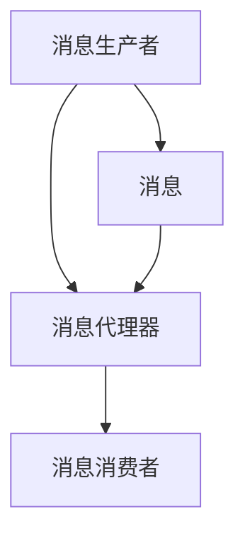

                 

# 消息队列 原理与代码实例讲解

> 关键词：消息队列, 事件驱动架构, 高性能异步通信, Kafka, RabbitMQ, 可靠性保证, 延迟容忍, 系统设计, 微服务架构, 系统扩展性, 故障容错, 分布式一致性

## 1. 背景介绍

### 1.1 问题由来
随着软件系统规模的不断扩大，传统的同步通信方式（如RESTful API调用）逐渐成为性能瓶颈。异步通信方式则能够大大提高系统的处理能力和响应速度。消息队列（Message Queue）作为异步通信的核心组件，被广泛应用于微服务架构、分布式系统、大数据处理等领域。

### 1.2 问题核心关键点
消息队列通过解耦生产者（Producer）和消费者（Consumer），使得系统更加灵活、高效。核心在于：
- 异步通信：提高系统吞吐量和响应速度。
- 解耦服务：简化系统结构，提高模块化程度。
- 任务异步化：支持任务排队、限流、重试等功能。
- 可靠性保证：提供数据不丢失和顺序消费的保证。

## 2. 核心概念与联系

### 2.1 核心概念概述

为更好地理解消息队列的工作原理和实现机制，本节将介绍几个密切相关的核心概念：

- 消息队列（Message Queue）：一种先进先出（FIFO）的存储机制，用于实现异步通信和解耦服务。消息队列通常由消息生产者（Producer）发送消息，消息消费者（Consumer）从队列中接收消息。

- 发布/订阅模式（Pub/Sub）：一种消息模型，消息生产者发布消息到一个主题（Topic），多个订阅者（Subscriber）可以订阅同一个主题，接收相同类型的主题消息。

- 消息路由（Message Routing）：根据消息头或内容，将消息从发送者路由到相应的消费者。

- 消息队列模型：由消息队列、消息生产者、消息消费者、消息代理器（Broker）组成的模型。

- 分布式事务：跨越多个系统或节点的事务处理，通常用于保证系统一致性和可靠性。

这些核心概念之间的逻辑关系可以通过以下Mermaid流程图来展示：



这个流程图展示了大规模消息队列的基本工作流程：

1. 消息生产者生成消息，并通过消息代理器发送至队列。
2. 消息代理器负责消息的路由和存储。
3. 消息消费者从代理器上订阅主题，并从队列中获取消息。

## 3. 核心算法原理 & 具体操作步骤
### 3.1 算法原理概述

消息队列的核心原理基于先进先出（FIFO）和异步通信机制。消息生产者负责将消息发送至队列，消息消费者负责从队列中获取消息。消息代理器负责消息的路由和存储。

消息队列的核心算法包括：

1. 生产者模型：消息生产者将消息发送至消息代理器。
2. 消费者模型：消息消费者从消息代理器获取消息，并进行处理。
3. 路由算法：根据消息头或内容，将消息路由至相应的消费者。
4. 存储算法：将消息持久化存储至磁盘或分布式存储系统中。
5. 可靠性保证：保证消息的可靠传输和顺序消费。

### 3.2 算法步骤详解

以下是消息队列的基本操作流程：

1. 消息生产者生产消息，并将消息发送至消息代理器。
2. 消息代理器接收到消息后，将其存储至消息队列中。
3. 消息消费者订阅主题，并通过消息代理器获取消息。
4. 消息代理器根据消息头或内容，将消息路由至相应的消费者。
5. 消息消费者从代理器上获取消息，并根据业务需求进行处理。

### 3.3 算法优缺点

消息队列的优点包括：

1. 解耦服务：消息队列通过解耦生产者和消费者，使得系统更加灵活和模块化。
2. 异步通信：提高系统吞吐量和响应速度。
3. 任务异步化：支持任务排队、限流、重试等功能。
4. 可靠性保证：提供数据不丢失和顺序消费的保证。

消息队列的缺点包括：

1. 增加复杂性：消息队列引入了更多的组件和服务，增加了系统复杂度。
2. 延迟和丢失：消息在队列中可能存在延迟和丢失的风险。
3. 资源消耗：消息队列需要占用一定的存储和计算资源。

### 3.4 算法应用领域

消息队列被广泛应用于微服务架构、分布式系统、大数据处理等领域，具体应用包括：

- 微服务架构：用于解耦微服务之间的通信，实现模块化开发。
- 分布式系统：用于分布式事务处理，实现跨系统的数据一致性。
- 大数据处理：用于实现数据的异步处理和分布式计算。
- 实时消息系统：用于实时数据的推送和订阅，如股票交易系统、实时通信系统等。

## 4. 数学模型和公式 & 详细讲解
### 4.1 数学模型构建

消息队列的基本数学模型可以描述为：

- 消息队列 $Q$：由消息和队列元素组成，队列元素包括消息的元数据（如消息头、主题、状态等）和消息本身。
- 消息生产者 $P$：负责生成和发送消息至队列。
- 消息消费者 $C$：负责从队列中获取消息并处理。
- 消息代理器 $B$：负责消息的路由和存储。

消息队列的数学模型可以形式化表示为：

$$
Q = (M_1, M_2, ..., M_n)
$$

其中 $M_i$ 为消息 $i$ 的元数据和内容。

### 4.2 公式推导过程

消息队列的常见操作包括：

1. 生产消息：将消息 $M_i$ 发送至消息队列 $Q$。
2. 消费消息：从队列 $Q$ 中获取消息 $M_i$ 并进行处理。
3. 路由消息：根据消息头或内容，将消息 $M_i$ 路由至相应的消费者。

消息队列的公式推导包括：

1. 消息生产公式：
$$
P(Q) = \{M_1, M_2, ..., M_n\}
$$

2. 消息消费公式：
$$
C(Q) = \{M_i | M_i \in Q\}
$$

3. 消息路由公式：
$$
R(M_i) = \{Consumer_j | j \in [1, m], M_i \in Topic_k, k \in [1, n]\}
$$

其中 $m$ 为订阅者数量，$n$ 为主题数量。

### 4.3 案例分析与讲解

以 Kafka 消息队列为例，分析其核心操作：

- 生产消息：
  ```java
  KafkaProducer<String, String> producer = new KafkaProducer<>(props);
  producer.send(new ProducerRecord<>(topic, key, value));
  ```

- 消费消息：
  ```java
  KafkaConsumer<String, String> consumer = new KafkaConsumer<>(props);
  consumer.subscribe(Collections.singletonList(topic));
  for (ConsumerRecord<String, String> record : consumer) {
      // 处理消息
  }
  ```

- 路由消息：
  ```java
  String topic = "test";
  String key = "user1";
  String value = "Hello Kafka!";
  producer.send(new ProducerRecord<>(topic, key, value));
  ```

## 5. 项目实践：代码实例和详细解释说明
### 5.1 开发环境搭建

在进行消息队列开发前，需要先搭建开发环境。以下是使用Kafka的开发环境配置流程：

1. 安装JDK：从官网下载并安装JDK，支持Java 8及以上版本。
2. 下载Kafka：从官网下载Kafka二进制包，并解压至指定目录。
3. 启动Zookeeper：Kafka依赖于Zookeeper，需单独启动Zookeeper服务。
4. 启动Kafka：启动Kafka服务，并配置相关参数。
5. 创建Topic：使用命令行创建Kafka Topic。

### 5.2 源代码详细实现

以下是使用Kafka进行消息队列开发的基本代码实现：

```java
Properties props = new Properties();
props.put("bootstrap.servers", "localhost:9092");
props.put("acks", "all");
props.put("retries", 3);
props.put("batch.size", 16384);
props.put("linger.ms", 1);
props.put("buffer.memory", 33554432);
props.put("key.serializer", "org.apache.kafka.common.serialization.StringSerializer");
props.put("value.serializer", "org.apache.kafka.common.serialization.StringSerializer");

KafkaProducer<String, String> producer = new KafkaProducer<>(props);
producer.send(new ProducerRecord<>("topic", "key", "value"));
```

### 5.3 代码解读与分析

让我们再详细解读一下关键代码的实现细节：

**Properties配置**：
- 配置Kafka服务器地址和端口号
- 设置消息接收确认机制
- 设置重试次数
- 设置批量大小和 linger 时间
- 设置缓存大小

**KafkaProducer发送消息**：
- 通过指定Topic、Key和Value，发送消息至Kafka服务器。

**KafkaConsumer消费消息**：

```java
KafkaConsumer<String, String> consumer = new KafkaConsumer<>(props);
consumer.subscribe(Collections.singletonList("topic"));
for (ConsumerRecord<String, String> record : consumer) {
    // 处理消息
}
```

**KafkaConsumer订阅主题**：
- 订阅指定Topic，并通过for循环获取消息进行处理。

**KafkaConsumer获取消息**：
- 循环获取消息并进行处理。

## 6. 实际应用场景
### 6.1 微服务架构

微服务架构中，消息队列用于解耦各个微服务之间的通信，实现模块化开发。例如，订单微服务需要向库存微服务发送订单信息，订单微服务可以将订单信息封装成消息，发送至消息队列，库存微服务从队列中获取消息并进行库存更新。

### 6.2 分布式系统

分布式系统中，消息队列用于实现跨系统的数据一致性和可靠性。例如，用户登录成功后，需向多个系统推送用户登录信息，可以使用消息队列实现数据的可靠推送。

### 6.3 大数据处理

大数据处理中，消息队列用于实现数据的异步处理和分布式计算。例如，海量日志数据的收集和处理，可以使用消息队列实现数据的异步存储和计算。

### 6.4 实时消息系统

实时消息系统中，消息队列用于实现实时数据的推送和订阅。例如，实时股票交易系统，可以实时推送股票行情数据至各个交易终端。

## 7. 工具和资源推荐
### 7.1 学习资源推荐

为了帮助开发者系统掌握消息队列的核心原理和实践技巧，这里推荐一些优质的学习资源：

1. 《消息队列设计与实现》书籍：详细介绍了消息队列的核心原理、常用实现和应用场景，适合入门学习。
2. 《Kafka权威指南》书籍：Kafka的核心开发者撰写的权威指南，涵盖了Kafka的各个方面，包括架构、配置、优化等。
3. 《RabbitMQ实战》书籍：介绍RabbitMQ的核心原理和实践技巧，适合深入学习。
4. 《Java消息编程》书籍：介绍Java中常用消息库的实现原理和应用技巧，适合Java开发者学习。
5. 《消息队列在微服务中的应用》文章：分析消息队列在微服务架构中的应用案例，适合实践学习。

通过对这些资源的学习实践，相信你一定能够快速掌握消息队列的精髓，并用于解决实际的系统问题。

### 7.2 开发工具推荐

高效的开发离不开优秀的工具支持。以下是几款用于消息队列开发常用的工具：

1. Kafka：Apache基金会开源的消息队列系统，支持高吞吐量和高可用性。

2. RabbitMQ：RabbitMQ是OpenText公司推出的消息队列系统，支持高可用性和可靠性。

3. Apache Pulsar：Apache基金会推出的分布式消息队列系统，支持高吞吐量和低延迟。

4. ZeroMQ：零拷贝的消息队列库，支持多种通信协议和传输方式。

5. ActiveMQ：IBM推出的消息队列系统，支持多种消息协议和传输方式。

合理利用这些工具，可以显著提升消息队列开发和部署的效率，加快创新迭代的步伐。

### 7.3 相关论文推荐

消息队列的研究始于1968年的MIT PhD论文。以下是几篇奠基性的相关论文，推荐阅读：

1. Brogliato, U., Dias, R., & Tempo, R. (1989). A Message System for Systematic Communication. Technical Report 89-46, Department of Electrical Engineering, MIT.

2. Paxson, V. (1992). Architectural Considerations for Distributed Communication: A Survey. Technical Report 1, UC Berkeley.

3. Graham, R. W., & Laurie, D. A. (2001). Message Systems: Architecture, Protocols, and Programming. Addison-Wesley Professional.

4. SOSP 2010: Modular Message Systems in Paxos.

5. Eurosys 2020: The Geofence: A Generalized Message System for Global Computing.

这些论文代表了大规模消息队列的发展脉络。通过学习这些前沿成果，可以帮助研究者把握学科前进方向，激发更多的创新灵感。

## 8. 总结：未来发展趋势与挑战

### 8.1 总结

本文对消息队列的核心原理和实践技巧进行了全面系统的介绍。首先阐述了消息队列的基本概念和应用场景，明确了消息队列在异步通信、解耦服务、任务异步化等方面的独特价值。其次，从原理到实践，详细讲解了消息队列的核心算法和具体操作步骤，给出了消息队列任务开发的完整代码实例。同时，本文还广泛探讨了消息队列在微服务架构、分布式系统、大数据处理等多个领域的应用前景，展示了消息队列的巨大潜力。此外，本文精选了消息队列相关的学习资源，力求为读者提供全方位的技术指引。

通过本文的系统梳理，可以看到，消息队列作为异步通信的核心组件，在提高系统灵活性和扩展性方面具有重要价值。其在微服务架构、分布式系统、大数据处理等领域的广泛应用，已经深刻影响了现代软件系统的设计理念和技术架构。未来，伴随消息队列的持续演进和优化，消息队列必将在构建高可用、高性能、高可扩展的系统方面发挥更大作用。

### 8.2 未来发展趋势

展望未来，消息队列技术将呈现以下几个发展趋势：

1. 分布式架构：消息队列将逐步向分布式架构演进，提高系统的可扩展性和容错性。

2. 低延迟处理：消息队列将支持低延迟处理机制，进一步提高系统的实时性和响应速度。

3. 高吞吐量：消息队列将支持高吞吐量处理机制，支持海量数据的高速处理。

4. 事件驱动架构：消息队列将与事件驱动架构深度融合，实现系统的模块化和灵活化。

5. 云原生支持：消息队列将与云原生技术深度融合，提供更加便捷的部署和运维。

以上趋势凸显了消息队列技术的广阔前景。这些方向的探索发展，必将进一步提升系统的处理能力和灵活性，为现代软件系统的设计带来新的突破。

### 8.3 面临的挑战

尽管消息队列技术已经取得了显著成果，但在迈向更加智能化、普适化应用的过程中，它仍面临诸多挑战：

1. 性能瓶颈：消息队列在高吞吐量和高延迟容忍性方面仍面临瓶颈，尤其是在海量数据处理和高实时性要求场景下。

2. 数据一致性：消息队列在保证数据一致性方面存在挑战，尤其是在分布式系统中，需要更多的分布式事务支持和一致性保证机制。

3. 系统复杂性：消息队列增加了系统的复杂性，需要更多的系统设计和运维支持。

4. 故障容错：消息队列需要在故障情况下保证数据的可靠性和持久性，需要更多的故障容错机制和冗余设计。

5. 安全性和隐私保护：消息队列需要在保证数据安全和隐私的前提下，提供可靠的消息传输和处理。

6. 资源消耗：消息队列需要占用一定的计算和存储资源，如何在保证性能的同时，降低资源消耗，也是未来的研究方向。

正视消息队列面临的这些挑战，积极应对并寻求突破，将是大规模消息队列技术走向成熟的必由之路。相信随着学界和产业界的共同努力，这些挑战终将一一被克服，消息队列必将在构建高可用、高性能、高可扩展的系统方面发挥更大作用。

### 8.4 研究展望

面对消息队列所面临的种种挑战，未来的研究需要在以下几个方面寻求新的突破：

1. 分布式架构研究：进一步研究分布式消息队列的架构设计和实现机制，提高系统的可扩展性和容错性。

2. 低延迟处理技术：开发更加高效的低延迟处理技术，支持海量数据的高速处理。

3. 分布式事务支持：研究分布式事务的实现机制，提供更加可靠的数据一致性保证。

4. 故障容错机制：开发更加健壮的故障容错机制，提高系统的稳定性和可靠性。

5. 系统复杂性优化：研究系统复杂性的优化方法，提高系统的可维护性和可扩展性。

6. 资源优化技术：研究资源优化技术，提高系统的性能和效率，降低资源消耗。

这些研究方向的探索，必将引领消息队列技术迈向更高的台阶，为构建高可用、高性能、高可扩展的系统铺平道路。面向未来，消息队列需要与其他分布式系统技术进行更深入的融合，如微服务架构、分布式事务、云原生技术等，多路径协同发力，共同推动消息队列技术的不断进步。

## 9. 附录：常见问题与解答

**Q1：消息队列和消息中间件有什么区别？**

A: 消息队列和消息中间件都是用于异步通信和解耦服务的技术，但区别在于消息中间件具有更多的功能，如事务、路由、监控等。消息队列通常只负责消息的存储和传输，而消息中间件则提供了更多的高级功能。

**Q2：消息队列如何保证消息的可靠性？**

A: 消息队列通常使用分布式事务、事务补偿机制、消息重复机制等方法保证消息的可靠性。具体来说，消息队列会将消息复制到多个节点，确保消息不会丢失。同时，通过事务补偿机制、消息重复机制等方式，保证消息的可靠传输。

**Q3：消息队列如何保证消息的顺序性？**

A: 消息队列通常使用先进先出（FIFO）的存储机制保证消息的顺序性。同时，消息队列会使用事务、锁等机制避免消息的乱序处理。在分布式系统中，消息队列也会使用分布式锁、消息路由等机制保证消息的顺序性。

**Q4：消息队列如何保证高可用性和容错性？**

A: 消息队列通常使用分布式架构、冗余设计、负载均衡等机制保证高可用性和容错性。具体来说，消息队列会将消息复制到多个节点，确保某个节点故障不会导致系统崩溃。同时，通过负载均衡、冗余设计等机制，提高系统的可靠性和容错性。

**Q5：消息队列如何优化性能和资源消耗？**

A: 消息队列通常使用分布式架构、资源优化技术、缓存机制等方法优化性能和资源消耗。具体来说，消息队列会将消息复制到多个节点，提高系统的可扩展性。同时，通过资源优化技术、缓存机制等方式，降低系统的资源消耗。

这些常见问题及其解答，可以帮助开发者更好地理解和应用消息队列技术，构建高效、可靠、灵活的分布式系统。总之，消息队列作为一种重要的异步通信技术，对于提升系统的性能和可靠性具有重要价值。只有深入理解其核心原理和实现机制，才能充分发挥其潜力，为现代软件系统带来更大的创新和突破。

---

作者：禅与计算机程序设计艺术 / Zen and the Art of Computer Programming

