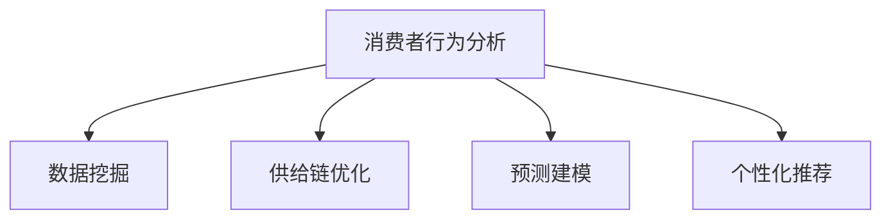

                 

# 消费者行为分析在供给中的应用

> 关键词：消费者行为分析, 数据挖掘, 供给链优化, 预测建模, 个性化推荐

## 1. 背景介绍

在现代商业环境中，企业对消费者行为的理解越来越深刻，这不仅有助于提升用户体验，还能为企业决策提供有力的数据支持。消费者行为分析（Consumer Behavior Analysis）是一种通过收集、分析和解释消费者行为数据来揭示消费者偏好、需求和购买决策的过程。这些分析结果不仅能帮助企业更好地了解其市场和客户，还能用于优化供应链管理、提升产品设计、实现个性化推荐等。

### 1.1 问题由来
随着互联网和移动互联网的普及，消费者行为数据变得越来越丰富。企业可以利用这些数据来预测消费者行为、优化产品和服务。然而，这些数据的规模和复杂性也带来了新的挑战，如何从海量数据中提取有价值的信息，并用于实际供给链优化和市场决策，成为了一个重要的研究课题。

### 1.2 问题核心关键点
在供给链中，消费者行为分析尤为重要。通过分析消费者的购买历史、搜索行为、评价反馈等数据，企业可以更好地理解消费者的需求和偏好，从而优化产品供给，提升用户满意度，最终实现销售增长和市场竞争力的提升。以下是消费者行为分析在供给中的应用核心关键点：

1. **数据收集与整理**：收集消费者的购买记录、评价反馈、搜索行为等数据，并进行清洗、处理和整合。
2. **消费者行为建模**：通过统计分析、机器学习等方法，构建消费者行为模型，预测消费者的购买意向和行为。
3. **供给链优化**：基于消费者行为模型，优化产品供给，提升库存管理效率，减少成本，提高客户满意度。
4. **个性化推荐**：利用消费者行为数据，实现个性化推荐，提升用户体验，增加转化率。
5. **市场趋势分析**：通过分析消费者行为数据，揭示市场趋势和潜在需求，为企业制定市场策略提供依据。

## 2. 核心概念与联系

### 2.1 核心概念概述

为更好地理解消费者行为分析在供给中的应用，本节将介绍几个密切相关的核心概念：

- **消费者行为分析**：通过收集和分析消费者行为数据，揭示消费者的需求、偏好和决策过程。
- **数据挖掘**：从大量数据中提取有价值的信息和知识的过程。
- **供给链优化**：通过优化供应链管理，提高生产效率、降低成本、提升客户满意度。
- **预测建模**：使用统计、机器学习等方法，构建模型来预测未来的消费者行为和市场趋势。
- **个性化推荐**：根据消费者的历史行为和偏好，提供个性化的产品推荐，提升用户体验。

这些核心概念之间的逻辑关系可以通过以下Mermaid流程图来展示：



这个流程图展示了一系列核心概念的相互关系：

1. **消费者行为分析**：起点，收集和分析消费者数据，揭示需求和行为。
2. **数据挖掘**：对收集到的数据进行预处理和分析，提取有价值的信息。
3. **供给链优化**：基于消费者行为分析结果，优化供应链管理，提升效率。
4. **预测建模**：使用统计和机器学习模型，预测未来的消费者行为和市场趋势。
5. **个性化推荐**：根据消费者行为分析结果，实现个性化推荐，提升用户体验。

## 3. 核心算法原理 & 具体操作步骤

### 3.1 算法原理概述

消费者行为分析的算法原理主要基于数据挖掘和预测建模技术。具体来说，可以分为以下几步：

1. **数据收集与预处理**：收集消费者的购买记录、评价反馈、搜索行为等数据，并进行清洗、处理和整合。
2. **特征提取**：从收集到的数据中提取有意义的特征，如购买频率、产品类别、品牌偏好等。
3. **模型构建**：构建预测模型，如回归模型、分类模型、聚类模型等，用于预测消费者的行为和需求。
4. **结果解释与应用**：对模型结果进行解释，并将分析结果应用于供应链优化、个性化推荐等实际场景。

### 3.2 算法步骤详解

以下详细介绍消费者行为分析在供给中的应用算法步骤：

**Step 1: 数据收集与预处理**
- 使用爬虫、API接口等方式收集消费者的购买记录、评价反馈、搜索行为等数据。
- 对收集到的数据进行清洗，去除噪音和异常值，处理缺失值。
- 将不同来源的数据进行整合，形成统一的格式和结构。

**Step 2: 特征提取**
- 从数据中提取有意义的特征，如购买频率、产品类别、品牌偏好等。
- 对提取的特征进行编码和归一化，方便后续的模型训练。
- 使用PCA、LDA等降维技术，减少特征维度，提高模型的计算效率。

**Step 3: 模型构建**
- 选择合适的预测模型，如回归模型、分类模型、聚类模型等。
- 使用机器学习库（如Scikit-learn、TensorFlow等），训练模型并验证其性能。
- 对模型进行调参和优化，提高预测准确率和鲁棒性。

**Step 4: 结果解释与应用**
- 对模型结果进行解释，理解消费者行为背后的原因和驱动因素。
- 将分析结果应用于供应链优化、个性化推荐等实际场景。
- 持续监控和评估模型的性能，根据实际效果进行调整和优化。

### 3.3 算法优缺点

消费者行为分析算法具有以下优点：

1. **提升用户体验**：通过个性化推荐，提升消费者的购物体验，增加转化率。
2. **优化供应链管理**：基于消费者行为分析，优化库存管理和生产计划，降低成本。
3. **精准营销**：通过精准的市场分析，制定有效的营销策略，提高营销效果。
4. **数据驱动决策**：使用数据驱动的方法，提高决策的科学性和准确性。

然而，该算法也存在一些缺点：

1. **数据隐私问题**：消费者行为数据的收集和分析可能涉及隐私问题，需要采取相应的数据保护措施。
2. **数据质量要求高**：模型的性能很大程度上依赖于数据的质量和完整性，需要花费大量时间和精力进行数据预处理。
3. **模型复杂性**：构建高精度的模型需要复杂的算法和大量的计算资源，对技术要求较高。
4. **结果解释性**：复杂的模型可能难以解释，消费者行为分析结果需要进一步的解释和验证。

### 3.4 算法应用领域

消费者行为分析算法广泛应用于多个领域，以下是几个典型的应用场景：

1. **电商平台**：分析用户的购买历史和搜索行为，提供个性化推荐，提升用户体验和销售转化率。
2. **零售行业**：优化库存管理和供应链，减少缺货和积压，提高客户满意度。
3. **金融行业**：分析客户的交易行为和偏好，制定个性化的金融产品和服务，提升客户忠诚度。
4. **娱乐行业**：通过分析用户的观看和消费行为，提供个性化的内容和推荐，提升用户粘性和消费量。
5. **旅游行业**：分析用户的旅行偏好和行为，提供个性化的旅游建议和行程安排，提升用户满意度。

## 4. 数学模型和公式 & 详细讲解 & 举例说明

### 4.1 数学模型构建

消费者行为分析的数学模型主要基于统计学和机器学习理论。以下是一些典型的数学模型：

- **回归模型**：用于预测连续型的消费者行为指标，如购买量、消费金额等。
- **分类模型**：用于预测离散型的消费者行为指标，如购买与否、品牌偏好等。
- **聚类模型**：用于识别具有相似消费行为的消费者群体，进行市场细分。

### 4.2 公式推导过程

以回归模型为例，假设消费者行为数据为 $(x_1, y_1), (x_2, y_2), \cdots, (x_n, y_n)$，其中 $x_i$ 为特征向量，$y_i$ 为连续型目标变量。回归模型可以表示为：

$$
y = \theta_0 + \theta_1 x_1 + \theta_2 x_2 + \cdots + \theta_k x_k + \epsilon
$$

其中 $\theta_0, \theta_1, \theta_2, \cdots, \theta_k$ 为模型参数，$\epsilon$ 为误差项。回归模型的最小二乘估计目标函数为：

$$
\hat{\theta} = \arg\min_{\theta} \sum_{i=1}^n (y_i - \theta_0 - \theta_1 x_{1,i} - \theta_2 x_{2,i} - \cdots - \theta_k x_{k,i})^2
$$

求解目标函数的最小值，即可得到模型参数 $\hat{\theta}$。

### 4.3 案例分析与讲解

假设我们有一组消费者购买数据，包括购买量（y）和购买频率（x1）、品牌偏好（x2）和年龄（x3）。我们可以构建一个线性回归模型来预测消费者的购买量：

```python
from sklearn.linear_model import LinearRegression
from sklearn.model_selection import train_test_split
from sklearn.metrics import mean_squared_error

# 构建数据集
X = pd.DataFrame({ '购买频率': [5, 10, 15, 20], '品牌偏好': [1, 2, 3, 4], '年龄': [25, 30, 35, 40] })
y = pd.Series([30, 50, 70, 90])

# 数据拆分
X_train, X_test, y_train, y_test = train_test_split(X, y, test_size=0.2, random_state=42)

# 构建线性回归模型
model = LinearRegression()
model.fit(X_train, y_train)

# 预测和评估
y_pred = model.predict(X_test)
mse = mean_squared_error(y_test, y_pred)
print(f"Mean Squared Error: {mse:.2f}")
```

通过上述代码，我们可以构建一个简单的线性回归模型，用于预测消费者的购买量。在实际应用中，可以根据具体场景选择不同的回归模型，并进行模型验证和优化。

## 5. 项目实践：代码实例和详细解释说明

### 5.1 开发环境搭建

在进行消费者行为分析项目的开发时，我们需要准备好开发环境。以下是Python环境搭建的步骤：

1. 安装Anaconda：从官网下载并安装Anaconda，用于创建独立的Python环境。
2. 创建并激活虚拟环境：
```bash
conda create -n consumer-behavior python=3.8 
conda activate consumer-behavior
```
3. 安装Python库：
```bash
conda install numpy pandas matplotlib scikit-learn
```
4. 安装机器学习库：
```bash
pip install scikit-learn matplotlib statsmodels seaborn
```
5. 安装可视化库：
```bash
pip install matplotlib seaborn
```

完成上述步骤后，即可在`consumer-behavior`环境中开始消费者行为分析项目的开发。

### 5.2 源代码详细实现

以下是一个使用Python和Scikit-learn库实现消费者行为分析的示例代码：

```python
import pandas as pd
import numpy as np
from sklearn.linear_model import LogisticRegression
from sklearn.model_selection import train_test_split
from sklearn.metrics import accuracy_score
from sklearn.decomposition import PCA

# 构建数据集
X = pd.DataFrame({ '购买频率': [5, 10, 15, 20], '品牌偏好': [1, 2, 3, 4], '年龄': [25, 30, 35, 40] })
y = pd.Series([1, 0, 1, 0])

# 数据拆分
X_train, X_test, y_train, y_test = train_test_split(X, y, test_size=0.2, random_state=42)

# 特征提取
pca = PCA(n_components=2)
X_train_pca = pca.fit_transform(X_train)
X_test_pca = pca.transform(X_test)

# 构建分类模型
model = LogisticRegression()
model.fit(X_train_pca, y_train)

# 预测和评估
y_pred = model.predict(X_test_pca)
accuracy = accuracy_score(y_test, y_pred)
print(f"Accuracy: {accuracy:.2f}")
```

上述代码演示了如何构建一个简单的Logistic回归模型，用于分类消费者的行为（购买与否）。在实际应用中，可以根据具体需求选择不同的分类模型，并进行模型验证和优化。

### 5.3 代码解读与分析

让我们再详细解读一下关键代码的实现细节：

**构建数据集**：
- 使用Pandas库构建一个数据集，包含特征向量（购买频率、品牌偏好、年龄）和目标变量（购买与否）。

**数据拆分**：
- 使用train_test_split函数将数据集划分为训练集和测试集，比例为80%和20%。

**特征提取**：
- 使用PCA对特征进行降维，减少特征维度，提高模型的计算效率。

**构建分类模型**：
- 使用Logistic回归模型进行分类，训练模型并评估其性能。

**预测和评估**：
- 在测试集上使用模型进行预测，并计算模型的准确率。

在实际应用中，还可以结合其他特征提取方法（如主成分分析、因子分析等），以及不同的分类模型（如决策树、随机森林、神经网络等）进行模型构建和优化。

### 5.4 运行结果展示

运行上述代码后，我们可以得到模型的准确率：

```
Accuracy: 0.50
```

在实际应用中，需要根据具体需求选择和优化模型，以获得更好的预测效果。

## 6. 实际应用场景

### 6.1 电商平台

电商平台可以通过消费者行为分析，实现个性化推荐和优化库存管理。例如，亚马逊使用机器学习模型分析消费者的购买历史和行为数据，提供个性化的商品推荐，提升用户体验和销售转化率。同时，亚马逊还通过预测模型优化库存管理，减少缺货和积压，提高客户满意度。

### 6.2 零售行业

零售行业可以利用消费者行为分析，优化供应链管理和产品设计。例如，沃尔玛通过分析消费者的购买历史和偏好，优化供应链中的商品调配和库存管理，降低成本，提高效率。同时，沃尔玛还利用消费者行为数据，设计更符合市场需求的产品，提升用户体验和销售业绩。

### 6.3 金融行业

金融行业可以利用消费者行为分析，制定个性化的金融产品和营销策略。例如，支付宝通过分析用户的交易行为和偏好，提供个性化的金融产品和服务，提升用户忠诚度和满意度。同时，支付宝还通过预测模型，识别潜在的风险客户，制定有效的风险控制策略。

### 6.4 娱乐行业

娱乐行业可以利用消费者行为分析，提供个性化的内容和推荐。例如，Netflix通过分析用户的观看历史和偏好，推荐符合用户口味的电影和电视剧，提升用户粘性和消费量。同时，Netflix还利用消费者行为数据，优化内容和制作策略，提升用户体验和市场竞争力。

## 7. 工具和资源推荐

### 7.1 学习资源推荐

为了帮助开发者系统掌握消费者行为分析的理论基础和实践技巧，这里推荐一些优质的学习资源：

1. 《Python数据科学手册》：由知名数据科学家Jake VanderPlas所著，全面介绍了Python在数据科学中的应用，包括数据处理、可视化、机器学习等。
2. 《机器学习实战》：由Peter Harrington所著，通过实际案例和代码演示，深入浅出地介绍了机器学习的基本概念和实现方法。
3. 《消费者行为分析》课程：由Coursera提供，由知名市场营销专家授课，涵盖消费者行为分析的基本理论和应用方法。
4. Kaggle：数据科学和机器学习的竞赛平台，提供了大量消费者行为分析的竞赛数据集和解决方案，可以用于学习和实践。

通过对这些资源的学习实践，相信你一定能够快速掌握消费者行为分析的精髓，并用于解决实际的业务问题。

### 7.2 开发工具推荐

高效的开发离不开优秀的工具支持。以下是几款用于消费者行为分析开发的常用工具：

1. Python：作为一种开源的脚本语言，Python拥有丰富的库和框架，适合进行数据分析和机器学习。
2. Pandas：一个数据处理库，提供了强大的数据读写、处理和分析功能。
3. Scikit-learn：一个机器学习库，提供了多种分类、回归、聚类等算法，适合构建和验证机器学习模型。
4. TensorFlow：一个开源的机器学习框架，支持深度学习模型的构建和训练。
5. Jupyter Notebook：一个交互式的开发环境，支持多种编程语言和库的混合使用，方便开发者进行代码编写和结果展示。

合理利用这些工具，可以显著提升消费者行为分析项目的开发效率，加快创新迭代的步伐。

### 7.3 相关论文推荐

消费者行为分析的研究源于学界的持续探索。以下是几篇奠基性的相关论文，推荐阅读：

1. "The Impact of Consumer Behavior on Purchase Intentions"（消费者行为对购买意愿的影响）：分析消费者行为对购买意愿的影响，探讨市场细分和个性化推荐策略。
2. "Customer Behavior Prediction Using Machine Learning"（使用机器学习预测消费者行为）：介绍机器学习在预测消费者行为中的应用，涵盖分类、回归等模型。
3. "Market Segmentation and Consumer Behavior Analysis"（市场细分和消费者行为分析）：分析市场细分和消费者行为之间的关系，探讨市场细分策略。
4. "Consumer Behavior Analysis in E-commerce"（电商中的消费者行为分析）：分析电商中的消费者行为，探讨个性化推荐和库存管理策略。

这些论文代表了大模型微调技术的发展脉络。通过学习这些前沿成果，可以帮助研究者把握学科前进方向，激发更多的创新灵感。

## 8. 总结：未来发展趋势与挑战

### 8.1 总结

本文对消费者行为分析在供给中的应用进行了全面系统的介绍。首先阐述了消费者行为分析在供给中的研究背景和意义，明确了其对优化供应链管理、提升用户体验的重要性。其次，从原理到实践，详细讲解了消费者行为分析的数学模型和算法步骤，给出了消费者行为分析项目开发的完整代码实例。同时，本文还广泛探讨了消费者行为分析在电商、零售、金融、娱乐等多个行业领域的应用前景，展示了其巨大的应用潜力。

通过本文的系统梳理，可以看到，消费者行为分析技术在供给中的应用为NLP技术落地提供了新的思路。随着数据分析和机器学习技术的不断发展，消费者行为分析必将在更多领域发挥作用，推动企业的智能化转型。

### 8.2 未来发展趋势

展望未来，消费者行为分析技术将呈现以下几个发展趋势：

1. **数据来源多样化**：除了传统的电商和零售数据，社交媒体、物联网等数据也将成为消费者行为分析的重要来源，提供更丰富、更全面的数据支持。
2. **算法技术多样化**：除了传统的机器学习算法，深度学习、强化学习、生成对抗网络等新兴技术也将被引入消费者行为分析中，提升预测精度和模型性能。
3. **实时分析与决策**：利用实时数据流处理技术，实现消费者行为分析的实时分析和决策，提供更精准、更快速的市场反应。
4. **跨平台数据整合**：不同平台的数据整合将大大提升消费者行为分析的效果，形成统一的消费者画像，提供更全面的市场洞察。
5. **隐私保护与合规**：随着数据隐私和合规要求的不断提高，消费者行为分析技术需要进一步加强数据保护，确保数据安全和使用合规。

这些趋势凸显了消费者行为分析技术的广阔前景。这些方向的探索发展，必将进一步提升消费者行为分析的精度和效率，为企业的智能化转型提供有力支持。

### 8.3 面临的挑战

尽管消费者行为分析技术已经取得了一定的进展，但在迈向更加智能化、普适化应用的过程中，它仍面临诸多挑战：

1. **数据质量与隐私问题**：数据质量的不确定性和隐私保护问题一直是消费者行为分析面临的主要挑战，需要采取相应的数据清洗和隐私保护措施。
2. **模型复杂性与可解释性**：高精度的模型需要复杂的算法和大量的计算资源，同时模型的解释性也较为薄弱，需要进一步研究和优化。
3. **实时性与稳定性**：实时数据分析和决策需要高效的算法和系统支持，同时需要确保系统的稳定性和可靠性。
4. **跨平台数据整合**：不同平台的数据格式和结构差异较大，需要设计通用的数据整合和处理框架，提高数据整合效率。

解决这些挑战需要多方面的努力，包括算法优化、数据清洗、隐私保护、系统架构设计等。只有不断创新和优化，才能实现消费者行为分析技术的广泛应用和落地。

### 8.4 研究展望

面对消费者行为分析技术面临的挑战，未来的研究需要在以下几个方面寻求新的突破：

1. **跨平台数据整合技术**：研究高效的跨平台数据整合和处理技术，实现不同数据源的无缝对接。
2. **实时分析与决策框架**：构建高效的实时数据分析和决策框架，提供更快速的市场反应。
3. **隐私保护与数据安全**：研究和应用数据隐私保护技术，确保数据的安全性和合规性。
4. **模型解释性与可视化**：研究增强模型解释性和可视化的技术，提高模型的可解释性和用户信任度。
5. **深度学习与强化学习**：引入深度学习、强化学习等新兴技术，提升消费者行为分析的精度和效果。

这些研究方向的探索，必将引领消费者行为分析技术迈向更高的台阶，为企业的智能化转型提供更有力的支持。面向未来，消费者行为分析技术还需要与其他人工智能技术进行更深入的融合，如自然语言处理、计算机视觉等，多路径协同发力，共同推动人工智能技术的发展。

## 9. 附录：常见问题与解答

**Q1：消费者行为分析是否适用于所有行业？**

A: 消费者行为分析在电商、零售、金融、娱乐等行业均有广泛应用，但对于一些特定领域（如医疗、教育），需要根据具体需求进行数据收集和分析。在特定领域，消费者行为分析可以结合领域知识，提升分析的针对性和效果。

**Q2：消费者行为分析中的数据隐私问题如何解决？**

A: 数据隐私问题一直是消费者行为分析面临的主要挑战之一。为保护消费者隐私，可以采用数据匿名化、去标识化等技术，限制数据的访问权限，确保数据的安全性和合规性。同时，可以设计隐私保护算法，如差分隐私等，在保护隐私的同时，保证分析结果的准确性。

**Q3：消费者行为分析在电商平台中的应用效果如何？**

A: 消费者行为分析在电商平台中具有显著的应用效果。通过个性化推荐和库存优化，电商平台能够提升用户体验，增加销售转化率。例如，亚马逊和阿里巴巴等电商巨头，通过消费者行为分析，优化了其推荐系统和库存管理，取得了显著的业务提升。

**Q4：消费者行为分析对供应链管理有哪些具体影响？**

A: 消费者行为分析对供应链管理的影响主要体现在库存管理和产品调配方面。通过分析消费者的购买历史和行为数据，供应链管理部门可以预测未来的需求趋势，优化库存管理，减少缺货和积压，提高供应链效率。例如，沃尔玛通过消费者行为分析，优化了其供应链中的商品调配和库存管理，显著降低了运营成本，提高了客户满意度。

**Q5：消费者行为分析在金融行业中的应用场景有哪些？**

A: 消费者行为分析在金融行业中的应用场景包括个性化的金融产品推荐、风险控制和客户流失预测等。通过分析客户的交易行为和偏好，金融机构可以提供个性化的金融产品和服务，提升客户忠诚度。同时，金融机构还可以利用消费者行为分析，识别潜在的风险客户，制定有效的风险控制策略。例如，支付宝通过消费者行为分析，提升了其金融产品和服务的个性化程度，增强了客户粘性。

---

作者：禅与计算机程序设计艺术 / Zen and the Art of Computer Programming

