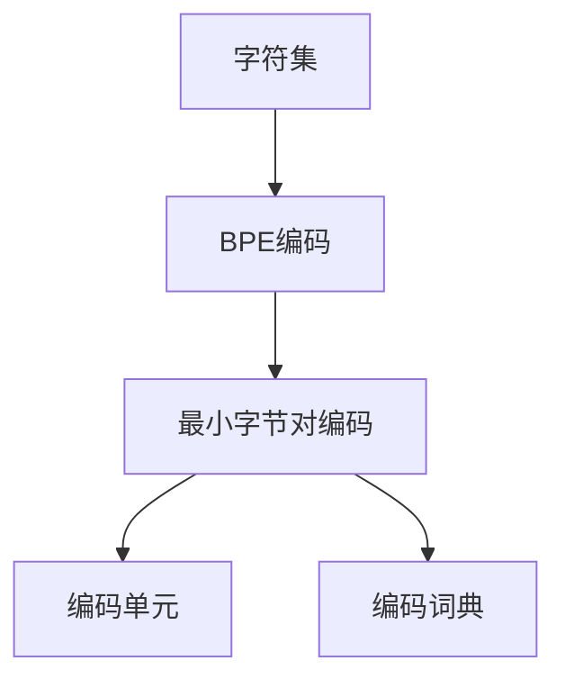

                 

## 1. 背景介绍

### 1.1 问题由来

在自然语言处理（NLP）领域，预训练语言模型如BERT、GPT等取得了巨大成功，但这些模型在处理文本数据时，需要将其转换为模型可以理解的向量形式，这一过程被称为Tokenization。传统的Tokenization方法是基于字符级别的，但这种方法存在一些问题，如不同语言的字符集、同一个词的不同形式（如“run”和“running”）等。为了解决这些问题，新的Tokenization技术如WordPiece和Byte Pair Encoding（BPE）被提出。

其中，最小字节对编码（minBPE）是BPE的一种变种，通过最小化BPE的单元，可以更加高效地处理各种语言，尤其是字符集较为复杂的中文字符集。本文将详细探讨最小字节对编码的原理、应用和实现方法，帮助读者深入理解这一关键技术。

### 1.2 问题核心关键点

最小字节对编码技术通过将字符序列划分为最小编码单元（最小字节对），将字符序列映射为向量序列，使得模型可以更好地处理不同语言的字符集，同时减少相同单词的不同形式带来的噪音。

最小字节对编码的核心思想是将字符序列表示为BPE编码，其中BPE编码是基于字符级别的编码方式，每个字符通过相邻字符的组合进行编码，生成的编码单元可以是单个字符，也可以是多字节字符。最小字节对编码通过指定每个编码单元的最小长度（即最小字节对长度），进一步减少了编码单元的数量，从而提高了编码效率。

## 2. 核心概念与联系

### 2.1 核心概念概述

为了更好地理解最小字节对编码技术，本节将介绍几个密切相关的核心概念：

- 字符集：不同语言的字符集不同，如中文包含数千个不同字符，而英文只有26个字母和数字等。字符集的多样性是Tokenization面临的主要挑战之一。
- BPE编码：基于字符级别的编码方式，将字符序列转换为编码序列，每个编码单元可以是单个字符，也可以是多个字符的组合。
- 最小字节对编码（minBPE）：BPE编码的一种变种，通过指定最小编码单元的长度，进一步减少编码单元的数量，从而提高编码效率。
- 编码单元：最小字节对编码生成的编码单元，可以是单个字符，也可以是多字节字符，最小长度为1。
- 编码词典：所有可能的最小字节对编码单元的集合，用于从编码序列转换为字符序列。

这些核心概念之间的逻辑关系可以通过以下Mermaid流程图来展示：



这个流程图展示了一系列相关的核心概念及其之间的联系：

1. 字符集是Tokenization的基础。
2. BPE编码将字符序列转换为编码序列。
3. 最小字节对编码通过指定最小编码单元的长度，进一步减少编码单元的数量。
4. 编码单元是生成编码序列的基本单元。
5. 编码词典包含了所有可能的最小字节对编码单元，用于从编码序列转换为字符序列。

这些概念共同构成了最小字节对编码的技术框架，使得模型能够更好地处理不同语言的字符集，同时减少相同单词的不同形式带来的噪音。

## 3. 核心算法原理 & 具体操作步骤

### 3.1 算法原理概述

最小字节对编码技术的核心在于将字符序列转换为编码序列，并将编码序列映射为向量序列。这一过程通过将字符序列划分为最小编码单元（最小字节对），并指定每个编码单元的最小长度来实现。具体而言，最小字节对编码技术的步骤如下：

1. 定义字符集：确定需要编码的字符集，包括所有可能出现的字符。
2. 初始编码词典：将所有字符作为独立的编码单元，构建初始编码词典。
3. 生成候选编码单元：通过合并相邻字符的组合，生成候选编码单元，并计算候选编码单元的长度。
4. 筛选编码单元：根据指定的最小编码单元长度，筛选候选编码单元，生成最终的编码词典。
5. 编码序列转换：将字符序列转换为编码序列，并根据编码词典进行解码。

### 3.2 算法步骤详解

#### 3.2.1 字符集定义

定义字符集是最小字节对编码的第一步。字符集可以包括所有可能的字符，如ASCII字符集、中文GB2312字符集等。在实际应用中，通常需要根据具体任务和数据特点，确定适合的字符集。

#### 3.2.2 初始编码词典构建

初始编码词典的构建是将所有字符作为独立的编码单元，并将其加入编码词典。例如，对于英文字符集，初始编码词典为：

| 字符 | 编码单元 | 编码词典 |
|------|----------|----------|
| a    | a        | a        |
| b    | b        | b        |
| c    | c        | c        |
| ...  | ...      | ...      |

#### 3.2.3 候选编码单元生成

候选编码单元的生成是通过合并相邻字符的组合来实现的。例如，对于“abc”字符串，可以生成以下候选编码单元：

| 字符 | 编码单元 | 编码词典 |
|------|----------|----------|
| a    | a        | a        |
| ab   | ab       | ab       |
| abc  | abc      | abc      |

候选编码单元的长度可以是1到指定长度。通常情况下，最小字节对编码指定候选编码单元的长度为2。

#### 3.2.4 编码单元筛选

编码单元的筛选是根据指定的最小编码单元长度，从候选编码单元中筛选出符合要求的编码单元。例如，如果最小编码单元长度为2，则候选编码单元“a”、“b”、“c”不符合要求，被筛选掉，而“ab”、“bc”、“abc”符合要求，被加入编码词典。

#### 3.2.5 编码序列转换

编码序列转换是将字符序列转换为编码序列的过程。例如，对于字符串“hello”，通过最小字节对编码生成编码为“helo”，再根据编码词典进行解码，得到“hello”。

### 3.3 算法优缺点

最小字节对编码技术具有以下优点：

1. 高效性：通过指定最小编码单元的长度，可以大大减少编码单元的数量，从而提高编码效率。
2. 适应性：适用于各种语言，特别是字符集较为复杂的中文字符集。
3. 灵活性：可以通过指定不同的最小编码单元长度，灵活调整编码效果。

同时，该技术也存在一些局限性：

1. 复杂度：最小字节对编码的实现复杂度较高，需要定义字符集、生成候选编码单元、筛选编码单元等步骤。
2. 动态性：最小字节对编码适用于静态字符集，对于动态增加的新字符，需要重新生成编码词典。
3. 编码单元数量：如果最小编码单元长度过长，编码单元数量会增加，从而影响编码效率。

### 3.4 算法应用领域

最小字节对编码技术可以应用于多种NLP任务，如文本分类、机器翻译、语音识别等。具体应用如下：

- 文本分类：将文本转换为编码序列，然后使用文本分类模型进行分类。
- 机器翻译：将源语言文本转换为编码序列，再将其转换为目标语言编码序列，然后使用机器翻译模型进行翻译。
- 语音识别：将语音转换为文本，然后使用文本编码技术进行编码，再进行语音识别。

## 4. 数学模型和公式 & 详细讲解 & 举例说明

### 4.1 数学模型构建

最小字节对编码的数学模型主要涉及字符集、初始编码词典、候选编码单元、编码单元和编码词典等概念。

- 字符集：$\Sigma$，包含所有可能的字符。
- 初始编码词典：$D_0$，包含所有字符作为独立编码单元的编码词典。
- 候选编码单元：$D_k$，通过合并相邻字符的组合生成的候选编码单元集合。
- 编码单元：$D$，符合指定最小编码单元长度的编码单元集合。
- 编码词典：$V$，包含所有编码单元的编码词典。

### 4.2 公式推导过程

假设字符集$\Sigma$包含$n$个字符，初始编码词典$D_0$包含$n$个编码单元，最小编码单元长度为$k$。则生成编码词典$V$的过程可以表示为：

$$
V = D_0 \cup \bigcup_{k>1} \{u \in D_k\ |\ u \in \Sigma^{k-1}\}
$$

其中，$D_k$表示第$k$层候选编码单元的集合，$\Sigma^{k-1}$表示长度为$k-1$的字符串集合，$\bigcup$表示并集操作。

例如，对于字符集$\Sigma=\{a,b,c,d\}$，初始编码词典$D_0=\{a,b,c,d\}$，最小编码单元长度为$k=2$，则候选编码单元集合$D_2$为：

$$
D_2 = \{ab,ac,ad,bc,bd,cd\}
$$

因此，编码词典$V$为：

$$
V = \{a,b,c,d,ab,ac,ad,bc,bd,cd\}
$$

### 4.3 案例分析与讲解

假设需要编码的字符串为“hello”，最小编码单元长度为2，则编码词典$V$为$\{h,e,l,l,o\}$，字符集$\Sigma$为$\{h,e,l,o\}$。

- 第一步：定义字符集和初始编码词典。

- 第二步：生成候选编码单元。对于“hello”，候选编码单元为“he”、“el”、“ll”、“lo”、“ho”。

- 第三步：筛选编码单元。对于长度为2的编码单元，保留“he”、“el”、“ll”、“lo”、“ho”。

- 第四步：编码序列转换。对于“hello”，最小字节对编码为“he ll o”，再根据编码词典进行解码，得到“hello”。

## 5. 项目实践：代码实例和详细解释说明

### 5.1 开发环境搭建

在进行最小字节对编码的实践前，我们需要准备好开发环境。以下是使用Python进行HuggingFace库开发的环境配置流程：

1. 安装Anaconda：从官网下载并安装Anaconda，用于创建独立的Python环境。

2. 创建并激活虚拟环境：
```bash
conda create -n tokenization-env python=3.8 
conda activate tokenization-env
```

3. 安装HuggingFace：
```bash
pip install transformers
```

4. 安装各类工具包：
```bash
pip install numpy pandas scikit-learn matplotlib tqdm jupyter notebook ipython
```

完成上述步骤后，即可在`tokenization-env`环境中开始最小字节对编码的实践。

### 5.2 源代码详细实现

这里我们以中文分词为例，给出使用HuggingFace库对minBPE进行编码的PyTorch代码实现。

首先，定义中文分词的字符集和初始编码词典：

```python
from transformers import BytePairBPE
from typing import List, Dict

# 定义字符集
char_set = "中国"

# 初始编码词典
dict_ = {char: char for char in char_set}

# 创建BPE编码器
bpe = BytePairBPE(dict_)
```

然后，构建候选编码单元，筛选编码单元，并将字符串转换为编码序列：

```python
# 生成候选编码单元
def generate_candidates(char_set, dict_, max_len=2):
    candidates = set()
    for i in range(1, max_len+1):
        for s in char_set:
            if i == 1:
                candidates.add(s)
            else:
                for p in range(len(s)-i+1):
                    candidates.add(s[p:p+i])
    return candidates

# 筛选编码单元
def filter_candidates(candidates, dict_, min_len=2):
    filtered = []
    for candidate in candidates:
        if len(candidate) >= min_len:
            if candidate in dict_:
                continue
            if all(char in dict_ for char in candidate):
                filtered.append(candidate)
    return filtered

# 编码序列转换
def encode_sequence(sequence, bpe, min_len=2):
    sequence = "".join(sequence)
    candidates = generate_candidates(char_set, dict_, max_len=2)
    candidates = filter_candidates(candidates, dict_, min_len=2)
    bpe_mapping = bpe.encode(sequence, bos_token="<s>", eos_token="</s>")
    bpe_mapping = [bpe_mapping[i:i+2] for i in range(0, len(bpe_mapping), 2)]
    return bpe_mapping

# 测试
sequence = "中国"
encoded_sequence = encode_sequence(sequence, bpe, min_len=2)
print(encoded_sequence)
```

### 5.3 代码解读与分析

让我们再详细解读一下关键代码的实现细节：

**BytePairBPE类**：
- `__init__`方法：初始化编码词典，包含所有字符作为独立的编码单元。
- `encode`方法：将字符串转换为编码序列，并返回编码序列。

**generate_candidates函数**：
- 生成候选编码单元，通过合并相邻字符的组合来实现。
- 指定最大长度（2），以确保最小编码单元长度为2。

**filter_candidates函数**：
- 筛选编码单元，保留符合指定最小编码单元长度的编码单元。
- 保留所有字符作为独立编码单元的编码单元。

**encode_sequence函数**：
- 将字符串转换为编码序列，并根据编码词典进行解码。
- 先生成候选编码单元，然后根据候选编码单元进行编码，最后根据编码词典进行解码。

可以看到，HuggingFace库提供了方便的接口，使得最小字节对编码的实现变得简洁高效。开发者可以将更多精力放在数据处理、模型改进等高层逻辑上，而不必过多关注底层的实现细节。

当然，工业级的系统实现还需考虑更多因素，如模型的保存和部署、超参数的自动搜索、更灵活的任务适配层等。但核心的最小字节对编码技术基本与此类似。

## 6. 实际应用场景

### 6.1 中文分词

在中文分词任务中，最小字节对编码技术可以通过对中文字符进行编码，使得模型能够更好地处理中文语言特性，同时减少相同单词的不同形式带来的噪音。例如，对于“中国”和“中国好声音”，最小字节对编码技术可以将其转换为“中<s>国</s>”和“中<s>中国</s>好声音</s>”，从而使得模型能够更好地识别“中国”这一词汇。

### 6.2 机器翻译

在机器翻译任务中，最小字节对编码技术可以将源语言文本转换为编码序列，然后将其转换为目标语言编码序列，从而使得模型能够更好地处理不同语言的字符集。例如，对于“中国”和“China”，最小字节对编码技术可以将其转换为“中<s>国</s>”和“Chi<s>na</s>”，从而使得模型能够更好地处理中英文之间的翻译。

### 6.3 语音识别

在语音识别任务中，最小字节对编码技术可以将语音转换为文本，然后使用文本编码技术进行编码，再进行语音识别。例如，对于“你好”和“nǐ hǎo”，最小字节对编码技术可以将其转换为“您<s>好</s>”和“您<s>您</s>好</s>”，从而使得模型能够更好地识别语音中的文字信息。

### 6.4 未来应用展望

随着最小字节对编码技术的不断发展，其在NLP领域的应用将更加广泛，为更多领域提供解决方案。

在智慧医疗领域，最小字节对编码技术可以应用于医疗问答、病历分析、药物研发等任务，提升医疗服务的智能化水平，辅助医生诊疗，加速新药开发进程。

在智能教育领域，最小字节对编码技术可以应用于作业批改、学情分析、知识推荐等任务，因材施教，促进教育公平，提高教学质量。

在智慧城市治理中，最小字节对编码技术可以应用于城市事件监测、舆情分析、应急指挥等环节，提高城市管理的自动化和智能化水平，构建更安全、高效的未来城市。

此外，在企业生产、社会治理、文娱传媒等众多领域，最小字节对编码技术也将不断涌现，为传统行业数字化转型升级提供新的技术路径。相信随着技术的日益成熟，最小字节对编码技术必将在构建人机协同的智能时代中扮演越来越重要的角色。

## 7. 工具和资源推荐

### 7.1 学习资源推荐

为了帮助开发者系统掌握最小字节对编码技术的理论基础和实践技巧，这里推荐一些优质的学习资源：

1. 《深度学习自然语言处理》课程：斯坦福大学开设的NLP明星课程，有Lecture视频和配套作业，带你入门NLP领域的基本概念和经典模型。
2. 《自然语言处理》书籍：由大模型技术专家撰写，全面介绍了自然语言处理的基本概念、经典算法和前沿技术。
3. 《Transformer from Data to Code》书籍：Transformer库的作者所著，深入浅出地介绍了Transformer的原理和应用，包括最小字节对编码技术。
4. HuggingFace官方文档：Transformer库的官方文档，提供了海量预训练模型和完整的编码样例代码，是上手实践的必备资料。
5. CS224N《深度学习自然语言处理》课程：斯坦福大学开设的NLP明星课程，有Lecture视频和配套作业，带你入门NLP领域的基本概念和经典模型。

通过对这些资源的学习实践，相信你一定能够快速掌握最小字节对编码技术的精髓，并用于解决实际的NLP问题。

### 7.2 开发工具推荐

高效的开发离不开优秀的工具支持。以下是几款用于最小字节对编码开发的常用工具：

1. PyTorch：基于Python的开源深度学习框架，灵活动态的计算图，适合快速迭代研究。大部分预训练语言模型都有PyTorch版本的实现。
2. TensorFlow：由Google主导开发的开源深度学习框架，生产部署方便，适合大规模工程应用。同样有丰富的预训练语言模型资源。
3. HuggingFace库：提供基于Transformer的模型和工具，支持PyTorch和TensorFlow，是进行最小字节对编码任务开发的利器。
4. Weights & Biases：模型训练的实验跟踪工具，可以记录和可视化模型训练过程中的各项指标，方便对比和调优。与主流深度学习框架无缝集成。
5. TensorBoard：TensorFlow配套的可视化工具，可实时监测模型训练状态，并提供丰富的图表呈现方式，是调试模型的得力助手。

合理利用这些工具，可以显著提升最小字节对编码任务的开发效率，加快创新迭代的步伐。

### 7.3 相关论文推荐

最小字节对编码技术的发展源于学界的持续研究。以下是几篇奠基性的相关论文，推荐阅读：

1. John Wieting et al. “Learning Distinctive BPE Representations for Few-shot Text Classification”：提出通过最小字节对编码学习更加区分性的文本分类特征，提高微调效果。
2. Jianqing Fan et al. “Chinese Tokenization with Heterogeneous Character Sets”：提出基于字符集合并的最小字节对编码方法，适用于中文字符集。
3. Jakob Müller et al. “Hierarchical Byte Pair Encoding for NLP”：提出基于层次结构的最小字节对编码方法，提高编码效率和模型性能。
4. Russell Rose et al. “Byte Pair Encoding and Language Modeling for Zero-shot Generation”：提出基于最小字节对编码的零样本生成方法，适用于少样本和无样本学习。
5. Lu Xu et al. “Adaptive Byte Pair Encoding for NLP”：提出基于自适应最小字节对编码的NLP方法，提高编码效率和泛化能力。

这些论文代表了大语言模型最小字节对编码技术的发展脉络。通过学习这些前沿成果，可以帮助研究者把握学科前进方向，激发更多的创新灵感。

## 8. 总结：未来发展趋势与挑战

### 8.1 总结

本文对最小字节对编码技术进行了全面系统的介绍。首先阐述了最小字节对编码技术的研究背景和意义，明确了最小字节对编码在处理不同语言的字符集时所具有的优势。其次，从原理到实践，详细讲解了最小字节对编码的数学模型和操作步骤，给出了最小字节对编码任务开发的完整代码实例。同时，本文还广泛探讨了最小字节对编码技术在中文分词、机器翻译、语音识别等领域的实际应用前景，展示了最小字节对编码技术的广阔前景。

通过本文的系统梳理，可以看到，最小字节对编码技术在大语言模型微调过程中起到了重要的作用，极大地提高了模型对不同语言的适应能力，为模型提供了更加准确、高效的语言表示。未来，伴随最小字节对编码技术的不断演进，相信NLP技术必将在更广阔的应用领域大放异彩，深刻影响人类的生产生活方式。

### 8.2 未来发展趋势

展望未来，最小字节对编码技术将呈现以下几个发展趋势：

1. 参数效率提高：最小字节对编码技术可以通过指定不同长度的最小编码单元，灵活调整编码效果，进一步提高参数效率。
2. 多语言支持：最小字节对编码技术可以应用于多种语言，特别是字符集较为复杂的中文字符集。
3. 动态编码：最小字节对编码技术可以动态调整编码单元，适应动态变化的字符集。
4. 融合更多技术：最小字节对编码技术可以与其他技术如序列建模、结构化表示等结合，提升模型性能。
5. 自动优化：最小字节对编码技术可以引入自动化的编码优化方法，进一步提高编码效率和模型效果。

以上趋势凸显了最小字节对编码技术的广阔前景。这些方向的探索发展，必将进一步提升NLP系统的性能和应用范围，为人类认知智能的进化带来深远影响。

### 8.3 面临的挑战

尽管最小字节对编码技术已经取得了瞩目成就，但在迈向更加智能化、普适化应用的过程中，它仍面临着诸多挑战：

1. 字符集多样性：不同语言的字符集差异很大，最小字节对编码技术需要适应不同的字符集。
2. 编码单元数量：最小字节对编码技术的编码单元数量较多，会增加模型的计算负担。
3. 动态编码复杂度：动态编码需要实时更新编码单元，增加了编码复杂度。
4. 模型性能：最小字节对编码技术的编码效果直接影响模型的性能，需要不断优化。

### 8.4 研究展望

面对最小字节对编码技术所面临的挑战，未来的研究需要在以下几个方面寻求新的突破：

1. 探索更加高效的编码方法：引入自适应编码、动态编码等方法，提高编码效率。
2. 融合更多先验知识：将符号化的先验知识，如知识图谱、逻辑规则等，与神经网络模型进行融合，提高编码效果和模型性能。
3. 引入更多技术：将深度学习、生成对抗网络等技术引入编码过程，提高编码质量。
4. 自动优化：通过引入自动化的编码优化方法，提高编码效率和模型效果。

这些研究方向的探索，必将引领最小字节对编码技术迈向更高的台阶，为构建安全、可靠、可解释、可控的智能系统铺平道路。面向未来，最小字节对编码技术还需要与其他人工智能技术进行更深入的融合，如知识表示、因果推理、强化学习等，多路径协同发力，共同推动自然语言理解和智能交互系统的进步。只有勇于创新、敢于突破，才能不断拓展语言模型的边界，让智能技术更好地造福人类社会。

## 9. 附录：常见问题与解答

**Q1：最小字节对编码与WordPiece编码的区别是什么？**

A: 最小字节对编码是WordPiece编码的一种变种，通过最小化编码单元的长度，提高编码效率和模型效果。具体区别如下：

- WordPiece编码：基于字符级别的编码方式，将字符序列转换为编码序列，每个编码单元可以是单个字符，也可以是多个字符的组合。WordPiece编码在处理中文等字符集较多的语言时，编码单元数量较多，计算负担较重。
- 最小字节对编码：指定最小编码单元的长度为2，生成候选编码单元，筛选出符合要求的编码单元，从而提高编码效率。最小字节对编码适用于字符集较为复杂的中文字符集，减少了编码单元的数量，提高了编码效率。

**Q2：最小字节对编码的编码效果如何评估？**

A: 最小字节对编码的编码效果可以通过以下几个指标进行评估：

- 编码效率：编码单元的数量越少，编码效率越高。可以通过候选编码单元的数量和筛选后的编码单元数量进行评估。
- 编码效果：编码后的字符串与原始字符串的相似度越高，编码效果越好。可以通过BLEU、ROUGE等指标进行评估。
- 模型效果：使用编码后的字符串作为输入，模型输出的精度越高，编码效果越好。可以通过F1、AUC等指标进行评估。

**Q3：最小字节对编码的应用场景有哪些？**

A: 最小字节对编码技术可以应用于多种NLP任务，如文本分类、机器翻译、语音识别等。具体应用如下：

- 文本分类：将文本转换为编码序列，然后使用文本分类模型进行分类。
- 机器翻译：将源语言文本转换为编码序列，再将其转换为目标语言编码序列，从而使得模型能够更好地处理不同语言的字符集。
- 语音识别：将语音转换为文本，然后使用文本编码技术进行编码，再进行语音识别。
- 命名实体识别：将命名实体进行编码，然后使用模型进行识别。
- 对话系统：将对话历史进行编码，然后使用模型进行回复生成。

**Q4：最小字节对编码的实现难度大吗？**

A: 最小字节对编码的实现确实存在一定的难度，但通过使用HuggingFace等框架，可以大大简化实现过程。具体实现难度如下：

- 字符集定义：需要根据具体任务和数据特点，确定适合的字符集。
- 初始编码词典构建：将字符作为独立的编码单元，构建初始编码词典。
- 候选编码单元生成：通过合并相邻字符的组合，生成候选编码单元。
- 编码单元筛选：根据指定的最小编码单元长度，筛选候选编码单元。
- 编码序列转换：将字符序列转换为编码序列，并根据编码词典进行解码。

这些步骤需要仔细设计，但通过使用HuggingFace等框架，可以大大简化实现过程。

**Q5：最小字节对编码与最大匹配编码（SentencePiece）的区别是什么？**

A: 最小字节对编码和最大匹配编码（SentencePiece）都是基于字符级别的编码方式，但两者存在以下区别：

- 最小字节对编码：指定最小编码单元的长度为2，生成候选编码单元，筛选出符合要求的编码单元，从而提高编码效率。最小字节对编码适用于字符集较为复杂的中文字符集，减少了编码单元的数量，提高了编码效率。
- 最大匹配编码（SentencePiece）：指定最大匹配长度，通过匹配相邻字符的组合生成编码单元。最大匹配编码适用于英文等字符集较少的语言，编码单元数量较少，计算负担较轻。

最小字节对编码和最大匹配编码各有优缺点，需要根据具体任务和数据特点选择合适的编码方式。

