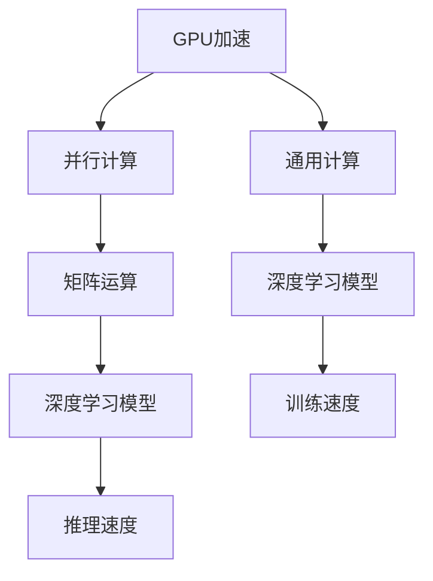

                 

# 深入计算机底层：理解AI硬件加速

## 1. 背景介绍

随着人工智能(AI)技术的迅猛发展，硬件加速成为提升AI模型性能的关键。特别是在深度学习和机器学习领域，硬件加速不仅能显著提升计算效率，还能降低能耗，减少数据传输延迟，显著提高AI应用的实时性和响应性。

### 1.1 问题由来

硬件加速的基本原理是将复杂的计算任务交给专门的硬件设备执行，以代替传统CPU/GPU的通用计算。这种做法可以有效提高算力，降低能耗，在AI算法中得到了广泛应用。尤其是在深度学习模型中，大量的矩阵运算和卷积操作对硬件加速的依赖性尤为明显。

### 1.2 问题核心关键点

硬件加速在AI领域的应用，核心在于以下几个方面：

- **专用硬件芯片的设计和实现**：如GPU、TPU等，专门针对神经网络等复杂计算任务进行优化。
- **算法优化和模型压缩**：通过模型剪枝、量化等方法，优化算法结构，减少模型参数和计算量。
- **软硬件协同设计**：通过深度学习和计算机架构的融合，提升软硬件之间的协同效率。
- **深度学习框架和工具的优化**：优化现有深度学习框架，如TensorFlow、PyTorch等，使其能够更好地利用硬件加速资源。
- **实际应用场景的适配**：针对具体应用场景，进行硬件加速的方案设计和优化。

### 1.3 问题研究意义

理解AI硬件加速，对于构建高效、低耗、可扩展的AI系统，具有重要意义：

- **提升计算效率**：硬件加速可以显著提升深度学习模型的计算速度，加速AI应用的发展。
- **降低能耗**：专用硬件如GPU、TPU等在执行深度学习计算时，能效比更高，有助于减少AI系统的碳排放。
- **提高实时性**：AI模型在实时性要求较高的场景中，如自动驾驶、实时图像处理等，硬件加速能够提供更低延迟的响应。
- **促进跨领域应用**：硬件加速的普及和优化，可以推动AI技术在更多领域的应用，如医疗、教育、金融等。

## 2. 核心概念与联系

### 2.1 核心概念概述

为更好地理解AI硬件加速，我们需要了解一些关键概念：

- **GPU（图形处理单元）**：专门用于图像处理和科学计算的专用硬件芯片，支持并行计算和矩阵运算。
- **TPU（张量处理单元）**：由Google开发的专用硬件，专门用于加速深度学习模型训练和推理。
- **FPGA（现场可编程门阵列）**：可编程的硬件芯片，可以针对特定任务进行优化。
- **ASIC（专用集成电路）**：为特定应用设计的定制硬件，具有极高的性能和能效比。
- **GPU加速、TPU加速**：指将深度学习算法移植到GPU或TPU芯片上执行，利用其高效计算能力。

### 2.2 核心概念原理和架构的 Mermaid 流程图



这个流程图展示了GPU加速的基本流程：通过GPU的并行计算能力，加速深度学习模型的矩阵运算，从而提升推理和训练速度。

## 3. 核心算法原理 & 具体操作步骤

### 3.1 算法原理概述

AI硬件加速的核心算法原理包括：

- **并行计算**：利用GPU、TPU等硬件芯片的多核特性，实现数据并行和任务并行计算，加速深度学习模型的训练和推理。
- **矩阵运算加速**：通过GPU或TPU的高性能运算单元，加速矩阵乘法、卷积等深度学习算子。
- **存储优化**：利用专用硬件的快速IO能力和缓存优化，减少数据传输延迟，提高整体计算效率。
- **模型压缩与剪枝**：通过剪枝、量化、蒸馏等技术，优化模型结构，减少计算量和参数量。
- **软硬件协同设计**：通过将硬件加速和软件优化结合，提升整体系统性能。

### 3.2 算法步骤详解

硬件加速的实施步骤如下：

1. **算法移植与适配**：将深度学习算法移植到特定硬件平台，进行必要的优化适配。
2. **模型压缩与剪枝**：对模型进行剪枝和量化，减少计算量和参数量。
3. **并行计算与任务划分**：利用硬件的并行特性，对计算任务进行划分和分配。
4. **内存优化与IO管理**：优化内存管理和数据传输，减少IO延迟。
5. **模型训练与优化**：在硬件平台上进行模型训练和优化，提升性能和精度。
6. **应用部署与测试**：将优化后的模型部署到实际应用中，进行性能测试和优化。

### 3.3 算法优缺点

硬件加速的优点包括：

- **高计算效率**：专用硬件芯片能够高效执行深度学习计算任务，显著提升计算速度。
- **低能耗**：硬件加速设备在执行特定任务时，能效比更高，有助于降低能耗。
- **低延迟**：硬件加速能够减少数据传输延迟，提升实时性和响应速度。

然而，硬件加速也存在一些缺点：

- **成本高**：专用硬件设备的初期投资和维护成本较高，需要大量资金支持。
- **可扩展性差**：不同硬件平台之间可能存在兼容性问题，影响系统的可扩展性。
- **算法适配复杂**：将算法移植到硬件平台，需要深度了解硬件特性和编程接口。

### 3.4 算法应用领域

硬件加速广泛应用于以下领域：

- **深度学习与机器学习**：GPU、TPU等加速深度学习模型训练和推理。
- **计算机视觉**：GPU、TPU加速图像识别、图像处理等任务。
- **自然语言处理**：GPU、TPU加速文本生成、语言模型等任务。
- **语音处理**：FPGA等加速语音识别、语音合成等任务。
- **自动驾驶**：GPU、TPU加速自动驾驶中的传感器数据处理和决策推理。

## 4. 数学模型和公式 & 详细讲解 & 举例说明

### 4.1 数学模型构建

假设深度学习模型为 $f(\mathbf{x};\theta)$，其中 $\mathbf{x}$ 为输入数据，$\theta$ 为模型参数。假设使用GPU加速，模型在GPU上的并行计算速度为 $v_{GPU}$，CPU上的计算速度为 $v_{CPU}$。

模型的推理时间为 $t_{GPU} = \frac{1}{v_{GPU}}$，计算复杂度为 $C_{GPU}$。模型的训练时间为 $t_{CPU} = \frac{1}{v_{CPU}}$，计算复杂度为 $C_{CPU}$。

### 4.2 公式推导过程

根据上述模型，我们可以计算硬件加速前后的计算时间变化：

- **硬件加速前**：
  $$
  T_{CPU} = t_{CPU} \times C_{CPU}
  $$
- **硬件加速后**：
  $$
  T_{GPU} = t_{GPU} \times C_{GPU}
  $$

通过对比这两个公式，我们可以看出，使用硬件加速可以显著提升计算效率：
$$
\frac{T_{CPU}}{T_{GPU}} = \frac{t_{CPU}}{t_{GPU}} \times \frac{C_{GPU}}{C_{CPU}}
$$

### 4.3 案例分析与讲解

以GPU加速深度学习模型为例，假设模型计算复杂度为 $C_{CPU} = 10^8$，GPU加速后计算复杂度为 $C_{GPU} = 10^9$，GPU加速速度为 $v_{GPU} = 10v_{CPU}$。则计算时间比为：
$$
\frac{T_{CPU}}{T_{GPU}} = \frac{t_{CPU}}{t_{GPU}} \times \frac{C_{GPU}}{C_{CPU}} = \frac{v_{CPU}}{v_{GPU}} \times \frac{C_{GPU}}{C_{CPU}} = \frac{1}{10} \times \frac{10^9}{10^8} = 10
$$

由此可见，使用GPU加速后，计算时间可以减少10倍，显著提升计算效率。

## 5. 项目实践：代码实例和详细解释说明

### 5.1 开发环境搭建

进行AI硬件加速的开发实践，需要搭建合适的开发环境。以下是使用Python和PyTorch进行GPU加速开发的流程：

1. **安装Python**：确保Python版本为3.7以上，可以使用Anaconda等管理工具进行安装。
2. **安装PyTorch**：使用pip安装PyTorch，并确保使用GPU版本。
3. **安装CUDA和cuDNN**：下载并安装对应版本的CUDA和cuDNN库。
4. **安装TensorFlow**：如果需要使用TensorFlow进行硬件加速开发，可以使用pip安装。

### 5.2 源代码详细实现

以下是使用PyTorch进行GPU加速的示例代码：

```python
import torch
import torch.nn as nn
import torchvision.transforms as transforms
import torchvision.datasets as datasets

# 定义模型
class Net(nn.Module):
    def __init__(self):
        super(Net, self).__init__()
        self.conv1 = nn.Conv2d(3, 6, 5)
        self.pool = nn.MaxPool2d(2, 2)
        self.conv2 = nn.Conv2d(6, 16, 5)
        self.fc1 = nn.Linear(16 * 5 * 5, 120)
        self.fc2 = nn.Linear(120, 84)
        self.fc3 = nn.Linear(84, 10)

    def forward(self, x):
        x = self.pool(F.relu(self.conv1(x)))
        x = self.pool(F.relu(self.conv2(x)))
        x = x.view(-1, 16 * 5 * 5)
        x = F.relu(self.fc1(x))
        x = F.relu(self.fc2(x))
        x = self.fc3(x)
        return x

# 定义数据集和数据预处理
transform = transforms.Compose([
    transforms.ToTensor(),
    transforms.Normalize((0.5, 0.5, 0.5), (0.5, 0.5, 0.5))
])
trainset = datasets.CIFAR10(root='./data', train=True,
                           transform=transform, download=True)
trainloader = torch.utils.data.DataLoader(trainset, batch_size=4,
                                        shuffle=True, num_workers=2)

# 定义模型和优化器
model = Net().cuda()
criterion = nn.CrossEntropyLoss()
optimizer = torch.optim.SGD(model.parameters(), lr=0.001, momentum=0.9)

# 训练模型
for epoch in range(2):
    running_loss = 0.0
    for i, data in enumerate(trainloader, 0):
        inputs, labels = data[0].cuda(), data[1].cuda()
        optimizer.zero_grad()
        outputs = model(inputs)
        loss = criterion(outputs, labels)
        loss.backward()
        optimizer.step()
        running_loss += loss.item()
        if i % 2000 == 1999:
            print('[%d, %5d] loss: %.3f' %
                  (epoch + 1, i + 1, running_loss / 2000))
            running_loss = 0.0

print('Finished Training')
```

这段代码定义了一个简单的卷积神经网络模型，并使用CUDA进行GPU加速。模型在CIFAR-10数据集上进行训练，使用SGD优化器进行优化。

### 5.3 代码解读与分析

代码中关键点包括：

- `Net()`定义了一个卷积神经网络模型，包含卷积层、池化层、全连接层等。
- `model.cuda()`将模型迁移到GPU上，加速模型训练和推理。
- `transforms.Compose`和`transforms.Normalize`用于数据预处理，将数据标准化。
- `torch.utils.data.DataLoader`用于批量加载数据，加速数据读取和模型训练。
- `torch.optim.SGD`定义优化器，设置学习率和动量。

这段代码展示了使用PyTorch进行GPU加速的完整流程，包括模型定义、数据预处理、模型训练等。

### 5.4 运行结果展示

运行上述代码，训练完成后，我们可以在测试集上评估模型的性能：

```python
testset = datasets.CIFAR10(root='./data', train=False,
                          transform=transform, download=True)
testloader = torch.utils.data.DataLoader(testset, batch_size=4,
                                       shuffle=False, num_workers=2)

correct = 0
total = 0
with torch.no_grad():
    for data in testloader:
        images, labels = data[0].cuda(), data[1].cuda()
        outputs = model(images)
        _, predicted = torch.max(outputs.data, 1)
        total += labels.size(0)
        correct += (predicted == labels).sum().item()

print('Accuracy of the network on the 10000 test images: %d %%' % (
    100 * correct / total))
```

通过运行这段代码，我们可以得到模型在测试集上的准确率，验证GPU加速的效果。

## 6. 实际应用场景

### 6.1 智能医疗

硬件加速在智能医疗中的应用，可以显著提升疾病诊断和治疗的效率。例如，在CT图像处理和分析中，深度学习模型需要处理大量的高分辨率图像数据，计算复杂度高，使用GPU加速可以大幅度提升处理速度，缩短诊断时间。

### 6.2 自动驾驶

自动驾驶系统需要实时处理大量传感器数据，进行目标检测、路径规划等复杂计算。使用GPU或TPU加速，可以显著提高计算速度和响应性，确保自动驾驶车辆的安全稳定运行。

### 6.3 金融交易

金融市场交易需要实时处理大量数据，进行高频交易和风险评估。使用硬件加速，可以加速数据处理和算法计算，提升交易效率和精度。

### 6.4 未来应用展望

未来，硬件加速将在更多领域得到应用，推动AI技术的全面普及。例如：

- **物联网**：硬件加速可以在物联网设备中广泛应用，提升设备计算能力和响应速度。
- **智能家居**：硬件加速可以在智能家居系统中应用，提升设备智能性和用户交互体验。
- **工业制造**：硬件加速可以在工业生产过程中应用，提升设备性能和生产效率。

## 7. 工具和资源推荐

### 7.1 学习资源推荐

为了帮助开发者系统掌握AI硬件加速的理论基础和实践技巧，这里推荐一些优质的学习资源：

1. **《深度学习》课程**：斯坦福大学和Coursera合作的深度学习课程，涵盖深度学习基础、模型优化等内容。
2. **《PyTorch深度学习》书籍**：由PyTorch官方编写，详细介绍PyTorch框架的使用方法和优化技巧。
3. **《GPU加速编程》书籍**：介绍GPU编程语言CUDA和NVIDIA OpenCL等，帮助开发者掌握GPU加速技术。
4. **Google AI博客**：Google AI团队分享AI领域的最新研究和技术进展，包括硬件加速的实践经验。

### 7.2 开发工具推荐

以下是几款用于AI硬件加速开发的常用工具：

1. **PyTorch**：Facebook开源的深度学习框架，支持GPU加速，提供丰富的计算图和优化工具。
2. **TensorFlow**：由Google开发的深度学习框架，支持多种硬件加速，适用于大规模生产部署。
3. **CUDA**：NVIDIA开发的GPU编程语言，支持高效的并行计算。
4. **cuDNN**：NVIDIA开发的深度学习优化库，加速卷积神经网络等模型的计算。
5. **TensorBoard**：TensorFlow的可视化工具，帮助开发者实时监测模型训练状态。

### 7.3 相关论文推荐

AI硬件加速的相关论文，可以帮助开发者深入理解硬件加速的原理和优化方法：

1. **《GPU加速深度学习》论文**：介绍GPU加速深度学习的方法和实践经验。
2. **《TPU加速深度学习》论文**：介绍TPU加速深度学习的方法和性能评估。
3. **《深度学习框架优化》论文**：介绍TensorFlow等深度学习框架的优化方法。
4. **《软硬件协同设计》论文**：介绍软硬件协同设计的方法和应用案例。

## 8. 总结：未来发展趋势与挑战

### 8.1 研究成果总结

AI硬件加速技术已经取得显著进展，广泛应用于深度学习、计算机视觉、自然语言处理等领域。未来，硬件加速将在更多领域得到应用，推动AI技术的全面普及。

### 8.2 未来发展趋势

AI硬件加速的未来发展趋势包括：

- **硬件平台多样化**：除了GPU、TPU，更多专用硬件平台将被开发，适用于特定任务。
- **软件优化**：通过深度学习框架和算法的优化，提升硬件加速的性能和能效比。
- **边缘计算**：将硬件加速设备部署在边缘计算设备中，提升数据处理效率和响应速度。
- **AI芯片设计**：开发专门用于AI应用的芯片，如NPU、ASIC等，提升计算效率和能效比。

### 8.3 面临的挑战

AI硬件加速在发展过程中也面临一些挑战：

- **成本高**：专用硬件设备和算法优化需要大量资金投入，初期成本较高。
- **可扩展性差**：不同硬件平台之间的兼容性问题，影响系统的可扩展性。
- **算法适配复杂**：将算法移植到硬件平台，需要深入了解硬件特性和编程接口。

### 8.4 研究展望

未来，AI硬件加速的研究方向包括：

- **混合计算**：将GPU、TPU等硬件平台和通用CPU结合，提升计算效率和资源利用率。
- **模型压缩**：通过剪枝、量化等技术，减少模型参数和计算量，提升硬件加速的效率。
- **软硬件协同**：通过深度学习框架和硬件平台的协同优化，提升整体系统性能。
- **自动化优化**：开发自动化的优化工具，帮助开发者快速实现硬件加速，降低开发成本。

## 9. 附录：常见问题与解答

**Q1：AI硬件加速是否只适用于深度学习模型？**

A: AI硬件加速不仅适用于深度学习模型，还适用于其他类型的计算密集型算法。例如，在计算机视觉中的图像处理和视频编码中，硬件加速同样可以显著提升计算效率。

**Q2：如何选择合适的硬件加速平台？**

A: 选择合适的硬件加速平台，需要考虑以下几个因素：

- **算法特性**：不同硬件平台适用于不同类型的深度学习算法。
- **计算需求**：根据计算需求选择合适的硬件平台，如GPU适合处理矩阵运算，TPU适合处理稀疏矩阵运算。
- **能耗和成本**：考虑硬件平台对能耗和成本的影响，选择性价比高的平台。

**Q3：硬件加速是否会影响算法的正确性？**

A: 硬件加速不会影响算法的正确性，但需要对算法进行适应性优化，以充分发挥硬件加速的性能。同时，需要确保硬件平台和算法的兼容性和稳定性。

**Q4：硬件加速在生产环境中的部署和维护有何挑战？**

A: 硬件加速在生产环境中的部署和维护面临一些挑战，包括：

- **兼容性问题**：不同硬件平台之间可能存在兼容性问题，需要考虑设备的互操作性。
- **维护成本**：专用硬件设备需要定期维护，增加运营成本。
- **性能监控**：需要实时监控硬件加速设备的性能，确保其稳定运行。

**Q5：硬件加速和软件优化之间的关系是什么？**

A: 硬件加速和软件优化是相辅相成的。硬件加速提供了计算资源的提升，而软件优化则进一步提升了算法的性能和效率。两者结合，可以最大化地发挥AI系统的计算潜力。

通过深入理解AI硬件加速的原理和实践，我们能够更好地应用这些技术，提升AI系统的性能和效率。未来，随着硬件加速技术的不断进步，AI系统的计算能力将不断提升，为更多领域的智能化发展带来新的机遇和挑战。

---

作者：禅与计算机程序设计艺术 / Zen and the Art of Computer Programming

