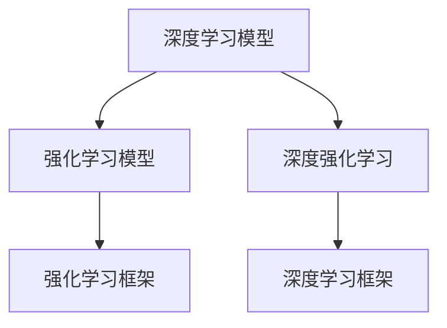

                 

# 深度学习与强化学习的未来

> 关键词：深度学习, 强化学习, 神经网络, 深度学习模型, 深度强化学习, 强化学习模型, 深度学习应用, 强化学习应用, 深度学习框架, 强化学习框架

## 1. 背景介绍

### 1.1 问题由来

深度学习（Deep Learning）和强化学习（Reinforcement Learning, RL）是当今人工智能（AI）领域的两大核心技术。深度学习通过构建复杂神经网络模型，能够自动学习并提取数据中的特征，在图像识别、自然语言处理、语音识别等领域取得了巨大成功。强化学习通过智能体在环境中的交互学习，能够优化策略以实现特定目标，在自动控制、机器人学、游戏AI等领域表现出色。

然而，深度学习和强化学习各自有其局限性。深度学习模型存在"黑箱"问题，难以解释其决策过程；而强化学习则面临样本效率低、学习过程缓慢的问题，且在复杂环境中表现不稳定。近年来，研究者们逐渐认识到，深度学习与强化学习之间的互补性，将二者结合，形成深度强化学习（Deep Reinforcement Learning, DRL），成为实现智能代理的重要途径。

本文将全面介绍深度学习与强化学习的最新进展，探讨二者的结合方式及其在未来应用中的趋势与挑战。

### 1.2 问题核心关键点

深度强化学习的核心在于如何高效地将深度学习模型与强化学习算法进行结合，并利用神经网络强大的泛化能力和学习效率，加速强化学习的收敛过程。此外，深度强化学习在处理高维度、复杂环境下的决策优化问题上，具有独特的优势，可以应用到诸多智能系统的构建中。

## 2. 核心概念与联系

### 2.1 核心概念概述

为更好地理解深度强化学习的核心概念，本节将介绍几个关键概念：

- 深度学习模型（Deep Learning Model）：指由多层神经网络构成的模型，能够学习并提取输入数据的高层特征。常见的深度学习模型包括卷积神经网络（CNN）、循环神经网络（RNN）、Transformer等。
- 强化学习模型（Reinforcement Learning Model）：指智能体通过与环境交互，学习最优策略以达到预期目标。强化学习模型由状态空间、动作空间、奖励函数等组成。
- 深度强化学习（Deep Reinforcement Learning）：指将深度学习模型与强化学习算法相结合，构建能够处理复杂决策问题的智能代理。
- 深度学习框架（Deep Learning Framework）：指用于实现深度学习模型的软件库，如TensorFlow、PyTorch等，提供了高效计算图、自动微分等功能，支持复杂模型的训练。
- 强化学习框架（Reinforcement Learning Framework）：指用于实现强化学习算法的软件库，如OpenAI Gym、Stable Baselines等，提供了丰富的环境和算法库，方便实验调参。

这些概念之间的逻辑关系可以通过以下Mermaid流程图来展示：



这个流程图展示了深度学习模型、强化学习模型和深度强化学习的核心关系，及其与深度学习框架和强化学习框架的结合方式。

## 3. 核心算法原理 & 具体操作步骤
### 3.1 算法原理概述

深度强化学习的核心算法原理包括以下几个步骤：

1. 构建深度学习模型。选择合适的神经网络架构，如CNN、RNN、Transformer等，用于处理输入数据，提取特征。
2. 设计强化学习算法。选择合适的强化学习算法，如Q-learning、SARSA、Policy Gradient等，用于优化策略。
3. 集成深度学习与强化学习。将深度学习模型作为策略的表示器，通过反向传播更新模型参数，优化策略。
4. 模型训练与评估。在环境中收集数据，使用强化学习算法训练深度模型，评估模型性能。
5. 模型部署与应用。将训练好的模型部署到实际应用中，执行决策优化任务。

### 3.2 算法步骤详解

以DQN（Deep Q-Network）为例，详细阐述深度强化学习的算法步骤：

1. 构建深度Q网络（DQN）。采用CNN作为Q网络的输入层，提取状态特征，输出Q值。
2. 设计Q-learning算法。定义状态-动作对的目标Q值，通过Q网络预测当前状态下的动作值，使用Q-learning更新Q网络参数。
3. 集成DQN与环境。在环境中找到当前状态，使用DQN策略选择动作，执行并观察环境反馈，更新Q网络。
4. 模型训练与评估。使用DQN与环境交互，采集经验数据，使用Q-learning算法训练Q网络，评估模型性能。
5. 模型部署与应用。将训练好的DQN模型部署到实际应用中，执行决策优化任务，如自动驾驶、游戏AI等。

### 3.3 算法优缺点

深度强化学习的优点包括：

1. 处理高维度数据。深度学习模型能够处理高维度的输入数据，适用于复杂环境下的决策优化问题。
2. 学习效率高。深度学习模型通过反向传播算法自动更新参数，加速收敛过程。
3. 优化能力强大。强化学习算法能够优化复杂的决策策略，适用于非线性、高维度的决策问题。
4. 适应性强。深度强化学习模型能够适应不同的环境，泛化能力较强。

同时，深度强化学习也存在一些缺点：

1. 样本效率低。深度强化学习需要大量的训练数据，样本效率较低。
2. 稳定性差。深度强化学习模型对初始条件和超参数敏感，容易过拟合。
3. 计算资源需求大。深度强化学习模型需要大量的计算资源，训练和推理速度较慢。
4. 可解释性不足。深度强化学习模型通常被视为"黑盒"，难以解释其决策过程。

## 4. 数学模型和公式 & 详细讲解 & 举例说明

### 4.1 数学模型构建

以DQN算法为例，构建数学模型：

- 状态空间：记当前状态为$s$，状态空间为$\mathcal{S}$。
- 动作空间：记当前动作为$a$，动作空间为$\mathcal{A}$。
- 奖励函数：记当前状态-动作对$(s, a)$的奖励为$r$，奖励函数为$R$。
- Q网络：定义深度Q网络，将状态$s$映射到动作-奖励值$Q(s, a)$。
- Q-learning算法：使用Q-learning算法更新Q网络参数，学习最优策略。

### 4.2 公式推导过程

DQN算法的核心公式为：

$$
Q(s, a) \leftarrow Q(s, a) + \alpha \left[ r + \gamma \max_{a'} Q(s', a') - Q(s, a) \right]
$$

其中，$\alpha$为学习率，$\gamma$为折扣因子。该公式描述了Q值的更新过程，利用当前状态-动作对$s, a$的奖励$r$和下一个状态$s'$的Q值最大化策略$\max_{a'} Q(s', a')$，更新Q网络参数。

### 4.3 案例分析与讲解

以玩游戏的DQN为例，分析其具体实现过程：

1. 构建Q网络，选择CNN作为输入层，输出为Q值。
2. 定义状态空间为游戏界面像素值，动作空间为按键值。
3. 定义奖励函数，当游戏胜利得1分，否则得0分。
4. 使用Q-learning算法，迭代更新Q网络参数，优化策略。
5. 在实际游戏中，利用DQN策略选择动作，观察游戏状态和奖励，更新Q网络。
6. 持续训练，直到模型收敛，达到最优策略。

## 5. 项目实践：代码实例和详细解释说明
### 5.1 开发环境搭建

在开始深度强化学习项目前，需要搭建好开发环境。以下是Python环境配置流程：

1. 安装Anaconda：从官网下载并安装Anaconda，用于创建独立的Python环境。

2. 创建并激活虚拟环境：
```bash
conda create -n drl-env python=3.8 
conda activate drl-env
```

3. 安装必要的包：
```bash
pip install gym numpy pytorch torchvision torchtext gym-envs
```

4. 配置Gym环境：
```bash
gym --force-reinstall envs:Atari
```

完成上述步骤后，即可在`drl-env`环境中开始深度强化学习实践。

### 5.2 源代码详细实现

以下代码实现DQN算法用于玩游戏的全过程：

```python
import gym
import numpy as np
import torch
import torch.nn as nn
import torch.optim as optim

# 构建Q网络
class DQN(nn.Module):
    def __init__(self, input_size, output_size):
        super(DQN, self).__init__()
        self.fc1 = nn.Linear(input_size, 64)
        self.fc2 = nn.Linear(64, output_size)
    
    def forward(self, x):
        x = F.relu(self.fc1(x))
        x = self.fc2(x)
        return x
    
# 构建DQN代理
class DQNAgent:
    def __init__(self, env, gamma=0.99, epsilon=0.1, epsilon_min=0.01, epsilon_decay=0.995):
        self.env = env
        self.gamma = gamma
        self.epsilon = epsilon
        self.epsilon_min = epsilon_min
        self.epsilon_decay = epsilon_decay
        self.q_network = DQN(self.env.observation_space.shape[0], self.env.action_space.n)
        self.target_network = DQN(self.env.observation_space.shape[0], self.env.action_space.n)
        self.optimizer = optim.Adam(self.q_network.parameters(), lr=0.001)
        self.loss_fn = nn.MSELoss()
    
    def choose_action(self, state):
        if np.random.uniform(0, 1) < self.epsilon:
            return self.env.action_space.sample()
        else:
            state = torch.FloatTensor(state).unsqueeze(0)
            q_values = self.q_network(state)
            return torch.argmax(q_values).item()
    
    def update_target_network(self):
        self.target_network.load_state_dict(self.q_network.state_dict())
    
    def update_model(self, batch):
        state = torch.FloatTensor(batch[0])
        action = torch.LongTensor(batch[1])
        reward = torch.FloatTensor(batch[2])
        next_state = torch.FloatTensor(batch[3])
        done = torch.FloatTensor(batch[4])
        target = reward + self.gamma * torch.max(self.target_network(torch.FloatTensor(next_state)).unsqueeze(0))[0]
        q_values = self.q_network(state)
        loss = self.loss_fn(q_values, target.unsqueeze(1))
        self.optimizer.zero_grad()
        loss.backward()
        self.optimizer.step()
        self.epsilon *= self.epsilon_decay
        self.epsilon = max(self.epsilon, self.epsilon_min)
    
# 训练过程
def train(env_name, episode_num=10000):
    env = gym.make(env_name)
    state_size = env.observation_space.shape[0]
    action_size = env.action_space.n
    gamma = 0.99
    epsilon = 0.1
    epsilon_min = 0.01
    epsilon_decay = 0.995
    
    agent = DQNAgent(env, gamma, epsilon, epsilon_min, epsilon_decay)
    for episode in range(episode_num):
        state = env.reset()
        state = np.reshape(state, [1, -1])
        score = 0
        for t in range(10000):
            action = agent.choose_action(state)
            next_state, reward, done, _ = env.step(action)
            next_state = np.reshape(next_state, [1, -1])
            agent.update_model([state, action, reward, next_state, done])
            state = next_state
            score += reward
            if done:
                break
        print(f"Episode {episode+1}, Score: {score}")
```

### 5.3 代码解读与分析

代码中的关键步骤包括：

1. 构建Q网络。使用PyTorch的nn.Module构建Q网络，包含两个全连接层。
2. 构建DQN代理。定义DQNAgent类，包含Q网络、优化器、损失函数等关键组件。
3. 选择动作。根据当前状态和策略选择动作，利用epsilon-greedy策略在探索和利用之间平衡。
4. 更新模型。使用训练数据更新Q网络参数，优化策略。
5. 训练过程。在指定环境中进行多次训练，输出每次训练的得分。

## 6. 实际应用场景
### 6.1 自动驾驶

深度强化学习在自动驾驶领域有着广泛的应用前景。传统的自动驾驶算法通常依赖于手工设计的规则和规则库，难以应对复杂道路环境。而深度强化学习可以通过与环境的交互学习，优化车辆的驾驶策略，提升驾驶安全性和智能化水平。

具体而言，可以构建一个深度强化学习模型，将车辆状态、道路状况、行人信息等作为输入，学习最优驾驶策略。通过模拟环境和实际测试，不断优化模型，使其能够准确识别道路标志、行人、车辆等障碍物，并采取合适的动作（如加速、刹车、转向等）。如此构建的自动驾驶系统，能够更好地适应复杂多变的道路环境，实现自动导航、自动泊车等功能。

### 6.2 金融交易

深度强化学习在金融交易领域也展现出强大的潜力。传统的交易策略通常依赖于统计分析和历史数据，难以应对市场的快速变化。而深度强化学习可以通过与市场的互动学习，优化交易策略，提升收益和风险控制能力。

具体而言，可以构建一个深度强化学习模型，将市场数据（如股票价格、交易量等）作为输入，学习最优交易策略。通过模拟交易环境和实际测试，不断优化模型，使其能够准确预测市场趋势，自动执行交易，达到最优收益。如此构建的交易系统，能够更好地适应市场变化，提升交易效率和收益。

### 6.3 机器人学

深度强化学习在机器人学领域也有着重要的应用。传统的机器人控制算法通常依赖于手工设计的控制器，难以应对动态变化的环境。而深度强化学习可以通过与环境的交互学习，优化机器人控制策略，提升机器人的自主性和智能化水平。

具体而言，可以构建一个深度强化学习模型，将机器人状态和环境作为输入，学习最优控制策略。通过模拟环境和实际测试，不断优化模型，使其能够自主完成各种复杂的任务，如搬运、导航、互动等。如此构建的机器人系统，能够更好地适应复杂多变的环境，实现自主决策和行动。

### 6.4 未来应用展望

随着深度强化学习技术的不断发展，未来在以下几个领域将展现出更加广阔的应用前景：

1. 医疗诊断。深度强化学习可以应用于医学图像处理、疾病预测、药物研发等领域，提升医疗诊断的智能化水平。
2. 智能制造。深度强化学习可以应用于工业机器人控制、供应链优化、智能工厂管理等领域，提升制造业的智能化水平。
3. 游戏AI。深度强化学习可以应用于游戏AI、人机对战等领域，提升游戏AI的智能化水平。
4. 教育培训。深度强化学习可以应用于在线教育、个性化学习、智能辅导等领域，提升教育培训的智能化水平。
5. 能源管理。深度强化学习可以应用于智能电网、能源调度、可再生能源管理等领域，提升能源管理的智能化水平。

## 7. 工具和资源推荐
### 7.1 学习资源推荐

为了帮助开发者系统掌握深度强化学习的理论基础和实践技巧，这里推荐一些优质的学习资源：

1. 《Deep Reinforcement Learning》书籍：由Ian Goodfellow等编著，系统介绍了深度强化学习的原理、算法和应用，是深度强化学习领域的经典教材。
2. DeepMind的官方博客：深度学习领域的大牛博客，介绍了DeepMind的最新研究成果和前沿进展。
3. OpenAI Gym环境：一个开源的强化学习环境，提供了各种环境和算法的测试平台。
4. PyTorch和TensorFlow的官方文档：提供了深度学习模型的实现和优化工具，方便开发者进行实验。

通过学习这些资源，相信你一定能够快速掌握深度强化学习的精髓，并用于解决实际的决策优化问题。

### 7.2 开发工具推荐

高效的开发离不开优秀的工具支持。以下是几款用于深度强化学习开发的常用工具：

1. PyTorch和TensorFlow：用于实现深度强化学习模型的软件库，提供了高效计算图、自动微分等功能，支持复杂模型的训练。
2. OpenAI Gym：用于测试和比较强化学习算法的开源环境，提供了丰富的环境和算法库，方便实验调参。
3. PyBullet：用于模拟和控制物理系统的开源工具，支持深度强化学习的模拟环境。
4. TensorBoard：用于可视化深度强化学习模型的训练过程，提供了丰富的图表呈现方式，是调试模型的得力助手。
5. Weights & Biases：用于实验跟踪和版本管理的工具，可以记录和可视化模型训练过程中的各项指标，方便对比和调优。

合理利用这些工具，可以显著提升深度强化学习任务的开发效率，加快创新迭代的步伐。

### 7.3 相关论文推荐

深度强化学习的发展离不开学界的持续研究。以下是几篇奠基性的相关论文，推荐阅读：

1. DeepMind的AlphaGo论文：展示了大规模深度强化学习模型的强大零样本学习能力，引发了对于通用人工智能的新一轮思考。
2. Atari Games的DQN论文：提出了DQN算法，将深度学习与强化学习结合，实现了对复杂环境的决策优化。
3. DeepMind的AlphaStar论文：展示了大规模深度强化学习模型在复杂策略游戏（如星际争霸）中的应用，提升了AI在战略决策中的智能化水平。
4. Google的AlphaFold论文：展示了深度强化学习在生物信息学中的应用，通过与环境的交互学习，提升了蛋白质结构预测的精度。
5. OpenAI的GPT系列论文：展示了深度强化学习在自然语言处理中的应用，提升了语言生成和推理的智能化水平。

这些论文代表了大深度强化学习的发展脉络。通过学习这些前沿成果，可以帮助研究者把握学科前进方向，激发更多的创新灵感。

## 8. 总结：未来发展趋势与挑战
### 8.1 研究成果总结

深度强化学习在近年来取得了显著进展，应用领域不断扩大，研究热点不断涌现。其核心技术包括：

1. 深度Q网络（DQN）：将深度学习与强化学习结合，实现对复杂环境的决策优化。
2. 策略梯度（PG）：通过反向传播算法优化策略，实现对策略的优化。
3. 重要性采样（IS）：提高样本效率，加速模型训练。
4. 自适应深度强化学习（ADRL）：通过自适应算法优化模型参数，提高模型泛化能力。
5. 多智能体深度强化学习（MADRL）：通过多个智能体的协作学习，实现复杂决策问题的优化。

这些技术的不断演进，推动了深度强化学习在更多领域的应用，提升了决策优化模型的智能化水平。

### 8.2 未来发展趋势

深度强化学习的未来发展趋势包括以下几个方向：

1. 模型规模扩大。深度强化学习模型的参数量将继续扩大，能够处理更加复杂、高维度的决策问题。
2. 学习效率提升。深度强化学习将结合更多优化算法和采样技术，提高模型训练效率。
3. 鲁棒性增强。深度强化学习模型将引入更多正则化和鲁棒性优化技术，提高模型的泛化能力和抗干扰性。
4. 多智能体协作。深度强化学习将更多地关注多智能体协作学习，实现更高效的决策优化。
5. 跨领域应用。深度强化学习将更多地关注跨领域的决策优化问题，如医疗、金融、制造等领域。
6. 人机协同。深度强化学习将更多地关注人机协同学习，提高智能系统的可解释性和决策透明度。

这些发展趋势将推动深度强化学习技术的不断突破，为更多领域的智能决策提供有力支持。

### 8.3 面临的挑战

尽管深度强化学习已经取得了显著进展，但在实现复杂决策优化任务时仍面临诸多挑战：

1. 计算资源需求大。深度强化学习模型需要大量的计算资源，训练和推理速度较慢。
2. 模型鲁棒性不足。深度强化学习模型对初始条件和超参数敏感，容易过拟合。
3. 可解释性不足。深度强化学习模型通常被视为"黑盒"，难以解释其决策过程。
4. 样本效率低。深度强化学习需要大量的训练数据，样本效率较低。
5. 跨领域泛化能力差。深度强化学习模型在不同领域之间的泛化能力较弱，难以应对复杂多变的决策问题。

### 8.4 研究展望

未来的研究将致力于解决这些挑战，推动深度强化学习技术的不断进步：

1. 模型压缩与优化。研究高效、轻量级的深度强化学习模型，提升模型训练和推理效率。
2. 鲁棒性增强。研究鲁棒性优化算法，提高模型泛化能力和抗干扰性。
3. 可解释性提升。研究可解释性技术，提高模型的决策透明度和可理解性。
4. 数据高效利用。研究数据增强和对抗性训练技术，提高模型训练效率。
5. 跨领域泛化。研究跨领域泛化方法，提高模型在不同领域之间的泛化能力。

这些研究方向将推动深度强化学习技术的不断成熟，为更多领域的智能决策提供有力支持。

## 9. 附录：常见问题与解答

**Q1：深度强化学习与传统强化学习的区别是什么？**

A: 深度强化学习与传统强化学习的区别在于，深度强化学习使用了深度学习模型来表示状态空间和动作空间，可以处理高维度的输入数据，提升了模型的泛化能力和学习效率。而传统强化学习通常依赖手工设计的特征提取方法，难以处理高维度的输入数据。

**Q2：深度强化学习在处理复杂环境时表现如何？**

A: 深度强化学习在处理复杂环境时表现出色，可以通过与环境的交互学习，优化决策策略。例如，在自动驾驶、游戏AI等领域，深度强化学习已经展现出强大的智能化水平。

**Q3：深度强化学习在处理大规模数据时效率如何？**

A: 深度强化学习在处理大规模数据时效率较低，需要大量的计算资源和时间。为了提高效率，可以采用分布式训练、数据增强等技术。

**Q4：深度强化学习的模型可解释性如何？**

A: 深度强化学习的模型通常被视为"黑盒"，难以解释其决策过程。为了提高可解释性，可以采用模型压缩、可视化等技术，提供模型决策的可视化解释。

**Q5：深度强化学习在实际应用中面临哪些挑战？**

A: 深度强化学习在实际应用中面临计算资源需求大、模型鲁棒性不足、可解释性不足等挑战。研究者们正在通过模型优化、鲁棒性增强、可解释性提升等技术，不断克服这些挑战。

通过本文的系统梳理，可以看到，深度强化学习在决策优化领域展现出强大的潜力，正在成为实现智能代理的重要途径。未来，随着技术的不断演进，深度强化学习将更加广泛地应用于各个领域，推动人工智能技术的全面突破。

