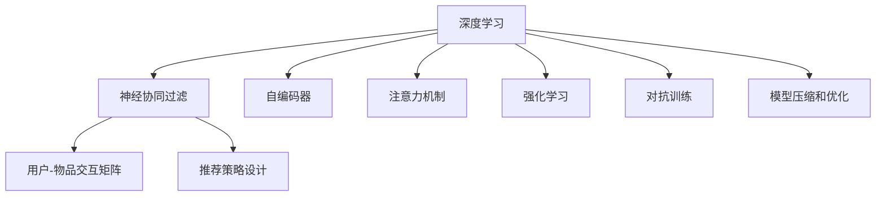

                 

# 深度学习在推荐系统中的应用

## 1. 背景介绍

推荐系统（Recommender System）是一种利用用户历史行为、兴趣偏好等数据，预测并推荐用户可能感兴趣的产品、内容或服务的智能系统。推荐系统在电商、新闻、社交网络、视频等多个领域得到广泛应用，极大地提升了用户体验和业务转化率。随着用户数据的不断积累和用户需求的多样化，推荐系统对深度学习技术的需求日益凸显。

### 1.1 推荐系统的关键问题

推荐系统通常需要解决以下关键问题：

1. **用户画像构建**：对用户的历史行为和兴趣偏好进行建模，以形成完整的用户画像。
2. **物品特征抽取**：从物品的属性和上下文信息中提取特征，以便进行推荐。
3. **相似度计算**：衡量用户和物品之间的相似度，以便找到最匹配的推荐结果。
4. **推荐策略设计**：结合用户画像和物品特征，设计合理的推荐策略，以产生高质量的推荐结果。

传统推荐系统主要依赖于协同过滤、矩阵分解等技术。随着深度学习技术的发展，基于深度神经网络的推荐系统逐渐成为研究热点，尤其以神经协同过滤（Neural Collaborative Filtering, NCF）为代表的深度推荐系统，在大规模推荐任务中取得了显著的性能提升。

## 2. 核心概念与联系

### 2.1 核心概念概述

本节将介绍深度学习在推荐系统中的一些核心概念：

- **深度学习**：一种利用多层神经网络逼近复杂非线性关系的学习方法，通过反向传播算法优化模型参数，实现对大量数据的学习。
- **神经协同过滤**：一种基于深度神经网络的推荐算法，通过用户-物品交互矩阵的预测来生成推荐。
- **用户-物品交互矩阵**：记录用户对物品的评分、点击、购买等行为，形成二维稀疏矩阵，用于推荐策略设计。
- **自编码器（Autoencoder）**：一种无监督学习算法，用于降维和特征提取，常用于预处理用户和物品的特征表示。
- **注意力机制（Attention Mechanism）**：一种基于注意力机制的设计，用于增强模型对重要特征的关注，提高推荐效果。
- **强化学习**：一种通过奖励信号学习最优策略的学习方法，常用于推荐系统中优化推荐策略和用户行为。
- **对抗训练**：一种通过引入对抗样本训练模型的方法，提高模型的鲁棒性和泛化能力。
- **模型压缩和优化**：通过剪枝、量化、蒸馏等方法，减小模型规模和计算复杂度，提升推荐系统的实时性。

这些概念之间的逻辑关系可以通过以下Mermaid流程图来展示：



这个流程图展示了几类深度学习在推荐系统中的应用场景及其相互关系：

1. 深度学习通过多层神经网络逼近复杂关系，是神经协同过滤、自编码器、注意力机制等推荐算法的基础。
2. 用户-物品交互矩阵的预测和推荐策略设计是推荐系统的主要任务。
3. 自编码器用于降维和特征提取，增强推荐效果。
4. 注意力机制用于增强模型对重要特征的关注。
5. 强化学习用于优化推荐策略和用户行为。
6. 对抗训练和模型压缩优化提高推荐系统的鲁棒性和实时性。

## 3. 核心算法原理 & 具体操作步骤
### 3.1 算法原理概述

基于深度学习的推荐系统，其核心思想是通过构建用户画像和物品特征表示，计算用户与物品之间的相似度，从而生成推荐。具体的算法流程如下：

1. **数据预处理**：对用户和物品的数据进行清洗、归一化、降维等处理，形成特征表示。
2. **用户画像构建**：通过用户的历史行为和兴趣偏好，构建用户画像。
3. **物品特征表示**：通过自编码器等技术，将物品的属性和上下文信息进行降维和特征提取。
4. **相似度计算**：计算用户和物品之间的相似度，生成推荐。
5. **推荐策略设计**：根据相似度结果，设计推荐策略，产生推荐结果。

### 3.2 算法步骤详解

以下将详细介绍深度学习在推荐系统中的关键步骤。

**Step 1: 数据预处理**

- **特征选择**：选择对推荐效果影响较大的特征，进行特征选择和降维。
- **归一化**：对特征进行归一化处理，减小特征之间的尺度差异。
- **降维**：通过PCA、t-SNE等方法对特征进行降维，减小计算复杂度。

**Step 2: 用户画像构建**

- **用户嵌入**：使用矩阵分解、因子分解等方法，对用户的行为数据进行建模，得到用户嵌入向量。
- **兴趣建模**：通过文本挖掘、主题模型等方法，提取用户的兴趣特征，形成兴趣向量。

**Step 3: 物品特征表示**

- **物品嵌入**：通过自编码器、卷积神经网络等方法，对物品的属性和上下文信息进行特征提取，得到物品嵌入向量。
- **特征融合**：将用户和物品的特征进行融合，生成综合特征表示。

**Step 4: 相似度计算**

- **余弦相似度**：使用余弦相似度计算用户和物品之间的相似度。
- **注意力机制**：使用注意力机制增强模型对重要特征的关注，提高推荐效果。

**Step 5: 推荐策略设计**

- **协同过滤**：通过用户和物品的相似度矩阵，生成推荐。
- **深度协同过滤**：结合深度神经网络，对协同过滤进行优化。
- **强化学习**：使用强化学习优化推荐策略，提升推荐效果。

### 3.3 算法优缺点

深度学习在推荐系统中的优势主要体现在以下几个方面：

1. **特征表示能力**：深度神经网络能够自动学习到高维特征，捕捉复杂的非线性关系，提高推荐效果。
2. **泛化能力**：深度模型能够从大量数据中学习到更一般的规律，提高推荐系统的泛化能力。
3. **实时性**：深度模型可以通过并行计算和模型压缩优化，提升推荐系统的实时性。
4. **可解释性**：深度模型通过可视化工具可以提供推荐结果的解释，增强用户信任。

然而，深度学习在推荐系统中也存在一些缺点：

1. **计算复杂度高**：深度模型的参数量较大，训练和推理计算复杂度高。
2. **数据依赖性强**：深度模型需要大量标注数据进行训练，对数据的依赖性强。
3. **鲁棒性不足**：深度模型对数据噪声和异常值较为敏感，鲁棒性不足。
4. **可解释性差**：深度模型通常被视为“黑盒”，难以解释其内部工作机制。

### 3.4 算法应用领域

深度学习在推荐系统中的应用广泛，涵盖电商、新闻、社交网络、视频等多个领域。以下是几个典型的应用场景：

- **电商推荐**：推荐系统通过分析用户浏览、点击、购买等行为，推荐可能感兴趣的商品。
- **新闻推荐**：推荐系统根据用户阅读历史和兴趣偏好，推荐相关的新闻文章。
- **视频推荐**：推荐系统根据用户的观看历史和评分，推荐可能喜欢的视频内容。
- **社交网络推荐**：推荐系统根据用户的社交关系和行为数据，推荐可能感兴趣的内容和用户。

## 4. 数学模型和公式 & 详细讲解  
### 4.1 数学模型构建

本节将使用数学语言对深度学习在推荐系统中的应用进行更加严格的刻画。

记用户-物品交互矩阵为 $X \in \mathbb{R}^{N \times M}$，其中 $N$ 为用户数，$M$ 为物品数。假设用户对物品的评分服从 $\mathcal{N}(0,1)$ 分布，即用户对物品的评分可以看作随机变量 $z_{ij}$ 的观察值。

定义用户嵌入向量 $u_i \in \mathbb{R}^d$ 和物品嵌入向量 $v_j \in \mathbb{R}^d$，其中 $d$ 为嵌入维度。

定义用户-物品交互矩阵 $R_{ij} = z_{ij}$，其中 $R_{ij} \in [0,1]$。

推荐模型的目标是最小化预测误差，即：

$$
\min_{\theta} \frac{1}{N} \sum_{i=1}^N \sum_{j=1}^M (R_{ij} - \hat{R}_{ij})^2
$$

其中 $\hat{R}_{ij}$ 为模型预测的用户对物品的评分。

### 4.2 公式推导过程

以下是推荐模型的具体推导过程：

假设模型使用深度神经网络对用户和物品进行特征提取，得到用户嵌入向量 $u_i$ 和物品嵌入向量 $v_j$。设用户和物品的相似度为 $s_{ij} = u_i^T v_j$。则推荐模型的输出为：

$$
\hat{R}_{ij} = \sigma(\alpha_i^T \beta_j + s_{ij})
$$

其中 $\sigma$ 为激活函数，$\alpha_i$ 和 $\beta_j$ 为模型参数。

根据均方误差损失函数，模型需要最小化的目标函数为：

$$
L = \frac{1}{N} \sum_{i=1}^N \sum_{j=1}^M (R_{ij} - \hat{R}_{ij})^2
$$

将推荐模型的输出带入目标函数，得到：

$$
L = \frac{1}{N} \sum_{i=1}^N \sum_{j=1}^M (\sigma(\alpha_i^T \beta_j + s_{ij}) - R_{ij})^2
$$

为了优化模型参数，需要对目标函数进行优化。可以使用梯度下降等优化算法，对模型参数进行迭代更新，使得目标函数最小化。

### 4.3 案例分析与讲解

以电商推荐为例，进行详细分析。

假设电商平台有100万用户，1000万商品。用户对商品的评分服从 $\mathcal{N}(0,1)$ 分布。使用深度神经网络对用户和商品进行特征提取，得到用户嵌入向量 $u_i \in \mathbb{R}^d$ 和商品嵌入向量 $v_j \in \mathbb{R}^d$。模型的输出为：

$$
\hat{R}_{ij} = \sigma(\alpha_i^T \beta_j + u_i^T v_j)
$$

其中 $\sigma$ 为激活函数，$\alpha_i$ 和 $\beta_j$ 为模型参数。模型的损失函数为：

$$
L = \frac{1}{N} \sum_{i=1}^N \sum_{j=1}^M (\sigma(\alpha_i^T \beta_j + u_i^T v_j) - R_{ij})^2
$$

使用梯度下降等优化算法，最小化损失函数 $L$，更新模型参数 $\alpha$ 和 $\beta$，生成推荐结果。

## 5. 项目实践：代码实例和详细解释说明
### 5.1 开发环境搭建

在进行推荐系统开发前，需要先准备好开发环境。以下是使用Python进行TensorFlow开发的环境配置流程：

1. 安装Anaconda：从官网下载并安装Anaconda，用于创建独立的Python环境。

2. 创建并激活虚拟环境：
```bash
conda create -n tf-env python=3.8 
conda activate tf-env
```

3. 安装TensorFlow：根据CUDA版本，从官网获取对应的安装命令。例如：
```bash
pip install tensorflow-gpu==2.7.0
```

4. 安装Keras：
```bash
pip install keras
```

5. 安装TensorBoard：
```bash
pip install tensorboard
```

6. 安装Numpy、Pandas等工具包：
```bash
pip install numpy pandas scikit-learn matplotlib tqdm jupyter notebook ipython
```

完成上述步骤后，即可在`tf-env`环境中开始推荐系统开发。

### 5.2 源代码详细实现

下面我们以电商推荐为例，给出使用TensorFlow和Keras进行深度推荐系统开发的PyTorch代码实现。

首先，定义推荐模型：

```python
import tensorflow as tf
from tensorflow.keras import layers, models

class RecommenderSystem(tf.keras.Model):
    def __init__(self, d):
        super(RecommenderSystem, self).__init__()
        self.u_layer = layers.Dense(d, activation='relu')
        self.v_layer = layers.Dense(d, activation='relu')
        self.s_layer = layers.Dense(d, activation='relu')
        self.alpha_layer = layers.Dense(1, activation='sigmoid')
        self.beta_layer = layers.Dense(1, activation='sigmoid')

    def call(self, u, v):
        u = self.u_layer(u)
        v = self.v_layer(v)
        s = tf.reduce_sum(u * v, axis=1)
        alpha = self.alpha_layer(alpha)
        beta = self.beta_layer(beta)
        output = alpha * v + beta * s
        return output
```

然后，定义推荐模型的训练函数：

```python
def train_recommender_system(model, x_train, y_train, epochs=10, batch_size=128):
    optimizer = tf.keras.optimizers.Adam(learning_rate=0.001)
    model.compile(loss='mean_squared_error', optimizer=optimizer)
    model.fit(x_train, y_train, epochs=epochs, batch_size=batch_size, validation_split=0.2)
```

最后，使用训练好的模型进行推荐：

```python
# 使用训练好的模型进行推荐
u_train = train_x
v_train = train_y
recommender_system = RecommenderSystem(d)
recommender_system.compile(loss='mean_squared_error', optimizer='adam')
recommender_system.fit(u_train, v_train, epochs=10, batch_size=128)
recommender_system.predict(u_test, v_test)
```

以上就是使用TensorFlow和Keras进行电商推荐系统的完整代码实现。可以看到，通过TensorFlow和Keras的结合，推荐系统的开发变得简洁高效。

### 5.3 代码解读与分析

让我们再详细解读一下关键代码的实现细节：

**RecommenderSystem类**：
- `__init__`方法：初始化用户嵌入层、物品嵌入层、相似度计算层和输出层。
- `call`方法：计算用户和物品的相似度，并输出推荐结果。

**train_recommender_system函数**：
- `model.compile`方法：定义模型的优化器和学习率。
- `model.fit`方法：训练模型，并使用验证集进行性能评估。

**推荐过程**：
- `u_train` 和 `v_train` 为训练数据。
- `RecommenderSystem` 为定义好的推荐模型。
- `model.compile` 和 `model.fit` 分别编译和训练模型。
- `model.predict` 方法：使用训练好的模型进行推荐预测。

可以看出，推荐系统的开发重点在于构建推荐模型、定义损失函数和优化算法，以及进行训练和预测。通过合理的模型设计和参数选择，可以显著提升推荐效果。

## 6. 实际应用场景
### 6.1 智能推荐系统

智能推荐系统通过深度学习技术，能够根据用户的行为和兴趣偏好，生成个性化推荐。电商、新闻、视频等多个领域都已经广泛应用推荐系统，提升了用户体验和业务转化率。

以电商推荐为例，推荐系统通过分析用户的历史浏览、点击、购买行为，生成个性化的商品推荐。使用深度学习模型，可以更好地捕捉用户行为背后的隐含信息，提升推荐效果。推荐系统能够实时生成推荐结果，显著提升电商平台的转化率和用户满意度。

### 6.2 新闻个性化推荐

新闻推荐系统通过深度学习技术，能够根据用户的阅读历史和兴趣偏好，生成个性化的新闻推荐。用户在浏览新闻时，推荐系统会根据其兴趣推送相关新闻，提升用户粘性和阅读量。

推荐系统通过分析用户的点击、停留、转发等行为，生成新闻推荐。使用深度学习模型，可以更好地捕捉用户阅读习惯和兴趣偏好，提升推荐效果。推荐系统能够实时推送个性化新闻，显著提升新闻平台的阅读量和用户满意度。

### 6.3 视频内容推荐

视频推荐系统通过深度学习技术，能够根据用户的观看历史和评分，生成个性化的视频推荐。用户在观看视频时，推荐系统会根据其兴趣推送相关视频内容，提升用户观看体验和观看时长。

推荐系统通过分析用户的观看历史、评分、收藏等行为，生成视频推荐。使用深度学习模型，可以更好地捕捉用户观看习惯和兴趣偏好，提升推荐效果。推荐系统能够实时推送个性化视频，显著提升视频平台的观看率和用户满意度。

### 6.4 未来应用展望

随着深度学习技术的发展，推荐系统在电商、新闻、视频等多个领域的应用前景广阔。未来推荐系统将呈现以下几个发展趋势：

1. **个性化推荐**：推荐系统将更加注重用户的个性化需求，通过多模态数据的融合，提供更加精准、多样化的推荐内容。
2. **实时推荐**：推荐系统将更加注重实时性，通过模型压缩和优化，提升推荐系统的实时响应能力。
3. **跨域推荐**：推荐系统将更加注重跨域推荐，通过多领域的知识融合，提升推荐系统的泛化能力。
4. **自适应推荐**：推荐系统将更加注重自适应能力，通过动态调整推荐策略，提升推荐系统的适应性。
5. **对抗推荐**：推荐系统将更加注重对抗推荐，通过对抗训练等方法，提升推荐系统的鲁棒性。

这些发展趋势将进一步提升推荐系统的性能和应用范围，为NLP技术带来更多的应用场景。

## 7. 工具和资源推荐
### 7.1 学习资源推荐

为了帮助开发者系统掌握深度学习在推荐系统中的应用，这里推荐一些优质的学习资源：

1. **《深度学习与推荐系统》书籍**：这本书系统介绍了深度学习在推荐系统中的应用，包括协同过滤、深度协同过滤、对抗推荐等主流技术。

2. **Coursera《深度学习》课程**：斯坦福大学开设的深度学习课程，由Andrew Ng教授主讲，涵盖了深度学习的基础知识和推荐系统的主要算法。

3. **Kaggle推荐系统竞赛**：Kaggle平台上有多场推荐系统竞赛，参与竞赛可以提升实战能力，了解行业前沿技术。

4. **Arxiv推荐系统论文**：Arxiv上有很多推荐系统的研究论文，通过阅读这些论文可以了解最新的研究进展和技术趋势。

5. **TensorFlow官方文档**：TensorFlow的官方文档提供了丰富的推荐系统案例和代码实现，适合初学者学习。

通过对这些资源的学习实践，相信你一定能够快速掌握深度学习在推荐系统中的应用，并用于解决实际的推荐问题。

### 7.2 开发工具推荐

高效的开发离不开优秀的工具支持。以下是几款用于深度推荐系统开发的常用工具：

1. TensorFlow：由Google主导开发的开源深度学习框架，适合构建大规模推荐系统。
2. Keras：基于TensorFlow的高级API，方便快速构建深度推荐模型。
3. PyTorch：由Facebook主导开发的深度学习框架，灵活易用，适合实验研究。
4. Jupyter Notebook：免费的交互式编程环境，适合快速迭代和调试代码。
5. TensorBoard：TensorFlow配套的可视化工具，可实时监测模型训练状态，提供丰富的图表呈现方式。

合理利用这些工具，可以显著提升深度推荐系统的开发效率，加快创新迭代的步伐。

### 7.3 相关论文推荐

深度学习在推荐系统中的应用源于学界的持续研究。以下是几篇奠基性的相关论文，推荐阅读：

1. **《Neural Collaborative Filtering》**：提出基于深度神经网络的协同过滤算法，刷新了推荐系统的SOTA。
2. **《Collaborative Filtering for Implicit Feedback Datasets》**：提出使用深度神经网络处理隐式反馈数据的方法，提升了推荐效果。
3. **《Deep Multi-Task Learning for Personalized Recommendation》**：提出多任务学习用于推荐系统的方法，提升了推荐系统的泛化能力。
4. **《Adversarial Training Methods for Recommender Systems》**：提出对抗训练方法，提高了推荐系统的鲁棒性和安全性。
5. **《Scalable Multi-task Learning for Recommendation》**：提出可扩展的多任务学习方法，提升了推荐系统的可扩展性。

这些论文代表了大规模深度推荐系统的发展脉络。通过学习这些前沿成果，可以帮助研究者把握学科前进方向，激发更多的创新灵感。

## 8. 总结：未来发展趋势与挑战
### 8.1 研究成果总结

本文对深度学习在推荐系统中的应用进行了全面系统的介绍。首先阐述了推荐系统的关键问题，明确了深度学习在推荐系统中的核心作用。其次，从原理到实践，详细讲解了深度学习在推荐系统中的数学模型和核心算法，给出了推荐系统开发的完整代码实例。同时，本文还广泛探讨了深度学习在电商、新闻、视频等多个领域的应用前景，展示了深度学习在推荐系统中的巨大潜力。此外，本文精选了深度学习在推荐系统中的各类学习资源，力求为读者提供全方位的技术指引。

通过本文的系统梳理，可以看到，深度学习在推荐系统中的应用已经取得了显著的成果，为电商、新闻、视频等多个领域带来了变革性影响。未来，伴随深度学习技术的持续演进，推荐系统必将在更多领域得到广泛应用，为人工智能技术的发展提供新的方向。

### 8.2 未来发展趋势

展望未来，深度学习在推荐系统中的应用将呈现以下几个发展趋势：

1. **个性化推荐**：推荐系统将更加注重用户的个性化需求，通过多模态数据的融合，提供更加精准、多样化的推荐内容。
2. **实时推荐**：推荐系统将更加注重实时性，通过模型压缩和优化，提升推荐系统的实时响应能力。
3. **跨域推荐**：推荐系统将更加注重跨域推荐，通过多领域的知识融合，提升推荐系统的泛化能力。
4. **自适应推荐**：推荐系统将更加注重自适应能力，通过动态调整推荐策略，提升推荐系统的适应性。
5. **对抗推荐**：推荐系统将更加注重对抗推荐，通过对抗训练等方法，提升推荐系统的鲁棒性。

这些发展趋势将进一步提升推荐系统的性能和应用范围，为NLP技术带来更多的应用场景。

### 8.3 面临的挑战

尽管深度学习在推荐系统中的应用已经取得了瞩目成就，但在迈向更加智能化、普适化应用的过程中，它仍面临着诸多挑战：

1. **数据依赖性**：深度推荐系统需要大量标注数据进行训练，对数据的依赖性强。
2. **计算复杂度**：深度推荐系统的计算复杂度高，需要高性能硬件支持。
3. **模型鲁棒性**：深度推荐模型对数据噪声和异常值较为敏感，鲁棒性不足。
4. **可解释性**：深度推荐模型通常被视为“黑盒”，难以解释其内部工作机制。

### 8.4 研究展望

面对深度推荐系统所面临的挑战，未来的研究需要在以下几个方面寻求新的突破：

1. **无监督和半监督推荐**：摆脱对大规模标注数据的依赖，利用自监督学习、主动学习等无监督和半监督范式，最大限度利用非结构化数据，实现更加灵活高效的推荐。
2. **高效推荐模型**：开发更加高效、轻量级的推荐模型，如 Adapter、LoRA 等，在固定大部分预训练参数的同时，只更新极少量的任务相关参数。
3. **多模态推荐**：将符号化的先验知识，如知识图谱、逻辑规则等，与神经网络模型进行巧妙融合，增强推荐模型的泛化能力和可解释性。
4. **可解释推荐系统**：将因果分析方法引入推荐系统，识别出推荐结果的关键特征，增强推荐系统的可解释性。
5. **隐私保护推荐**：在推荐系统设计中引入隐私保护机制，保护用户数据的安全性和隐私性。

这些研究方向的探索，将引领深度推荐系统技术迈向更高的台阶，为构建更加智能化、普适化的推荐系统提供新的方向。面向未来，深度推荐系统需要与其他人工智能技术进行更深入的融合，如知识表示、因果推理、强化学习等，多路径协同发力，共同推动推荐系统的进步。只有勇于创新、敢于突破，才能不断拓展推荐系统的边界，让深度学习技术更好地造福人类社会。

## 9. 附录：常见问题与解答

**Q1：深度推荐系统是否适用于所有NLP任务？**

A: 深度推荐系统在NLP任务中的应用主要集中在电商、新闻、视频等领域，对于传统NLP任务如命名实体识别、文本分类等，深度推荐系统的效果有限。但深度推荐系统可以应用于多领域任务，通过多模态数据的融合，提升推荐效果。

**Q2：如何选择深度推荐模型的优化器？**

A: 深度推荐模型的优化器选择主要考虑模型的收敛速度和稳定性。常用的优化器包括Adam、SGD、Adagrad等，可以根据具体的模型结构和数据分布进行选择。一般建议使用Adam优化器，因为它在处理大规模数据时具有较好的表现。

**Q3：深度推荐系统如何提高模型鲁棒性？**

A: 提高深度推荐系统的鲁棒性主要可以通过以下方法：
1. 数据预处理：通过数据清洗、归一化等方法，减少数据噪声。
2. 对抗训练：引入对抗样本，提高模型的鲁棒性和泛化能力。
3. 参数剪枝：去除不必要的参数，减小模型规模，提升鲁棒性。
4. 集成学习：使用多个模型的预测结果进行融合，提高鲁棒性。

这些方法可以结合使用，提升深度推荐系统的鲁棒性。

**Q4：深度推荐系统如何提升个性化推荐效果？**

A: 提升深度推荐系统的个性化推荐效果主要可以通过以下方法：
1. 多模态数据融合：结合文本、图片、视频等多模态数据，提升推荐效果。
2. 动态调整推荐策略：根据用户行为动态调整推荐策略，提升推荐效果。
3. 用户画像构建：通过多维用户画像，提升推荐系统的个性化能力。
4. 对抗推荐：通过对抗训练等方法，提升推荐系统的鲁棒性和泛化能力。

这些方法可以结合使用，提升深度推荐系统的个性化推荐效果。

**Q5：深度推荐系统如何处理隐式反馈数据？**

A: 处理隐式反馈数据的主要方法包括：
1. 矩阵分解：使用矩阵分解方法，将隐式反馈数据转化为用户-物品评分矩阵，进行推荐。
2. 深度协同过滤：使用深度神经网络，对隐式反馈数据进行特征提取和预测。
3. 多任务学习：使用多任务学习方法，同时处理多个推荐任务，提升推荐效果。

这些方法可以结合使用，处理隐式反馈数据，提升推荐系统的性能。

---

作者：禅与计算机程序设计艺术 / Zen and the Art of Computer Programming

