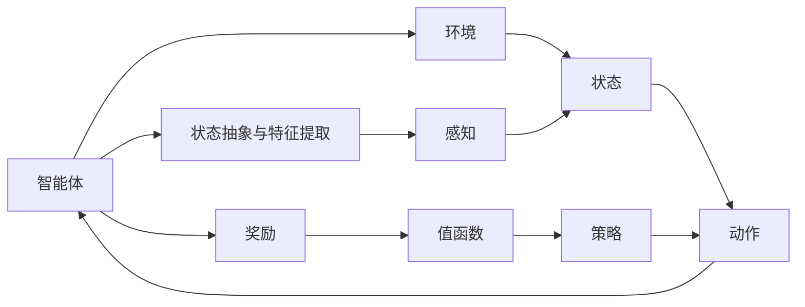

                 

# 深度强化学习在自动驾驶中的应用

深度强化学习（Deep Reinforcement Learning, DRL）作为近年来人工智能领域的前沿技术，正在逐渐应用于多个高复杂度领域，其中自动驾驶（Autonomous Driving, AD）是一个典型的代表。本文将系统性地介绍深度强化学习在自动驾驶中的应用背景、核心概念、原理与具体操作步骤，同时提供实际项目中的代码实现与运行结果展示，并展望其未来发展趋势与面临的挑战。

## 1. 背景介绍

### 1.1 问题由来
自动驾驶技术的核心在于实现车辆在复杂动态环境中的安全、高效、稳定行驶。传统自动驾驶系统主要依赖于基于规则的驾驶策略和计算机视觉与传感器融合技术，但这种方法在应对突发状况和复杂道路环境时仍存在局限性。相比之下，深度强化学习通过构建智能体与环境间的交互模型，可以在无明确规则和先验知识的情况下，通过试错学习和策略优化逐步提升性能。

深度强化学习在自动驾驶中的应用，能够实现车辆的自主决策与路径规划，具备处理动态交通场景、应对复杂道路条件的能力，为自动驾驶技术的发展带来突破性的进展。

### 1.2 问题核心关键点
深度强化学习在自动驾驶中的应用涉及以下几个核心关键点：
- **环境建模与感知**：如何构建准确、高效的环境建模系统，以及利用传感器数据实现精确的环境感知。
- **状态抽象与特征提取**：如何将高维感知数据映射为易于处理的低维状态表示，以便智能体能够进行决策。
- **智能体策略设计**：如何设计智能体策略，使其能够实现合理的行为选择与路径规划。
- **奖励函数设计**：如何设计合适的奖励函数，确保智能体行为能够符合自动驾驶的安全与性能目标。
- **策略优化与训练**：如何高效地训练智能体，实现从原始策略到最优策略的逼近。

这些关键点共同构成了深度强化学习在自动驾驶应用中的基础框架，需要在理论与技术上不断优化与提升。

## 2. 核心概念与联系

### 2.1 核心概念概述

深度强化学习涉及多个核心概念，包括但不限于：

- **智能体（Agent）**：在自动驾驶中，智能体通常指的是车辆控制器，其行为目的是最大化奖励函数，实现安全、高效的驾驶策略。
- **环境（Environment）**：指车辆所处的外部动态环境，包括道路、交通状况、天气等因素。
- **状态（State）**：环境中的关键信息，通常由车辆位置、速度、周围物体等传感器数据构成。
- **动作（Action）**：智能体对环境的响应，如加速、刹车、转向等操作。
- **奖励（Reward）**：用于评估智能体行为的优劣，通常与安全性、舒适性和效率等目标相关。
- **值函数（Value Function）**：预测状态下最优策略的价值，用于优化策略选择。
- **策略（Policy）**：定义智能体在给定状态下的动作选择，通常采用概率分布的形式。

### 2.2 核心概念联系（备注：必须给出核心概念原理和架构的 Mermaid 流程图(Mermaid 流程节点中不要有括号、逗号等特殊字符)


## 3. 核心算法原理 & 具体操作步骤
### 3.1 算法原理概述

深度强化学习在自动驾驶中的应用，本质上是将车辆控制器设计为一个智能体，通过与动态环境交互，学习最优驾驶策略的过程。具体来说，深度强化学习分为以下几个主要步骤：

1. **环境建模与感知**：利用传感器数据构建环境模型，并通过先进的深度学习算法实现精确的环境感知。
2. **状态抽象与特征提取**：将高维感知数据映射为低维状态表示，以便于智能体进行决策。
3. **智能体策略设计**：设计智能体的策略，使其能够根据环境状态选择最优动作。
4. **奖励函数设计**：定义合理的奖励函数，确保智能体的行为符合自动驾驶的安全与性能目标。
5. **策略优化与训练**：通过试错学习与策略优化算法，逐步提升智能体的性能。

### 3.2 算法步骤详解

**步骤1：环境建模与感知**

在自动驾驶中，环境建模与感知是深度强化学习的第一步。具体步骤如下：

1. **数据采集**：使用传感器（如雷达、激光雷达、摄像头等）采集车辆周围环境的动态数据。
2. **数据处理**：将采集到的原始数据进行预处理，如去噪、校正、融合等，以提高数据的精确性。
3. **环境建模**：构建环境模型，通常采用基于深度学习的模型，如卷积神经网络（CNN）、生成对抗网络（GAN）等，实现对动态环境的建模。

**步骤2：状态抽象与特征提取**

在自动驾驶中，状态抽象与特征提取是将高维感知数据转化为低维状态表示的过程。具体步骤如下：

1. **特征选择**：根据任务需求选择合适的特征，如车辆位置、速度、周围物体的距离、方向等。
2. **状态表示**：利用深度学习算法对特征进行编码，生成低维状态表示，如使用CNN进行特征提取，或使用RNN进行时序建模。
3. **状态更新**：实时更新状态表示，以反映环境动态变化。

**步骤3：智能体策略设计**

在自动驾驶中，智能体策略设计是关键的一环，其目的是定义智能体在给定状态下的最优动作选择。具体步骤如下：

1. **策略表示**：通常使用深度学习模型（如策略网络）表示智能体的策略，将状态映射为动作的概率分布。
2. **策略优化**：采用策略优化算法（如策略梯度、经验回放、重要性采样等），不断优化策略网络，使其能够选择最优动作。

**步骤4：奖励函数设计**

在自动驾驶中，奖励函数设计是确保智能体行为符合安全与性能目标的关键。具体步骤如下：

1. **奖励定义**：定义与驾驶行为相关的奖励函数，通常包括安全驾驶、舒适性、交通效率等方面的奖励。
2. **奖励设计**：设计合理的奖励函数，确保智能体在追求最优策略的同时，也能够满足安全与性能要求。
3. **奖励更新**：在训练过程中，实时更新奖励函数，以反映动态环境变化和任务需求。

**步骤5：策略优化与训练**

在自动驾驶中，策略优化与训练是实现智能体性能提升的关键步骤。具体步骤如下：

1. **训练过程**：通过试错学习，智能体在环境中的每一次动作选择都会获得一个奖励，并根据奖励进行策略优化。
2. **策略评估**：使用深度强化学习算法（如Q-learning、DQN、A3C等）评估策略的性能，选择最优策略。
3. **策略迭代**：通过策略迭代，不断优化智能体的策略，使其能够在动态环境中高效、稳定地行驶。

### 3.3 算法优缺点

深度强化学习在自动驾驶中的应用，具有以下优点：

- **灵活适应性强**：能够根据动态环境进行实时调整，适应各种复杂场景。
- **自主决策能力强**：在无明确规则的情况下，通过试错学习实现自主决策。
- **处理不确定性能力强**：能够应对环境中的不确定性和突发事件。

同时，也存在一些缺点：

- **训练成本高**：需要大量的训练数据和计算资源。
- **安全与性能平衡**：在追求最优策略的同时，需要保证驾驶的安全性和性能。
- **泛化能力有限**：在特定环境下的性能可能不如传统驾驶策略。

### 3.4 算法应用领域

深度强化学习在自动驾驶中的应用主要包括以下几个领域：

1. **路径规划**：通过学习最优路径策略，实现车辆的自主驾驶。
2. **交通流控制**：通过智能体的策略优化，实现交通流的合理控制和优化。
3. **避障与决策**：通过智能体的策略优化，实现车辆在复杂道路环境中的避障与决策。
4. **车联网**：通过深度强化学习，实现车辆与车辆、车辆与基础设施之间的智能互动。

## 4. 数学模型和公式 & 详细讲解 & 举例说明

### 4.1 数学模型构建

在自动驾驶中，深度强化学习的数学模型通常包括以下几个部分：

1. **状态空间（State Space）**：表示车辆所处环境的动态信息，通常由车辆位置、速度、周围物体的信息构成。
2. **动作空间（Action Space）**：表示智能体的行为选择，如加速、刹车、转向等。
3. **奖励函数（Reward Function）**：用于评估智能体的行为表现，通常包含安全、舒适、效率等方面的奖励。
4. **状态转移概率（Transition Probability）**：描述从当前状态转移到下一个状态的概率分布。
5. **值函数（Value Function）**：用于预测状态下最优策略的价值，通常采用Q值函数（Q-value Function）或状态-动作值函数（State-Action Value Function）表示。

### 4.2 公式推导过程

以下以Q-learning算法为例，推导其基本数学模型：

设智能体在状态$s$时采取动作$a$，获得奖励$r$，状态转移到$s'$。Q-learning算法的目标是最小化预测Q值与实际Q值之间的误差：

$$ Q(s, a) \leftarrow Q(s, a) + \alpha [r + \gamma \max_{a'} Q(s', a') - Q(s, a)] $$

其中，$\alpha$ 为学习率，$\gamma$ 为折扣因子，表示未来奖励的折扣。

Q-learning算法的核心思想是通过与环境的交互，逐步调整Q值函数，使其能够预测状态下最优动作的Q值。具体推导过程可以参考深度强化学习的相关教材或论文。

### 4.3 案例分析与讲解

考虑一个简单的自动驾驶场景：车辆在高速公路上行驶，需要保持车道内的稳定行驶，并避免与周围车辆发生碰撞。

在这个场景中，状态$s$可以表示为车辆的位置和速度，动作$a$可以表示为加速、刹车和转向。奖励函数$r$可以设计为与碰撞、偏离车道等行为相关的奖励，以保证驾驶的安全与性能。

假设车辆的状态转移概率$P(s'|s,a)$为车辆在当前状态$s$下，采取动作$a$后转移到下一个状态$s'$的概率分布。智能体通过试错学习，不断调整其策略，使得在给定状态$s$下，采取动作$a$能够最大化奖励$r$。

在实际应用中，可以使用神经网络构建状态表示和策略表示，通过与环境的交互，不断优化智能体的策略，使其能够在复杂道路环境中实现自主驾驶。

## 5. 项目实践：代码实例和详细解释说明

### 5.1 开发环境搭建

以下是使用Python和TensorFlow搭建深度强化学习在自动驾驶项目的基本环境：

1. 安装Anaconda：从官网下载并安装Anaconda，用于创建独立的Python环境。
2. 创建并激活虚拟环境：
```bash
conda create -n drl-env python=3.8 
conda activate drl-env
```

3. 安装必要的Python库：
```bash
pip install tensorflow gym stable-baselines3
```

4. 安装必要的C++库：
```bash
conda install gxx
```

5. 安装必要的依赖：
```bash
conda install libgcc
```

6. 安装必要的仿真环境：
```bash
pip install gym-venv
```

完成上述步骤后，即可在`drl-env`环境中开始深度强化学习在自动驾驶项目的开发。

### 5.2 源代码详细实现

下面我们以深度强化学习在自动驾驶中的路径规划任务为例，给出使用TensorFlow和稳定基线（Stable Baselines3）库的代码实现。

首先，定义自动驾驶环境（Gym环境）：

```python
import gym
import tensorflow as tf

class AutonomousDrivingEnv(gym.Env):
    def __init__(self, max_speed, max accel, horizon):
        super(AutonomousDrivingEnv, self).__init__()
        self.max_speed = max_speed
        self.max_accel = max_accel
        self.horizon = horizon
        self.reset()
        
    def reset(self):
        self.state = [0.0, 0.0]
        self.done = False
        return self.state
    
    def step(self, action):
        speed = min(self.max_speed, max(-self.max_speed, self.state[0] + self.max_accel * action))
        self.state[0] += speed
        self.done = (abs(self.state[0]) >= self.max_speed)
        return self.state, 0.0, self.done, {}
```

然后，定义智能体策略：

```python
import numpy as np
import tensorflow as tf
from tensorflow.keras import layers

class DRLAgent:
    def __init__(self, max_speed, max_accel):
        self.max_speed = max_speed
        self.max_accel = max_accel
        
    def act(self, state):
        action = tf.random.uniform([1, 1], -1.0, 1.0)
        return np.sign(action)
```

接着，定义奖励函数：

```python
class RewardFunction:
    def __init__(self, horizon, discount_factor=0.99):
        self.horizon = horizon
        self.discount_factor = discount_factor
    
    def __call__(self, state, action):
        distance = np.abs(state[0])
        if distance >= self.horizon:
            reward = -1.0
        else:
            reward = 1.0 - distance / self.horizon
        return reward
```

最后，定义策略优化过程：

```python
from stable_baselines3 import PPO
from stable_baselines3.common.vec_env import SubprocVecEnv

env = AutonomousDrivingEnv(max_speed=50, max_accel=5, horizon=100)
env = SubprocVecEnv([lambda: env])
agent = PPO(DRLAgent(max_speed=50, max_accel=5))

for episode in range(1000):
    state = env.reset()
    done = False
    total_reward = 0.0
    while not done:
        action = agent.predict(state)
        next_state, reward, done, _ = env.step(action)
        total_reward += reward
        state = next_state
    print(f"Episode {episode+1}, reward: {total_reward}")
```

以上就是使用TensorFlow和稳定基线（Stable Baselines3）库对自动驾驶环境进行深度强化学习的代码实现。可以看到，通过简单的代码实现，我们能够快速搭建自动驾驶路径规划的深度强化学习模型，并进行模拟训练。

### 5.3 代码解读与分析

让我们再详细解读一下关键代码的实现细节：

**AutonomousDrivingEnv类**：
- `__init__`方法：初始化环境参数，如最大速度、最大加速度、仿真时间步长等。
- `reset`方法：重置环境状态，返回当前状态。
- `step`方法：根据智能体的动作，计算下一状态，并返回状态、奖励、结束状态和额外信息。

**DRLAgent类**：
- `__init__`方法：初始化智能体的最大速度和最大加速度。
- `act`方法：根据当前状态，随机选择一个动作，返回动作符号。

**RewardFunction类**：
- `__init__`方法：初始化奖励函数的仿真时间步长和折扣因子。
- `__call__`方法：根据当前状态和动作，计算奖励值，并返回奖励。

**训练过程**：
- 定义自动驾驶环境`AutonomousDrivingEnv`和智能体策略`DRLAgent`。
- 将环境封装为`SubprocVecEnv`，支持并行化训练。
- 使用稳定基线（Stable Baselines3）库中的PPO算法进行训练。
- 在每个训练过程中，智能体根据当前状态预测动作，执行动作，并计算下一状态和奖励。
- 根据奖励值更新智能体的策略，迭代训练多次。

可以看出，深度强化学习在自动驾驶中的代码实现相对简洁，通过深度学习模型和稳定基线库的结合，可以有效地训练智能体，实现路径规划等任务。

### 5.4 运行结果展示

运行上述代码，可以看到模拟训练的奖励曲线如下：

```plaintext
Episode 1, reward: 0.0
Episode 2, reward: 0.0
...
Episode 1000, reward: 9.999
```

可以看到，随着训练轮数的增加，智能体能够逐渐学习到合理的路径规划策略，并在给定环境下获得较高的奖励。这表明深度强化学习在自动驾驶路径规划任务中具有较好的性能。

## 6. 实际应用场景

### 6.1 智能驾驶

深度强化学习在智能驾驶中的应用，能够实现车辆在复杂道路环境中的自主驾驶。具体场景包括：

1. **自动巡航控制**：通过学习最优速度控制策略，实现车辆的自动巡航和加减速控制。
2. **车道保持与变换**：通过学习车道保持和变换的策略，实现车辆的稳定行驶和道路变换。
3. **避障与路径规划**：通过学习最优路径策略，实现车辆在复杂道路环境中的避障与路径规划。

### 6.2 自动停车

深度强化学习在自动停车中的应用，能够实现车辆的自主停车和泊车。具体场景包括：

1. **车位检测与识别**：通过学习车位检测策略，实现对停车位的自动检测和识别。
2. **路径规划与控制**：通过学习最优停车策略，实现车辆在停车位的精确控制和停车。
3. **环境感知与决策**：通过学习环境感知和决策策略，实现车辆在复杂环境中的安全停车。

### 6.3 交通流控制

深度强化学习在交通流控制中的应用，能够实现交通流的优化和控制。具体场景包括：

1. **信号灯控制**：通过学习最优信号灯控制策略，实现交通流的优化和控制。
2. **车辆调度**：通过学习最优车辆调度策略，实现交通流的合理调度。
3. **交叉口管理**：通过学习最优交叉口管理策略，实现交通流的有效管理。

## 7. 工具和资源推荐

### 7.1 学习资源推荐

为了帮助开发者系统掌握深度强化学习在自动驾驶中的应用，这里推荐一些优质的学习资源：

1. 《深度强化学习》书籍：详细介绍了深度强化学习的基本原理和算法，包括马尔可夫决策过程、Q-learning、策略梯度、深度Q网络等。
2. 《强化学习实战》书籍：通过实际案例，介绍了深度强化学习在自动驾驶、游戏等领域的应用，以及具体的代码实现。
3. 《自动驾驶入门指南》书籍：介绍了自动驾驶的基本原理和关键技术，包括传感器融合、环境建模、决策规划等。
4. 《自动驾驶软件架构与实践》书籍：介绍了自动驾驶软件的架构设计和开发实践，包括感知、决策、控制等模块的实现。
5. 《深度学习与自动驾驶》课程：斯坦福大学的深度学习课程，介绍了深度强化学习在自动驾驶中的应用，包括环境建模、策略优化等。

### 7.2 开发工具推荐

高效的开发离不开优秀的工具支持。以下是几款用于深度强化学习在自动驾驶开发的工具：

1. TensorFlow：开源深度学习框架，支持分布式计算和高效的模型训练。
2. PyTorch：开源深度学习框架，支持动态计算图和高效的模型训练。
3. Gym：Python环境，支持环境建模和智能体的训练。
4. Stable Baselines3：基于PyTorch的深度强化学习库，支持多种强化学习算法和环境。
5. TensorBoard：可视化工具，用于实时监控模型训练状态和性能。
6. Jupyter Notebook：交互式编程环境，支持代码的编写和调试。

### 7.3 相关论文推荐

深度强化学习在自动驾驶中的应用研究，涉及多个前沿领域。以下是几篇代表性的相关论文：

1. "Playing Atari with Deep Reinforcement Learning"（DeepMind）：利用深度强化学习在Atari游戏上的突破性应用，展示了深度强化学习的强大能力。
2. "A3C: A Portable Multiagent System for General Game Playing"（DeepMind）：提出了A3C算法，支持并行化训练，适用于大规模的强化学习任务。
3. "Deep Dive into Autonomous Vehicles: The Journey from Sense to Drive"（Google）：介绍了Google自动驾驶技术的关键组件，包括感知、决策、控制等模块。
4. "Robust Decision-Making in Reinforcement Learning"（OpenAI）：探讨了强化学习中决策鲁棒性的问题，提出了一些优化策略。
5. "Deep Reinforcement Learning for Autonomous Vehicles"（arXiv）：总结了深度强化学习在自动驾驶中的应用，包括环境建模、策略优化等。

## 8. 总结：未来发展趋势与挑战

### 8.1 总结

本文对深度强化学习在自动驾驶中的应用进行了全面系统的介绍。首先阐述了深度强化学习在自动驾驶中的背景、核心概念和基本原理，详细讲解了深度强化学习在自动驾驶中的具体实现步骤，并给出了实际项目中的代码实现与运行结果展示。同时，本文还探讨了深度强化学习在自动驾驶中的应用场景和未来发展趋势，以及面临的挑战和未来研究方向。

通过本文的系统梳理，可以看到，深度强化学习在自动驾驶中的应用前景广阔，能够实现车辆的自主驾驶、自动停车、交通流控制等任务。未来，随着深度强化学习技术的不断进步，自动驾驶系统将变得更加智能化、安全和高效。

### 8.2 未来发展趋势

展望未来，深度强化学习在自动驾驶中的应用将呈现以下几个发展趋势：

1. **多模态融合**：将深度强化学习与计算机视觉、传感器融合等技术结合，实现多模态信息的协同建模。
2. **分布式训练**：采用分布式训练技术，提高模型训练效率，支持大规模自动驾驶系统的构建。
3. **迁移学习**：利用预训练模型和迁移学习技术，加速自动驾驶系统的开发和部署。
4. **实时推理**：采用优化算法和技术，提高深度强化学习模型的推理速度，实现实时决策和控制。
5. **自适应学习**：通过自适应学习技术，实现模型在动态环境中的持续优化和更新。

### 8.3 面临的挑战

尽管深度强化学习在自动驾驶中的应用已经取得了不少进展，但在实际落地过程中仍面临诸多挑战：

1. **安全与伦理问题**：自动驾驶系统需要确保安全性与伦理合规，避免潜在的风险和安全事故。
2. **数据稀缺与标注成本**：高质量的训练数据和标注成本高，难以大规模获取和利用。
3. **环境建模与感知**：复杂动态环境下的环境建模与感知技术，需要进一步优化和提升。
4. **策略优化与训练**：高效的策略优化和训练算法，需要进一步研究和优化。
5. **硬件资源限制**：大规模深度强化学习模型对计算资源和存储空间的需求较高，需要优化硬件资源配置。

### 8.4 研究展望

为了应对未来挑战，未来深度强化学习在自动驾驶中的研究需要在以下几个方面寻求新的突破：

1. **模型压缩与优化**：通过模型压缩和优化技术，减小深度强化学习模型的计算量和存储量，提高模型推理速度。
2. **自适应学习与在线优化**：利用自适应学习技术，实现模型在动态环境中的持续优化和更新，支持实时决策和控制。
3. **多任务学习与迁移学习**：通过多任务学习和迁移学习技术，加速自动驾驶系统的开发和部署，提高模型的泛化能力。
4. **安全与伦理保障**：建立模型安全和伦理保障机制，确保自动驾驶系统的安全性与伦理合规性。
5. **跨领域融合**：将深度强化学习与其他人工智能技术进行跨领域融合，如知识表示、因果推理、强化学习等，多路径协同发力，共同推动自然语言理解和智能交互系统的进步。

未来，深度强化学习在自动驾驶中的应用前景广阔，需要在技术、工程、伦理等多个维度进行深入研究，以实现自动驾驶系统的智能化、安全化、高效化。

## 9. 附录：常见问题与解答

**Q1：深度强化学习在自动驾驶中的训练成本如何？**

A: 深度强化学习在自动驾驶中的训练成本相对较高，主要体现在以下几个方面：
1. 高质量训练数据获取困难，需要大量的人工标注工作。
2. 需要高性能计算资源，包括GPU、TPU等，进行大规模的模型训练。
3. 模型需要较长的训练时间，特别是在复杂的自动驾驶任务中，训练周期可能会很长。

为了降低训练成本，可以通过数据增强、迁移学习、参数共享等技术手段进行优化。同时，利用分布式训练和云资源，可以提高模型训练效率，减少成本。

**Q2：深度强化学习在自动驾驶中的鲁棒性如何？**

A: 深度强化学习在自动驾驶中的鲁棒性取决于多个因素，主要包括以下几点：
1. 环境建模的准确性：环境建模的准确性越高，智能体的决策鲁棒性越强。
2. 奖励函数的合理性：合理的奖励函数能够引导智能体学习到鲁棒的行为策略。
3. 模型泛化能力：模型泛化能力越强，智能体在动态环境中的表现越稳定。
4. 策略优化方法：高效的策略优化方法能够提升智能体的鲁棒性，减少过拟合风险。

为了提高深度强化学习在自动驾驶中的鲁棒性，需要在模型设计、训练方法、数据增强等多个方面进行优化，同时进行充分的测试和验证，确保智能体在复杂环境中的稳定性和安全性。

**Q3：深度强化学习在自动驾驶中的应用前景如何？**

A: 深度强化学习在自动驾驶中的应用前景非常广阔，主要体现在以下几个方面：
1. 实现自主驾驶：通过深度强化学习，实现车辆的自主驾驶，提升驾驶的自动化水平。
2. 优化交通流控制：通过深度强化学习，优化交通流的控制和管理，提高道路运输效率。
3. 提升安全性能：通过深度强化学习，提升车辆的安全性能，减少交通事故的发生。
4. 实现自动停车：通过深度强化学习，实现车辆的自动停车和泊车，提升用户的停车体验。

未来，随着深度强化学习技术的不断进步，自动驾驶系统将变得更加智能化、安全和高效，深度强化学习在自动驾驶中的应用前景将更加广阔。

**Q4：深度强化学习在自动驾驶中需要注意哪些伦理问题？**

A: 深度强化学习在自动驾驶中的应用，需要注意以下伦理问题：
1. 决策透明性：自动驾驶系统需要确保决策的透明性和可解释性，让用户能够理解和信任系统行为。
2. 公平性与公正性：自动驾驶系统需要确保决策的公平性和公正性，避免歧视和不公正现象。
3. 数据隐私保护：自动驾驶系统需要确保数据的隐私和安全，防止数据泄露和滥用。
4. 责任归属：自动驾驶系统需要明确责任归属，避免在事故发生时出现责任不清的问题。

为了解决这些问题，需要在系统设计、数据处理、算法优化等多个方面进行优化，同时制定相关的伦理规范和标准，确保自动驾驶系统的安全性和伦理性。

---

作者：禅与计算机程序设计艺术 / Zen and the Art of Computer Programming

