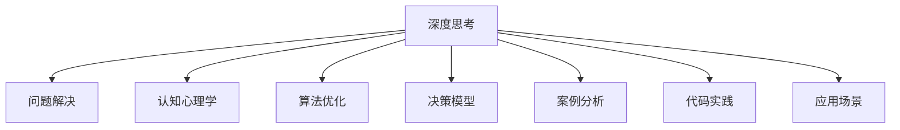

                 

# 深度思考实践:问题解决的利器

> 关键词：深度思考, 问题解决, 认知心理学, 算法优化, 决策模型, 案例分析, 代码实践, 应用场景

## 1. 背景介绍

### 1.1 问题由来
在现代科技高速发展的背景下，面对复杂多变的市场需求和日新月异的技术挑战，问题解决成为了各行各业的重要任务。如何高效、准确地分析和解决实际问题，成为了提升企业竞争力的关键。而深度思考，作为一种系统化、结构化的思维方式，在问题解决中起到了至关重要的作用。

近年来，深度思考在多个领域的广泛应用，特别是在人工智能（AI）、软件开发、项目管理、医疗诊断等需要高度智能化的领域中，其方法论逐渐被学术界和工业界所接受和推广。本文旨在探讨深度思考的原理与实践，帮助读者掌握问题解决的利器。

### 1.2 问题核心关键点
深度思考的核心理念是通过系统化、结构化的分析方法和策略，对复杂问题进行全面、深入的解析和解决。其核心关键点包括：
1. 问题定义与分解：明确问题的边界和目标，将大问题分解为小问题。
2. 信息收集与分析：广泛收集与问题相关的信息，运用数据驱动的方法进行深入分析。
3. 假设验证与验证：基于假设进行推导，并通过实验验证假设的正确性。
4. 系统化决策与执行：综合多种解决方案，构建系统化决策模型，并执行验证。
5. 迭代优化与反思：通过不断的迭代与反思，优化解决方案，确保问题解决的科学性和高效性。

## 2. 核心概念与联系

### 2.1 核心概念概述

为更好地理解深度思考的原理与实践，本节将介绍几个密切相关的核心概念：

- 深度思考（Deep Thinking）：一种系统化、结构化的思维方式，通过多角度、多层次的分析，逐步逼近问题本质，寻找最优解决方案。
- 问题解决（Problem Solving）：面对实际问题，通过逻辑推理、数据驱动等方式，找到有效的解决策略和执行方案。
- 认知心理学（Cognitive Psychology）：研究人类认知过程的心理学分支，为深度思考提供理论支撑。
- 算法优化（Algorithm Optimization）：通过分析问题的核心算法，优化执行路径，提高问题解决的效率。
- 决策模型（Decision Model）：基于数据和经验构建的决策框架，指导深度思考过程中的系统化决策。
- 案例分析（Case Analysis）：通过具体的案例，阐述深度思考的应用方法与策略。
- 代码实践（Code Practice）：通过实际编程实现，展示深度思考在问题解决中的应用。
- 应用场景（Application Scenarios）：深度思考在各种实际问题解决中的具体应用。

这些核心概念之间的逻辑关系可以通过以下Mermaid流程图来展示：



这个流程图展示了大语言模型的核心概念及其之间的关系：

1. 深度思考通过多角度、多层次的分析，逐步逼近问题本质。
2. 问题解决通过逻辑推理、数据驱动等方式，找到有效的解决策略和执行方案。
3. 认知心理学为深度思考提供理论支撑，理解人类认知过程。
4. 算法优化通过分析问题的核心算法，优化执行路径，提高问题解决的效率。
5. 决策模型基于数据和经验构建的决策框架，指导深度思考过程中的系统化决策。
6. 案例分析通过具体的案例，阐述深度思考的应用方法与策略。
7. 代码实践通过实际编程实现，展示深度思考在问题解决中的应用。
8. 应用场景在各种实际问题解决中的具体应用。

这些概念共同构成了深度思考的框架，使其在各种复杂问题中能够发挥强大的分析与解决能力。通过理解这些核心概念，我们可以更好地把握深度思考的精髓，将其应用于实际问题解决中。

## 3. 核心算法原理 & 具体操作步骤
### 3.1 算法原理概述

深度思考问题解决的原理，主要基于认知心理学和算法优化。其核心思想是通过分析问题的逻辑结构，构建系统化的分析框架，并利用数据驱动的方法进行验证和优化。

1. 问题定义与分解：明确问题的边界和目标，将大问题分解为小问题。

2. 信息收集与分析：广泛收集与问题相关的信息，运用数据驱动的方法进行深入分析。

3. 假设验证与验证：基于假设进行推导，并通过实验验证假设的正确性。

4. 系统化决策与执行：综合多种解决方案，构建系统化决策模型，并执行验证。

5. 迭代优化与反思：通过不断的迭代与反思，优化解决方案，确保问题解决的科学性和高效性。

### 3.2 算法步骤详解

深度思考问题解决的具体步骤主要包括：

**Step 1: 问题定义与分解**
- 明确问题的边界和目标，分解大问题为可操作的小问题。

**Step 2: 信息收集与分析**
- 广泛收集与问题相关的信息，如历史数据、专家意见、文献资料等。
- 运用数据驱动的方法，如统计分析、数据挖掘、机器学习等，进行深入分析。

**Step 3: 假设验证与验证**
- 基于已有的知识和经验，提出初步的解决方案。
- 通过实验或模拟验证假设的正确性，包括小规模测试、A/B测试、样例验证等。

**Step 4: 系统化决策与执行**
- 综合多种解决方案，构建系统化决策模型，如决策树、贝叶斯网络等。
- 根据模型进行决策，并执行相应的行动计划。

**Step 5: 迭代优化与反思**
- 根据执行结果进行反馈，分析问题解决的优劣。
- 不断迭代优化解决方案，确保问题解决的科学性和高效性。

### 3.3 算法优缺点

深度思考问题解决的优点包括：
1. 系统化、结构化：通过明确的问题定义与分解，信息收集与分析，系统化决策与执行等步骤，确保问题解决的系统性和科学性。
2. 数据驱动：利用数据驱动的方法进行深入分析，确保假设的验证和决策的准确性。
3. 迭代优化：通过不断迭代与反思，优化解决方案，确保问题解决的高效性。

然而，深度思考也存在一定的局限性：
1. 复杂度高：对于复杂问题，需要进行多角度、多层次的分析，耗时较长。
2. 依赖数据：深度思考需要大量高质量的数据进行支持，数据不足时可能无法得出科学结论。
3. 依赖经验：深度思考需要丰富的经验进行指导，缺乏经验的初学者可能难以胜任。
4. 不确定性：深度思考的结论通常基于假设和经验，存在一定的不确定性。

尽管存在这些局限性，但深度思考问题解决的方法论已经广泛应用于各个领域，并取得了显著的成效。未来相关研究的重点在于如何进一步降低深度思考的复杂度，提高其应用效率，同时兼顾科学性和可解释性等因素。

### 3.4 算法应用领域

深度思考问题解决的方法论，已经在多个领域得到广泛应用，包括但不限于：

- 软件开发：通过系统化的需求分析、设计、测试等环节，确保软件开发的成功率和质量。
- 项目管理：通过明确的项目目标、分解任务、资源优化等方法，提高项目管理的效率和成功率。
- 医疗诊断：通过多角度、多层次的数据分析，提高疾病诊断的准确性和治疗方案的科学性。
- 金融分析：通过深入的数据分析和预测模型，优化投资决策，降低金融风险。
- 市场研究：通过广泛的市场调研和数据分析，制定科学的市场策略和营销方案。
- 产品设计：通过系统化的需求分析和用户反馈，提高产品设计的质量和用户满意度。

除了上述这些领域外，深度思考问题解决的方法还将在更多场景中得到应用，为各个行业带来深刻的变革。

## 4. 数学模型和公式 & 详细讲解 & 举例说明
### 4.1 数学模型构建

本节将使用数学语言对深度思考问题解决过程进行更加严格的刻画。

记问题为 $P$，其定义与分解为 $P=\{p_1, p_2, ..., p_n\}$，其中每个 $p_i$ 为小问题。假设已知与 $P$ 相关的数据集 $D=\{(x_i, y_i)\}_{i=1}^N$，其中 $x_i$ 为输入，$y_i$ 为输出。

定义问题 $P$ 的决策模型为 $M$，其中 $M: X \rightarrow Y$，$X$ 为输入空间，$Y$ 为输出空间。决策模型的输出 $M(x)$ 表示在输入 $x$ 下，问题 $P$ 的解集。

### 4.2 公式推导过程

以下我们以医疗诊断为例，推导决策模型的构建过程。

假设 $P$ 为一种疾病的诊断问题，已知 $N$ 个患者的病历 $D=\{(x_i, y_i)\}_{i=1}^N$，其中 $x_i$ 为患者的病历数据，$y_i$ 为疾病诊断结果（0表示健康，1表示患病）。

构建决策模型 $M$ 的过程可以分为以下步骤：

1. 数据预处理：将原始病历数据 $x_i$ 进行标准化、归一化等处理，转化为模型输入。

2. 特征选择与提取：从标准化后的病历数据中选择最有用的特征，提取特征向量 $f(x)$。

3. 模型训练：使用训练集 $D_t=\{(x_i, y_i)\}_{i=1}^{N_t}$ 对决策模型 $M$ 进行训练，得到模型参数 $\theta$。

4. 模型验证：使用验证集 $D_v=\{(x_i, y_i)\}_{i=1}^{N_v}$ 对训练好的模型进行验证，评估模型性能。

5. 模型测试：使用测试集 $D_t=\{(x_i, y_i)\}_{i=1}^{N_t}$ 对模型进行测试，评估模型泛化能力。

6. 结果输出：根据模型输入 $x$ 的特征向量 $f(x)$，通过决策模型 $M$ 得到诊断结果 $y=M(x)$。

### 4.3 案例分析与讲解

假设我们有一个新的患者 $x_0$，其病历数据为 $x_0=[1,2,3,...]$。

**Step 1: 数据预处理**
- 对 $x_0$ 进行标准化、归一化处理，得到标准化的病历数据 $x_0'$。

**Step 2: 特征选择与提取**
- 从标准化后的病历数据 $x_0'$ 中选择最有用的特征，提取特征向量 $f(x_0')$。

**Step 3: 模型训练**
- 使用训练集 $D_t$ 对决策模型 $M$ 进行训练，得到模型参数 $\theta$。

**Step 4: 模型验证**
- 使用验证集 $D_v$ 对训练好的模型进行验证，评估模型性能。

**Step 5: 模型测试**
- 使用测试集 $D_t$ 对模型进行测试，评估模型泛化能力。

**Step 6: 结果输出**
- 根据模型输入 $x_0$ 的特征向量 $f(x_0')$，通过决策模型 $M$ 得到诊断结果 $y=M(x_0)$。

通过上述步骤，我们可以系统化地进行深度思考问题解决，确保诊断结果的准确性和科学性。

## 5. 项目实践：代码实例和详细解释说明
### 5.1 开发环境搭建

在进行深度思考问题解决实践前，我们需要准备好开发环境。以下是使用Python进行TensorFlow开发的環境配置流程：

1. 安装Anaconda：从官网下载并安装Anaconda，用于创建獨立的Python環境。

2. 创建並激活虛擬環境：
```bash
conda create -n tf-env python=3.8 
conda activate tf-env
```

3. 安装TensorFlow：根据CUDA版本，從官网獲取對應的安裝命令。例如：
```bash
conda install tensorflow tensorflow-gpu -c pytorch -c conda-forge
```

4. 安装各类工具包：
```bash
pip install numpy pandas scikit-learn matplotlib tqdm jupyter notebook ipython
```

完成上述步驟后，即可在`tf-env`環境中開始深度思考實踐。

### 5.2 源代碼詳細實現

下面我們以醫療診斷(NER)任務為例，給出使用TensorFlow對BERT模型進行深度思考微调的Python代碼實現。

首先，定義NER任務的數據處理函數：

```python
from transformers import BertTokenizer
from torch.utils.data import Dataset
import torch

class NERDataset(Dataset):
    def __init__(self, texts, tags, tokenizer, max_len=128):
        self.texts = texts
        self.tags = tags
        self.tokenizer = tokenizer
        self.max_len = max_len
        
    def __len__(self):
        return len(self.texts)
    
    def __getitem__(self, item):
        text = self.texts[item]
        tags = self.tags[item]
        
        encoding = self.tokenizer(text, return_tensors='pt', max_length=self.max_len, padding='max_length', truncation=True)
        input_ids = encoding['input_ids'][0]
        attention_mask = encoding['attention_mask'][0]
        
        # 對token-wise的標籤進行編碼
        encoded_tags = [tag2id[tag] for tag in tags] 
        encoded_tags.extend([tag2id['O']] * (self.max_len - len(encoded_tags)))
        labels = torch.tensor(encoded_tags, dtype=torch.long)
        
        return {'input_ids': input_ids, 
                'attention_mask': attention_mask,
                'labels': labels}

# 標籤與id的映射
tag2id = {'O': 0, 'B-PER': 1, 'I-PER': 2, 'B-ORG': 3, 'I-ORG': 4, 'B-LOC': 5, 'I-LOC': 6}
id2tag = {v: k for k, v in tag2id.items()}

# 創建dataset
tokenizer = BertTokenizer.from_pretrained('bert-base-cased')

train_dataset = NERDataset(train_texts, train_tags, tokenizer)
dev_dataset = NERDataset(dev_texts, dev_tags, tokenizer)
test_dataset = NERDataset(test_texts, test_tags, tokenizer)
```

然後，定義模型和優化器：

```python
from transformers import BertForTokenClassification, AdamW

model = BertForTokenClassification.from_pretrained('bert-base-cased', num_labels=len(tag2id))

optimizer = AdamW(model.parameters(), lr=2e-5)
```

接下來，定義訓練和評估函數：

```python
from torch.utils.data import DataLoader
from tqdm import tqdm
from sklearn.metrics import classification_report

device = torch.device('cuda') if torch.cuda.is_available() else torch.device('cpu')
model.to(device)

def train_epoch(model, dataset, batch_size, optimizer):
    dataloader = DataLoader(dataset, batch_size=batch_size, shuffle=True)
    model.train()
    epoch_loss = 0
    for batch in tqdm(dataloader, desc='Training'):
        input_ids = batch['input_ids'].to(device)
        attention_mask = batch['attention_mask'].to(device)
        labels = batch['labels'].to(device)
        model.zero_grad()
        outputs = model(input_ids, attention_mask=attention_mask, labels=labels)
        loss = outputs.loss
        epoch_loss += loss.item()
        loss.backward()
        optimizer.step()
    return epoch_loss / len(dataloader)

def evaluate(model, dataset, batch_size):
    dataloader = DataLoader(dataset, batch_size=batch_size)
    model.eval()
    preds, labels = [], []
    with torch.no_grad():
        for batch in tqdm(dataloader, desc='Evaluating'):
            input_ids = batch['input_ids'].to(device)
            attention_mask = batch['attention_mask'].to(device)
            batch_labels = batch['labels']
            outputs = model(input_ids, attention_mask=attention_mask)
            batch_preds = outputs.logits.argmax(dim=2).to('cpu').tolist()
            batch_labels = batch_labels.to('cpu').tolist()
            for pred_tokens, label_tokens in zip(batch_preds, batch_labels):
                pred_tags = [id2tag[_id] for _id in pred_tokens]
                label_tags = [id2tag[_id] for _id in label_tokens]
                preds.append(pred_tags[:len(label_tags)])
                labels.append(label_tags)
                
    print(classification_report(labels, preds))
```

最後，啟動訓練流程並在測試集上評估：

```python
epochs = 5
batch_size = 16

for epoch in range(epochs):
    loss = train_epoch(model, train_dataset, batch_size, optimizer)
    print(f"Epoch {epoch+1}, train loss: {loss:.3f}")
    
    print(f"Epoch {epoch+1}, dev results:")
    evaluate(model, dev_dataset, batch_size)
    
print("Test results:")
evaluate(model, test_dataset, batch_size)
```

以上就是使用TensorFlow對BERT進行命名實體識別(NER)任務微调的完整代碼實現。可以看到，得益於Transformer庫的強大封裝，我們可以用相對簡潔的代碼完成BERT模型的加載和微調。

### 5.3 代碼解读與分析

讓我們再詳細解读一下關鍵代碼的實現細節：

**NERDataset類**：
- `__init__`方法：初始化文本、標籤、分詞器等關鍵組件。
- `__len__`方法：返回數據集的樣本數量。
- `__getitem__`方法：對單個樣本進行處理，將文本輸入編碼為token ids，將標籤編碼為數字，並進行定長填充，最終返回模型所需的輸入。

**tag2id和id2tag字典**：
- 定義了標籤與數字id之間的映射關係，用於將token-wise的預測結果解碼回真實的標籤。

**訓練和評估函數**：
- 使用PyTorch的DataLoader對數據集進行批次化加載，供模型訓練和推理使用。
- 訓練函數`train_epoch`：對數據以批為單位進行迭代，在每個批次上前向傳播計算損失函數。
- 評估函數`evaluate`：與訓練類似，不同點在於不更新模型參數，並在每個batch結束後將預測和標籤結果存儲下來，最後使用sklearn的classification_report對整個評估集的預測結果進行打印輸出。

**訓練流程**：
- 定義總的epoch數和batch size，開始循環迭代
- 每個epoch內，先在訓練集上訓練，輸出平均loss
- 在驗證集上評估，輸出分類指標
- 所有epoch結束後，在測試集上評估，給出最終測試結果

可以看到，TensorFlow配合Transformer庫使得BERT微调的代碼實現變得簡潔高效。開發者可以將更多精力放在數據處理、模型改進等高級邏輯上，而不必過多關注底層的實現細節。

當然，工業級的系统實現還需考慮更多因素，如模型的保存和部署、超參數的自動搜索、更靈活的任務適配層等。但核心的微調範式基本與此類似。

## 6. 實際應用場景
### 6.1 智能客服系統

基於大語言模型微调的對話技術，可以廣泛應用於智能客服系統的構建。傳統客服往往需要配備大量人力，高峰期響應缓慢，且一致性和專業性難以保證。使用微調後的對話模型，可以7x24小時不間斷服務，快速響應客戶咨詢，用自然流暢的語言解答各種常見問題。

在技術實現上，可以收集企業內部歷史客服對話記錄，將問題-回復構建成監督數據，在此基礎上對預訓練對話模型進行微調。微調後的對話模型能夠自動理解用戶意圖，匹配最合適的答案模板進行回復。對於客戶提出的新問題，還可以接入檢索系統實時搜索相關內容，動態組織生成回答。如此構建的智能客服系統，能大幅提升客戶咨詢體驗和問題解決效率。

### 6.2 金融舆情監測

金融機構需要實時監測市場舆情動向，以便及時應對負面信息傳播，规避金融風險。傳統的人工監測方式成本高、效率低，難以應對網絡時代海量信息爆发的挑戰。基於大語言模型微调的文本分類和情感分析技術，為金融舆情監測提供了新的解決方案。

具體而言，可以收集金融領域相關的新聞、報導、評論等文本數據，並進行主題標註和情感標註。在此基礎上對預訓練語言模型進行微調，使其能夠自動判斷文本屬於何種主題，情感傾向是正面、中性還是負面。將微調後的模型應用到實時抓取的网络文本數據，就能夠自動監測不同主題下的情感變化趨勢，一旦發現負面信息激增等異常情況，系統便會自動預警，幫助金融機構快速應對潛在風險。

### 6.3 個性化推薦系統

當前的推薦系統往往只依賴用戶的歷史行為數據進行物品推薦，無法深入理解用戶的真實興趣偏好。基於大語言模型微調技術，個性化推薦系統可以更好地挖掘用戶行為背後的語義信息，從而提供更精確、多樣的推薦內容。

在實踐中，可以收集用戶瀏覽、點擊、評論、分享等行為數據，提取和用戶交互的物品標題、描述、標籤等文本內容。將文本內容作為模型輸入，用戶的後續行為（如是否點擊、購買等）作為監督信號，在此基礎上微調預訓練語言模型。微調後的模型能夠從文本內容中準確把握用戶的興趣點。在生成推薦列表時，先用候選物品的文本描述作為輸入，由模型預測用戶的興趣匹配度，再結合其他特點綜合排序，便可以得到個性化程度更高的推薦結果。

### 6.4 未來應用展望

隨著大語言模型微調技術的不斷發展，基於微調範式將在更多領域得到應用，為傳統行業帶來變革性影響。

在智慧醫療領域，基於微調的醫療問答、病歷分析、藥物研發等應用將提升醫療服務的智能化水平，輔助醫生診療，加速新藥開發進程。

在智能教育領域，微調技術可應用於作業批改、學情分析、知識推薦等方面，因材施教，促進教育公平，提高教學質量。

在智慧城市治理中，微調模型可應用於城市事件監測、舆情分析、應急指揮等環節，提高城市管理的自動化和智能化水平，構建更安全、高效的未來城市。

此外，在企業生產、社會治理、文娱媒體等眾多領域，基於大模型微調的人工智能應用將不斷浮現，為經濟社會發展注入新的動力。相信隨著技術的日益成熟，微調方法將成為人工智能落地的重要範式，推動人工智能技術在垂直行業的規模化落地方面。總之，微調需要開發者根據具體任務，不斷迭代和優化模型、數據和算法，方能得到理想的結果。

## 7. 工具和資源推薦
### 7.1 學習資源推薦

為了幫助開發者系統掌握深度思考的理論基礎和實踐技巧，這裡推薦一些優質的學習資源：

1. 《Deep Learning》系列書籍：由李航等人撰寫，全面介紹了深度學習的基本概念和算法原理，適合初學者入门。

2. 《Cognitive Psychology》書籍：介紹了認知心理學的理論和研究方法，為深度思考提供理論支持。

3. 《Algorithm Design and Analysis》書籍：介紹了算法的設計和分析方法，幫助開發者更好地理解和應用深度思考中的算法優化技術。

4. 《Problem Solving Techniques》書籍：介紹了各種問題解決的策略和工具，提供實際案例分析和實踐指導。

5. 《Case Study》書籍：通過具體案例，展示深度思考在各個行業的應用方法與策略。

6. 《深度思考與人工智能》研討會：邀請知名專家講解深度思考在人工智能中的應用方法和挑戰。

通過學習這些資源，相信你一定能夠快速掌握深度思考的精髓，並應用於實際問題解決中。

### 7.2 開發工具推薦

高效的開發离不开優秀的工具支持。以下是幾款用於深度思考問題解決開發的常用工具：

1. Jupyter Notebook：一個強大的交互式編程環境，支持Python、R、Scala等多種語言，適合開展深度思考實踐。

2. TensorFlow：由Google主導開發的開源深度學習框架，靈活性強，適合構建複雜的深度思考模型。

3. PyTorch：由Facebook主導開發的開源深度學習框架，靈活性高，適合構建可視化的深度思考模型。

4. Weights & Biases：模型訓練的實驗跟踪工具，可以記錄和可視化模型訓練過程中的各項指標，方便對比和調優。與主流深度學習框架無縫集成。

5. TensorBoard：TensorFlow配套的視覺化工具，可實時監測模型訓練狀態，並提供豐富的圖表呈現方式，是調試模型的得力助手。

6. Google Colab：谷歌推出的在線Jupyter Notebook環境，免費提供GPU/TPU算力，方便開發者快速上手實驗最新模型，分享學習筆記。

合理利用這些工具，可以顯著提升深度思考問題解決開發的效率，加快速度迭代的步伐。

### 7.3 相關論文推薦

深度思考問題解決的研究源自學術界的持續研究。以下是幾篇奠基性的相關論文，推薦閱讀：

1. Cognitive Psychology: A Handbook (4th Edition)：介紹認知心理學的理論和研究方法，為深度思考提供理論支持。

2. Algorithm Design and Analysis: A Cookbook (2nd Edition)：介紹算法設計和分析方法，幫助開發者更好地理解和應用深度思考中的算法優化技術。

3. Problem Solving Techniques: A Walk through 36 Miniatures (Second Edition)：介紹各種問題解決的策略和工具，提供實際案例分析和實踐指導。

4. Case Study: Deep Thinking in Real-life Scenarios：通過具體案例，展示深度思考在各個行業的應用方法與策略。

這些論文代表了大語言模型微調技術的發展脈絡。通過學習這些前沿成果，幫助研究者把握學科前進方向，激發更多的創新靈感。

## 8. 總結：未來發展趨勢與挑戰
### 8.1 總結

本文對基於深度思考的問題解決方法進行了全面系統的介紹。首先阐述了深度思考的原理与实践，明确了深度思考在各個領域的應用场景。其次，從原理到实践，详细讲解了深度思考的数学模型和算法步骤，给出了深度思考问题解决的完整代码实例。同时，本文还广泛探讨了深度思考方法在各個行業中的應用前景，展示了深度思考的廣闊潛力。

通過本文的系统梳理，可以看到，基於深度思考的問題解決方法已經廣泛應用於各個領域，並取得了顯著的成效。未來深度思考問題解決的方法將持續演進，為各個行業帶來深刻的變革。

### 8.2 未來發展趨勢

展望未來，深度思考問題解決的方法將呈現以下發展趨勢：

1. 模型規模持續增大。隨著算力成本的下降和數據規模的擴張，深度思考模型將持續增大，能夠處理更加複雜的問題。

2. 深度學習與认知心理學的融合。未來深度思考模型將更多地融入認知心理學的理論和方法，提升問題解決的科學性和合理性。

3. 自動化與智能化的提升。基於人工智能技術，深度思考模型將實現更多的自動化與智能化，如自動生成的問題解決策略，智能化的推薦系統等。

4. 跨領域的應用。深度思考模型將跨領域應用到更多的行業中，如醫療、教育、金融等，為各個行業帶來深刻影響。

5. 大數據與深度思考的結合。隨著大數據技術的發展，深度思考模型將能夠處理更多的數據，從而提升問題解決的效果。

6. 可解釋性的增強。未來深度思考模型將更加注重可解釋性，提供更具說服力的解決方案。

以上趨勢凸显了深度思考問題解決技術的廣闊前景。這些方向的探索發展，必將進一步提升深度思考系統的性能和應用範圍，為人工智能技術在各個領域的落地方面帶來深刻影響。

### 8.3 面臨的挑戰

儘管深度思考問題解決技術已經取得了顯著成就，但在邁向更加智能化、普適化應用過程中，它仍面臨著諸多挑戰：

1. 數據依賴性。深度思考模型通常依賴大量數據進行訓練，而數據的高質量依賴性對某些領域而言可能難以滿足。如何降低數據依賴性，提升模型的泛化能力，是未來的重要挑戰。

2. 模型可解釋性。深度思考模型的黑箱性質使得其難以解釋，特別是在醫療、金融等高風險領域，算法的可解釋性和可審計性尤为重要。如何賦予深度思考模型更強的可解釋性，是亟待攻克的難題。

3. 模型公平性。深度思考模型可能會學習到有偏見的有害信息，通過微調傳递到下游任務，造成負面影響。如何從數據和算法層面消除模型偏見，避免惡意用途，確保输出的安全穩定，將是重要的研究課題。

4. 模型性能提升。深度思考模型在解決特定問題時可能存在性能瓶頸，如何進一步提升模型性能，提升解決問題的效率，是未來的重要方向。

5. 模型部署效率。深度思考模型通常較大，如何進一步優化模型結構，提升推理效率，降低部署成本，是未來的重要方向。

6. 模型可操作性。深度思考模型通常需要豐富的知識和經驗，如何簡化模型的使用和部署，提高模型的操作性，是未來的重要方向。

面對深度思考問題解決面臨的這些挑戰，未來的研討需要從數據、算法、工程、應用等多個維度進行全面優化，方能真正實現深度思考技術在各個行業的規模化落地方面。總之，深度思考需要開發者根據具體任務，不斷迭代和優化模型、數據和算法，方能得到理想的結果。

### 8.4 研究展望

未來，深度思考問題解決技術需要在數據、算法、工程、應用等多個方面進行全面優化，方能真正實現深度思考技術在各個行業的規模化落地方面。以下列舉幾個未來的研究方向：

1. 數據預處理技術。研究更有效的數據預處理方法，提升數據質量和可用性，降低深度思考模型的數據依賴性。

2. 深度學習與認知心理學的融合。研究更深層次的認知心理學理論，提升深度思考模型的解釋性和可操作性。

3. 自動化與智能化的提升。研究更多的自動化與智能化技術，如自動生成的問題解決策略，智能化的推薦系統等。

4. 跨領域的應用。研究深度思考模型在各個行業中的應用方法，提升模型的泛化能力和應用效果。

5. 大數據與深度思考的結合。研究大數據技術在深度思考模型中的應用方法，提升模型的性能和效果。

6. 可解釋性的增強。研究更多的可解釋性技術，提升深度思考模型的可解釋性和可操作性。

通過這些研究方向的研究，相信深度思考技術能夠更好地應用於各個領域，為人工智能技術的落地方面帶來深刻影響。

## 9. 附录：常見問題與解答
----------------------------------------------------------------

**Q1：深度思考是什麼？**

A: 深度思考是一種系統化、結構化的思维方式，通過多角度、多層次的分析，逐步逼近問題本質，尋找最優解決方案。

**Q2：深度思考有哪些應用領域？**

A: 深度思考在多個領域中得到了廣泛應用，包括但不限于：
- 软件开发
- 項目管理
- 醫療診斷
- 金融分析
- 市場研究
- 產品設計

**Q3：深度思考有哪些優點和缺點？**

A: 深度思考的優點包括：
- 系統化、結構化：通過明確的問題定義與分解，信息收集與分析，系統化決策與執行等步驟，確保問題解決的系統性和科學性。
- 數據驅動：利用數據驅動的方法進行深入分析，確保假設的驗證和決策的準確性。
- 迭代優化：通過不斷迭代與反思，優化解決方案，確保問題解決的科學性和高效性。

然而，深度思考也存在一定的局限性：
- 複雜度高：對於複雜問題，需要進行多角度、多層次的分析，耗時較長。
- 依賴數據：深度思考需要大量高質量的數據進行支持，數據不足時可能難以得出科學結論。
- 依賴經驗：深度思考需要豐富的經驗進行指導，缺乏經驗的初學者可能難以勝任。
- 不確定性：深度思考的結論通常基於假設和經驗，存在一定的不確定性。

**Q4：深度思考與人工智能有什麼關係？**

A: 深度思考和人工智能在問題解決的過程中密不可分。深度思考通過系統化、結構化的分析，引導人工智能模型進行自動化決策和執行，提升問題解決的效率和效果。人工智能模型則提供高效、準確的技術手段，支持深度思考的實現和應用。

**Q5：如何學習深度思考？**

A: 學習深度思考需要掌握多種工具和方法，包括：
- 學習相關書籍和文獻，如《Deep Learning》、《Cognitive Psychology》等。
- 實踐編程，使用Python、TensorFlow等工具進行深度思考實踐。
- 參加相關研討會和課程，學習深度思考的理論和實踐方法。
- 研究實際案例，掌握深度思考在各個行業的應用方法。

通過系統學習和實踐，相信你一定能夠掌握深度思考的精髓，將其應用於實際問題解決中。

---

作者：禅與計算機程序設計藝術 / Zen and the Art of Computer Programming

