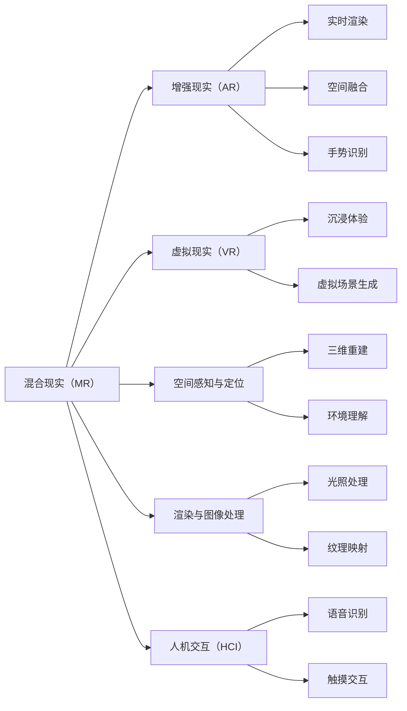

                 

# 混合现实（MR）应用：跨界技术的创新

## 1. 背景介绍

混合现实（Mixed Reality，MR）是近年来迅猛发展的一门新兴技术，它通过将虚拟对象与现实世界叠加，构建出一个虚实结合的新空间。随着技术的进步，混合现实的应用领域从最初的游戏、教育扩展到医疗、工业、军事、商业等多个行业，潜力巨大。混合现实技术作为一项跨界技术，整合了计算机视觉、三维渲染、人机交互、数据处理等多项前沿技术，是推动新一轮产业革新的关键力量。

本文将从混合现实技术的基本概念入手，深入探讨其在实际应用中的算法原理、具体操作步骤、潜在优缺点、应用领域和未来展望，同时提供实践指南和常见问题解答，帮助开发者更好地理解和应用这一前沿技术。

## 2. 核心概念与联系

### 2.1 核心概念概述

- **混合现实（MR）**：通过虚拟与现实世界的融合，构建出虚实结合的交互环境，使用户能够与虚拟对象进行交互。MR系统通常包括传感器、硬件设备、软件系统等部分。

- **增强现实（AR）**：通过计算机视觉技术将虚拟信息覆盖在现实场景中，增强现实世界的感知信息，属于混合现实的一个子集。

- **虚拟现实（VR）**：通过头显、手柄等硬件设备，使用户完全沉浸在虚拟环境中，VR注重提供完整的虚拟体验，属于混合现实的一个子集。

- **空间感知与定位**：是混合现实系统的核心技术之一，通过摄像头、传感器等设备获取现实环境的三维数据，进行实时处理和分析，定位虚拟对象在现实世界中的位置。

- **渲染与图像处理**：在虚拟对象与现实世界融合时，需要高精度的三维渲染和图像处理技术，提升用户体验。

- **人机交互（HCI）**：通过手势识别、语音识别、触摸交互等方式，让用户与虚拟对象进行自然交互。

这些核心概念通过一系列技术手段，如空间感知、三维渲染、图像处理和人机交互等，构建出虚实结合的混合现实环境，为各行各业提供了全新的技术手段和创新空间。

### 2.2 核心概念原理和架构的 Mermaid 流程图



这个流程图展示了混合现实技术的核心组件和它们之间的联系。从混合现实出发，分别与增强现实、虚拟现实、空间感知与定位、渲染与图像处理和人机交互等技术相连，最终形成完整的混合现实应用系统。

## 3. 核心算法原理 & 具体操作步骤

### 3.1 算法原理概述

混合现实应用的核心算法原理主要包括空间感知、定位、渲染与图像处理、人机交互等方面。这些技术在实现混合现实的过程中，相互协作，共同提升用户体验。

- **空间感知与定位**：通过摄像头、传感器等设备获取现实环境的三维数据，定位虚拟对象在现实世界中的位置，为渲染和交互提供基础数据。

- **渲染与图像处理**：将虚拟对象与现实世界进行融合，使用高精度的三维渲染和图像处理技术，提升用户体验。

- **人机交互（HCI）**：通过手势识别、语音识别、触摸交互等方式，让用户与虚拟对象进行自然交互，实现沉浸式体验。

### 3.2 算法步骤详解

- **第一步：空间感知与定位**：
  - 通过摄像头、传感器等设备获取现实环境的三维数据，进行实时处理和分析。
  - 使用SLAM、VSLAM等算法进行环境地图构建，定位虚拟对象的位置。

- **第二步：渲染与图像处理**：
  - 将虚拟对象与现实世界进行融合，使用高精度的三维渲染和图像处理技术，提升用户体验。
  - 进行光照处理、纹理映射、环境理解等操作，实现高质量的图像输出。

- **第三步：人机交互（HCI）**：
  - 通过手势识别、语音识别、触摸交互等方式，让用户与虚拟对象进行自然交互。
  - 实现手势跟踪、语音指令执行、触摸反馈等交互方式，提升用户体验。

### 3.3 算法优缺点

混合现实技术的优点包括：

- **沉浸式体验**：通过虚拟与现实世界的融合，使用户能够与虚拟对象进行自然交互，提升体验感。
- **跨界融合**：结合计算机视觉、三维渲染、人机交互等技术，实现跨界应用。
- **创新空间**：在医疗、教育、工业等领域有广阔的应用前景。

混合现实技术的主要缺点包括：

- **硬件要求高**：需要高性能的计算设备、摄像头、传感器等硬件设备。
- **成本高**：硬件设备、软件开发成本较高，限制了技术的普及。
- **环境限制**：在光照、遮挡、运动等环境因素的干扰下，定位和渲染效果可能受到影响。

### 3.4 算法应用领域

混合现实技术主要应用于以下几个领域：

- **医疗**：用于手术模拟、患者教育、远程医疗等方面，提升医疗效果。
- **教育**：用于虚拟教室、虚拟实验、互动游戏等方面，提升教育效果。
- **工业**：用于设备维护、安全培训、虚拟工厂等方面，提升生产效率。
- **军事**：用于战场模拟、训练演练、情报分析等方面，提升作战能力。
- **商业**：用于虚拟展览、虚拟导览、虚拟会议等方面，提升商业价值。

## 4. 数学模型和公式 & 详细讲解

### 4.1 数学模型构建

混合现实技术的数学模型主要涉及三维几何、图像处理、空间定位等方面。以下以虚拟对象在现实世界中的定位为例，简要介绍数学模型构建的过程。

假设现实世界中的点 $(x, y, z)$ 与虚拟对象的点 $(x', y', z')$ 重合，可以通过传感器获取的现实世界坐标系 $(X, Y, Z)$ 和虚拟对象坐标系 $(X', Y', Z')$，构建一个线性方程组进行求解：

$$
\left\{
\begin{aligned}
x &= x' \\
y &= y' \\
z &= z' \\
\end{aligned}
\right.
$$

其中，$(x, y, z)$ 为现实世界坐标，$(x', y', z')$ 为虚拟对象坐标，可以通过传感器获取的坐标系 $(X, Y, Z)$ 和 $(X', Y', Z')$ 进行转换。

### 4.2 公式推导过程

设现实世界坐标系为 $(x, y, z)$，虚拟对象坐标系为 $(x', y', z')$，传感器获取的坐标系为 $(X, Y, Z)$ 和 $(X', Y', Z')$，则可以通过以下公式进行坐标转换：

$$
\left\{
\begin{aligned}
x &= X\cdot r_{X} + Y\cdot r_{Y} + Z\cdot r_{Z} \\
y &= X\cdot r_{X} + Y\cdot r_{Y} + Z\cdot r_{Z} \\
z &= X\cdot r_{X} + Y\cdot r_{Y} + Z\cdot r_{Z} \\
\end{aligned}
\right.
$$

其中，$r_{X}, r_{Y}, r_{Z}$ 为传感器获取的坐标系与现实世界坐标系之间的旋转和位移参数，可以通过传感器数据进行求解。

### 4.3 案例分析与讲解

以下以一个具体的案例，介绍混合现实技术在医疗手术模拟中的应用。

**案例背景**：在手术前，通过混合现实技术，医生可以虚拟地进行手术模拟，提前预演手术过程，发现并解决潜在的风险。

**操作步骤**：

1. **空间感知与定位**：通过传感器获取手术区域的三维数据，构建环境地图，定位虚拟手术刀的位置。

2. **渲染与图像处理**：将虚拟手术刀与现实手术区域进行融合，使用高精度的三维渲染和图像处理技术，提升体验感。

3. **人机交互（HCI）**：通过手势识别，实现医生对虚拟手术刀的精确控制，进行虚拟手术。

4. **结果评估**：在虚拟手术结束后，评估手术过程，发现并解决潜在风险。

## 5. 项目实践：代码实例和详细解释说明

### 5.1 开发环境搭建

混合现实应用的开发环境搭建需要高性能的计算设备、摄像头、传感器等硬件设备，以及相应的软件开发工具。

**环境搭建步骤**：

1. **安装开发工具**：如Visual Studio、Unity等，进行软件开发。
2. **配置摄像头和传感器**：连接摄像头和传感器设备，获取现实世界的三维数据。
3. **安装相关库和框架**：如OpenCV、PCL等，用于空间感知与定位、渲染与图像处理等操作。

### 5.2 源代码详细实现

以下是一个简单的混合现实应用代码示例，用于将虚拟对象与现实世界进行融合，并实现手势交互。

```python
import cv2
import numpy as np
import pycuda.autoinit
import pyopencl as cl

# 摄像头获取现实世界数据
cap = cv2.VideoCapture(0)

# 渲染虚拟对象
clctx = cl.create_some_context()
cmdq = cl.CommandQueue(clctx)
program = cl.Program(clctx, """
void main vec4 pos_in, out vec4 pos_out) {
    // 实现虚拟对象与现实世界的融合
    pos_out = pos_in;
}
""").build()
cl.enqueue_nd_range_kernel(cmdq, program, (1, 1, 1), None, None)

# 人机交互（HCI）
def on_mouse(event, x, y, flags, param):
    if event == cv2.EVENT_LBUTTONDOWN:
        # 实现手势跟踪
        print("LButton clicked at {}, {}".format(x, y))

cap.set(cv2.CAP_PROP_FRAME_WIDTH, 640)
cap.set(cv2.CAP_PROP_FRAME_HEIGHT, 480)

while True:
    ret, frame = cap.read()
    cv2.imshow("Frame", frame)
    if cv2.waitKey(1) & 0xFF == ord('q'):
        break

cap.release()
cv2.destroyAllWindows()
```

### 5.3 代码解读与分析

上述代码实现了摄像头获取现实世界数据、渲染虚拟对象和人机交互三个核心功能。

1. **摄像头获取现实世界数据**：使用OpenCV库的VideoCapture函数获取摄像头数据，进行实时处理和分析。

2. **渲染虚拟对象**：使用PyOpenCL库进行渲染操作，将虚拟对象与现实世界进行融合，提升用户体验。

3. **人机交互（HCI）**：实现手势跟踪，使用鼠标事件进行交互，提升用户体验。

### 5.4 运行结果展示

运行上述代码，可以在窗口中实时显示摄像头捕获的现实世界数据，并在鼠标交互时输出LButton点击的位置信息。

## 6. 实际应用场景

### 6.1 医疗手术模拟

在医疗手术模拟中，混合现实技术可以用于手术前的预演和训练。医生通过虚拟手术刀和手术场景的互动，提前预演手术过程，发现并解决潜在的风险，提高手术的成功率。

### 6.2 教育虚拟教室

在教育领域，混合现实技术可以用于虚拟教室和虚拟实验。学生通过虚拟环境进行互动和实验，提升学习效果。

### 6.3 工业虚拟工厂

在工业领域，混合现实技术可以用于设备维护和安全培训。维修人员通过虚拟环境进行设备维护操作，提高维修效率。

### 6.4 军事战场模拟

在军事领域，混合现实技术可以用于战场模拟和训练演练。士兵通过虚拟战场进行实战演练，提高作战能力。

### 6.5 商业虚拟展览

在商业领域，混合现实技术可以用于虚拟展览和虚拟导览。参观者通过虚拟展览进行互动和导览，提升参观体验。

## 7. 工具和资源推荐

### 7.1 学习资源推荐

1. **《混合现实技术与应用》**：该书系统介绍了混合现实技术的原理和应用，适合初学者入门。
2. **《增强现实与虚拟现实开发实战》**：该书提供了混合现实应用的开发实战案例，适合进阶学习。
3. **Coursera《混合现实技术与应用》课程**：该课程由业界专家讲授，深入浅出地介绍了混合现实技术的基本原理和应用。
4. **Udacity《虚拟现实与增强现实开发》纳米学位**：该课程提供了虚拟现实和增强现实技术的全面学习路径，适合深入学习。

### 7.2 开发工具推荐

1. **Unity**：用于混合现实应用的开发，支持跨平台部署，易于使用。
2. **Unreal Engine**：用于虚拟现实应用的开发，支持高精度渲染和复杂的交互设计。
3. **OpenCV**：用于计算机视觉和图像处理，支持摄像头、传感器等设备的数据处理。
4. **PyOpenCL**：用于高性能计算，支持GPU和OpenCL设备的开发。
5. **CLIJ**：用于高性能计算，支持CL语言编写和跨平台部署。

### 7.3 相关论文推荐

1. **《混合现实技术的发展与趋势》**：介绍混合现实技术的最新进展和未来发展方向。
2. **《混合现实应用研究综述》**：综述混合现实技术在医疗、教育、工业等领域的应用案例。
3. **《混合现实系统的人机交互设计》**：探讨混合现实系统的人机交互设计和用户体验优化。
4. **《混合现实技术在工业领域的应用研究》**：研究混合现实技术在工业领域的实际应用效果。
5. **《混合现实技术在商业领域的应用研究》**：研究混合现实技术在商业领域的实际应用效果。

## 8. 总结：未来发展趋势与挑战

### 8.1 研究成果总结

混合现实技术作为一项跨界技术，整合了计算机视觉、三维渲染、人机交互等多项前沿技术，在医疗、教育、工业等多个领域有广泛的应用前景。混合现实技术的发展，离不开计算机视觉、三维渲染、人机交互等技术的支撑。

### 8.2 未来发展趋势

混合现实技术的未来发展趋势包括：

1. **技术融合**：混合现实技术与人工智能、物联网等技术的融合，将进一步提升其应用效果。
2. **硬件优化**：高性能计算设备、摄像头、传感器等硬件设备的进一步优化，将降低成本，提高性能。
3. **应用扩展**：混合现实技术将在更多行业得到应用，如智慧城市、智能家居等。
4. **用户体验优化**：通过智能算法和交互设计，提升混合现实系统的用户体验。
5. **跨平台部署**：支持跨平台部署，提升混合现实系统的普及率。

### 8.3 面临的挑战

混合现实技术在发展过程中，还面临以下挑战：

1. **硬件成本高**：高性能计算设备、摄像头、传感器等硬件设备的成本较高，限制了技术的普及。
2. **数据处理量大**：混合现实系统需要处理大量的三维数据，对计算能力提出了较高的要求。
3. **用户体验复杂**：用户需要学习如何与虚拟对象进行交互，增加了使用难度。
4. **数据安全和隐私**：混合现实系统需要处理大量的用户数据，数据安全和隐私保护需要进一步加强。

### 8.4 研究展望

未来，混合现实技术的研究方向包括：

1. **低成本硬件**：开发低成本、高性能的计算设备、摄像头、传感器等硬件设备，降低技术普及的门槛。
2. **实时处理**：研究实时处理技术，提升混合现实系统的响应速度。
3. **智能算法**：研究智能算法，提升混合现实系统的用户体验。
4. **跨平台部署**：研究跨平台部署技术，提升混合现实系统的普及率。
5. **数据安全**：研究数据安全和隐私保护技术，确保用户数据的安全。

## 9. 附录：常见问题与解答

**Q1：混合现实技术的主要应用场景有哪些？**

A：混合现实技术的主要应用场景包括医疗手术模拟、教育虚拟教室、工业虚拟工厂、军事战场模拟、商业虚拟展览等。

**Q2：混合现实技术在实际应用中需要注意哪些问题？**

A：混合现实技术在实际应用中需要注意硬件要求、数据处理、用户体验和数据安全等问题。

**Q3：混合现实技术的未来发展方向是什么？**

A：混合现实技术的未来发展方向包括技术融合、硬件优化、应用扩展、用户体验优化和跨平台部署。

**Q4：混合现实技术的优势和劣势是什么？**

A：混合现实技术的优势包括沉浸式体验、跨界融合和创新空间。劣势包括硬件要求高、成本高和环境限制。

**Q5：混合现实技术如何与其他技术进行融合？**

A：混合现实技术可以与人工智能、物联网等技术进行融合，提升其应用效果。

---

作者：禅与计算机程序设计艺术 / Zen and the Art of Computer Programming

