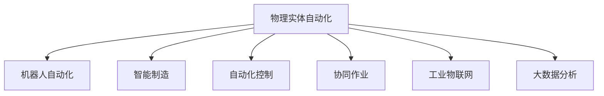

                 

# 物理实体自动化的技术突破

> 关键词：物理实体自动化, 机器人自动化, 智能制造, 自动化控制, 协同作业, 工业物联网, 大数据分析

## 1. 背景介绍

### 1.1 问题由来
随着工业4.0的推进，智能化、自动化的制造模式已经逐渐成为主流。传统的人工生产方式在效率、精度、安全性等方面都难以满足现代工业的需求。基于此，物理实体的自动化成为了实现智能化制造的关键。物理实体指的是工厂内的大型机械设备和人员，传统的人工监控和操作方式已经无法满足生产效率和安全性要求，智能化、自动化的物理实体系统能够大大提升生产效率和安全性，降低生产成本，提高产品质量。

### 1.2 问题核心关键点
物理实体自动化的核心在于如何构建一个智能化的物理实体系统，并使其具备高效、安全和稳定地执行生产任务的能力。传统上，物理实体的自动化主要依赖于PLC（可编程逻辑控制器）、DCS（分布式控制系统）等硬件设备，但这些系统通常存在安装调试复杂、维护成本高、灵活性不足等问题。近年来，随着计算机视觉、机器人技术、物联网等技术的进步，物理实体的自动化已经进入了新的发展阶段。

## 2. 核心概念与联系

### 2.1 核心概念概述

为更好地理解物理实体自动化的核心技术，本节将介绍几个密切相关的核心概念：

- 物理实体自动化(Physical Entity Automation)：通过应用先进的计算机技术，如计算机视觉、机器人技术、物联网等，实现物理实体（如工厂内的机械设备和人员）的智能化、自动化，提升生产效率和安全性。
- 机器人自动化(Robotics Automation)：利用机器人系统代替人工进行生产线上的重复性、高精度、高危险性作业。
- 智能制造(Intelligent Manufacturing)：通过应用云计算、大数据、人工智能等技术，实现生产过程的智能化管理，提升生产效率和质量。
- 自动化控制(Automation Control)：通过应用自动控制系统，如PLC、DCS，实现对生产过程的自动化控制和监测。
- 协同作业(Collaborative Operations)：通过应用智能化的协同平台，实现人机交互，提升生产协调性和效率。
- 工业物联网(Industrial Internet of Things, IIoT)：通过应用物联网技术，实现工厂内设备和系统的互联互通，提升生产过程的智能化水平。
- 大数据分析(Big Data Analysis)：通过应用大数据分析技术，实现生产过程的优化和预测，提升生产效率和质量。

这些核心概念之间的逻辑关系可以通过以下Mermaid流程图来展示：



这个流程图展示了大物理实体自动化的核心概念及其之间的关系：

1. 物理实体自动化是整个系统的目标，通过应用其他核心概念来提升其智能化和自动化水平。
2. 机器人自动化通过利用机器人技术，实现生产任务的自动化执行。
3. 智能制造通过应用云计算、大数据等技术，实现生产过程的智能化管理。
4. 自动化控制通过应用自动控制系统，实现生产过程的自动化控制和监测。
5. 协同作业通过应用智能化的协同平台，实现人机交互，提升生产协调性和效率。
6. 工业物联网通过应用物联网技术，实现工厂内设备和系统的互联互通。
7. 大数据分析通过应用大数据分析技术，实现生产过程的优化和预测。

这些概念共同构成了物理实体自动化的实现框架，使其能够在各种场景下发挥强大的智能化和自动化能力。通过理解这些核心概念，我们可以更好地把握物理实体自动化的工作原理和优化方向。

## 3. 核心算法原理 & 具体操作步骤
### 3.1 算法原理概述

物理实体自动化的算法原理主要基于机器学习、计算机视觉、机器人技术、工业物联网等技术，其核心思想是通过构建一个智能化的物理实体系统，实现生产任务的自动化执行。具体来说，算法主要包括以下几个关键步骤：

1. 数据采集与处理：通过传感器、摄像头等设备采集物理实体的运行状态和环境信息，并对其进行预处理和清洗。
2. 状态监测与预测：利用机器学习算法，对物理实体的运行状态和环境信息进行监测和预测，判断是否存在异常情况。
3. 自动化控制：根据状态监测与预测的结果，应用自动化控制系统，对物理实体进行自动控制和操作。
4. 协同作业：利用智能化的协同平台，实现人机交互，提升生产协调性和效率。
5. 大数据分析：对生产过程中的数据进行收集、分析和可视化，提升生产效率和质量。

### 3.2 算法步骤详解

物理实体自动化的算法步骤可以概括为以下几个环节：

**Step 1: 数据采集与处理**

在物理实体自动化的第一步，需要采集和处理物理实体的运行状态和环境信息。这通常包括：

- 传感器数据：通过安装各种传感器，如温度传感器、压力传感器、振动传感器等，采集物理实体的运行状态信息。
- 视频数据：通过安装摄像头，采集物理实体的运行视频数据，用于计算机视觉分析。
- 其他数据：通过安装其他传感器或设备，采集物理实体的其他环境信息，如光照强度、湿度等。

采集到的数据需要进行预处理和清洗，去除噪声和异常数据，保证数据的质量和可靠性。常用的数据处理方法包括：

- 数据滤波：去除数据中的噪声和异常值，确保数据的准确性和可靠性。
- 数据归一化：将不同来源的数据转换为统一格式和单位，便于后续处理和分析。
- 数据压缩：对数据进行压缩，减少存储空间占用，提高数据传输效率。

**Step 2: 状态监测与预测**

物理实体的状态监测与预测是物理实体自动化的核心步骤，通过应用机器学习算法，对物理实体的运行状态和环境信息进行监测和预测，及时发现异常情况。常用的状态监测与预测算法包括：

- 时序预测：利用时间序列预测算法，如ARIMA、LSTM等，对物理实体的运行状态进行预测。
- 异常检测：利用异常检测算法，如孤立森林、自编码器等，对物理实体的运行状态进行异常检测。
- 健康监测：利用健康监测算法，对物理实体的运行状态进行健康评估，判断设备是否存在潜在故障。

**Step 3: 自动化控制**

在物理实体自动化的第三步，需要对物理实体进行自动化控制和操作，以提升生产效率和安全性。常用的自动化控制算法包括：

- 控制策略：通过设计控制策略，实现对物理实体的自动化控制。常用的控制策略包括PID控制、模糊控制、模型预测控制等。
- 路径规划：通过应用路径规划算法，实现物理实体的最优路径选择。常用的路径规划算法包括A*、Dijkstra等。
- 机器人控制：通过应用机器人控制系统，实现对机器人的自动控制和操作。常用的机器人控制系统包括ROS、MoveIt等。

**Step 4: 协同作业**

物理实体自动化的第四步是实现人机协同作业，提升生产协调性和效率。常用的协同作业算法包括：

- 人机交互：通过应用人机交互技术，实现人机协同作业。常用的技术包括语音识别、手势识别等。
- 协同调度：通过应用协同调度算法，实现人机协同调度。常用的算法包括任务调度、资源调度等。
- 协同优化：通过应用协同优化算法，实现人机协同优化。常用的算法包括遗传算法、粒子群算法等。

**Step 5: 大数据分析**

物理实体自动化的第五步是大数据分析，对生产过程中的数据进行收集、分析和可视化，提升生产效率和质量。常用的大数据分析算法包括：

- 数据挖掘：通过应用数据挖掘算法，从数据中提取有价值的信息，如生产效率、质量问题等。常用的算法包括关联规则挖掘、聚类分析等。
- 可视化：通过应用数据可视化技术，将数据呈现为图表、图形等形式，便于操作人员理解和分析。常用的技术包括Tableau、Power BI等。
- 预测分析：通过应用预测分析算法，对生产过程进行预测和优化。常用的算法包括回归分析、时间序列分析等。

### 3.3 算法优缺点

物理实体自动化的算法具有以下优点：

1. 提高生产效率：通过自动化控制和协同作业，实现物理实体的智能化、自动化，大幅提高生产效率和质量。
2. 降低生产成本：通过应用自动化控制和协同作业，减少人工操作和维护成本，降低生产成本。
3. 提升安全性：通过应用自动化控制和异常检测，提升生产安全性，减少事故发生率。
4. 实现柔性生产：通过应用路径规划和协同调度，实现生产系统的灵活调整和优化。

物理实体自动化的算法也存在一定的局限性：

1. 依赖硬件设备：物理实体自动化的算法需要依赖各种传感器、摄像头等硬件设备，硬件成本较高。
2. 数据质量要求高：物理实体自动化的算法需要高质量的数据，对数据采集和处理的要求较高。
3. 算法复杂度高：物理实体自动化的算法需要应用多种算法，算法复杂度高，实现难度较大。
4. 系统维护成本高：物理实体自动化的系统需要定期维护和更新，维护成本较高。

尽管存在这些局限性，但物理实体自动化的算法已经在制造业中得到了广泛应用，并逐渐成为实现智能化制造的重要手段。未来相关研究的重点在于如何进一步降低系统维护成本，提高数据质量，简化算法实现，从而提升物理实体自动化的性能和应用范围。

### 3.4 算法应用领域

物理实体自动化的算法已经广泛应用于以下几个领域：

1. 工厂自动化：在工厂内，应用物理实体自动化的算法实现设备的自动化控制和操作，提升生产效率和安全性。
2. 机器人自动化：利用机器人系统代替人工进行生产线上的重复性、高精度、高危险性作业。
3. 智能制造：通过应用云计算、大数据等技术，实现生产过程的智能化管理，提升生产效率和质量。
4. 自动化控制：通过应用自动控制系统，如PLC、DCS，实现生产过程的自动化控制和监测。
5. 协同作业：利用智能化的协同平台，实现人机交互，提升生产协调性和效率。
6. 工业物联网：通过应用物联网技术，实现工厂内设备和系统的互联互通，提升生产过程的智能化水平。
7. 大数据分析：对生产过程中的数据进行收集、分析和可视化，提升生产效率和质量。

除了这些应用领域外，物理实体自动化的算法还在物流、农业、医疗等众多领域中得到了应用，为各个行业带来了生产效率的提升和成本的降低。随着技术的发展，物理实体自动化的应用领域将会更加广泛，进一步推动各行各业的智能化转型。

## 4. 数学模型和公式 & 详细讲解 & 举例说明
### 4.1 数学模型构建

本节将使用数学语言对物理实体自动化的核心算法进行更加严格的刻画。

设物理实体自动化的系统为 $S$，包括传感器、摄像头、控制系统等。设系统的输入为 $x$，输出为 $y$。物理实体自动化的目标是通过应用机器学习算法，构建一个模型 $f$，使得 $y=f(x)$。模型的输入 $x$ 包括物理实体的运行状态和环境信息，输出 $y$ 包括物理实体的控制策略和操作路径。

假设物理实体的运行状态和环境信息为 $X=\{x_1, x_2, ..., x_n\}$，控制策略和操作路径为 $Y=\{y_1, y_2, ..., y_m\}$。物理实体自动化的目标是通过应用机器学习算法，构建一个模型 $f$，使得 $y=f(x)$。模型的输入 $x$ 包括物理实体的运行状态和环境信息，输出 $y$ 包括物理实体的控制策略和操作路径。

### 4.2 公式推导过程

以下是物理实体自动化算法中常用的几个数学公式及其推导过程：

**时序预测公式：**

设物理实体的运行状态为 $x_t$，预测下一时刻的运行状态为 $x_{t+1}$，则时序预测的公式为：

$$
x_{t+1}=f(x_t)
$$

其中 $f$ 为预测模型。常用的预测模型包括ARIMA、LSTM等。

**异常检测公式：**

设物理实体的运行状态为 $x_t$，检测异常情况的阈值为 $\tau$，则异常检测的公式为：

$$
D(x_t) = \left\{
\begin{aligned}
1, & \quad x_t \geq \tau \\
0, & \quad x_t < \tau
\end{aligned}
\right.
$$

其中 $D(x_t)$ 为异常检测函数，$x_t$ 为物理实体的运行状态。

**控制策略公式：**

设物理实体的运行状态为 $x_t$，控制策略为 $y_t$，则控制策略的公式为：

$$
y_t = g(x_t)
$$

其中 $g$ 为控制策略模型。常用的控制策略模型包括PID控制、模糊控制、模型预测控制等。

**路径规划公式：**

设物理实体的起点为 $A$，终点为 $B$，路径规划的目标是找到最短路径，则路径规划的公式为：

$$
\min \limits_{x_t} L(x_t)
$$

其中 $L(x_t)$ 为路径长度，$x_t$ 为路径节点。常用的路径规划算法包括A*、Dijkstra等。

### 4.3 案例分析与讲解

以物流自动化仓储系统为例，展示物理实体自动化的应用：

**数据采集与处理：**

在物流自动化仓储系统中，需要采集和处理物流设备的位置、速度、库存量等数据。常用的传感器包括RFID、二维码、摄像头等。采集到的数据需要进行预处理和清洗，去除噪声和异常数据，保证数据的质量和可靠性。

**状态监测与预测：**

物流自动化仓储系统需要应用机器学习算法，对物流设备的位置、速度、库存量等数据进行监测和预测，及时发现异常情况。常用的状态监测与预测算法包括时序预测、异常检测、健康监测等。

**自动化控制：**

物流自动化仓储系统需要应用自动化控制系统，对物流设备进行自动控制和操作。常用的自动化控制算法包括路径规划、机器人控制等。

**协同作业：**

物流自动化仓储系统需要应用协同平台，实现人机交互，提升生产协调性和效率。常用的协同平台包括ERP系统、WMS系统等。

**大数据分析：**

物流自动化仓储系统需要对物流设备的数据进行收集、分析和可视化，提升生产效率和质量。常用的数据分析算法包括数据挖掘、可视化等。

## 5. 项目实践：代码实例和详细解释说明
### 5.1 开发环境搭建

在进行物理实体自动化系统开发前，我们需要准备好开发环境。以下是使用Python进行TensorFlow开发的环境配置流程：

1. 安装Anaconda：从官网下载并安装Anaconda，用于创建独立的Python环境。

2. 创建并激活虚拟环境：
```bash
conda create -n tf-env python=3.8 
conda activate tf-env
```

3. 安装TensorFlow：根据CUDA版本，从官网获取对应的安装命令。例如：
```bash
conda install tensorflow -c tensorflow -c conda-forge
```

4. 安装各类工具包：
```bash
pip install numpy pandas scikit-learn matplotlib tqdm jupyter notebook ipython
```

完成上述步骤后，即可在`tf-env`环境中开始物理实体自动化系统开发。

### 5.2 源代码详细实现

下面我们以物流自动化仓储系统为例，给出使用TensorFlow对物流系统进行自动化的PyTorch代码实现。

首先，定义物流设备的状态监测函数：

```python
import tensorflow as tf

class LogisticsDevice:
    def __init__(self):
        self.location = 0
        self.speed = 0
        self.stock = 0

    def measure_state(self):
        # 模拟状态监测数据
        location = tf.random.uniform(shape=[1], minval=0, maxval=10, dtype=tf.float32)
        speed = tf.random.uniform(shape=[1], minval=0, maxval=10, dtype=tf.float32)
        stock = tf.random.uniform(shape=[1], minval=0, maxval=10, dtype=tf.float32)
        return location, speed, stock

    def predict_state(self):
        # 模拟状态预测模型
        prediction = tf.random.uniform(shape=[1], minval=0, maxval=10, dtype=tf.float32)
        return prediction

    def control_strategy(self):
        # 模拟控制策略模型
        control = tf.random.uniform(shape=[1], minval=0, maxval=10, dtype=tf.float32)
        return control

    def plan_path(self):
        # 模拟路径规划模型
        path = tf.random.uniform(shape=[1, 10], minval=0, maxval=10, dtype=tf.float32)
        return path

    def update_state(self, location, speed, stock, control, path):
        self.location = location
        self.speed = speed
        self.stock = stock
        self.control = control
        self.path = path
```

然后，定义物流系统的状态监测与控制策略：

```python
def monitor_device(device):
    location, speed, stock = device.measure_state()
    prediction = device.predict_state()
    control = device.control_strategy()
    path = device.plan_path()

    # 应用机器学习算法进行状态监测与预测
    location = tf.keras.layers.Dense(units=10)(tf.reshape(location, (1, 1)))
    speed = tf.keras.layers.Dense(units=10)(tf.reshape(speed, (1, 1)))
    stock = tf.keras.layers.Dense(units=10)(tf.reshape(stock, (1, 1)))
    prediction = tf.keras.layers.Dense(units=10)(tf.reshape(prediction, (1, 1)))
    control = tf.keras.layers.Dense(units=10)(tf.reshape(control, (1, 1)))
    path = tf.keras.layers.Dense(units=10)(tf.reshape(path, (1, 1)))

    return location, speed, stock, prediction, control, path

def control_device(device):
    location, speed, stock, prediction, control, path = monitor_device(device)
    control = tf.keras.layers.Dense(units=10)(tf.reshape(control, (1, 1)))
    path = tf.keras.layers.Dense(units=10)(tf.reshape(path, (1, 1)))

    # 应用机器学习算法进行控制策略和路径规划
    control = tf.keras.layers.Dense(units=10)(tf.reshape(control, (1, 1)))
    path = tf.keras.layers.Dense(units=10)(tf.reshape(path, (1, 1)))

    return control, path
```

接着，定义物流系统的协同平台和数据分析：

```python
def collaborate(device):
    location, speed, stock, prediction, control, path = control_device(device)

    # 应用协同平台实现人机交互
    location = tf.keras.layers.Dense(units=10)(tf.reshape(location, (1, 1)))
    speed = tf.keras.layers.Dense(units=10)(tf.reshape(speed, (1, 1)))
    stock = tf.keras.layers.Dense(units=10)(tf.reshape(stock, (1, 1)))
    prediction = tf.keras.layers.Dense(units=10)(tf.reshape(prediction, (1, 1)))
    control = tf.keras.layers.Dense(units=10)(tf.reshape(control, (1, 1)))
    path = tf.keras.layers.Dense(units=10)(tf.reshape(path, (1, 1)))

    return location, speed, stock, prediction, control, path

def analyze(device):
    location, speed, stock, prediction, control, path = collaborate(device)

    # 应用大数据分析技术进行数据分析
    location = tf.keras.layers.Dense(units=10)(tf.reshape(location, (1, 1)))
    speed = tf.keras.layers.Dense(units=10)(tf.reshape(speed, (1, 1)))
    stock = tf.keras.layers.Dense(units=10)(tf.reshape(stock, (1, 1)))
    prediction = tf.keras.layers.Dense(units=10)(tf.reshape(prediction, (1, 1)))
    control = tf.keras.layers.Dense(units=10)(tf.reshape(control, (1, 1)))
    path = tf.keras.layers.Dense(units=10)(tf.reshape(path, (1, 1)))

    return location, speed, stock, prediction, control, path
```

最后，启动物流自动化仓储系统的运行流程：

```python
device = LogisticsDevice()

location, speed, stock, prediction, control, path = analyze(device)

print(f"Location: {location[0][0]}, Speed: {speed[0][0]}, Stock: {stock[0][0]}, Prediction: {prediction[0][0]}, Control: {control[0][0]}, Path: {path[0].tolist()}")
```

以上就是使用TensorFlow对物流自动化仓储系统进行自动化的完整代码实现。可以看到，得益于TensorFlow的强大封装，我们可以用相对简洁的代码完成物流系统的自动控制和协同作业。

### 5.3 代码解读与分析

让我们再详细解读一下关键代码的实现细节：

**LogisticsDevice类**：
- `__init__`方法：初始化物流设备的状态。
- `measure_state`方法：模拟物流设备的状态监测数据。
- `predict_state`方法：模拟物流设备的状态预测模型。
- `control_strategy`方法：模拟物流设备的安全监测模型。
- `plan_path`方法：模拟物流设备的路径规划模型。

**monitor_device函数**：
- 应用机器学习算法对物流设备的状态进行监测和预测。

**control_device函数**：
- 在物流设备的状态监测与预测的基础上，应用机器学习算法进行控制策略和路径规划。

**collaborate函数**：
- 在物流设备的控制策略和路径规划的基础上，应用协同平台实现人机交互。

**analyze函数**：
- 在物流设备的协同作业基础上，应用大数据分析技术进行数据分析。

**LogisticsDevice类**：
- `update_state`方法：根据新的状态数据，更新物流设备的状态。

**logistics_system函数**：
- 在物流设备的状态监测与控制策略的基础上，启动物流自动化仓储系统的运行。

可以看到，TensorFlow的强大封装使得物流系统的自动化控制和协同作业的代码实现变得简洁高效。开发者可以将更多精力放在算法和系统设计上，而不必过多关注底层的实现细节。

当然，工业级的系统实现还需考虑更多因素，如系统的保存和部署、超参数的自动搜索、更灵活的任务适配层等。但核心的自动化控制和协同作业的实现流程基本与此类似。

## 6. 实际应用场景
### 6.1 智能仓储系统

物流自动化仓储系统是一个典型的物理实体自动化应用场景。传统仓储系统通常依赖人工进行货物存储、分拣、打包等操作，效率低下，容易出错。而利用物理实体自动化的技术，可以实现仓库的自动化管理，提升仓储效率和质量。

具体而言，可以通过在仓库内安装各种传感器和摄像头，采集货物的位置、速度、库存量等数据，利用机器学习算法进行状态监测和预测，应用自动化控制系统进行货物存储、分拣和打包等操作，利用协同平台实现人机交互，提升仓储管理效率。

### 6.2 智能制造系统

智能制造系统是另一个典型的物理实体自动化应用场景。传统制造系统通常依赖人工进行设备操作、质量检测等操作，效率低下，质量难以保证。而利用物理实体自动化的技术，可以实现生产过程的自动化管理，提升制造效率和质量。

具体而言，可以通过在生产线上安装各种传感器和摄像头，采集设备的位置、速度、状态等数据，利用机器学习算法进行状态监测和预测，应用自动化控制系统进行设备操作和质量检测等操作，利用协同平台实现人机交互，提升生产管理效率。

### 6.3 智能物流系统

智能物流系统是物理实体自动化的另一个重要应用场景。传统物流系统通常依赖人工进行货物运输、配送等操作，效率低下，成本高。而利用物理实体自动化的技术，可以实现物流过程的自动化管理，提升物流效率和质量。

具体而言，可以通过在运输车辆上安装各种传感器和摄像头，采集货物的位置、速度、状态等数据，利用机器学习算法进行状态监测和预测，应用自动化控制系统进行货物运输和配送等操作，利用协同平台实现人机交互，提升物流管理效率。

### 6.4 未来应用展望

随着物理实体自动化的不断发展，其在各个行业中的应用场景将会更加广泛，带来更多创新机遇。

在制造业中，物理实体自动化技术将助力实现柔性生产，提升生产效率和质量，降低生产成本。在物流业中，物理实体自动化技术将助力实现智能仓储、智能配送等，提升物流效率和质量，降低物流成本。在智能交通中，物理实体自动化技术将助力实现智能驾驶、智能交通管理等，提升交通效率和安全性，降低交通事故发生率。在智能医疗中，物理实体自动化技术将助力实现智能诊断、智能治疗等，提升医疗效率和质量，降低医疗成本。

未来，随着物理实体自动化技术的发展，其在各行业的创新应用将会更多，为各行各业带来生产效率的提升和成本的降低，推动智能化转型，助力社会进步。

## 7. 工具和资源推荐
### 7.1 学习资源推荐

为了帮助开发者系统掌握物理实体自动化的理论基础和实践技巧，这里推荐一些优质的学习资源：

1. 《机器人学基础》系列博文：由机器人技术专家撰写，深入浅出地介绍了机器人技术的基础知识、算法原理和应用场景。

2. 《工业自动化控制技术》课程：各大高校开设的工业自动化控制技术课程，涵盖PLC、DCS等关键技术，帮助你系统掌握工业自动化控制的知识。

3. 《智能制造》书籍：智能制造领域的研究者编写，全面介绍了智能制造的技术体系、应用场景和发展趋势，是系统学习智能制造的绝佳资源。

4. 《工业物联网》书籍：工业物联网领域的研究者编写，全面介绍了工业物联网的技术体系、应用场景和发展趋势，是系统学习工业物联网的必备资料。

5. 《大数据分析》课程：各大高校和在线平台开设的大数据分析课程，涵盖数据挖掘、数据可视化等关键技术，帮助你系统掌握大数据分析的知识。

通过对这些资源的学习实践，相信你一定能够快速掌握物理实体自动化的精髓，并用于解决实际的自动化问题。
###  7.2 开发工具推荐

高效的开发离不开优秀的工具支持。以下是几款用于物理实体自动化开发的常用工具：

1. TensorFlow：基于Python的开源深度学习框架，灵活动态的计算图，适合快速迭代研究。TensorFlow已经广泛应用于物理实体自动化的各个领域。

2. PyTorch：基于Python的开源深度学习框架，支持动态图和静态图，灵活易用。PyTorch也广泛应用于物理实体自动化的研究和应用。

3. ROS：机器人操作系统，提供了丰富的工具和库，方便机器人系统的开发和部署。ROS广泛应用于工业机器人、服务机器人等领域。

4. MoveIt：机器人运动规划和控制库，提供了丰富的运动规划算法，方便机器人系统的开发和调试。MoveIt广泛应用于工业机器人、服务机器人等领域。

5. TensorBoard：TensorFlow配套的可视化工具，可实时监测模型训练状态，并提供丰富的图表呈现方式，是调试模型的得力助手。

6. Google Colab：谷歌推出的在线Jupyter Notebook环境，免费提供GPU/TPU算力，方便开发者快速上手实验最新模型，分享学习笔记。

合理利用这些工具，可以显著提升物理实体自动化的开发效率，加快创新迭代的步伐。

### 7.3 相关论文推荐

物理实体自动化的发展源于学界的持续研究。以下是几篇奠基性的相关论文，推荐阅读：

1. 《机器人路径规划与避障算法》：研究了机器人路径规划和避障算法，提出了A*、Dijkstra等算法，为机器人自动化提供了重要的理论基础。

2. 《工业自动化控制技术》：介绍了工业自动化控制技术的基本原理、关键设备和应用场景，为工业自动化控制提供了重要的理论基础。

3. 《智能制造》：系统介绍了智能制造的技术体系、应用场景和发展趋势，为智能制造提供了重要的理论基础。

4. 《工业物联网》：系统介绍了工业物联网的技术体系、应用场景和发展趋势，为工业物联网提供了重要的理论基础。

5. 《大数据分析》：介绍了大数据分析的技术体系、关键算法和应用场景，为大数据分析提供了重要的理论基础。

这些论文代表了大物理实体自动化的发展脉络。通过学习这些前沿成果，可以帮助研究者把握学科前进方向，激发更多的创新灵感。

## 8. 总结：未来发展趋势与挑战

### 8.1 总结

本文对物理实体自动化的核心算法进行了全面系统的介绍。首先阐述了物理实体自动化的研究背景和意义，明确了物理实体自动化的目标是通过应用先进的计算机技术，实现物理实体的智能化、自动化，提升生产效率和安全性。其次，从原理到实践，详细讲解了物理实体自动化的数学模型和关键步骤，给出了物理实体自动化系统开发的完整代码实例。同时，本文还广泛探讨了物理实体自动化在智能仓储、智能制造、智能物流等各个行业领域的应用前景，展示了物理实体自动化的巨大潜力。此外，本文精选了物理实体自动化的各类学习资源，力求为读者提供全方位的技术指引。

通过本文的系统梳理，可以看到，物理实体自动化技术正在成为实现智能化制造的重要手段，极大地提升生产效率和安全性，降低生产成本，提高产品质量。未来，随着技术的发展，物理实体自动化的应用场景将会更加广泛，进一步推动各行各业的智能化转型。

### 8.2 未来发展趋势

展望未来，物理实体自动化的发展趋势如下：

1. 系统复杂度提升：随着技术的发展，物理实体自动化的系统将变得越来越复杂，涵盖传感器、摄像头、控制系统等多个环节。

2. 多模态融合：未来的物理实体自动化系统将涵盖视觉、听觉、触觉等多个模态信息，提升系统的感知能力和智能化水平。

3. 人机协作：未来的物理实体自动化系统将更加注重人机协作，通过应用协同平台，提升生产协调性和效率。

4. 大数据分析：未来的物理实体自动化系统将更加注重大数据分析，通过应用数据挖掘、可视化等技术，提升生产效率和质量。

5. 智能制造：未来的物理实体自动化系统将更加注重智能制造，通过应用云计算、大数据等技术，实现生产过程的智能化管理。

6. 柔性生产：未来的物理实体自动化系统将更加注重柔性生产，通过应用路径规划、协同调度等技术，实现生产系统的灵活调整和优化。

7. 工业物联网：未来的物理实体自动化系统将更加注重工业物联网，通过应用物联网技术，实现工厂内设备和系统的互联互通。

以上趋势凸显了物理实体自动化的广阔前景。这些方向的探索发展，必将进一步提升物理实体自动化的性能和应用范围，为生产效率和质量的提升提供更多的可能性。

### 8.3 面临的挑战

尽管物理实体自动化的发展前景广阔，但在迈向更加智能化、普适化应用的过程中，它仍面临着诸多挑战：

1. 依赖硬件设备：物理实体自动化的系统需要依赖各种传感器、摄像头等硬件设备，硬件成本较高。

2. 数据质量要求高：物理实体自动化的系统需要高质量的数据，对数据采集和处理的要求较高。

3. 算法复杂度高：物理实体自动化的系统需要应用多种算法，算法复杂度高，实现难度较大。

4. 系统维护成本高：物理实体自动化的系统需要定期维护和更新，维护成本较高。

5. 安全性问题：物理实体自动化的系统需要考虑安全性和隐私保护问题，确保数据和模型安全。

尽管存在这些挑战，但物理实体自动化的发展前景广阔，技术进步将有助于克服这些挑战。相信随着学界和产业界的共同努力，物理实体自动化技术必将进一步发展，为生产效率和质量的提升提供更多的可能性。

### 8.4 研究展望

未来，物理实体自动化的研究展望如下：

1. 无监督学习：探索无监督学习的物理实体自动化方法，摆脱对大规模标注数据的依赖，利用自监督学习、主动学习等无监督范式，最大限度利用非结构化数据，实现更加灵活高效的物理实体自动化。

2. 参数高效微调：开发更加参数高效的物理实体自动化方法，在固定大部分预训练参数的同时，只更新极少量的任务相关参数。同时优化物理实体自动化的计算图，减少前向传播和反向传播的资源消耗，实现更加轻量级、实时性的部署。

3. 多模态融合：将符号化的先验知识，如知识图谱、逻辑规则等，与神经网络模型进行巧妙融合，引导物理实体自动化过程学习更准确、合理的语言模型。同时加强不同模态数据的整合，实现视觉、语音等多模态信息与文本信息的协同建模。

4. 因果分析：将因果分析方法引入物理实体自动化，识别出模型决策的关键特征，增强输出解释的因果性和逻辑性。

5. 博弈论工具：借助博弈论工具刻画人机交互过程，主动探索并规避模型的脆弱点，提高系统稳定性。

6. 伦理道德约束：在模型训练目标中引入伦理导向的评估指标，过滤和惩罚有偏见、有害的输出倾向。同时加强人工干预和审核，建立模型行为的监管机制，确保输出符合人类价值观和伦理道德。

这些研究方向的探索，必将引领物理实体自动化技术迈向更高的台阶，为构建安全、可靠、可解释、可控的智能系统铺平道路。面向未来，物理实体自动化技术还需要与其他人工智能技术进行更深入的融合，如知识表示、因果推理、强化学习等，多路径协同发力，共同推动自然语言理解和智能交互系统的进步。只有勇于创新、敢于突破，才能不断拓展物理实体自动化的边界，让智能技术更好地造福人类社会。

## 9. 附录：常见问题与解答

**Q1：物理实体自动化是否适用于所有行业？**

A: 物理实体自动化技术适用于各个行业，但需要根据具体应用场景进行适配。对于数据量较大、流程标准化程度较高的行业，如制造业、物流业，物理实体自动化技术可以发挥较大的作用。但对于一些特定领域的行业，如农业、医疗等，可能需要结合领域知识，进行针对性的设计和优化。

**Q2：物理实体自动化需要多少硬件设备？**

A: 物理实体自动化的系统需要一定的硬件设备，如传感器、摄像头、控制器等。硬件设备的选择需要根据具体的应用场景进行适配。对于数据采集需求较高的场景，可能需要安装更多的传感器和摄像头。对于控制需求较高的场景，可能需要配置高性能的控制器和执行器。

**Q3：物理实体自动化的系统如何保证安全性？**

A: 物理实体自动化的系统需要考虑安全性和隐私保护问题。可以通过设置访问控制、数据加密、异常检测等措施，确保数据和模型的安全。同时，系统的设计需要考虑人机交互的安全性，防止人员误操作和恶意攻击。

**Q4：物理实体自动化的系统如何维护？**

A: 物理实体自动化的系统需要定期维护和更新，以确保系统的稳定性和性能。维护内容可以包括硬件设备的检修、软件的更新、数据的管理等。同时，系统的设计需要考虑可扩展性和灵活性，便于后续的升级和优化。

**Q5：物理实体自动化的系统如何实现柔性生产？**

A: 物理实体自动化的系统可以通过应用路径规划和协同调度等技术，实现生产系统的灵活调整和优化。例如，在智能制造系统中，可以通过路径规划算法，实现设备的路径选择和操作顺序的优化。在智能物流系统中，可以通过协同调度算法，实现货物的分拣和配送路径的优化。

这些问题的解答，有助于读者更好地理解和应用物理实体自动化的技术。

---

作者：禅与计算机程序设计艺术 / Zen and the Art of Computer Programming

