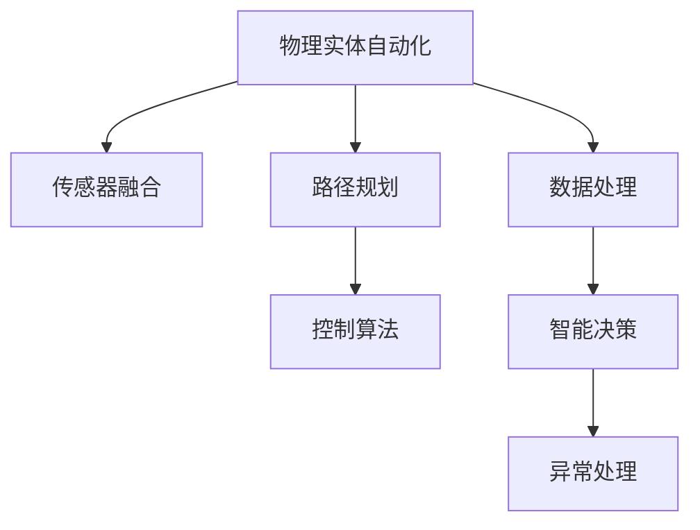
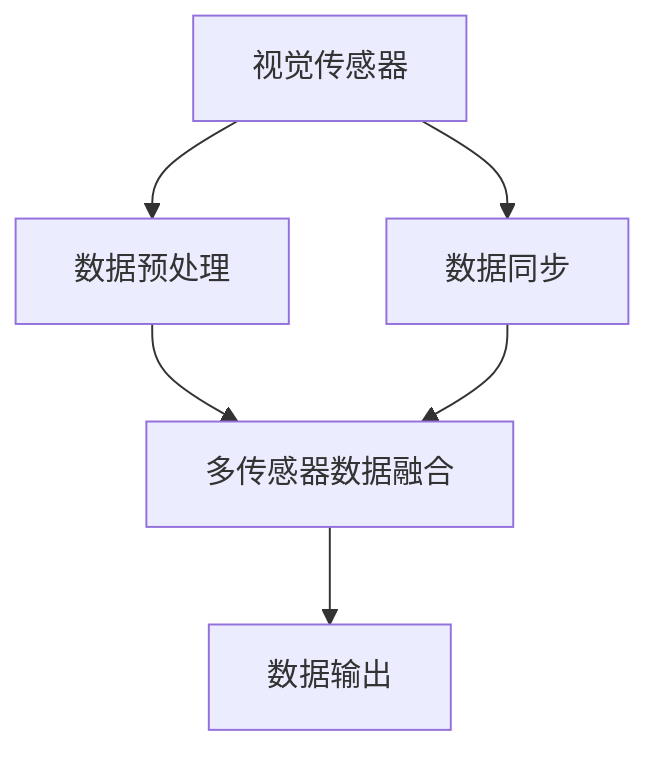
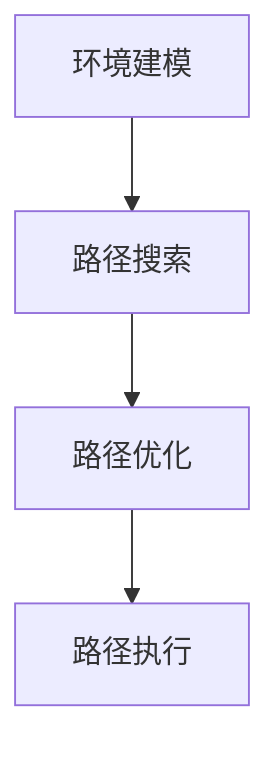
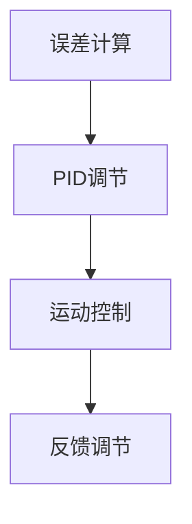
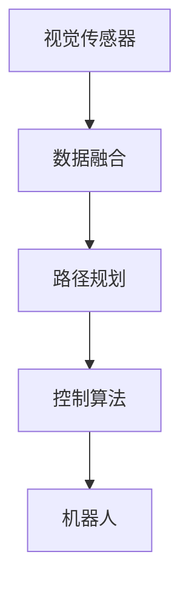
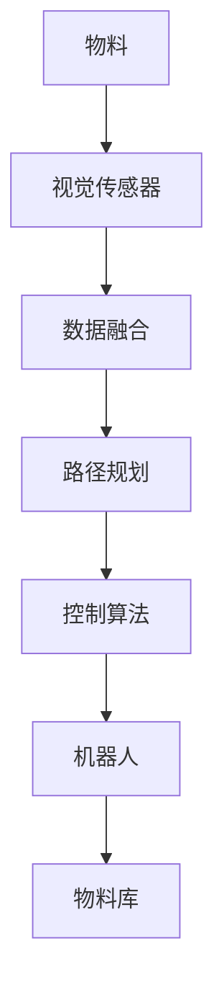
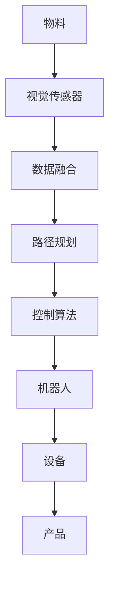
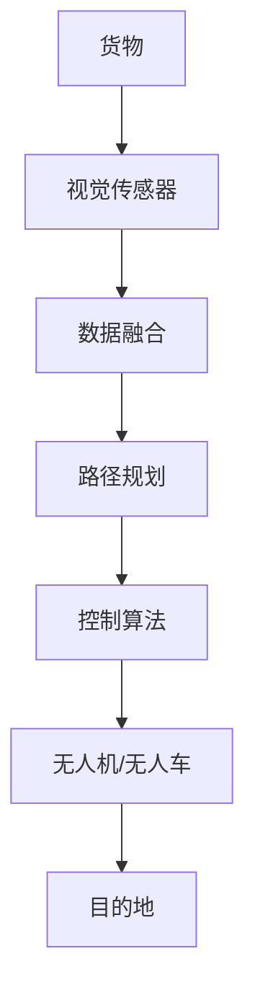

                 

# 物理实体自动化的挑战与机遇

> 关键词：物理自动化, 机器人技术, 传感器融合, 控制算法, 路径规划, 机器学习, 工业互联网

## 1. 背景介绍

### 1.1 问题由来

随着工业4.0的不断推进，工厂的生产模式正在经历重大变革。自动化、数字化、智能化已成为新时代制造业发展的核心驱动力。然而，现有工厂自动化系统仍然面临着诸多挑战：

1. **刚性制造系统**：传统工厂生产线多为刚性设计，难以适应柔性生产需求。面对订单变化，设备调整灵活性不足，生产效率和品质难以保证。
2. **信息孤岛现象**：生产设备、物流系统、质量检测等多源数据缺乏统一管理和分析，信息孤岛现象普遍存在，导致资源利用率低下，质量控制困难。
3. **安全风险高**：自动化系统复杂度高，设备故障和意外操作频繁，安全性问题尤为突出。一旦发生紧急情况，难以迅速响应。
4. **维护成本高**：设备故障和维护周期长，停机损失大，维护成本高，对生产流程造成严重干扰。
5. **人工依赖强**：自动化系统对人工干预依赖较大，自动化水平低，难以实现全过程智能化。

针对上述问题，物理实体自动化成为解决之道。物理实体自动化是指利用先进的机器人技术、传感器技术、控制算法和数据处理技术，实现对工厂内物理实体的智能监控、协调和控制。其目标是提升生产效率、降低维护成本、保障生产安全，推动制造业向智能化、柔性化转型。

### 1.2 问题核心关键点

物理实体自动化的核心在于通过多源数据的融合、智能控制算法的优化以及实时路径规划，实现物理实体的精准操作和智能调度。关键技术包括：

1. **传感器融合**：将多种类型的传感器数据（如视觉传感器、激光雷达、IMU等）进行融合，提高数据的实时性和准确性。
2. **控制算法**：设计高效的路径规划和运动控制算法，确保机器人能够精确执行任务。
3. **数据处理**：对采集的大量数据进行高效处理和分析，实时反馈和优化操作。
4. **智能决策**：利用机器学习等技术，实现对生产过程的智能决策和异常处理。

本文将系统地介绍物理实体自动化的核心技术，并通过实际项目案例，展示其应用效果和挑战。

## 2. 核心概念与联系

### 2.1 核心概念概述

为了更好地理解物理实体自动化的原理和架构，本节将介绍几个关键概念及其联系：

- **物理实体自动化**：利用先进的机器人技术、传感器技术、控制算法和数据处理技术，实现对工厂内物理实体的智能监控、协调和控制，提升生产效率和安全性。

- **传感器融合**：将多种传感器数据进行融合，提升数据的实时性和准确性，为路径规划和控制提供可靠信息支持。

- **路径规划**：利用规划算法，为机器人设计最优的移动路径，实现精确的物料搬运和设备操作。

- **控制算法**：设计高效的控制算法，确保机器人能够稳定可靠地执行任务，同时应对环境变化和突发情况。

- **数据处理**：高效处理和分析海量生产数据，实时反馈和优化生产过程，提高资源利用率和生产效率。

- **智能决策**：利用机器学习等技术，实现对生产过程的智能决策和异常处理，提高生产灵活性和智能化水平。

这些核心概念之间的逻辑关系可以通过以下Mermaid流程图来展示：



这个流程图展示了物理实体自动化的核心组成及其相互作用：

1. 传感器融合提供实时的环境信息，为路径规划和控制提供数据支持。
2. 路径规划设计最优的移动路径，配合控制算法实现精确操作。
3. 数据处理对生产数据进行高效分析，实时反馈和优化操作。
4. 智能决策利用机器学习等技术，实现对生产过程的智能决策和异常处理。

这些概念共同构成了物理实体自动化的基础框架，使系统能够高效、可靠地实现物理实体的自动化。

## 3. 核心算法原理 & 具体操作步骤
### 3.1 算法原理概述

物理实体自动化的核心算法原理主要包括以下几个方面：

- **传感器数据融合**：将多种传感器数据进行融合，提高数据的实时性和准确性。
- **路径规划算法**：设计高效的路径规划算法，确保机器人能够精确执行任务。
- **控制算法**：设计高效的控制算法，确保机器人能够稳定可靠地执行任务。
- **数据处理算法**：高效处理和分析海量生产数据，实时反馈和优化操作。
- **智能决策算法**：利用机器学习等技术，实现对生产过程的智能决策和异常处理。

本文将重点介绍其中的传感器数据融合、路径规划和控制算法，详细讲解其实现原理和操作步骤。

### 3.2 算法步骤详解

**3.2.1 传感器数据融合**

传感器数据融合的目的是将多种传感器数据进行整合，提高数据的实时性和准确性。以视觉传感器和激光雷达为例，其数据融合流程如下：

1. **数据获取**：通过视觉传感器和激光雷达分别获取环境信息。
2. **数据预处理**：对传感器数据进行滤波、去噪等预处理，去除噪声和异常数据。
3. **数据同步**：对不同传感器的数据进行时间同步，确保数据的时序一致性。
4. **数据融合**：利用多传感器数据融合算法（如Kalman滤波、粒子滤波等），将多种数据进行融合，提升数据的实时性和准确性。
5. **数据输出**：输出融合后的环境信息，供路径规划和控制算法使用。



**3.2.2 路径规划算法**

路径规划是物理实体自动化的关键环节之一，其目标是为机器人设计最优的移动路径，确保任务高效、精确地完成。以基于Dijkstra算法和A*算法的路径规划为例，其实现流程如下：

1. **环境建模**：将生产环境建模为图结构，包括节点和边。节点表示环境中的位置，边表示节点之间的连通性。
2. **路径搜索**：利用Dijkstra算法或A*算法搜索最优路径，考虑时间、距离和障碍等因素。
3. **路径优化**：对搜索到的路径进行优化，避免冲突和碰撞。
4. **路径执行**：将最优路径转化为机器人的执行指令，确保机器人能够精确执行任务。



**3.2.3 控制算法**

控制算法的目的是确保机器人能够稳定可靠地执行任务，同时应对环境变化和突发情况。以PID控制为例，其实现流程如下：

1. **误差计算**：计算期望位置与实际位置的误差，作为控制输入。
2. **PID调节**：利用PID控制器调节控制输入，生成相应的速度和加速度指令。
3. **运动控制**：根据速度和加速度指令，控制机器人进行精确移动。
4. **反馈调节**：根据机器人实时位置和速度反馈，进行误差修正，确保机器人能够稳定执行任务。



### 3.3 算法优缺点

**3.3.1 传感器数据融合**

优点：
- 提高数据的实时性和准确性，为路径规划和控制提供可靠信息支持。
- 融合多种传感器数据，增强系统的鲁棒性和可靠性。

缺点：
- 算法复杂度高，实时性要求高，计算资源消耗大。
- 传感器数据类型多样，融合难度大，需要选择合适的融合算法。

**3.3.2 路径规划算法**

优点：
- 能够设计最优的移动路径，确保任务高效、精确地完成。
- 算法可灵活调整，适用于不同的生产环境和任务需求。

缺点：
- 计算复杂度高，特别是在环境复杂、节点数量多的情况下，路径搜索耗时长。
- 路径优化过程中可能存在局部最优解，无法保证全局最优。

**3.3.3 控制算法**

优点：
- 能够确保机器人稳定可靠地执行任务，应对环境变化和突发情况。
- 控制算法可灵活调整，适用于不同的生产环境和任务需求。

缺点：
- 控制算法需要精确的误差反馈，实时性要求高，计算资源消耗大。
- 算法复杂度高，特别是在环境复杂、任务要求高的情况下，控制精度难以保证。

### 3.4 算法应用领域

物理实体自动化的核心算法在多个领域具有广泛应用，包括：

1. **智能仓储**：利用机器人进行物料搬运、入库出库等操作，实现仓储自动化管理。
2. **智能制造**：利用机器人进行设备操作、生产线上物料搬运等，实现生产线的自动化控制。
3. **智能物流**：利用无人机、无人车进行货物运输、配送等操作，实现物流自动化管理。
4. **智能服务**：利用机器人进行服务机器人操作，如清洁、维修等，提升服务效率和质量。

这些领域的应用展示了物理实体自动化的广阔前景，为各行各业带来了新的生产方式和服务模式。

## 4. 数学模型和公式 & 详细讲解 & 举例说明

### 4.1 数学模型构建

在物理实体自动化中，数学模型通常用于描述系统的工作原理和行为。以机器人的路径规划为例，假设环境建模为图结构，节点为位置，边为连通性，目标是从起点到终点的最优路径。则路径规划的数学模型可以描述为：

$$
\min_{x} \sum_{i=1}^{n} c_i x_i
$$

其中，$x_i$ 表示路径节点 $i$ 的到达时间，$c_i$ 表示节点 $i$ 的权重，即路径代价（如距离、时间等）。

### 4.2 公式推导过程

以Dijkstra算法为例，其实现过程如下：

1. **初始化**：设置起点为源节点，所有节点到源节点的距离为0，其余节点距离为无穷大。
2. **松弛操作**：对每个节点进行松弛操作，即计算其到源节点的距离，并与当前距离进行比较，更新距离值。
3. **选择节点**：选择当前距离最小的节点，将其添加到已访问节点集合中。
4. **更新邻居节点**：对当前节点的邻居节点进行松弛操作，更新其到源节点的距离。
5. **重复步骤2-4**，直至所有节点都已访问。

Dijkstra算法的时间复杂度为 $O(n^2)$，其中 $n$ 为节点数量。

### 4.3 案例分析与讲解

以某智能仓储系统为例，系统采用多机器人协作进行物料搬运操作。机器人通过视觉传感器获取环境信息，利用路径规划算法设计最优路径，通过控制算法确保机器人精确执行任务。系统结构如图：



系统首先通过视觉传感器获取环境信息，进行数据融合和路径规划，生成最优路径。然后，利用控制算法生成机器人的速度和加速度指令，确保机器人能够稳定可靠地执行任务。最终，系统实现了物料搬运的自动化管理。

## 5. 项目实践：代码实例和详细解释说明

### 5.1 开发环境搭建

在进行物理实体自动化的开发时，需要使用到多种工具和技术，包括传感器数据融合、路径规划、控制算法等。以下是一个基于Python的开发环境搭建示例：

1. **安装Python**：下载并安装Python，选择适合的Python版本，如Python 3.7或3.8。
2. **安装依赖包**：使用pip安装依赖包，如OpenCV、NumPy、Scikit-Learn、PyTorch等。
3. **配置开发环境**：配置开发环境，设置项目路径、虚拟环境等。

```bash
pip install numpy opencv-python scikit-learn torch
```

### 5.2 源代码详细实现

下面以路径规划算法为例，给出Python代码实现：

```python
import numpy as np
import networkx as nx
from scipy.sparse.csgraph import dijkstra

# 定义图结构
G = nx.DiGraph()
for i in range(num_nodes):
    G.add_node(i)
    for j in range(num_edges):
        G.add_edge(i, j, weight=edges[i][j])

# 计算路径
shortest_path = dijkstra(G, source=0, return_predecessors=True)
path = [0]
for node in shortest_path[1].keys():
    path.append(path[shortest_path[1][node]])
path.reverse()

# 输出路径
print(path)
```

### 5.3 代码解读与分析

上述代码实现了基于Dijkstra算法的路径规划，步骤如下：

1. **定义图结构**：使用NetworkX库定义图结构，包括节点和边。
2. **计算路径**：使用scipy库中的dijkstra函数计算从起点到终点的最短路径。
3. **输出路径**：根据计算结果，输出路径。

## 6. 实际应用场景

### 6.1 智能仓储

智能仓储是物理实体自动化的典型应用之一。通过利用机器人进行物料搬运、入库出库等操作，可以实现仓储的自动化管理。以某智能仓储系统为例，其应用场景如图：



系统通过视觉传感器获取物料位置信息，进行数据融合和路径规划，生成最优路径。然后，利用控制算法生成机器人的速度和加速度指令，确保机器人能够稳定可靠地执行任务。最终，系统实现了物料搬运的自动化管理。

### 6.2 智能制造

智能制造是物理实体自动化的重要应用领域，利用机器人进行设备操作、生产线上物料搬运等，实现生产线的自动化控制。以某智能制造系统为例，其应用场景如图：



系统通过视觉传感器获取物料位置信息，进行数据融合和路径规划，生成最优路径。然后，利用控制算法生成机器人的速度和加速度指令，确保机器人能够稳定可靠地执行任务。最终，系统实现了生产线的自动化控制。

### 6.3 智能物流

智能物流是物理实体自动化的重要应用领域，利用无人机、无人车进行货物运输、配送等操作，实现物流的自动化管理。以某智能物流系统为例，其应用场景如图：



系统通过视觉传感器获取货物位置信息，进行数据融合和路径规划，生成最优路径。然后，利用控制算法生成无人机的速度和加速度指令，确保无人机能够稳定可靠地执行任务。最终，系统实现了货物的自动化运输。

## 7. 工具和资源推荐

### 7.1 学习资源推荐

为了帮助开发者系统掌握物理实体自动化的原理和实践，这里推荐一些优质的学习资源：

1. **《机器人学导论》**：该书系统介绍了机器人学的基本原理和应用，适合初学者入门。
2. **Coursera《机器人学》课程**：斯坦福大学开设的机器人学课程，涵盖了机器人学的多个方面，包括传感器、运动控制等。
3. **ROS（Robot Operating System）**：开源机器人操作系统，提供了丰富的机器人编程工具和库，支持多种传感器和控制器。
4. **Gazebo**：开源模拟器，可用于机器人仿真和测试，支持多种传感器和控制器。
5. **Kinect**：微软推出的深度传感器，可用于机器人视觉和运动捕捉，适合机器人学习领域。

### 7.2 开发工具推荐

高效的开发离不开优秀的工具支持。以下是几款用于物理实体自动化开发的常用工具：

1. **ROS**：开源机器人操作系统，提供了丰富的机器人编程工具和库，支持多种传感器和控制器。
2. **Gazebo**：开源模拟器，可用于机器人仿真和测试，支持多种传感器和控制器。
3. **Kinect**：微软推出的深度传感器，可用于机器人视觉和运动捕捉，适合机器人学习领域。
4. **TOSCA**：用于系统建模的工具，支持复杂系统的建模和仿真。
5. **Simulink**：MATLAB的仿真工具，支持多种传感器的仿真和建模。

### 7.3 相关论文推荐

物理实体自动化的发展源于学界的持续研究。以下是几篇奠基性的相关论文，推荐阅读：

1. **《机器人路径规划算法综述》**：总结了机器人路径规划算法的最新研究进展，涵盖了多种路径规划算法。
2. **《机器人控制算法综述》**：介绍了机器人控制算法的最新研究进展，涵盖了多种控制算法。
3. **《多传感器数据融合算法综述》**：总结了多传感器数据融合算法的最新研究进展，涵盖了多种数据融合算法。
4. **《智能仓储系统研究》**：介绍了智能仓储系统的最新研究进展，包括系统架构和实现方法。
5. **《智能制造系统研究》**：介绍了智能制造系统的最新研究进展，包括系统架构和实现方法。

## 8. 总结：未来发展趋势与挑战

### 8.1 总结

本文对物理实体自动化的核心算法和操作步骤进行了系统介绍，并通过实际项目案例展示了其应用效果和挑战。物理实体自动化利用先进的机器人技术、传感器技术、控制算法和数据处理技术，实现对工厂内物理实体的智能监控、协调和控制，提升生产效率、降低维护成本、保障生产安全，推动制造业向智能化、柔性化转型。物理实体自动化的发展，依赖于传感器数据融合、路径规划、控制算法等多个核心技术的不断突破。

### 8.2 未来发展趋势

物理实体自动化的未来发展趋势主要包括：

1. **智能传感器普及**：智能传感器技术将进一步普及，提升数据的实时性和准确性，为物理实体自动化提供可靠的信息支持。
2. **无人驾驶技术突破**：无人驾驶技术将进一步突破，无人车、无人机的自动化程度将不断提高，实现更加灵活和高效的物流管理。
3. **大数据与人工智能结合**：大数据与人工智能技术的结合将进一步深入，实现对生产过程的智能决策和异常处理，提高生产灵活性和智能化水平。
4. **协作机器人普及**：协作机器人将进一步普及，实现多机器人协作，提高生产效率和质量。
5. **虚拟现实与仿真技术结合**：虚拟现实与仿真技术的结合将进一步深入，实现对生产环境的模拟和测试，提升系统的可靠性和安全性。

### 8.3 面临的挑战

物理实体自动化在迈向成熟的过程中，仍面临诸多挑战：

1. **传感器数据融合**：传感器数据种类繁多，融合难度大，需要选择合适的融合算法，提升数据的实时性和准确性。
2. **路径规划**：路径规划算法复杂度高，计算资源消耗大，难以适应复杂环境和实时需求。
3. **控制算法**：控制算法需要精确的误差反馈，实时性要求高，计算资源消耗大，难以实现高精度和高稳定性。
4. **系统集成**：系统集成复杂度大，不同设备和系统之间的兼容性和互操作性需要不断优化。
5. **数据安全和隐私**：数据安全和隐私问题突出，需要设计高效的数据加密和访问控制机制。

### 8.4 研究展望

物理实体自动化的未来研究需要在以下几个方面寻求新的突破：

1. **高效传感器融合技术**：开发高效的多传感器数据融合算法，提升数据的实时性和准确性。
2. **实时路径规划算法**：设计实时高效的路径规划算法，满足复杂环境和实时需求。
3. **鲁棒控制算法**：设计鲁棒的控制算法，提高机器人的稳定性和可靠性。
4. **智能决策算法**：利用机器学习等技术，实现对生产过程的智能决策和异常处理。
5. **系统集成技术**：设计高效的系统集成技术，实现不同设备和系统之间的互操作性。
6. **数据安全和隐私保护**：设计高效的数据加密和访问控制机制，保障数据安全和隐私。

## 9. 附录：常见问题与解答

**Q1：物理实体自动化如何提高生产效率？**

A: 物理实体自动化通过利用先进的机器人技术、传感器技术、控制算法和数据处理技术，实现对工厂内物理实体的智能监控、协调和控制，提升了生产效率。具体实现包括：
1. **智能仓储**：利用机器人进行物料搬运、入库出库等操作，实现仓储的自动化管理。
2. **智能制造**：利用机器人进行设备操作、生产线上物料搬运等，实现生产线的自动化控制。
3. **智能物流**：利用无人机、无人车进行货物运输、配送等操作，实现物流的自动化管理。

**Q2：物理实体自动化如何保障生产安全？**

A: 物理实体自动化通过利用传感器技术、控制算法等技术，实现对生产环境的智能监控和异常处理，保障生产安全。具体实现包括：
1. **传感器监控**：通过传感器实时监控生产环境，及时发现异常情况，进行预警和处理。
2. **控制算法调节**：通过控制算法调节设备状态，确保生产环境的安全和稳定。
3. **异常处理机制**：设计异常处理机制，对突发情况进行快速响应和处理，保障生产安全。

**Q3：物理实体自动化如何降低维护成本？**

A: 物理实体自动化通过利用机器人的自动化操作，减少了人工干预和维护工作量，降低了维护成本。具体实现包括：
1. **自动化操作**：利用机器人进行物料搬运、设备操作等任务，减少人工干预和维护工作量。
2. **远程监控**：通过传感器和控制算法进行远程监控，及时发现和处理设备故障，减少停机时间和维护成本。
3. **预防性维护**：通过数据分析和预测，进行预防性维护，减少设备故障和维护成本。

**Q4：物理实体自动化如何实现全过程智能化？**

A: 物理实体自动化通过利用机器学习等技术，实现对生产过程的智能决策和异常处理，实现全过程智能化。具体实现包括：
1. **数据收集**：通过传感器和控制算法，实时收集生产数据，为智能决策提供数据支持。
2. **数据处理**：利用机器学习等技术，对生产数据进行高效处理和分析，实现智能决策。
3. **异常处理**：利用机器学习等技术，实现对生产过程的异常处理，提高生产灵活性和智能化水平。

---

作者：禅与计算机程序设计艺术 / Zen and the Art of Computer Programming

