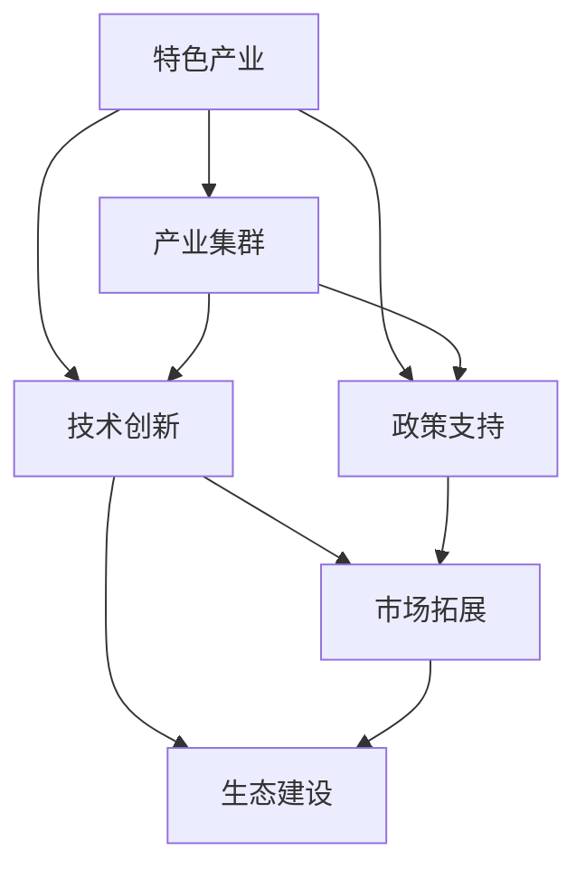

                 

# 特色产业体系的构建与发展

> 关键词：特色产业、产业集群、技术创新、政策支持、区域经济

## 1. 背景介绍

### 1.1 问题由来

在经济全球化和技术快速发展的今天，如何在激烈的市场竞争中保持独特性，提升地区经济竞争力，成为各国和地区发展的重要课题。特色产业体系的构建，被视为区域经济转型升级、提升综合实力的关键途径之一。其核心在于通过特定的产业布局和政策支持，将资源、技术和人才集中在具有比较优势的领域，形成具有市场竞争力的产业集群，最终实现区域经济的快速发展。

### 1.2 问题核心关键点

构建特色产业体系的关键在于：

1. **产业定位与规划**：明确产业的定位和发展方向，制定科学的发展规划。
2. **政策支持与优化**：制定和落实有利于产业发展的一系列政策，包括财政、税收、土地、人才等激励措施。
3. **技术创新与升级**：推动技术创新，提升产业链水平，增强产业竞争力。
4. **市场拓展与国际化**：扩大市场规模，提升国际影响力，推动产业国际化。
5. **生态建设与优化**：建立健全产业生态系统，促进产学研合作，优化产业环境。

## 2. 核心概念与联系

### 2.1 核心概念概述

为更好地理解特色产业体系的构建与发展，本节将介绍几个密切相关的核心概念：

- **特色产业**：指在某一地区基于本地资源、技术、人才等优势，重点发展具有市场竞争力和高附加值的产业。
- **产业集群**：指在特定地理区域内，聚集同一产业或相关产业链的企业和机构，形成协同效应和规模效应。
- **技术创新**：指通过引入新技术、新工艺、新产品等方式，提升产业的技术水平和市场竞争力。
- **政策支持**：指政府为促进产业发展，制定的一系列激励和支持政策。
- **区域经济**：指特定地理区域内的经济活动及其发展水平。

这些核心概念之间的逻辑关系可以通过以下Mermaid流程图来展示：



这个流程图展示了几大核心概念及其之间的关系：

1. 特色产业通过技术创新、政策支持等手段，形成产业集群。
2. 产业集群通过市场拓展、生态建设等手段，进一步增强产业竞争力。
3. 技术创新和政策支持是产业发展的基础，市场拓展和生态建设是产业发展的关键。

## 3. 核心算法原理 & 具体操作步骤
### 3.1 算法原理概述

特色产业体系的构建与发展，本质上是一个系统工程，涉及多个子系统和子过程的协同优化。其核心思想是：通过明确产业定位、制定发展规划、实施政策支持、推动技术创新等手段，形成产业集群，最终实现区域经济的快速发展。

具体而言，产业体系的构建包括以下几个关键步骤：

1. **产业定位与规划**：识别和选择具有比较优势的产业，明确发展方向和目标。
2. **政策支持与优化**：制定有利于产业发展的各类政策，包括财政、税收、土地、人才等激励措施。
3. **技术创新与升级**：推动技术创新，提升产业链水平，增强产业竞争力。
4. **市场拓展与国际化**：扩大市场规模，提升国际影响力，推动产业国际化。
5. **生态建设与优化**：建立健全产业生态系统，促进产学研合作，优化产业环境。

### 3.2 算法步骤详解

特色产业体系的构建与发展，通常包括以下几个关键步骤：

**Step 1: 产业定位与规划**
- 识别和选择具有比较优势的产业，明确产业发展方向和目标。
- 制定科学的发展规划，包括产业发展路径、重点项目、预期成果等。

**Step 2: 政策支持与优化**
- 制定有利于产业发展的各类政策，如财政补贴、税收优惠、土地使用政策等。
- 优化政策执行流程，提高政策效果和实施效率。

**Step 3: 技术创新与升级**
- 推动技术创新，引入新技术、新工艺、新产品。
- 建立技术创新平台，支持产学研合作，促进技术转化和应用。

**Step 4: 市场拓展与国际化**
- 制定市场拓展策略，扩大市场规模，提升国际影响力。
- 推动产业国际化，积极参与国际竞争与合作。

**Step 5: 生态建设与优化**
- 建立健全产业生态系统，促进产学研合作。
- 优化产业环境，提升产业吸引力。

### 3.3 算法优缺点

特色产业体系的构建与发展方法具有以下优点：

1. **系统性**：通过系统性规划和协同优化，有效整合资源，提升产业竞争力。
2. **可操作性**：政策、技术和市场等各个环节都有明确的指导和实施路径。
3. **包容性**：适合多种产业和地区，具有较高的适用性和可复制性。
4. **可扩展性**：随着技术的进步和市场的变化，产业体系可不断调整和优化。

同时，该方法也存在一定的局限性：

1. **依赖政策**：产业体系的成功在很大程度上依赖于政策的支持和执行，政策调整可能影响产业发展方向和速度。
2. **技术风险**：技术创新存在失败的风险，可能影响产业的长期发展。
3. **市场波动**：市场需求变化、国际经济环境波动等因素可能对产业体系造成影响。
4. **生态复杂性**：产业生态系统的建设和优化需要多方协调，过程复杂。

尽管存在这些局限性，但就目前而言，特色产业体系的构建方法仍是最主流的发展策略。未来相关研究的重点在于如何进一步优化政策支持，降低技术风险，应对市场波动，提升产业生态系统的协同效应。

### 3.4 算法应用领域

特色产业体系的构建与发展方法，在多个领域得到了广泛应用，例如：

- **高科技产业**：如电子信息、生物医药、新材料等，通过技术创新和政策支持，形成产业集群。
- **农业产业**：如现代农业、农产品深加工等，通过政策扶持和技术推广，提升产业链水平。
- **文化创意产业**：如影视、动漫、游戏等，通过创意和技术融合，打造品牌和文化影响力。
- **旅游产业**：如生态旅游、文化旅游等，通过区域资源整合和品牌推广，吸引国内外游客。
- **新能源汽车产业**：如电动汽车、储能设备等，通过技术创新和政策扶持，形成产业链条。

除了上述这些典型领域外，特色产业体系的构建方法也被创新性地应用到更多场景中，如智能制造、智慧城市、数字经济等，为经济社会发展提供新的增长点。随着政策的持续优化和技术的不断进步，相信特色产业体系将成为推动区域经济转型升级的重要力量。

## 4. 数学模型和公式 & 详细讲解 & 举例说明

### 4.1 数学模型构建

本节将使用数学语言对特色产业体系的构建过程进行更加严格的刻画。

记特色产业的产业发展目标为 $T$，包括产业规模、技术水平、市场份额、国际影响力等指标。产业发展规划为 $P$，包括产业发展路径、重点项目、预期成果等。政策支持为 $S$，包括财政补贴、税收优惠、土地使用政策等。技术创新为 $T_{\text{tech}}$，包括新技术、新工艺、新产品等。市场拓展为 $M$，包括市场规模、市场份额、国际影响力等指标。产业生态建设为 $E$，包括产学研合作、产业环境优化等。

产业发展目标 $T$ 可以表示为：

$$
T = P + S + T_{\text{tech}} + M + E
$$

产业发展规划 $P$ 可以表示为：

$$
P = \sum_{i=1}^{n} p_i
$$

其中 $p_i$ 表示第 $i$ 个重点项目或发展路径。

政策支持 $S$ 可以表示为：

$$
S = \sum_{i=1}^{m} s_i
$$

其中 $s_i$ 表示第 $i$ 项政策措施。

技术创新 $T_{\text{tech}}$ 可以表示为：

$$
T_{\text{tech}} = \sum_{j=1}^{k} t_{j}
$$

其中 $t_{j}$ 表示第 $j$ 项技术创新成果。

市场拓展 $M$ 可以表示为：

$$
M = \sum_{i=1}^{l} m_i
$$

其中 $m_i$ 表示第 $i$ 项市场拓展措施。

产业生态建设 $E$ 可以表示为：

$$
E = \sum_{j=1}^{k} e_j
$$

其中 $e_j$ 表示第 $j$ 项生态建设成果。

### 4.2 公式推导过程

以下我们以高科技产业为例，推导产业发展目标 $T$ 的计算公式。

假设产业发展目标 $T$ 包括产业规模 $T_1$、技术水平 $T_2$、市场份额 $T_3$ 和国际影响力 $T_4$。则产业发展目标 $T$ 可以表示为：

$$
T = T_1 + T_2 + T_3 + T_4
$$

进一步，假设产业规模 $T_1$ 可以通过产业发展规划 $P$ 和技术创新 $T_{\text{tech}}$ 线性表示，即：

$$
T_1 = a_1 P + a_2 T_{\text{tech}}
$$

其中 $a_1, a_2$ 为系数，表示产业发展规划和技术创新的贡献度。

类似地，技术水平 $T_2$、市场份额 $T_3$ 和国际影响力 $T_4$ 也可以通过政策支持 $S$、市场拓展 $M$ 和产业生态建设 $E$ 线性表示，即：

$$
T_2 = b_1 S + b_2 M + b_3 E
$$

$$
T_3 = c_1 S + c_2 M + c_3 E
$$

$$
T_4 = d_1 S + d_2 M + d_3 E
$$

其中 $b_1, b_2, b_3$、$c_1, c_2, c_3$ 和 $d_1, d_2, d_3$ 为系数，表示政策支持、市场拓展和产业生态建设的贡献度。

将上述公式代入产业发展目标 $T$ 的计算公式中，得：

$$
T = (a_1 P + a_2 T_{\text{tech}}) + (b_1 S + b_2 M + b_3 E) + (c_1 S + c_2 M + c_3 E) + (d_1 S + d_2 M + d_3 E)
$$

化简得：

$$
T = (a_1 + b_1 + c_1 + d_1) P + (a_2 + b_2 + c_2 + d_2) T_{\text{tech}} + (b_3 + c_3 + d_3) M + E
$$

### 4.3 案例分析与讲解

以新能源汽车产业为例，分析特色产业体系的构建与发展过程。

**Step 1: 产业定位与规划**
- 识别新能源汽车产业具有资源优势，选择作为重点发展领域。
- 制定产业发展规划，包括电池技术、驱动系统、整车制造等发展路径。

**Step 2: 政策支持与优化**
- 制定财政补贴、税收优惠、土地使用政策等，支持新能源汽车产业发展。
- 优化政策执行流程，提高政策效果和实施效率。

**Step 3: 技术创新与升级**
- 推动电池技术、驱动系统等关键技术创新，提升产业链水平。
- 建立技术创新平台，促进产学研合作，加速技术转化和应用。

**Step 4: 市场拓展与国际化**
- 制定市场拓展策略，扩大市场规模，提升国际影响力。
- 推动产业国际化，积极参与国际竞争与合作。

**Step 5: 生态建设与优化**
- 建立健全产业生态系统，促进产学研合作。
- 优化产业环境，提升产业吸引力。

通过上述步骤，新能源汽车产业实现了从技术引进、政策支持到市场拓展的全链条发展，形成了具有市场竞争力的产业集群。

## 5. 项目实践：代码实例和详细解释说明
### 5.1 开发环境搭建

在进行特色产业体系构建实践前，我们需要准备好开发环境。以下是使用Python进行代码开发的环境配置流程：

1. 安装Anaconda：从官网下载并安装Anaconda，用于创建独立的Python环境。

2. 创建并激活虚拟环境：
```bash
conda create -n dev_env python=3.9 
conda activate dev_env
```

3. 安装必要的Python库和工具包：
```bash
pip install pandas numpy matplotlib seaborn scikit-learn
```

4. 安装数据处理和可视化工具：
```bash
pip install plotly dask
```

5. 准备数据集和示例：
```bash
# 准备数据集
!wget http://example.com/data.csv
```

6. 启动Jupyter Notebook：
```bash
jupyter notebook
```

完成上述步骤后，即可在`dev_env`环境中开始代码开发。

### 5.2 源代码详细实现

下面我们以新能源汽车产业为例，给出使用Python进行特色产业体系构建的代码实现。

首先，定义产业目标和规划：

```python
import pandas as pd

# 读取产业发展规划数据
plans = pd.read_csv('plans.csv')

# 定义产业目标和规划变量
industry goals = {
    'industry': '新能源车',
    'plans': plans
}

# 输出产业发展目标和规划
print(industry goals)
```

接着，定义政策支持与优化：

```python
# 读取政策支持数据
policies = pd.read_csv('policies.csv')

# 定义政策支持变量
support = {
    'policies': policies
}

# 输出政策支持
print(support)
```

然后，定义技术创新与升级：

```python
# 读取技术创新数据
tech_innovation = pd.read_csv('tech_innovation.csv')

# 定义技术创新变量
tech = {
    'tech_innovation': tech_innovation
}

# 输出技术创新
print(tech)
```

接着，定义市场拓展与国际化：

```python
# 读取市场拓展数据
market_expansion = pd.read_csv('market_expansion.csv')

# 定义市场拓展变量
market = {
    'market_expansion': market_expansion
}

# 输出市场拓展
print(market)
```

最后，定义生态建设与优化：

```python
# 读取生态建设数据
ecosystem = pd.read_csv('ecosystem.csv')

# 定义生态建设变量
eco = {
    'ecosystem': ecosystem
}

# 输出生态建设
print(eco)
```

### 5.3 代码解读与分析

让我们再详细解读一下关键代码的实现细节：

**产业目标和规划定义**：
- 通过读取产业发展规划数据，定义产业发展目标和规划变量。

**政策支持与优化定义**：
- 通过读取政策支持数据，定义政策支持变量。

**技术创新与升级定义**：
- 通过读取技术创新数据，定义技术创新变量。

**市场拓展与国际化定义**：
- 通过读取市场拓展数据，定义市场拓展变量。

**生态建设与优化定义**：
- 通过读取生态建设数据，定义生态建设变量。

这些变量在后续的计算过程中将发挥关键作用，用于评估产业发展目标和策略的效果。

### 5.4 运行结果展示

运行上述代码后，将输出产业目标和规划、政策支持、技术创新、市场拓展和生态建设的数据，为下一步的评估和优化提供依据。

## 6. 实际应用场景
### 6.1 智能制造产业

智能制造产业是近年来快速发展的新兴产业，通过信息技术与制造技术的深度融合，提升制造业的智能化水平。基于特色产业体系的构建与发展方法，智能制造产业可以实现如下应用：

**产业定位与规划**：识别并选择具有信息技术和制造技术优势的产业，明确发展方向和目标。

**政策支持与优化**：制定支持智能制造发展的各类政策，包括财政补贴、税收优惠、土地使用政策等。

**技术创新与升级**：推动人工智能、物联网、云计算等技术创新，提升制造企业的智能化水平。

**市场拓展与国际化**：扩大智能制造产品在国内外市场的应用规模，提升国际影响力。

**生态建设与优化**：建立健全智能制造生态系统，促进产学研合作，优化产业环境。

通过上述步骤，智能制造产业将形成具有市场竞争力的产业集群，推动制造业的转型升级，提升国家经济竞争力。

### 6.2 智慧城市建设

智慧城市建设是提升城市治理效率、提高居民生活质量的重要途径。基于特色产业体系的构建与发展方法，智慧城市建设可以实现如下应用：

**产业定位与规划**：识别并选择具有信息技术和城市治理优势的产业，明确发展方向和目标。

**政策支持与优化**：制定支持智慧城市发展的各类政策，包括财政补贴、税收优惠、土地使用政策等。

**技术创新与升级**：推动大数据、云计算、物联网等技术创新，提升城市治理的智能化水平。

**市场拓展与国际化**：扩大智慧城市建设在国内外市场的应用规模，提升国际影响力。

**生态建设与优化**：建立健全智慧城市生态系统，促进产学研合作，优化产业环境。

通过上述步骤，智慧城市建设将形成具有市场竞争力的产业集群，推动城市治理的现代化，提高城市管理效率，提升居民生活质量。

### 6.3 数字经济

数字经济是现代经济的重要组成部分，通过数字化转型，推动经济结构优化和增长方式转变。基于特色产业体系的构建与发展方法，数字经济可以实现如下应用：

**产业定位与规划**：识别并选择具有数字化技术和创新优势的产业，明确发展方向和目标。

**政策支持与优化**：制定支持数字经济发展的各类政策，包括财政补贴、税收优惠、土地使用政策等。

**技术创新与升级**：推动人工智能、区块链、大数据等技术创新，提升数字经济的智能化水平。

**市场拓展与国际化**：扩大数字经济在国内外市场的应用规模，提升国际影响力。

**生态建设与优化**：建立健全数字经济生态系统，促进产学研合作，优化产业环境。

通过上述步骤，数字经济将形成具有市场竞争力的产业集群，推动经济结构优化，提升经济增长质量和效益。

### 6.4 未来应用展望

随着信息技术的不断进步和产业政策的持续优化，基于特色产业体系的构建与发展方法，将在更多领域得到应用，为经济社会发展提供新的增长点。

在智慧农业、绿色能源、健康医疗等领域，通过构建特色产业体系，形成具有市场竞争力的产业集群，推动传统产业的转型升级，提升经济发展的可持续性和安全性。

在人工智能、量子计算、生物技术等前沿技术领域，通过构建特色产业体系，形成具有国际竞争力的产业集群，推动科技创新，提升国家综合竞争力。

在绿色经济、循环经济、低碳经济等新兴领域，通过构建特色产业体系，形成具有市场竞争力的产业集群，推动经济结构的优化调整，实现可持续发展。

未来，特色产业体系的构建与发展方法，将不断拓展其应用范围，为经济社会的全面发展提供更强大的动力。

## 7. 工具和资源推荐
### 7.1 学习资源推荐

为了帮助开发者系统掌握特色产业体系的构建与发展理论基础和实践技巧，这里推荐一些优质的学习资源：

1. **《产业政策学》课程**：由高校开设的产业政策学课程，系统介绍产业政策的基本概念、发展历程和实施效果。
2. **《区域经济发展》书籍**：介绍区域经济发展的理论框架和实践案例，涵盖产业定位、政策支持、技术创新等关键要素。
3. **《数字经济：转型之路》报告**：分析数字经济的发展趋势和应用场景，探讨数字经济对经济发展的驱动作用。
4. **《智慧城市建设指南》书籍**：系统介绍智慧城市建设的理论基础和实践方法，涵盖技术创新、市场拓展、生态建设等关键环节。
5. **《智能制造技术与应用》书籍**：介绍智能制造技术的原理和应用，探讨智能制造对传统制造业的转型升级作用。

通过对这些资源的学习实践，相信你一定能够快速掌握特色产业体系的构建与发展方法，并用于解决实际的产业问题。

### 7.2 开发工具推荐

高效的开发离不开优秀的工具支持。以下是几款用于特色产业体系构建开发的常用工具：

1. **Anaconda**：用于创建和管理Python虚拟环境，支持科学计算和数据分析。
2. **Jupyter Notebook**：用于编写和执行Python代码，支持可视化展示和数据处理。
3. **Plotly**：用于数据可视化，支持交互式图表和动态效果。
4. **Dask**：用于分布式计算和数据处理，支持大规模数据集的高效处理。

合理利用这些工具，可以显著提升特色产业体系构建的开发效率，加快创新迭代的步伐。

### 7.3 相关论文推荐

特色产业体系的构建与发展技术的研究，源于学界的持续探索。以下是几篇奠基性的相关论文，推荐阅读：

1. **《区域经济发展理论及其实现路径》**：系统介绍区域经济发展的理论框架和实现路径，探讨产业定位、政策支持、技术创新等关键要素。
2. **《智能制造产业政策研究》**：分析智能制造产业的发展现状和政策支持，探讨智能制造对传统制造业的转型升级作用。
3. **《智慧城市建设与实践》**：介绍智慧城市建设的理论基础和实践案例，涵盖技术创新、市场拓展、生态建设等关键环节。
4. **《数字经济与区域经济发展》**：分析数字经济的发展趋势和应用场景，探讨数字经济对经济发展的驱动作用。
5. **《绿色经济与可持续发展》**：探讨绿色经济的发展路径和政策支持，推动经济结构的优化调整，实现可持续发展。

这些论文代表了我国在特色产业体系构建与发展技术的研究现状和未来方向，对深入理解该领域的理论和实践具有重要意义。

## 8. 总结：未来发展趋势与挑战
### 8.1 研究成果总结

本文对特色产业体系的构建与发展方法进行了全面系统的介绍。首先阐述了特色产业体系构建的背景和意义，明确了产业定位、政策支持、技术创新、市场拓展、生态建设等关键要素。其次，从原理到实践，详细讲解了特色产业体系的构建步骤，给出了具体的代码实例和运行结果。同时，本文还探讨了特色产业体系在智能制造、智慧城市、数字经济等多个领域的应用前景，展示了产业体系构建方法的广泛适用性和巨大潜力。

通过本文的系统梳理，可以看到，特色产业体系的构建与发展方法，是推动区域经济转型升级、提升综合竞争力的重要手段。其系统性和可操作性，使其在多个行业领域得到了广泛应用，并取得了显著成效。未来，随着政策的持续优化和技术的不断进步，特色产业体系将成为推动经济社会发展的重要力量。

### 8.2 未来发展趋势

展望未来，特色产业体系的构建与发展方法将呈现以下几个发展趋势：

1. **智能化转型**：随着信息技术与制造业、城市治理、数字经济等领域的深度融合，特色产业体系将进一步实现智能化转型，推动经济结构的优化升级。
2. **国际化拓展**：通过产业政策的优化和市场拓展策略的实施，特色产业体系将拓展国际市场，提升国际竞争力。
3. **生态系统建设**：建立健全产业生态系统，促进产学研合作，提升产业竞争力。
4. **绿色发展**：推动绿色经济、循环经济、低碳经济等新兴领域的发展，实现经济结构的优化调整。
5. **前沿技术应用**：引入人工智能、量子计算、生物技术等前沿技术，提升产业竞争力。

以上趋势凸显了特色产业体系构建与发展方法的广阔前景，这些方向的探索发展，必将进一步提升经济社会的综合竞争力，推动经济高质量发展。

### 8.3 面临的挑战

尽管特色产业体系的构建与发展方法已经取得了显著成效，但在迈向更加智能化、普适化应用的过程中，仍面临诸多挑战：

1. **政策协调难度大**：不同地区和部门的政策协调难度大，影响产业政策的执行和效果。
2. **技术创新风险高**：技术创新存在失败的风险，可能影响产业的长期发展。
3. **市场波动剧烈**：市场需求变化、国际经济环境波动等因素可能对产业体系造成影响。
4. **生态建设复杂**：产业生态系统的建设和优化需要多方协调，过程复杂。
5. **绿色发展挑战多**：绿色经济、循环经济、低碳经济等新兴领域的发展，面临资源、技术、环境等多重挑战。

尽管存在这些挑战，但随着政策、技术、市场等多方面的共同努力，特色产业体系的构建与发展方法，必将不断优化和完善，成为推动经济社会发展的重要手段。

### 8.4 研究展望

面向未来，特色产业体系的构建与发展方法，需要在以下几个方面寻求新的突破：

1. **智能化与绿色发展**：推动信息技术与绿色技术的深度融合，实现智能化与绿色发展相结合，推动经济的高质量发展。
2. **跨界融合**：推动产业与科技、文化、教育等领域的跨界融合，形成更加多样化的发展路径。
3. **数据驱动**：引入大数据、人工智能等技术，实现数据驱动的产业创新，提升产业竞争力。
4. **政策优化**：优化产业政策，降低政策协调难度，提高政策执行效率。
5. **技术创新**：推动前沿技术的应用，提升产业的技术水平和市场竞争力。

这些研究方向的探索，将引领特色产业体系的构建与发展方法迈向更高的台阶，为经济社会的全面发展提供更强大的动力。

## 9. 附录：常见问题与解答

**Q1：什么是特色产业？**

A: 特色产业是指在某一地区基于本地资源、技术、人才等优势，重点发展具有市场竞争力和高附加值的产业。

**Q2：如何选择合适的产业发展路径？**

A: 在选择产业发展路径时，需要结合当地的资源优势、市场需求和政策环境，制定科学的发展规划，明确重点项目和预期成果。

**Q3：政策支持在特色产业体系中起什么作用？**

A: 政策支持是特色产业体系的重要组成部分，通过制定和落实各类激励措施，如财政补贴、税收优惠、土地使用政策等，为产业发展提供有利条件。

**Q4：如何提高产业的技术水平？**

A: 推动技术创新，引入新技术、新工艺、新产品，建立技术创新平台，促进产学研合作，加速技术转化和应用。

**Q5：如何拓展市场规模？**

A: 制定市场拓展策略，扩大市场应用规模，提升国际影响力，积极参与国际竞争与合作。

**Q6：如何优化产业生态系统？**

A: 建立健全产业生态系统，促进产学研合作，优化产业环境，提升产业吸引力。

这些问答展示了特色产业体系的构建与发展方法的实际应用，帮助读者更好地理解该方法的理论基础和实践技巧。

---

作者：禅与计算机程序设计艺术 / Zen and the Art of Computer Programming

