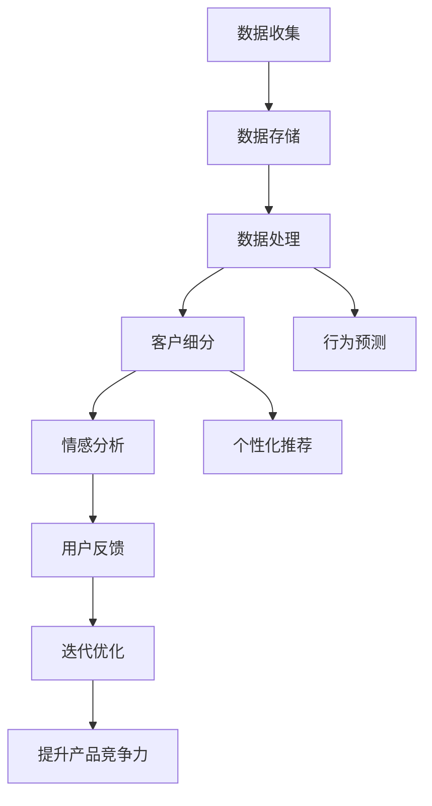

                 

# 生意场上的智慧：站在客户立场

在商业世界中，理解客户立场是取得成功的关键。但如何真正站在客户的角度去思考问题、做出决策，并不是一件容易的事情。本文将从数据分析、用户体验、市场营销等角度，探讨如何在生意场上更好地理解客户，从而提升产品和服务的质量，赢得客户的信任和忠诚。

## 1. 背景介绍

### 1.1 问题由来

在现代商业环境中，客户满意度和忠诚度是企业成功的关键。越来越多的企业意识到，只有深入了解客户需求和痛点，才能设计出真正满足用户需求的产品和服务。然而，如何系统地获取、分析和利用客户数据，一直是企业面临的一大挑战。

### 1.2 问题核心关键点

客户数据的管理和分析，涉及到数据收集、存储、处理和应用等多个环节，包括但不限于：

- **数据收集**：通过在线调查、社交媒体分析、销售数据收集等方式获取客户信息。
- **数据存储**：选择合适的数据库和存储方式，保障数据安全和隐私。
- **数据处理**：运用数据挖掘、机器学习等技术，进行客户细分、行为预测、情感分析等。
- **数据应用**：将分析结果转化为业务决策，提升用户体验，优化产品设计。

这些环节环环相扣，任何一个环节出现问题都可能影响最终结果。因此，本文将从数据管理、用户体验和市场营销等多个角度，探讨如何在生意场上更好地理解客户。

## 2. 核心概念与联系

### 2.1 核心概念概述

以下是与客户立场相关的几个核心概念：

- **客户细分**：根据客户行为、偏好等特征，将客户划分为不同群体，便于制定针对性策略。
- **行为预测**：利用机器学习模型，预测客户未来的购买行为、满意度等，提前采取措施。
- **情感分析**：通过自然语言处理技术，分析客户对产品、服务的情感倾向，及时调整改进。
- **用户反馈**：收集客户对产品、服务的反馈信息，进行迭代优化，提升产品竞争力。
- **个性化推荐**：根据客户历史行为和偏好，推荐个性化的产品、服务，增强客户粘性。

这些概念之间相互关联，共同构成了理解客户立场的数据分析和应用框架。

### 2.2 核心概念原理和架构的 Mermaid 流程图



这个流程图展示了从数据收集到提升产品竞争力的全流程，各环节之间通过数据链路进行连接。

## 3. 核心算法原理 & 具体操作步骤

### 3.1 算法原理概述

客户立场的数据分析和应用，通常依赖于以下算法：

- **聚类算法**：如K-means、层次聚类等，用于客户细分和群体分析。
- **回归分析**：如线性回归、逻辑回归等，用于行为预测和需求分析。
- **分类算法**：如决策树、随机森林、神经网络等，用于情感分析和用户反馈识别。
- **协同过滤**：用于个性化推荐系统，通过分析用户历史行为，推荐相关产品。
- **关联规则**：用于发现客户购买行为中的关联规则，提高交叉销售机会。

这些算法通过数学模型，将客户数据转化为可操作的商业决策，提升客户满意度和业务收益。

### 3.2 算法步骤详解

以下是数据分析和应用的主要步骤：

1. **数据收集**：通过在线调查、社交媒体分析、销售数据收集等方式，获取客户行为和反馈数据。
2. **数据清洗**：去除噪音和异常值，处理缺失数据，确保数据质量。
3. **数据整合**：将不同来源的数据进行合并，形成统一的数据视图。
4. **数据探索**：使用描述性统计、可视化工具，发现数据中的规律和异常。
5. **客户细分**：通过聚类算法，将客户分为不同群体，制定针对性营销策略。
6. **行为预测**：利用回归分析，预测客户未来的购买行为、满意度等。
7. **情感分析**：通过自然语言处理技术，分析客户对产品、服务的情感倾向。
8. **用户反馈**：收集客户对产品、服务的反馈信息，进行迭代优化。
9. **个性化推荐**：根据客户历史行为和偏好，推荐个性化的产品、服务。
10. **决策支持**：将分析结果转化为商业决策，提升产品和服务的质量。

### 3.3 算法优缺点

数据分析和应用的主要优点包括：

- **数据驱动决策**：利用数据和算法，提供科学的商业决策依据。
- **精准营销**：通过客户细分和个性化推荐，实现精准营销，提高转化率。
- **客户洞察**：深入了解客户需求和痛点，提升用户体验和满意度。

然而，数据和算法也有其局限性：

- **数据质量问题**：数据不完整、不准确或存在噪音，可能导致错误的分析结果。
- **隐私保护**：客户数据的收集和分析，涉及隐私保护和合规性问题。
- **模型复杂性**：复杂的算法模型需要高昂的计算资源，难以在实时环境中应用。
- **模型可解释性**：部分算法模型黑盒特性强，难以解释其内部工作机制。

### 3.4 算法应用领域

客户立场的数据分析和应用，广泛适用于多个领域，包括但不限于：

- **零售电商**：通过客户细分和行为预测，优化库存管理和商品推荐。
- **金融服务**：利用情感分析和用户反馈，提升客户满意度和忠诚度。
- **旅游酒店**：通过个性化推荐和行为预测，提升客户体验和预订率。
- **医疗健康**：通过情感分析和用户反馈，优化医疗服务和患者体验。
- **媒体娱乐**：通过情感分析和行为预测，提升用户粘性和内容推荐效果。

这些领域都是客户立场理解和应用的重要场景，具有巨大的市场潜力。

## 4. 数学模型和公式 & 详细讲解 & 举例说明

### 4.1 数学模型构建

为了更好地理解客户立场，我们可以构建以下数学模型：

- **客户细分模型**：通过聚类算法，将客户分为不同群体。
- **行为预测模型**：利用回归分析，预测客户未来的购买行为。
- **情感分析模型**：通过文本分析技术，计算客户情感倾向。
- **个性化推荐模型**：基于协同过滤算法，推荐相关产品和服务。

### 4.2 公式推导过程

以行为预测模型为例，假设我们有历史数据$(X_i, Y_i)$，其中$X_i$为输入特征，$Y_i$为输出目标，我们使用线性回归模型进行预测：

$$
Y = \theta_0 + \sum_{i=1}^n \theta_i X_i
$$

其中，$\theta = (\theta_0, \theta_1, ..., \theta_n)$为模型参数，$n$为特征数量。通过最小二乘法求解$\theta$，可以得到最优参数：

$$
\theta = (X^T X)^{-1} X^T Y
$$

在实际应用中，通常使用Ridge回归、Lasso回归、随机森林等算法进行行为预测。

### 4.3 案例分析与讲解

假设我们是一家电商公司，希望预测客户在未来30天的购买行为。我们收集了客户的历史购买数据，包括商品类别、购买时间、购买金额等特征。使用线性回归模型进行预测，可以得到客户的购买概率：

$$
P(Y=1|X) = \sigma(\theta_0 + \sum_{i=1}^n \theta_i X_i)
$$

其中，$\sigma$为sigmoid函数，将回归结果映射到[0,1]区间，表示购买概率。根据预测结果，公司可以制定针对性的促销策略，提高客户购买率和销售额。

## 5. 项目实践：代码实例和详细解释说明

### 5.1 开发环境搭建

在进行客户立场数据分析和应用前，需要准备好开发环境。以下是使用Python进行数据分析的典型环境配置流程：

1. 安装Anaconda：从官网下载并安装Anaconda，用于创建独立的Python环境。

2. 创建并激活虚拟环境：
```bash
conda create -n data-env python=3.8 
conda activate data-env
```

3. 安装必要的库：
```bash
pip install numpy pandas scikit-learn matplotlib seaborn
```

### 5.2 源代码详细实现

假设我们有一家电商公司，收集了客户的历史购买数据，并希望预测客户在未来30天的购买行为。以下是使用Python和scikit-learn进行行为预测的代码实现：

```python
from sklearn.linear_model import Ridge
from sklearn.model_selection import train_test_split
from sklearn.metrics import mean_absolute_error
import pandas as pd

# 读取数据
df = pd.read_csv('purchase_data.csv')

# 数据预处理
X = df[['category', 'time', 'amount']]  # 特征
y = df['purchase']  # 目标

# 划分训练集和测试集
X_train, X_test, y_train, y_test = train_test_split(X, y, test_size=0.2, random_state=42)

# 构建模型
model = Ridge()
model.fit(X_train, y_train)

# 预测测试集
y_pred = model.predict(X_test)

# 计算MAE
mae = mean_absolute_error(y_test, y_pred)
print(f"MAE: {mae:.2f}")
```

### 5.3 代码解读与分析

以上代码实现了基于线性回归的行为预测模型。具体步骤如下：

1. 读取数据：使用pandas库读取历史购买数据。
2. 数据预处理：选择客户特征和购买行为，使用train_test_split进行划分。
3. 构建模型：使用Ridge回归构建行为预测模型。
4. 模型训练：使用fit方法对模型进行训练。
5. 预测测试集：使用predict方法对测试集进行预测。
6. 计算MAE：使用mean_absolute_error计算预测误差的平均绝对值。

通过这些步骤，我们得到了模型在测试集上的性能指标，可以进行进一步的优化和调整。

### 5.4 运行结果展示

在实际应用中，我们可以通过可视化工具（如matplotlib、seaborn等）对模型的预测结果进行展示，如图：

```python
import matplotlib.pyplot as plt

# 可视化预测结果
plt.figure(figsize=(8, 6))
plt.hist(y_pred, bins=20, label='Predictions')
plt.hist(y_test, bins=20, label='True Values', alpha=0.5)
plt.legend()
plt.show()
```

这样，我们便可以通过直观的图表，评估模型的预测效果。

## 6. 实际应用场景

### 6.1 零售电商

在零售电商领域，客户细分和行为预测应用广泛。通过客户细分，公司可以更好地了解不同群体的需求，制定针对性的营销策略。例如，针对高价值客户，可以推出VIP特权、积分兑换等优惠活动，提升客户忠诚度。

### 6.2 金融服务

在金融服务领域，情感分析和用户反馈是提升客户满意度的重要手段。通过分析客户对服务的情感倾向，公司可以及时发现问题，改进产品和服务。例如，对于客户投诉较多的产品，可以采取紧急措施，优化用户体验。

### 6.3 旅游酒店

在旅游酒店领域，个性化推荐和行为预测可以提升客户体验和预订率。通过分析客户的历史预订行为，酒店可以推荐相关的旅游路线、景点信息等，提高客户满意度和忠诚度。

### 6.4 医疗健康

在医疗健康领域，情感分析和用户反馈可以优化医疗服务和患者体验。通过分析患者的情感倾向，医生可以及时调整治疗方案，提高治疗效果。例如，对于患者对某项治疗方案的负面反馈，医生可以重新评估其效果，制定新的治疗方案。

### 6.5 媒体娱乐

在媒体娱乐领域，情感分析和行为预测可以提升用户粘性和内容推荐效果。通过分析用户的情感倾向和观看历史，平台可以推荐相关的内容，提高用户的观看体验和粘性。例如，对于用户对某部电影的负面评价，平台可以推荐类似的电影，满足用户的多样化需求。

## 7. 工具和资源推荐

### 7.1 学习资源推荐

为了帮助开发者掌握客户立场的数据分析和应用，以下是一些优质的学习资源：

1. **《Python数据分析实战》**：详细介绍了使用Python进行数据分析的流程和方法，包括数据清洗、可视化、统计分析等。
2. **《数据科学导论》**：由MIT教授撰写，系统介绍了数据科学的基本概念和技能，涵盖数据收集、处理、分析等环节。
3. **《机器学习实战》**：讲解了常见的机器学习算法及其应用，适合实战练习。
4. **Kaggle竞赛**：参与Kaggle数据科学竞赛，可以提高数据分析和模型优化能力，积累实战经验。

### 7.2 开发工具推荐

以下是几款常用的开发工具，可以帮助开发者更好地进行客户立场的数据分析和应用：

1. **Python**：作为数据分析和机器学习的主流语言，Python拥有丰富的第三方库和框架，如numpy、pandas、scikit-learn等。
2. **R语言**：在统计分析和数据可视化方面具有强大功能，适合进行深度数据分析。
3. **Tableau**：可视化分析工具，支持多维数据分析和交互式展示。
4. **Jupyter Notebook**：交互式编程环境，支持Python、R等多种语言，方便开发和调试。
5. **PyCharm**：Python IDE，支持代码高亮、自动补全、版本控制等功能，提高开发效率。

### 7.3 相关论文推荐

客户立场的数据分析和应用，涉及多个领域的前沿研究成果。以下是几篇有代表性的论文，推荐阅读：

1. **《客户细分和推荐系统：基于协同过滤的案例分析》**：介绍了基于协同过滤的推荐系统，并结合具体案例进行详细分析。
2. **《行为预测的统计方法》**：综述了行为预测的统计方法，包括回归分析、时间序列分析等。
3. **《情感分析的最新进展》**：介绍了情感分析的最新技术和应用场景，探讨了自然语言处理在情感分析中的应用。
4. **《个性化推荐系统的设计原理》**：介绍了个性化推荐系统的设计原理和实现方法，涵盖推荐算法、数据处理等方面。

## 8. 总结：未来发展趋势与挑战

### 8.1 总结

本文系统介绍了客户立场的数据分析和应用，从数据收集、存储、处理、分析等多个环节，探讨了如何在生意场上更好地理解客户，提升产品和服务的质量。通过数据分析和算法优化，可以制定更加精准的营销策略，提高客户满意度和忠诚度，实现业务的可持续发展。

### 8.2 未来发展趋势

未来，客户立场的数据分析和应用将呈现以下几个发展趋势：

1. **数据驱动决策**：随着数据采集技术的不断进步，客户数据将更加全面和详细，可以深入挖掘数据背后的商业价值。
2. **自动化分析**：利用自动化工具和算法，提高数据分析和处理的效率，减少人工干预。
3. **实时分析**：通过实时数据采集和分析，及时调整业务策略，提高响应速度。
4. **多模态分析**：结合客户的多模态数据（如文本、图像、语音等），进行全面分析，提供更加个性化的服务。
5. **跨领域融合**：将客户立场的数据分析和应用与其他领域（如金融、医疗、教育等）进行融合，提升整体竞争力。

### 8.3 面临的挑战

尽管客户立场的数据分析和应用取得了一定的进展，但仍面临以下挑战：

1. **数据隐私问题**：客户数据的收集和分析涉及隐私保护和合规性问题，如何在保护隐私的前提下进行数据分析，是一个重要难题。
2. **数据质量问题**：数据不完整、不准确或存在噪音，可能导致错误的分析结果，如何提高数据质量，是一个关键问题。
3. **模型复杂性**：复杂的算法模型需要高昂的计算资源，如何在资源受限的情况下进行高效的数据分析，是一个挑战。
4. **模型可解释性**：部分算法模型黑盒特性强，难以解释其内部工作机制，如何提高模型的可解释性，是一个重要研究方向。
5. **实时性问题**：实时数据分析和应用需要高性能的计算资源和网络环境，如何提高实时性，是一个亟待解决的问题。

### 8.4 研究展望

未来，客户立场的数据分析和应用将持续发展，研究方向包括：

1. **隐私保护技术**：研究如何在大数据环境下保护客户隐私，确保数据安全。
2. **数据增强技术**：通过数据增强、合成数据等方法，提高数据质量和多样性。
3. **模型优化技术**：研究更加高效、可解释的模型算法，提升数据分析的准确性和可解释性。
4. **实时处理技术**：研究高性能计算和存储技术，提高实时数据分析的效率和准确性。
5. **跨领域融合**：将客户立场的数据分析和应用与其他领域进行融合，提升整体竞争力。

总之，客户立场的数据分析和应用是一个多学科交叉的领域，需要从数据、算法、工程、业务等多个方面协同发力，才能更好地理解客户，提升产品和服务的质量，赢得客户的信任和忠诚。

## 9. 附录：常见问题与解答

**Q1：如何进行数据预处理？**

A: 数据预处理是数据分析的重要环节，主要包括数据清洗、特征工程、归一化等步骤。具体流程如下：

1. **数据清洗**：去除噪音和异常值，处理缺失数据，确保数据质量。
2. **特征工程**：选择和构造特征，提升数据表达能力。
3. **归一化**：将数据缩放到[0,1]或[-1,1]区间，提高模型训练效率。

通过这些步骤，可以确保数据的准确性和一致性，提升数据分析的可靠性。

**Q2：如何选择数据模型？**

A: 选择合适的数据模型，需要综合考虑数据的特征、问题的复杂度、计算资源等因素。以下是一些常见模型选择建议：

1. **回归分析**：适合连续型数据预测，如行为预测、需求分析等。
2. **分类算法**：适合离散型数据分类，如情感分析、用户反馈识别等。
3. **聚类算法**：适合无监督数据分类，如客户细分、群体分析等。
4. **协同过滤**：适合个性化推荐系统，如推荐相关产品等。
5. **关联规则**：适合发现客户购买行为中的关联规则，提高交叉销售机会。

选择模型时，应根据具体问题和数据特点，进行综合评估和选择。

**Q3：如何提升数据质量？**

A: 提高数据质量是数据分析和应用的基础，以下是一些常见方法：

1. **数据清洗**：去除噪音和异常值，处理缺失数据，确保数据质量。
2. **数据增强**：通过数据合成、回译等方法，提高数据多样性和覆盖率。
3. **数据标注**：对数据进行标注，提升数据质量和标签一致性。
4. **数据验证**：对数据进行验证和测试，确保数据可靠性和准确性。

通过这些方法，可以提升数据的完整性、准确性和一致性，保障数据分析的可靠性。

**Q4：如何进行客户细分？**

A: 客户细分是数据分析和应用的重要环节，以下是一些常见方法：

1. **K-means聚类**：将客户分为不同群体，利用K-means算法进行聚类。
2. **层次聚类**：将客户分为多层次群体，利用层次聚类算法进行划分。
3. **DBSCAN**：基于密度聚类算法，将客户分为不同群体。
4. **因子分析**：利用因子分析，提取客户的关键特征。

选择客户细分方法时，应根据数据特征和业务需求，进行综合评估和选择。

**Q5：如何进行行为预测？**

A: 行为预测是数据分析和应用的重要环节，以下是一些常见方法：

1. **回归分析**：如线性回归、逻辑回归等，适合连续型数据预测。
2. **决策树**：适合离散型数据分类和预测。
3. **随机森林**：适合处理高维数据和复杂问题。
4. **神经网络**：适合处理非线性数据和复杂模型。

选择行为预测方法时，应根据数据特征和业务需求，进行综合评估和选择。

---

作者：禅与计算机程序设计艺术 / Zen and the Art of Computer Programming

