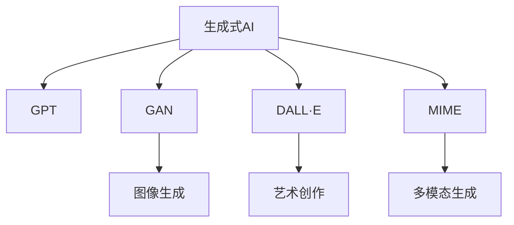

                 

# 生成式AIGC是金矿还是泡沫：未来十年AIGC会把所有软件、消费电子和消费端的应用都重新做一遍

## 1. 背景介绍

### 1.1 问题由来

人工智能（AI）已经成为我们生活中不可或缺的一部分，其中，生成式人工智能（AIGC，Generative AI）尤其引人注目。AIGC 是指使用深度学习技术生成新内容的系统，包括图像、音频、文本等。近年来，随着深度学习算法的进步，AIGC 在创意产业、游戏、广告、设计等领域取得了巨大成功，引起了广泛关注。

### 1.2 问题核心关键点

AIGC 的兴起引发了一系列思考：这种技术到底能带来哪些革命性改变？它能成为真正的“金矿”，还是只是一种“泡沫”？在未来十年内，AIGC 能否将软件、消费电子和消费端的应用全部重新定义？本文将围绕这些关键问题展开深入探讨。

### 1.3 问题研究意义

探讨 AIGC 的未来发展，对于理解这一技术的潜力和局限，指导产业界应用 AIGC 技术，具有重要意义。理解 AIGC 的商业价值、技术挑战和应用前景，有助于我们把握这一变革性技术的未来趋势，制定合理的策略，推动 AIGC 技术的健康发展。

## 2. 核心概念与联系

### 2.1 核心概念概述

为了更好地理解 AIGC 的原理和应用，我们先介绍几个核心概念：

- **生成式AI**：使用深度学习模型生成新内容的技术，包括文本生成、图像生成、音频生成等。
- **GPT（Generative Pre-trained Transformer）**：一种基于 Transformer 架构的深度学习模型，用于生成自然语言文本。
- **GAN（Generative Adversarial Networks）**：一种生成模型，通过对抗训练方式生成逼真图像、音频等。
- **DALL·E**：OpenAI 开发的一个生成模型，可以生成高质量的图像，用于艺术创作、游戏设计等。
- **MIME**：用于多模态生成任务，结合文本、图像、音频等多种输入生成新内容。

这些概念之间的逻辑关系可以通过以下 Mermaid 流程图来展示：



这个流程图展示了 AIGC 的关键组件及其之间的关系：

1. AIGC 以生成式AI为基础，通过深度学习模型生成新内容。
2. GPT、GAN、DALL·E、MIME 等是 AIGC 的主要实现技术，分别应用于自然语言处理、图像生成、多模态生成等领域。
3. 图像生成、艺术创作、多模态生成等是 AIGC 的重要应用场景。

### 2.2 核心概念原理和架构

AIGC 的核心原理是通过深度学习模型，将大量无标注数据转化为有意义的生成式内容。其架构通常包括以下几个部分：

- **编码器（Encoder）**：将输入数据转化为高维表示，捕捉数据的语义和特征。
- **解码器（Decoder）**：根据编码器的输出，生成新的内容。
- **生成器（Generator）**：通过对抗训练等方式，生成逼真、高质量的内容。

以 GPT 为例，其架构如下：

```
Encoder -> Attention -> Self-Attention -> Feedforward Network -> Layer Normalization -> Softmax
```

GPT 使用自注意力机制，捕捉输入文本的语义关系，并通过多层的 Transformer 架构，逐步生成新的文本内容。GAN 则通过两个神经网络（生成器和判别器）的对抗训练，生成逼真的图像。

## 3. 核心算法原理 & 具体操作步骤

### 3.1 算法原理概述

AIGC 的算法原理主要基于生成式深度学习模型。这些模型通过无监督或半监督学习方式，学习生成式任务（如文本生成、图像生成、音频生成等）的复杂分布。常用的算法包括：

- **变分自编码器（VAE）**：通过生成变分分布来建模数据的潜在变量，用于生成新数据。
- **生成对抗网络（GAN）**：通过对抗训练方式，生成高质量的生成数据。
- **自回归模型（AR）**：使用自回归方式，逐字生成文本。
- **自编码器（AE）**：将输入数据压缩为低维表示，再通过解码器还原生成原始数据。

### 3.2 算法步骤详解

以 GPT 为例，其微调步骤如下：

1. **数据准备**：收集用于训练的文本数据，并划分为训练集、验证集和测试集。
2. **模型初始化**：加载预训练的 GPT 模型，设定超参数。
3. **前向传播**：将训练数据输入模型，计算损失函数。
4. **反向传播**：根据损失函数计算梯度，更新模型参数。
5. **参数调整**：根据验证集性能，调整学习率、批大小等超参数。
6. **测试评估**：在测试集上评估模型性能，输出结果。

### 3.3 算法优缺点

AIGC 的主要优点包括：

- **高效生成**：能够快速生成高质量的文本、图像等内容，提高内容创作效率。
- **广泛应用**：在创意产业、游戏、广告等领域有广泛应用。
- **高自由度**：用户可以自由定制生成内容，满足个性化需求。

但其缺点也不容忽视：

- **数据依赖**：需要大量高质量的数据进行训练，数据质量直接影响生成效果。
- **版权问题**：生成内容可能存在版权争议。
- **内容偏见**：生成内容可能带有偏见，影响其广泛适用性。

### 3.4 算法应用领域

AIGC 技术已经在多个领域得到广泛应用：

- **创意产业**：用于电影特效、游戏设计、艺术创作等，极大地提高了创作效率和效果。
- **广告营销**：用于生成创意广告内容，优化广告投放策略。
- **新闻媒体**：用于生成新闻报道、评论等内容，提高新闻生产效率。
- **教育和培训**：用于生成个性化教育内容，提高学习效果。
- **金融领域**：用于生成市场分析报告、模拟交易策略等。

## 4. 数学模型和公式 & 详细讲解 & 举例说明

### 4.1 数学模型构建

AIGC 的数学模型通常基于深度学习框架，使用复杂的神经网络结构。以 GPT 为例，其数学模型包括：

- **输入层**：输入文本或图像数据，转换为词嵌入或像素嵌入。
- **编码器**：通过多层 Transformer 层，捕捉输入数据的语义关系。
- **解码器**：根据编码器的输出，生成新的文本或图像。

### 4.2 公式推导过程

以 GPT 为例，其训练过程的公式推导如下：

1. **损失函数**：

   $$
   \mathcal{L} = -\sum_{i=1}^N \log \hat{y}_i
   $$

   其中，$\hat{y}_i$ 是模型预测的文本概率分布，$y_i$ 是真实标签。

2. **梯度计算**：

   $$
   \frac{\partial \mathcal{L}}{\partial \theta} = -\sum_{i=1}^N \frac{\partial \log \hat{y}_i}{\partial \theta}
   $$

   其中，$\theta$ 是模型的参数，可以通过反向传播算法计算梯度。

3. **参数更新**：

   $$
   \theta \leftarrow \theta - \eta \frac{\partial \mathcal{L}}{\partial \theta}
   $$

   其中，$\eta$ 是学习率。

### 4.3 案例分析与讲解

以 GPT-3 为例，其生成文本的案例如下：

- **任务**：生成一篇关于 AI 的科技文章。
- **输入**：一些种子文本和关键词。
- **输出**：高质量的科技文章，内容涵盖 AI 的最新发展、应用场景等。
- **分析**：GPT-3 通过学习大量的文本数据，捕捉了语言的语法和语义规则，能够在给定种子文本和关键词的情况下，生成高质量的文本内容。

## 5. 项目实践：代码实例和详细解释说明

### 5.1 开发环境搭建

为了实现 AIGC 项目，需要以下开发环境：

1. **Python 环境**：安装 Python 3.x，推荐使用虚拟环境。
2. **深度学习框架**：安装 TensorFlow、PyTorch、MXNet 等深度学习框架。
3. **模型库**：安装相应的生成式模型库，如 GPT、GAN、VAE 等。
4. **工具包**：安装 Numpy、Pandas、Matplotlib 等工具包。

### 5.2 源代码详细实现

以下是一个使用 PyTorch 实现 GPT 模型的代码示例：

```python
import torch
import torch.nn as nn
import torch.optim as optim

class GPT(nn.Module):
    def __init__(self, vocab_size, embedding_dim, hidden_dim, num_layers, max_len):
        super(GPT, self).__init__()
        self.embedding = nn.Embedding(vocab_size, embedding_dim)
        self.layers = nn.ModuleList([nn.TransformerLayer(embedding_dim, num_heads=8, dim_feedforward=2048) for _ in range(num_layers)])
        self.projection = nn.Linear(embedding_dim, vocab_size)
        self.max_len = max_len
    
    def forward(self, input, target=None):
        embedding = self.embedding(input)
        hidden = [embedding]
        for layer in self.layers:
            hidden.append(layer(hidden[-1], attention_mask=None))
        hidden[-1] = self.projection(hidden[-1])
        return hidden[-1]

# 训练 GPT 模型
model = GPT(vocab_size=10000, embedding_dim=256, hidden_dim=1024, num_layers=12, max_len=1024)
optimizer = optim.Adam(model.parameters(), lr=0.001)
loss_fn = nn.CrossEntropyLoss()

input = torch.randint(0, vocab_size, (batch_size, max_len))
target = torch.randint(0, vocab_size, (batch_size, max_len))

for epoch in range(num_epochs):
    optimizer.zero_grad()
    output = model(input, target)
    loss = loss_fn(output, target)
    loss.backward()
    optimizer.step()
```

### 5.3 代码解读与分析

以上代码实现了 GPT 模型的前向传播和反向传播。其中，`nn.Embedding` 用于将输入数据转换为词嵌入，`nn.TransformerLayer` 用于实现 Transformer 层的计算，`nn.Linear` 用于输出层的计算。在训练过程中，使用 Adam 优化器进行参数更新，使用交叉熵损失函数进行计算。

## 6. 实际应用场景

### 6.1 创意产业

在创意产业中，AIGC 技术可以用于电影特效、游戏设计、艺术创作等领域。例如，DALL·E 可以通过生成逼真的图像，为游戏设计提供高质量的素材，或用于电影特效的快速制作。

### 6.2 广告营销

AIGC 技术可以生成创意广告内容，提高广告的吸引力。例如，通过 GAN 生成逼真的广告图像，或使用 GPT 生成吸引人的广告文案。

### 6.3 新闻媒体

在新闻媒体领域，AIGC 技术可以用于生成新闻报道、评论等内容。例如，通过 GPT 生成高质量的新闻文章，提高新闻生产效率。

### 6.4 教育和培训

AIGC 技术可以用于生成个性化教育内容，提高学习效果。例如，使用 GPT 生成个性化的学习资料和练习题。

### 6.5 金融领域

AIGC 技术可以用于生成市场分析报告、模拟交易策略等。例如，通过 GPT 生成关于金融市场的分析报告，帮助投资者做出更明智的决策。

## 7. 工具和资源推荐

### 7.1 学习资源推荐

为了帮助开发者学习 AIGC 技术，我们推荐以下学习资源：

1. **Coursera**：提供深度学习、自然语言处理等领域的课程。
2. **Kaggle**：提供数据科学竞赛和机器学习项目，可以练习 AIGC 技术的应用。
3. **arXiv**：最新的人工智能研究成果，可以了解 AIGC 技术的最新进展。
4. **GitHub**：开放源代码项目，可以学习和复现 AIGC 技术。

### 7.2 开发工具推荐

以下是一些用于 AIGC 开发的常用工具：

1. **Jupyter Notebook**：用于编写和执行代码，支持互动式编程。
2. **TensorBoard**：可视化训练过程和模型性能，帮助调试和优化模型。
3. **PyTorch Lightning**：简化模型训练和部署，提高开发效率。
4. **ModelScope**：提供预训练模型和工具，加速模型训练和部署。

### 7.3 相关论文推荐

以下是一些关于 AIGC 技术的经典论文，推荐阅读：

1. **Attention is All You Need**：Transformer 论文，介绍 Transformer 架构的原理和应用。
2. **Language Models are Unsupervised Multitask Learners**：提出 GPT 模型，通过自监督学习生成文本。
3. **DiscoGAN**：提出 DiscoGAN 模型，用于生成逼真的图像。
4. **Data2Text**：提出 Data2Text 模型，用于生成文本摘要。
5. **MIME**：提出 MIME 模型，用于多模态生成任务。

## 8. 总结：未来发展趋势与挑战

### 8.1 未来发展趋势

未来十年，AIGC 技术有望迎来更多突破，其主要发展趋势包括：

1. **多模态融合**：结合图像、音频、文本等多模态数据，生成更加逼真的内容。
2. **跨领域应用**：将 AIGC 技术应用于更多领域，如医疗、教育、金融等。
3. **生成式编程**：通过生成式编程，自动生成代码、文档等。
4. **实时生成**：通过实时生成技术，提高内容创作效率。
5. **可解释性**：提高生成内容的可解释性，增强用户的信任感。

### 8.2 面临的挑战

尽管 AIGC 技术前景广阔，但仍面临以下挑战：

1. **数据质量**：生成内容的质量高度依赖于训练数据的质量，需要大量的高质量数据进行训练。
2. **版权问题**：生成内容可能存在版权争议，需要明确版权归属。
3. **内容偏见**：生成内容可能带有偏见，需要避免伦理问题。
4. **性能瓶颈**：大规模生成任务需要高效的计算资源，需要优化性能瓶颈。
5. **安全性**：生成内容可能被恶意利用，需要加强安全性。

### 8.3 未来突破

为了克服 AIGC 技术面临的挑战，未来的研究需要在以下几个方面寻求新的突破：

1. **数据增强技术**：通过数据增强技术，生成更多高质量的数据。
2. **跨领域迁移学习**：通过跨领域迁移学习，提高生成内容的通用性。
3. **生成式编程语言**：开发生成式编程语言，实现自动化编程。
4. **实时生成框架**：开发实时生成框架，提高生成效率。
5. **可解释性算法**：开发可解释性算法，提高生成内容的可解释性。

## 9. 附录：常见问题与解答

### Q1：AIGC 技术对创意产业有何影响？

A: AIGC 技术可以极大地提高创意产业的效率和效果。例如，通过生成逼真的图像和视频，提高游戏设计和电影特效的制作效率。

### Q2：如何避免 AIGC 生成内容中的偏见？

A: 通过引入多样化的训练数据和公平性约束，避免生成内容中的偏见。例如，使用无偏的数据集进行训练，并对模型输出进行公平性评估。

### Q3：AIGC 技术在未来应用中有哪些局限？

A: AIGC 技术在未来应用中可能面临数据依赖、版权问题、内容偏见等挑战。需要加强数据管理和版权保护，提高生成内容的公平性和安全性。

### Q4：AIGC 技术在未来应用中是否有风险？

A: AIGC 技术的应用可能带来隐私和安全风险。例如，生成虚假信息可能误导公众，需要加强隐私保护和安全监管。

---

作者：禅与计算机程序设计艺术 / Zen and the Art of Computer Programming

