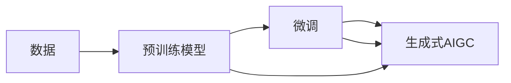

                 

# 生成式AIGC是金矿还是泡沫：第三部分：更重要的是数据

## 1. 背景介绍

随着生成式人工智能（Generative AI）的快速发展，人们对于生成式AIGC技术的热情不断升温。无论是文本生成、图像生成、音乐创作，还是3D建模，生成式AIGC都已经在各个领域展现出了令人瞩目的能力。然而，在这股热潮的背后，也存在诸多争议和质疑：生成式AIGC真的能产生有价值的内容吗？是否只是概念炒作？本部分将深入探讨生成式AIGC的核心价值与关键问题，并重点强调数据的重要性。

## 2. 核心概念与联系

### 2.1 核心概念概述

生成式AIGC（Generative AI-based Content Generation）是指利用生成式AI模型生成具有高度真实感和创造力的内容的先进技术。与传统的基于规则的内容生成方法相比，生成式AIGC能够从大规模数据中学习到复杂的模式和关系，进而生成更具多样性和创造性的内容。

### 2.2 核心概念原理和架构的 Mermaid 流程图



这个流程图展示了生成式AIGC的核心架构：数据通过预训练模型进行学习，并在微调阶段进行适应性调整，最终输出高质量的生成内容。

## 3. 核心算法原理 & 具体操作步骤

### 3.1 算法原理概述

生成式AIGC的原理主要基于深度学习模型，特别是基于Transformer架构的生成模型。这类模型通过大量无标签数据进行预训练，学习到语言或图像等数据的复杂分布。然后，通过微调过程，模型能够针对特定任务进行适应性调整，从而生成符合要求的内容。

### 3.2 算法步骤详解

#### 3.2.1 数据预处理

数据预处理是生成式AIGC的重要步骤。数据通常需要进行清洗、标注、划分等预处理，以便于模型的训练和评估。

- **数据清洗**：去除数据中的噪声、重复或异常值，保证数据的质量。
- **数据标注**：为数据打上标签，如文本分类、图像识别等。
- **数据划分**：将数据划分为训练集、验证集和测试集，用于模型训练、调参和评估。

#### 3.2.2 模型预训练

预训练阶段，模型通过大规模无标签数据进行自监督学习，学习到通用的语言或图像分布。

- **Transformer预训练**：使用Transformer架构的模型，如GPT、BERT等，在大规模文本语料上进行预训练。
- **自监督学习**：通过掩码语言模型、预测下一段、预测下一个词等自监督任务，模型学习到语言的隐含规律。

#### 3.2.3 微调

微调阶段，模型通过有标签数据进行监督学习，适应特定任务的要求。

- **任务适配**：根据生成任务设计适合的输出层和损失函数。
- **参数更新**：使用Adam等优化算法，更新模型参数以最小化损失函数。
- **性能评估**：在验证集上评估模型性能，调整超参数和模型结构。

#### 3.2.4 生成与后处理

生成式AIGC的最终目的是生成高质量的内容。

- **内容生成**：输入一定的种子数据，模型生成符合要求的内容。
- **后处理**：对生成的内容进行必要的格式化、校正等后处理，确保输出的质量。

### 3.3 算法优缺点

#### 3.3.1 优点

1. **高效生成**：生成式AIGC能够快速生成大量高质量的内容，大大提升内容创作的效率。
2. **多样性**：模型可以生成多种风格、多种主题的内容，具有高度的多样性。
3. **低成本**：相比于人工创作，生成式AIGC的生成成本相对较低，尤其是在内容量大的场景中。

#### 3.3.2 缺点

1. **质量参差不齐**：模型生成的内容质量受数据质量影响较大，有时会出现语法错误、逻辑不通等问题。
2. **伦理风险**：生成内容可能包含偏见、歧视、虚假信息等，存在一定的伦理风险。
3. **依赖高质量数据**：生成式AIGC依赖高质量、大规模的数据进行训练，数据获取和处理成本较高。

### 3.4 算法应用领域

生成式AIGC在多个领域都展现出了强大的应用潜力，包括但不限于：

- **内容创作**：新闻写作、小说创作、博客文章等。
- **图像生成**：摄影、插画、广告设计等。
- **音乐创作**：作曲、编曲、音乐生成等。
- **3D建模**：虚拟现实、游戏设计、建筑可视化等。

## 4. 数学模型和公式 & 详细讲解 & 举例说明

### 4.1 数学模型构建

生成式AIGC的核心模型是生成模型，以Transformer为代表的神经网络生成模型是其主要形式。这里简要介绍Transformer模型的基本结构。

Transformer模型由编码器和解码器组成，编码器对输入序列进行编码，解码器对编码结果进行解码，生成目标序列。其核心是自注意力机制，通过计算输入序列中每个位置与其他位置的注意力权重，得到每个位置的表示。

### 4.2 公式推导过程

Transformer模型的核心公式为：

$$
\text{Attention}(Q, K, V) = \text{Softmax}(\frac{QK^T}{\sqrt{d_k}})V
$$

其中，$Q$、$K$、$V$分别为查询矩阵、键矩阵、值矩阵，$d_k$为键的维数。注意力机制通过计算相似度，将输入序列中每个位置与所有位置的相关性加权，得到每个位置的表示。

### 4.3 案例分析与讲解

以BERT为例，其在预训练过程中，通过掩码语言模型（Masked Language Model, MLM）和下一句预测（Next Sentence Prediction, NSP）两种任务进行训练。MLM任务随机掩码输入序列中的某些词，模型需要预测被掩码的词。NSP任务是预测两个句子是否连续。这两个任务帮助BERT学习到语言的隐含规律和语义关系。

## 5. 项目实践：代码实例和详细解释说明

### 5.1 开发环境搭建

本节将介绍使用Python和PyTorch进行生成式AIGC开发的常见环境配置。

#### 5.1.1 安装PyTorch

首先需要安装PyTorch：

```bash
pip install torch torchvision torchaudio
```

#### 5.1.2 安装相关库

为了进行数据预处理和模型训练，还需要安装一些常用的Python库：

```bash
pip install numpy pandas scikit-learn transformers
```

### 5.2 源代码详细实现

以文本生成为例，介绍如何使用PyTorch实现生成式AIGC。

```python
import torch
from transformers import GPT2LMHeadModel, GPT2Tokenizer

tokenizer = GPT2Tokenizer.from_pretrained('gpt2')

model = GPT2LMHeadModel.from_pretrained('gpt2')

input_ids = tokenizer("Hello, world!", return_tensors="pt").input_ids
outputs = model.generate(input_ids)
decoded_output = tokenizer.decode(outputs[0])
print(decoded_output)
```

### 5.3 代码解读与分析

上述代码中，首先使用GPT-2模型和对应的分词器。然后，将输入文本进行分词，转换为模型需要的形式。最后，使用`generate`方法生成文本，并通过分词器将生成的数字序列转换为文本。

### 5.4 运行结果展示

运行上述代码，可以得到类似于"Hello, GPT-2!"的输出，展示了生成式AIGC的基本功能。

## 6. 实际应用场景

### 6.1 内容创作

生成式AIGC在内容创作方面有广泛应用，如新闻报道、小说创作、社交媒体帖子等。通过生成式AIGC，内容创作者可以加速内容生成过程，提升内容质量和多样性。

#### 6.1.1 新闻报道

在新闻报道中，生成式AIGC可以快速生成大量新闻稿件，帮助媒体机构快速响应突发事件。例如，使用生成式AIGC生成地震、火灾等紧急新闻，可以及时向公众传达重要信息。

#### 6.1.2 小说创作

小说创作中，生成式AIGC可以自动生成章节、段落，甚至完整的故事情节。例如，使用生成式AIGC生成小说的背景设定、人物关系等，可以为小说创作提供初步的框架和灵感。

#### 6.1.3 社交媒体帖子

社交媒体帖子需要快速、多样化，生成式AIGC可以帮助内容创作者生成多种风格、多种主题的帖子。例如，使用生成式AIGC生成时事评论、搞笑段子等，可以快速吸引用户关注。

### 6.2 图像生成

生成式AIGC在图像生成方面也有广泛应用，如摄影、插画、广告设计等。

#### 6.2.1 摄影

在摄影领域，生成式AIGC可以自动生成高质量的摄影作品。例如，使用生成式AIGC生成自然风光、城市景观等，可以快速生成大量素材，提升摄影创作效率。

#### 6.2.2 插画

插画创作中，生成式AIGC可以自动生成角色、场景、道具等。例如，使用生成式AIGC生成漫画角色、动画场景等，可以提升插画创作的速度和质量。

#### 6.2.3 广告设计

广告设计中，生成式AIGC可以自动生成海报、广告语等。例如，使用生成式AIGC生成产品广告、促销海报等，可以提升广告设计的多样性和创意性。

### 6.3 音乐创作

生成式AIGC在音乐创作方面也有广泛应用，如作曲、编曲、音乐生成等。

#### 6.3.1 作曲

作曲创作中，生成式AIGC可以自动生成乐曲的旋律、和弦等。例如，使用生成式AIGC生成流行音乐、古典音乐等，可以快速生成大量乐曲素材，提升作曲创作的速度和质量。

#### 6.3.2 编曲

编曲创作中，生成式AIGC可以自动生成乐曲的配器、编曲等。例如，使用生成式AIGC生成乐队编曲、弦乐编曲等，可以提升编曲创作的多样性和创意性。

#### 6.3.3 音乐生成

音乐生成中，生成式AIGC可以自动生成完整的乐曲。例如，使用生成式AIGC生成独奏乐曲、合唱乐曲等，可以提升音乐创作的多样性和创意性。

### 6.4 3D建模

生成式AIGC在3D建模方面也有广泛应用，如虚拟现实、游戏设计、建筑可视化等。

#### 6.4.1 虚拟现实

虚拟现实中，生成式AIGC可以自动生成虚拟场景、虚拟角色等。例如，使用生成式AIGC生成虚拟旅游景区、虚拟购物场所等，可以提升虚拟现实的沉浸感和体验性。

#### 6.4.2 游戏设计

游戏设计中，生成式AIGC可以自动生成游戏角色、游戏场景等。例如，使用生成式AIGC生成角色模型、场景模型等，可以提升游戏设计的丰富性和创意性。

#### 6.4.3 建筑可视化

建筑可视化中，生成式AIGC可以自动生成建筑模型、城市规划等。例如，使用生成式AIGC生成城市规划方案、建筑模型等，可以提升建筑设计的多样性和创意性。

## 7. 工具和资源推荐

### 7.1 学习资源推荐

为了帮助开发者系统掌握生成式AIGC的理论基础和实践技巧，这里推荐一些优质的学习资源：

1. **《深度学习》（Ian Goodfellow）**：这本书详细介绍了深度学习的基本概念和算法，是生成式AIGC的入门必读。
2. **Coursera的《Generative Adversarial Nets》课程**：由Goodfellow等知名学者授课，深入浅出地介绍了生成对抗网络（GAN）的基本原理和应用。
3. **ArXiv上的生成式AIGC论文**：通过阅读最新的生成式AIGC论文，了解前沿研究动态和应用案例。
4. **Hugging Face官方文档**：Hugging Face的Transformer库提供了丰富的预训练模型和微调样例，是进行生成式AIGC开发的必备资料。

### 7.2 开发工具推荐

高效的开发离不开优秀的工具支持。以下是几款用于生成式AIGC开发的常用工具：

1. **PyTorch**：基于Python的开源深度学习框架，灵活动态的计算图，适合快速迭代研究。
2. **TensorFlow**：由Google主导开发的开源深度学习框架，生产部署方便，适合大规模工程应用。
3. **Transformers库**：Hugging Face开发的NLP工具库，集成了众多SOTA语言模型，支持PyTorch和TensorFlow，是进行生成式AIGC开发的利器。
4. **Weights & Biases**：模型训练的实验跟踪工具，可以记录和可视化模型训练过程中的各项指标，方便对比和调优。
5. **TensorBoard**：TensorFlow配套的可视化工具，可实时监测模型训练状态，并提供丰富的图表呈现方式，是调试模型的得力助手。

### 7.3 相关论文推荐

生成式AIGC的快速发展离不开学界的持续研究。以下是几篇奠基性的相关论文，推荐阅读：

1. **Generative Adversarial Networks（GANs）**：Goodfellow等人在2014年提出的生成对抗网络，开创了生成式AI的先河。
2. **Attention is All You Need**：Vaswani等人在2017年提出的Transformer模型，为生成式AIGC提供了新的范式。
3. **BERT: Pre-training of Deep Bidirectional Transformers for Language Understanding**：Devlin等人于2018年提出的BERT模型，为自然语言处理提供了新的预训练范式。
4. **GPT-3: Language Models are Unsupervised Multitask Learners**：Brown等人于2020年提出的GPT-3模型，展示了大规模语言模型的强大能力。
5. **DALL-E: A DALL-JEETS-Type Architecture for Generative Image Synthesis**：Russakovsky等人于2021年提出的DALL-E模型，展示了生成式AIGC在图像生成方面的突破。

## 8. 总结：未来发展趋势与挑战

### 8.1 研究成果总结

生成式AIGC技术的快速发展，带来了内容创作、图像生成、音乐创作、3D建模等方面的巨大变革。通过深度学习模型和大规模数据的学习，生成式AIGC能够生成高质量、多样化的内容，极大地提升了内容创作的效率和质量。

### 8.2 未来发展趋势

未来，生成式AIGC技术将继续快速发展，展现出更多的应用潜力：

1. **内容创作自动化**：生成式AIGC将进一步提升内容创作的自动化水平，加速新闻报道、小说创作、社交媒体帖子等内容的生成。
2. **图像生成逼真化**：生成式AIGC将进一步提升图像生成的逼真度和多样性，广泛应用于摄影、插画、广告设计等场景。
3. **音乐创作多样化**：生成式AIGC将进一步提升音乐创作的丰富性和多样性，广泛应用于作曲、编曲、音乐生成等场景。
4. **3D建模沉浸化**：生成式AIGC将进一步提升3D建模的沉浸度和体验感，广泛应用于虚拟现实、游戏设计、建筑可视化等场景。

### 8.3 面临的挑战

尽管生成式AIGC技术取得了显著进展，但在实际应用中仍面临诸多挑战：

1. **数据获取成本高**：生成式AIGC依赖高质量、大规模的数据进行训练，数据获取和处理成本较高。
2. **内容质量不稳定**：生成内容的质量受数据质量影响较大，有时会出现语法错误、逻辑不通等问题。
3. **伦理和法律风险**：生成内容可能包含偏见、歧视、虚假信息等，存在一定的伦理和法律风险。
4. **模型复杂度高**：生成式AIGC模型复杂度高，计算资源和存储资源消耗较大，实际部署面临挑战。

### 8.4 研究展望

未来的研究应在以下几个方面进行深入探索：

1. **数据增强**：通过数据增强技术，提升生成内容的多样性和丰富性。
2. **模型压缩**：通过模型压缩技术，减小模型尺寸，降低计算资源和存储资源消耗。
3. **伦理保障**：在生成式AIGC模型的训练和应用中，加入伦理导向的评估指标，过滤和惩罚有害内容，保障模型输出安全。
4. **跨领域应用**：将生成式AIGC技术应用于更多领域，如医疗、法律、金融等，拓展其应用范围。
5. **人机协同**：结合人机协同机制，提升生成内容的质量和可解释性，增强用户信任。

通过不断探索和优化，生成式AIGC技术必将在更多领域发挥重要作用，成为推动人工智能技术发展的重要力量。

## 9. 附录：常见问题与解答

### Q1：生成式AIGC生成的内容质量如何保证？

A：生成式AIGC生成的内容质量受数据质量、模型结构、训练过程等多种因素影响。为保证生成内容的质量，可以采取以下措施：

1. **数据清洗**：对数据进行清洗和标注，去除噪声和异常值，保证数据质量。
2. **模型微调**：对模型进行微调，针对特定任务进行适应性调整，提升生成质量。
3. **后处理**：对生成的内容进行后处理，如校正语法错误、优化逻辑结构等，提升生成质量。
4. **人工审核**：对生成内容进行人工审核，确保生成内容符合伦理和法律要求。

### Q2：生成式AIGC生成的内容是否存在偏见和歧视？

A：生成式AIGC生成的内容可能存在偏见和歧视问题。为避免这些问题，可以采取以下措施：

1. **数据多样性**：使用多样化的数据进行训练，减少数据偏见的影响。
2. **模型公平性**：在模型训练中引入公平性评估指标，过滤和惩罚有害内容。
3. **人工干预**：对生成内容进行人工干预，确保生成内容符合伦理和法律要求。

### Q3：生成式AIGC是否存在版权问题？

A：生成式AIGC生成的内容可能存在版权问题。为避免版权问题，可以采取以下措施：

1. **开源数据**：使用开源数据进行训练，避免版权纠纷。
2. **合理使用**：在使用生成内容时，确保遵守版权法规，不侵犯他人权益。
3. **版权声明**：在生成内容的版权声明中明确版权归属，避免版权纠纷。

### Q4：生成式AIGC的生成效率如何提升？

A：提升生成式AIGC的生成效率可以采取以下措施：

1. **模型压缩**：通过模型压缩技术，减小模型尺寸，降低计算资源和存储资源消耗。
2. **硬件加速**：使用GPU、TPU等高性能硬件，提升模型训练和推理效率。
3. **分布式训练**：通过分布式训练技术，加速模型训练过程。
4. **数据预处理**：对数据进行预处理，提高数据处理效率。

### Q5：生成式AIGC的应用场景有哪些？

A：生成式AIGC在多个领域都有广泛应用，包括但不限于：

1. **内容创作**：新闻报道、小说创作、社交媒体帖子等。
2. **图像生成**：摄影、插画、广告设计等。
3. **音乐创作**：作曲、编曲、音乐生成等。
4. **3D建模**：虚拟现实、游戏设计、建筑可视化等。

总之，生成式AIGC技术具有广阔的应用前景，将在内容创作、图像生成、音乐创作、3D建模等多个领域发挥重要作用，推动人工智能技术的发展。

---

作者：禅与计算机程序设计艺术 / Zen and the Art of Computer Programming

