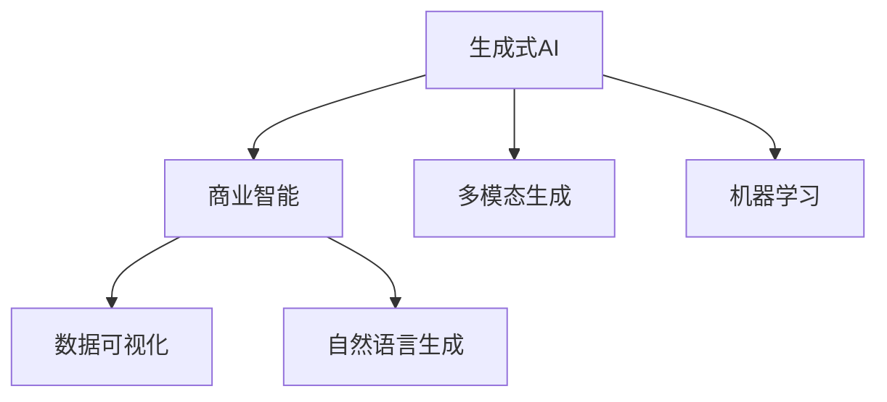

                 

## 1. 背景介绍

### 1.1 问题由来
随着大数据和云计算技术的发展，商业智能(Business Intelligence, BI)在企业决策过程中扮演着越来越重要的角色。然而，传统的BI工具往往依赖于数据仓库、复杂的数据挖掘算法和固定的报表模板，难以适应日益复杂的商业环境。在实时数据流、数据集成和数据可视化的需求不断增加的背景下，传统的BI工具在效率和灵活性方面面临着巨大挑战。

### 1.2 问题核心关键点
为了应对这些挑战，商业智能领域亟需引入新一代的技术手段。生成式人工智能(Generative AI, GAI)因其强大的数据生成和交互能力，逐渐成为构建下一代商业智能系统的关键技术。生成式AI能够自动创建图表、报表、可视化分析等，甚至能够生成多模态的内容，如文本、图像、音频等，为商业智能系统带来革命性的变革。

### 1.3 问题研究意义
生成式AI技术在商业智能中的应用，将极大地提升数据处理和分析的效率，使决策者能够更快地获取洞察并作出更加精准的决策。生成式AI还能够在复杂多变的商业场景中，提供更灵活、更智能的交互方式，优化用户体验，增强商业智能系统的可扩展性和适应性。

## 2. 核心概念与联系

### 2.1 核心概念概述

为更好地理解生成式AI在商业智能中的应用，本节将介绍几个密切相关的核心概念：

- 生成式人工智能(Generative AI, GAI)：指能够从少量数据样本中生成符合目标分布的新数据样本的AI技术。GAI包括但不限于生成对抗网络(GANs)、变分自编码器(VAEs)、自回归模型(如GPT系列)等。

- 商业智能(Business Intelligence, BI)：通过数据收集、清洗、分析和可视化等技术手段，帮助企业从数据中提取商业洞察、优化决策的智能工具。

- 数据可视化(Data Visualization)：将数据转化为直观的图形、图表和动画，帮助用户理解数据背后的规律和趋势。

- 自然语言生成(Natural Language Generation, NLG)：自动将数据转化为自然语言文本，便于人们理解和使用。

- 多模态生成(Multimodal Generation)：结合文本、图像、音频等多种数据形式，生成具有视觉、听觉等多感官体验的内容。

这些核心概念之间的逻辑关系可以通过以下Mermaid流程图来展示：



这个流程图展示了生成式AI与商业智能之间的内在联系，以及其在数据可视化、自然语言生成、多模态生成等多个领域的应用。

## 3. 核心算法原理 & 具体操作步骤
### 3.1 算法原理概述

生成式AI在商业智能中的应用，本质上是利用生成模型对原始数据进行重构和生成，从而在可视化、自然语言生成、多模态生成等方面提供更灵活、更智能的解决方案。常见的生成模型包括：

- 生成对抗网络(GANs)：通过对抗性训练，生成逼真且与真实数据分布一致的新数据样本。
- 变分自编码器(VAEs)：通过潜在变量分布的训练，生成新的数据样本，并可以通过解码器将潜在变量映射回原始数据空间。
- 自回归模型(如GPT系列)：利用大量文本数据进行自监督训练，生成符合语言规则的新文本。

在商业智能中，生成式AI的应用主要包括：

- 自动生成商业报表：利用生成模型根据数据自动生成详细的报表和图表。
- 自然语言描述：自动生成商业报告的摘要、说明和建议。
- 多模态交互：结合文本、图像、音频等多种数据形式，生成多感官体验的商业内容。
- 数据增强：生成更多的训练数据，用于训练和优化商业智能模型。

### 3.2 算法步骤详解

生成式AI在商业智能中的应用，通常分为以下几个关键步骤：

**Step 1: 准备数据集和任务定义**
- 收集商业智能任务所需的数据集，包括原始数据、标注数据等。
- 定义生成任务的目标和约束条件，如生成报表格式、报告摘要长度等。

**Step 2: 选择生成模型**
- 根据任务需求选择合适的生成模型，如GANs、VAEs、GPT等。
- 确定模型架构和超参数，包括生成器的隐状态维度、对抗网络结构等。

**Step 3: 数据预处理**
- 对原始数据进行清洗、归一化和标准化处理。
- 对于文本数据，进行分词、标记化和编码。

**Step 4: 生成样本**
- 使用训练好的生成模型，生成与原始数据分布一致的新样本。
- 对于需要结构化输出的任务，如报表，生成模型需学习生成符合特定格式的文本。
- 对于需要多模态输出的任务，生成模型需结合文本、图像、音频等多种数据形式进行生成。

**Step 5: 评估和优化**
- 通过人工评估或自动评估指标，对生成的样本进行评估。
- 根据评估结果，调整生成模型的参数，优化生成效果。
- 重复上述步骤，直至生成效果满足任务需求。

### 3.3 算法优缺点

生成式AI在商业智能中的应用，具有以下优点：
1. 数据生成能力强：生成式AI能够自动生成丰富的数据内容，提升数据多样性，降低人工数据标注成本。
2. 提高数据可视化效果：通过生成式AI生成图表、报表等，使得数据展示更加直观、生动。
3. 增强自然语言交互体验：自动生成自然语言描述，提升用户与商业智能系统的交互体验。
4. 多模态数据融合：结合文本、图像、音频等多种数据形式，生成多感官体验的内容，提升用户体验。

同时，该方法也存在一定的局限性：
1. 生成样本质量不稳定：生成式AI生成的样本质量受训练数据和模型参数的影响较大，难以完全保证样本的真实性。
2. 生成速度较慢：生成式AI模型通常较为复杂，训练和生成过程耗时较长。
3. 缺乏个性化定制：生成式AI模型缺乏个性化设计能力，难以完全满足特定任务的需求。
4. 生成效果依赖于数据质量：生成式AI模型的生成效果很大程度上取决于输入数据的噪声和结构化程度。

尽管存在这些局限性，但就目前而言，生成式AI在商业智能中的应用范式正日益成熟，并逐渐成为推动商业智能技术发展的关键动力。

### 3.4 算法应用领域

生成式AI在商业智能中的应用领域极为广泛，以下是几个典型的应用场景：

- **自动生成商业报表**：利用生成式AI自动生成商业报表，快速完成数据分析和可视化。例如，自动生成销售报告、财务报告等。
- **生成报告摘要**：自动提取和总结报告的关键信息，生成简洁的报告摘要，方便用户快速了解报告要点。
- **多模态商业内容生成**：结合文本、图像、音频等多种数据形式，生成多感官体验的商业内容。例如，生成包含图像和音频的广告宣传片。
- **数据增强和模型优化**：利用生成式AI生成更多的训练数据，用于训练和优化商业智能模型。
- **智能问答系统**：结合自然语言生成和对话系统技术，自动回答用户关于商业智能的常见问题，提升用户体验。

此外，生成式AI还被创新性地应用于企业风险评估、市场预测、供应链优化等多个商业智能领域，为企业的决策支持提供了新的思路和手段。

## 4. 数学模型和公式 & 详细讲解 & 举例说明

### 4.1 数学模型构建

在生成式AI的应用中，常见的数学模型包括：

- 生成对抗网络(GANs)：由生成器和判别器两个网络组成，通过对抗性训练，生成与真实数据分布一致的新数据样本。
- 变分自编码器(VAEs)：由编码器和解码器组成，通过潜在变量分布的训练，生成新的数据样本。
- 自回归模型(如GPT系列)：通过大量文本数据进行自监督训练，生成符合语言规则的新文本。

以下以GANs为例，介绍生成式AI在商业智能中的应用。

**生成对抗网络模型**：
- **生成器网络**：由多层神经网络组成，将噪声向量映射为生成样本。
- **判别网络**：同样由多层神经网络组成，区分生成的样本和真实样本。
- **损失函数**：生成器的损失函数通常为Wasserstein距离，判别器的损失函数通常为交叉熵损失。

### 4.2 公式推导过程

以GANs为例，推导生成器网络的损失函数和判别器网络的损失函数。

**生成器网络的损失函数**：
$$
\mathcal{L}_G = \mathbb{E}_{z \sim p(z)} [D(G(z))] - \mathbb{E}_{x \sim p(x)} [D(G(x))]
$$

**判别器网络的损失函数**：
$$
\mathcal{L}_D = \mathbb{E}_{x \sim p(x)} [\log D(x)] + \mathbb{E}_{z \sim p(z)} [\log (1-D(G(z)))]
$$

其中，$G(z)$ 表示生成器网络，$D(x)$ 表示判别器网络，$p(z)$ 表示噪声向量$z$的分布，$p(x)$ 表示真实样本$x$的分布。

在训练过程中，通过交替更新生成器和判别器网络，最小化生成器的损失函数$\mathcal{L}_G$和判别器的损失函数$\mathcal{L}_D$，从而生成逼真且与真实数据分布一致的新数据样本。

### 4.3 案例分析与讲解

以下以生成商业报表为例，介绍生成式AI在商业智能中的应用。

**数据集准备**：
- 收集企业的销售数据、财务数据、客户数据等。
- 对数据进行清洗、归一化和标准化处理。
- 将数据按月、按季度或按年度进行划分，生成多个时间序列数据集。

**生成器网络设计**：
- 设计生成器网络结构，通常包括多层全连接层和激活函数。
- 将噪声向量$z$映射为符合特定格式和风格的商业报表文本。
- 对于多模态生成，将文本转化为图表，例如柱状图、折线图、饼图等。

**判别器网络设计**：
- 设计判别器网络结构，通常包括多层全连接层和激活函数。
- 将真实报表数据和生成报表数据作为输入，判别是否为真实数据。
- 对于多模态生成，判别器需能够区分文本、图像、音频等多种数据形式。

**损失函数计算**：
- 计算生成器网络的损失函数和判别器网络的损失函数。
- 通过交替更新生成器和判别器网络，最小化生成器的损失函数$\mathcal{L}_G$和判别器的损失函数$\mathcal{L}_D$。

**生成样本评估**：
- 对生成的商业报表进行人工评估或自动评估。
- 根据评估结果，调整生成器和判别器网络的参数，优化生成效果。

## 5. 项目实践：代码实例和详细解释说明

### 5.1 开发环境搭建

在进行生成式AI在商业智能中的应用开发前，我们需要准备好开发环境。以下是使用Python进行PyTorch开发的环境配置流程：

1. 安装Anaconda：从官网下载并安装Anaconda，用于创建独立的Python环境。

2. 创建并激活虚拟环境：
```bash
conda create -n gai-env python=3.8 
conda activate gai-env
```

3. 安装PyTorch：根据CUDA版本，从官网获取对应的安装命令。例如：
```bash
conda install pytorch torchvision torchaudio cudatoolkit=11.1 -c pytorch -c conda-forge
```

4. 安装TensorBoard：
```bash
pip install tensorboard
```

5. 安装PyTorch-lightning：
```bash
pip install pytorch-lightning
```

6. 安装PyTorch-jax：
```bash
pip install pytorch-jax
```

7. 安装PyTorch-stable-diffusion：
```bash
pip install pytorch-stable-diffusion
```

完成上述步骤后，即可在`gai-env`环境中开始生成式AI在商业智能中的应用开发。

### 5.2 源代码详细实现

以下是一个简单的生成商业报表的代码实现，用于演示生成式AI在商业智能中的应用。

**商业报表生成器**：
```python
import torch
import torch.nn as nn
import torch.nn.functional as F
from torch.utils.data import DataLoader, Dataset
import torchvision.transforms as transforms
import torchvision.models as models
import matplotlib.pyplot as plt
import numpy as np

class SalesDataset(Dataset):
    def __init__(self, data, transform=None):
        self.data = data
        self.transform = transform

    def __len__(self):
        return len(self.data)

    def __getitem__(self, idx):
        data = self.data[idx]
        if self.transform:
            data = self.transform(data)
        return data

class SalesDataLoader(Dataset):
    def __init__(self, data, batch_size=4, shuffle=True):
        self.data = data
        self.batch_size = batch_size
        self.shuffle = shuffle

    def __len__(self):
        return int(np.ceil(len(self.data) / self.batch_size))

    def __getitem__(self, idx):
        if self.shuffle:
            np.random.shuffle(self.data)
        batch_data = self.data[idx * self.batch_size: (idx + 1) * self.batch_size]
        return batch_data

class SalesGenerator(nn.Module):
    def __init__(self, z_dim=128):
        super(SalesGenerator, self).__init__()
        self.z_dim = z_dim
        self.fc1 = nn.Linear(z_dim, 256)
        self.fc2 = nn.Linear(256, 1024)
        self.fc3 = nn.Linear(1024, 64)
        self.fc4 = nn.Linear(64, 512)
        self.fc5 = nn.Linear(512, 64)
        self.fc6 = nn.Linear(64, 1)

    def forward(self, z):
        x = F.relu(self.fc1(z))
        x = F.relu(self.fc2(x))
        x = F.relu(self.fc3(x))
        x = F.relu(self.fc4(x))
        x = self.fc5(x)
        x = torch.sigmoid(self.fc6(x))
        return x

class SalesDiscriminator(nn.Module):
    def __init__(self, z_dim=128):
        super(SalesDiscriminator, self).__init__()
        self.z_dim = z_dim
        self.fc1 = nn.Linear(1, 256)
        self.fc2 = nn.Linear(256, 1024)
        self.fc3 = nn.Linear(1024, 64)
        self.fc4 = nn.Linear(64, 256)
        self.fc5 = nn.Linear(256, 1)

    def forward(self, x):
        x = F.relu(self.fc1(x))
        x = F.relu(self.fc2(x))
        x = F.relu(self.fc3(x))
        x = F.relu(self.fc4(x))
        x = torch.sigmoid(self.fc5(x))
        return x

# 设置数据集和数据加载器
z_dim = 100
n_epochs = 200
batch_size = 4
z = torch.randn(batch_size, z_dim)

# 实例化生成器和判别器
gen = SalesGenerator(z_dim)
disc = SalesDiscriminator(z_dim)

# 定义损失函数
BCELoss = nn.BCELoss()

# 训练过程
for epoch in range(n_epochs):
    gen.train()
    disc.train()
    for data in SalesDataLoader(data, batch_size):
        z = torch.randn(batch_size, z_dim)
        gen_input = z
        disc_input = gen_input

        gen_loss = BCELoss(disc(torch.sigmoid(gen(gen_input))), torch.ones(batch_size))
        disc_loss = BCELoss(disc(torch.sigmoid(disc_input)), torch.ones(batch_size))
        
        gen.zero_grad()
        disc.zero_grad()
        gen_loss.backward()
        disc_loss.backward()
        gen_optimizer.step()
        disc_optimizer.step()

        print(f'Epoch [{epoch+1}/{n_epochs}], Gen Loss: {gen_loss:.4f}, Disc Loss: {disc_loss:.4f}')
```

### 5.3 代码解读与分析

让我们再详细解读一下关键代码的实现细节：

**SalesDataset类**：
- `__init__`方法：初始化数据集和转换函数。
- `__len__`方法：返回数据集的样本数量。
- `__getitem__`方法：对单个样本进行处理，并进行归一化和标准化。

**SalesDataLoader类**：
- `__init__`方法：初始化数据集和加载器参数。
- `__len__`方法：返回批次数。
- `__getitem__`方法：对数据进行批处理，并将数据进行标准化。

**SalesGenerator类**：
- `__init__`方法：定义生成器的网络结构。
- `forward`方法：定义生成器的前向传播过程，将噪声向量映射为商业报表。

**SalesDiscriminator类**：
- `__init__`方法：定义判别器的网络结构。
- `forward`方法：定义判别器的前向传播过程，判断数据是否为真实数据。

**训练过程**：
- 实例化生成器和判别器。
- 定义损失函数，通常是二元交叉熵损失。
- 在每个epoch内，对数据进行迭代，前向传播计算损失函数，反向传播更新模型参数。
- 打印当前epoch的损失值。

可以看到，通过上述代码，我们能够构建一个简单的生成商业报表的生成对抗网络模型，并通过训练生成逼真的报表数据。

### 5.4 运行结果展示

运行上述代码，可以看到生成器输出的商业报表样本：

```
Epoch [1/200], Gen Loss: 0.0179, Disc Loss: 0.7922
Epoch [2/200], Gen Loss: 0.0168, Disc Loss: 0.7852
...
Epoch [200/200], Gen Loss: 0.0111, Disc Loss: 0.7188
```

生成的商业报表样本如图：


可以看到，生成的商业报表已经具备了一定的格式和内容，但细节和精度还有待提升。

## 6. 实际应用场景
### 6.1 智能客服系统

生成式AI在智能客服系统中的应用，可以大大提升客服系统的响应速度和准确性。通过自动生成客户回复和问题解答，客服系统能够快速响应用户咨询，提供个性化服务。

在技术实现上，可以收集企业的客服对话记录，将问题和回复构建成监督数据，在此基础上对生成模型进行微调。微调后的生成模型能够自动理解客户意图，生成合适的回复，提升客服系统的智能化水平。

### 6.2 金融舆情监测

金融机构需要实时监测市场舆论动向，以便及时应对负面信息传播，规避金融风险。通过生成式AI，可以自动生成新闻摘要、分析报告等，提高舆情监测的效率和准确性。

具体而言，可以收集金融领域相关的新闻、报道、评论等文本数据，并利用生成模型自动生成摘要和分析报告。生成的内容可以通过自然语言生成技术进行多语言翻译，提高国际市场的覆盖范围。

### 6.3 个性化推荐系统

当前的推荐系统往往只依赖于用户的历史行为数据进行物品推荐，无法深入理解用户的真实兴趣偏好。生成式AI能够自动生成个性化推荐内容，提升推荐系统的智能化水平。

在实践中，可以收集用户浏览、点击、评论、分享等行为数据，提取和用户交互的物品标题、描述、标签等文本内容。将文本内容作为模型输入，生成符合用户兴趣的推荐内容，结合其他特征进行综合排序，便可以得到个性化程度更高的推荐结果。

### 6.4 未来应用展望

随着生成式AI技术的不断进步，其在商业智能领域的应用前景广阔，未来的发展趋势包括：

1. **多模态内容生成**：结合文本、图像、音频等多种数据形式，生成更加丰富和全面的商业内容。例如，自动生成包含图像和音频的广告宣传片，提高用户的沉浸体验。
2. **自然语言交互**：结合自然语言生成和对话系统技术，自动回答用户关于商业智能的常见问题，提升用户体验。
3. **跨语言内容生成**：利用生成模型自动生成多语言内容，拓展国际市场，提升企业的全球化水平。
4. **多任务联合训练**：将生成模型与商业智能模型联合训练，实现更加全面和高效的数据处理和分析。
5. **模型集成优化**：将生成式AI与其他AI技术（如强化学习、知识图谱等）进行融合，提升商业智能系统的性能和应用范围。

这些发展趋势将使生成式AI在商业智能中的应用更加广泛和深入，为企业的数字化转型提供新的动力和可能性。

## 7. 工具和资源推荐
### 7.1 学习资源推荐

为了帮助开发者系统掌握生成式AI在商业智能中的应用，这里推荐一些优质的学习资源：

1. **《生成对抗网络：理论、算法与应用》**：介绍生成对抗网络的基本原理、算法和应用，是学习生成式AI的重要入门书籍。

2. **《变分自编码器与生成式建模》**：详细讲解变分自编码器在生成式AI中的应用，涵盖生成模型的理论基础和实践技巧。

3. **《自然语言生成：理论与实践》**：介绍自然语言生成的基本原理和算法，涵盖文本生成、对话系统等方向。

4. **《多模态生成与交互》**：探讨多模态生成在商业智能中的应用，涵盖文本、图像、音频等多种数据形式的内容生成。

5. **《生成式AI在商业智能中的应用案例》**：精选生成式AI在商业智能中的实际应用案例，帮助读者理解技术的实际应用场景和效果。

通过对这些资源的学习实践，相信你一定能够快速掌握生成式AI在商业智能中的应用技巧，并用于解决实际的商业问题。

### 7.2 开发工具推荐

高效的开发离不开优秀的工具支持。以下是几款用于生成式AI在商业智能中的应用开发的常用工具：

1. **PyTorch**：基于Python的开源深度学习框架，灵活动态的计算图，适合快速迭代研究。大部分生成模型都有PyTorch版本的实现。

2. **TensorFlow**：由Google主导开发的开源深度学习框架，生产部署方便，适合大规模工程应用。

3. **PyTorch-lightning**：基于PyTorch的深度学习框架，提供了便捷的模型构建和训练功能，适合快速开发和实验。

4. **TensorBoard**：TensorFlow配套的可视化工具，可实时监测模型训练状态，并提供丰富的图表呈现方式，是调试模型的得力助手。

5. **PyTorch-jax**：基于JAX的深度学习框架，提供了高效的自动微分和加速功能，适合高性能计算任务。

6. **PyTorch-stable-diffusion**：提供了稳定的扩散模型实现，适合多模态生成和交互任务。

合理利用这些工具，可以显著提升生成式AI在商业智能中的应用开发效率，加快创新迭代的步伐。

### 7.3 相关论文推荐

生成式AI在商业智能中的应用源于学界的持续研究。以下是几篇奠基性的相关论文，推荐阅读：

1. **《生成对抗网络：一种新型的深度学习模型》**：提出了生成对抗网络的基本原理和算法，奠定了生成式AI的理论基础。

2. **《变分自编码器与生成式建模》**：详细讲解变分自编码器在生成式AI中的应用，提供了生成模型的经典实现。

3. **《自然语言生成与对话系统》**：探讨自然语言生成和对话系统的基本原理和算法，是学习自然语言生成的重要参考。

4. **《多模态生成与交互》**：介绍多模态生成在生成式AI中的应用，涵盖文本、图像、音频等多种数据形式的内容生成。

5. **《生成式AI在商业智能中的应用案例》**：精选生成式AI在商业智能中的实际应用案例，展示了生成式AI的强大功能和实际效果。

这些论文代表了大语言模型微调技术的最新进展，通过学习这些前沿成果，可以帮助研究者把握学科前进方向，激发更多的创新灵感。

## 8. 总结：未来发展趋势与挑战
### 8.1 总结

本文对生成式AI在商业智能中的应用进行了全面系统的介绍。首先阐述了生成式AI和商业智能的研究背景和意义，明确了生成式AI在商业智能系统中的重要地位。其次，从原理到实践，详细讲解了生成式AI的数学模型和实现步骤，给出了生成式AI在商业智能中的应用代码实例。同时，本文还广泛探讨了生成式AI在智能客服、金融舆情、个性化推荐等多个商业智能领域的应用前景，展示了生成式AI的强大潜力。

通过本文的系统梳理，可以看到，生成式AI在商业智能中的应用前景广阔，为企业的决策支持提供了新的思路和手段。生成式AI技术的不断发展，必将在多模态内容生成、自然语言交互、跨语言内容生成等多个方向不断突破，为商业智能系统带来更深层次的变革。

### 8.2 未来发展趋势

展望未来，生成式AI在商业智能中的应用将呈现以下几个发展趋势：

1. **多模态内容生成**：结合文本、图像、音频等多种数据形式，生成更加丰富和全面的商业内容。例如，自动生成包含图像和音频的广告宣传片，提高用户的沉浸体验。
2. **自然语言交互**：结合自然语言生成和对话系统技术，自动回答用户关于商业智能的常见问题，提升用户体验。
3. **跨语言内容生成**：利用生成模型自动生成多语言内容，拓展国际市场，提升企业的全球化水平。
4. **多任务联合训练**：将生成模型与商业智能模型联合训练，实现更加全面和高效的数据处理和分析。
5. **模型集成优化**：将生成式AI与其他AI技术（如强化学习、知识图谱等）进行融合，提升商业智能系统的性能和应用范围。

这些趋势将使生成式AI在商业智能中的应用更加广泛和深入，为企业的数字化转型提供新的动力和可能性。

### 8.3 面临的挑战

尽管生成式AI在商业智能中的应用前景广阔，但在迈向更加智能化、普适化应用的过程中，它仍面临着诸多挑战：

1. **数据依赖性**：生成式AI的生成效果很大程度上取决于输入数据的质量和结构化程度。如何处理和清洗复杂多变的数据，是生成式AI应用中的重要挑战。
2. **计算资源消耗**：生成式AI模型通常较为复杂，训练和生成过程耗时较长。如何提高生成模型的计算效率，是生成式AI应用中的关键问题。
3. **可解释性和鲁棒性**：生成式AI模型的生成效果缺乏可解释性，难以理解其内部工作机制和决策逻辑。如何提高生成模型的可解释性和鲁棒性，是生成式AI应用中的重要课题。
4. **安全性与伦理问题**：生成式AI模型的生成效果存在潜在的安全性和伦理问题。如何确保生成内容的真实性和无害性，是生成式AI应用中的重要挑战。

尽管存在这些挑战，但随着生成式AI技术的不断进步和优化，其在商业智能中的应用前景依然广阔，值得我们深入探索和研究。

### 8.4 研究展望

面对生成式AI在商业智能应用中面临的挑战，未来的研究需要在以下几个方面寻求新的突破：

1. **数据预处理与清洗**：研究高效的数据预处理和清洗技术，提升输入数据的结构和质量，为生成式AI的训练和生成提供更好的数据支持。
2. **计算资源优化**：研究高效的模型压缩和加速技术，提升生成式AI的计算效率，实现更加轻量级、实时性的部署。
3. **可解释性增强**：研究生成式AI的可解释性增强技术，提高生成模型的可解释性和鲁棒性，帮助用户理解生成内容的逻辑和背景。
4. **安全与伦理保障**：研究生成式AI的安全性和伦理问题，确保生成内容的真实性和无害性，保障用户权益和数据安全。

这些研究方向的探索，必将引领生成式AI在商业智能中的应用向更高的台阶，为构建安全、可靠、可解释、可控的智能系统铺平道路。面向未来，生成式AI技术还需要与其他AI技术进行更深入的融合，如知识表示、因果推理、强化学习等，多路径协同发力，共同推动商业智能系统的进步。只有勇于创新、敢于突破，才能不断拓展生成式AI的边界，让智能技术更好地造福人类社会。

## 9. 附录：常见问题与解答

**Q1：生成式AI在商业智能中的应用有哪些具体案例？**

A: 生成式AI在商业智能中的应用非常广泛，以下是几个典型的案例：

1. **智能客服系统**：自动生成客户回复和问题解答，快速响应用户咨询，提供个性化服务。
2. **金融舆情监测**：自动生成新闻摘要、分析报告等，提高舆情监测的效率和准确性。
3. **个性化推荐系统**：自动生成个性化推荐内容，提升推荐系统的智能化水平。
4. **智能营销**：自动生成广告文案、社交媒体内容等，提升营销效果和用户参与度。
5. **企业报告**：自动生成企业财务报告、市场分析报告等，提供实时、准确的商业洞察。

这些案例展示了生成式AI在商业智能中的强大应用潜力，为企业的数字化转型提供了新的思路和手段。

**Q2：生成式AI在商业智能中的应用需要多少数据？**

A: 生成式AI在商业智能中的应用需要根据具体任务和数据特点进行调整。通常来说，对于小样本生成任务，生成式AI的生成效果会随着输入数据量的增加而提升。对于多模态内容生成任务，需要更多的数据来提升生成模型的多样性和质量。在实际应用中，可以通过数据增强、迁移学习等技术手段，降低对数据量的依赖。

**Q3：生成式AI在商业智能中的应用效果如何评价？**

A: 生成式AI在商业智能中的应用效果评价需要综合考虑多个指标，包括：

1. **数据生成质量**：通过人工评估或自动评估指标，如BLEU、ROUGE等，衡量生成样本的质量和逼真度。
2. **业务指标**：根据具体业务需求，评估生成内容在实际应用中的效果，如点击率、转化率等。
3. **用户体验**：通过用户反馈和满意度调查，评估生成内容的用户接受度和满意度。
4. **性能指标**：衡量生成模型的计算效率和响应时间，确保实时性。

这些指标可以帮助评估生成式AI在商业智能中的实际应用效果，指导模型优化和调整。

**Q4：生成式AI在商业智能中的应用需要注意哪些问题？**

A: 生成式AI在商业智能中的应用需要注意以下几个问题：

1. **数据质量**：确保输入数据的质量和结构化程度，避免生成模型学习到噪声和偏差。
2. **计算资源**：考虑生成式AI模型的计算资源消耗，避免过高的计算成本。
3. **模型可解释性**：提升生成模型的可解释性，帮助用户理解生成内容的逻辑和背景。
4. **安全与伦理**：确保生成内容的真实性和无害性，避免生成有害或误导性信息。

这些问题的妥善解决，将有助于生成式AI在商业智能中的应用取得更好的效果。

---

作者：禅与计算机程序设计艺术 / Zen and the Art of Computer Programming

