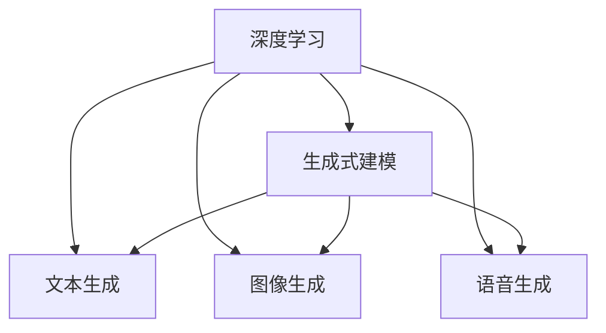
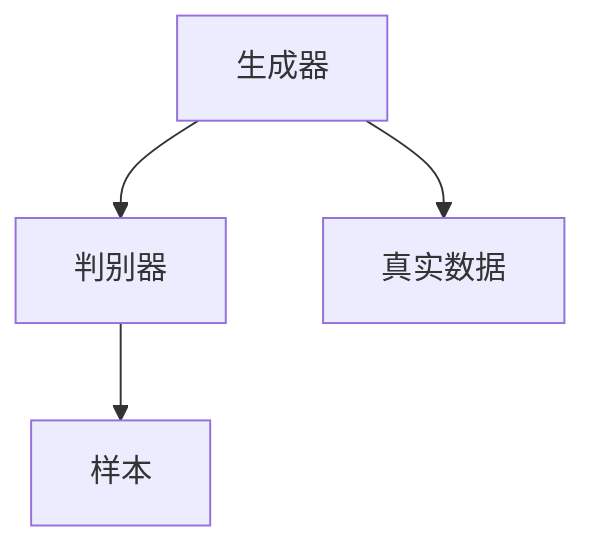

                 

# 生成式AIGC：智能时代的商业新模式

## 1. 背景介绍

### 1.1 问题由来

随着AI技术的飞速发展，AI生成内容（AIGC）技术已经成为智能时代的商业新模式。特别是在内容创作、客户服务、娱乐互动等领域，AIGC技术正在迅速改变传统业务模式，推动行业创新。然而，对于许多企业来说，如何有效利用AIGC技术，将其转化为实际的商业价值，仍是一个巨大的挑战。

### 1.2 问题核心关键点

AIGC的核心在于利用深度学习和大模型进行生成式建模，通过对大量数据的学习，生成符合特定风格和语义的内容。其关键点包括：

1. 深度学习框架：如TensorFlow、PyTorch，用于构建和训练深度神经网络。
2. 大模型：如GPT-3、DALL-E等，具有强大的生成能力和泛化能力。
3. 生成式建模：如文本生成、图像生成、语音生成等，实现多样化的内容创作。
4. 内容质量评估：如何对生成内容的质量进行评估和优化。
5. 自动化部署：将模型转化为实际应用，部署到各种商业场景中。

本文将重点探讨AIGC技术的基本原理、核心算法、实际应用以及未来发展方向，帮助读者全面理解这一新兴技术，并为其商业化应用提供参考。

## 2. 核心概念与联系

### 2.1 核心概念概述

AIGC技术的核心概念包括：

1. 深度学习：一种模拟人脑神经网络进行学习的方法，通过大量数据训练生成模型。
2. 生成式建模：通过学习数据分布，生成新的、符合特定规律的数据。
3. 大模型：参数量极大，可以处理大规模复杂任务的高性能模型，如GPT-3、DALL-E等。
4. 文本生成：基于深度学习模型生成文本内容，可用于自然语言生成、机器翻译、对话系统等。
5. 图像生成：基于生成对抗网络（GAN）等技术生成图像内容，可用于艺术创作、广告设计、游戏开发等。
6. 语音生成：通过深度学习生成自然流畅的语音，可用于语音助手、语音合成、音乐创作等。

这些概念之间的联系可以通过以下Mermaid流程图展示：



## 3. 核心算法原理 & 具体操作步骤

### 3.1 算法原理概述

AIGC技术的核心算法基于生成式对抗网络（GAN）和变分自编码器（VAE），通过生成模型和判别模型之间的对抗训练，生成与真实数据难以区分的样本。核心算法包括：

- 生成器（Generator）：生成符合特定分布的样本，如文本、图像、音频等。
- 判别器（Discriminator）：判断样本是否为真实数据。
- 损失函数：如对抗损失、重建损失等，用于指导生成器和判别器的训练。

AIGC技术的原理图如下：



### 3.2 算法步骤详解

AIGC技术的实现步骤如下：

1. 数据准备：收集和预处理大量数据，分为训练集和验证集。
2. 模型选择：选择合适的深度学习框架和大模型，如TensorFlow、PyTorch、GPT-3、DALL-E等。
3. 生成器和判别器设计：设计生成器和判别器的架构，如CNN、RNN、Transformer等。
4. 损失函数定义：定义生成器和判别器的损失函数，如对抗损失、重建损失等。
5. 模型训练：使用生成器和判别器的对抗训练，迭代优化模型参数。
6. 内容生成：利用训练好的模型生成新的内容。

### 3.3 算法优缺点

AIGC技术具有以下优点：

1. 高生成能力：通过大模型和高性能计算，可以快速生成高质量的内容。
2. 泛化能力强：生成的内容可以适用于多种场景和应用。
3. 灵活性高：可以根据不同需求，生成不同风格和语义的内容。

同时，AIGC技术也存在一些缺点：

1. 数据依赖性强：需要大量高质量的数据进行训练，数据质量影响生成内容的质量。
2. 生成内容可控性差：生成的内容可能不符合预期的风格或语义，需要人工调整。
3. 部署成本高：需要高性能的计算资源和部署环境，成本较高。
4. 伦理问题：生成的内容可能存在偏见或误导性，需要合理使用和监管。

### 3.4 算法应用领域

AIGC技术可以应用于以下多个领域：

1. 内容创作：如自动生成新闻、小说、博客等，提高内容创作的效率和质量。
2. 客户服务：如自动生成对话、客服脚本等，提升客户体验。
3. 娱乐互动：如自动生成游戏场景、音乐、视频等，丰富娱乐体验。
4. 营销推广：如自动生成广告文案、视频等内容，提升营销效果。
5. 医疗健康：如自动生成健康建议、诊断报告等，辅助医疗决策。
6. 教育培训：如自动生成教材、练习题等，提高教育效果。

## 4. 数学模型和公式 & 详细讲解  
### 4.1 数学模型构建

AIGC技术的数学模型主要基于生成式对抗网络（GAN）和变分自编码器（VAE），其核心公式包括：

1. 生成器（Generator）：
   $$
   G_{\theta}(z) = f_{\theta}(z)
   $$
   其中 $G_{\theta}$ 为生成器，$\theta$ 为生成器参数，$z$ 为噪声向量。

2. 判别器（Discriminator）：
   $$
   D_{\phi}(x) = g_{\phi}(x)
   $$
   其中 $D_{\phi}$ 为判别器，$\phi$ 为判别器参数，$x$ 为输入样本。

3. 对抗损失函数：
   $$
   \mathcal{L}_{\text{gan}} = \mathbb{E}_{x\sim p_{\text{data}}}[\log D_{\phi}(x)] + \mathbb{E}_{z\sim p(z)}[\log (1 - D_{\phi}(G_{\theta}(z)))
   $$
   其中 $p_{\text{data}}$ 为真实数据分布，$p(z)$ 为噪声向量分布。

4. 变分自编码器（VAE）：
   $$
   \log p(x|z) = \log \sigma_{\mu}(x) + \log \mu_{\sigma}(x) - \frac{1}{2} \log \det(\sigma_{\mu}^2 + \sigma_{\sigma}^2)
   $$
   其中 $\mu_{\sigma}(x)$ 为解码器输出均值，$\sigma_{\sigma}(x)$ 为解码器输出方差。

### 4.2 公式推导过程

以文本生成为例，生成器的目标是学习文本数据 $p(x|z)$，判别器的目标是学习文本数据的真实概率分布 $p_{\text{data}}(x)$。生成器和判别器通过对抗训练，优化目标函数：

$$
\min_{G} \max_{D} \mathbb{E}_{x\sim p_{\text{data}}}[\log D_{\phi}(x)] + \mathbb{E}_{z\sim p(z)}[\log (1 - D_{\phi}(G_{\theta}(z)))
$$

其中 $G_{\theta}$ 为生成器，$D_{\phi}$ 为判别器，$\theta$ 和 $\phi$ 分别为生成器和判别器的参数。

### 4.3 案例分析与讲解

以生成艺术图像为例，DALL-E模型是当前最先进的图像生成模型之一，其训练过程如下：

1. 收集大量图像数据和描述，构建图像-文本对数据集。
2. 选择预训练的生成器和判别器架构，如ResNet、U-Net等。
3. 定义生成器和判别器的损失函数，如对抗损失、重建损失等。
4. 使用对抗训练，迭代优化生成器和判别器的参数。
5. 生成新的艺术图像，通过人工评估和优化生成效果。

## 5. 项目实践：代码实例和详细解释说明

### 5.1 开发环境搭建

AIGC技术通常使用深度学习框架进行开发，如TensorFlow、PyTorch等。以下是Python环境搭建步骤：

1. 安装Python：从官网下载并安装Python 3.7+。
2. 安装TensorFlow或PyTorch：使用pip或conda安装对应的深度学习框架。
3. 安装其他依赖库：安装Numpy、Pandas、Matplotlib等常用库。
4. 搭建开发环境：使用Jupyter Notebook或PyCharm等IDE进行开发。

### 5.2 源代码详细实现

以下是一个简单的文本生成代码实现：

```python
import tensorflow as tf
from tensorflow.keras import layers

# 定义生成器
class Generator(tf.keras.Model):
    def __init__(self):
        super(Generator, self).__init__()
        self.dense1 = layers.Dense(256, input_shape=(100,))
        self.dense2 = layers.Dense(256)
        self.dense3 = layers.Dense(784)

    def call(self, x):
        x = tf.keras.layers.Dense(256, activation='relu')(x)
        x = tf.keras.layers.Dense(256, activation='relu')(x)
        x = self.dense3(x)
        return x

# 定义判别器
class Discriminator(tf.keras.Model):
    def __init__(self):
        super(Discriminator, self).__init__()
        self.dense1 = layers.Dense(256, input_shape=(784,))
        self.dense2 = layers.Dense(256)
        self.dense3 = layers.Dense(1, activation='sigmoid')

    def call(self, x):
        x = tf.keras.layers.Dense(256, activation='relu')(x)
        x = tf.keras.layers.Dense(256, activation='relu')(x)
        x = self.dense3(x)
        return x

# 定义对抗训练模型
class GAN(tf.keras.Model):
    def __init__(self):
        super(GAN, self).__init__()
        self.generator = Generator()
        self.discriminator = Discriminator()

    def call(self, x):
        x = self.generator(x)
        x = self.discriminator(x)
        return x

# 定义损失函数
def gan_loss(fake_output, real_output, discriminator):
    real_loss = tf.keras.losses.BinaryCrossentropy()(real_output, tf.ones_like(real_output))
    fake_loss = tf.keras.losses.BinaryCrossentropy()(fake_output, tf.zeros_like(fake_output))
    return real_loss + fake_loss

# 训练模型
def train(gan_model, real_images, batch_size, epochs):
    # 定义优化器
    generator_optimizer = tf.keras.optimizers.Adam(1e-4)
    discriminator_optimizer = tf.keras.optimizers.Adam(1e-4)

    # 训练过程
    for epoch in range(epochs):
        for i in range(0, len(real_images), batch_size):
            real_images_batch = real_images[i:i+batch_size]
            noise = tf.random.normal([batch_size, 100])
            with tf.GradientTape() as gen_tape, tf.GradientTape() as disc_tape:
                generated_images = generator(noise, training=True)
                real_output = discriminator(real_images_batch, training=True)
                fake_output = discriminator(generated_images, training=True)

                gen_loss = gan_loss(fake_output, real_output, discriminator)
                disc_loss = gan_loss(real_output, real_output, discriminator) + gan_loss(fake_output, fake_output, discriminator)

            # 计算梯度并更新参数
            gradients_of_generator = gen_tape.gradient(gen_loss, generator.trainable_variables)
            gradients_of_discriminator = disc_tape.gradient(disc_loss, discriminator.trainable_variables)
            generator_optimizer.apply_gradients(zip(gradients_of_generator, generator.trainable_variables))
            discriminator_optimizer.apply_gradients(zip(gradients_of_discriminator, discriminator.trainable_variables))

# 生成新内容
def generate(generator, noise):
    generated_images = generator(noise, training=False)
    return generated_images

# 加载数据集
mnist = tf.keras.datasets.mnist
(x_train, y_train), (x_test, y_test) = mnist.load_data()
x_train = x_train / 255.0
x_test = x_test / 255.0

# 训练模型
gan_model = GAN()
train(gan_model, x_train, 32, 1000)

# 生成新内容
noise = tf.random.normal([100, 100])
new_images = generate(gan_model.generator, noise)
plt.imshow(new_images[0].numpy(), cmap='gray')
plt.show()
```

### 5.3 代码解读与分析

上述代码实现了一个简单的文本生成模型，其中生成器和判别器的架构均为多层感知器（MLP）。在训练过程中，使用对抗训练优化生成器和判别器的参数。生成器生成新的文本，判别器判断其是否为真实文本。最终生成的文本可以通过人工评估和优化生成效果。

## 6. 实际应用场景

### 6.1 智能客服

智能客服系统通过AIGC技术，实现自动生成对话和客服脚本，提升客户体验。其应用场景包括：

1. 客户咨询：自动生成客户咨询回复，快速响应客户需求。
2. 问题解答：自动生成常见问题解答，减少人工客服工作量。
3. 情感分析：自动分析客户情感，提供个性化服务。

### 6.2 内容创作

内容创作通过AIGC技术，自动生成新闻、博客、广告等内容，提高内容创作的效率和质量。其应用场景包括：

1. 新闻生成：自动生成新闻报道，提高新闻生成效率。
2. 博客撰写：自动生成博客内容，提升博客创作质量。
3. 广告创意：自动生成广告文案和视频，提高广告创意效率。

### 6.3 娱乐互动

娱乐互动通过AIGC技术，自动生成游戏场景、音乐、视频等内容，丰富娱乐体验。其应用场景包括：

1. 游戏设计：自动生成游戏场景和角色，提高游戏设计效率。
2. 音乐创作：自动生成音乐和歌词，丰富音乐创作内容。
3. 视频生成：自动生成视频和动画，提高视频制作效率。

### 6.4 未来应用展望

未来，AIGC技术将在更多领域得到应用，为传统行业带来变革性影响。

1. 医疗健康：自动生成健康建议、诊断报告，辅助医疗决策。
2. 教育培训：自动生成教材、练习题，提高教育效果。
3. 智慧城市：自动生成城市事件监测、舆情分析、应急指挥，提高城市管理效率。
4. 金融服务：自动生成金融分析报告、投资建议，提高金融服务质量。
5. 智能家居：自动生成智能家居控制指令，提高生活便利性。
6. 创意设计：自动生成设计方案、创意内容，提高设计效率。

## 7. 工具和资源推荐

### 7.1 学习资源推荐

为了帮助开发者系统掌握AIGC技术，这里推荐一些优质的学习资源：

1. 《深度学习》书籍：Ian Goodfellow等著，介绍了深度学习的基本概念和经典模型。
2. 《生成对抗网络》书籍：Ian Goodfellow等著，介绍了GAN的基本原理和实现方法。
3. 《PyTorch官方文档》：PyTorch官方文档，提供了详细的API参考和使用教程。
4. 《TensorFlow官方文档》：TensorFlow官方文档，提供了详细的API参考和使用教程。
5. 《自然语言处理综述》论文：Yoshua Bengio等著，介绍了自然语言处理的基本概念和技术。

通过对这些资源的学习实践，相信你一定能够快速掌握AIGC技术的精髓，并用于解决实际的商业问题。

### 7.2 开发工具推荐

高效的开发离不开优秀的工具支持。以下是几款用于AIGC开发的常用工具：

1. PyTorch：基于Python的开源深度学习框架，灵活动态的计算图，适合快速迭代研究。
2. TensorFlow：由Google主导开发的开源深度学习框架，生产部署方便，适合大规模工程应用。
3. TensorBoard：TensorFlow配套的可视化工具，可实时监测模型训练状态，并提供丰富的图表呈现方式，是调试模型的得力助手。
4. Weights & Biases：模型训练的实验跟踪工具，可以记录和可视化模型训练过程中的各项指标，方便对比和调优。
5. Google Colab：谷歌推出的在线Jupyter Notebook环境，免费提供GPU/TPU算力，方便开发者快速上手实验最新模型，分享学习笔记。

合理利用这些工具，可以显著提升AIGC任务的开发效率，加快创新迭代的步伐。

### 7.3 相关论文推荐

AIGC技术的发展源于学界的持续研究。以下是几篇奠基性的相关论文，推荐阅读：

1. Generative Adversarial Nets（GAN）论文：Ian Goodfellow等著，提出了GAN的基本框架和训练方法。
2. Variational Autoencoders（VAE）论文：Kingma等著，提出了VAE的基本框架和优化方法。
3. Text Generation with Transformers论文：Ashish Vaswani等著，介绍了Transformer在文本生成中的应用。
4. Generating Photos with Attentive Multistep Transformers论文：Andrej Karpathy等著，介绍了Attentive Transformer在图像生成中的应用。
5. The Role of Context in Text Generation论文：Yann LeCun等著，探讨了上下文在文本生成中的作用。

这些论文代表了大模型微调技术的发展脉络。通过学习这些前沿成果，可以帮助研究者把握学科前进方向，激发更多的创新灵感。

## 8. 总结：未来发展趋势与挑战

### 8.1 总结

本文对AIGC技术的基本原理、核心算法、实际应用以及未来发展方向进行了全面系统的介绍。首先阐述了AIGC技术的核心概念和应用场景，明确了其在智能时代的商业新模式。其次，从原理到实践，详细讲解了AIGC技术的数学模型和代码实现，给出了具体的项目实践实例。同时，本文还广泛探讨了AIGC技术在各个领域的应用前景，展示了其在未来发展的巨大潜力。最后，本文精选了AIGC技术的各类学习资源，力求为读者提供全方位的技术指引。

通过本文的系统梳理，可以看到，AIGC技术正在成为智能时代的商业新模式，极大地拓展了AI技术的应用边界，为商业创新提供了新的思路。未来，伴随AIGC技术的不断演进，相信其在更多领域将迎来新的突破，为人类社会带来更深远的影响。

### 8.2 未来发展趋势

展望未来，AIGC技术将呈现以下几个发展趋势：

1. 生成能力更强：随着大模型和更高效的生成算法的发展，AIGC技术将能够生成更加丰富和高质量的内容。
2. 模型通用性更高：生成模型将能够处理更多的数据类型，如图像、音频、视频等，具备更强的泛化能力。
3. 应用场景更广：AIGC技术将能够应用于更多的领域，如医疗、教育、金融等，带来更高的商业价值。
4. 模型可控性更好：通过更好的模型架构和训练方法，生成内容将更加符合预期的风格和语义。
5. 技术更加成熟：AIGC技术将更加成熟，易于部署和使用，减少技术门槛。

### 8.3 面临的挑战

尽管AIGC技术已经取得了显著进展，但在迈向大规模落地应用的过程中，仍面临诸多挑战：

1. 数据隐私和安全：生成的内容可能涉及个人隐私和敏感信息，需要合理使用和监管。
2. 内容真实性：生成的内容可能存在偏见和误导性，需要合理使用和审核。
3. 计算资源需求高：大规模生成任务需要高性能计算资源，成本较高。
4. 模型泛化能力不足：生成的内容可能不具备足够的泛化能力，无法适应多种场景。
5. 模型可解释性差：生成模型的决策过程缺乏可解释性，难以进行调试和优化。

### 8.4 研究展望

未来，AIGC技术的研究方向包括：

1. 无监督和半监督生成：探索无监督和半监督生成方法，减少对大量标注数据的依赖。
2. 多模态生成：研究多模态生成方法，融合视觉、音频、文本等多种信息，提升生成效果。
3. 可解释性和可控性：研究可解释性和可控性方法，提高生成内容的可解释性和可控性。
4. 跨领域生成：研究跨领域生成方法，提升生成内容的跨领域适应能力。
5. 高效率生成：研究高效率生成方法，提升生成内容的生成效率。

总之，AIGC技术需要从数据、算法、工程等多个维度进行全面优化，才能更好地服务于商业创新和智能社会。未来，随着AIGC技术的不断演进，相信其在商业应用和社会进步中将发挥更加重要的作用。

## 9. 附录：常见问题与解答

**Q1：AIGC技术是否适用于所有应用场景？**

A: AIGC技术适用于大部分生成式任务，如文本生成、图像生成、语音生成等。但在一些需要高精度和可靠性的场景，如医疗诊断、法律文书等，仍需要结合人工干预和专家知识。

**Q2：AIGC技术的生成能力如何保证？**

A: AIGC技术的生成能力依赖于大模型的预训练和优化。需要收集和预处理大量高质量的数据，使用高性能计算资源进行模型训练，并根据任务需求进行调整和优化。

**Q3：AIGC技术的实际应用有哪些？**

A: AIGC技术可以应用于智能客服、内容创作、娱乐互动等多个领域，提升客户体验、提高内容创作效率、丰富娱乐体验等。

**Q4：AIGC技术的未来发展方向有哪些？**

A: AIGC技术的未来发展方向包括无监督生成、多模态生成、可解释性和可控性、跨领域生成等。需要从数据、算法、工程等多个维度进行全面优化，提升生成内容的生成效果和应用范围。

---

作者：禅与计算机程序设计艺术 / Zen and the Art of Computer Programming

