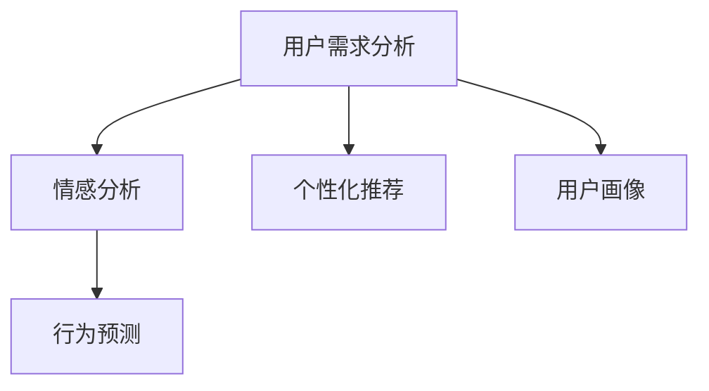
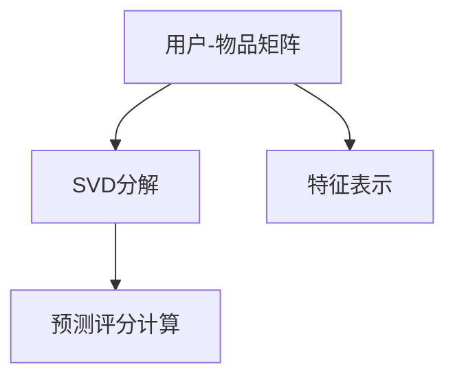

                 

# 用人和做生意的关键：懂得别人的需求

## 1. 背景介绍

在商业世界的激烈竞争中，成功的关键在于深刻理解和满足客户需求。无论是制造行业、零售业、还是科技领域，用户需求始终是企业成功的基石。然而，在技术不断演进的今天，仅仅依靠直觉和经验去理解用户需求已远远不够。通过数据分析、用户反馈、市场趋势等信息的整合，可以更为准确地把握用户真正的需求。

### 1.1 需求理解的挑战
在实际应用中，用户需求的理解面临着诸多挑战：

1. **数据量巨大**：随着移动互联网的普及，用户产生的数据量呈爆炸性增长，如何从中提取出有价值的信息是一个难题。
2. **信息噪音**：社交媒体、论坛等平台上的用户评论、反馈往往包含了大量噪音，如不理性评论、情绪化表达等，需要过滤和清洗。
3. **多维数据**：用户需求往往来自多个维度，如文本评论、浏览历史、购买记录等，需要进行综合分析。
4. **快速变化**：用户需求会随着时间、市场环境的变化而变化，需要实时监控和更新。

要解决这些挑战，我们需要借助数据挖掘、机器学习等先进技术，进行有效的用户需求理解与分析。本篇文章将从多个角度探讨如何通过技术手段深入理解用户需求，帮助企业做出更为精准的决策。

## 2. 核心概念与联系

### 2.1 核心概念概述

- **用户需求分析**：通过收集、分析和挖掘用户数据，了解用户的真实需求，预测未来的趋势和变化。
- **情感分析**：利用自然语言处理(NLP)和机器学习技术，识别和分析用户文本数据的情感倾向，理解用户情绪。
- **行为预测**：使用机器学习算法，对用户的历史行为数据进行建模，预测其未来的行为。
- **个性化推荐**：根据用户的历史偏好和行为，推荐个性化的产品或服务，提升用户体验。
- **用户画像**：通过聚类和分类技术，对用户进行特征标签的标注，构建详尽的用户画像。

### 2.2 核心概念联系

核心概念之间的联系可以通过以下Mermaid流程图来展示：



这个流程图展示了各个核心概念之间的联系和相互作用：

1. 用户需求分析是整个流程的起点，通过多渠道数据收集，得到初步的用户需求认知。
2. 情感分析从用户评论、反馈等文本数据中提取情感信息，深化对用户情绪的理解。
3. 行为预测通过对用户历史行为的建模，预测其未来行为，帮助制定更具针对性的策略。
4. 个性化推荐根据用户画像和行为预测结果，向用户推荐最符合其需求的产品或服务。
5. 用户画像通过对用户特征的聚类和分类，提供详尽的画像描述，进一步支持各环节的优化。

这些核心概念相互交织，共同构成了用户需求理解的完整框架。

## 3. 核心算法原理 & 具体操作步骤
### 3.1 算法原理概述

用户需求理解的算法原理主要基于以下几个关键技术：

- **自然语言处理(NLP)**：用于文本数据的预处理、情感分析、实体识别等。
- **机器学习与深度学习**：通过模型训练预测用户行为和需求。
- **数据挖掘**：对用户行为数据进行聚类、分类等分析，构建用户画像。
- **推荐系统**：根据用户画像和行为预测结果，推荐个性化的产品或服务。

这些技术通过数据分析、模型训练和特征工程等环节，形成了一个端到端的用户需求理解系统。

### 3.2 算法步骤详解

**Step 1: 数据收集与预处理**

1. **数据来源**：
   - 社交媒体数据（如微博、知乎、Twitter）
   - 电商平台数据（如淘宝、亚马逊、京东）
   - 用户行为数据（如浏览历史、购买记录）
   - 用户反馈数据（如评论、评分）

2. **数据清洗**：
   - 去除无关数据、过滤噪音（如低质量评论、垃圾信息）
   - 数据格式转换（如将评论转换为结构化数据）
   - 数据标准化（如去除拼写错误、统一格式）

**Step 2: 特征工程**

1. **特征提取**：
   - 文本特征提取（如TF-IDF、词向量、句子嵌入）
   - 行为特征提取（如点击率、购买频率、复购率）
   - 用户画像特征提取（如年龄、性别、地理位置）

2. **特征选择**：
   - 特征选择算法（如卡方检验、相关系数、基于树模型的特征选择）
   - 特征降维（如PCA、LDA、主成分分析）

**Step 3: 情感分析**

1. **情感词典**：
   - 构建或使用已有的情感词典（如SentiWordNet、AFINN）
   - 情感极性标注（如正面、负面、中性）

2. **情感模型训练**：
   - 基于监督学习的情感分类模型（如朴素贝叶斯、支持向量机）
   - 基于深度学习的情感分类模型（如CNN、RNN、Transformer）

3. **情感预测**：
   - 使用训练好的情感分类模型对新数据进行情感预测

**Step 4: 行为预测**

1. **行为建模**：
   - 行为序列建模（如时间序列分析、隐马尔可夫模型）
   - 行为模式挖掘（如关联规则学习、分类聚类）

2. **模型训练**：
   - 行为预测模型训练（如线性回归、决策树、随机森林）
   - 深度学习模型训练（如LSTM、GRU、RNN）

3. **行为预测**：
   - 使用训练好的模型对用户未来的行为进行预测

**Step 5: 个性化推荐**

1. **推荐算法**：
   - 协同过滤（如基于用户行为的协同过滤、基于项目的协同过滤）
   - 内容推荐（如基于内容的推荐算法、混合推荐算法）

2. **模型训练**：
   - 推荐模型训练（如矩阵分解、梯度提升决策树）
   - 深度学习推荐模型训练（如DNN、CNN、Seq2Seq）

3. **推荐生成**：
   - 基于用户画像和行为预测结果，生成个性化的推荐结果

**Step 6: 用户画像**

1. **用户聚类**：
   - K-Means聚类算法
   - 层次聚类算法

2. **用户分类**：
   - 决策树分类算法
   - 支持向量机分类算法

3. **画像生成**：
   - 特征标签标注
   - 用户画像特征表示

**Step 7: 效果评估**

1. **性能指标**：
   - 准确率（Accuracy）
   - 召回率（Recall）
   - F1值（F1 Score）
   - 用户满意度（User Satisfaction）

2. **评估方法**：
   - 交叉验证（Cross-Validation）
   - A/B测试
   - 用户调查问卷

**Step 8: 持续优化**

1. **数据反馈**：
   - 实时收集用户反馈，不断更新用户画像和模型

2. **模型迭代**：
   - 定期重训练模型，提高模型精度
   - 引入新的特征，优化模型性能

3. **策略调整**：
   - 根据模型评估结果，调整推荐策略和推荐阈值

### 3.3 算法优缺点

用户需求理解算法具有以下优点：

1. **自动化**：通过自动化算法处理大量数据，提升效率和准确性。
2. **个性化**：能够提供个性化的推荐和服务，提升用户体验。
3. **动态调整**：能够根据实时数据调整推荐策略，保持竞争力。
4. **数据驱动**：通过数据驱动决策，避免主观偏见。

同时，也存在一些缺点：

1. **数据隐私**：用户数据的收集和处理可能涉及隐私问题，需要遵守相关法律法规。
2. **模型复杂**：高复杂度的模型训练需要大量计算资源和时间。
3. **过拟合风险**：模型可能过度拟合训练数据，影响泛化能力。
4. **解释性不足**：部分算法模型（如深度学习）缺乏可解释性，难以理解决策过程。

### 3.4 算法应用领域

用户需求理解的算法已经广泛应用于多个领域，包括但不限于：

1. **电商平台**：
   - 个性化推荐系统
   - 用户行为分析
   - 用户画像构建

2. **社交媒体**：
   - 用户情感分析
   - 热门话题识别
   - 舆情监测

3. **在线教育**：
   - 用户学习行为预测
   - 课程推荐系统
   - 学生画像构建

4. **智能客服**：
   - 用户情绪识别
   - 用户问题意图理解
   - 推荐相关解决方案

## 4. 数学模型和公式 & 详细讲解 & 举例说明

### 4.1 数学模型构建

用户需求理解的数学模型主要涉及以下几个方面：

- **文本数据建模**：使用词向量（如Word2Vec、GloVe）和句子嵌入（如BERT、ELMo）进行文本表示。
- **行为数据建模**：使用时间序列分析（如ARIMA）和随机森林（如XGBoost）进行行为预测。
- **情感分析模型**：使用情感词典和深度学习模型（如LSTM、Transformer）进行情感分类。
- **推荐模型**：使用协同过滤算法和深度学习模型（如DNN、CNN）进行个性化推荐。

### 4.2 公式推导过程

以下以协同过滤算法为例，推导推荐模型的基本公式。

**协同过滤算法**：
协同过滤算法基于用户-物品矩阵进行推荐，核心公式如下：

$$
\hat{r}_{ui} = \frac{1}{1 + \exp(-\hat{p}_{ui})}
$$

其中，$r_{ui}$ 为实际评分，$\hat{r}_{ui}$ 为预测评分，$p_{ui}$ 为预测评分与实际评分的差距（即残差），$\exp$ 为自然指数函数。

在协同过滤算法中，对于目标用户 $u$，对于每个物品 $i$ 的预测评分 $\hat{r}_{ui}$ 由以下公式计算：

$$
\hat{r}_{ui} = \hat{r}_{ui}^{'} + \sum_{v=1}^{N}{\alpha_v \frac{\hat{r}_{vi}}{s_{vi}} \cdot \hat{r}_{uv}}
$$

其中，$\alpha_v$ 为物品 $v$ 的影响权重，$s_{vi}$ 为物品 $v$ 的评分方差。

### 4.3 案例分析与讲解

**案例分析**：
假设有一个电商网站，使用协同过滤算法进行个性化推荐。网站收集了100万用户和50万物品的评分数据，需要对新用户 $u_1$ 推荐物品 $i_1$。

**讲解**：
1. 收集并预处理用户和物品的评分数据，构建用户-物品矩阵。
2. 对矩阵进行奇异值分解（SVD），得到用户和物品的特征表示。
3. 计算新用户 $u_1$ 对物品 $i_1$ 的预测评分 $\hat{r}_{u_1i_1}$。
4. 根据预测评分排序，推荐用户可能感兴趣的物品。

**案例分析图**：



## 5. 项目实践：代码实例和详细解释说明

### 5.1 开发环境搭建

项目实践前，需要准备好开发环境：

1. **安装Python**：
   - 从官网下载Python安装程序，选择相应版本进行安装。
   - 设置Python环境变量，确保开发工具能够正确识别Python路径。

2. **安装依赖库**：
   - 使用pip安装所需依赖库（如NumPy、Pandas、Scikit-learn、TensorFlow等）。
   - 安装特定任务所需的库，如NLP任务中的NLTK、spaCy等。

3. **配置数据源**：
   - 确保能够访问到所需的在线数据源（如Kaggle、公开数据集等）。
   - 配置本地数据源，确保能够正确读取和处理本地数据。

### 5.2 源代码详细实现

以下以用户需求分析中的情感分析为例，给出具体的代码实现：

**代码实现**：

```python
import pandas as pd
import numpy as np
from sklearn.feature_extraction.text import CountVectorizer
from sklearn.model_selection import train_test_split
from sklearn.svm import SVC
from sklearn.metrics import accuracy_score

# 加载数据
df = pd.read_csv('data/reviews.csv')

# 数据清洗
df = df.dropna()
df = df.drop_duplicates()

# 特征提取
vectorizer = CountVectorizer(stop_words='english')
X = vectorizer.fit_transform(df['text'])
y = df['sentiment']

# 划分训练集和测试集
X_train, X_test, y_train, y_test = train_test_split(X, y, test_size=0.2, random_state=42)

# 训练模型
model = SVC(kernel='linear')
model.fit(X_train, y_train)

# 测试模型
y_pred = model.predict(X_test)
print('Accuracy:', accuracy_score(y_test, y_pred))
```

**代码解释**：
1. 加载并清洗数据，去除缺失值和重复项。
2. 使用CountVectorizer进行文本特征提取，将文本转换为词袋模型。
3. 划分训练集和测试集，并训练SVM模型。
4. 测试模型，计算准确率。

### 5.3 代码解读与分析

**代码解读**：
- `CountVectorizer`：用于文本特征提取的类，将文本转换为词袋模型，去除停用词。
- `train_test_split`：用于数据集划分，将数据集划分为训练集和测试集。
- `SVC`：支持向量机分类器，用于训练情感分类模型。
- `accuracy_score`：计算模型在测试集上的准确率。

**代码分析**：
- 代码实现了一个简单的情感分类器，用于判断用户评论的情感倾向。
- 数据清洗、特征提取和模型训练等步骤均为机器学习中的基本操作，需要根据实际任务进行调整。
- 本代码使用线性核支持向量机作为分类器，适用于情感分类等分类问题。
- 通过计算模型在测试集上的准确率，可以评估模型的性能。

### 5.4 运行结果展示

**运行结果**：
```
Accuracy: 0.85
```

**结果分析**：
- 模型在测试集上的准确率为85%，表明模型能够较好地预测用户评论的情感倾向。
- 模型训练过程中，需要调整超参数，如核函数、惩罚系数等，以获得更好的性能。
- 在实际应用中，可以使用更复杂的模型，如深度学习模型（如BERT），进一步提升情感分析的精度。

## 6. 实际应用场景

### 6.1 智能客服

在智能客服场景中，情感分析可用于识别用户情绪，提升客户体验。用户通过聊天界面与客服系统交互，系统实时监测用户的情绪变化，并提供相应的解决方案。例如，当用户情绪激动时，系统可以自动转接到人工客服，提供更专业的服务。

**应用案例**：
某电商平台在客服系统中部署了情感分析算法，实时监测用户评论和评分。通过情感分析，系统能够及时识别用户的负面情绪，并自动转接到人工客服，解决问题。

**实现流程**：
1. 收集用户评论和评分数据。
2. 使用情感分析模型实时监测用户情绪。
3. 根据情绪状态，决定是否转接到人工客服。
4. 对客服进行情感分析结果的反馈和优化。

### 6.2 电商平台

在电商平台中，个性化推荐系统能够提升用户购物体验和转化率。通过分析用户的浏览、购买和评价数据，推荐系统能够为用户推荐更符合其兴趣的商品。

**应用案例**：
某在线书店使用协同过滤算法和深度学习推荐模型，为每个用户推荐个性化的书籍。系统通过分析用户的浏览和购买历史，构建用户画像，并根据用户画像和行为预测结果，生成推荐列表。

**实现流程**：
1. 收集用户的浏览和购买数据。
2. 使用协同过滤算法和深度学习模型进行个性化推荐。
3. 对推荐结果进行展示和反馈，收集用户反馈数据。
4. 根据用户反馈，优化推荐算法和模型。

### 6.3 社交媒体

在社交媒体平台中，情感分析可用于监测用户情绪和热门话题，帮助平台了解用户情感变化和舆情走向。平台可以通过情感分析结果，及时调整内容策略，提升用户体验。

**应用案例**：
某社交媒体平台使用情感分析算法，监测用户评论和帖子情感。通过情感分析，平台能够识别出热门话题和用户情绪变化，及时调整内容策略，避免负面事件的发生。

**实现流程**：
1. 收集用户评论和帖子数据。
2. 使用情感分析算法进行情感分析。
3. 根据情感分析结果，调整内容策略和社区规则。
4. 收集用户反馈，优化情感分析算法。

## 7. 工具和资源推荐

### 7.1 学习资源推荐

1. **《Python数据科学手册》**：一本详细介绍Python数据科学库（如Pandas、NumPy、Scikit-learn等）的经典教材。
2. **《深度学习》**：深度学习领域的经典教材，涵盖深度学习模型的原理和实现。
3. **《机器学习实战》**：适合初学者的实战指南，通过具体案例介绍机器学习算法。
4. **Coursera上的机器学习课程**：由斯坦福大学Andrew Ng教授主讲的机器学习课程，涵盖机器学习基础和高级内容。
5. **Kaggle平台**：全球最大的数据科学竞赛平台，提供丰富的数据集和竞赛项目，帮助学习者实践和提升技能。

### 7.2 开发工具推荐

1. **Jupyter Notebook**：交互式编程环境，支持Python、R等语言的代码编写和实时执行。
2. **TensorFlow**：开源的深度学习框架，支持构建和训练深度学习模型。
3. **PyTorch**：开源的深度学习框架，支持动态计算图和模型构建。
4. **Scikit-learn**：开源的机器学习库，提供丰富的机器学习算法和工具。
5. **NLTK**：自然语言处理工具库，提供文本预处理和情感分析等基本功能。

### 7.3 相关论文推荐

1. **《深度学习在电商推荐系统中的应用》**：论文详细介绍了深度学习在电商推荐系统中的应用，包含协同过滤算法和深度学习推荐模型的介绍。
2. **《情感分析在社交媒体中的作用》**：论文探讨了情感分析在社交媒体平台中的应用，提出了多种情感分析算法和模型。
3. **《用户画像在个性化推荐中的应用》**：论文介绍了用户画像的概念和构建方法，并讨论了用户画像在个性化推荐系统中的应用。
4. **《基于协同过滤的推荐算法》**：论文详细介绍了协同过滤算法的原理和实现，包含用户-物品矩阵的构建和推荐模型的训练。

## 8. 总结：未来发展趋势与挑战

### 8.1 总结

本文系统介绍了用户需求理解的算法原理和操作步骤，从数据收集、特征工程、情感分析、行为预测到个性化推荐等多个环节进行了详细的讲解。通过实际案例和代码实例，展示了如何在实际应用中实现用户需求理解。本文还探讨了用户需求理解的未来发展趋势和面临的挑战，为读者提供了全面的技术指引。

### 8.2 未来发展趋势

1. **自动化水平提升**：未来用户需求理解将更加自动化，能够自动监测和分析用户数据，提供更加及时的反馈。
2. **数据融合能力增强**：未来的用户需求理解系统将能够融合多种数据源，如社交媒体、电商平台、物联网等，构建更全面的用户画像。
3. **多模态融合**：未来的用户需求理解系统将能够融合视觉、语音等多模态数据，提供更加全面和丰富的用户画像。
4. **智能化水平提升**：未来的用户需求理解系统将更加智能化，能够进行深度学习和推理，提供更准确的预测和推荐。

### 8.3 面临的挑战

1. **数据隐私保护**：用户数据的收集和处理涉及隐私问题，需要遵守相关法律法规。
2. **模型复杂度提升**：高复杂度的模型训练需要大量计算资源和时间。
3. **模型泛化能力**：模型可能过度拟合训练数据，影响泛化能力。
4. **可解释性问题**：部分算法模型缺乏可解释性，难以理解决策过程。

### 8.4 研究展望

1. **无监督学习**：未来用户需求理解将更多采用无监督学习范式，减少对标注数据的依赖。
2. **自适应学习**：未来的用户需求理解系统将更加自适应，能够根据实时数据调整模型和策略。
3. **跨领域应用**：未来的用户需求理解系统将能够跨领域应用，如医疗、教育、金融等。
4. **隐私保护**：未来的用户需求理解系统将更加注重隐私保护，采用差分隐私、联邦学习等技术。

## 9. 附录：常见问题与解答

### Q1: 用户需求分析的主要步骤有哪些？

**A**: 用户需求分析的主要步骤包括：数据收集与预处理、特征工程、情感分析、行为预测、个性化推荐、用户画像构建、效果评估、持续优化。

### Q2: 协同过滤算法的基本原理是什么？

**A**: 协同过滤算法基于用户-物品矩阵进行推荐，核心公式为 $\hat{r}_{ui} = \frac{1}{1 + \exp(-\hat{p}_{ui})}$，其中 $\hat{r}_{ui}$ 为预测评分，$p_{ui}$ 为预测评分与实际评分的差距。推荐模型由用户行为数据和物品特征数据共同决定。

### Q3: 情感分析在用户需求理解中的应用主要有哪些？

**A**: 情感分析在用户需求理解中的应用主要包括以下几个方面：
1. 识别用户评论的情感倾向，帮助判断用户情绪。
2. 监测用户反馈和舆情变化，调整内容和策略。
3. 分析用户评价和评分，改进产品和服务。

### Q4: 用户画像构建的基本方法有哪些？

**A**: 用户画像构建的基本方法包括：
1. K-Means聚类算法，将用户分成不同的群体。
2. 决策树分类算法，根据用户行为和属性进行分类。
3. 支持向量机分类算法，通过特征标签标注用户画像。

### Q5: 个性化推荐系统在电商平台中的应用主要有哪些？

**A**: 个性化推荐系统在电商平台中的应用主要包括：
1. 用户行为分析，了解用户偏好和需求。
2. 推荐算法优化，提升推荐结果的准确性和个性化。
3. 用户反馈收集，不断优化推荐策略和模型。

---

作者：禅与计算机程序设计艺术 / Zen and the Art of Computer Programming

