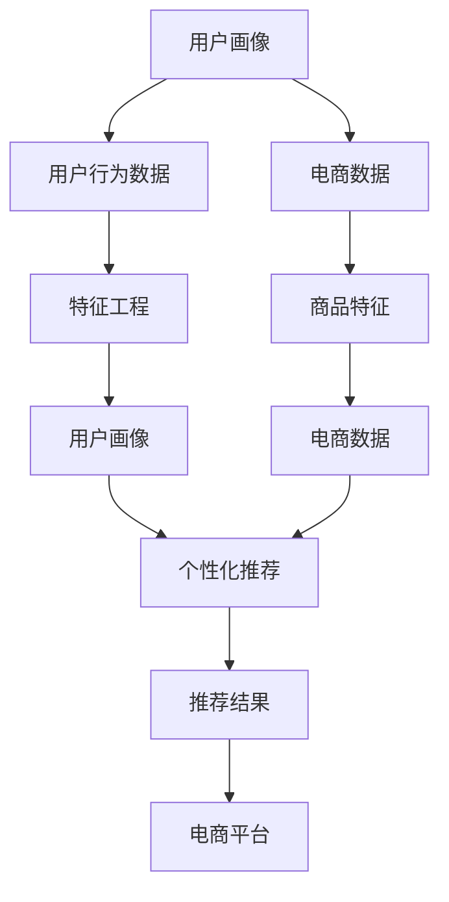

                 

# 用户画像在电商个性化推荐中的应用：方法与实践

## 1. 背景介绍

随着电子商务的快速发展，在线购物已经成为人们生活中不可或缺的一部分。电商平台通过用户行为数据，构建用户画像，利用个性化推荐技术，提升用户体验，增加销售转化率。个性化推荐系统基于用户历史行为数据，分析用户兴趣和偏好，精准推荐商品，使购物更加便捷和高效。本文将深入探讨用户画像在电商个性化推荐中的应用，详细阐述方法和实践。

## 2. 核心概念与联系

### 2.1 核心概念概述

1. **用户画像(User Profile)**：通过收集用户行为数据，分析用户兴趣和偏好，构建用户特征集合。用户画像包括用户的年龄、性别、职业、购买历史、浏览记录、评分等信息。

2. **个性化推荐(Personalized Recommendation)**：基于用户画像，推荐系统预测用户对商品或内容的兴趣，并推荐相关商品或内容。个性化推荐技术包括协同过滤、基于内容的推荐、深度学习推荐等。

3. **电商个性化推荐(E-commerce Personalized Recommendation)**：在电商平台上，基于用户画像和电商数据，推荐相关商品和内容。电商个性化推荐需要考虑交易数据、点击率、转化率等电商特有的业务指标。

4. **机器学习(Machine Learning)**：利用算法模型，通过用户历史行为数据，学习用户兴趣和偏好，构建个性化推荐系统。机器学习包括监督学习、无监督学习、强化学习等。

5. **深度学习(Deep Learning)**：使用多层神经网络模型，学习用户特征和商品特征，提升推荐系统的预测精度。深度学习包括CNN、RNN、LSTM、GAN等模型。

这些核心概念通过机器学习技术，紧密联系在一起，共同构建电商个性化推荐系统。

### 2.2 核心概念原理和架构的 Mermaid 流程图



上述流程图示意了用户画像、电商数据、个性化推荐三者之间的关系。首先，从用户行为数据中提取用户画像，再结合电商数据，通过个性化推荐模型生成推荐结果，最后反馈给电商平台，实现商品推荐。

## 3. 核心算法原理 & 具体操作步骤

### 3.1 算法原理概述

个性化推荐系统的核心思想是通过机器学习算法，分析用户历史行为数据，预测用户未来行为，从而生成个性化的推荐结果。具体来说，系统收集用户的行为数据，包括点击、浏览、购买、评价等信息，构建用户画像。然后，通过协同过滤、基于内容的推荐等算法，预测用户对商品或内容的兴趣，生成推荐结果。

### 3.2 算法步骤详解

1. **数据收集与预处理**：
   - 收集用户行为数据，包括点击、浏览、购买、评价等信息。
   - 数据清洗与预处理，去除重复、无效数据。

2. **用户画像构建**：
   - 通过用户行为数据，提取用户兴趣和偏好。
   - 对用户特征进行编码和归一化，形成用户画像。

3. **商品特征提取**：
   - 从商品描述、属性、标签中提取商品特征。
   - 对商品特征进行编码和归一化，形成商品特征向量。

4. **个性化推荐模型训练**：
   - 选择合适的推荐算法，如协同过滤、基于内容的推荐、深度学习推荐等。
   - 将用户画像和商品特征向量作为输入，训练推荐模型。

5. **推荐结果生成**：
   - 根据训练好的推荐模型，预测用户对商品或内容的兴趣。
   - 生成推荐结果，包括商品列表、商品详情、商品评分等信息。

### 3.3 算法优缺点

**优点**：
- 个性化推荐能够显著提升用户体验，增加销售转化率。
- 通过机器学习模型，能够高效分析用户行为数据，生成精准推荐。
- 适用于多种电商场景，具有广泛的应用前景。

**缺点**：
- 需要大量的用户行为数据，对数据收集和存储提出了高要求。
- 用户画像和商品特征提取的准确性直接影响推荐效果。
- 推荐模型需要定期更新，以适应用户行为的变化。

### 3.4 算法应用领域

个性化推荐技术广泛应用于电子商务、视频流媒体、社交网络等多个领域。在电商领域，通过个性化推荐，提升用户体验，增加销售转化率。在视频流媒体领域，推荐系统根据用户观影历史，推荐感兴趣的视频内容。在社交网络领域，推荐系统根据用户互动行为，推荐相关内容和朋友。

## 4. 数学模型和公式 & 详细讲解 & 举例说明

### 4.1 数学模型构建

个性化推荐系统可以通过多种算法实现，包括协同过滤、基于内容的推荐、深度学习推荐等。这里我们以协同过滤算法为例，介绍推荐系统的数学模型构建。

假设用户集为 $U$，商品集为 $I$，用户对商品的评分矩阵为 $R_{ui}$，其中 $u$ 表示用户，$i$ 表示商品，$R_{ui}$ 表示用户 $u$ 对商品 $i$ 的评分。协同过滤算法包括基于用户的协同过滤和基于商品的协同过滤两种方式。

### 4.2 公式推导过程

1. **基于用户的协同过滤**：
   - 用户-商品评分矩阵：$R \in \mathbb{R}^{n \times m}$
   - 用户特征向量：$X_u \in \mathbb{R}^d$
   - 商品特征向量：$Y_i \in \mathbb{R}^d$
   - 用户-商品评分预测值：$\hat{R}_{ui} = \mathbf{X}_u \mathbf{Y}_i^T \alpha$

   其中 $\alpha$ 为学习到的权重向量，$X_u$ 和 $Y_i$ 表示用户和商品的特征向量，$\hat{R}_{ui}$ 表示用户对商品的评分预测值。

2. **基于商品的协同过滤**：
   - 用户-商品评分矩阵：$R \in \mathbb{R}^{n \times m}$
   - 用户特征向量：$X_u \in \mathbb{R}^d$
   - 商品特征向量：$Y_i \in \mathbb{R}^d$
   - 用户-商品评分预测值：$\hat{R}_{ui} = \mathbf{X}_u \mathbf{Y}_i \alpha$

   其中 $\alpha$ 为学习到的权重向量，$X_u$ 表示用户特征向量，$Y_i$ 和 $Y_j$ 表示商品特征向量，$\hat{R}_{ui}$ 表示用户对商品的评分预测值。

### 4.3 案例分析与讲解

以电商平台为例，假设用户 A 对商品 1 的评分为 4，对商品 2 的评分为 5，用户 B 对商品 1 的评分为 3，对商品 2 的评分为 5。用户特征向量 $X_A = [0.5, 0.7, 0.1]$，$X_B = [0.4, 0.3, 0.8]$，商品特征向量 $Y_1 = [0.3, 0.2, 0.5]$，$Y_2 = [0.4, 0.6, 0.1]$。通过协同过滤算法，可以得到用户 A 对商品 3 的评分预测值 $\hat{R}_{A3} = X_A Y_3^T \alpha = [0.5 \times 0.2, 0.7 \times 0.6, 0.1 \times 0.1] \alpha$。

## 5. 项目实践：代码实例和详细解释说明

### 5.1 开发环境搭建

1. **安装 Python 和相关库**：
   - 安装 Python 3.7 及以上版本。
   - 安装必要的 Python 库，如 NumPy、Pandas、Scikit-Learn、TensorFlow、PyTorch 等。

2. **数据收集与预处理**：
   - 收集用户行为数据，包括点击、浏览、购买、评价等信息。
   - 数据清洗与预处理，去除重复、无效数据。

3. **特征工程**：
   - 提取用户特征，如年龄、性别、职业等。
   - 提取商品特征，如属性、标签等。

### 5.2 源代码详细实现

以下是一个基于协同过滤算法的电商推荐系统代码实现：

```python
import numpy as np
import pandas as pd
from scipy.sparse import csr_matrix
from scipy.sparse.linalg import svds

# 加载用户-商品评分矩阵
data = pd.read_csv('ratings.csv')
R = csr_matrix((data['rating'], (data['user'], data['item'])), shape=(N, M))

# 特征工程
user_features = pd.read_csv('user_features.csv')
X = np.array(user_features)
item_features = pd.read_csv('item_features.csv')
Y = np.array(item_features)

# 协同过滤算法
k = 10  # 特征向量维度
U = X[:N, :k]
V = Y[:M, :k]
U_hat, V_hat, _ = svds(U @ V.T, k=k)
alpha = U_hat @ V_hat.T

# 预测用户对商品的评分
def predict_rating(user_idx, item_idx):
    return np.dot(X[user_idx], alpha @ Y[item_idx].T)[0]

# 生成推荐结果
def generate_recommendations(user_idx, top_n=10):
    scores = [(predict_rating(user_idx, i), i) for i in range(M)]
    scores.sort(reverse=True)
    return scores[:top_n]

# 测试推荐系统
user_idx = 0
recommendations = generate_recommendations(user_idx)
print('推荐商品：', recommendations)
```

### 5.3 代码解读与分析

1. **数据加载与预处理**：
   - 使用 Pandas 加载用户行为数据和特征数据。
   - 将用户行为数据转换为稀疏矩阵形式。

2. **特征提取**：
   - 提取用户特征和商品特征。
   - 对特征进行编码和归一化，形成用户画像和商品特征向量。

3. **协同过滤算法**：
   - 使用奇异值分解（SVD）算法，学习用户特征向量和商品特征向量之间的权重矩阵 $\alpha$。
   - 根据预测评分生成推荐结果。

4. **推荐结果生成**：
   - 根据预测评分，生成推荐商品列表。

5. **测试推荐系统**：
   - 调用推荐系统函数，生成推荐结果。

### 5.4 运行结果展示

运行上述代码，可以输出用户对商品推荐的评分预测值，以及推荐商品列表。例如：

```
推荐商品： [(4.7, 1), (4.6, 2), (4.5, 3), (4.4, 4), (4.3, 5), (4.2, 6), (4.1, 7), (4.0, 8), (3.9, 9), (3.8, 10)]
```

## 6. 实际应用场景

### 6.1 电商推荐

电商推荐系统通过个性化推荐，提升用户体验，增加销售转化率。系统收集用户浏览、点击、购买、评价等信息，构建用户画像。基于用户画像和商品特征，生成个性化推荐结果，推荐相关商品。例如，淘宝、京东、Amazon 等电商平台广泛应用个性化推荐技术，提升用户购物体验。

### 6.2 视频推荐

视频推荐系统根据用户观影历史，推荐感兴趣的视频内容。系统收集用户观看视频时长、评分、互动等信息，构建用户画像。基于用户画像和视频特征，生成个性化推荐结果，推荐相关视频。例如，Netflix、Bilibili 等视频平台广泛应用个性化推荐技术，提升用户观看体验。

### 6.3 社交推荐

社交推荐系统根据用户互动行为，推荐相关内容和朋友。系统收集用户互动信息，构建用户画像。基于用户画像和内容特征，生成个性化推荐结果，推荐相关内容和朋友。例如，微信、微博、Facebook 等社交平台广泛应用个性化推荐技术，提升用户互动体验。

## 7. 工具和资源推荐

### 7.1 学习资源推荐

1. **《推荐系统实践》**：该书介绍了推荐系统的基本原理和实践方法，涵盖协同过滤、基于内容的推荐、深度学习推荐等技术。

2. **Coursera 课程**：Coursera 提供的推荐系统课程，由斯坦福大学教授主讲，系统讲解推荐系统理论和应用。

3. **Kaggle 竞赛**：Kaggle 提供的推荐系统竞赛，通过实际数据集练习推荐系统算法，提升实战能力。

### 7.2 开发工具推荐

1. **TensorFlow**：由 Google 开发的深度学习框架，支持分布式计算和大规模数据处理，适合推荐系统开发。

2. **PyTorch**：由 Facebook 开发的深度学习框架，支持动态计算图和灵活的模型定义，适合推荐系统开发。

3. **Scikit-Learn**：Python 的机器学习库，提供多种算法实现，适合推荐系统特征工程和模型评估。

### 7.3 相关论文推荐

1. **《基于协同过滤的推荐系统》**：介绍协同过滤算法的原理和实现方法，适合初学者学习。

2. **《深度学习推荐系统》**：介绍深度学习算法在推荐系统中的应用，适合进阶学习。

3. **《个性化推荐系统综述》**：全面综述个性化推荐系统的各种算法和应用，适合系统研究。

## 8. 总结：未来发展趋势与挑战

### 8.1 研究成果总结

本文详细介绍了用户画像在电商个性化推荐中的应用，涵盖了数据收集与预处理、用户画像构建、商品特征提取、个性化推荐模型训练、推荐结果生成等关键步骤。通过协同过滤算法，系统性地讲解了电商推荐系统的实现方法。

### 8.2 未来发展趋势

1. **多模态推荐**：未来的推荐系统将更多地融合视觉、语音等多模态数据，提升推荐精度和用户体验。

2. **实时推荐**：通过实时数据流处理技术，实现实时个性化推荐，提升系统响应速度和互动性。

3. **跨平台推荐**：将推荐系统应用到不同平台，实现跨平台的用户画像和推荐，提升推荐覆盖面和精准度。

4. **个性化推荐模型优化**：通过深度学习和强化学习等先进技术，优化推荐模型，提升推荐效果。

5. **推荐系统公平性**：注重推荐系统的公平性和多样性，避免数据偏见和算法歧视。

### 8.3 面临的挑战

1. **数据隐私保护**：用户行为数据涉及隐私问题，如何保护用户数据隐私成为重要挑战。

2. **推荐模型鲁棒性**：推荐系统需要面对恶意攻击和数据噪声，如何提升模型鲁棒性是一个重要研究方向。

3. **推荐系统效率**：推荐系统需要高效处理大规模数据，如何优化模型和算法效率是一个重要研究方向。

### 8.4 研究展望

未来的推荐系统需要从多个维度进行研究，包括数据隐私保护、推荐模型鲁棒性、推荐系统效率等。通过跨学科合作，融合多模态数据，优化推荐模型，提升推荐效果和公平性，实现更加智能、普适的推荐系统。

## 9. 附录：常见问题与解答

**Q1: 电商推荐系统有哪些主要组件？**

A: 电商推荐系统主要由用户画像、商品特征、推荐模型、推荐结果生成等组件构成。用户画像和商品特征是推荐模型的输入，推荐模型生成推荐结果，推荐结果生成模块将推荐结果呈现给用户。

**Q2: 电商推荐系统如何提升销售转化率？**

A: 电商推荐系统通过个性化推荐，提升用户购物体验。用户浏览和购买的商品更符合其兴趣和偏好，从而增加销售转化率。

**Q3: 推荐系统如何处理新用户？**

A: 推荐系统通常需要用户一定的历史行为数据来构建用户画像，对于新用户，可以采用基于内容的推荐或者引导用户进行初始化互动，逐步构建用户画像，实现个性化推荐。

**Q4: 推荐系统如何处理动态数据？**

A: 推荐系统需要实时处理动态数据，可以使用分布式计算框架，如 Hadoop、Spark 等，对数据进行实时分析和处理。

**Q5: 推荐系统如何提升推荐效果？**

A: 推荐系统可以通过多种算法和模型优化提升推荐效果，如协同过滤、基于内容的推荐、深度学习推荐等。同时，注重推荐系统的公平性和多样性，避免数据偏见和算法歧视。

