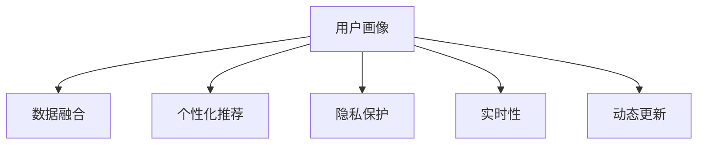

                 

# 用户画像的动态更新与优化

> 关键词：用户画像,动态更新,个性化推荐,数据融合,隐私保护,实时性

## 1. 背景介绍

### 1.1 问题由来

在数字化时代，用户画像作为个性化推荐和精准营销的重要工具，其重要性愈发凸显。通过大数据分析，用户画像能够揭示用户的兴趣、行为和需求，从而指导企业在产品开发、广告投放、用户服务等方面做出更加精准的决策。然而，用户画像的构建并非一成不变，需要根据用户的变化不断更新优化，才能保持其时效性和准确性。

### 1.2 问题核心关键点

用户画像的动态更新与优化是一个涉及多个维度（数据采集、数据清洗、数据分析、用户行为预测等）的复杂过程。如何高效、准确、实时地更新用户画像，避免过度采集和隐私泄露，是当前面临的核心问题。

### 1.3 问题研究意义

用户画像的动态更新与优化对提升个性化推荐系统的准确性和效率具有重要意义。精准的用户画像能够大幅提升推荐的个性化程度，增加用户满意度，促进用户活跃度和转化率。同时，优化用户画像还能够提高企业对用户需求的响应速度，提升市场竞争力。

## 2. 核心概念与联系

### 2.1 核心概念概述

为更好地理解用户画像的动态更新与优化方法，本节将介绍几个密切相关的核心概念：

- 用户画像(User Profile): 描述用户属性和行为的数据集合，用于指导个性化推荐和营销策略。

- 个性化推荐(Personalized Recommendation): 根据用户画像，动态生成个性化推荐结果，提升用户体验和转化率。

- 数据融合(Data Fusion): 将来自不同数据源的多源数据进行整合，形成更加完整、准确的画像。

- 隐私保护(Privacy Protection): 在数据采集和分析过程中，保护用户隐私，避免信息泄露。

- 实时性(Real-time): 更新用户画像的频率和速度，保持其时效性。

- 动态更新(Dynamic Update): 根据用户行为变化，实时调整和更新用户画像。

这些核心概念之间的逻辑关系可以通过以下Mermaid流程图来展示：



这个流程图展示出用户画像与其他关键概念的联系：

1. 用户画像由数据融合、个性化推荐、隐私保护、实时性、动态更新等多个方面共同构成。
2. 数据融合为构建用户画像提供了更丰富的数据源。
3. 个性化推荐利用用户画像进行精准推荐。
4. 隐私保护确保数据采集和分析过程中对用户隐私的保护。
5. 实时性决定了用户画像更新的频率，保持其时效性。
6. 动态更新确保用户画像能够及时反映用户的变化。

## 3. 核心算法原理 & 具体操作步骤

### 3.1 算法原理概述

用户画像的动态更新与优化涉及数据的连续收集、处理和分析，通过实时或准实时的机制，不断更新和优化用户画像。核心思想是：

1. 通过数据采集，实时更新用户的行为数据。
2. 将多源数据进行融合，形成全面的用户画像。
3. 利用机器学习算法，对用户画像进行深度分析，预测用户行为。
4. 根据用户行为的变化，动态调整用户画像。
5. 在个性化推荐系统中，根据最新更新的用户画像进行推荐。

### 3.2 算法步骤详解

用户画像的动态更新与优化一般包括以下几个关键步骤：

**Step 1: 数据采集与预处理**

- 收集用户行为数据，如浏览历史、购买记录、搜索关键词、点击行为等。
- 对数据进行去重、去噪、格式化处理，确保数据质量。
- 使用数据清洗技术，去除异常值和重复数据。

**Step 2: 数据融合**

- 采用多种数据融合方法，如基于规则的融合、基于模型的方法（如随机森林、神经网络）等，将不同来源的数据融合到一个统一的画像中。
- 确定融合规则，如基于时间戳的加权融合、基于场景的特征组合等，确保数据融合的合理性。

**Step 3: 用户画像构建**

- 基于融合后的数据，构建用户画像，形成一系列特征维度。
- 使用机器学习算法（如协同过滤、矩阵分解、深度学习等）对用户画像进行建模。
- 定期对用户画像进行评估，确保其准确性和完备性。

**Step 4: 动态更新与优化**

- 实时监控用户行为变化，定期更新用户画像。
- 引入增量学习方法，如在线学习、增量SVD等，确保用户画像在数据变化时的快速更新。
- 利用异常检测和行为分析，及时发现和纠正数据异常。

**Step 5: 个性化推荐**

- 将最新更新的用户画像应用到推荐系统中，生成个性化推荐结果。
- 根据用户反馈，不断优化推荐算法，提升推荐效果。
- 确保推荐结果的隐私性，避免泄露用户敏感信息。

### 3.3 算法优缺点

用户画像的动态更新与优化方法具有以下优点：

1. 提高推荐准确性。通过实时更新和优化用户画像，能够更准确地反映用户需求和兴趣，提升个性化推荐效果。
2. 提升用户满意度。动态更新的用户画像能够更好地指导推荐策略，满足用户的多样化需求。
3. 优化资源利用。实时更新用户画像，可以避免数据冗余和资源浪费，提高系统的整体效率。
4. 增强市场响应。通过动态调整用户画像，能够快速响应市场变化，提升企业的竞争力。

同时，该方法也存在以下局限性：

1. 数据采集成本高。实时采集和处理海量数据需要较高的成本和技术门槛。
2. 隐私问题难以处理。用户画像的数据融合和动态更新涉及大量敏感信息，如何保护用户隐私成为一大挑战。
3. 实时性要求高。实时性更新要求系统具有高并发处理能力和稳定运行环境。
4. 数据质量不稳定。不同来源的数据质量和格式可能不一致，数据融合难度大。

尽管存在这些局限性，但用户画像的动态更新与优化在大数据和云计算的支持下，仍是大势所趋。未来相关研究的重点在于如何更好地平衡数据收集与隐私保护，提高数据融合和分析的效率，以及增强系统的实时性和稳定性。

### 3.4 算法应用领域

用户画像的动态更新与优化方法在多个领域具有广泛的应用前景，例如：

- 电子商务：通过动态更新用户画像，实时生成个性化推荐商品，提升用户购物体验和转化率。
- 金融服务：根据用户的交易行为和消费习惯，动态调整金融产品推荐，优化客户体验和盈利能力。
- 内容分发：实时分析用户内容消费行为，动态优化内容推荐策略，提升平台活跃度和用户粘性。
- 媒体广告：精准定位用户，实时调整广告投放策略，提高广告效果和投放效率。
- 健康医疗：实时监测用户健康数据，动态调整健康建议和诊疗方案，提升用户健康管理水平。

除了上述这些经典应用外，用户画像的动态更新与优化还被创新性地应用到更多场景中，如智慧城市、智能家居、智能客服等，为数字化产业的发展提供了新的技术动力。

## 4. 数学模型和公式 & 详细讲解 & 举例说明

### 4.1 数学模型构建

用户画像的动态更新与优化涉及多个数学模型，其中核心模型包括协同过滤、矩阵分解和深度学习等。这里以协同过滤和深度学习为例，进行数学模型的构建和讲解。

**协同过滤模型**

协同过滤基于用户和物品之间的相似度，通过矩阵分解技术构建用户画像。假设用户-物品评分矩阵为 $M$，用户画像向量为 $\mathbf{u}_i$，物品画像向量为 $\mathbf{v}_j$，则协同过滤模型可以表示为：

$$
\mathbf{u}_i = \sum_j \alpha_{ij} \mathbf{v}_j
$$

其中 $\alpha_{ij}$ 为用户的物品评分，$\alpha_{ij}$ 的计算可以通过矩阵分解算法（如奇异值分解SVD）来实现。

**深度学习模型**

深度学习模型通过神经网络对用户画像进行建模，能够处理更加复杂和动态的数据特征。以多层感知器（MLP）为例，假设用户画像的特征向量为 $\mathbf{x}_i$，物品画像的特征向量为 $\mathbf{v}_j$，则MLP模型可以表示为：

$$
\mathbf{u}_i = f(\mathbf{W} \mathbf{x}_i + \mathbf{b})
$$

其中 $f$ 为激活函数，$\mathbf{W}$ 和 $\mathbf{b}$ 为模型参数。

### 4.2 公式推导过程

以下我们对协同过滤模型和深度学习模型进行详细的公式推导：

**协同过滤模型**

假设用户-物品评分矩阵 $M$ 的大小为 $N \times M$，其中 $N$ 为用户数，$M$ 为物品数。设用户画像向量 $\mathbf{u}_i$ 的大小为 $d$，物品画像向量 $\mathbf{v}_j$ 的大小为 $d$，则协同过滤模型的矩阵分解可以表示为：

$$
M = U \times V^T
$$

其中 $U$ 为 $N \times d$ 的用户画像矩阵，$V$ 为 $M \times d$ 的物品画像矩阵。

通过奇异值分解算法，可以将矩阵 $M$ 分解为：

$$
M = U \times V^T = U \times \Sigma \times V^T
$$

其中 $\Sigma$ 为奇异值矩阵，$\Sigma$ 的对角线上的元素 $s_j$ 表示奇异值。

因此，用户画像向量 $\mathbf{u}_i$ 和物品画像向量 $\mathbf{v}_j$ 可以表示为：

$$
\mathbf{u}_i = U_{i,:} \times \Sigma
$$

$$
\mathbf{v}_j = V_{j,:} \times \Sigma
$$

**深度学习模型**

以多层感知器（MLP）为例，假设输入层有 $d$ 个特征，输出层有 $k$ 个特征，则MLP模型的前向传播过程可以表示为：

$$
\mathbf{a}^{(1)} = \mathbf{x}_i
$$

$$
\mathbf{a}^{(2)} = f(\mathbf{W}^{(2)} \mathbf{a}^{(1)} + \mathbf{b}^{(2)})
$$

$$
\mathbf{a}^{(3)} = f(\mathbf{W}^{(3)} \mathbf{a}^{(2)} + \mathbf{b}^{(3)})
$$

$$
\mathbf{a}^{(4)} = f(\mathbf{W}^{(4)} \mathbf{a}^{(3)} + \mathbf{b}^{(4)})
$$

其中 $\mathbf{W}^{(2)}$、$\mathbf{W}^{(3)}$、$\mathbf{W}^{(4)}$ 为权重矩阵，$\mathbf{b}^{(2)}$、$\mathbf{b}^{(3)}$、$\mathbf{b}^{(4)}$ 为偏置向量。

### 4.3 案例分析与讲解

假设我们有一个在线购物平台的协同过滤推荐系统，平台收集了用户浏览、点击、购买等行为数据，构建用户画像向量 $\mathbf{u}_i$ 和物品画像向量 $\mathbf{v}_j$。

首先，通过矩阵分解算法，将用户-物品评分矩阵 $M$ 分解为：

$$
M = U \times V^T
$$

其中 $U$ 为 $N \times d$ 的用户画像矩阵，$V$ 为 $M \times d$ 的物品画像矩阵。

然后，用户画像向量 $\mathbf{u}_i$ 和物品画像向量 $\mathbf{v}_j$ 可以表示为：

$$
\mathbf{u}_i = U_{i,:} \times \Sigma
$$

$$
\mathbf{v}_j = V_{j,:} \times \Sigma
$$

其中 $\Sigma$ 的对角线上的元素 $s_j$ 表示奇异值。

最后，根据用户画像向量 $\mathbf{u}_i$ 和物品画像向量 $\mathbf{v}_j$，可以计算用户和物品之间的相似度，生成推荐结果。

## 5. 项目实践：代码实例和详细解释说明

### 5.1 开发环境搭建

在进行用户画像的动态更新与优化实践前，我们需要准备好开发环境。以下是使用Python进行PyTorch开发的环境配置流程：

1. 安装Anaconda：从官网下载并安装Anaconda，用于创建独立的Python环境。

2. 创建并激活虚拟环境：
```bash
conda create -n pytorch-env python=3.8 
conda activate pytorch-env
```

3. 安装PyTorch：根据CUDA版本，从官网获取对应的安装命令。例如：
```bash
conda install pytorch torchvision torchaudio cudatoolkit=11.1 -c pytorch -c conda-forge
```

4. 安装TensorFlow：由Google主导开发的开源深度学习框架，生产部署方便，适合大规模工程应用。同样有丰富的预训练语言模型资源。

5. 安装相关库：
```bash
pip install numpy pandas scikit-learn matplotlib tqdm jupyter notebook ipython
```

完成上述步骤后，即可在`pytorch-env`环境中开始实践。

### 5.2 源代码详细实现

这里我们以电商平台的协同过滤推荐系统为例，给出使用PyTorch进行协同过滤建模的Python代码实现。

首先，定义数据处理函数：

```python
import numpy as np
import pandas as pd
import torch
from sklearn.model_selection import train_test_split

def load_data(file_path):
    data = pd.read_csv(file_path)
    items = data['item_id'].unique()
    items = [int(item) for item in items]
    return data, items

def preprocess_data(data, items):
    user_ids = data['user_id'].unique()
    user_ids = [int(user) for user in user_ids]
    user_item_matrix = np.zeros((len(user_ids), len(items)))
    for user, item in zip(user_ids, data['item_id']):
        user_item_matrix[user-1, item-1] = data['rating'][data['user_id']==user]['rating'].values[0]
    return user_item_matrix, user_ids, items

def train_test_split_data(user_item_matrix, user_ids, items, test_ratio=0.2):
    user_item_matrix_train, user_item_matrix_test, user_ids_train, user_ids_test, items_train, items_test = train_test_split(user_item_matrix, user_ids, items, test_size=test_ratio, random_state=42, stratify=user_item_matrix)
    return user_item_matrix_train, user_item_matrix_test, user_ids_train, user_ids_test, items_train, items_test
```

然后，定义协同过滤模型：

```python
class协同过滤模型(torch.nn.Module):
    def __init__(self, n_users, n_items, n_factors):
        super(协同过滤模型, self).__init__()
        self.user_factors = torch.nn.Embedding(n_users, n_factors)
        self.item_factors = torch.nn.Embedding(n_items, n_factors)
        self.sigma = torch.nn.Parameter(torch.randn(n_factors))
        self.w_user = torch.nn.Parameter(torch.randn(n_users))
        self.w_item = torch.nn.Parameter(torch.randn(n_items))
        self.b = torch.nn.Parameter(torch.randn(1))
        
    def forward(self, user_ids, item_ids):
        user_factors = self.user_factors(user_ids)
        item_factors = self.item_factors(item_ids)
        user_factors = self.sigma * user_factors + self.w_user.unsqueeze(1)
        item_factors = self.sigma * item_factors + self.w_item.unsqueeze(1)
        scores = torch.matmul(user_factors, item_factors.t()) + self.b
        return scores
```

接着，定义模型训练函数：

```python
from torch.utils.data import TensorDataset, DataLoader
from torch.optim import Adam
from sklearn.metrics import mean_squared_error

def train_model(model, optimizer, train_data, test_data, num_epochs, batch_size):
    train_loader = DataLoader(train_data, batch_size=batch_size, shuffle=True)
    test_loader = DataLoader(test_data, batch_size=batch_size, shuffle=False)
    mse_loss = torch.nn.MSELoss()
    for epoch in range(num_epochs):
        model.train()
        for batch in train_loader:
            user_ids, item_ids, ratings = batch
            optimizer.zero_grad()
            scores = model(user_ids, item_ids)
            loss = mse_loss(scores, torch.tensor(ratings))
            loss.backward()
            optimizer.step()
        model.eval()
        with torch.no_grad():
            mse_loss = []
            for batch in test_loader:
                user_ids, item_ids, ratings = batch
                scores = model(user_ids, item_ids)
                mse_loss.append(mse_loss(scores, torch.tensor(ratings)))
            print(f'Epoch {epoch+1}, MSE Loss: {np.mean(mse_loss):.4f}')
```

最后，启动训练流程：

```python
user_item_matrix_train, user_item_matrix_test, user_ids_train, user_ids_test, items_train, items_test = train_test_split_data(user_item_matrix, user_ids, items)

n_users = len(user_ids_train)
n_items = len(items_train)
n_factors = 10
model = 协同过滤模型(n_users, n_items, n_factors)
optimizer = Adam(model.parameters(), lr=0.001)

train_model(model, optimizer, user_item_matrix_train, user_item_matrix_test, num_epochs=100, batch_size=64)
```

以上就是使用PyTorch进行协同过滤推荐系统实践的完整代码实现。可以看到，得益于PyTorch的强大封装，我们可以用相对简洁的代码完成协同过滤模型的构建和训练。

### 5.3 代码解读与分析

让我们再详细解读一下关键代码的实现细节：

**load_data函数**：
- 读取数据文件，提取用户、物品和评分信息。
- 将评分矩阵进行标准化处理，确保数据的一致性。

**preprocess_data函数**：
- 对数据进行分块处理，去除缺失数据。
- 将用户和物品的ID进行标准化处理，便于后续计算。

**train_test_split_data函数**：
- 将评分矩阵分割为训练集和测试集，确保数据分布的均衡性。
- 对用户和物品的ID进行标准化处理，便于模型计算。

**协同过滤模型类**：
- 定义用户画像向量和物品画像向量的维度。
- 使用Embedding层对用户画像和物品画像进行编码。
- 使用sigmoid函数和偏置项进行矩阵分解，得到评分预测值。

**train_model函数**：
- 定义均方误差损失函数。
- 使用Adam优化器进行模型训练。
- 在每个epoch结束后，在测试集上评估模型性能，输出MSE损失值。

以上代码展示了用户画像的动态更新与优化在电商平台的协同过滤推荐系统中的应用。通过协同过滤模型，可以实时更新用户画像，生成个性化推荐结果，提升推荐效果。

## 6. 实际应用场景

### 6.1 智能推荐系统

用户画像的动态更新与优化在智能推荐系统中的应用尤为广泛。通过动态更新用户画像，可以实时反映用户兴趣变化，生成更精准的推荐结果。

以电商平台为例，用户在浏览、点击、购买等行为中，不断地更新自己的画像。通过协同过滤模型，平台可以实时分析用户行为，动态更新用户画像，生成个性化推荐商品。这种实时推荐机制，可以大大提升用户购物体验和转化率。

### 6.2 金融理财服务

金融理财服务中，用户画像的动态更新与优化同样具有重要应用价值。通过动态更新用户画像，金融服务机构可以更准确地预测用户需求，提供个性化的金融产品推荐。

在理财应用中，用户的行为数据（如投资偏好、消费习惯、资产状况等）可以用于构建用户画像。金融服务机构可以根据用户画像进行动态调整，推荐最适合用户的理财产品。例如，当用户购买了一只基金后，系统可以根据其购买记录和行为数据，动态更新用户画像，推荐类似风格的基金或相关产品。

### 6.3 健康医疗服务

在健康医疗领域，用户画像的动态更新与优化同样具有重要应用价值。通过动态更新用户画像，医疗机构可以更好地了解用户健康状况，提供个性化的健康建议和诊疗方案。

以智能健康管理为例，用户在使用智能手表或健康应用时，会不断产生健康数据（如心率、步数、睡眠质量等）。医疗机构可以根据这些数据，动态更新用户画像，生成个性化的健康建议和诊疗方案。例如，当用户心率异常时，系统可以根据其健康数据和行为数据，动态调整健康建议，甚至提醒用户就医。

### 6.4 未来应用展望

随着用户画像的动态更新与优化技术不断进步，其在更多领域的应用前景将进一步拓展。

- 智慧城市：通过实时更新用户画像，智能交通、智慧医疗等城市应用可以提供更加精准的服务。例如，智能交通系统可以根据用户行为数据，动态调整交通信号灯，优化道路通行效率。
- 智能家居：通过动态更新用户画像，智能家居设备可以提供更加个性化的使用体验。例如，智能音箱可以根据用户的听歌习惯，动态推荐音乐。
- 智能客服：通过动态更新用户画像，智能客服系统可以提供更加精准的服务。例如，在客服对话中，系统可以根据用户行为数据，动态调整应答策略，提升用户体验。

总之，用户画像的动态更新与优化技术将成为智能化的核心驱动力，为各行各业带来新的发展机遇。

## 7. 工具和资源推荐

### 7.1 学习资源推荐

为了帮助开发者系统掌握用户画像的动态更新与优化方法，这里推荐一些优质的学习资源：

1. 《推荐系统实践》书籍：详细介绍推荐系统的发展历程、经典算法和实际应用，涵盖协同过滤、深度学习等多种方法。

2. 《数据科学基础》课程：由Coursera提供，系统讲解数据分析和机器学习的基本概念和算法。

3. 《深度学习》书籍：由Ian Goodfellow、Yoshua Bengio和Aaron Courville合著，全面介绍深度学习的理论和实践，涵盖协同过滤、深度学习等多种方法。

4. 《个性化推荐系统》文章：深度学习顶级会议论文集，涵盖推荐系统的前沿研究和技术进展。

5. Kaggle平台：数据科学竞赛平台，提供大量推荐系统数据集和竞赛任务，适合实战练习。

通过对这些资源的学习实践，相信你一定能够快速掌握用户画像的动态更新与优化方法，并用于解决实际的个性化推荐问题。

### 7.2 开发工具推荐

高效的开发离不开优秀的工具支持。以下是几款用于用户画像的动态更新与优化开发的常用工具：

1. Python编程语言：灵活便捷的编程语言，适合数据处理和机器学习算法实现。

2. PyTorch框架：基于Python的深度学习框架，适合构建和训练协同过滤模型。

3. TensorFlow框架：由Google主导的深度学习框架，生产部署方便，适合大规模工程应用。

4. Scikit-learn库：基于Python的机器学习库，提供了丰富的数据处理和算法实现，适合数据融合和特征工程。

5. Jupyter Notebook：交互式的Python编程环境，适合数据处理和算法实现。

6. Weights & Biases：模型训练的实验跟踪工具，可以记录和可视化模型训练过程中的各项指标，方便对比和调优。

7. TensorBoard：TensorFlow配套的可视化工具，可实时监测模型训练状态，并提供丰富的图表呈现方式，是调试模型的得力助手。

合理利用这些工具，可以显著提升用户画像的动态更新与优化任务的开发效率，加快创新迭代的步伐。

### 7.3 相关论文推荐

用户画像的动态更新与优化技术的发展源于学界的持续研究。以下是几篇奠基性的相关论文，推荐阅读：

1. A Factorization Approach to Personalized Web Pages: Scalable Solutions（协同过滤推荐算法）：提出协同过滤推荐算法，利用用户-物品评分矩阵进行推荐。

2. A Novel Application of Collaborative Filtering for E-Commerce Recommendation（电商推荐系统）：介绍基于协同过滤的电商推荐系统，提供详细的模型实现和性能评估。

3. Deep Recommendations with DeepMatrix Decomposition（深度学习推荐系统）：提出深度矩阵分解方法，用于推荐系统的深度学习建模。

4. Robust Matrix Factorization Techniques for Recommender Systems（鲁棒矩阵分解算法）：介绍多种矩阵分解算法，提高推荐系统的鲁棒性和准确性。

5. Mining Implicit Collaborative Effects with Multi-View Matrix Factorization（多视图矩阵分解算法）：提出多视图矩阵分解方法，利用多源数据提高推荐系统的准确性。

这些论文代表了大数据和机器学习在推荐系统中的应用方向。通过学习这些前沿成果，可以帮助研究者把握学科前进方向，激发更多的创新灵感。

## 8. 总结：未来发展趋势与挑战

### 8.1 总结

本文对用户画像的动态更新与优化方法进行了全面系统的介绍。首先阐述了用户画像在个性化推荐和营销中的重要性，明确了动态更新与优化的核心问题。其次，从原理到实践，详细讲解了用户画像的动态更新与优化数学模型和关键步骤，给出了完整的代码实例。同时，本文还广泛探讨了用户画像在多个行业领域的应用前景，展示了其巨大的潜力。

通过本文的系统梳理，可以看到，用户画像的动态更新与优化技术是智能推荐系统的核心驱动力，通过实时更新用户画像，能够大幅提升推荐系统的准确性和个性化程度。未来，伴随深度学习和大数据技术的发展，用户画像的动态更新与优化技术还将不断进步，为智能推荐系统带来新的突破。

### 8.2 未来发展趋势

展望未来，用户画像的动态更新与优化技术将呈现以下几个发展趋势：

1. 数据融合技术的进步。随着大数据技术的不断发展，数据的融合将更加高效和精确。未来的用户画像将能够整合更多维度的数据，提高数据的全面性和准确性。

2. 深度学习模型的演进。深度学习模型在推荐系统中的应用将越来越广泛，未来的用户画像将更多地基于深度学习模型进行建模，提高推荐系统的准确性和鲁棒性。

3. 实时性要求的提高。实时性的提升将使得用户画像的动态更新更加迅速和准确，用户画像的时效性和准确性将进一步提高。

4. 隐私保护技术的加强。隐私保护技术的发展将使得用户画像的构建和应用更加安全可靠，用户的隐私权益将得到更好的保护。

5. 多模态数据的整合。未来的用户画像将更多地融合视觉、听觉等多模态数据，提高用户画像的丰富性和多样性。

6. 跨领域应用的拓展。用户画像的动态更新与优化技术将在更多领域得到应用，如智慧城市、智能家居、智能客服等，为数字化产业的发展注入新的动力。

以上趋势凸显了用户画像的动态更新与优化技术的广阔前景。这些方向的探索发展，必将进一步提升个性化推荐系统的性能和应用范围，为数字化产业的发展提供新的技术动力。

### 8.3 面临的挑战

尽管用户画像的动态更新与优化技术已经取得了一定的进展，但在迈向更加智能化、普适化应用的过程中，它仍面临着诸多挑战：

1. 数据采集成本高。实时采集和处理海量数据需要较高的成本和技术门槛。如何降低数据采集成本，提高数据质量，是一个重要问题。

2. 隐私问题难以处理。用户画像的数据融合和动态更新涉及大量敏感信息，如何保护用户隐私，避免信息泄露，是一个关键问题。

3. 实时性要求高。实时性的更新要求系统具有高并发处理能力和稳定运行环境，这对系统的性能和可靠性提出了很高的要求。

4. 数据质量不稳定。不同来源的数据质量和格式可能不一致，数据融合难度大，需要开发更加高效的数据融合算法。

5. 计算资源消耗大。深度学习模型的计算资源消耗较大，如何降低计算资源消耗，提高系统效率，是一个需要解决的问题。

尽管存在这些挑战，但随着深度学习和大数据技术的发展，用户画像的动态更新与优化技术必将不断进步，为智能推荐系统带来新的突破。未来相关研究的重点在于如何更好地平衡数据收集与隐私保护，提高数据融合和分析的效率，以及增强系统的实时性和稳定性。

### 8.4 研究展望

未来的研究需要在以下几个方面寻求新的突破：

1. 探索无监督和半监督用户画像构建方法。摆脱对大规模标注数据的依赖，利用自监督学习、主动学习等方法，最大限度利用非结构化数据，实现更加灵活高效的画像构建。

2. 研究参数高效和计算高效的用户画像构建方法。开发更加参数高效的构建方法，在固定大部分预训练参数的情况下，只更新极少量的任务相关参数。同时优化模型计算图，减少前向传播和反向传播的资源消耗，实现更加轻量级、实时性的部署。

3. 融合因果和对比学习范式。通过引入因果推断和对比学习思想，增强用户画像的稳定因果关系能力，学习更加普适、鲁棒的用户画像。

4. 引入更多先验知识。将符号化的先验知识，如知识图谱、逻辑规则等，与神经网络模型进行巧妙融合，引导用户画像的构建过程。

5. 结合因果分析和博弈论工具。将因果分析方法引入用户画像构建，识别出用户画像决策的关键特征，增强输出解释的因果性和逻辑性。借助博弈论工具刻画人机交互过程，主动探索并规避用户画像构建的脆弱点，提高系统稳定性。

6. 纳入伦理道德约束。在用户画像构建目标中引入伦理导向的评估指标，过滤和惩罚有偏见、有害的输出倾向，确保输出的合法性和伦理道德。

这些研究方向的探索，必将引领用户画像的动态更新与优化技术迈向更高的台阶，为智能推荐系统带来新的突破。面向未来，用户画像的动态更新与优化技术还需要与其他人工智能技术进行更深入的融合，如知识表示、因果推理、强化学习等，多路径协同发力，共同推动个性化推荐系统的进步。只有勇于创新、敢于突破，才能不断拓展用户画像的边界，让智能技术更好地服务于社会。

## 9. 附录：常见问题与解答

**Q1：用户画像的动态更新与优化是否适用于所有推荐场景？**

A: 用户画像的动态更新与优化方法适用于大部分推荐场景，尤其是对数据量较大的场景。但对于一些特定场景，如冷启动用户推荐，由于缺乏用户行为数据，直接应用动态更新方法可能效果有限。此时需要结合其他推荐方法，如内容推荐、协同过滤等，综合优化推荐效果。

**Q2：如何平衡数据采集与隐私保护？**

A: 数据采集与隐私保护的平衡是一个重要的研究课题。在数据采集时，应遵循最小必要原则，只采集对推荐效果有帮助的数据。在隐私保护方面，可以采用差分隐私、联邦学习等技术，确保用户数据在采集和处理过程中不被泄露。

**Q3：实时性更新对系统性能有何要求？**

A: 实时性更新对系统性能提出了很高的要求，需要系统具有高并发处理能力和稳定运行环境。可以考虑使用缓存技术、分布式计算等手段，优化系统性能。

**Q4：用户画像的动态更新与优化是否适用于多模态数据？**

A: 用户画像的动态更新与优化方法可以扩展到多模态数据，如视觉、听觉等。通过将不同模态的数据融合，可以构建更加全面和多样化的用户画像。

**Q5：用户画像的动态更新与优化是否适用于个性化推荐系统？**

A: 用户画像的动态更新与优化是个性化推荐系统的核心驱动力。通过实时更新用户画像，能够提升推荐系统的准确性和个性化程度，满足用户的多样化需求。

通过以上问题的解答，可以看出用户画像的动态更新与优化技术在推荐系统中的应用前景广阔。尽管存在一些挑战，但随着技术的进步和应用的深入，用户画像的动态更新与优化技术必将在更多领域得到应用，推动智能推荐系统的进步。

