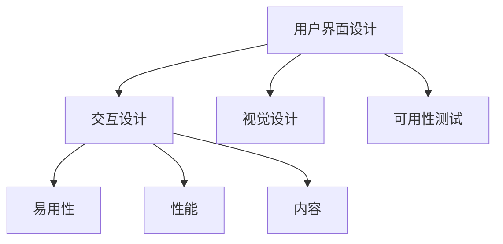

                 

# 用户界面设计：打造友好易用的人机交互体验

> 关键词：用户界面设计, 人机交互, 用户体验(UX), 用户界面(UI), 交互设计, 界面原型设计, 可用性测试

## 1. 背景介绍

### 1.1 问题由来

在信息技术日益发达的今天，用户界面设计（UI Design）成为了软件开发中不可或缺的一部分。无论是为了提升产品的市场竞争力，还是为了提高用户的使用体验，良好的用户界面设计都是至关重要的。随着科技的进步，用户体验（User Experience, UX）被越来越多的人重视，各大科技公司纷纷将UX作为核心竞争力来打造，以期在激烈的市场竞争中脱颖而出。

用户界面设计的本质是用户与产品的交互方式，其目的是为了让用户能够轻松、快捷、愉悦地使用产品。在这个过程中，如何通过合理的布局、视觉元素的设计、交互方式的选择等，来提高用户的满意度和粘性，成为了设计人员不断探索的课题。

### 1.2 问题核心关键点

UI设计涉及多个方面，包括界面布局、视觉设计、交互设计、原型制作、可用性测试等。这些关键点相互关联，共同构成了良好的用户界面。在实际设计中，需要综合考虑用户的视觉体验、操作便捷性、心理满足感等，通过不断迭代优化，打造出符合用户需求和审美的人机交互界面。

## 2. 核心概念与联系

### 2.1 核心概念概述

为了更好地理解用户界面设计的核心概念和关联，我们将介绍几个基础概念：

- **用户界面设计（UI Design）**：指为满足用户需求而设计出来的视觉交互面，是用户体验的一部分。良好的UI设计可以提升用户满意度，增加用户黏性，最终提升产品的市场竞争力。
- **交互设计（Interaction Design）**：专注于设计和创建有用的、富有吸引力的、易用的交互方式，让用户能够轻松地与产品进行互动。
- **用户体验（User Experience, UX）**：涉及用户与产品互动时的所有方面，包括视觉设计、交互设计、易用性、性能、可用性、内容等。
- **可用性测试（Usability Testing）**：通过让真实用户使用产品来评估其可用性，以发现问题并提出改进建议，保证产品的最终体验。

这些概念之间的联系可以通过以下Mermaid流程图来展示：



这个流程图展示了UI设计过程中各个环节之间的关联：

1. **视觉设计**：通过颜色、字体、排版等视觉元素的设计，提升界面的吸引力和美观度。
2. **交互设计**：注重用户操作流程的流畅性和直观性，通过合理的设计让用户轻松使用。
3. **可用性测试**：通过实际用户的测试反馈，发现问题并改进，确保设计的可用性和易用性。
4. **易用性**和**性能**：设计需要考虑用户的使用感受和产品的响应速度，确保良好的用户体验。
5. **内容**：界面设计还需要考虑内容的呈现方式，使信息传达更加有效。

这些核心概念共同构成了用户界面设计的基本框架，通过合理的设计组合，打造出友好易用的产品界面。

## 3. 核心算法原理 & 具体操作步骤

### 3.1 算法原理概述

用户界面设计涉及到的算法原理主要包括：

- **用户心理学**：了解用户的行为习惯和心理需求，通过研究和分析，设计出符合用户预期的交互方式。
- **可用性原则**：遵循设计规范和最佳实践，如一致性、简洁性、易用性等，确保设计符合用户使用习惯。
- **交互设计理论**：如Don Norman的《设计心理学》、B.J. F meaning of user interface,1984的“俞军谈用户体验”等，提供设计思路和方法。

### 3.2 算法步骤详解

用户界面设计的基本步骤包括以下几个环节：

1. **用户研究**：通过问卷调查、用户访谈、竞品分析等方式，了解目标用户的需求和使用场景。
2. **信息架构**：对收集到的信息进行整理，确定页面结构和内容布局。
3. **原型制作**：使用工具如Sketch、Figma、Axure等，快速制作出界面原型。
4. **交互设计**：设计界面元素和交互方式，确保操作的直观性和流畅性。
5. **视觉设计**：通过颜色、字体、排版等视觉元素，提升界面的吸引力。
6. **可用性测试**：在实际用户中进行测试，收集反馈并优化设计。

### 3.3 算法优缺点

用户界面设计的主要优点包括：

- **提升用户满意度**：通过合理的设计，提升用户的使用体验，增加用户的黏性。
- **提高产品竞争力**：良好的UI设计可以提升产品的市场竞争力，吸引更多用户。

同时，也存在一些缺点：

- **设计周期长**：UI设计需要多次迭代优化，周期较长。
- **依赖技术能力**：优秀的UI设计需要具备一定的技术能力，包括交互设计和视觉设计等。
- **用户体验不固定**：用户需求和审美变化较快，需要持续优化。

### 3.4 算法应用领域

用户界面设计广泛应用于各类软件产品的开发中，包括但不限于：

- **移动应用**：如微信、支付宝、抖音等。优秀的UI设计可以提升用户的使用体验，增加用户黏性。
- **Web应用**：如电商平台、社交媒体、在线教育等。良好的UI设计可以提升用户体验，增加用户的转化率。
- **桌面应用**：如办公软件、视频编辑软件、设计工具等。优秀的UI设计可以提升用户的工作效率，降低使用难度。
- **车载系统**：如车载导航、多媒体娱乐等。合理的UI设计可以提升用户的驾驶体验，增加系统的易用性。

## 4. 数学模型和公式 & 详细讲解 & 举例说明

### 4.1 数学模型构建

用户界面设计涉及到的数学模型主要关注以下几个方面：

- **任务完成时间（Task Completion Time, TCT）**：评估用户完成任务所需的时间。
- **用户错误率（User Error Rate, UER）**：评估用户在操作过程中犯错的概率。
- **用户满意度（User Satisfaction, URS）**：通过调查问卷等手段，评估用户对产品的满意程度。

### 4.2 公式推导过程

以任务完成时间为例，假设一个用户完成某个任务需要的时间为$T$，包括输入、操作和反馈等环节。每个环节所需的时间可以用数学公式表示为：

$$ T = T_{input} + T_{operation} + T_{feedback} $$

其中，$T_{input}$表示用户输入数据所需的时间，$T_{operation}$表示用户进行操作所需的时间，$T_{feedback}$表示用户接收反馈所需的时间。

### 4.3 案例分析与讲解

在实际设计中，可以通过用户研究来确定每个环节的时间消耗。例如，在移动应用的登录页面设计中，用户输入用户名和密码的时间可以通过问卷调查得到。通过这些数据，可以分析并优化设计，使操作流程更加高效，从而提升用户体验。

## 5. 项目实践：代码实例和详细解释说明

### 5.1 开发环境搭建

在开始设计前，需要准备好开发环境，包括：

- **开发工具**：如Sketch、Figma、Axure等，用于原型设计和可视化的工具。
- **代码工具**：如Adobe XD、InVision Studio等，用于快速迭代和原型测试的工具。
- **代码编写**：如HTML、CSS、JavaScript等，用于实现交互和样式的代码编写工具。

### 5.2 源代码详细实现

以移动应用的登录页面为例，可以按照以下步骤进行设计和实现：

1. **用户研究**：通过问卷调查，了解用户输入数据的主要来源和频率。
2. **信息架构**：确定页面的结构和内容布局，例如用户名和密码输入框的位置和大小。
3. **原型设计**：使用Sketch或Figma等工具，制作出登录页面的原型。
4. **交互设计**：使用JavaScript和CSS编写代码，实现用户的操作逻辑和样式。
5. **视觉设计**：通过颜色和字体等视觉元素，提升页面的吸引力。
6. **可用性测试**：在实际用户中进行测试，收集反馈并优化设计。

### 5.3 代码解读与分析

以下是一个简单的JavaScript代码示例，用于实现登录页面的用户输入和提交操作：

```javascript
// 获取用户名输入框和和密码输入框的引用
const usernameInput = document.getElementById('username');
const passwordInput = document.getElementById('password');

// 监听用户输入事件
usernameInput.addEventListener('input', function() {
  // 用户输入后，更新页面上的用户名提示
  const username提示 = document.getElementById('username_hint');
  username提示.textContent = `请输入用户名${usernameInput.value.length === 0 ? '' : '...'}`;
});

passwordInput.addEventListener('input', function() {
  // 用户输入密码后，更新页面上的密码提示
  const password提示 = document.getElementById('password_hint');
  password提示.textContent = `请输入密码${passwordInput.value.length === 0 ? '' : '...'}`;
});

// 监听提交事件
const form = document.getElementById('login-form');
form.addEventListener('submit', function(event) {
  // 阻止默认提交行为，实现异步提交
  event.preventDefault();
  
  // 获取用户输入的数据
  const username = usernameInput.value;
  const password = passwordInput.value;
  
  // 发送数据到服务器进行验证
  // 这里使用了axios库进行网络请求
  axios.post('/api/login', { username, password })
    .then(function(response) {
      // 验证成功，跳转到主页面
      window.location.href = '/home';
    })
    .catch(function(error) {
      // 验证失败，显示错误提示
      const error提示 = document.getElementById('error-message');
      error提示.textContent = error.response.data.message;
    });
});
```

这段代码实现了用户输入验证和登录提交的过程。通过监听用户输入事件和表单提交事件，可以实时更新页面提示和执行验证操作，提升用户体验。

### 5.4 运行结果展示

在实际设计中，可以通过原型工具和可视化工具来展示设计成果。例如，使用Sketch或Figma等工具制作出登录页面的原型图，通过Mockups等形式展示给用户，收集反馈并优化设计。

## 6. 实际应用场景

### 6.1 电商平台的UI设计

电商平台需要提供给用户一个直观、易用的购物体验，界面设计尤为重要。良好的UI设计可以提升用户购买率、转化率和满意度，增加平台的竞争力。通过优化产品页面布局、搜索功能和商品展示方式，可以提升用户的购物体验，增加平台的用户粘性。

### 6.2 在线教育的UI设计

在线教育平台需要提供给用户一个高效、互动的学习环境。界面设计需要考虑课程内容的呈现方式、学习路径的指导、用户反馈的收集等，通过合理的布局和交互设计，提升用户的学习体验，增加平台的黏性和用户满意度。

### 6.3 医疗健康应用的UI设计

医疗健康应用需要提供给用户一个安全、可靠的使用环境。界面设计需要考虑用户数据的隐私保护、操作步骤的清晰指引、异常情况的友好提示等，通过合理的设计和交互方式，提升用户的信任度和满意度。

### 6.4 未来应用展望

未来的UI设计将继续向更加个性化、智能化、互动化的方向发展。随着人工智能和机器学习技术的进步，UI设计将能够更好地适应用户需求，提供更加智能的交互体验。同时，云计算和物联网技术的发展，将使UI设计更加灵活和可扩展，提升用户体验的实时性和便捷性。

## 7. 工具和资源推荐

### 7.1 学习资源推荐

为了帮助开发者系统掌握用户界面设计的理论基础和实践技巧，这里推荐一些优质的学习资源：

1. **《Don't Make Me Think》**：史蒂夫·克鲁格（Steve Krug）的经典著作，详细介绍了UI设计的核心原则和方法。
2. **《设计心理学》**：唐纳德·诺曼（Donald A. Norman）的著作，讲述了用户体验设计的心理学基础和设计技巧。
3. **《交互设计基础》**：杰西卡·吉尔（Jessica Gill）和汤姆·莫里斯（Tom Morris）合著的书籍，全面介绍了交互设计的核心概念和最佳实践。
4. **《交互设计原则》**：杰西卡·吉尔的另一本书籍，详细介绍了交互设计中的视觉元素和用户体验原则。
5. **《设计模式》**：Erich Gamma等人合著的经典书籍，提供了大量的UI设计模式和最佳实践。

通过对这些资源的学习实践，相信你一定能够快速掌握用户界面设计的精髓，并用于解决实际的UI设计问题。

### 7.2 开发工具推荐

高效的开发离不开优秀的工具支持。以下是几款用于UI设计开发的常用工具：

1. **Sketch**：专业的UI设计工具，提供丰富的组件库和交互设计支持，适用于各种设备的设计。
2. **Figma**：基于云端的UI设计工具，支持多人协作，适用于团队开发和设计共享。
3. **Adobe XD**：集成了原型设计、交互设计、视觉设计等多种功能的综合性设计工具。
4. **InVision Studio**：支持原型的快速迭代和测试，适用于移动应用和网页应用的UI设计。
5. **Axure RP**：基于原型设计的技术，支持交互动画和脚本编写，适用于复杂交互的设计。

合理利用这些工具，可以显著提升UI设计的开发效率，加快创新迭代的步伐。

### 7.3 相关论文推荐

用户界面设计的发展离不开学术界的持续研究。以下是几篇奠基性的相关论文，推荐阅读：

1. **“The Elements of User Interface Design”**：提供了UI设计的核心原则和方法，详细介绍了布局、颜色、字体等设计要素。
2. **“Interaction in Consensual Encounters: The Cultural Logic of Signals and Frames”**：研究了交互设计的心理学基础，探讨了用户行为和认知模型。
3. **“The Psychology of Interface Design: Differences in Physical and Digital Interfaces”**：比较了物理界面和数字界面的设计差异，提供了设计建议和案例分析。
4. **“Design Patterns”**：提供了大量的UI设计模式和最佳实践，适用于不同的设计场景。
5. **“Interaction Design: Beyond Interaction Maps”**：探讨了交互设计的新趋势和未来发展方向，提供了前瞻性的设计思路。

这些论文代表了大界面设计的发展脉络。通过学习这些前沿成果，可以帮助研究者把握学科前进方向，激发更多的创新灵感。

## 8. 总结：未来发展趋势与挑战

### 8.1 总结

本文对用户界面设计的核心概念和实践方法进行了全面系统的介绍。首先阐述了用户界面设计的背景和意义，明确了UI设计在提升用户体验和产品竞争力方面的重要性。其次，从原理到实践，详细讲解了UI设计的数学模型和操作步骤，给出了UI设计任务开发的完整代码实例。同时，本文还广泛探讨了UI设计在电商、教育、医疗等多个行业领域的应用前景，展示了UI设计范式的广泛应用。此外，本文精选了UI设计的各类学习资源，力求为读者提供全方位的技术指引。

通过本文的系统梳理，可以看到，用户界面设计正在成为产品开发中不可或缺的一部分，通过合理的布局、视觉元素的设计、交互方式的选择等，来提升用户的满意度和粘性，最终提升产品的市场竞争力。未来，伴随人工智能和机器学习技术的进步，UI设计将能够更好地适应用户需求，提供更加智能的交互体验。

### 8.2 未来发展趋势

展望未来，用户界面设计将呈现以下几个发展趋势：

1. **智能化**：随着人工智能技术的发展，UI设计将更多地融入智能元素，如语音交互、自然语言处理等，提升用户体验的智能化水平。
2. **个性化**：通过数据分析和机器学习，UI设计将能够更好地适应用户的个性化需求，提供更加定制化的交互体验。
3. **实时性**：随着云计算和物联网技术的发展，UI设计将能够实时响应用户需求，提供更加实时和便捷的服务。
4. **可视化**：通过增强现实（AR）和虚拟现实（VR）技术，UI设计将能够提供更加沉浸式的交互体验，提升用户的参与感和满意度。
5. **社交化**：UI设计将更多地融入社交元素，如社区互动、好友推荐等，提升用户的社交体验和粘性。

以上趋势凸显了用户界面设计的广阔前景。这些方向的探索发展，必将进一步提升用户界面设计的技术水平，为构建更加智能、便捷、互动的产品界面铺平道路。

### 8.3 面临的挑战

尽管用户界面设计已经取得了显著成果，但在迈向更加智能化、普适化应用的过程中，仍面临诸多挑战：

1. **设计标准不一**：不同的平台和应用对UI设计有着不同的标准和规范，如何统一和协调这些标准，是一个需要解决的问题。
2. **设计效率不高**：UI设计通常需要多次迭代和优化，周期较长。如何提高设计效率，缩短产品上市时间，是一个重要课题。
3. **用户需求多变**：用户的审美和需求不断变化，UI设计需要持续更新和优化，以适应用户的新需求。
4. **技术实现复杂**：随着设计复杂度的增加，UI设计的技术实现难度也在增加，需要综合考虑交互设计、视觉设计、性能优化等多方面的因素。
5. **可用性测试难度大**：用户在实际使用中可能会遇到各种问题，如何通过可用性测试发现并解决这些问题，是一个重要的挑战。

### 8.4 研究展望

面对用户界面设计所面临的挑战，未来的研究需要在以下几个方面寻求新的突破：

1. **设计自动化**：开发更加智能的设计工具，通过自动化流程，快速生成设计方案，提高设计效率。
2. **设计协同化**：开发支持多人协作的设计工具，通过实时协作和版本控制，提高团队设计的效率和质量。
3. **设计评估**：开发更加科学的设计评估工具，通过数据分析和人工智能技术，量化评估设计方案的优劣，指导设计改进。
4. **设计融合**：将UI设计与其他技术（如AR、VR、人工智能等）进行更深入的融合，提供更加丰富和沉浸式的用户体验。
5. **设计优化**：通过机器学习和数据分析技术，不断优化设计方案，提升设计的效果和用户满意度。

这些研究方向将推动用户界面设计向更高的水平发展，为构建更加智能、便捷、互动的产品界面提供强有力的技术支持。

## 9. 附录：常见问题与解答

**Q1：UI设计中的颜色和字体如何选择？**

A: 颜色和字体是UI设计中的重要元素，需要根据品牌定位和用户需求进行选择。一般而言，颜色选择需要考虑品牌的主色调、辅色调以及颜色的情感属性，而字体选择则要考虑可读性、易读性和品牌风格等因素。可以通过问卷调查、用户测试等方式，收集用户反馈并调整颜色和字体设计。

**Q2：如何提升UI设计的可用性？**

A: 提升UI设计的可用性，主要从以下几个方面入手：

1. **一致性**：保证界面元素和操作方式的一致性，让用户能够轻松使用。
2. **简洁性**：避免界面元素过于复杂，尽量简洁明了，减少用户的学习成本。
3. **易用性**：通过合理的布局和交互设计，让用户能够轻松完成任务。
4. **反馈机制**：及时给用户反馈操作结果，避免用户产生困惑和误操作。

**Q3：UI设计中的交互元素如何选择？**

A: 交互元素需要根据用户的操作习惯和任务需求进行选择，一般而言，需要满足以下几个条件：

1. **直观性**：交互元素的操作方式要直观易懂，避免让用户产生困惑。
2. **响应速度**：交互元素的响应速度要快，避免用户等待过长时间。
3. **可操作性**：交互元素要易于操作，避免用户操作失误。
4. **反馈机制**：交互元素需要提供及时的反馈，让用户能够清晰地知道操作结果。

**Q4：如何进行UI设计的可用性测试？**

A: 进行UI设计的可用性测试，主要通过以下步骤：

1. **制定测试计划**：明确测试的目标和范围，设计测试任务和流程。
2. **选择测试用户**：根据用户群体选择合适的测试对象，避免测试结果的偏差。
3. **执行测试任务**：让测试用户按照测试流程进行操作，观察其行为和反馈。
4. **收集反馈**：记录用户的操作过程和反馈意见，分析用户使用中的问题和瓶颈。
5. **优化设计**：根据测试结果，优化UI设计，提升用户体验。

通过对这些常见问题的解答，相信你对UI设计有了更深入的理解，能够在实际设计中更好地应对各种挑战。

---

作者：禅与计算机程序设计艺术 / Zen and the Art of Computer Programming

