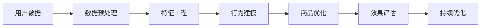

                 

# 用户行为分析：AI如何发现用户潜在需求，优化商品供给

## 1. 背景介绍

### 1.1 问题由来

在当今快速变化的商业环境中，企业越来越需要精确地理解用户需求，以便更好地调整产品和服务，提升用户满意度和忠诚度。然而，仅仅依靠传统的数据分析方法，难以全面、准确地捕捉用户行为特征。人工智能技术的兴起，为商家提供了更高效、精确的用户行为分析手段。

现代消费者行为日益复杂，通过精准的用户行为分析，商家能够及时发现市场变化和用户需求趋势，制定有效的营销策略和产品改进方案，从而优化商品供给。AI技术在这一过程中扮演了重要角色，特别是通过用户行为分析，商家可以洞察消费者潜在需求，优化商品库存、推荐和定价策略，提升整体业务运营效率。

### 1.2 问题核心关键点

用户行为分析的核心在于从用户的历史数据中挖掘行为模式和趋势，以此发现用户潜在需求，并据此优化商品供给。关键点包括：

1. 数据收集：获取用户行为数据，包括浏览、点击、购买、评价、社交媒体互动等行为记录。
2. 数据预处理：清洗、标准化、归一化数据，去除异常值和噪声。
3. 特征工程：提取有意义的特征，如用户兴趣、购买偏好、行为频率等。
4. 行为建模：使用机器学习算法对用户行为进行建模，预测用户需求和购买行为。
5. 商品优化：根据分析结果，调整商品库存、价格、推荐策略等。
6. 效果评估：衡量优化措施的效果，进行持续迭代和优化。

## 2. 核心概念与联系

### 2.1 核心概念概述

为更好地理解用户行为分析的原理和应用，本节将介绍几个关键概念：

- **用户行为分析**：通过对用户的历史行为数据进行分析，挖掘用户的偏好、需求和潜在兴趣，为企业决策提供依据。
- **机器学习**：利用算法从数据中学习知识，并用于预测、分类、聚类等任务。
- **深度学习**：通过神经网络模型进行高级抽象和特征提取，提升预测精度。
- **推荐系统**：根据用户历史行为和偏好，推荐相关商品或服务。
- **时序数据**：反映事件发生的先后顺序，如用户点击、购买时间等。
- **协同过滤**：通过分析用户行为相似度，推荐可能感兴趣的商品或服务。
- **集成学习**：将多个模型或算法进行组合，提高整体性能。
- **聚类分析**：将用户分组，寻找相似的群体特征。
- **关联规则**：挖掘数据中的规律和模式，用于营销分析等。

这些概念之间存在着紧密的联系，相互配合，共同构建起用户行为分析的技术框架。

### 2.2 核心概念原理和架构的 Mermaid 流程图



这个流程图展示了用户行为分析的核心步骤：从用户数据开始，通过预处理和特征工程准备数据，然后应用机器学习或深度学习模型进行行为建模，最后根据分析结果进行商品优化，并不断评估优化效果进行迭代。

## 3. 核心算法原理 & 具体操作步骤

### 3.1 算法原理概述

用户行为分析的算法原理可以归纳为以下几个步骤：

1. **数据收集**：从用户行为日志、网站访问记录、购买数据、社交媒体互动等渠道收集数据。
2. **数据预处理**：清洗数据，填补缺失值，处理异常值，进行数据标准化和归一化。
3. **特征工程**：提取用户行为特征，如浏览时长、购买频率、搜索词频等。
4. **行为建模**：使用机器学习算法建立模型，预测用户行为和需求。
5. **商品优化**：根据预测结果，调整商品库存、价格、推荐策略等。
6. **效果评估**：通过A/B测试、用户反馈等方式评估优化措施的效果。
7. **持续优化**：根据评估结果持续迭代优化，提升用户满意度和业务绩效。

### 3.2 算法步骤详解

#### 3.2.1 数据收集

数据收集是用户行为分析的第一步。可以从多种渠道收集数据，如：

- **网站访问记录**：包括用户访问时间、点击位置、停留时间等。
- **购买数据**：包括用户购买时间、商品类别、购买金额等。
- **社交媒体互动**：包括点赞、评论、分享等行为记录。
- **搜索引擎行为**：包括搜索关键词、搜索时间、点击链接等。

#### 3.2.2 数据预处理

数据预处理包括：

- **数据清洗**：去除缺失值、异常值和噪声。
- **数据标准化**：将不同尺度的数据转换为同一尺度，便于后续分析。
- **数据归一化**：将数据缩放到0-1之间，防止某些特征值过大影响模型训练。
- **数据采样**：对数据集进行采样，提高模型训练效率。

#### 3.2.3 特征工程

特征工程是用户行为分析的核心步骤。关键在于提取有意义的特征，如：

- **用户基本信息**：如年龄、性别、地理位置等。
- **行为特征**：如浏览频率、购买频率、点击率等。
- **心理特征**：如用户情感、偏好等。
- **时间特征**：如访问时间、购买时间等。

#### 3.2.4 行为建模

行为建模的常用算法包括：

- **决策树**：通过树形结构分类用户行为，简单易懂。
- **随机森林**：结合多个决策树，提升预测准确性。
- **支持向量机**：在高维空间中找到最优超平面，分类准确。
- **神经网络**：通过多层次的神经元，实现复杂的特征提取和分类。
- **深度学习**：如循环神经网络(RNN)、卷积神经网络(CNN)等，适用于时序数据。
- **强化学习**：通过试错优化策略，最大化长期回报。

#### 3.2.5 商品优化

商品优化的具体措施包括：

- **库存管理**：根据用户需求预测，优化商品库存水平。
- **价格调整**：根据市场需求和竞争情况，动态调整商品价格。
- **推荐策略**：通过个性化推荐，提升用户购买率。

#### 3.2.6 效果评估

效果评估的常用方法包括：

- **A/B测试**：比较两个或多个变量的效果，评估优化措施。
- **用户反馈**：通过用户评价、满意度调查等方式收集反馈。
- **销售数据**：分析销售数据变化，评估优化措施的实际效果。

#### 3.2.7 持续优化

持续优化的关键在于：

- **模型迭代**：根据新的数据和反馈，不断更新和优化模型。
- **算法调整**：根据不同的数据特性，选择适合的算法和模型结构。
- **资源优化**：优化数据处理和模型训练的资源配置，提高效率。

### 3.3 算法优缺点

#### 3.3.1 优点

1. **高效性**：AI技术能够快速分析大量数据，提供实时决策支持。
2. **准确性**：通过机器学习和深度学习算法，提高预测和分类的准确性。
3. **自适应性**：能够根据数据变化动态调整算法和策略。
4. **可扩展性**：适用于多种数据源和业务场景，易于扩展。

#### 3.3.2 缺点

1. **数据依赖性**：依赖高质量、全面的数据，数据缺失或不准确可能导致结果偏差。
2. **算法复杂性**：机器学习和深度学习算法复杂，需要较高的技术门槛。
3. **模型解释性**：黑盒模型难以解释其决策过程，可能缺乏透明性和可信度。
4. **隐私问题**：用户行为数据的收集和处理可能涉及隐私问题，需要遵守相关法律法规。

### 3.4 算法应用领域

用户行为分析技术广泛应用于以下领域：

- **电子商务**：通过分析用户浏览、购买行为，优化商品推荐、定价和库存。
- **金融服务**：分析用户交易行为，进行信用评估、风险管理等。
- **旅游行业**：分析用户出行行为，提供个性化旅游推荐和服务。
- **娱乐内容**：分析用户观看、评论行为，优化内容推荐和广告投放。
- **社交媒体**：分析用户互动行为，提升社区活跃度和用户粘性。
- **健康医疗**：分析患者行为和症状，提供个性化医疗建议和治疗方案。

## 4. 数学模型和公式 & 详细讲解 & 举例说明

### 4.1 数学模型构建

用户行为分析的数学模型可以抽象为以下形式：

- **输入数据**：$X$，包括用户基本信息、行为特征、时间特征等。
- **输出变量**：$Y$，如购买行为、访问时间等。
- **特征表示**：$Z = f(X)$，将输入数据映射到高维特征空间。
- **模型参数**：$\theta$，模型学习得到的权重和偏置。
- **损失函数**：$L(\theta, Y)$，评估模型预测与真实值之间的误差。
- **优化目标**：$\min_{\theta} L(\theta, Y)$，最小化损失函数，优化模型参数。

### 4.2 公式推导过程

以线性回归模型为例，进行详细推导：

- **模型构建**：
$$
Y = X\theta + \epsilon
$$
其中，$Y$为输出变量，$X$为特征向量，$\theta$为模型参数，$\epsilon$为误差项。
- **损失函数**：
$$
L(\theta) = \frac{1}{2N}\sum_{i=1}^N (y_i - X_i\theta)^2
$$
- **优化目标**：
$$
\min_{\theta} L(\theta)
$$

根据梯度下降算法，求解最优参数$\theta$：

- **梯度计算**：
$$
\nabla_{\theta}L(\theta) = -\frac{1}{N}\sum_{i=1}^N (y_i - X_i\theta)X_i
$$
- **参数更新**：
$$
\theta \leftarrow \theta - \eta \nabla_{\theta}L(\theta)
$$

### 4.3 案例分析与讲解

假设某电商平台希望通过用户行为分析，预测用户的购买行为，优化商品推荐和定价。具体步骤如下：

1. **数据收集**：收集用户的历史浏览、点击、购买记录。
2. **数据预处理**：清洗缺失值和异常值，标准化数据。
3. **特征工程**：提取特征如浏览次数、购买频率、地理位置等。
4. **行为建模**：使用随机森林算法，训练模型预测用户购买行为。
5. **商品优化**：根据预测结果，优化商品推荐和定价策略。
6. **效果评估**：通过A/B测试，评估推荐策略的效果。

## 5. 项目实践：代码实例和详细解释说明

### 5.1 开发环境搭建

在进行用户行为分析的实践前，需要准备好开发环境。以下是Python环境搭建的步骤：

1. **安装Anaconda**：从官网下载并安装Anaconda，用于创建独立的Python环境。
```bash
conda install anaconda
```

2. **创建并激活虚拟环境**：
```bash
conda create -n user_behavior_analysis python=3.8 
conda activate user_behavior_analysis
```

3. **安装必要的库**：
```bash
pip install numpy pandas scikit-learn matplotlib seaborn jupyter notebook
```

### 5.2 源代码详细实现

以线性回归模型为例，展示用户行为分析的Python代码实现。

首先，准备数据集，并进行预处理：

```python
import pandas as pd
from sklearn.model_selection import train_test_split
from sklearn.preprocessing import StandardScaler

# 加载数据集
data = pd.read_csv('user_behavior.csv')

# 分割训练集和测试集
train_data, test_data = train_test_split(data, test_size=0.2, random_state=42)

# 标准化数据
scaler = StandardScaler()
train_data = scaler.fit_transform(train_data)
test_data = scaler.transform(test_data)
```

然后，进行特征工程：

```python
# 提取特征
X = train_data[:, :-1]  # 去除最后一列（输出变量）
y = train_data[:, -1]   # 输出变量

# 创建模型
from sklearn.linear_model import LinearRegression

model = LinearRegression()
```

接着，训练模型并进行预测：

```python
# 训练模型
model.fit(X, y)

# 预测测试集
X_test = test_data[:, :-1]
y_pred = model.predict(X_test)
```

最后，评估模型效果：

```python
# 评估模型
from sklearn.metrics import mean_squared_error

mse = mean_squared_error(y_test, y_pred)
print(f"Mean Squared Error: {mse}")
```

### 5.3 代码解读与分析

关键代码段解读：

- **数据加载**：通过pandas库读取CSV文件，加载用户行为数据集。
- **数据分割**：使用train_test_split函数分割数据集，创建训练集和测试集。
- **数据标准化**：使用StandardScaler对数据进行标准化处理，防止特征尺度不一致影响模型训练。
- **特征提取**：提取特征变量X和输出变量y，准备好训练模型所需的数据。
- **模型创建**：使用LinearRegression创建线性回归模型。
- **模型训练**：使用fit方法训练模型，更新模型参数。
- **模型预测**：使用predict方法对测试集进行预测，得到预测结果。
- **效果评估**：使用mean_squared_error评估模型预测结果的均方误差。

## 6. 实际应用场景

### 6.1 电子商务平台

电子商务平台通过用户行为分析，能够精准推荐商品，提升用户购物体验。具体应用场景包括：

- **商品推荐**：根据用户浏览和购买历史，推荐可能感兴趣的商品。
- **价格优化**：分析用户对价格的敏感度，调整商品定价策略。
- **库存管理**：预测热销商品的需求量，优化库存水平，减少缺货和积压情况。

### 6.2 金融服务行业

金融服务行业通过用户行为分析，能够进行风险评估和信用管理。具体应用场景包括：

- **信用评分**：分析用户的历史交易行为，评估其信用风险。
- **欺诈检测**：识别异常交易行为，及时预警欺诈风险。
- **投资建议**：根据用户投资历史和偏好，提供个性化投资建议。

### 6.3 旅游行业

旅游行业通过用户行为分析，能够提供个性化旅游推荐，提升用户体验。具体应用场景包括：

- **行程推荐**：根据用户的旅游偏好和历史行为，推荐适合的旅游行程。
- **目的地选择**：分析用户对不同目的地的偏好，优化旅游线路。
- **价格调整**：根据市场需求和竞争情况，动态调整旅游产品价格。

### 6.4 娱乐内容平台

娱乐内容平台通过用户行为分析，能够优化内容推荐，提升用户粘性。具体应用场景包括：

- **内容推荐**：根据用户的观看历史和评分，推荐用户可能感兴趣的内容。
- **广告投放**：分析用户观看行为，精准投放广告。
- **用户留存**：通过个性化推荐和互动，提升用户留存率。

## 7. 工具和资源推荐

### 7.1 学习资源推荐

为了帮助开发者系统掌握用户行为分析的理论基础和实践技巧，这里推荐一些优质的学习资源：

1. **《Python机器学习》**：由Sebastian Raschka撰写，深入浅出地介绍了机器学习和数据预处理的基本概念和实践技巧。
2. **《深度学习》**：由Ian Goodfellow等撰写，全面介绍了深度学习的基本原理和实现方法。
3. **《推荐系统实践》**：由李康撰写，详细讲解了推荐系统从理论到实践的各个环节。
4. **Kaggle竞赛**：参加Kaggle上的用户行为分析竞赛，实战练习，提升技能。
5. **Coursera课程**：参加Coursera上的机器学习和推荐系统课程，系统学习相关知识。

### 7.2 开发工具推荐

在用户行为分析的开发中，以下是几款常用且高效的工具：

1. **Python**：Python语言简洁高效，广泛应用于数据科学和机器学习领域。
2. **Jupyter Notebook**：用于编写和执行代码，支持实时交互和可视化。
3. **Pandas**：用于数据处理和分析，提供了强大的数据操作功能。
4. **Scikit-learn**：提供了丰富的机器学习算法，易于使用。
5. **TensorFlow**：Google开发的深度学习框架，支持多种模型和算法。
6. **Keras**：基于TensorFlow的高层API，简化模型搭建和训练过程。

### 7.3 相关论文推荐

用户行为分析领域的研究不断深入，以下是几篇具有代表性的相关论文：

1. **《深度学习与用户行为分析》**：通过深度学习模型进行用户行为预测和分类。
2. **《基于协同过滤的推荐系统》**：使用协同过滤算法进行个性化推荐。
3. **《用户行为建模与预测》**：结合多种算法，构建用户行为预测模型。
4. **《用户行为分析与数据挖掘》**：详细介绍了用户行为分析的各个环节。
5. **《用户行为分析在电子商务中的应用》**：探讨了用户行为分析在电商中的应用场景。

## 8. 总结：未来发展趋势与挑战

### 8.1 总结

本文对用户行为分析的AI技术进行了全面系统的介绍。首先阐述了用户行为分析的背景和意义，明确了AI技术在优化商品供给中的作用。其次，从原理到实践，详细讲解了用户行为分析的数学模型和操作步骤，给出了Python代码实例。同时，本文还探讨了用户行为分析在电子商务、金融、旅游、娱乐等多个行业领域的应用前景，展示了AI技术在商业决策中的广泛应用。

通过本文的系统梳理，可以看到，用户行为分析技术正在成为企业数据驱动决策的重要工具，通过AI技术的应用，商家能够更精准地理解用户需求，优化商品供给，提升整体业务绩效。未来，伴随AI技术的不断进步，用户行为分析将进一步深化，为各行各业带来更多创新和突破。

### 8.2 未来发展趋势

展望未来，用户行为分析技术将呈现以下几个发展趋势：

1. **实时分析**：实现实时数据流处理，提供即时决策支持。
2. **跨域分析**：结合多种数据源，进行全面的用户行为分析。
3. **个性化推荐**：通过深度学习和协同过滤，提供更精准的个性化推荐。
4. **情感分析**：分析用户情感状态，提升用户体验。
5. **多模态分析**：结合图像、语音等多种模态数据，提升分析效果。
6. **联邦学习**：通过分布式计算，保护用户隐私，提升模型安全性。
7. **自适应学习**：根据用户反馈动态调整模型参数，提高预测准确性。

这些趋势凸显了用户行为分析技术的广阔前景，未来将与更多的AI技术融合，提升整体的智能决策能力。

### 8.3 面临的挑战

尽管用户行为分析技术已取得显著进展，但仍面临诸多挑战：

1. **数据隐私**：用户行为数据涉及隐私问题，如何保护用户隐私是关键。
2. **数据质量**：用户行为数据的准确性和完整性影响分析效果，需要高质量的数据。
3. **模型复杂性**：算法复杂性高，需要较强的技术能力和计算资源。
4. **解释性**：AI模型的黑盒特性，缺乏透明性和可信度。
5. **资源限制**：大模型和高复杂算法对计算资源和内存有较高要求。

### 8.4 研究展望

未来，用户行为分析技术需要在以下几个方面寻求新的突破：

1. **数据增强**：通过数据增强技术，提升数据质量和多样性。
2. **模型优化**：开发更高效、更轻量级的模型，提升实时处理能力。
3. **隐私保护**：结合联邦学习等技术，保护用户隐私。
4. **算法透明性**：开发可解释性强的模型，增强信任和可信度。
5. **跨领域融合**：结合知识图谱、自然语言处理等技术，提升分析效果。
6. **实时分析**：开发实时流处理系统，支持实时决策。

通过这些研究和优化，用户行为分析技术将不断完善，为更多企业提供更精准的决策支持，推动人工智能技术的广泛应用。

## 9. 附录：常见问题与解答

**Q1：用户行为分析需要哪些数据？**

A: 用户行为分析需要收集用户的多种数据，包括：

- **浏览数据**：如访问网页、浏览时间、点击位置等。
- **点击数据**：如点击链接、点击广告等。
- **购买数据**：如购买时间、购买金额、购买频率等。
- **评价数据**：如商品评价、用户评分等。
- **社交媒体数据**：如点赞、评论、分享等。

这些数据综合反映了用户的行为和偏好，是进行行为分析的基础。

**Q2：如何处理异常值和噪声？**

A: 处理异常值和噪声是数据预处理的重要步骤。常用的方法包括：

- **过滤**：直接删除异常值和噪声数据。
- **替换**：使用均值、中位数或插值方法替换异常值。
- **标准化**：使用标准化或归一化方法，将数据转换为合理范围。

需要根据数据的特性和分布选择合适的处理方法。

**Q3：如何进行特征工程？**

A: 特征工程是用户行为分析的关键步骤，主要包括以下几个方面：

- **特征选择**：选择对预测目标有影响的特征。
- **特征提取**：提取新的特征，如文本情感、行为频率等。
- **特征归一化**：将不同尺度的特征转换为同一尺度。
- **特征组合**：将多个特征组合成新的特征，如用户兴趣指数。

特征工程需要根据具体任务和数据特性进行灵活设计。

**Q4：如何评估模型效果？**

A: 评估模型效果是用户行为分析的重要环节，常用的方法包括：

- **均方误差**：评估预测值与真实值之间的误差。
- **准确率**：评估预测正确的比例。
- **召回率**：评估实际为正例的数据被预测为正例的比例。
- **F1分数**：综合准确率和召回率的指标，衡量模型性能。

需要根据具体任务选择适合的评估指标。

**Q5：用户行为分析在实际应用中需要注意哪些问题？**

A: 用户行为分析在实际应用中需要注意以下问题：

- **数据质量**：确保数据准确、完整，避免噪声和异常值影响分析结果。
- **算法选择**：根据数据特性选择合适的算法和模型结构。
- **用户隐私**：保护用户隐私，遵守相关法律法规。
- **模型透明性**：增强模型的可解释性，提高可信度。
- **系统性能**：优化计算资源配置，提高处理效率。

需要综合考虑技术、业务、隐私等多方面因素，确保用户行为分析的效果和应用价值。

---

作者：禅与计算机程序设计艺术 / Zen and the Art of Computer Programming

