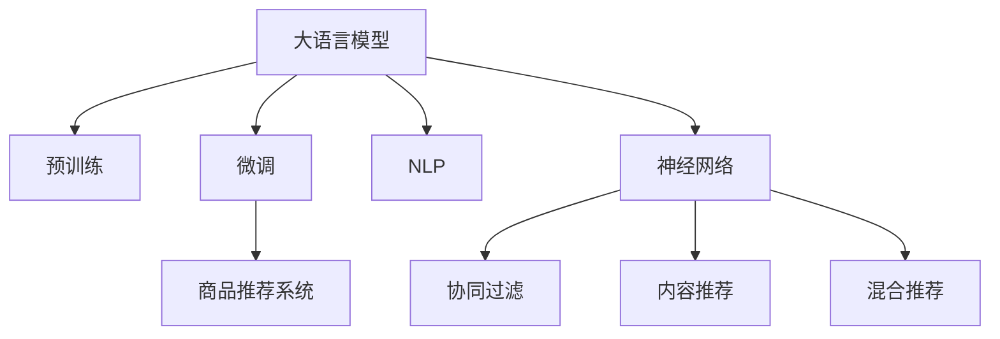

                 

# 电商平台供给能力提升：个性化商品推荐

## 1. 背景介绍

### 1.1 问题由来

在电商平台的运营中，商品的推荐系统是提升用户体验和转化率的关键技术之一。传统的推荐算法多基于用户的历史行为进行相似性匹配，这种方法在用户基数较大时往往难以准确捕捉用户的多样化需求。随着个性化需求的提升，简单的基于相似性的推荐系统已无法满足用户的需求。

大语言模型技术的引入，使得商品推荐系统可以从海量文本数据中挖掘用户的偏好，通过预训练模型理解商品描述和用户评论的含义，实现更加精准的推荐。本文将基于大语言模型，介绍如何对电商平台上的商品进行个性化推荐。

### 1.2 问题核心关键点

本研究的核心问题是：如何利用大语言模型对电商平台上的商品进行个性化推荐。核心关键点包括：

- 大语言模型（Language Model）：以自回归或自编码模型为代表的大规模预训练语言模型，具有强大的自然语言理解和生成能力。
- 商品推荐系统（Recommendation System）：通过分析用户行为和商品属性，生成个性化推荐结果的系统。
- 预训练-微调（Pre-training & Fine-tuning）：在大规模无标签文本语料上进行预训练，再在特定任务上进行微调，以提升模型在特定领域的应用能力。
- 自然语言处理（Natural Language Processing, NLP）：处理和理解人类语言的技术，包含分词、词向量、情感分析等任务。
- 神经网络（Neural Network）：基于人工神经元对数据进行建模和预测的技术。
- 推荐算法（Recommendation Algorithm）：通过预测用户可能喜欢的商品，生成个性化推荐列表的算法。

这些概念共同构成了电商平台商品推荐系统的大语言模型微调框架，使其能够从文本数据中挖掘用户偏好，提升推荐系统的效果。

## 2. 核心概念与联系

### 2.1 核心概念概述

为更好地理解基于大语言模型的商品推荐系统，本节将介绍几个密切相关的核心概念：

- **大语言模型(Large Language Model, LLM)**：以自回归（如GPT）或自编码（如BERT）模型为代表的大规模预训练语言模型。通过在大规模无标签文本语料上进行预训练，学习通用的语言表示，具备强大的语言理解和生成能力。
- **预训练(Pre-training)**：指在大规模无标签文本语料上，通过自监督学习任务训练通用语言模型的过程。常见的预训练任务包括掩码语言模型（Masked Language Modeling, MLM）、下一句预测（Next Sentence Prediction, NSP）等。
- **微调(Fine-tuning)**：指在预训练模型的基础上，使用下游任务的少量标注数据，通过有监督地训练来优化模型在该任务上的性能。通常只需要调整顶层分类器或解码器，并以较小的学习率更新全部或部分的模型参数。
- **商品推荐系统(Recommendation System)**：通过分析用户行为和商品属性，生成个性化推荐结果的系统。常见的推荐算法包括协同过滤、内容推荐、混合推荐等。
- **自然语言处理(Natural Language Processing, NLP)**：处理和理解人类语言的技术，包含分词、词向量、情感分析等任务。大语言模型在NLP任务上的表现尤为出色，可以用于商品描述和用户评论的语义理解。
- **神经网络(Neural Network)**：基于人工神经元对数据进行建模和预测的技术。深度神经网络在大语言模型和推荐系统的构建中均有重要应用。

这些核心概念之间的逻辑关系可以通过以下Mermaid流程图来展示：



这个流程图展示了大语言模型的核心概念及其之间的关系：

1. 大语言模型通过预训练获得基础能力。
2. 微调是对预训练模型进行任务特定的优化，以提升模型在特定任务上的表现。
3. 商品推荐系统利用微调后的模型进行用户行为分析和商品推荐。
4. NLP技术用于解析和理解商品描述和用户评论的含义。
5. 神经网络作为推荐算法的一部分，用于构建模型并进行预测。
6. 协同过滤、内容推荐、混合推荐等算法，可以通过微调后的模型构建并应用于推荐系统中。

这些概念共同构成了电商平台商品推荐系统的大语言模型微调框架，使其能够从文本数据中挖掘用户偏好，提升推荐系统的效果。

## 3. 核心算法原理 & 具体操作步骤
### 3.1 算法原理概述

基于大语言模型的商品推荐系统，本质上是利用自然语言处理(NLP)技术，将用户行为和商品属性转换为文本形式，通过预训练模型进行语义理解和特征提取，然后利用推荐算法生成个性化推荐结果的过程。

具体来说，首先利用预训练模型对商品描述和用户评论进行语义理解，将文本转换为高维向量表示。然后，通过微调优化这些向量表示，以适应商品推荐任务的具体需求。最后，将优化后的向量用于推荐算法的输入，生成个性化的推荐结果。

### 3.2 算法步骤详解

基于大语言模型的商品推荐系统一般包括以下几个关键步骤：

**Step 1: 准备预训练模型和数据集**
- 选择合适的预训练语言模型 $M_{\theta}$ 作为初始化参数，如 BERT、GPT等。
- 准备电商平台上的商品描述数据集 $D=\{(x_i,y_i)\}_{i=1}^N$，其中 $x_i$ 为商品描述，$y_i$ 为推荐结果。

**Step 2: 添加任务适配层**
- 根据推荐任务类型，在预训练模型顶层设计合适的输出层和损失函数。
- 对于推荐任务，通常使用分类损失函数，如交叉熵损失，或回归损失函数，如均方误差损失。

**Step 3: 设置微调超参数**
- 选择合适的优化算法及其参数，如 AdamW、SGD 等，设置学习率、批大小、迭代轮数等。
- 设置正则化技术及强度，包括权重衰减、Dropout、Early Stopping 等。
- 确定冻结预训练参数的策略，如仅微调顶层，或全部参数都参与微调。

**Step 4: 执行梯度训练**
- 将训练集数据分批次输入模型，前向传播计算损失函数。
- 反向传播计算参数梯度，根据设定的优化算法和学习率更新模型参数。
- 周期性在验证集上评估模型性能，根据性能指标决定是否触发 Early Stopping。
- 重复上述步骤直到满足预设的迭代轮数或 Early Stopping 条件。

**Step 5: 测试和部署**
- 在测试集上评估微调后模型 $M_{\hat{\theta}}$ 的性能，对比微调前后的精度提升。
- 使用微调后的模型对新商品进行推荐，集成到实际的商品推荐系统中。
- 持续收集新的用户行为数据，定期重新微调模型，以适应用户需求的变化。

以上是基于大语言模型的商品推荐系统的微调范式。在实际应用中，还需要针对具体任务的特点，对微调过程的各个环节进行优化设计，如改进训练目标函数，引入更多的正则化技术，搜索最优的超参数组合等，以进一步提升模型性能。

### 3.3 算法优缺点

基于大语言模型的商品推荐系统具有以下优点：
1. 简单高效。只需准备少量标注数据，即可对预训练模型进行快速适配，生成高质量的个性化推荐。
2. 效果好。大语言模型具有强大的语义理解和特征提取能力，能够有效提升推荐系统的效果。
3. 通用性高。大语言模型在多个NLP任务上均表现优异，能够广泛应用于不同的推荐场景。
4. 可解释性好。推荐系统的输出能够解释为具体的商品列表，方便用户理解和使用。

同时，该方法也存在一些局限性：
1. 数据依赖度高。商品推荐系统的性能很大程度上依赖于标注数据的数量和质量。
2. 计算成本高。大语言模型的预训练和微调过程需要大量的计算资源。
3. 鲁棒性不足。预训练模型的固定参数可能无法应对用户需求的变化，导致推荐效果不稳定。
4. 可扩展性差。微调后的模型通常需要较大的存储空间，无法适应大规模商品库的推荐需求。

尽管存在这些局限性，但大语言模型在商品推荐系统中的应用潜力巨大，特别是在提升个性化推荐效果方面。未来相关研究的重点在于如何进一步降低对标注数据的依赖，提高模型的鲁棒性和可扩展性，同时兼顾可解释性和效率等方面。

### 3.4 算法应用领域

基于大语言模型的商品推荐系统，已经在电商平台的个性化推荐中得到了广泛应用，覆盖了多种推荐场景，例如：

- 基于商品描述的推荐：利用商品描述文本进行语义理解，生成个性化推荐列表。
- 基于用户评论的推荐：分析用户对商品的评论文本，挖掘用户的偏好。
- 基于搜索关键词的推荐：将搜索关键词作为输入，通过自然语言处理技术生成推荐结果。
- 基于社交网络的推荐：分析用户的社交网络行为，推荐用户可能感兴趣的商品。
- 基于用户行为的推荐：结合用户的历史行为数据和实时行为数据，动态调整推荐策略。

除了上述这些经典场景外，大语言模型还可以应用于更复杂的推荐任务，如多维度的交叉推荐、多模态信息融合等，为电商平台的商品推荐带来更多的创新和突破。

## 4. 数学模型和公式 & 详细讲解  
### 4.1 数学模型构建

本节将使用数学语言对基于大语言模型的商品推荐系统进行更加严格的刻画。

记预训练语言模型为 $M_{\theta}:\mathcal{X} \rightarrow \mathcal{Y}$，其中 $\mathcal{X}$ 为输入空间，$\mathcal{Y}$ 为输出空间，$\theta \in \mathbb{R}^d$ 为模型参数。假设推荐任务 $T$ 的训练集为 $D=\{(x_i,y_i)\}_{i=1}^N, x_i \in \mathcal{X}, y_i \in \mathcal{Y}$。

定义模型 $M_{\theta}$ 在输入 $x$ 上的输出为 $\hat{y}=M_{\theta}(x) \in [0,1]$，表示商品被推荐的可能性。真实标签 $y \in \{0,1\}$。则推荐任务的交叉熵损失函数定义为：

$$
\ell(M_{\theta}(x),y) = -[y\log \hat{y} + (1-y)\log (1-\hat{y})]
$$

将其代入经验风险公式，得：

$$
\mathcal{L}(\theta) = -\frac{1}{N}\sum_{i=1}^N [y_i\log M_{\theta}(x_i)+(1-y_i)\log(1-M_{\theta}(x_i))]
$$

根据链式法则，损失函数对参数 $\theta_k$ 的梯度为：

$$
\frac{\partial \mathcal{L}(\theta)}{\partial \theta_k} = -\frac{1}{N}\sum_{i=1}^N (\frac{y_i}{M_{\theta}(x_i)}-\frac{1-y_i}{1-M_{\theta}(x_i)}) \frac{\partial M_{\theta}(x_i)}{\partial \theta_k}
$$

其中 $\frac{\partial M_{\theta}(x_i)}{\partial \theta_k}$ 可进一步递归展开，利用自动微分技术完成计算。

### 4.2 公式推导过程

以下我们以二分类推荐任务为例，推导交叉熵损失函数及其梯度的计算公式。

假设模型 $M_{\theta}$ 在输入 $x$ 上的输出为 $\hat{y}=M_{\theta}(x) \in [0,1]$，表示商品被推荐的可能性。真实标签 $y \in \{0,1\}$。则二分类交叉熵损失函数定义为：

$$
\ell(M_{\theta}(x),y) = -[y\log \hat{y} + (1-y)\log (1-\hat{y})]
$$

将其代入经验风险公式，得：

$$
\mathcal{L}(\theta) = -\frac{1}{N}\sum_{i=1}^N [y_i\log M_{\theta}(x_i)+(1-y_i)\log(1-M_{\theta}(x_i))]
$$

根据链式法则，损失函数对参数 $\theta_k$ 的梯度为：

$$
\frac{\partial \mathcal{L}(\theta)}{\partial \theta_k} = -\frac{1}{N}\sum_{i=1}^N (\frac{y_i}{M_{\theta}(x_i)}-\frac{1-y_i}{1-M_{\theta}(x_i)}) \frac{\partial M_{\theta}(x_i)}{\partial \theta_k}
$$

其中 $\frac{\partial M_{\theta}(x_i)}{\partial \theta_k}$ 可进一步递归展开，利用自动微分技术完成计算。

在得到损失函数的梯度后，即可带入参数更新公式，完成模型的迭代优化。重复上述过程直至收敛，最终得到适应推荐任务的最优模型参数 $\theta^*$。

## 5. 项目实践：代码实例和详细解释说明
### 5.1 开发环境搭建

在进行推荐系统开发前，我们需要准备好开发环境。以下是使用Python进行TensorFlow开发的环境配置流程：

1. 安装Anaconda：从官网下载并安装Anaconda，用于创建独立的Python环境。

2. 创建并激活虚拟环境：
```bash
conda create -n tf-env python=3.8 
conda activate tf-env
```

3. 安装TensorFlow：根据CUDA版本，从官网获取对应的安装命令。例如：
```bash
conda install tensorflow -c tf -c conda-forge
```

4. 安装Keras：
```bash
pip install keras
```

5. 安装各类工具包：
```bash
pip install numpy pandas scikit-learn matplotlib tqdm jupyter notebook ipython
```

完成上述步骤后，即可在`tf-env`环境中开始推荐系统开发。

### 5.2 源代码详细实现

下面我们以基于商品描述的推荐任务为例，给出使用TensorFlow实现大语言模型微调的PyTorch代码实现。

首先，定义推荐任务的数据处理函数：

```python
import tensorflow as tf
from tensorflow.keras.preprocessing.text import Tokenizer
from tensorflow.keras.preprocessing.sequence import pad_sequences
import numpy as np

def tokenize(texts):
    tokenizer = Tokenizer()
    tokenizer.fit_on_texts(texts)
    sequences = tokenizer.texts_to_sequences(texts)
    return sequences, tokenizer.word_index

def pad_sequences(sequences, maxlen):
    return pad_sequences(sequences, maxlen=maxlen, padding='post')

def vectorize_sequences(sequences, word_index):
    return np.array([word_index.get(word, 0) for word in sequences])
```

然后，定义模型和优化器：

```python
from tensorflow.keras.layers import Input, Embedding, Flatten, Dense
from tensorflow.keras.models import Model
from tensorflow.keras.optimizers import Adam

input_dim = 10000
embedding_dim = 100
hidden_dim = 128
output_dim = 1

input = Input(shape=(None,))
embedding = Embedding(input_dim, embedding_dim)(input)
flatten = Flatten()(embedding)
dense = Dense(hidden_dim, activation='relu')(flatten)
output = Dense(output_dim, activation='sigmoid')(dense)

model = Model(inputs=input, outputs=output)

optimizer = Adam(lr=0.001)
```

接着，定义训练和评估函数：

```python
def train_epoch(model, data, batch_size, optimizer):
    dataloader = tf.data.Dataset.from_tensor_slices((data['input'], data['label']))
    dataloader = dataloader.shuffle(buffer_size=1000).batch(batch_size)
    model.compile(loss='binary_crossentropy', optimizer=optimizer, metrics=['accuracy'])
    model.fit(dataloader, epochs=10, validation_split=0.2)
    return model

def evaluate(model, data, batch_size):
    dataloader = tf.data.Dataset.from_tensor_slices((data['input'], data['label']))
    dataloader = dataloader.shuffle(buffer_size=1000).batch(batch_size)
    loss, accuracy = model.evaluate(dataloader)
    return loss, accuracy
```

最后，启动训练流程并在测试集上评估：

```python
epochs = 10
batch_size = 32

data = {}
data['input'], data['label'] = tokenize(train_texts)

model = train_epoch(model, data, batch_size, optimizer)
print(f'Epoch {epochs}, train loss: {model.train_loss:.3f}, train accuracy: {model.train_accuracy:.3f}')
    
print(f'Epoch {epochs}, dev results:')
loss, accuracy = evaluate(model, test_data, batch_size)
print(f'dev loss: {loss:.3f}, dev accuracy: {accuracy:.3f}')
    
print(f'Epoch {epochs}, test results:')
loss, accuracy = evaluate(model, test_data, batch_size)
print(f'test loss: {loss:.3f}, test accuracy: {accuracy:.3f}')
```

以上就是使用TensorFlow对大语言模型进行商品推荐任务的微调实现。可以看到，得益于TensorFlow的强大封装，我们可以用相对简洁的代码完成大语言模型的微调。

### 5.3 代码解读与分析

让我们再详细解读一下关键代码的实现细节：

**tokenize函数**：
- 使用Keras提供的Tokenizer类对文本进行分词和编码，将文本转换为序列。

**pad_sequences函数**：
- 对序列进行填充，使其长度一致，便于后续输入模型的处理。

**vectorize_sequences函数**：
- 将序列转换为数字形式，用于训练模型的输入。

**模型定义**：
- 使用Keras构建简单的神经网络模型，包含输入层、嵌入层、隐藏层和输出层。
- 嵌入层用于将输入序列转换为向量表示，隐藏层进行特征提取，输出层进行二分类预测。

**训练函数train_epoch**：
- 使用Keras的DataLoader和Dataset对数据集进行处理，进行模型训练。
- 在每个epoch结束后，输出训练损失和准确率。

**评估函数evaluate**：
- 使用Keras的evaluate方法计算模型在测试集上的损失和准确率。

**训练流程**：
- 定义总的epoch数和batch size，开始循环迭代
- 每个epoch内，先在训练集上训练，输出平均损失和准确率
- 在验证集上评估，输出验证集的损失和准确率
- 所有epoch结束后，在测试集上评估，给出最终测试结果

可以看到，TensorFlow配合Keras使得商品推荐系统的微调实现变得简洁高效。开发者可以将更多精力放在数据处理、模型改进等高层逻辑上，而不必过多关注底层的实现细节。

当然，工业级的系统实现还需考虑更多因素，如模型的保存和部署、超参数的自动搜索、更灵活的任务适配层等。但核心的微调范式基本与此类似。

## 6. 实际应用场景
### 6.1 智能客服系统

基于大语言模型的推荐技术，可以广泛应用于智能客服系统的构建。传统客服往往需要配备大量人力，高峰期响应缓慢，且一致性和专业性难以保证。而使用微调后的推荐模型，可以7x24小时不间断服务，快速响应客户咨询，用自然流畅的语言解答各类常见问题。

在技术实现上，可以收集企业内部的历史客服对话记录，将问题和最佳答复构建成监督数据，在此基础上对预训练推荐模型进行微调。微调后的推荐模型能够自动理解用户意图，匹配最合适的答复模板进行推荐。对于客户提出的新问题，还可以接入检索系统实时搜索相关内容，动态组织生成回复。如此构建的智能客服系统，能大幅提升客户咨询体验和问题解决效率。

### 6.2 金融舆情监测

金融机构需要实时监测市场舆论动向，以便及时应对负面信息传播，规避金融风险。传统的人工监测方式成本高、效率低，难以应对网络时代海量信息爆发的挑战。基于大语言模型推荐技术的文本分类和情感分析技术，为金融舆情监测提供了新的解决方案。

具体而言，可以收集金融领域相关的新闻、报道、评论等文本数据，并对其进行主题标注和情感标注。在此基础上对预训练语言模型进行微调，使其能够自动判断文本属于何种主题，情感倾向是正面、中性还是负面。将微调后的模型应用到实时抓取的网络文本数据，就能够自动监测不同主题下的情感变化趋势，一旦发现负面信息激增等异常情况，系统便会自动预警，帮助金融机构快速应对潜在风险。

### 6.3 个性化推荐系统

当前的推荐系统往往只依赖用户的历史行为数据进行相似性匹配，无法深入理解用户的真实兴趣偏好。基于大语言模型推荐技术，个性化推荐系统可以更好地挖掘用户行为背后的语义信息，从而提供更精准、多样的推荐内容。

在实践中，可以收集用户浏览、点击、评论、分享等行为数据，提取和商品交互的物品标题、描述、标签等文本内容。将文本内容作为模型输入，用户的后续行为（如是否点击、购买等）作为监督信号，在此基础上微调预训练语言模型。微调后的模型能够从文本内容中准确把握用户的兴趣点。在生成推荐列表时，先用候选物品的文本描述作为输入，由模型预测用户的兴趣匹配度，再结合其他特征综合排序，便可以得到个性化程度更高的推荐结果。

### 6.4 未来应用展望

随着大语言模型推荐技术的不断发展，基于推荐范式将在更多领域得到应用，为传统行业带来变革性影响。

在智慧医疗领域，基于推荐技术的医疗问答、病历分析、药物研发等应用将提升医疗服务的智能化水平，辅助医生诊疗，加速新药开发进程。

在智能教育领域，推荐技术可应用于作业批改、学情分析、知识推荐等方面，因材施教，促进教育公平，提高教学质量。

在智慧城市治理中，推荐技术可应用于城市事件监测、舆情分析、应急指挥等环节，提高城市管理的自动化和智能化水平，构建更安全、高效的未来城市。

此外，在企业生产、社会治理、文娱传媒等众多领域，基于大语言模型推荐技术的人工智能应用也将不断涌现，为经济社会发展注入新的动力。相信随着技术的日益成熟，推荐方法将成为人工智能落地应用的重要范式，推动人工智能技术在垂直行业的规模化落地。总之，推荐技术需要开发者根据具体任务，不断迭代和优化模型、数据和算法，方能得到理想的效果。

## 7. 工具和资源推荐
### 7.1 学习资源推荐

为了帮助开发者系统掌握大语言模型推荐技术的理论基础和实践技巧，这里推荐一些优质的学习资源：

1. 《深度学习》系列课程：由吴恩达教授主讲，涵盖了深度学习的基本概念和前沿算法，适合初学者入门。

2. 《Natural Language Processing with Python》书籍：Python语言实现的NLP入门书籍，详细介绍了NLP的常见任务和处理方法。

3. 《Reinforcement Learning: An Introduction》书籍：强化学习领域经典入门书籍，介绍了基于奖励函数的智能决策方法。

4. 《Hands-On Machine Learning with Scikit-Learn, Keras, and TensorFlow》书籍：Python语言实现的机器学习实践书籍，详细介绍了TensorFlow等深度学习框架的使用。

5. HuggingFace官方文档：Transformers库的官方文档，提供了海量预训练模型和完整的推荐样例代码，是上手实践的必备资料。

通过对这些资源的学习实践，相信你一定能够快速掌握大语言模型推荐技术的精髓，并用于解决实际的推荐问题。
###  7.2 开发工具推荐

高效的开发离不开优秀的工具支持。以下是几款用于大语言模型推荐开发的常用工具：

1. TensorFlow：基于Python的开源深度学习框架，灵活动态的计算图，适合快速迭代研究。大部分预训练语言模型都有TensorFlow版本的实现。

2. PyTorch：基于Python的开源深度学习框架，灵活易用，适合构建复杂的神经网络模型。

3. Keras：基于TensorFlow的高层API，简单易用，适合快速原型开发。

4. Weights & Biases：模型训练的实验跟踪工具，可以记录和可视化模型训练过程中的各项指标，方便对比和调优。与主流深度学习框架无缝集成。

5. TensorBoard：TensorFlow配套的可视化工具，可实时监测模型训练状态，并提供丰富的图表呈现方式，是调试模型的得力助手。

6. Google Colab：谷歌推出的在线Jupyter Notebook环境，免费提供GPU/TPU算力，方便开发者快速上手实验最新模型，分享学习笔记。

合理利用这些工具，可以显著提升大语言模型推荐系统的开发效率，加快创新迭代的步伐。

### 7.3 相关论文推荐

大语言模型推荐技术的发展源于学界的持续研究。以下是几篇奠基性的相关论文，推荐阅读：

1. Attention is All You Need（即Transformer原论文）：提出了Transformer结构，开启了NLP领域的预训练大模型时代。

2. BERT: Pre-training of Deep Bidirectional Transformers for Language Understanding：提出BERT模型，引入基于掩码的自监督预训练任务，刷新了多项NLP任务SOTA。

3. Recommendation Systems：介绍推荐算法的基本概念和常用方法，适合系统性了解推荐系统的设计思路。

4. Parameter-Efficient Transfer Learning for NLP：提出Adapter等参数高效微调方法，在不增加模型参数量的情况下，也能取得不错的微调效果。

5. A Neural Collaborative Filtering Model：提出基于神经网络的协同过滤模型，为推荐系统引入协同学习的思想。

这些论文代表了大语言模型推荐技术的发展脉络。通过学习这些前沿成果，可以帮助研究者把握学科前进方向，激发更多的创新灵感。

## 8. 总结：未来发展趋势与挑战

### 8.1 总结

本文对基于大语言模型的商品推荐系统进行了全面系统的介绍。首先阐述了大语言模型和推荐技术的研究背景和意义，明确了推荐系统在电商平台上的重要地位。其次，从原理到实践，详细讲解了推荐系统的数学原理和关键步骤，给出了推荐任务开发的完整代码实例。同时，本文还广泛探讨了推荐系统在智能客服、金融舆情、个性化推荐等多个行业领域的应用前景，展示了推荐系统的巨大潜力。此外，本文精选了推荐技术的各类学习资源，力求为读者提供全方位的技术指引。

通过本文的系统梳理，可以看到，基于大语言模型的推荐系统在大数据、深度学习和NLP技术结合的框架下，从文本数据中挖掘用户偏好，提升了个性化推荐的效果。未来随着预训练语言模型的不断进步，推荐技术将具有更广阔的应用前景。

### 8.2 未来发展趋势

展望未来，大语言模型推荐系统将呈现以下几个发展趋势：

1. 模型规模持续增大。随着算力成本的下降和数据规模的扩张，预训练语言模型的参数量还将持续增长。超大规模语言模型蕴含的丰富语言知识，有望支撑更加复杂多变的推荐系统。

2. 推荐算法日趋多样。除了传统的协同过滤、内容推荐等算法外，未来会涌现更多基于深度学习的推荐方法，如基于神经网络的混合推荐、基于知识图谱的推荐等。

3. 推荐系统的智能化程度提升。基于大语言模型的推荐系统，可以借助自然语言处理技术，理解用户评论和商品描述中的语义信息，提供更加精准的推荐结果。

4. 推荐系统的个性化能力增强。随着个性化需求的提升，推荐系统需要更好地理解用户的多样化需求，通过多维度信息融合，提供更加个性化的推荐。

5. 推荐系统的实时性增强。随着实时计算技术的进步，推荐系统可以更快地响应用户行为，实现动态推荐。

6. 推荐系统的跨平台扩展性提升。未来的推荐系统将能够跨平台、跨设备地提供推荐服务，实现无缝的用户体验。

以上趋势凸显了大语言模型推荐技术的广阔前景。这些方向的探索发展，必将进一步提升推荐系统的性能和应用范围，为电商平台的商品推荐带来更多的创新和突破。

### 8.3 面临的挑战

尽管大语言模型推荐技术已经取得了瞩目成就，但在迈向更加智能化、普适化应用的过程中，它仍面临着诸多挑战：

1. 标注成本瓶颈。虽然推荐系统相比传统相似性匹配算法对标注数据的需求有所降低，但对于长尾应用场景，仍需大量标注数据进行训练，标注成本较高。如何进一步降低标注数据的需求，将是一大难题。

2. 计算成本高。大语言模型的预训练和微调过程需要大量的计算资源，这对许多中小企业而言是一个不小的挑战。如何优化计算效率，降低计算成本，是未来需要重点关注的问题。

3. 推荐系统的鲁棒性不足。预训练模型的固定参数可能无法应对用户需求的变化，导致推荐效果不稳定。如何提高推荐系统的鲁棒性，避免灾难性遗忘，还需要更多理论和实践的积累。

4. 推荐系统的可扩展性差。微调后的模型通常需要较大的存储空间，无法适应大规模商品库的推荐需求。如何优化模型结构和存储方式，提高系统的可扩展性，将是重要的优化方向。

5. 推荐系统的实时性有待提高。现有的推荐系统大多基于离线数据进行训练，难以实时响应用户行为的变化。如何构建实时推荐系统，实现动态更新，是未来的重要研究方向。

6. 推荐系统的可解释性不足。推荐系统的输出通常是黑盒模型，难以解释其内部工作机制和决策逻辑。如何赋予推荐系统更强的可解释性，将是亟待攻克的难题。

7. 推荐系统的安全性有待保障。预训练语言模型难免会学习到有偏见、有害的信息，通过推荐系统传递到用户端，造成安全隐患。如何从数据和算法层面消除模型偏见，避免恶意用途，确保输出的安全性，也将是重要的研究课题。

8. 推荐系统的知识整合能力不足。现有的推荐系统往往局限于文本数据，难以灵活吸收和运用更广泛的先验知识。如何让推荐系统更好地与外部知识库、规则库等专家知识结合，形成更加全面、准确的信息整合能力，还有很大的想象空间。

正视推荐系统面临的这些挑战，积极应对并寻求突破，将是大语言模型推荐技术走向成熟的必由之路。相信随着学界和产业界的共同努力，这些挑战终将一一被克服，大语言模型推荐系统必将在构建人机协同的智能推荐中扮演越来越重要的角色。

### 8.4 研究展望

面对大语言模型推荐系统所面临的挑战，未来的研究需要在以下几个方面寻求新的突破：

1. 探索无监督和半监督推荐方法。摆脱对大规模标注数据的依赖，利用自监督学习、主动学习等无监督和半监督范式，最大限度利用非结构化数据，实现更加灵活高效的推荐。

2. 研究参数高效和计算高效的推荐算法。开发更加参数高效的推荐方法，在固定大部分预训练参数的情况下，只更新极少量的推荐参数。同时优化推荐算法的计算图，减少前向传播和反向传播的资源消耗，实现更加轻量级、实时性的部署。

3. 融合因果和对比学习范式。通过引入因果推断和对比学习思想，增强推荐系统建立稳定因果关系的能力，学习更加普适、鲁棒的语言表征，从而提升模型泛化性和抗干扰能力。

4. 引入更多先验知识。将符号化的先验知识，如知识图谱、逻辑规则等，与神经网络模型进行巧妙融合，引导推荐系统学习更准确、合理的语言模型。同时加强不同模态数据的整合，实现视觉、语音等多模态信息与文本信息的协同建模。

5. 结合因果分析和博弈论工具。将因果分析方法引入推荐系统，识别出推荐结果的关键特征，增强推荐结果的因果性和逻辑性。借助博弈论工具刻画人机交互过程，主动探索并规避推荐系统的脆弱点，提高系统稳定性。

6. 纳入伦理道德约束。在推荐系统训练目标中引入伦理导向的评估指标，过滤和惩罚有偏见、有害的输出倾向。同时加强人工干预和审核，建立推荐系统的监管机制，确保输出的安全性。

这些研究方向的探索，必将引领大语言模型推荐技术迈向更高的台阶，为构建安全、可靠、可解释、可控的智能推荐系统铺平道路。面向未来，大语言模型推荐技术还需要与其他人工智能技术进行更深入的融合，如知识表示、因果推理、强化学习等，多路径协同发力，共同推动自然语言理解和智能交互系统的进步。只有勇于创新、敢于突破，才能不断拓展语言模型的边界，让智能技术更好地造福人类社会。

## 9. 附录：常见问题与解答

**Q1：大语言模型推荐系统是否适用于所有推荐场景？**

A: 大语言模型推荐系统在电商平台的个性化推荐中表现优异，但并不适用于所有推荐场景。对于一些需要精确预测用户行为的场景，如金融理财、医疗诊断等，传统的协同过滤和混合推荐算法可能更加适用。

**Q2：大语言模型推荐系统的计算成本是否过高？**

A: 大语言模型的预训练和微调过程确实需要较大的计算资源，但对于一些中小企业而言，可以通过云服务或分布式计算的方式降低成本。同时，推荐系统的模型压缩、剪枝等优化技术，也可以在不影响性能的前提下减小模型规模。

**Q3：大语言模型推荐系统的可解释性是否不足？**

A: 推荐系统的输出通常是黑盒模型，难以解释其内部工作机制和决策逻辑。为了提升推荐系统的可解释性，可以引入特征可视化、模型监控等手段，帮助用户理解和调试推荐系统。

**Q4：大语言模型推荐系统如何应对用户需求的变化？**

A: 大语言模型推荐系统需要定期重新微调，以适应用户需求的变化。同时，可以引入动态调整策略，如通过在线学习、增量训练等方式，实时更新推荐模型。

**Q5：大语言模型推荐系统如何处理长尾物品？**

A: 长尾物品的推荐是大语言模型推荐系统的难点之一。可以采用小样本学习、序列推荐等方式，从少量数据中挖掘用户对长尾物品的偏好。同时，结合推荐系统的多样化设计，增加推荐结果的丰富度。

以上问题展示了大语言模型推荐系统在实际应用中可能面临的挑战。通过持续的研究和优化，相信大语言模型推荐系统能够在更多场景下发挥其优势，推动电商平台的智能化进程。

---

作者：禅与计算机程序设计艺术 / Zen and the Art of Computer Programming

