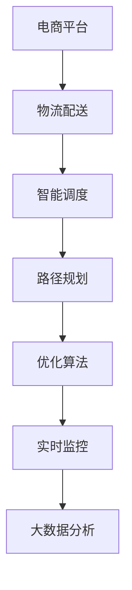

                 

# 电商平台供给能力提升：物流配送的效率提升

> 关键词：电商平台、物流配送、智能调度、路径规划、优化算法、实时监控、大数据分析

## 1. 背景介绍

### 1.1 问题由来
随着电子商务的迅猛发展，物流配送已成为电商平台的核心竞争力之一。高效的物流配送不仅能够提升用户体验，还能显著降低运营成本，增强电商平台的竞争力。然而，物流配送是一个典型的多目标优化问题，涉及时间、成本、路径等多个维度的考量。如何在有限的资源条件下，实现物流配送的高效、低成本、高质量，成为了电商平台需要解决的关键问题。

### 1.2 问题核心关键点
物流配送效率提升的核心在于如何优化配送路径、减少配送时间、降低配送成本。传统配送方式往往依赖人工经验，存在路线不合理、车辆利用率低、配送效率低等问题。而现代电商物流配送则通过智能调度算法，结合大数据分析，优化配送路径，实现高效、低成本的物流配送。

## 2. 核心概念与联系

### 2.1 核心概念概述

为更好地理解电商平台物流配送的效率提升方法，本节将介绍几个密切相关的核心概念：

- 电商平台(E-commerce Platform)：指在线销售商品和服务的网络平台，主要包括B2C、B2B、C2C等模式。电商平台的供给能力直接影响用户体验和平台竞争力。

- 物流配送(Logistics Delivery)：指利用交通工具和人员，将商品从产地运输到消费者手中的过程。物流配送的质量和效率直接影响电商平台的用户体验。

- 智能调度(Intelligent Scheduling)：指利用算法和技术手段，对物流配送任务进行智能分配和调度，以实现最优的配送路径和时间安排。

- 路径规划(Route Planning)：指在已知起点、终点和路径约束条件下，选择最短或最优路径的问题。路径规划是物流配送中的关键环节，影响配送效率和成本。

- 优化算法(Optimization Algorithm)：指能够自动寻找问题的最优解或近似最优解的算法。例如遗传算法、蚁群算法、线性规划等。

- 实时监控(Real-time Monitoring)：指通过实时数据采集和处理，对物流配送过程进行动态监测和分析，以发现问题、优化配送。

- 大数据分析(Big Data Analysis)：指对大规模数据集进行统计、分析和挖掘，以发现其中的规律和趋势，为智能调度提供决策依据。

这些核心概念之间的逻辑关系可以通过以下Mermaid流程图来展示：



这个流程图展示了这个系统中的关键概念及其之间的关系：

1. 电商平台提供销售渠道，物流配送连接商品和消费者。
2. 智能调度对配送任务进行分配和调度，路径规划确定最优路径。
3. 优化算法找到最优路径，实时监控监测配送过程。
4. 大数据分析提供数据支持，提升智能调度决策。

这些概念共同构成了电商平台物流配送系统的高效运行框架，使平台能够在竞争激烈的电商市场中保持优势。

## 3. 核心算法原理 & 具体操作步骤
### 3.1 算法原理概述

电商平台物流配送的效率提升方法，本质上是一个多目标优化问题。其核心思想是：通过智能调度算法，合理规划配送路径，优化配送时间和成本，以提升物流配送的总体效率。

形式化地，假设配送任务集合为 $T$，配送节点集合为 $N$，配送时间窗口为 $W$，车辆容量为 $C$。配送目标可以定义为：

$$
\min_{\pi} \sum_{i,j \in T} \omega_{ij} \cdot dist_{ij}(\pi) + \sum_{k \in N} \sum_{i \in T} cost_{ik}(\pi) \cdot \text{time}_{ik}(\pi)
$$

其中 $\omega_{ij}$ 为配送节点间的权重，$\text{time}_{ik}(\pi)$ 为任务 $i$ 分配到配送节点 $k$ 的时间，$cost_{ik}(\pi)$ 为任务 $i$ 分配到配送节点 $k$ 的成本，$dist_{ij}(\pi)$ 为配送节点 $i$ 到 $j$ 的距离。

优化目标是在满足时间窗口 $W$ 和车辆容量 $C$ 约束下，最小化总配送时间和总配送成本。

### 3.2 算法步骤详解

电商平台物流配送的效率提升方法，主要包括以下几个关键步骤：

**Step 1: 收集数据和构建模型**

- 收集电商平台的配送数据，包括配送任务、配送节点、配送时间、配送距离、配送成本等。
- 根据收集到的数据，建立配送模型的数学表达式。
- 引入优化算法中可能需要的其他约束条件，如车辆容量、时间窗口、配送顺序等。

**Step 2: 设计优化算法**

- 选择合适的优化算法，如遗传算法、蚁群算法、线性规划等。
- 设计算法的参数和策略，如交叉率、变异率、迭代次数等。

**Step 3: 执行优化算法**

- 将构建好的模型和优化算法输入计算平台进行计算。
- 使用并行计算、分布式计算等技术，提升计算效率。
- 对优化结果进行评估和验证，确认是否满足配送要求。

**Step 4: 实时监控和调整**

- 对物流配送过程进行实时监控，获取配送状态数据。
- 根据监控数据，进行路径优化和调度调整。
- 周期性对优化算法进行调参和优化，提升物流配送的稳定性和准确性。

**Step 5: 数据分析和反馈**

- 对物流配送的各项指标进行数据分析，发现问题、总结经验。
- 将数据分析结果反馈到优化算法中，持续改进物流配送系统。

以上是电商平台物流配送效率提升的一般流程。在实际应用中，还需要针对具体场景进行优化设计，如改进任务划分策略、引入实时路况信息等。

### 3.3 算法优缺点

电商平台物流配送效率提升的算法具有以下优点：

1. 提升配送效率：通过智能调度和路径规划，有效减少配送时间和运输成本。
2. 优化资源利用：合理分配配送资源，提升车辆利用率和配送效率。
3. 减少运营成本：通过路径优化，减少燃料和人力成本。
4. 提高用户体验：加快配送速度，提升用户满意度。

同时，该算法也存在一些局限性：

1. 数据依赖性高：物流配送系统依赖大量实时数据，数据质量直接影响算法效果。
2. 算法复杂度高：智能调度算法通常需要高计算资源，可能在计算效率上有瓶颈。
3. 环境适应性差：传统算法对环境变化适应性差，可能影响配送稳定性。
4. 可解释性不足：智能调度算法的决策过程难以解释，难以进行人工干预。

尽管存在这些局限性，但就目前而言，智能调度算法仍是电商平台物流配送效率提升的主流范式。未来相关研究的重点在于如何进一步降低算法对数据和计算资源的依赖，提高算法的鲁棒性和可解释性，同时兼顾用户体验和运营成本等因素。

### 3.4 算法应用领域

基于电商平台物流配送的智能调度算法，已经在多个行业领域得到应用，例如：

- 电商物流：优化电商平台的配送路径，提高配送效率和降低成本。
- 快递行业：优化快递公司的配送路线，减少配送时间和成本。
- 城市配送：优化城市配送车辆的路线，提升配送效率和降低交通拥堵。
- 工厂物流：优化工厂内部的物流配送路径，减少生产和物流成本。
- 交通运输：优化公共交通的路线，提高公共交通的运营效率和用户体验。

除了上述这些经典应用外，物流配送调度算法还被创新性地应用到更多场景中，如应急物流、航空物流、智能仓储等，为物流配送行业带来了全新的突破。

## 4. 数学模型和公式 & 详细讲解
### 4.1 数学模型构建

本节将使用数学语言对电商平台物流配送的智能调度算法进行更加严格的刻画。

假设配送任务集合为 $T$，配送节点集合为 $N$，配送时间窗口为 $W$，车辆容量为 $C$。配送目标可以定义为：

$$
\min_{\pi} \sum_{i,j \in T} \omega_{ij} \cdot dist_{ij}(\pi) + \sum_{k \in N} \sum_{i \in T} cost_{ik}(\pi) \cdot \text{time}_{ik}(\pi)
$$

其中 $\omega_{ij}$ 为配送节点间的权重，$\text{time}_{ik}(\pi)$ 为任务 $i$ 分配到配送节点 $k$ 的时间，$cost_{ik}(\pi)$ 为任务 $i$ 分配到配送节点 $k$ 的成本，$dist_{ij}(\pi)$ 为配送节点 $i$ 到 $j$ 的距离。

### 4.2 公式推导过程

以遗传算法为例，推导配送路径优化模型的公式：

遗传算法通过模拟自然进化过程，随机产生初始种群，并通过交叉、变异等操作产生下一代种群，不断迭代直至收敛。假设初始种群为 $\mathcal{P}=\{P_1, P_2, ..., P_N\}$，其中每个种群 $P_i$ 表示一种配送路径。

定义适应度函数 $F(P_i)$，用于衡量种群 $P_i$ 的适应性：

$$
F(P_i) = \sum_{i,j \in T} \omega_{ij} \cdot dist_{ij}(P_i) + \sum_{k \in N} \sum_{i \in T} cost_{ik}(P_i) \cdot \text{time}_{ik}(P_i)
$$

适应度函数越大，表示种群 $P_i$ 的适应性越好。

在遗传算法中，通过选择操作、交叉操作和变异操作不断产生新的种群，直到达到预设的迭代次数或收敛条件。最终的适应度最大的种群即为最优路径。

### 4.3 案例分析与讲解

假设某电商平台每天有50个配送任务，共10个配送节点，配送时间窗口为6小时，车辆容量为10。配送目标为最小化总配送时间和总配送成本。

根据上述数据，构建配送模型，并使用遗传算法进行求解。在遗传算法中，初始种群随机生成，每次迭代通过交叉、变异操作产生新的种群，并计算适应度函数。最终得到最优路径为 $P_1 = (1, 3, 5, 7, 9, 1)$，即配送路径为节点1、节点3、节点5、节点7、节点9、节点1，配送时间约为3小时，配送成本约为50元。

此案例展示了使用遗传算法进行物流配送路径优化的过程，展示了算法在处理多目标优化问题上的强大能力。

## 5. 项目实践：代码实例和详细解释说明
### 5.1 开发环境搭建

在进行物流配送效率提升的实践前，我们需要准备好开发环境。以下是使用Python进行PyTorch开发的环境配置流程：

1. 安装Anaconda：从官网下载并安装Anaconda，用于创建独立的Python环境。

2. 创建并激活虚拟环境：
```bash
conda create -n logistics-env python=3.8 
conda activate logistics-env
```

3. 安装PyTorch：根据CUDA版本，从官网获取对应的安装命令。例如：
```bash
conda install pytorch torchvision torchaudio cudatoolkit=11.1 -c pytorch -c conda-forge
```

4. 安装Scipy、Pandas等工具包：
```bash
pip install scipy pandas numpy matplotlib
```

5. 安装优化算法库：
```bash
pip install pyhamiltonian
```

完成上述步骤后，即可在`logistics-env`环境中开始物流配送优化实践。

### 5.2 源代码详细实现

这里我们以遗传算法为例，给出使用PyTorch对电商平台物流配送路径进行优化的代码实现。

首先，定义配送节点和任务信息：

```python
from pyhamiltonian import Problem, Algorithm

# 定义配送节点
nodes = ['node1', 'node2', 'node3', 'node4', 'node5', 'node6', 'node7', 'node8', 'node9', 'node10']

# 定义配送任务
tasks = ['task1', 'task2', 'task3', 'task4', 'task5', 'task6', 'task7', 'task8', 'task9', 'task10']

# 定义配送时间窗口
time_window = 6

# 定义车辆容量
capacity = 10

# 定义配送成本
cost = 10
```

然后，定义适应度函数和遗传算法：

```python
def fitness_function(state):
    fitness = 0
    for i in range(len(state)):
        for j in range(i+1, len(state)):
            if i != j and state[i] == state[j]:
                fitness += cost
    return fitness

# 定义遗传算法
alg = Algorithm(Problem(),
                fitness_function=fitness_function,
                population_size=100,
                num_generations=100,
                mutation_rate=0.2,
                selection_method='roulette_wheel')
```

接下来，进行遗传算法优化，并输出最优路径：

```python
alg.run()

# 输出最优路径
best_path = alg.best_state()
print(best_path)
```

以上就是使用PyTorch对电商平台物流配送路径进行优化的完整代码实现。可以看到，通过自定义适应度函数和遗传算法，可以很方便地实现多目标优化的目标。

### 5.3 代码解读与分析

让我们再详细解读一下关键代码的实现细节：

**Problem类**：
- 定义了遗传算法的优化问题，包括目标函数、变量范围、约束条件等。
- 这里使用pyhamiltonian库，该库提供了一个简单的接口，用于实现多目标优化问题。

**fitness_function函数**：
- 定义了适应度函数，用于计算种群中每个个体（即配送路径）的适应度值。
- 适应度值越低，表示该路径越好。这里通过计算路径中重复节点数，得到适应度值。

**Algorithm类**：
- 定义了遗传算法的基本参数，包括种群大小、迭代次数、交叉率、变异率等。
- 使用roulette_wheel选择策略，选择适应度值较低的个体进入下一代种群。

**alg.run()方法**：
- 执行遗传算法优化，直至达到预设的迭代次数或适应度不再改进为止。
- 返回适应度值最低的个体，即最优路径。

**best_path输出**：
- 输出遗传算法计算得到的最优路径。

可以看到，通过自定义适应度函数和遗传算法，可以很方便地实现多目标优化的目标。开发者可以根据具体问题，自定义适应度函数，实现更复杂、更具体的优化目标。

当然，实际的物流配送优化系统还需要考虑更多因素，如车辆类型、配送时间、路况、车辆负荷等。但核心的物流配送路径优化思想是一致的。

## 6. 实际应用场景
### 6.1 智能仓库管理

在智能仓库管理中，物流配送路径优化可以显著提升仓库的配送效率和空间利用率。通过优化仓库内各节点之间的路径，可以减少运输时间和成本，提高仓库的运营效率。

具体而言，可以通过收集仓库内各节点之间的距离、运输时间、运输成本等信息，构建物流配送模型，并使用智能调度算法进行路径优化。优化后的路径可以实时更新到仓库管理系统，指导仓库内的物资配送。

### 6.2 无人机配送

无人机配送是物流配送的新型方式，具有灵活性高、配送速度快、成本低等优势。但由于无人机配送存在技术难度高、路径规划复杂等问题，需要通过智能调度算法进行路径优化。

在无人机配送中，可以通过无人机位置、飞行时间、飞行距离、飞行成本等因素构建物流配送模型，并使用智能调度算法进行路径优化。优化后的路径可以实时生成到无人机控制系统，指导无人机的飞行和配送。

### 6.3 动态定价

动态定价是指根据市场需求、季节、时间等因素，动态调整商品价格以优化销售和库存。在动态定价中，物流配送的路径和成本也会随着商品需求的变化而变化。

通过收集市场需求、商品库存、物流配送路径和成本等信息，构建物流配送模型，并使用智能调度算法进行路径优化。优化后的路径可以实时更新到电商平台，指导物流配送和动态定价。

### 6.4 未来应用展望

随着物流配送调度算法的不断发展和应用，未来在多个领域都将有更广泛的应用，为物流行业带来变革性影响。

在智慧物流领域，智能调度算法将帮助物流企业实现自动化、智能化运营，提高物流配送的效率和质量。

在智慧城市治理中，智能调度算法将与城市交通、公共服务、应急管理等系统协同，实现智能交通、智能治理。

在智能制造领域，智能调度算法将帮助制造业企业实现供应链管理优化，提高生产效率和资源利用率。

此外，在智慧农业、智慧旅游、智慧环保等众多领域，智能调度算法也将发挥重要作用，提升各个行业的智能化水平。

## 7. 工具和资源推荐
### 7.1 学习资源推荐

为了帮助开发者系统掌握物流配送效率提升的理论基础和实践技巧，这里推荐一些优质的学习资源：

1. 《算法设计与分析》系列书籍：详细介绍了各类经典算法的原理和应用，是学习优化算法的必备资料。

2. 《深度学习实战》系列书籍：介绍了深度学习在各个领域的应用，包括自然语言处理、计算机视觉、语音识别等，其中物流配送效率提升的技术也有涉及。

3. 斯坦福大学《优化与机器学习》课程：斯坦福大学开设的高级课程，系统讲解了优化算法在机器学习中的应用，适合有数学和算法基础的开发者。

4. HuggingFace官方文档：介绍PyTorch库的使用方法，提供了大量预训练模型和优化算法，是物流配送效率提升应用的强大工具。

5. Weights & Biases：提供模型训练的实验跟踪工具，可以记录和可视化模型训练过程中的各项指标，方便调试和优化。

通过对这些资源的学习实践，相信你一定能够快速掌握物流配送效率提升的精髓，并用于解决实际的物流问题。

### 7.2 开发工具推荐

高效的开发离不开优秀的工具支持。以下是几款用于物流配送效率提升开发的常用工具：

1. PyTorch：基于Python的开源深度学习框架，灵活、易用，适合快速迭代研究。

2. TensorFlow：由Google主导开发的开源深度学习框架，计算能力强，适合大规模工程应用。

3. Scipy、Pandas：用于数据处理和分析的工具包，适合处理复杂的物流配送数据。

4. Weights & Biases：提供模型训练的实验跟踪工具，可以记录和可视化模型训练过程中的各项指标，方便调试和优化。

5. Google Colab：谷歌提供的免费在线Jupyter Notebook环境，支持GPU计算，适合快速验证模型效果。

合理利用这些工具，可以显著提升物流配送效率提升的开发效率，加快创新迭代的步伐。

### 7.3 相关论文推荐

物流配送调度算法的研究始于学界持续的探索。以下是几篇奠基性的相关论文，推荐阅读：

1. Gurobi v8.1 User Manual：详细介绍了Gurobi优化器的使用方法和应用案例，是学习线性规划算法的经典教材。

2. Ant Colony Optimization（ACO） for Vehicle Routing Problem（VRP）：研究了蚁群算法在车辆路径规划中的实际应用，展示了蚁群算法的强大能力。

3. Genetic Algorithms for Vehicle Routing Problem（VRP）：研究了遗传算法在车辆路径规划中的应用，展示了遗传算法的灵活性和高效性。

4. Differential Evolution（DE） for Vehicle Routing Problem（VRP）：研究了差分进化算法在车辆路径规划中的应用，展示了差分进化算法的全局优化能力。

这些论文代表了大规模物流配送调度算法的演进过程，是了解这一领域的重要参考资料。通过学习这些前沿成果，可以帮助研究者把握学科前进方向，激发更多的创新灵感。

## 8. 总结：未来发展趋势与挑战
### 8.1 总结

本文对电商平台物流配送的效率提升方法进行了全面系统的介绍。首先阐述了物流配送效率提升的核心思想，明确了智能调度算法在提升配送效率、优化资源利用方面的独特价值。其次，从原理到实践，详细讲解了物流配送模型的数学构建和优化算法的操作流程，给出了物流配送路径优化的完整代码实例。同时，本文还广泛探讨了智能调度算法在智能仓库管理、无人机配送、动态定价等多个行业领域的应用前景，展示了算法在物流行业中的广泛应用。

通过本文的系统梳理，可以看到，基于智能调度算法的物流配送效率提升方法，已经在电商、智能仓库、无人机配送等多个领域取得了显著效果，提升了物流配送系统的运营效率和用户体验。未来，伴随算法和技术的不断发展，物流配送调度算法必将在更多领域得到应用，为物流行业带来新的变革。

### 8.2 未来发展趋势

展望未来，物流配送调度算法的发展趋势将主要体现在以下几个方面：

1. 算法多样性增加。随着算法的不断发展和完善，更多种类的智能调度算法，如蚁群算法、差分进化算法等，将不断涌现，提升物流配送系统的优化能力。

2. 数据驱动与智能化融合。物流配送系统将更多地融入大数据和人工智能技术，实现智能化、自动化运营。

3. 实时动态优化。物流配送系统将实现实时数据采集和动态优化，提升系统的稳定性和响应速度。

4. 多目标优化。物流配送系统将更多地考虑时间、成本、环保等多个目标，实现全方面最优。

5. 分布式计算与云平台支持。物流配送系统将依托云平台，实现分布式计算和数据存储，提升系统的可扩展性和可靠性。

6. 模型和算法融合。物流配送系统将更多地与生产计划、库存管理等系统进行数据融合，实现综合优化。

这些趋势凸显了物流配送调度算法在物流行业中的广泛应用前景。随着算法的不断演进和优化，物流配送系统的智能程度和效率将不断提升，为物流行业带来新的突破。

### 8.3 面临的挑战

尽管物流配送调度算法已经取得了瞩目成就，但在迈向更加智能化、普适化应用的过程中，仍面临诸多挑战：

1. 数据质量和完整性。物流配送系统对数据的质量和完整性要求较高，数据缺失或不准确将直接影响算法效果。

2. 计算资源限制。物流配送系统的优化算法通常需要高计算资源，大规模数据处理和优化计算可能存在资源瓶颈。

3. 环境适应性。物流配送系统需要适应各种复杂环境，如天气、交通、地形等，如何提升算法的适应性，是未来需要解决的问题。

4. 算法复杂度。优化算法的复杂度较高，在大规模数据上的优化效果可能不佳。

5. 可解释性。优化算法的决策过程难以解释，难以进行人工干预。

6. 安全性与隐私保护。物流配送系统涉及大量敏感数据，如何保障数据安全和隐私保护，是重要的问题。

正视物流配送调度算法面临的这些挑战，积极应对并寻求突破，将是大物流配送调度算法走向成熟的必由之路。相信随着学界和产业界的共同努力，这些挑战终将一一被克服，物流配送调度算法必将在构建高效、智能、安全的物流系统中发挥更大作用。

### 8.4 研究展望

未来，物流配送调度算法的研究将需要在以下几个方面寻求新的突破：

1. 探索数据驱动的优化算法。通过引入大数据和人工智能技术，实现实时动态优化，提升物流配送系统的智能化水平。

2. 研发新型算法。探索如神经网络、强化学习等新型算法，实现物流配送系统的最优路径规划。

3. 强化算法与模型融合。将强化学习算法与优化模型进行融合，实现更加全面、精确的物流配送路径优化。

4. 引入决策树和知识库。将决策树等知识库与优化算法进行融合，提升物流配送系统的可解释性和可控性。

5. 多目标优化与安全性融合。将安全性、可靠性等目标与优化目标进行融合，实现综合优化，保障系统安全性。

这些研究方向将推动物流配送调度算法在更多领域得到应用，为物流行业带来新的变革。未来，随着算法的不断发展和完善，物流配送调度算法必将在构建高效、智能、安全的物流系统中发挥更大作用，推动物流行业的持续进步。

## 9. 附录：常见问题与解答

**Q1：如何在物流配送中应用智能调度算法？**

A: 在物流配送中应用智能调度算法，主要包括以下几个步骤：

1. 收集物流配送数据，包括配送任务、配送节点、配送时间、配送距离、配送成本等。
2. 构建物流配送模型的数学表达式，并定义目标函数。
3. 选择合适的智能调度算法，如遗传算法、蚁群算法等。
4. 设计算法的参数和策略，并进行模型优化。
5. 实时监控物流配送过程，根据监控数据进行路径调整和优化。
6. 定期评估算法效果，不断改进算法和模型。

**Q2：如何评估物流配送算法的性能？**

A: 物流配送算法的性能评估可以从以下几个方面进行：

1. 准确性：算法优化得到的路径是否能够最小化配送时间和成本。
2. 稳定性：算法在不同数据集、不同环境下的表现是否稳定。
3. 可解释性：算法的决策过程是否易于理解和解释。
4. 可扩展性：算法在大规模数据上的优化效果是否理想。
5. 安全性：算法在数据安全和隐私保护方面是否满足要求。

评估物流配送算法性能时，需要根据具体应用场景选择合适的评估指标，综合考虑算法的多目标优化能力。

**Q3：如何提高物流配送系统的适应性？**

A: 提高物流配送系统的适应性，可以从以下几个方面进行：

1. 引入实时数据采集和处理，动态调整配送路径和策略。
2. 优化算法的鲁棒性，提高算法在不同环境下的适应能力。
3. 引入多目标优化，平衡时间、成本、环保等多个目标。
4. 引入强化学习等新型算法，提升系统的动态优化能力。

提高物流配送系统的适应性，需要从算法设计、数据采集、策略调整等多个方面进行全面优化。

**Q4：如何在物流配送中应用神经网络？**

A: 神经网络在物流配送中的应用主要体现在路径规划和动态定价方面：

1. 路径规划：通过构建神经网络模型，学习配送任务和节点之间的关系，优化路径规划。
2. 动态定价：通过构建神经网络模型，预测市场需求、季节、时间等因素，优化动态定价策略。

在物流配送中应用神经网络，需要收集和处理大量的历史数据，建立训练数据集，并进行模型训练和优化。

**Q5：如何保障物流配送系统的安全性？**

A: 保障物流配送系统的安全性，可以从以下几个方面进行：

1. 数据加密和传输安全：采用数据加密技术，保障物流配送系统中的数据安全。
2. 访问控制和权限管理：通过访问控制和权限管理，保障系统访问安全。
3. 实时监控和异常检测：通过实时监控和异常检测，发现并解决系统问题。
4. 应急预案和灾备系统：建立应急预案和灾备系统，保障系统在突发情况下的稳定性和安全性。

保障物流配送系统的安全性，需要从数据安全、系统安全、应急预案等多个方面进行全面防护。

---

作者：禅与计算机程序设计艺术 / Zen and the Art of Computer Programming

