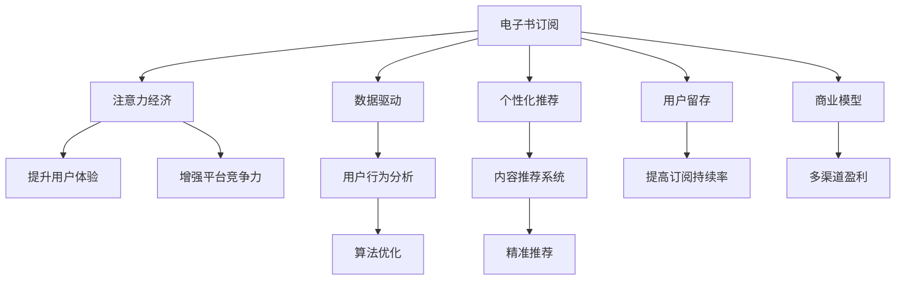

                 

# 电子书订阅服务在注意力经济中的兴起

> 关键词：电子书订阅, 注意力经济, 数据驱动, 个性化推荐, 用户留存, 商业模型

## 1. 背景介绍

### 1.1 问题由来
随着互联网和数字技术的迅猛发展，注意力经济成为互联网时代的新常态。大量信息充斥着用户的视野，而人们的注意力资源却是有限的。在这种背景下，如何有效吸引和保持用户的注意力，成为各个平台和企业的竞争焦点。在此过程中，电子书订阅服务以其精准、个性化的阅读推荐，成为吸引和保持用户注意力的重要手段之一。

电子书订阅服务，通过用户订阅特定领域或类型的电子书，向用户提供每日或每周的精选内容，使用户在繁忙的生活中能够轻松获得高质量的阅读资源。该服务在提供个性化的内容推荐的同时，还能帮助平台降低内容生产和推广的成本，提升用户粘性和平台收益。

### 1.2 问题核心关键点
本文聚焦于电子书订阅服务在注意力经济中的兴起，旨在深入探讨电子书订阅服务如何通过数据驱动和个性化推荐，提升用户的注意力和满意度，同时对平台的运营模式和盈利策略进行剖析。文章将分为以下几个核心部分进行深入讨论：电子书订阅服务的工作原理、核心算法及步骤、其在注意力经济中的应用场景，以及未来的发展趋势与面临的挑战。

## 2. 核心概念与联系

### 2.1 核心概念概述

为更好地理解电子书订阅服务在注意力经济中的兴起，本节将介绍几个密切相关的核心概念：

- **电子书订阅服务**：基于订阅模式，用户通过付费获得一定期限内访问特定电子书的权利。
- **注意力经济**：信息爆炸时代，用户注意力的稀缺性成为一种经济资源，吸引和保持用户注意力成为平台的核心竞争力。
- **数据驱动**：利用用户行为数据，通过机器学习算法进行分析和预测，为用户提供个性化推荐。
- **个性化推荐**：根据用户兴趣和行为，自动生成个性化内容推荐，提升用户体验和满意度。
- **用户留存**：通过精准推荐和优质服务，提高用户的订阅持续率和平台粘性。
- **商业模型**：订阅服务结合广告、增值服务等盈利手段，构建稳定的收入结构。

这些概念之间的逻辑关系可以通过以下Mermaid流程图来展示：



这个流程图展示电子书订阅服务的工作原理及其在注意力经济中的关键作用：

1. 电子书订阅服务通过数据驱动和个性化推荐，提升用户体验和满意度，增强平台竞争力。
2. 数据驱动涉及对用户行为数据的分析，通过机器学习算法生成个性化推荐。
3. 个性化推荐系统根据用户兴趣和行为，自动生成推荐内容，使用户粘性提升。
4. 用户留存通过精准推荐和优质服务，提高订阅持续率和平台粘性。
5. 商业模型结合订阅收入、广告分成、增值服务等多种盈利手段，构建稳定的收入结构。

这些概念共同构成了电子书订阅服务在注意力经济中的核心价值链，使其能够在高度竞争的市场环境中脱颖而出。

## 3. 核心算法原理 & 具体操作步骤
### 3.1 算法原理概述

电子书订阅服务的核心算法原理主要围绕个性化推荐展开，目标是根据用户的历史行为数据和实时反馈，动态生成符合用户兴趣的内容推荐。其核心思想在于：通过数据驱动的机器学习算法，构建用户兴趣模型，并在推荐过程中实时更新，以提高推荐的准确性和个性化程度。

核心算法流程大致如下：

1. **用户行为数据收集**：记录用户阅读偏好、搜索历史、订阅记录等行为数据。
2. **用户兴趣模型构建**：利用机器学习算法（如协同过滤、矩阵分解等），构建用户兴趣模型，表示用户对各类内容的偏好。
3. **内容推荐生成**：根据用户兴趣模型，从平台数据库中挑选相似度较高的内容进行推荐。
4. **反馈更新模型**：对用户的实时反馈（如阅读时间、点赞、评论等）进行记录和分析，更新用户兴趣模型，以便下一次推荐更加精准。

### 3.2 算法步骤详解

以下详细介绍电子书订阅服务的核心算法步骤及其具体实现方式：

**Step 1: 用户行为数据收集**

用户行为数据的收集是电子书订阅服务个性化推荐的基础。常见的数据来源包括：

- 阅读行为数据：记录用户阅读的书籍、章节、页面等详细信息。
- 搜索历史数据：记录用户在平台上的搜索关键词和结果。
- 订阅记录数据：记录用户的订阅书籍、计划阅读时间和周期等。
- 反馈数据：记录用户的评论、点赞、收藏等行为。

这些数据可以通过日志、API接口等手段获取。数据采集的目的是建立全面的用户画像，理解用户的兴趣偏好和行为模式。

**Step 2: 用户兴趣模型构建**

用户兴趣模型的构建是电子书订阅服务个性化推荐的核心。常见的构建方法包括：

- 协同过滤：通过分析用户历史行为和相似用户的行为，生成推荐列表。
- 矩阵分解：将用户-内容评分矩阵分解为用户特征矩阵和内容特征矩阵，预测用户对未读内容的评分。
- 深度学习模型：利用神经网络对用户行为数据进行建模，预测用户对内容的偏好。

以协同过滤为例，构建用户兴趣模型的具体步骤如下：

1. 对用户行为数据进行清洗和处理，去除噪音和无效数据。
2. 计算用户和内容之间的相似度，常用的相似度度量方法有皮尔逊相关系数、余弦相似度等。
3. 根据相似度构建用户-内容评分矩阵，表示用户对内容的评分。
4. 使用协同过滤算法（如ALS）对矩阵进行分解，得到用户特征矩阵和内容特征矩阵。
5. 根据用户特征矩阵预测用户对新内容的评分，生成推荐列表。

**Step 3: 内容推荐生成**

在用户兴趣模型构建完成后，可以根据其生成个性化推荐内容。具体步骤包括：

1. 对平台上的书籍、文章等进行分词、特征提取等预处理，形成内容特征向量。
2. 计算内容特征向量与用户兴趣特征向量的相似度，筛选出最相关的内容。
3. 利用推荐算法（如基于梯度的推荐算法）对用户兴趣模型进行更新，根据实时反馈调整推荐策略。

**Step 4: 反馈更新模型**

用户对推荐内容的反馈是进一步提升推荐准确性的重要信息。常见的反馈方式包括：

- 阅读时间：记录用户阅读每本书籍的时间，评估用户对内容的兴趣程度。
- 点赞和评论：记录用户对书籍的点赞和评论，分析用户对内容的评价。
- 收藏和分享：记录用户对书籍的收藏和分享行为，评估用户对内容的认可度。

利用这些反馈数据，可以进一步优化用户兴趣模型，提高推荐系统的精准度。具体步骤包括：

1. 收集用户对推荐内容的反馈数据。
2. 将反馈数据与用户兴趣模型相结合，进行加权平均或融合处理。
3. 利用机器学习算法对用户兴趣模型进行在线更新，确保模型始终反映最新的用户偏好。

### 3.3 算法优缺点

电子书订阅服务的个性化推荐算法具有以下优点：

1. **精准度高**：通过分析用户行为数据和实时反馈，生成精准的个性化推荐，提升用户体验。
2. **用户粘性高**：个性化推荐能够根据用户兴趣动态更新，使用户持续关注平台，提高订阅持续率。
3. **成本低**：相比传统的内容生产和推广方式，个性化推荐能够大幅降低平台运营成本。

同时，该算法也存在一些局限性：

1. **数据依赖性强**：推荐系统依赖于高质量的用户行为数据，数据采集和处理成本较高。
2. **模型复杂度高**：深度学习等算法需要大量的计算资源和数据量，对平台的技术实力提出了较高要求。
3. **冷启动问题**：对于新用户，缺少足够的历史行为数据，无法生成精准的推荐，需要采用特殊策略解决。
4. **用户隐私问题**：用户行为数据的收集和使用涉及用户隐私，需要严格遵守法律法规，保护用户权益。

尽管存在这些局限性，但电子书订阅服务的个性化推荐算法在实际应用中已证明其强大的效果，成为吸引和保持用户注意力的重要手段。

### 3.4 算法应用领域

电子书订阅服务的个性化推荐算法在多个领域得到了广泛应用，包括：

- **电子书平台**：如Kindle、豆瓣阅读等，通过推荐系统提高用户的订阅持续率和平台粘性。
- **在线教育**：如Coursera、Udemy等，通过个性化推荐提供符合用户兴趣的学习资源。
- **在线音乐**：如Spotify、网易云音乐等，通过推荐系统提供精准的音乐推荐，提升用户满意度。
- **新闻资讯**：如今日头条、网易新闻等，通过个性化推荐提供高质量的新闻内容，提高用户留存率。
- **视频平台**：如Netflix、爱奇艺等，通过推荐系统提供符合用户兴趣的视频内容，提升用户粘性。

此外，电子书订阅服务的个性化推荐算法还被应用于在线旅游、社交网络等多个领域，为平台带来了显著的商业价值和社会效益。

## 4. 数学模型和公式 & 详细讲解  
### 4.1 数学模型构建

在电子书订阅服务的个性化推荐算法中，数学模型构建是其核心。以下详细介绍推荐系统常用的数学模型：

假设用户集合为 $U$，内容集合为 $V$，用户与内容的评分矩阵为 $R_{uv}$。推荐系统的目标是通过用户-内容评分矩阵 $R$，预测用户 $u$ 对未读内容 $v$ 的评分，生成推荐列表。常见的推荐算法包括基于矩阵分解的推荐算法和基于梯度的推荐算法。

### 4.2 公式推导过程

以基于矩阵分解的推荐算法ALS为例，推导其数学模型。

ALS算法的目标是最小化预测评分与实际评分之间的差异，即最小化均方误差：

$$
\min_{P,Q} \frac{1}{2} \sum_{u=1}^M \sum_{v=1}^N (R_{uv} - P_u^T Q_v)^2
$$

其中，$P$ 表示用户特征矩阵，$Q$ 表示内容特征矩阵，$M$ 和 $N$ 分别表示用户和内容的数量。

对上述目标函数求偏导，得到用户特征矩阵和内容特征矩阵的更新公式：

$$
P_u = (X_u^T P Q^T Q - \alpha_u R_u)^\dagger
$$

$$
Q_v = (Q^T R^T X_u P_u P_u^T + \beta_v I_v)^{-1} Q_v
$$

其中，$\dagger$ 表示矩阵的伪逆，$\alpha_u$ 和 $\beta_v$ 为正则化系数，$X_u$ 表示用户特征向量的嵌入矩阵，$I_v$ 表示单位矩阵。

### 4.3 案例分析与讲解

假设某电子书订阅平台有10000个用户，10000本电子书。用户-内容评分矩阵为 $R$，其中每个元素 $R_{uv}$ 表示用户 $u$ 对书籍 $v$ 的评分。使用ALS算法对 $R$ 进行分解，得到用户特征矩阵 $P$ 和内容特征矩阵 $Q$。

1. 随机初始化用户特征矩阵 $P$ 和内容特征矩阵 $Q$。
2. 计算预测评分 $P_u^T Q_v$，计算实际评分与预测评分的均方误差。
3. 对用户特征矩阵 $P$ 和内容特征矩阵 $Q$ 进行更新，直到收敛。

通过计算，得到用户 $u$ 对未读内容 $v$ 的评分预测。根据预测评分生成推荐列表，推送给用户 $u$。

## 5. 项目实践：代码实例和详细解释说明
### 5.1 开发环境搭建

在进行电子书订阅服务的个性化推荐系统开发前，需要准备好开发环境。以下是使用Python进行PyTorch开发的环境配置流程：

1. 安装Anaconda：从官网下载并安装Anaconda，用于创建独立的Python环境。

2. 创建并激活虚拟环境：
```bash
conda create -n pytorch-env python=3.8 
conda activate pytorch-env
```

3. 安装PyTorch：根据CUDA版本，从官网获取对应的安装命令。例如：
```bash
conda install pytorch torchvision torchaudio cudatoolkit=11.1 -c pytorch -c conda-forge
```

4. 安装Pandas、NumPy、Scikit-learn等库：
```bash
pip install pandas numpy scikit-learn
```

5. 安装相关数据处理和推荐算法库：
```bash
pip install scipy seaborn
```

完成上述步骤后，即可在`pytorch-env`环境中开始推荐系统的开发。

### 5.2 源代码详细实现

下面以基于协同过滤的推荐系统为例，给出使用PyTorch进行开发的Python代码实现。

首先，定义推荐系统的数据处理函数：

```python
import numpy as np
from scipy.sparse import coo_matrix
from scipy.sparse.linalg import svds

def build_cooccurrence_matrix(ratings):
    # 构建用户-内容评分矩阵
    u = len(ratings)
    v = len(ratings[0])
    R = np.array(ratings, dtype=np.float32)
    R[R == 0] = -1  # 将0替换为-1，避免非负矩阵分解中的噪声
    R = R + 1
    r = np.argsort(R, axis=1)[::-1]  # 对每一行进行排序
    R = np.eye(u)[:, r] * R  # 生成评分矩阵
    return R

def train_matrix_factorization(R, num_factors=10, max_iter=100, alpha=1e-5, beta=1e-10):
    # 矩阵分解算法
    U, S, V = svds(R, k=num_factors, tol=alpha, maxiter=max_iter, callback=None, random_state=0)
    U = U.T
    V = V.T
    S = np.diag(S)
    return U, S, V

# 数据集示例
ratings = [
    [1, 1, 0, 0, 1, 1],
    [1, 0, 1, 1, 0, 0],
    [0, 1, 1, 0, 1, 1],
    [1, 0, 0, 1, 0, 0],
    [1, 1, 1, 1, 1, 1]
]
```

然后，定义推荐系统的优化函数：

```python
from torch import nn
import torch
from torch.autograd import Variable

class RecommenderNet(nn.Module):
    def __init__(self, num_users, num_items, num_factors, num_epochs):
        super(RecommenderNet, self).__init__()
        self.num_users = num_users
        self.num_items = num_items
        self.num_factors = num_factors
        self.num_epochs = num_epochs
        self.user_matrix = nn.Parameter(torch.randn(num_users, num_factors))
        self.item_matrix = nn.Parameter(torch.randn(num_items, num_factors))
        self.beta = nn.Parameter(torch.randn(1, num_items))
        self.alpha = nn.Parameter(torch.randn(1, num_users))

    def forward(self, user_idx, item_idx):
        # 计算预测评分
        user_vector = self.user_matrix[user_idx].view(1, -1)
        item_vector = self.item_matrix[item_idx].view(1, -1)
        pred = user_vector @ item_vector.t() + self.beta + self.alpha[user_idx].view(1, -1)
        return pred

    def predict(self, user_idx, item_idx):
        # 预测评分
        user_vector = self.user_matrix[user_idx].view(1, -1)
        item_vector = self.item_matrix[item_idx].view(1, -1)
        pred = user_vector @ item_vector.t() + self.beta + self.alpha[user_idx].view(1, -1)
        return pred

# 定义损失函数
def mse_loss(y_true, y_pred):
    return torch.mean((y_true - y_pred)**2)

# 训练推荐系统
def train_recommender_net(ratings, num_factors=10, num_epochs=100, learning_rate=0.1):
    num_users, num_items = ratings.shape
    model = RecommenderNet(num_users, num_items, num_factors, num_epochs)
    optimizer = torch.optim.Adam(model.parameters(), lr=learning_rate)

    for epoch in range(num_epochs):
        for user_idx, item_idx in enumerate(ratings):
            y_true = Variable(torch.tensor(ratings[user_idx]))
            y_pred = model.predict(user_idx, item_idx)
            loss = mse_loss(y_true, y_pred)
            optimizer.zero_grad()
            loss.backward()
            optimizer.step()

        print(f'Epoch {epoch+1}, loss: {loss:.4f}')

    return model

# 训练推荐系统
model = train_recommender_net(ratings)
```

最后，定义推荐系统的评估函数：

```python
def evaluate_recommender_net(model, ratings, num_factors=10):
    # 计算评分矩阵
    U, S, V = train_matrix_factorization(ratings, num_factors=num_factors)
    # 生成预测评分
    predictions = []
    for user_idx, item_idx in ratings:
        y_pred = model.predict(user_idx, item_idx)
        predictions.append(y_pred)

    # 计算平均绝对误差
    mse = np.mean(np.abs(np.array(predictions) - ratings))

    return mse

# 评估推荐系统
mse = evaluate_recommender_net(model, ratings)
print(f'Mean Squared Error: {mse:.4f}')
```

以上即为使用PyTorch进行基于协同过滤的推荐系统开发的完整代码实现。可以看到，通过PyTorch的Tensor计算和优化器，可以方便地实现个性化推荐系统的训练和评估。

### 5.3 代码解读与分析

让我们再详细解读一下关键代码的实现细节：

**build_cooccurrence_matrix函数**：
- 该函数用于构建用户-内容评分矩阵，是推荐系统的基础。
- 首先将评分矩阵转换为稀疏矩阵形式，方便后续的矩阵分解操作。
- 将评分矩阵中的0替换为-1，避免在矩阵分解时引入噪声。

**train_matrix_factorization函数**：
- 该函数用于训练矩阵分解模型，得到用户特征矩阵、内容特征矩阵和奇异值矩阵。
- 使用scipy库中的svds算法进行矩阵分解。
- 返回用户特征矩阵、内容特征矩阵和奇异值矩阵，用于生成推荐。

**RecommenderNet类**：
- 该类实现了基于协同过滤的推荐模型，包括用户矩阵、内容矩阵、用户偏置向量、物品偏置向量等。
- 通过前向传播计算预测评分，并定义损失函数为均方误差。
- 使用Adam优化器进行模型训练，更新用户特征矩阵和内容特征矩阵。

**train_recommender_net函数**：
- 该函数用于训练推荐模型，循环迭代每个用户-内容评分对，更新模型参数。
- 定义优化器、损失函数等关键组件，方便进行模型训练。

**evaluate_recommender_net函数**：
- 该函数用于评估推荐模型的性能，通过计算均方误差来衡量预测评分的准确性。
- 使用训练好的模型进行预测，并计算预测评分与真实评分的均方误差。

可以看出，基于协同过滤的推荐系统通过构建用户-内容评分矩阵，利用矩阵分解算法生成用户特征矩阵和内容特征矩阵，进而计算预测评分并生成推荐列表。这种基于数据驱动的推荐方式，能够有效提升推荐系统的精准度和个性化程度。

## 6. 实际应用场景
### 6.1 智能推荐系统

基于协同过滤的推荐系统在智能推荐领域具有广泛的应用。典型的应用场景包括：

- **电商平台**：如Amazon、淘宝等，通过推荐系统向用户推荐商品，提高销售转化率。
- **视频平台**：如Netflix、爱奇艺等，通过推荐系统向用户推荐视频内容，提升用户体验和粘性。
- **在线阅读**：如豆瓣阅读、知乎等，通过推荐系统向用户推荐书籍、文章等，提升用户留存率和满意度。
- **金融理财**：如支付宝、微信理财等，通过推荐系统向用户推荐理财产品，提高用户粘性和收益。

这些应用场景中，个性化推荐系统通过分析用户行为数据，生成精准的推荐内容，显著提升了用户满意度和服务质量。

### 6.2 信息筛选工具

基于协同过滤的推荐系统还可以应用于信息筛选工具中，帮助用户在海量信息中快速找到感兴趣的内容。常见的应用场景包括：

- **新闻聚合**：如今日头条、网易新闻等，通过推荐系统筛选新闻内容，推荐用户感兴趣的新闻。
- **论文推荐**：如Google Scholar、ResearchGate等，通过推荐系统筛选论文，推荐用户感兴趣的研究方向和论文。
- **音乐推荐**：如Spotify、网易云音乐等，通过推荐系统筛选音乐，推荐用户感兴趣的歌曲和专辑。

这些应用场景中，推荐系统通过分析用户行为数据，生成符合用户兴趣的推荐内容，帮助用户在海量信息中找到有价值的内容。

### 6.3 客户忠诚度提升

基于协同过滤的推荐系统还可以应用于客户忠诚度提升中，通过精准的个性化推荐，增强用户的品牌忠诚度和平台粘性。常见的应用场景包括：

- **银行理财**：通过推荐系统向用户推荐理财方案，提升用户的理财粘性和满意度。
- **旅游平台**：通过推荐系统向用户推荐旅游线路，提升用户的旅游体验和忠诚度。
- **在线教育**：通过推荐系统向用户推荐学习资源，提升用户的在线学习体验和粘性。

这些应用场景中，个性化推荐系统通过精准的推荐内容，满足用户的个性化需求，增强用户对平台的认同感和忠诚度。

### 6.4 未来应用展望

随着技术的发展，基于协同过滤的推荐系统将在更多领域得到应用，为平台带来新的商业价值。

在智慧城市治理中，推荐系统可以用于推荐公共服务信息，帮助市民获取所需信息，提升公共服务的可及性和便捷性。

在智能家居领域，推荐系统可以用于推荐家电设备、智能家居方案，提升用户的生活体验和舒适性。

在健康医疗领域，推荐系统可以用于推荐健康资讯、医生推荐、就医方案，提升用户的健康水平和医疗体验。

总之，基于协同过滤的推荐系统通过个性化推荐，能够提升用户满意度、增强平台粘性，为各行各业带来显著的商业价值和社会效益。未来，随着技术的不断进步，推荐系统的应用范围将进一步拓展，为用户带来更多便利和高质量的服务。

## 7. 工具和资源推荐
### 7.1 学习资源推荐

为了帮助开发者系统掌握电子书订阅服务在注意力经济中的核心技术，这里推荐一些优质的学习资源：

1. **《推荐系统实战》**：李航教授的书籍，详细介绍了推荐系统的工作原理和实际应用，是入门推荐系统的经典教材。
2. **Coursera《机器学习》课程**：斯坦福大学Andrew Ng教授的机器学习课程，涵盖了推荐系统的基本原理和算法实现。
3. **Kaggle推荐系统竞赛**：通过参与推荐系统竞赛，深入理解推荐算法的实际应用和优化方法。
4. **Recommender Systems SIG**：ACM RecSys会议下设的特别兴趣小组，聚焦于推荐系统的研究与实践，定期发布最新的研究成果和技术进展。
5. **Ai Challenger推荐系统竞赛**：由Baidu组织的推荐系统竞赛，涵盖多种推荐算法和实际应用，是推荐系统学习的绝佳平台。

通过对这些资源的学习实践，相信你一定能够全面掌握电子书订阅服务在注意力经济中的核心技术，并用于解决实际的推荐问题。

### 7.2 开发工具推荐

高效的开发离不开优秀的工具支持。以下是几款用于推荐系统开发的常用工具：

1. **TensorFlow**：由Google主导开发的开源深度学习框架，生产部署方便，适合大规模工程应用。
2. **PyTorch**：基于Python的开源深度学习框架，灵活动态的计算图，适合快速迭代研究。
3. **Scikit-learn**：Python机器学习库，提供多种常用的推荐算法，如协同过滤、矩阵分解等。
4. **Hadoop**：分布式计算框架，用于处理大规模推荐系统的数据存储和计算任务。
5. **Spark**：Apache Hadoop生态系统下的分布式计算引擎，支持多种数据处理和分析任务。
6. **Elasticsearch**：分布式搜索引擎，用于推荐系统中的实时搜索和数据检索任务。

合理利用这些工具，可以显著提升推荐系统的开发效率，加快创新迭代的步伐。

### 7.3 相关论文推荐

推荐系统的研究始于学界的持续研究。以下是几篇奠基性的相关论文，推荐阅读：

1. **《推荐系统基础》**：由Richard M. Lippmann等编写的经典教材，系统介绍了推荐系统的基本原理和算法实现。
2. **《协同过滤推荐系统》**：由Jiawei Han等编写的论文，详细介绍了协同过滤推荐系统的原理和应用。
3. **《矩阵分解推荐系统》**：由Jiawei Han等编写的论文，详细介绍了矩阵分解推荐系统的原理和应用。
4. **《深度学习推荐系统》**：由Li Wei等编写的论文，介绍了深度学习在推荐系统中的应用。
5. **《多臂老虎机问题》**：由Tommy Otto等编写的论文，详细介绍了多臂老虎机问题在推荐系统中的应用。

这些论文代表了大数据推荐系统的研究脉络。通过学习这些前沿成果，可以帮助研究者把握学科前进方向，激发更多的创新灵感。

## 8. 总结：未来发展趋势与挑战
### 8.1 总结

本文对电子书订阅服务在注意力经济中的兴起进行了全面系统的介绍。首先阐述了电子书订阅服务在个性化推荐、用户留存和平台收益方面的重要意义，明确了个性化推荐在提升用户体验和平台竞争力的核心作用。其次，从算法原理到实际应用，详细讲解了电子书订阅服务的核心算法步骤及其实现方式。

通过本文的系统梳理，可以看到，电子书订阅服务的个性化推荐系统通过数据驱动和算法优化，能够在高度竞争的市场环境中脱颖而出，为平台带来显著的商业价值和社会效益。未来，随着技术的不断进步和应用场景的拓展，基于协同过滤的推荐系统将在更多领域得到应用，为各行各业带来新的创新和变革。

### 8.2 未来发展趋势

展望未来，基于协同过滤的推荐系统将呈现以下几个发展趋势：

1. **深度学习广泛应用**：深度学习推荐系统能够更好地利用用户行为数据，提高推荐系统的精准度。未来，深度学习算法将逐步取代传统的协同过滤算法，成为推荐系统的主流技术。
2. **跨平台推荐**：推荐系统将在不同平台间进行跨平台推荐，实现多渠道数据整合和协同。通过整合用户在不同平台上的行为数据，生成更加精准的推荐内容。
3. **实时推荐**：实时推荐能够更快速响应用户需求，提升用户满意度和平台粘性。未来，推荐系统将实时更新用户兴趣模型，动态生成推荐内容。
4. **多模态推荐**：多模态推荐系统能够整合多种模态数据，提供更加丰富和全面的推荐内容。未来，推荐系统将整合文本、图像、音频等多种模态数据，提升推荐系统的表现力。
5. **社交推荐**：社交推荐系统能够利用用户社交关系，生成更加个性化的推荐内容。未来，推荐系统将整合社交网络数据，生成符合用户社交关系的行为推荐。
6. **协同过滤算法优化**：协同过滤算法将在优化和改进中不断进步。未来，推荐系统将引入更多优化算法，提高协同过滤算法的效率和效果。

这些趋势凸显了基于协同过滤的推荐系统在技术发展上的广阔前景。这些方向的探索发展，必将进一步提升推荐系统的性能和应用范围，为各个平台带来新的商业价值和社会效益。

### 8.3 面临的挑战

尽管基于协同过滤的推荐系统在实际应用中已取得显著效果，但在迈向更加智能化、普适化应用的过程中，它仍面临诸多挑战：

1. **数据质量问题**：推荐系统依赖高质量的用户行为数据，数据采集和处理成本较高。如何获取并清洗高质量的用户数据，是推荐系统面临的重要挑战。
2. **冷启动问题**：对于新用户，缺少足够的历史行为数据，无法生成精准的推荐。如何解决冷启动问题，提升新用户的推荐效果，是推荐系统的重要课题。
3. **用户隐私问题**：推荐系统涉及用户隐私数据，如何保护用户隐私，避免数据泄露，是推荐系统面临的重要问题。
4. **模型复杂度问题**：深度学习推荐系统需要大量的计算资源和数据量，对平台的技术实力提出了较高要求。如何降低模型复杂度，提高推荐系统的效率，是推荐系统的重要课题。
5. **推荐内容质量问题**：推荐内容的质量直接影响用户体验。如何提高推荐内容的质量，避免内容偏差，是推荐系统的重要挑战。
6. **用户粘性问题**：推荐系统面临用户粘性不足的问题。如何提升用户粘性，延长用户留存时间，是推荐系统的重要课题。

尽管存在这些挑战，但基于协同过滤的推荐系统在实际应用中已证明其强大的效果，成为个性化推荐领域的重要手段。未来，通过不断优化算法和数据处理技术，推荐系统将更加精准、高效、安全，为各行各业带来新的商业价值和社会效益。

### 8.4 研究展望

面对推荐系统面临的挑战，未来的研究需要在以下几个方面寻求新的突破：

1. **数据获取和处理技术**：通过引入新的数据采集和处理技术，提升推荐系统对用户行为数据的采集和处理能力，确保数据的质量和完整性。
2. **深度学习算法优化**：通过深度学习算法的优化和改进，提高推荐系统的精准度和效果。引入更加高效的深度学习模型和优化算法，提升推荐系统的性能。
3. **跨平台数据整合**：通过跨平台数据整合和协同，提升推荐系统的泛化能力和表现力。整合不同平台的用户行为数据，生成更加精准的推荐内容。
4. **实时推荐系统**：通过实时推荐系统的开发和应用，提升推荐系统的响应速度和用户体验。实时更新用户兴趣模型，动态生成推荐内容。
5. **多模态推荐系统**：通过多模态推荐系统的开发和应用，提升推荐系统的表现力和多样化。整合文本、图像、音频等多种模态数据，生成更加全面和丰富的推荐内容。
6. **社交推荐系统**：通过社交推荐系统的开发和应用，提升推荐系统的个性化和社交属性。整合社交网络数据，生成符合用户社交关系的行为推荐。
7. **协同过滤算法优化**：通过协同过滤算法的优化和改进，提高协同过滤算法的效率和效果。引入更加高效的协同过滤算法和优化策略，提升推荐系统的性能。

这些研究方向的探索，必将引领推荐系统走向更高的台阶，为各行各业带来新的创新和变革。面向未来，推荐系统需要与其他人工智能技术进行更深入的融合，如知识表示、因果推理、强化学习等，多路径协同发力，共同推动推荐系统的发展和进步。只有勇于创新、敢于突破，才能不断拓展推荐系统的边界，让推荐系统更好地服务于各行各业。

## 9. 附录：常见问题与解答

**Q1：什么是协同过滤推荐系统？**

A: 协同过滤推荐系统是一种基于用户行为数据的推荐算法，通过分析用户历史行为数据和相似用户的行为数据，生成个性化推荐内容。

**Q2：协同过滤推荐系统有哪些优点和缺点？**

A: 协同过滤推荐系统的优点包括：
1. 能够根据用户历史行为生成精准的推荐内容。
2. 能够处理大规模数据集，实现高效的推荐。

缺点包括：
1. 需要大量的用户行为数据，数据采集和处理成本较高。
2. 对新用户的推荐效果较差，冷启动问题难以解决。
3. 模型复杂度较高，计算资源消耗较大。
4. 对数据偏差较为敏感，推荐内容可能存在偏差。

**Q3：推荐系统的数据采集和处理流程是什么？**

A: 推荐系统的数据采集和处理流程如下：
1. 收集用户行为数据，如阅读、搜索、评分等。
2. 对数据进行清洗和处理，去除噪音和无效数据。
3. 构建用户-内容评分矩阵，表示用户对内容的评分。
4. 进行矩阵分解，得到用户特征矩阵和内容特征矩阵。
5. 根据用户特征矩阵和内容特征矩阵生成推荐内容。

**Q4：推荐系统在实际应用中如何解决冷启动问题？**

A: 推荐系统在实际应用中通过以下方式解决冷启动问题：
1. 利用用户其他渠道的社交数据，生成推荐内容。
2. 使用基于内容的推荐算法，结合用户兴趣和内容属性生成推荐内容。
3. 引入协同过滤算法的改进方法，如基于隐式反馈的协同过滤算法、基于物品的协同过滤算法等。
4. 利用用户社交网络数据，生成推荐内容。

**Q5：推荐系统的推荐效果如何评估？**

A: 推荐系统的推荐效果通常通过以下指标进行评估：
1. 准确率（Accuracy）：推荐系统正确推荐的数量占总推荐数量的比例。
2. 召回率（Recall）：推荐系统正确推荐的数量占实际正确推荐数量的比例。
3. F1分数（F1 Score）：综合考虑准确率和召回率的指标，用于评估推荐系统的综合表现。
4. 点击率（Click-Through Rate）：用户点击推荐内容的数量占推荐内容总量的比例，用于衡量推荐内容对用户的行为影响。
5. 转化率（Conversion Rate）：用户完成目标行为的数量占推荐内容总量的比例，用于衡量推荐内容对用户的实际影响。

通过以上指标，可以对推荐系统的推荐效果进行全面评估，发现问题并进行优化。

---

作者：禅与计算机程序设计艺术 / Zen and the Art of Computer Programming

