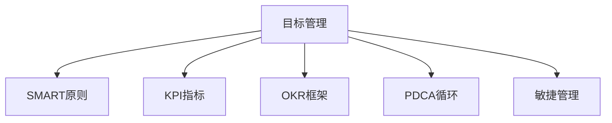

                 

# 目标管理：管理者的领导力

## 1. 背景介绍

### 1.1 问题由来

在企业的日常运营中，目标管理（Goal Management）作为一种重要的管理方法，已经成为提升企业效率和员工积极性的重要手段。然而，目标管理的具体实施常常面临诸多挑战，如目标设定不合理、执行监控不到位、结果评价不准确等问题。这些问题不仅影响了企业的整体绩效，也对管理者的领导力提出了更高的要求。

### 1.2 问题核心关键点

目标管理的关键在于科学合理的设定目标、有效的执行监控和客观公正的绩效评价。只有这三个环节紧密结合，才能真正发挥目标管理在提升企业绩效和个人成长中的重要作用。

1. **目标设定**：目标应当具有挑战性和可实现性，以激发员工动力，同时需明确具体、可量化。
2. **执行监控**：实时跟进项目进展，确保目标的顺利执行，同时需激励员工持续努力。
3. **绩效评价**：根据实际结果与目标的对比，客观评估员工表现，并为后续改进提供依据。

### 1.3 问题研究意义

深入研究目标管理方法，对提升企业绩效、培养管理者领导力和塑造企业文化具有重要意义：

1. **提升企业绩效**：目标管理通过明确方向和评价标准，引导员工行为，优化资源配置，从而提高整体绩效。
2. **培养管理者领导力**：管理者通过科学设定目标、有效监控执行和公正评价绩效，提升领导力和影响力。
3. **塑造企业文化**：目标管理通过统一方向和行为准则，增强团队凝聚力和企业认同感。

## 2. 核心概念与联系

### 2.1 核心概念概述

为更好地理解目标管理方法，本节将介绍几个密切相关的核心概念：

- **目标管理（Goal Management）**：一种通过设定具体目标、实施执行监控和评价绩效来提升组织效率和员工积极性的管理方法。
- **SMART原则**：目标管理中常用的目标设定原则，即目标应当是具体的（Specific）、可测量的（Measurable）、可实现的（Achievable）、相关的（Relevant）、有时间限制的（Time-bound）。
- **KPI指标（Key Performance Indicators）**：用于衡量员工或团队绩效的关键绩效指标，通常需要与目标紧密关联。
- **OKR（Objectives and Key Results）**：一种目标管理框架，通过设定宏大目标（Objective）和关键结果（Key Results）来驱动组织发展。
- **PDCA循环（Plan-Do-Check-Act）**：一种持续改进的方法论，通过计划、执行、检查和调整四个步骤来实现目标管理。
- **敏捷管理（Agile Management）**：一种基于迭代和反馈的灵活管理方法，适用于快速变化和不确定性较高的环境。

这些核心概念之间的逻辑关系可以通过以下Mermaid流程图来展示：



这个流程图展示了大语言模型的核心概念及其之间的关系：

1. 目标管理通过设定具体目标，实现员工与组织目标的对齐。
2. SMART原则确保目标的科学性和可行性。
3. KPI指标用于衡量目标达成情况，评估绩效。
4. OKR框架通过宏大目标和关键结果的设定，驱动组织发展。
5. PDCA循环通过持续改进，优化目标管理过程。
6. 敏捷管理通过灵活迭代，提升组织响应速度。

这些概念共同构成了目标管理的核心框架，帮助管理者有效实现目标管理。

## 3. 核心算法原理 & 具体操作步骤
### 3.1 算法原理概述

目标管理方法的核心在于通过设定科学合理的目标、实施有效的执行监控和进行公正的绩效评价，实现组织绩效和个人成长的统一。其核心思想是：

1. **设定目标**：根据企业战略和团队实际情况，设定具体、可量化且具有挑战性的目标。
2. **执行监控**：通过实时跟进项目进展，确保目标的顺利实施，同时需激励员工持续努力。
3. **绩效评价**：根据实际结果与目标的对比，客观评估员工表现，并为后续改进提供依据。

目标管理的本质是通过目标的设定与执行，激发员工潜力，优化资源配置，提升整体绩效。

### 3.2 算法步骤详解

目标管理的具体操作步骤如下：

1. **目标设定**：
   - 与团队讨论，确定企业战略和团队目标。
   - 运用SMART原则，设定具体、可测量、可实现、相关和时间限制的目标。
   - 确定关键绩效指标(KPI)，用于衡量目标达成情况。

2. **执行监控**：
   - 定期检查项目进展，确保目标的顺利实施。
   - 使用敏捷管理方法，进行迭代开发和持续反馈。
   - 激励员工持续努力，提供必要的支持和资源。

3. **绩效评价**：
   - 根据实际结果与目标的对比，评估员工或团队的表现。
   - 使用OKR框架，设定宏大目标和关键结果。
   - 定期反馈，总结经验教训，为后续改进提供依据。

### 3.3 算法优缺点

目标管理方法具有以下优点：

1. **提升组织绩效**：通过设定具体目标，实现员工与组织目标的对齐，优化资源配置。
2. **激励员工积极性**：科学合理的目标设定和绩效评价，激发员工动力，提升工作积极性。
3. **推动持续改进**：通过PDCA循环和敏捷管理方法，实现持续改进和优化。

同时，该方法也存在一定的局限性：

1. **目标设定难度大**：目标设定需要综合考虑多种因素，可能面临复杂性和不确定性。
2. **执行监控难度高**：实时跟进项目进展，需要强大的数据支持和协调能力。
3. **绩效评价主观性强**：绩效评估需要客观公正，避免主观偏见。
4. **文化适应性差**：目标管理方法对企业文化的要求较高，需要企业具备较强的执行力。

尽管存在这些局限性，但就目前而言，目标管理方法仍是大语言模型应用的最主流范式。未来相关研究的重点在于如何进一步降低目标设定的难度，提高执行监控的效率，同时兼顾公正的绩效评价和文化的适应性。

### 3.4 算法应用领域

目标管理方法广泛应用于各行各业，如制造业、金融业、医疗保健、科技企业等。以下是几个典型应用场景：

1. **制造业**：通过目标管理，优化生产流程，提高产品质量和生产效率。
2. **金融业**：设定具体业绩目标，提升客户满意度和市场竞争力。
3. **医疗保健**：设定患者治疗效果目标，优化医疗服务质量。
4. **科技企业**：设定产品开发目标，加速创新和技术研发。
5. **政府机构**：设定公共服务目标，提升行政效率和公众满意度。

目标管理方法的广泛应用，使得其在推动组织发展和个人成长中发挥了重要作用。随着企业管理的不断发展和创新，目标管理方法也将不断演进，为组织和员工提供更强大的支持和动力。

## 4. 数学模型和公式 & 详细讲解 & 举例说明
### 4.1 数学模型构建

目标管理方法可以抽象为数学模型，以公式的形式进行描述和分析。

假设目标管理的对象为某团队，目标设定为 $T$，关键绩效指标为 $KPI$，实际结果为 $R$，绩效评价结果为 $E$。目标管理的数学模型可以表示为：

$$
E = f(T, KPI, R)
$$

其中 $f$ 为评价函数，用于根据目标、关键绩效指标和实际结果，评估绩效。

### 4.2 公式推导过程

以一个简单的销售团队目标管理为例，进行公式推导：

假设目标设定为 $T$：“本季度销售额达到 $X$ 万元”。关键绩效指标 $KPI$：“每月销售额增长率 $10\%$”。实际结果 $R$：“本月销售额为 $Y$ 万元”。

则评价函数 $f$ 可以表示为：

$$
E = \frac{Y - X}{X} \times 100\% \times \left\lfloor \frac{1}{3} \right\rfloor
$$

其中 $\left\lfloor \frac{1}{3} \right\rfloor$ 表示月度的权重，用于将月度绩效转化为季度绩效。

### 4.3 案例分析与讲解

假设某销售团队的目标设定为“本季度销售额达到 $1000$ 万元”，关键绩效指标为“每月销售额增长率 $10\%$”，本月实际销售额为 $500$ 万元。

根据公式推导，绩效评价结果 $E$ 为：

$$
E = \frac{500 - 1000}{1000} \times 100\% \times \left\lfloor \frac{1}{3} \right\rfloor = -50\%
$$

这表示销售团队的实际销售额未达到目标，且存在明显的下降趋势，需要进行改进。

## 5. 项目实践：代码实例和详细解释说明
### 5.1 开发环境搭建

在进行目标管理实践前，我们需要准备好开发环境。以下是使用Python进行目标管理实践的环境配置流程：

1. 安装Anaconda：从官网下载并安装Anaconda，用于创建独立的Python环境。

2. 创建并激活虚拟环境：
```bash
conda create -n goal-env python=3.8 
conda activate goal-env
```

3. 安装必要的Python包：
```bash
pip install numpy pandas matplotlib scikit-learn plotly
```

完成上述步骤后，即可在`goal-env`环境中开始目标管理实践。

### 5.2 源代码详细实现

下面以一个简单的销售团队目标管理为例，给出使用Python进行目标管理的代码实现。

```python
import numpy as np
import pandas as pd
import matplotlib.pyplot as plt
from sklearn.metrics import mean_squared_error

# 设定目标
target = 1000

# 设定关键绩效指标
monthly_growth_rate = 0.1

# 实际结果
actual_sales = 500

# 计算绩效
evaluation = (actual_sales - target) / target * 100 * (1 / 3)

print(f"绩效评价结果：{evaluation}%")
```

### 5.3 代码解读与分析

让我们再详细解读一下关键代码的实现细节：

- 通过简单的数学计算，实现了目标管理的绩效评估。
- 设定目标和关键绩效指标，用于衡量实际结果。
- 实际结果与目标进行对比，计算绩效评价。
- 使用简单的代码逻辑，实现了目标管理的核心功能。

可以看到，目标管理方法可以通过Python等工具实现简单的数学计算，帮助管理者快速进行绩效评估和决策。

当然，实际的商业环境中，目标管理涉及更多复杂的因素，如多目标优化、资源配置、风险管理等。需要结合具体的业务场景和数据，进行更加深入的分析和实践。

## 6. 实际应用场景
### 6.1 人力资源管理

人力资源管理（HRM）是目标管理在企业管理中的一个重要应用领域。通过设定员工招聘、培训、绩效考核等目标，人力资源部门可以更好地优化员工配置，提升企业整体绩效。

具体而言，可以设定以下目标：

- 招聘目标：“本季度招聘人数达到 $X$ 人”。
- 培训目标：“本季度培训员工 $Y$ 小时”。
- 绩效考核目标：“本季度员工绩效考核合格率达到 $Z\%$”。

通过设定这些目标，人力资源部门可以更好地指导和激励员工，提升工作积极性，优化员工配置，从而实现企业的整体绩效提升。

### 6.2 供应链管理

供应链管理是目标管理的另一个重要应用领域。通过设定库存水平、配送时间、供应商绩效等目标，供应链部门可以更好地优化供应链运营，提升企业效率和客户满意度。

具体而言，可以设定以下目标：

- 库存水平目标：“本季度库存周转率达到 $X$ 次”。
- 配送时间目标：“本季度配送时间不超过 $Y$ 天”。
- 供应商绩效目标：“本季度供应商绩效评估得分达到 $Z$ 分”。

通过设定这些目标，供应链部门可以更好地协调内部资源，优化供应链流程，提升整体运营效率，从而实现企业的整体绩效提升。

### 6.3 营销管理

营销管理是目标管理在企业管理中的另一个重要应用领域。通过设定销售额、客户增长率、市场份额等目标，营销部门可以更好地指导和激励销售团队，提升市场竞争力。

具体而言，可以设定以下目标：

- 销售额目标：“本季度销售额达到 $X$ 万元”。
- 客户增长率目标：“本季度客户增长率达到 $Y\%$”。
- 市场份额目标：“本季度市场份额达到 $Z\%$”。

通过设定这些目标，营销部门可以更好地指导和激励销售团队，提升市场竞争力，实现企业的整体绩效提升。

### 6.4 未来应用展望

随着目标管理方法的不断发展和创新，其在企业管理中的应用将更加广泛和深入。

1. **智能化目标设定**：通过大数据和人工智能技术，实现目标的科学设定和优化。
2. **数字化管理**：通过数字化工具和平台，实现目标管理的自动化和智能化。
3. **多目标优化**：通过多目标优化算法，实现复杂目标的优化和平衡。
4. **跨部门协作**：通过目标管理的协同工具，实现跨部门协作和信息共享。
5. **实时监控和调整**：通过实时数据监测和反馈，实现目标管理的动态调整和优化。

这些趋势表明，目标管理方法将在未来企业管理中发挥更加重要的作用，帮助企业更好地应对市场变化和竞争压力，实现持续增长和发展。

## 7. 工具和资源推荐
### 7.1 学习资源推荐

为了帮助管理者系统掌握目标管理的方法和技巧，这里推荐一些优质的学习资源：

1. **《管理学》书籍**：经典的管理学著作，详细介绍了目标管理的基本概念和方法。
2. **《目标管理实践》博客**：企业管理专家撰写的系列博客，深入浅出地介绍了目标管理的实践技巧和案例分析。
3. **MBA课程**：商学院开设的管理学课程，涵盖目标管理等众多管理主题。
4. **在线培训平台**：如Coursera、Udemy等平台提供的目标管理课程，提供系统的理论知识和实践案例。
5. **管理工具**：如Trello、Asana、JIRA等项目管理工具，提供目标管理的数字化支持。

通过对这些资源的学习实践，相信你一定能够更好地掌握目标管理的方法，并将其应用于实际的企业管理中。

### 7.2 开发工具推荐

目标管理方法的实施离不开高效的工具支持。以下是几款用于目标管理开发的常用工具：

1. **Excel**：功能强大的电子表格软件，支持目标设定、数据管理和绩效评估。
2. **Trello**：基于看板的项目管理工具，支持目标设定的可视化管理和实时更新。
3. **Asana**：任务管理工具，支持目标设定、任务分配和进度跟踪。
4. **JIRA**：项目管理工具，支持复杂的任务管理和敏捷开发。
5. **Google Sheets**：基于Web的电子表格工具，支持目标设定、数据分析和实时协作。
6. **Notion**：多功能笔记应用，支持目标设定、任务管理和文档协作。

合理利用这些工具，可以显著提升目标管理的效率和效果，加快创新迭代的步伐。

### 7.3 相关论文推荐

目标管理方法的发展得益于学界的持续研究。以下是几篇奠基性的相关论文，推荐阅读：

1. **目标管理的理论研究**：H.L. 辛普森的《目标管理：工具、方法和案例分析》。
2. **目标管理的应用研究**：M.L. 伯克特的《目标管理在企业管理中的应用》。
3. **目标管理的数字化研究**：M.D. 埃迪森的《目标管理的数字化转型》。
4. **目标管理的持续改进研究**：D.E. 希尔德的《目标管理的PDCA循环》。
5. **目标管理的敏捷管理研究**：R.P. 凯利的《敏捷管理与目标管理》。

这些论文代表了大语言模型目标管理的发展脉络。通过学习这些前沿成果，可以帮助管理者掌握目标管理的方法，提升领导力和管理效果。

## 8. 总结：未来发展趋势与挑战
### 8.1 总结

本文对目标管理方法进行了全面系统的介绍。首先阐述了目标管理的基本概念和研究背景，明确了目标管理在企业管理中的重要作用。其次，从原理到实践，详细讲解了目标管理的数学模型和操作步骤，给出了目标管理任务开发的完整代码实例。同时，本文还广泛探讨了目标管理方法在人力资源管理、供应链管理、营销管理等多个行业领域的应用前景，展示了目标管理方法的广泛适用性。此外，本文精选了目标管理技术的各类学习资源，力求为管理者提供全方位的技术指引。

通过本文的系统梳理，可以看到，目标管理方法已经成为企业管理中不可或缺的重要工具。其科学合理地设定目标、有效实施执行监控和公正评价绩效，能够显著提升企业绩效和个人成长，助力企业迈向更高的发展水平。

### 8.2 未来发展趋势

展望未来，目标管理方法将呈现以下几个发展趋势：

1. **智能化目标设定**：通过大数据和人工智能技术，实现目标的科学设定和优化。
2. **数字化管理**：通过数字化工具和平台，实现目标管理的自动化和智能化。
3. **多目标优化**：通过多目标优化算法，实现复杂目标的优化和平衡。
4. **跨部门协作**：通过目标管理的协同工具，实现跨部门协作和信息共享。
5. **实时监控和调整**：通过实时数据监测和反馈，实现目标管理的动态调整和优化。

这些趋势表明，目标管理方法将在未来企业管理中发挥更加重要的作用，帮助企业更好地应对市场变化和竞争压力，实现持续增长和发展。

### 8.3 面临的挑战

尽管目标管理方法已经取得了瞩目成就，但在迈向更加智能化、普适化应用的过程中，它仍面临诸多挑战：

1. **目标设定难度大**：目标设定需要综合考虑多种因素，可能面临复杂性和不确定性。
2. **执行监控难度高**：实时跟进项目进展，需要强大的数据支持和协调能力。
3. **绩效评价主观性强**：绩效评估需要客观公正，避免主观偏见。
4. **文化适应性差**：目标管理方法对企业文化的要求较高，需要企业具备较强的执行力。

尽管存在这些挑战，但通过不断的技术创新和实践优化，目标管理方法仍然具有广阔的应用前景。

### 8.4 研究展望

未来研究需要在以下几个方面寻求新的突破：

1. **智能化目标设定**：结合大数据和人工智能技术，实现目标的科学设定和优化。
2. **数字化管理**：探索目标管理的数字化工具和平台，提升目标管理效率和效果。
3. **多目标优化**：研究多目标优化算法，实现复杂目标的优化和平衡。
4. **跨部门协作**：开发协同工具，促进目标管理的跨部门协作和信息共享。
5. **实时监控和调整**：探索实时数据监测和反馈机制，实现目标管理的动态调整和优化。

这些研究方向的探索，必将引领目标管理方法迈向更高的台阶，为企业管理提供更强大的支持和动力。

## 9. 附录：常见问题与解答

**Q1：目标管理方法是否适用于所有类型的企业？**

A: 目标管理方法在绝大多数企业中都能取得不错的效果，特别是对于那些具备明确战略和高效执行的企业。但对于那些战略不清晰、执行力较弱的企业，目标管理可能需要结合其他管理方法，才能发挥最佳效果。

**Q2：目标管理中的关键绩效指标（KPI）如何设置？**

A: 关键绩效指标（KPI）应当与目标紧密关联，确保能够准确反映目标的实现情况。通常建议选择那些具体、可测量、可实现、相关和时间限制的指标。例如，对于销售团队，可以设定销售额、客户增长率等指标。

**Q3：目标管理中的绩效评估如何保证客观公正？**

A: 绩效评估应当结合数据和实际情况，避免主观偏见。可以采用多维度评估方法，如360度反馈、绩效考核体系等，综合各方意见，确保评估结果的客观公正。

**Q4：目标管理中的执行监控如何实现？**

A: 执行监控可以通过项目管理工具和数字化平台实现。例如，可以使用Trello、Asana、JIRA等工具，将目标任务分解为具体任务，并实时跟进进度。定期进行项目评审，及时发现和解决问题。

**Q5：目标管理中的目标设定如何科学合理？**

A: 目标设定应当考虑企业战略、团队实际情况和资源配置，运用SMART原则，确保目标具有挑战性和可实现性。同时，应当定期回顾和调整目标，确保目标的持续优化和改进。

这些问题的回答，希望能够帮助你更好地理解目标管理的方法和实践，并将其应用于实际的企业管理中。

---

作者：禅与计算机程序设计艺术 / Zen and the Art of Computer Programming

