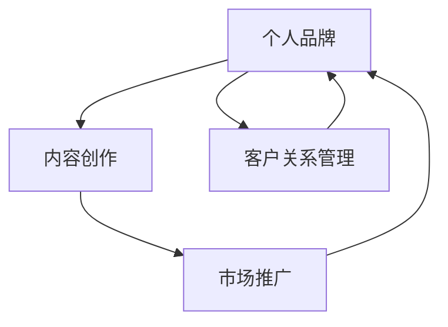

                 

# 知识付费创业中的个人品牌塑造

在知识付费领域，个人品牌塑造不仅是个体成功的重要基石，更是提升业务价值和市场竞争力的关键策略。本文将系统探讨知识付费创业者如何在激烈的市场竞争中塑造独特且强大的个人品牌，涵盖品牌定位、内容创作、市场推广、客户关系管理等方面，提供全面的方法和策略。

## 1. 背景介绍

### 1.1 知识付费的崛起
随着互联网的普及和人们知识需求的增长，知识付费市场迅速崛起。线上线下培训、专栏订阅、视频课程等形式的知识产品，满足了用户学习需求的同时，也提供了高效的收入渠道。特别是在疫情影响下，线上教育需求激增，知识付费成为新一轮的热潮。

### 1.2 个人品牌的重要性
在知识付费市场，个人品牌是创业者的核心竞争力。它不仅代表创业者个人的专业能力，更关乎用户对其课程和服务的信任和接受度。一个具有高知名度的个人品牌，能够显著提升课程订阅率和业务转化率，构建可持续发展的商业生态。

## 2. 核心概念与联系

### 2.1 核心概念概述

在知识付费创业中，以下几个核心概念是理解和塑造个人品牌的基石：

- **个人品牌 (Personal Branding)**：个人品牌是一个人在社会中展现出的独特个性和专业形象。在知识付费领域，它反映了创作者的独特价值主张和专业地位。
- **内容创作 (Content Creation)**：高质量的内容是个人品牌的关键支柱，包括课程设计、教学风格、互动形式等。内容不仅要有深度，还要具有吸引力，满足用户的学习需求。
- **市场推广 (Market Promotion)**：有效的市场推广策略可以提升品牌知名度和吸引力，包括社交媒体营销、SEO优化、合作广告等。
- **客户关系管理 (Customer Relationship Management)**：建立良好的客户关系，能够增强用户粘性和忠诚度，提升复购率和口碑传播。

这些概念相互关联，共同构成了知识付费创业者个人品牌塑造的整体框架。

### 2.2 核心概念原理和架构的 Mermaid 流程图



该图展示了个人品牌塑造的循环过程：内容创作是核心，通过市场推广吸引客户，客户关系管理提升用户满意度和忠诚度，从而形成良性循环，不断增强个人品牌影响力。

## 3. 核心算法原理 & 具体操作步骤

### 3.1 算法原理概述

知识付费创业者在塑造个人品牌的过程中，可以借鉴一些算法原理和步骤，以系统化地推进品牌建设：

1. **用户需求分析 (User Demand Analysis)**：通过市场调研和用户反馈，了解目标受众的学习需求和痛点，设计符合市场需求的内容。
2. **内容差异化 (Content Differentiation)**：在课程设计中融入独特视角、新颖内容，形成差异化的竞争优势。
3. **市场推广策略 (Market Promotion Strategies)**：使用SEO、社交媒体、合作伙伴推广等多种手段，最大化提升品牌曝光率和用户转化率。
4. **用户反馈循环 (User Feedback Loop)**：定期收集用户反馈，及时调整和优化内容与推广策略，保持品牌的持续改进。

### 3.2 算法步骤详解

1. **市场调研与用户画像建立**
   - 使用问卷调查、访谈等方法，收集目标受众的学习偏好、知识需求等。
   - 建立详细的用户画像，包括年龄、职业、兴趣等关键信息，为内容设计提供依据。

2. **内容设计与差异化**
   - 根据用户画像设计课程主题和结构，确保内容符合用户需求。
   - 引入独特的教学方法和互动形式，如直播互动、案例分析等，提升课程吸引力。

3. **市场推广策略制定**
   - 在各大平台进行SEO优化，提升课程在搜索引擎中的排名。
   - 利用社交媒体平台，如微信、微博、知乎等，发布高质量的内容和互动活动。
   - 与知名博主、专家学者合作，通过内容共创和联合推广，提升品牌曝光度。

4. **用户关系管理与反馈收集**
   - 建立社群平台，与用户保持高频互动，提供个性化服务。
   - 定期进行课程满意度调查，收集用户反馈，及时调整课程内容和服务策略。

### 3.3 算法优缺点

**优点**：
- **系统化推进**：通过系统化的步骤和策略，能够全面提升品牌影响力，减少盲目性。
- **数据驱动**：基于市场调研和用户反馈的数据，能够更精准地满足用户需求，提升内容质量。
- **灵活性**：可以根据市场变化和用户反馈，灵活调整策略，保持品牌竞争力。

**缺点**：
- **资源投入**：市场调研、内容设计、推广活动等需要大量资源和时间投入，可能对创业初期资金有限者构成挑战。
- **数据复杂性**：用户需求多样，数据采集和分析复杂，需要一定的数据分析能力。
- **竞争激烈**：知识付费市场竞争激烈，需不断创新和优化，才能在市场中脱颖而出。

### 3.4 算法应用领域

知识付费个人品牌塑造的算法，不仅适用于线上课程和专栏的创业，还广泛应用于线下培训、企业内训等场景。无论哪种形式，核心在于提供高价值的内容，满足用户的学习需求，并通过系统化的推广和关系管理，提升品牌影响力和用户忠诚度。

## 4. 数学模型和公式 & 详细讲解 & 举例说明

### 4.1 数学模型构建

假设个人品牌价值为 $V$，内容质量为 $C$，市场推广效果为 $P$，客户满意度为 $S$。则个人品牌价值可以表示为：

$$
V = f(C, P, S)
$$

其中 $f$ 表示一个非线性映射函数，反映了内容、推广和客户满意度对品牌价值的综合影响。

### 4.2 公式推导过程

1. **内容质量 (C) 的建模**：
   - 内容深度 $D$：内容深度与用户需求的相关度。
   - 内容新颖性 $N$：内容的独特性和新颖性，吸引用户的程度。
   - 内容结构 $S$：内容组织的逻辑性和系统性，用户理解的难易度。

   内容质量可以通过以下公式建模：

   $$
   C = \alpha_1 D + \alpha_2 N + \alpha_3 S
   $$

2. **市场推广效果 (P) 的建模**：
   - 社交媒体曝光 $E$：在社交平台上的用户互动和分享次数。
   - 广告投放效果 $A$：付费广告的转化率和ROI。
   - 口碑传播效果 $R$：用户通过口碑推荐带来的新用户数量。

   市场推广效果可以通过以下公式建模：

   $$
   P = \beta_1 E + \beta_2 A + \beta_3 R
   $$

3. **客户满意度 (S) 的建模**：
   - 课程满意度 $T$：用户对课程内容的满意度。
   - 学习效果 $L$：用户通过课程学习后的知识掌握和应用效果。
   - 服务质量 $Q$：客户服务响应速度和质量。

   客户满意度可以通过以下公式建模：

   $$
   S = \gamma_1 T + \gamma_2 L + \gamma_3 Q
   $$

### 4.3 案例分析与讲解

假设某知识付费平台上线了一门数据分析课程。通过市场调研，发现目标受众主要是金融和IT行业的职场人士，他们对数据分析有较高的需求，但普遍缺乏系统化学习资源。

**内容设计与差异化**：
- 课程设计包括数据清洗、可视化、预测建模等多个模块，具有较强的系统性。
- 引入实战案例分析和项目驱动教学，提升课程的实操性和吸引力。

**市场推广策略**：
- 在LinkedIn、微博等平台发布高质量的文章和短视频，提升曝光率。
- 与知名金融IT博主合作，联合推广课程。

**用户关系管理与反馈收集**：
- 建立专属微信群，提供实时互动和答疑服务。
- 每季度进行课程满意度调查，根据用户反馈调整课程内容和服务。

## 5. 项目实践：代码实例和详细解释说明

### 5.1 开发环境搭建

1. **服务器选择**：根据课程规模选择高性能服务器，推荐使用AWS或阿里云等云服务。
2. **开发工具**：使用Python、JavaScript等语言，搭配Vue.js、React等前端框架，快速构建课程平台。
3. **内容管理系统 (CMS)**：选择WordPress、Joomla等CMS系统，方便内容更新和管理。

### 5.2 源代码详细实现

```python
# 示例代码：使用Python Flask框架构建知识付费平台

from flask import Flask, render_template, request
from flask_sqlalchemy import SQLAlchemy
from flask_login import LoginManager, login_user, logout_user, login_required
from flask_wtf import FlaskForm
from wtforms import StringField, SubmitField
from wtforms.validators import DataRequired

app = Flask(__name__)
app.config['SECRET_KEY'] = 'secret_key'
app.config['SQLALCHEMY_DATABASE_URI'] = 'sqlite:////tmp/test.db'
db = SQLAlchemy(app)
login_manager = LoginManager(app)
login_manager.login_view = 'login'

class User(db.Model):
    id = db.Column(db.Integer, primary_key=True)
    username = db.Column(db.String(80), unique=True, nullable=False)
    password_hash = db.Column(db.String(120), nullable=False)
    courses = db.relationship('Course', backref='user', lazy=True)

class Course(db.Model):
    id = db.Column(db.Integer, primary_key=True)
    title = db.Column(db.String(120), nullable=False)
    content = db.Column(db.Text, nullable=False)
    user_id = db.Column(db.Integer, db.ForeignKey('user.id'), nullable=False)

class LoginForm(FlaskForm):
    username = StringField('Username', validators=[DataRequired()])
    password = StringField('Password', validators=[DataRequired()])
    submit = SubmitField('Log In')

@app.route('/')
@login_required
def index():
    courses = Course.query.all()
    return render_template('index.html', courses=courses)

@app.route('/login', methods=['GET', 'POST'])
def login():
    form = LoginForm()
    if form.validate_on_submit():
        user = User.query.filter_by(username=form.username.data).first()
        if user and check_password_hash(user.password_hash, form.password.data):
            login_user(user)
            return redirect('/')
        else:
            flash('Invalid username or password')
    return render_template('login.html', title='Log In', form=form)

@app.route('/logout')
@login_required
def logout():
    logout_user()
    return redirect('/')

if __name__ == '__main__':
    app.run(debug=True)
```

**代码解读与分析**：
- 该示例代码使用Flask框架构建了一个简单的知识付费平台，包括用户登录、课程管理等功能。
- 用户模型和课程模型使用SQLAlchemy进行持久化存储，方便数据的查询和管理。
- 登录表单和验证逻辑通过WTForms实现，确保用户数据的安全性。

### 5.3 运行结果展示

- 通过Flask框架，可以快速搭建和部署课程平台，支持用户注册、登录和课程浏览等功能。
- 用户可以通过登录后的仪表盘查看已购买的课程，并发起互动和反馈。

## 6. 实际应用场景

### 6.1 在线教育平台

在线教育平台是知识付费创业的主要形式之一。知名平台如Coursera、Udemy等，通过高品质的课程内容、系统的市场推广和用户关系管理，构建了庞大的用户群体。创业者应从这些成功案例中借鉴经验，打造具有鲜明特色的课程内容，并通过多样化渠道提升品牌影响力。

### 6.2 企业内训

企业内训领域，知识付费也逐渐受到重视。大型企业通过内训课程提升员工专业能力，推动企业发展。创业者应关注企业的具体需求，提供定制化的解决方案，并通过高效的客户关系管理，增强企业用户的粘性和忠诚度。

### 6.3 个人品牌塑造

个人品牌塑造不仅限于知识付费，还可以应用于个人职业发展、自媒体推广等领域。通过系统的品牌建设，个人可以提升市场竞争力，建立独特的职业形象。

## 7. 工具和资源推荐

### 7.1 学习资源推荐

1. **《内容的力量》 (The Content Playbook)**：Netflix内容战略总监写的营销秘籍，涵盖内容创作、用户分析和市场推广策略。
2. **《定位》 (Positioning)**：Al Ries和Jack Trout的经典著作，阐述品牌定位和市场竞争的核心思想。
3. **《社交媒体营销圣经》 (Social Media Marketing Bible)**：作者Charlie Yankovich深入浅出地讲解了社交媒体营销的技巧和方法。

### 7.2 开发工具推荐

1. **Python Flask**：轻量级Web开发框架，易于上手，适合快速开发知识付费平台。
2. **MySQL**：功能强大的关系型数据库，适合存储课程信息、用户数据等。
3. **GitHub**：代码托管平台，方便版本控制和代码共享。

### 7.3 相关论文推荐

1. **《社交媒体内容分析与推广策略》 (Social Media Content Analysis and Promotion Strategies)**：探讨社交媒体上内容创作和推广的最佳实践。
2. **《用户体验设计原则》 (The Principles of User Experience Design)**：阐述如何设计符合用户需求的界面和交互形式。
3. **《客户关系管理与品牌忠诚度》 (Customer Relationship Management and Brand Loyalty)**：分析客户关系管理对品牌忠诚度的影响。

## 8. 总结：未来发展趋势与挑战

### 8.1 研究成果总结

知识付费创业中的个人品牌塑造是一个复杂而系统的过程，涉及内容创作、市场推广、用户关系管理等多个方面。本文基于系统化的算法和步骤，深入探讨了个人品牌建设的理论基础和实践方法，为创业者提供了全面的参考。

### 8.2 未来发展趋势

1. **个性化推荐**：通过大数据和算法优化，为用户推荐符合其兴趣和需求的内容，提升学习效果。
2. **人工智能辅助**：引入AI技术，如自然语言处理、机器学习等，提升内容生成的效率和质量。
3. **社交媒体融合**：利用社交媒体平台，进行内容共创和用户互动，增强品牌影响力和用户粘性。

### 8.3 面临的挑战

1. **内容同质化**：知识付费市场竞争激烈，内容同质化现象严重，如何差异化内容，满足用户个性化需求是一大挑战。
2. **用户粘性不足**：如何建立长期稳定的客户关系，提升用户粘性和复购率，需要更多的营销和运营策略。
3. **技术门槛高**：知识付费创业需要具备较强的技术能力和市场洞察力，对创业者的综合素质要求较高。

### 8.4 研究展望

未来的研究将更加注重用户行为分析和情感认知，通过数据驱动的方法，深入理解用户需求和情感变化，从而提升内容创作和市场推广的效果。同时，将探索更多前沿技术，如增强现实、虚拟现实等，丰富知识付费的形式和体验。

## 9. 附录：常见问题与解答

**Q1：如何选择合适的课程主题？**

A: 根据目标用户群体的需求和兴趣，选择具有高价值和广泛需求的课程主题。可以通过市场调研和用户反馈，了解受众的学习需求和痛点，设计符合市场需求的内容。

**Q2：如何提升课程的互动性和用户粘性？**

A: 设计多样化的互动形式，如在线讨论、实时答疑、社群互动等，提升用户的学习体验。同时，定期发布更新内容，保持课程的新鲜感和吸引力。

**Q3：如何在有限的时间内创作高质量的课程内容？**

A: 借鉴知识管理工具如Notion、Evernote等，进行内容大纲和知识点的系统化管理。利用协作工具如Slack、Zoom等，与团队成员高效协作，提升创作效率。

**Q4：如何进行市场推广策略的优化？**

A: 通过A/B测试，对比不同推广策略的效果，不断优化市场推广的方案。使用数据分析工具如Google Analytics、Tableau等，实时监测推广效果，及时调整策略。

---

作者：禅与计算机程序设计艺术 / Zen and the Art of Computer Programming

