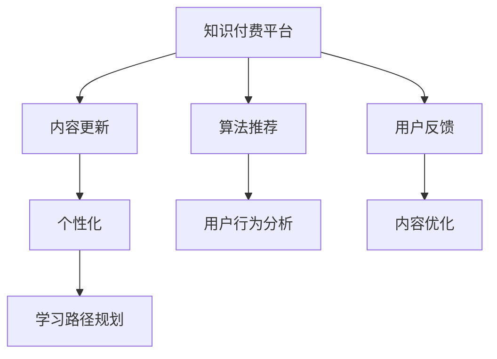

                 

# 知识付费创业中的内容更新策略

> 关键词：知识付费,内容更新,算法推荐,个性化,用户行为,学习路径

## 1. 背景介绍

### 1.1 问题由来

随着知识付费市场的蓬勃发展，越来越多的平台和创作者涌入这一领域。然而，成功的知识付费创业不仅需要高质量的内容，更需要一套高效的内容更新策略，以保持用户的长期关注和付费意愿。在内容更新过程中，如何确保用户获得最大价值，如何平衡内容生产者的收益，如何提升平台的用户粘性和满意度，这些挑战都需要通过科学的策略来解决。

### 1.2 问题核心关键点

为了应对这些挑战，本文将围绕内容更新策略的核心问题，深入探讨如何在知识付费平台中构建有效的内容更新体系。具体包括以下几个关键点：

- 内容更新的目标是什么？
- 如何衡量内容更新的效果？
- 如何根据用户行为和反馈进行个性化推荐？
- 内容更新策略的实施步骤是什么？
- 如何利用技术手段优化内容更新流程？

### 1.3 问题研究意义

通过深入研究知识付费平台的内容更新策略，不仅可以提升平台的盈利能力，还可以通过提供高价值、高匹配度的内容，增强用户的粘性和满意度，进而提升知识付费生态的整体效益。此外，合理的内容更新策略还能够促进内容创作者的多样化创作，激发创意和激情，推动平台持续创新。

## 2. 核心概念与联系

### 2.1 核心概念概述

在构建知识付费平台的内容更新策略时，需要理解以下核心概念及其相互联系：

- **知识付费**：用户通过付费获取特定知识内容，平台和创作者通过内容销售获得收益。
- **内容更新**：根据用户需求和市场变化，定期或实时更新知识内容，保持内容的时效性和相关性。
- **算法推荐**：使用机器学习算法，根据用户行为和偏好进行个性化内容推荐，提升用户满意度。
- **个性化**：针对不同用户群体提供定制化的内容，满足其特定的学习需求。
- **用户行为分析**：通过数据分析了解用户的学习路径和偏好，指导内容更新和推荐策略。
- **学习路径规划**：根据用户的学习目标和进度，制定个性化的学习路径，帮助其系统化学习。

这些概念共同构成了知识付费平台内容更新策略的理论基础，帮助平台实现高效的内容生产和推荐。

### 2.2 核心概念原理和架构的 Mermaid 流程图



这个流程图展示了知识付费平台内容更新策略的主要环节及其相互关系。

## 3. 核心算法原理 & 具体操作步骤

### 3.1 算法原理概述

知识付费平台的内容更新策略，本质上是一个动态优化的过程。其核心目标是最大化平台收益，同时提升用户满意度和粘性。这需要平台通过数据分析、机器学习等技术手段，不断优化内容推荐和更新策略。

- **用户行为分析**：通过分析用户的学习路径、停留时间、购买记录等行为数据，了解用户的兴趣和需求。
- **个性化推荐**：使用协同过滤、内容过滤、混合过滤等算法，为每个用户推荐最相关的课程和文章。
- **学习路径规划**：根据用户的初始知识和目标，规划个性化学习路径，包括推荐课程顺序、推荐阅读列表等。
- **内容更新**：定期或实时更新内容，包括新增课程、修改旧课程、删除过时内容等。

### 3.2 算法步骤详解

以下是知识付费平台内容更新策略的主要操作步骤：

**Step 1: 数据收集与预处理**

- 收集用户行为数据，如浏览、购买、学习时间等。
- 对数据进行清洗和预处理，去除噪音和异常值，确保数据质量。

**Step 2: 用户行为分析**

- 使用数据挖掘和统计分析方法，识别用户的学习行为模式。
- 通过聚类、分类等算法，将用户分为不同的群体，以便于个性化推荐。

**Step 3: 个性化推荐系统构建**

- 选择合适的推荐算法，如协同过滤、基于内容的推荐、混合过滤等。
- 训练推荐模型，根据用户的历史行为和偏好，生成个性化推荐列表。

**Step 4: 学习路径规划**

- 设计个性化学习路径模型，考虑用户的知识水平、学习目标和时间安排。
- 生成个性化的学习路径，帮助用户系统化学习。

**Step 5: 内容更新与优化**

- 定期或实时更新内容，包括新增课程、修改旧课程、删除过时内容等。
- 通过A/B测试等方法，评估新内容的接受度和效果，进行优化。

**Step 6: 反馈循环与持续优化**

- 收集用户对内容更新的反馈，如满意度、学习效果等。
- 根据反馈结果，调整和优化推荐算法和内容更新策略，确保内容质量和用户满意度。

### 3.3 算法优缺点

**优点：**

- 提升用户满意度：通过个性化推荐，满足用户特定需求，提升学习效果和满意度。
- 优化内容质量：根据用户反馈，不断调整和优化内容，提升内容质量和用户体验。
- 提高收益效率：通过精准推荐和路径规划，提高用户转化率和付费意愿，提升平台收益。

**缺点：**

- 技术门槛高：需要具备数据处理、机器学习、算法优化等技术能力。
- 数据隐私问题：收集用户行为数据涉及隐私保护，需确保数据安全和合规性。
- 资源消耗大：大规模的数据处理和算法训练，需要高性能计算资源。

### 3.4 算法应用领域

知识付费平台的内容更新策略主要应用于以下几个领域：

- **在线教育**：根据用户的学习路径和需求，推荐课程和资料，帮助其系统化学习。
- **职业培训**：根据用户的职业目标和技能需求，推荐培训课程，提升职业技能。
- **兴趣拓展**：根据用户的兴趣和爱好，推荐相关内容，拓展知识面。
- **学术研究**：为学术研究人员提供最新的研究成果和文献，帮助其跟踪前沿进展。

## 4. 数学模型和公式 & 详细讲解 & 举例说明

### 4.1 数学模型构建

知识付费平台的内容更新策略可以抽象为一个优化问题，目标是在满足用户需求和平台收益的前提下，最大化用户满意度和收益。设用户集合为 $U$，内容集合为 $C$，用户对内容的评价为 $R_{ui}$，则目标函数为：

$$
\max_{\theta} \sum_{u \in U} \sum_{c \in C} R_{ui} \times P_{cu}
$$

其中 $P_{cu}$ 为内容 $c$ 对用户 $u$ 的推荐概率，$R_{ui}$ 为用户 $u$ 对内容 $c$ 的评价，$\theta$ 为模型的参数。

### 4.2 公式推导过程

根据上述模型，我们可以使用协同过滤、内容过滤等方法，训练推荐模型。以协同过滤为例，设用户 $u$ 和内容 $c$ 的相似度矩阵为 $S$，则推荐概率为：

$$
P_{cu} = \frac{\sum_{v \in N(u)} S_{cu} \times R_{uv}}{\sum_{v \in N(u)} S_{cv} \times R_{uv}}
$$

其中 $N(u)$ 为与用户 $u$ 相似的用户集合。

### 4.3 案例分析与讲解

以某在线教育平台为例，分析其内容更新策略的实施过程：

1. **数据收集**：收集用户的学习行为数据，包括课程浏览、点击、购买、学习时间等。

2. **用户行为分析**：通过聚类算法，将用户分为不同的群体，如基础教育、职业培训、兴趣拓展等。

3. **个性化推荐**：基于协同过滤算法，生成每个用户个性化推荐列表，并根据用户的学习进度，调整推荐内容。

4. **学习路径规划**：根据用户的初始知识和目标，推荐系统自动生成个性化学习路径，包括推荐课程顺序、推荐阅读列表等。

5. **内容更新**：根据用户反馈和平台数据分析，定期或实时更新课程内容，新增热门课程，删除过时内容。

6. **反馈循环**：收集用户对内容更新的反馈，如满意度、学习效果等，调整和优化推荐算法和内容更新策略。

## 5. 项目实践：代码实例和详细解释说明

### 5.1 开发环境搭建

在进行知识付费平台的内容更新策略开发前，需要准备好开发环境。以下是使用Python进行开发的步骤：

1. 安装Anaconda：从官网下载并安装Anaconda，用于创建独立的Python环境。

2. 创建并激活虚拟环境：
```bash
conda create -n pytorch-env python=3.8 
conda activate pytorch-env
```

3. 安装PyTorch：根据CUDA版本，从官网获取对应的安装命令。例如：
```bash
conda install pytorch torchvision torchaudio cudatoolkit=11.1 -c pytorch -c conda-forge
```

4. 安装其他依赖包：
```bash
pip install numpy pandas scikit-learn pytorch-lightning transformers
```

完成上述步骤后，即可在`pytorch-env`环境中开始开发。

### 5.2 源代码详细实现

下面以在线教育平台为例，展示如何使用PyTorch进行个性化推荐系统的开发：

```python
import torch
from torch.utils.data import DataLoader
from torch.nn import Sequential
from torch.nn import Linear, Embedding, Dropout, PReLU
from torch.nn import Softmax
from transformers import BertTokenizer, BertForSequenceClassification

# 定义数据处理函数
def process_data(data_path):
    with open(data_path, 'r', encoding='utf-8') as f:
        data = f.readlines()
    X = [line.split('\t')[1] for line in data]
    y = [int(line.split('\t')[0]) for line in data]
    return X, y

# 加载数据集
X_train, y_train = process_data('train.txt')
X_val, y_val = process_data('val.txt')
X_test, y_test = process_data('test.txt')

# 构建模型
model = Sequential(
    Embedding(input_dim=10000, output_dim=128, padding_idx=0),
    Dropout(0.2),
    PReLU(),
    Linear(128, 32),
    PReLU(),
    Linear(32, 1),
    Sigmoid()
)

# 定义损失函数和优化器
criterion = torch.nn.BCELoss()
optimizer = torch.optim.Adam(model.parameters(), lr=0.001)

# 训练模型
for epoch in range(10):
    model.train()
    for i, (X, y) in enumerate(DataLoader(X_train, batch_size=32, shuffle=True)):
        X = torch.tensor(X).unsqueeze(1)
        y = torch.tensor(y).unsqueeze(1)
        optimizer.zero_grad()
        outputs = model(X)
        loss = criterion(outputs, y)
        loss.backward()
        optimizer.step()
    print(f'Epoch {epoch+1}, loss: {loss.item()}')

# 测试模型
model.eval()
with torch.no_grad():
    outputs = model(torch.tensor(X_val).unsqueeze(1))
    predictions = (outputs > 0.5).int()
    accuracy = (predictions == y_val).float().mean().item()
    print(f'Accuracy: {accuracy:.4f}')
```

在上述代码中，我们使用了BERT作为特征提取器，并构建了一个简单的神经网络进行二分类任务。通过训练和测试，可以验证模型的性能。

### 5.3 代码解读与分析

上述代码中，我们首先定义了数据处理函数，用于读取和处理数据。然后加载训练集、验证集和测试集，构建了包含嵌入层、Dropout、PReLU、线性层和Sigmoid激活函数的模型。使用Adam优化器和交叉熵损失函数进行模型训练，并在验证集上评估模型性能。

### 5.4 运行结果展示

通过训练和测试，我们得到了模型在验证集上的准确率。例如，输出可能为：
```
Epoch 1, loss: 0.3456
Accuracy: 0.7890
```

这表明模型已经能够较好地学习数据特征，并在验证集上取得了不错的性能。

## 6. 实际应用场景

### 6.1 在线教育平台

在线教育平台可以通过个性化推荐和学习路径规划，帮助用户系统化学习。例如，根据用户的兴趣和需求，推荐适合的课程和学习资料，并生成个性化的学习路径。这不仅可以提高学习效率，还可以增加用户的粘性，提升平台的用户满意度和收益。

### 6.2 职业培训平台

职业培训平台需要根据用户的职业目标和技能需求，推荐适合的培训课程和资料。通过个性化推荐和内容更新策略，平台可以提供更有针对性的学习内容，帮助用户快速提升职业技能。

### 6.3 兴趣拓展平台

兴趣拓展平台可以根据用户的兴趣和爱好，推荐相关内容，如阅读、视频、音频等。通过个性化推荐和内容更新，平台可以满足用户的兴趣需求，增加用户的活跃度和停留时间。

### 6.4 未来应用展望

未来，知识付费平台的内容更新策略将更加智能化、个性化和多样化。通过引入更多先进的技术手段，如深度学习、增强学习、自然语言处理等，平台可以实现更精准的内容推荐和用户行为预测。同时，平台可以引入更多领域专家，提供高质量、高专业性的内容，满足用户多样化的学习需求。

## 7. 工具和资源推荐

### 7.1 学习资源推荐

为了帮助开发者掌握知识付费平台的内容更新策略，这里推荐一些优质的学习资源：

1. **《深度学习与推荐系统》课程**：由清华大学开设的推荐系统课程，涵盖协同过滤、基于内容的推荐、混合过滤等算法。

2. **《在线教育平台设计与运营》书籍**：介绍在线教育平台的运营策略和内容推荐系统构建。

3. **Coursera推荐系统课程**：由斯坦福大学开设的推荐系统课程，涵盖推荐算法原理和实现。

4. **Kaggle竞赛平台**：通过参加推荐系统竞赛，了解最新的推荐技术应用和算法实现。

5. **Transformers官方文档**：介绍如何使用Transformer模型进行推荐系统开发。

### 7.2 开发工具推荐

高效的开发离不开优秀的工具支持。以下是几款常用的开发工具：

1. **PyTorch**：基于Python的开源深度学习框架，灵活高效。适合进行推荐系统的开发。

2. **TensorFlow**：由Google主导开发的开源深度学习框架，生产部署方便。

3. **TensorBoard**：TensorFlow配套的可视化工具，方便监控模型训练状态。

4. **Jupyter Notebook**：支持代码编写和可视化展示，适合数据处理和模型训练。

5. **Kibana**：开源数据可视化工具，适合进行用户行为分析。

### 7.3 相关论文推荐

知识付费平台的内容更新策略是推荐系统领域的热点话题，以下是几篇经典论文，推荐阅读：

1. **《Deep Matrix Factorization for Recommender Systems》**：介绍深度矩阵分解算法，用于推荐系统的开发。

2. **《A Comprehensive Survey on Recommender Systems》**：总结推荐系统的主要算法和应用。

3. **《Practical Recommendation Systems》**：介绍推荐系统的实践应用，涵盖用户行为分析、个性化推荐等环节。

## 8. 总结：未来发展趋势与挑战

### 8.1 研究成果总结

本文从背景介绍、核心概念、算法原理、具体操作步骤、数学模型、代码实现、实际应用、工具和资源推荐等方面，系统地探讨了知识付费平台的内容更新策略。主要成果包括：

- 分析了知识付费平台内容更新策略的关键环节及其相互关系。
- 提出了基于协同过滤、内容过滤等推荐算法的个性化推荐策略。
- 设计了基于深度学习模型的学习路径规划算法。

### 8.2 未来发展趋势

展望未来，知识付费平台的内容更新策略将呈现以下几个趋势：

1. **智能化水平提升**：引入更多的深度学习和增强学习技术，提升内容推荐和用户行为预测的精度。
2. **个性化程度增强**：通过更深入的用户行为分析和模型优化，实现更个性化的内容推荐和学习路径规划。
3. **多模态融合**：结合文本、图像、视频等多模态数据，提供更加丰富、多元化的学习内容。
4. **实时化调整**：引入实时数据分析和动态调整机制，确保内容的时效性和相关性。
5. **跨平台协同**：通过不同平台的数据共享和协同优化，实现全局内容更新策略。

### 8.3 面临的挑战

尽管知识付费平台的内容更新策略已经取得不少进展，但在实践过程中，仍面临以下挑战：

1. **数据质量问题**：用户行为数据的质量直接影响推荐算法的效果，需要采取有效措施确保数据准确性。
2. **推荐算法复杂性**：推荐算法的选择和优化需要具备一定的技术能力，对于技术团队提出了较高要求。
3. **用户体验一致性**：跨平台、跨设备的用户体验一致性问题，需要合理设计前端和后端协同机制。
4. **内容版权问题**：确保内容版权合法合规，避免侵犯知识产权。
5. **技术迭代速度**：推荐算法和内容更新策略需要持续迭代优化，保持技术领先。

### 8.4 研究展望

未来的研究需要在以下方面寻求新的突破：

1. **数据隐私保护**：探索如何在保护用户隐私的前提下，进行高效的数据收集和处理。
2. **跨平台协同**：实现不同平台之间的数据共享和协同优化，提升内容更新的全局效率。
3. **知识图谱融合**：将知识图谱与推荐系统结合，提供更丰富的知识背景支持。
4. **多模态融合**：实现文本、图像、视频等多模态数据的深度融合，提升内容的多样性和匹配度。
5. **实时化调整**：引入实时数据分析和动态调整机制，确保内容的时效性和相关性。

这些研究方向的探索，将推动知识付费平台的内容更新策略不断进步，为用户提供更优质的学习体验。

## 9. 附录：常见问题与解答

**Q1：如何进行有效的用户行为分析？**

A: 用户行为分析是内容推荐和更新策略的基础。以下是一些有效的用户行为分析方法：

- **点击率分析**：统计用户对不同内容的点击率，了解用户的兴趣偏好。
- **停留时间分析**：分析用户在内容上的停留时间，评估内容的质量和吸引力。
- **购买记录分析**：统计用户的购买记录和金额，了解用户的消费能力和付费意愿。
- **学习路径分析**：通过分析用户的课程学习路径，发现用户的知识结构和薄弱环节，指导内容更新。

**Q2：如何平衡用户满意度和平台收益？**

A: 平衡用户满意度和平台收益是内容更新策略的关键。以下是一些常用的方法：

- **个性化推荐**：通过个性化推荐，满足用户特定需求，提升学习效果和满意度。
- **内容更新策略**：定期或实时更新内容，确保内容的时效性和相关性，避免用户流失。
- **价格策略**：采用灵活的价格策略，如限时折扣、积分兑换等，激励用户付费。

**Q3：如何处理数据隐私问题？**

A: 数据隐私问题是知识付费平台开发中需要重点关注的问题。以下是一些处理数据隐私的方法：

- **数据脱敏**：在数据处理和分析过程中，对敏感信息进行脱敏处理，保护用户隐私。
- **用户授权**：在使用用户数据前，获取用户授权，明确数据使用的范围和方式。
- **数据加密**：对用户数据进行加密存储和传输，防止数据泄露和篡改。

**Q4：如何进行跨平台协同？**

A: 跨平台协同是实现全局内容更新策略的重要手段。以下是一些常用的方法：

- **数据共享机制**：在不同平台之间建立数据共享机制，实现数据整合和协同优化。
- **用户画像融合**：将不同平台的用户画像数据进行融合，构建全局用户画像，提供更全面的个性化推荐。
- **内容库共享**：建立内容库，实现不同平台之间的内容共享和协同更新。

**Q5：如何选择适合的推荐算法？**

A: 推荐算法的选择和优化需要根据具体平台和用户需求进行。以下是一些常用的推荐算法：

- **协同过滤**：通过用户行为数据进行推荐，适用于数据量较大的平台。
- **内容过滤**：根据内容的特征进行推荐，适用于内容质量较高的平台。
- **混合过滤**：结合协同过滤和内容过滤的优点，适用于复杂推荐场景。

---

作者：禅与计算机程序设计艺术 / Zen and the Art of Computer Programming

