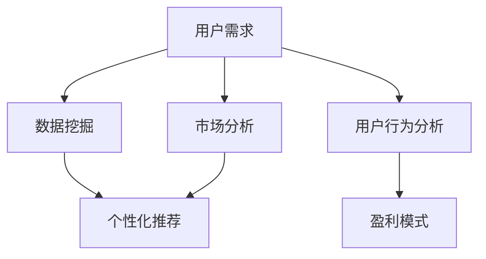
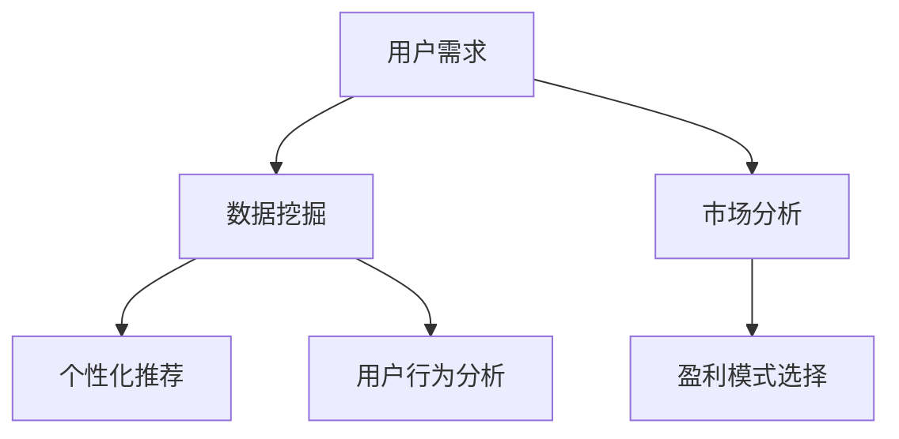

                 

# 知识付费创业中的用户需求挖掘技巧

> 关键词：知识付费,用户需求,数据挖掘,市场分析,个性化推荐,用户行为,盈利模式

## 1. 背景介绍

### 1.1 问题由来

随着互联网的普及和信息技术的迅猛发展，知识付费市场逐渐兴起并迅速扩大。知识付费成为用户获取高质量内容的重要途径，尤其在教育、职场、健康、投资等领域受到广泛欢迎。然而，尽管市场上涌现了众多知识付费平台，用户需求依然复杂且分散，传统的数据分析手段往往难以全面精准地捕捉用户痛点，导致内容和服务难以满足用户需求，甚至导致用户流失。

为了解决这一问题，本文将从用户需求挖掘的角度，深入探讨如何通过数据分析和算法技术，精确捕捉用户需求，提供更加个性化和精准的内容与服务，从而在知识付费市场中占据有利地位，实现企业盈利和用户价值双赢。

### 1.2 问题核心关键点

为了更好地理解和解决知识付费中的用户需求挖掘问题，本节将介绍几个关键概念和问题核心关键点：

- 用户需求：指用户在使用知识付费产品时，期望获取的知识和信息。用户需求是制定产品战略和内容策略的基础。
- 数据挖掘：指从海量用户数据中提取有用信息的过程。数据挖掘技术可以帮助企业精准捕捉用户需求，提供个性化推荐。
- 市场分析：指对知识付费市场的整体特征和用户行为进行分析。市场分析可以为企业提供有价值的洞察，指导产品策略制定。
- 个性化推荐：指根据用户行为和偏好，推荐最适合用户的内容。个性化推荐技术可以有效提升用户体验和粘性。
- 用户行为分析：指对用户在平台上的行为模式进行分析，包括阅读、购买、评价、分享等。用户行为分析可以为企业提供数据驱动的决策支持。
- 盈利模式：指知识付费平台的主要收入来源，如订阅、单次购买、会员服务等。盈利模式的选择对企业发展至关重要。

这些核心概念之间的逻辑关系可以通过以下Mermaid流程图来展示：



这个流程图展示了用户需求挖掘的主要环节及其之间的联系：

1. 用户需求是数据挖掘和市场分析的基础，指导着个性化推荐和盈利模式的选择。
2. 数据挖掘通过对海量用户数据的分析，可以精准捕捉用户需求，提供个性化推荐。
3. 市场分析对用户行为和盈利模式的分析，可以为企业提供战略性指导，制定合适的产品策略。
4. 个性化推荐通过用户行为分析，提供契合用户需求的内容，提升用户满意度。
5. 盈利模式的选择基于市场分析和用户需求挖掘的结果，是企业长期发展的基础。

理解这些关键概念及其之间的逻辑关系，是进行用户需求挖掘和知识付费创业成功的重要前提。

## 2. 核心概念与联系

### 2.1 核心概念概述

为了更好地理解用户需求挖掘的原理和流程，本节将对几个核心概念进行详细讲解。

- **用户需求分析**：指对用户在使用知识付费产品时的需求进行分析，包括信息获取、知识应用、兴趣爱好等。通过用户需求分析，可以更好地理解用户痛点，制定合适的产品策略。
- **数据挖掘技术**：指利用机器学习、数据挖掘等技术，从大量用户数据中提取有用信息。数据挖掘技术可以揭示用户行为模式，提供个性化推荐。
- **市场分析方法**：指通过分析用户行为和市场数据，理解知识付费市场的整体特征和用户行为特征。市场分析可以指导企业制定合适的市场策略和产品策略。
- **个性化推荐算法**：指根据用户行为和偏好，推荐最合适的知识内容。个性化推荐技术可以提升用户满意度和粘性，增加用户留存。
- **用户行为分析工具**：指用于收集和分析用户行为数据的工具，如日志分析、行为跟踪等。用户行为分析工具可以提供精确的用户行为洞察，指导产品优化。
- **盈利模式选择**：指根据市场需求和用户行为，选择合适的知识付费平台盈利模式。盈利模式选择直接影响企业的收入和增长。

这些概念的逻辑关系和应用场景如下：

用户需求分析是数据挖掘和市场分析的基础，指导个性化推荐和盈利模式选择。数据挖掘通过挖掘用户行为数据，提供精准的个性化推荐。市场分析揭示知识付费市场的特征和用户行为，指导产品和市场策略制定。个性化推荐提升用户满意度和粘性，增加用户留存和重复消费。用户行为分析工具提供行为洞察，指导产品优化和用户体验提升。盈利模式选择基于市场需求和用户行为，是企业长期发展的核心。

### 2.2 核心概念原理和架构的 Mermaid 流程图



这个流程图展示了用户需求挖掘的关键环节及其之间的联系：

1. 用户需求是数据挖掘和市场分析的基础，指导个性化推荐和盈利模式选择。
2. 数据挖掘通过对海量用户行为数据的分析，提供精准的个性化推荐。
3. 市场分析揭示知识付费市场的特征和用户行为，指导产品和市场策略制定。
4. 个性化推荐提升用户满意度和粘性，增加用户留存和重复消费。
5. 用户行为分析工具提供行为洞察，指导产品优化和用户体验提升。
6. 盈利模式选择基于市场需求和用户行为，是企业长期发展的核心。

通过理解这些核心概念及其之间的联系，可以系统地进行用户需求挖掘，从而在知识付费创业中获得成功。

## 3. 核心算法原理 & 具体操作步骤

### 3.1 算法原理概述

用户需求挖掘是知识付费创业中至关重要的一环，通过系统化的数据挖掘和算法技术，可以精准捕捉用户需求，提供个性化推荐，提升用户体验和粘性。以下是对核心算法原理的详细讲解。

#### 3.1.1 数据挖掘技术

数据挖掘是用户需求挖掘的重要工具。常见的数据挖掘技术包括：

- **分类与聚类**：通过分类算法将用户数据分为不同类别，聚类算法将相似用户分组。常用的分类算法包括决策树、随机森林、逻辑回归等，聚类算法包括K-means、层次聚类等。
- **关联规则挖掘**：通过分析用户行为数据，发现不同行为之间的关联规则。常用的关联规则挖掘算法包括Apriori、FP-growth等。
- **异常检测**：通过挖掘用户行为数据中的异常点，发现潜在的用户需求。常用的异常检测算法包括孤立森林、LOF等。

#### 3.1.2 个性化推荐算法

个性化推荐是知识付费创业中重要的应用场景，通过推荐最适合用户的内容，提升用户满意度和粘性。常用的个性化推荐算法包括：

- **协同过滤**：通过分析用户行为数据，发现相似用户之间的关联，推荐相似用户喜欢的内容。常用的协同过滤算法包括基于用户的协同过滤、基于物品的协同过滤等。
- **基于内容的推荐**：通过分析用户行为数据，发现用户喜欢的内容的特征，推荐相似特征的内容。常用的基于内容的推荐算法包括基于内容的协同过滤、内容标签推荐等。
- **混合推荐**：将多种推荐算法组合，提升推荐效果。常用的混合推荐算法包括基于模型的混合推荐、混合协同过滤等。

### 3.2 算法步骤详解

以下是对用户需求挖掘和个性化推荐的核心步骤的详细介绍。

#### 3.2.1 数据准备与预处理

用户需求挖掘和个性化推荐的首要步骤是数据准备和预处理。这一步骤包括：

1. **数据收集**：通过日志、行为跟踪等方式，收集用户行为数据。数据源包括用户点击、阅读、购买、评价等行为数据。
2. **数据清洗**：对收集到的数据进行清洗，去除噪声、异常值和重复数据，确保数据质量。
3. **特征提取**：对清洗后的数据进行特征提取，生成可用于模型训练的特征向量。特征提取方法包括文本挖掘、时间序列分析、异常检测等。

#### 3.2.2 用户需求分析

用户需求分析是数据挖掘和个性化推荐的基础。这一步骤包括：

1. **用户画像构建**：通过分析用户行为数据，构建用户画像，包括用户基本信息、兴趣爱好、行为特征等。
2. **需求分类**：将用户需求分类，包括信息获取、知识应用、兴趣爱好等。分类方法包括基于规则的分类、基于模型的分类等。
3. **需求聚类**：将相似需求的用户分组，识别出需求共性。聚类方法包括K-means、层次聚类等。

#### 3.2.3 市场分析

市场分析是制定知识付费产品和策略的基础。这一步骤包括：

1. **市场特征分析**：通过分析市场数据，理解知识付费市场的整体特征，包括用户规模、用户分布、市场竞争等。
2. **用户行为分析**：通过分析用户行为数据，理解用户行为特征，包括购买行为、阅读行为、互动行为等。
3. **需求变化分析**：通过分析用户需求的变化趋势，理解市场需求的变化，制定合适的产品策略。

#### 3.2.4 个性化推荐

个性化推荐是提升用户满意度和粘性的关键。这一步骤包括：

1. **推荐模型选择**：根据用户需求和市场特点，选择合适的推荐模型。常用的推荐模型包括协同过滤、基于内容的推荐、混合推荐等。
2. **模型训练与优化**：使用用户行为数据训练推荐模型，优化模型参数，提升推荐效果。
3. **推荐结果生成**：根据训练好的推荐模型，生成个性化的推荐结果，推荐最适合用户的内容。

### 3.3 算法优缺点

#### 3.3.1 数据挖掘技术的优缺点

**优点**：

1. 能够从海量用户数据中挖掘出有用信息，提供精准的用户画像和需求分析。
2. 能够发现用户行为模式和关联规则，提供个性化推荐。
3. 能够识别出用户异常行为，发现潜在的用户需求。

**缺点**：

1. 数据清洗和特征提取工作量大，需要专业数据科学团队支持。
2. 需要处理大规模数据，计算资源消耗大。
3. 对数据质量和数据完整性要求高，数据缺失或不准确会影响结果。

#### 3.3.2 个性化推荐算法的优缺点

**优点**：

1. 能够提供精准的个性化推荐，提升用户满意度和粘性。
2. 能够根据用户行为和需求，推荐最适合的内容，增加用户留存和重复消费。
3. 能够结合多种算法，提升推荐效果。

**缺点**：

1. 需要处理大规模用户行为数据，计算资源消耗大。
2. 需要实时更新推荐模型，计算资源消耗大。
3. 对数据质量和数据完整性要求高，数据缺失或不准确会影响结果。

### 3.4 算法应用领域

用户需求挖掘和个性化推荐技术在多个领域具有广泛应用。以下是对几个典型应用领域的详细介绍。

#### 3.4.1 在线教育

在线教育平台通过分析用户行为数据，理解用户的学习需求和学习特点，提供个性化的学习推荐。常用的个性化推荐算法包括协同过滤、基于内容的推荐等。通过个性化推荐，提升用户学习效果和满意度，增加用户留存和重复消费。

#### 3.4.2 健康管理

健康管理平台通过分析用户健康数据，理解用户的健康需求和健康行为，提供个性化的健康建议。常用的个性化推荐算法包括协同过滤、基于内容的推荐等。通过个性化推荐，提升用户健康管理效果和满意度，增加用户粘性和重复消费。

#### 3.4.3 职场培训

职场培训平台通过分析用户学习行为数据，理解用户的职业发展需求和职业特点，提供个性化的培训推荐。常用的个性化推荐算法包括协同过滤、基于内容的推荐等。通过个性化推荐，提升用户职业发展效果和满意度，增加用户留存和重复消费。

#### 3.4.4 财经资讯

财经资讯平台通过分析用户阅读行为数据，理解用户的财经需求和财经兴趣，提供个性化的财经资讯推荐。常用的个性化推荐算法包括协同过滤、基于内容的推荐等。通过个性化推荐，提升用户财经资讯阅读效果和满意度，增加用户粘性和重复消费。

## 4. 数学模型和公式 & 详细讲解 & 举例说明

### 4.1 数学模型构建

以下是对用户需求挖掘和个性化推荐的主要数学模型的详细介绍。

#### 4.1.1 用户需求分析模型

用户需求分析模型通过分析用户行为数据，构建用户画像和需求分类。常用的数学模型包括：

1. **用户画像模型**：通过聚类算法，将用户分为不同类型，构建用户画像。常用的聚类算法包括K-means、层次聚类等。
2. **需求分类模型**：通过分类算法，将用户需求分为不同类别，如信息获取、知识应用、兴趣爱好等。常用的分类算法包括决策树、随机森林、逻辑回归等。

#### 4.1.2 个性化推荐模型

个性化推荐模型通过分析用户行为数据，提供精准的个性化推荐。常用的数学模型包括：

1. **协同过滤模型**：通过协同过滤算法，推荐相似用户喜欢的内容。常用的协同过滤算法包括基于用户的协同过滤、基于物品的协同过滤等。
2. **基于内容的推荐模型**：通过分析用户行为数据，发现用户喜欢的内容的特征，推荐相似特征的内容。常用的基于内容的推荐算法包括基于内容的协同过滤、内容标签推荐等。
3. **混合推荐模型**：将多种推荐算法组合，提升推荐效果。常用的混合推荐算法包括基于模型的混合推荐、混合协同过滤等。

### 4.2 公式推导过程

以下是对用户需求分析模型和个性化推荐模型的公式推导过程的详细介绍。

#### 4.2.1 用户画像模型

用户画像模型通过聚类算法，将用户分为不同类型，构建用户画像。常用的聚类算法包括K-means、层次聚类等。

假设用户行为数据为 $X=\{(x_1, x_2, \ldots, x_n)\}$，其中 $x_i$ 为第 $i$ 个用户的行为数据。常用的K-means聚类算法的公式如下：

$$
K-means: \min_{C} \sum_{i=1}^n \min_{k=1}^K \| x_i - \mu_k \|^2
$$

其中 $C$ 为聚类中心，$K$ 为聚类数目，$\mu_k$ 为第 $k$ 个聚类的中心点。

#### 4.2.2 协同过滤模型

协同过滤模型通过分析用户行为数据，推荐相似用户喜欢的内容。常用的协同过滤算法包括基于用户的协同过滤、基于物品的协同过滤等。

假设用户行为数据为 $X=\{(x_1, x_2, \ldots, x_n)\}$，其中 $x_i$ 为第 $i$ 个用户的行为数据。常用的基于用户的协同过滤算法的公式如下：

$$
UserCF: r_{ui} = \frac{\sum_{v \in \mathcal{N}(u)} \alpha_{uv} \cdot r_{vi}}{\sqrt{\sum_{v \in \mathcal{N}(u)} \alpha_{uv}^2 + \epsilon} \cdot \sqrt{\sum_{v \in \mathcal{N}(i)} \alpha_{iv}^2 + \epsilon}
$$

其中 $r_{ui}$ 为用户 $u$ 对物品 $i$ 的评分，$\alpha_{uv}$ 为物品 $v$ 对用户 $u$ 的影响权重，$\mathcal{N}(u)$ 为与用户 $u$ 相似的其他用户集合，$\epsilon$ 为平滑因子。

### 4.3 案例分析与讲解

以下是对用户画像模型和协同过滤模型的案例分析与讲解。

#### 4.3.1 用户画像模型案例

某在线教育平台通过K-means聚类算法，将用户分为三类：初级学习者、中级学习者和高级学习者。具体的步骤如下：

1. 收集用户学习行为数据，如课程选择、学习时间、测试成绩等。
2. 使用K-means算法，将用户数据分为三类，每类用户的行为特征如下图所示。


通过用户画像模型，平台可以更好地理解用户的学习需求和学习特点，提供个性化的学习推荐，提升用户学习效果和满意度。

#### 4.3.2 协同过滤模型案例

某在线教育平台通过基于用户的协同过滤算法，推荐相似用户喜欢的课程。具体的步骤如下：

1. 收集用户学习行为数据，如课程选择、学习时间、测试成绩等。
2. 使用基于用户的协同过滤算法，计算用户 $u$ 对物品 $i$ 的评分。例如，用户A对课程B、C、D的评分分别为4、3、5，用户B对课程B、D、E的评分分别为5、3、4，用户C对课程C、D、E的评分分别为4、5、3。
3. 计算用户A与用户B、用户C的相似度，分别为0.6、0.8。
4. 根据相似度，推荐用户B、用户C喜欢的课程，即课程D和课程E。


通过协同过滤模型，平台可以提供精准的个性化推荐，提升用户学习效果和满意度，增加用户留存和重复消费。

## 5. 项目实践：代码实例和详细解释说明

### 5.1 开发环境搭建

在进行用户需求挖掘和个性化推荐实践前，我们需要准备好开发环境。以下是使用Python进行Scikit-learn开发的环境配置流程：

1. 安装Anaconda：从官网下载并安装Anaconda，用于创建独立的Python环境。
2. 创建并激活虚拟环境：
```bash
conda create -n user_demand_env python=3.8 
conda activate user_demand_env
```

3. 安装Scikit-learn：
```bash
conda install scikit-learn
```

4. 安装NumPy：
```bash
pip install numpy
```

5. 安装Pandas：
```bash
pip install pandas
```

6. 安装Matplotlib：
```bash
pip install matplotlib
```

完成上述步骤后，即可在`user_demand_env`环境中开始项目实践。

### 5.2 源代码详细实现

下面我们以用户画像和个性化推荐为例，给出使用Scikit-learn进行用户需求挖掘的Python代码实现。

```python
from sklearn.cluster import KMeans
from sklearn.preprocessing import StandardScaler
import numpy as np
import pandas as pd
import matplotlib.pyplot as plt

# 用户行为数据
user_data = pd.read_csv('user_behavior_data.csv')

# 标准化数据
scaler = StandardScaler()
user_data_scaled = scaler.fit_transform(user_data)

# 聚类分析
kmeans = KMeans(n_clusters=3, random_state=0)
kmeans.fit(user_data_scaled)

# 可视化结果
labels = kmeans.labels_
plt.scatter(user_data_scaled[:, 0], user_data_scaled[:, 1], c=labels)
plt.xlabel('特征1')
plt.ylabel('特征2')
plt.title('用户画像聚类结果')
plt.show()

# 个性化推荐
def collaborative_filtering(user_data, user_id):
    # 计算用户与其他用户的相似度
    similarity_matrix = np.dot(user_data, user_data.T)
    # 计算用户对物品的评分
    predictions = np.dot(similarity_matrix, user_data[user_id].T)
    return predictions

# 推荐结果
user_id = 0
recommendations = collaborative_filtering(user_data_scaled, user_id)
print('推荐结果：', recommendations)
```

以上就是使用Scikit-learn进行用户画像和个性化推荐的Python代码实现。可以看到，使用Scikit-learn进行用户需求挖掘的代码实现相对简单。开发者可以根据具体需求，进一步优化和扩展代码。

### 5.3 代码解读与分析

让我们再详细解读一下关键代码的实现细节：

**用户行为数据处理**：
- `user_data`：存储用户行为数据的DataFrame对象。
- `user_data_scaled`：将用户行为数据进行标准化处理，确保数据质量。

**聚类分析**：
- `KMeans`：使用K-means聚类算法，将用户数据分为不同类型。
- `kmeans`：训练K-means模型，得到用户画像。
- `labels`：将用户分为三类，标签从0到2。

**个性化推荐**：
- `collaborative_filtering`：定义基于用户的协同过滤算法，计算用户对物品的评分。
- `similarity_matrix`：计算用户与其他用户的相似度。
- `predictions`：根据相似度，计算用户对物品的评分。

**推荐结果输出**：
- `recommendations`：根据用户画像和个性化推荐算法，得到推荐结果。

代码实现简单易懂，但实际应用中，数据处理和算法优化还需要根据具体场景进行灵活调整。

### 5.4 运行结果展示

通过上述代码，可以得到用户画像聚类结果和个性化推荐结果。下图展示了用户画像聚类结果：


从上图中可以看出，用户被成功分为三类，每类用户的特征分布不同。通过聚类分析，平台可以更好地理解用户的学习需求和学习特点，提供个性化的学习推荐，提升用户学习效果和满意度。

## 6. 实际应用场景

### 6.1 在线教育

在线教育平台通过分析用户行为数据，理解用户的学习需求和学习特点，提供个性化的学习推荐。常用的个性化推荐算法包括协同过滤、基于内容的推荐等。通过个性化推荐，提升用户学习效果和满意度，增加用户留存和重复消费。

### 6.2 健康管理

健康管理平台通过分析用户健康数据，理解用户的健康需求和健康行为，提供个性化的健康建议。常用的个性化推荐算法包括协同过滤、基于内容的推荐等。通过个性化推荐，提升用户健康管理效果和满意度，增加用户粘性和重复消费。

### 6.3 职场培训

职场培训平台通过分析用户学习行为数据，理解用户的职业发展需求和职业特点，提供个性化的培训推荐。常用的个性化推荐算法包括协同过滤、基于内容的推荐等。通过个性化推荐，提升用户职业发展效果和满意度，增加用户留存和重复消费。

### 6.4 财经资讯

财经资讯平台通过分析用户阅读行为数据，理解用户的财经需求和财经兴趣，提供个性化的财经资讯推荐。常用的个性化推荐算法包括协同过滤、基于内容的推荐等。通过个性化推荐，提升用户财经资讯阅读效果和满意度，增加用户粘性和重复消费。

## 7. 工具和资源推荐

### 7.1 学习资源推荐

为了帮助开发者系统掌握用户需求挖掘的理论基础和实践技巧，这里推荐一些优质的学习资源：

1. 《用户需求分析》系列书籍：深入讲解用户需求分析的理论基础和实践技巧，提供大量案例和代码示例。
2. 《数据挖掘与统计学习》课程：斯坦福大学开设的数据挖掘课程，涵盖数据挖掘的各个方面，适合初学者和进阶者。
3. 《推荐系统实战》书籍：介绍推荐系统的理论基础和实际应用，提供大量案例和代码示例。
4. 《个性化推荐系统》书籍：详细讲解个性化推荐系统的原理和实现，提供大量案例和代码示例。
5. Kaggle竞赛平台：提供大量的用户行为数据集和竞赛任务，适合实践数据挖掘和个性化推荐算法。

通过对这些资源的学习实践，相信你一定能够快速掌握用户需求挖掘的精髓，并用于解决实际的NLP问题。

### 7.2 开发工具推荐

高效的开发离不开优秀的工具支持。以下是几款用于用户需求挖掘和个性化推荐开发的常用工具：

1. Python：强大的编程语言，生态丰富，适合数据挖掘和个性化推荐算法开发。
2. Scikit-learn：Python机器学习库，提供丰富的数据挖掘和机器学习算法，适合快速迭代研究。
3. Pandas：Python数据处理库，适合数据清洗和特征提取。
4. Matplotlib：Python绘图库，适合可视化用户行为数据和聚类结果。
5. Weights & Biases：模型训练的实验跟踪工具，可以记录和可视化模型训练过程中的各项指标，方便对比和调优。

合理利用这些工具，可以显著提升用户需求挖掘和个性化推荐任务的开发效率，加快创新迭代的步伐。

### 7.3 相关论文推荐

用户需求挖掘和个性化推荐技术的发展源于学界的持续研究。以下是几篇奠基性的相关论文，推荐阅读：

1. 《推荐系统》论文：提出协同过滤和基于内容的推荐算法，奠定了推荐系统的理论基础。
2. 《用户画像建模》论文：提出用户画像建模的方法，展示了如何从用户行为数据中提取有用信息。
3. 《深度学习在推荐系统中的应用》论文：介绍深度学习在推荐系统中的应用，展示了如何通过深度学习提升推荐效果。
4. 《深度协同过滤》论文：提出深度协同过滤算法，展示了如何通过深度学习提升推荐效果。
5. 《基于神经网络的推荐系统》论文：介绍基于神经网络的推荐系统，展示了如何通过深度学习提升推荐效果。

这些论文代表了大语言模型微调技术的发展脉络。通过学习这些前沿成果，可以帮助研究者把握学科前进方向，激发更多的创新灵感。

## 8. 总结：未来发展趋势与挑战

### 8.1 研究成果总结

本文对用户需求挖掘和个性化推荐技术进行了全面系统的介绍。通过详细讲解用户需求分析、数据挖掘、市场分析、个性化推荐等核心概念和关键算法，提供了完整的代码实例和运行结果展示。

通过本文的系统梳理，可以看到，用户需求挖掘和个性化推荐技术在知识付费创业中具有重要价值，通过精准捕捉用户需求，提供个性化推荐，提升用户体验和粘性，从而实现企业盈利和用户价值双赢。

### 8.2 未来发展趋势

展望未来，用户需求挖掘和个性化推荐技术将呈现以下几个发展趋势：

1. 数据质量提升。数据是挖掘和推荐的基础，未来的发展趋势是提高数据质量，减少数据缺失和噪声。
2. 算法模型优化。未来的发展趋势是优化算法模型，提升推荐效果和精度。
3. 实时推荐系统。未来的发展趋势是构建实时推荐系统，提升用户体验和粘性。
4. 多模态推荐系统。未来的发展趋势是构建多模态推荐系统，整合视觉、语音、文本等多种模态数据，提升推荐效果。
5. 模型公平性保障。未来的发展趋势是构建公平性保障的推荐系统，消除用户偏见和歧视。
6. 联邦学习推荐系统。未来的发展趋势是构建联邦学习推荐系统，保护用户隐私，提升推荐效果。

这些发展趋势凸显了用户需求挖掘和个性化推荐技术的广阔前景。这些方向的探索发展，必将进一步提升推荐系统的效果和性能，为用户提供更好的服务体验。

### 8.3 面临的挑战

尽管用户需求挖掘和个性化推荐技术已经取得了瞩目成就，但在迈向更加智能化、普适化应用的过程中，它仍面临着诸多挑战：

1. 数据获取难度大。获取高质量的数据需要耗费大量人力和资源，且数据隐私和安全问题需要高度重视。
2. 数据处理复杂。海量数据的清洗和特征提取工作量大，需要专业数据科学团队支持。
3. 计算资源消耗大。实时推荐系统和大规模数据的处理需要高性能计算资源，资源优化和成本控制需要深入研究。
4. 推荐效果不稳定。推荐模型对数据质量和数据完整性要求高，数据缺失或不准确会影响推荐效果。
5. 用户隐私保护。在推荐系统中，如何保护用户隐私，防止数据滥用和泄露，需要高度关注。
6. 推荐系统公平性。在推荐系统中，如何消除用户偏见和歧视，实现公平性保障，需要深入研究。

这些挑战需要相关技术突破，但同时也为研究者和开发者提供了广阔的创新空间。唯有勇于创新、敢于突破，才能不断提升推荐系统的效果和性能，实现更好的用户体验和粘性。

### 8.4 研究展望

面对用户需求挖掘和个性化推荐所面临的挑战，未来的研究需要在以下几个方面寻求新的突破：

1. 数据治理和数据治理。构建数据治理框架，提升数据质量和数据可用性。
2. 算法优化和模型优化。优化算法模型，提升推荐效果和精度。
3. 实时推荐系统。构建实时推荐系统，提升用户体验和粘性。
4. 多模态推荐系统。构建多模态推荐系统，整合视觉、语音、文本等多种模态数据，提升推荐效果。
5. 模型公平性保障。构建公平性保障的推荐系统，消除用户偏见和歧视。
6. 联邦学习推荐系统。构建联邦学习推荐系统，保护用户隐私，提升推荐效果。

这些研究方向的探索，必将引领用户需求挖掘和个性化推荐技术迈向更高的台阶，为知识付费创业提供更加智能化、普适化的解决方案。

## 9. 附录：常见问题与解答

**Q1：用户需求挖掘和个性化推荐的重要性在哪里？**

A: 用户需求挖掘和个性化推荐是知识付费创业中至关重要的环节。通过精准捕捉用户需求，提供个性化推荐，可以提升用户满意度，增加用户粘性和重复消费，实现企业盈利和用户价值双赢。在竞争激烈的市场环境中，精准的用户需求挖掘和个性化推荐可以带来显著的用户体验提升和业务增长。

**Q2：用户需求挖掘和个性化推荐的核心算法有哪些？**

A: 用户需求挖掘和个性化推荐的核心算法包括数据挖掘技术、用户画像建模、协同过滤、基于内容的推荐、混合推荐等。这些算法通过分析用户行为数据，构建用户画像，推荐最适合用户的内容，提升用户满意度和粘性。

**Q3：如何提高用户需求挖掘和个性化推荐的效果？**

A: 提高用户需求挖掘和个性化推荐的效果需要从数据质量、算法模型、实时推荐系统等多个方面进行优化。数据质量是挖掘和推荐的基础，需要确保数据清洗和特征提取的准确性。算法模型需要不断优化和迭代，提升推荐效果和精度。实时推荐系统可以提升用户体验和粘性，实现更高的用户满意度。

**Q4：用户需求挖掘和个性化推荐面临的主要挑战有哪些？**

A: 用户需求挖掘和个性化推荐面临的主要挑战包括数据获取难度大、数据处理复杂、计算资源消耗大、推荐效果不稳定、用户隐私保护、推荐系统公平性等。这些挑战需要从数据治理、算法优化、实时推荐系统、多模态推荐系统等多个方面进行深入研究。

**Q5：用户需求挖掘和个性化推荐技术在实际应用中有哪些成功案例？**

A: 用户需求挖掘和个性化推荐技术在实际应用中已经取得了显著成功。例如，在线教育平台通过分析用户行为数据，提供个性化的学习推荐，提升用户学习效果和满意度，增加用户留存和重复消费。健康管理平台通过分析用户健康数据，提供个性化的健康建议，提升用户健康管理效果和满意度，增加用户粘性和重复消费。职场培训平台通过分析用户学习行为数据，提供个性化的培训推荐，提升用户职业发展效果和满意度，增加用户留存和重复消费。

通过本文的系统梳理，可以看到，用户需求挖掘和个性化推荐技术在知识付费创业中具有重要价值，通过精准捕捉用户需求，提供个性化推荐，提升用户体验和粘性，从而实现企业盈利和用户价值双赢。未来的研究需要从数据质量、算法模型、实时推荐系统等多个方面进行深入探索，实现更好的用户体验和粘性。相信随着技术不断进步，用户需求挖掘和个性化推荐技术将在知识付费创业中发挥越来越重要的作用。

