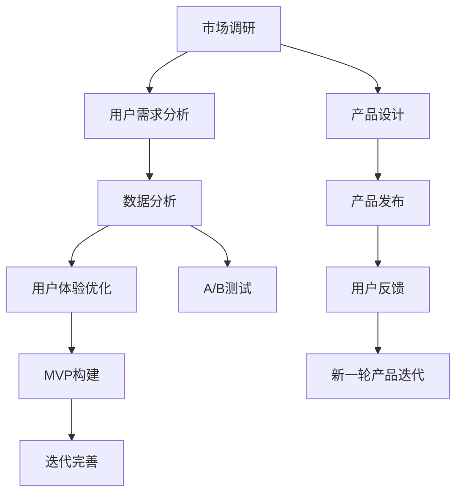

                 

# 知识付费创业的产品迭代方法论

> 关键词：知识付费, 产品迭代, 市场调研, 用户需求, 数据分析, A/B测试, 用户体验, MVP

## 1. 背景介绍

### 1.1 问题由来

知识付费，作为互联网新兴的商业模式，凭借其高附加值、高利润率的特点，吸引了众多创业者和资本的关注。然而，相对于传统的内容生产与分发模式，知识付费创业所面临的市场环境、用户需求、竞争态势更为复杂。如何在纷繁的市场中突围，构建具有长期竞争力的知识付费产品，成为了行业的一大挑战。

在如此竞争激烈的环境中，产品迭代显得尤为重要。不断优化和升级产品功能，满足用户需求，提升用户体验，是知识付费创业取得成功的关键所在。基于此，本文将系统介绍知识付费创业的产品迭代方法论，涵盖市场调研、用户需求分析、数据分析、A/B测试、用户体验优化、MVP构建等多个环节，力求为知识付费创业者提供全面的技术指导。

### 1.2 问题核心关键点

知识付费创业的产品迭代方法论，旨在通过系统的市场调研、数据分析和用户体验优化等方法，使产品不断适应市场变化和用户需求，保持竞争优势。核心关键点包括：

- **市场调研**：了解目标用户群体的需求、习惯、痛点，为产品设计提供数据支撑。
- **数据分析**：利用数据进行用户行为分析、功能效果评估，指导产品迭代方向。
- **用户体验**：注重细节，提升产品易用性、效率和互动性，构建良好用户口碑。
- **A/B测试**：通过对比测试优化功能，提升产品效果和用户体验。
- **MVP构建**：从最小可行性产品出发，逐步迭代完善，降低试错成本，快速验证市场反馈。

这些关键点贯穿于知识付费创业的产品迭代过程，相互支撑，共同推动产品不断进化和成熟。

## 2. 核心概念与联系

### 2.1 核心概念概述

为了更好地理解知识付费创业的产品迭代方法论，本节将介绍几个密切相关的核心概念：

- **市场调研**：通过问卷调查、访谈、焦点小组等方式，收集用户需求、竞争对手信息、市场趋势等数据，为产品设计和迭代提供依据。
- **用户需求分析**：分析用户在使用产品过程中产生的行为数据，如点击、停留、购买等，从中挖掘用户的深层次需求和痛点。
- **数据分析**：使用统计学方法，对用户数据进行建模和分析，理解用户行为模式，预测市场趋势，指导产品决策。
- **用户体验(UX)优化**：从用户界面(UI)、操作流程、交互方式等多个维度提升用户体验，构建良好用户黏性。
- **A/B测试**：通过对比两个或多个版本的用户行为数据，验证功能改进的有效性，指导产品优化方向。
- **MVP(Minimum Viable Product)**：构建功能最小化但可满足核心需求的产品，快速获取用户反馈，降低试错成本。

这些核心概念之间的逻辑关系可以通过以下Mermaid流程图来展示：



这个流程图展示了大语言模型的核心概念及其之间的关系：

1. 市场调研为产品设计提供数据基础。
2. 用户需求分析深入挖掘用户痛点和需求。
3. 数据分析指导产品决策和迭代方向。
4. UX优化提升用户体验，构建良好用户黏性。
5. A/B测试验证功能改进，指导产品优化。
6. MVP构建快速获取用户反馈，降低试错成本。

这些概念共同构成了知识付费创业的产品迭代框架，使其能够不断适应市场变化和用户需求。

## 3. 核心算法原理 & 具体操作步骤
### 3.1 算法原理概述

知识付费创业的产品迭代，本质是一个基于用户反馈的动态优化过程。其核心思想是：通过市场调研和用户需求分析，结合数据分析和A/B测试方法，不断优化用户体验，构建最小可行产品，并通过MVP构建和迭代完善，实现产品的持续进化。

具体而言，产品迭代的过程可以概括为以下几个步骤：

1. **市场调研**：收集用户需求、竞争态势和市场趋势等数据，为产品设计提供基础。
2. **用户需求分析**：通过分析用户行为数据，理解用户需求和痛点，指导产品功能和设计。
3. **数据分析**：利用数据进行用户行为分析、功能效果评估，指导产品迭代方向。
4. **用户体验优化**：通过UI/UX设计、交互方式等优化用户体验，提升用户满意度。
5. **A/B测试**：通过对比测试优化功能，验证改进效果，指导产品优化方向。
6. **MVP构建**：从最小可行性产品出发，逐步迭代完善，降低试错成本，快速验证市场反馈。

### 3.2 算法步骤详解

知识付费创业的产品迭代方法论，包括以下详细步骤：

**Step 1: 市场调研**

- **问卷调查**：设计问卷，通过线上线下渠道收集用户反馈。问卷内容包括对已有产品的满意度、功能需求、痛点等。
- **访谈和焦点小组**：与用户进行一对一或小组访谈，深入了解用户需求和期望，获取深度见解。
- **竞品分析**：分析主要竞争对手的产品特性、功能、用户体验等，找出自身优势和不足。

**Step 2: 用户需求分析**

- **用户行为数据收集**：通过网站、APP等平台的数据分析工具，收集用户的行为数据，如点击、停留、购买等。
- **用户需求挖掘**：使用数据分析方法，如关联规则挖掘、序列分析等，挖掘用户的深层次需求和痛点。
- **需求优先级排序**：根据用户反馈和行为数据，对需求进行优先级排序，确定首轮产品迭代的重点。

**Step 3: 数据分析**

- **用户行为建模**：使用统计学方法，对用户行为数据进行建模，理解用户行为模式，预测市场趋势。
- **功能效果评估**：利用A/B测试等方法，评估新功能的用户接受度和效果，指导产品优化方向。
- **迭代方向调整**：根据数据分析结果，调整产品迭代方向，确保每次迭代都能最大化满足用户需求。

**Step 4: 用户体验优化**

- **UI设计**：通过用户调研和竞品分析，优化产品界面，提升用户易用性和满意度。
- **交互方式改进**：优化用户操作流程，提升产品流畅度和互动性。
- **性能优化**：提升产品的响应速度和稳定性，降低用户体验中的障碍。

**Step 5: A/B测试**

- **测试目标设定**：明确测试目标，如提升注册转化率、优化用户体验等。
- **版本设计**：设计两个或多个功能不同的版本，确保测试结果的准确性。
- **数据收集与分析**：收集测试数据，使用统计学方法分析结果，验证功能改进的有效性。

**Step 6: MVP构建**

- **功能定义**：定义MVP的核心功能，确保功能最小化但可满足核心需求。
- **快速原型开发**：使用敏捷开发方法，快速开发MVP原型，降低试错成本。
- **市场验证**：通过小规模用户测试，获取市场反馈，验证MVP的可行性和市场潜力。

### 3.3 算法优缺点

知识付费创业的产品迭代方法论，具有以下优点：

1. **快速迭代**：通过A/B测试和MVP构建，能够快速获取用户反馈，降低试错成本。
2. **用户导向**：注重用户需求和行为数据，确保产品迭代始终围绕用户进行，提升用户满意度。
3. **数据分析驱动**：利用数据分析和A/B测试，科学指导产品迭代方向，提升决策准确性。
4. **用户体验优化**：通过UI/UX设计和交互方式改进，提升用户体验，构建良好用户黏性。

同时，该方法也存在一定的局限性：

1. **资源消耗**：A/B测试和数据分析需要大量的数据和计算资源，成本较高。
2. **迭代速度**：快速迭代可能导致产品功能不稳定，需通过MVP验证优化后，才能全面发布。
3. **市场风险**：市场调研和需求分析存在一定的不确定性，可能与实际用户需求存在偏差。

尽管存在这些局限性，但就目前而言，基于市场调研、数据分析、用户体验优化、A/B测试、MVP构建的产品迭代方法论，仍是知识付费创业最主流、最有效的方法。

### 3.4 算法应用领域

基于知识付费创业的产品迭代方法论，已被广泛应用于各类知识付费产品中，包括在线课程、电子书、知识问答、音频课程等。具体应用场景如下：

- **在线课程平台**：通过用户调研和数据分析，优化课程内容和推荐算法，提升用户购买率和课程完成率。
- **电子书和有声读物**：通过A/B测试和用户体验优化，提升阅读体验和购买转化率。
- **知识问答社区**：通过数据分析和用户反馈，优化问答功能和推荐系统，提升用户活跃度和满意度。
- **音频课程**：通过UI/UX设计和功能优化，提升用户听书体验和课程完成率。

## 4. 数学模型和公式 & 详细讲解
### 4.1 数学模型构建

本节将使用数学语言对知识付费创业的产品迭代方法论进行更加严格的刻画。

假设市场调研数据为 $D_{market}$，用户需求分析结果为 $D_{user}$，数据分析结果为 $D_{analyze}$，用户体验优化措施为 $U_{UX}$，A/B测试结果为 $T_{test}$，MVP构建效果为 $M_{MVP}$。产品迭代的数学模型可以表示为：

$$
F_{iter} = f(D_{market}, D_{user}, D_{analyze}, U_{UX}, T_{test}, M_{MVP})
$$

其中 $F_{iter}$ 为产品迭代后的效果，$f$ 为迭代函数，表示市场调研、用户需求分析、数据分析、用户体验优化、A/B测试、MVP构建等环节的组合和交互。

### 4.2 公式推导过程

以下我们以用户行为分析为例，推导A/B测试中的假设检验公式。

假设测试A和测试B的用户行为数据分别为 $X_A$ 和 $X_B$，分别代表两个版本的用户行为。根据A/B测试原理，我们可以建立以下假设检验公式：

$$
H_0: \mu_A = \mu_B \quad \text{（零假设：两个版本用户行为无显著差异）}
$$
$$
H_1: \mu_A \neq \mu_B \quad \text{（备择假设：两个版本用户行为有显著差异）}
$$

其中 $\mu_A$ 和 $\mu_B$ 分别代表测试A和测试B的平均用户行为。根据样本数据，我们可以计算两个版本的平均用户行为 $\bar{X}_A$ 和 $\bar{X}_B$，以及对应的标准差 $s_A$ 和 $s_B$。则根据t检验公式，可以计算出t统计量：

$$
t = \frac{\bar{X}_A - \bar{X}_B}{\sqrt{\frac{s_A^2}{n_A} + \frac{s_B^2}{n_B}}}
$$

根据自由度 $df = n_A + n_B - 2$，可以计算出t分布的p值，与预设显著性水平 $\alpha$ 比较，判断是否拒绝零假设，即两个版本用户行为是否有显著差异。

$$
p = P(t \geq |t|, df)
$$

如果 $p \leq \alpha$，则拒绝零假设，认为两个版本用户行为有显著差异，选择效果更好的版本进行推广。

## 5. 项目实践：代码实例和详细解释说明
### 5.1 开发环境搭建

在进行知识付费产品迭代实践前，我们需要准备好开发环境。以下是使用Python进行Flask框架开发的环境配置流程：

1. 安装Anaconda：从官网下载并安装Anaconda，用于创建独立的Python环境。

2. 创建并激活虚拟环境：
```bash
conda create -n flask-env python=3.8 
conda activate flask-env
```

3. 安装Flask和相关依赖：
```bash
pip install flask
pip install flask-sqlalchemy flask-restful
```

4. 安装数据库：
```bash
pip install sqlalchemy sqlalchemy-sqlite
```

5. 安装数据分析库：
```bash
pip install pandas numpy matplotlib scikit-learn
```

完成上述步骤后，即可在`flask-env`环境中开始产品迭代实践。

### 5.2 源代码详细实现

下面我们以在线课程平台的注册转化率提升为例，给出使用Flask框架进行用户行为分析的PyTorch代码实现。

首先，定义Flask应用：

```python
from flask import Flask, request, jsonify
from flask_sqlalchemy import SQLAlchemy
import pandas as pd
import numpy as np
from sklearn.model_selection import train_test_split
from sklearn.linear_model import LogisticRegression

app = Flask(__name__)
app.config['SQLALCHEMY_DATABASE_URI'] = 'sqlite:///user_data.db'
db = SQLAlchemy(app)
```

然后，定义数据模型：

```python
class User(db.Model):
    id = db.Column(db.Integer, primary_key=True)
    name = db.Column(db.String(50), nullable=False)
    email = db.Column(db.String(50), nullable=False, unique=True)
    age = db.Column(db.Integer, nullable=False)
    gender = db.Column(db.String(10), nullable=False)
    course_purchases = db.Column(db.Integer, nullable=False)

    def __repr__(self):
        return f"User('{self.name}', '{self.email}', '{self.age}', '{self.gender}', '{self.course_purchases}')"
```

接着，定义数据读取和处理函数：

```python
def read_data():
    df = pd.read_sql('SELECT * FROM user_data', con=app.config['SQLALCHEMY_DATABASE_URI'])
    return df

def process_data(df):
    # 特征工程
    df['age_cat'] = pd.cut(df['age'], bins=[18, 25, 30, 35, 40, 50])
    df['gender_cat'] = df['gender'].apply(lambda x: 'male' if x == '男' else 'female')
    # 标签构建
    y = df['course_purchases']
    X = df.drop('course_purchases', axis=1)
    # 数据分割
    X_train, X_test, y_train, y_test = train_test_split(X, y, test_size=0.3, random_state=42)
    return X_train, X_test, y_train, y_test

# 读取数据并处理
df = read_data()
X_train, X_test, y_train, y_test = process_data(df)
```

最后，定义模型训练和预测函数：

```python
def train_model(X_train, X_test, y_train, y_test):
    model = LogisticRegression()
    model.fit(X_train, y_train)
    y_pred = model.predict(X_test)
    return y_pred

# 训练模型并预测
y_pred = train_model(X_train, X_test, y_train, y_test)
```

以上就是使用Flask框架对在线课程平台进行用户行为分析的完整代码实现。可以看到，借助Flask和SQLAlchemy，我们可以轻松构建数据模型和数据库，并通过Pandas和Scikit-learn进行数据分析和模型训练。

### 5.3 代码解读与分析

让我们再详细解读一下关键代码的实现细节：

**Flask应用定义**：
- 使用Flask框架创建应用实例。
- 配置SQLAlchemy数据库连接。
- 定义数据模型，使用SQLAlchemy生成对应的数据库表。

**数据读取和处理**：
- 使用Pandas从数据库中读取用户数据。
- 进行特征工程，如分类年龄和性别。
- 构建标签变量，将用户是否购买课程作为二分类标签。
- 使用Scikit-learn进行数据分割，确保模型的训练和测试集独立。

**模型训练和预测**：
- 使用Scikit-learn的LogisticRegression模型训练。
- 预测测试集上的用户是否会购买课程。

可以看到，Flask框架提供了强大的Web开发能力，能够快速构建和部署知识付费产品的后台服务。结合Pandas、Scikit-learn等数据处理和机器学习库，可以高效进行用户行为分析和模型训练。

## 6. 实际应用场景
### 6.1 在线课程平台

在线课程平台的产品迭代，通过市场调研和用户需求分析，优化课程内容和推荐算法，提升用户购买率和课程完成率。具体应用场景包括：

- **课程推荐优化**：通过数据分析和A/B测试，优化课程推荐算法，提升课程推荐的个性化和准确性。
- **课程内容改进**：结合用户反馈和行为数据，改进课程内容和结构，提升课程吸引力。
- **学习路径设计**：通过用户行为分析，设计最优的学习路径，提升学习效率和课程完成率。

### 6.2 电子书和有声读物

电子书和有声读物的产品迭代，通过A/B测试和用户体验优化，提升阅读体验和购买转化率。具体应用场景包括：

- **阅读体验优化**：通过UI/UX设计，提升阅读界面和用户体验，降低阅读障碍。
- **智能推荐系统**：通过数据分析和A/B测试，优化推荐算法，提升用户发现和阅读感兴趣内容的能力。
- **个性化阅读计划**：根据用户阅读历史和行为数据，推荐个性化的阅读计划，提升阅读兴趣和黏性。

### 6.3 知识问答社区

知识问答社区的产品迭代，通过数据分析和用户反馈，优化问答功能和推荐系统，提升用户活跃度和满意度。具体应用场景包括：

- **问题质量提升**：通过数据分析，优化问题生成和审核机制，提升问题质量和社区氛围。
- **专家推荐系统**：结合用户反馈和行为数据，推荐最合适的专家和答案，提升用户信任度和满意度。
- **互动功能优化**：通过UI/UX设计，提升用户互动体验，增加社区活跃度。

### 6.4 未来应用展望

随着知识付费市场的不断扩大和用户需求的不断变化，基于市场调研、数据分析、用户体验优化、A/B测试、MVP构建的产品迭代方法论，将在更多领域得到应用，为知识付费创业带来新的发展机遇。

在未来，产品迭代将更加注重个性化和智能化，通过深度学习和大数据技术，提升产品的精准度和用户体验。同时，随着AI技术的不断进步，将有更多的智能功能引入知识付费产品中，如智能客服、语音识别、情感分析等，提升产品的智能化水平和用户黏性。

## 7. 工具和资源推荐
### 7.1 学习资源推荐

为了帮助开发者系统掌握知识付费创业的产品迭代方法论，这里推荐一些优质的学习资源：

1. **Flask官方文档**：Flask框架的官方文档，提供了详细的教程和API参考，是Flask开发的必备资料。

2. **SQLAlchemy官方文档**：SQLAlchemy数据库框架的官方文档，提供了丰富的功能和示例，是SQLAlchemy应用的必备资料。

3. **Pandas官方文档**：Pandas数据处理库的官方文档，提供了详细的数据处理和分析功能，是数据分析的必备工具。

4. **Scikit-learn官方文档**：Scikit-learn机器学习库的官方文档，提供了丰富的机器学习算法和工具，是模型训练的必备工具。

5. **Python数据分析与机器学习书籍**：如《Python数据科学手册》、《Python机器学习实战》等书籍，全面介绍了Python在数据分析和机器学习中的应用。

通过对这些资源的学习实践，相信你一定能够快速掌握知识付费创业的产品迭代方法论，并用于解决实际的产品优化问题。

### 7.2 开发工具推荐

高效的开发离不开优秀的工具支持。以下是几款用于知识付费产品迭代开发的常用工具：

1. **Flask**：轻量级Web开发框架，易于上手，适用于快速开发和部署知识付费产品的后台服务。
2. **SQLAlchemy**：强大的数据库框架，支持多种数据库和ORM（Object-Relational Mapping），方便进行数据存储和查询。
3. **Pandas**：高效的数据处理和分析库，支持数据清洗、转换和分析，是数据分析的必备工具。
4. **Scikit-learn**：机器学习库，提供了丰富的算法和工具，适用于模型训练和预测。
5. **TensorFlow**：Google开发的深度学习框架，支持多种模型和算法，适用于构建智能推荐系统和A/B测试。

合理利用这些工具，可以显著提升知识付费产品迭代任务的开发效率，加快创新迭代的步伐。

### 7.3 相关论文推荐

知识付费创业的产品迭代方法论，源于学界的持续研究。以下是几篇奠基性的相关论文，推荐阅读：

1. **A/B Testing in Industry**：Google的A/B测试论文，介绍了A/B测试的基本原理和实现方法。

2. **User Experience: A Common Language for Interaction Design**：用户体验研究的经典论文，探讨了用户体验设计的原则和方法。

3. **Minimum Viable Products: An Exploration of Innovation and New Product Development**：关于MVP的学术论文，探讨了MVP的构建和应用。

4. **Machine Learning for Market Research**：关于数据驱动的市场调研论文，探讨了机器学习在市场调研中的应用。

这些论文代表了大语言模型微调技术的发展脉络。通过学习这些前沿成果，可以帮助研究者把握学科前进方向，激发更多的创新灵感。

## 8. 总结：未来发展趋势与挑战
### 8.1 总结

本文对知识付费创业的产品迭代方法论进行了全面系统的介绍。首先阐述了知识付费创业面临的市场环境、用户需求、竞争态势等背景，明确了产品迭代在知识付费创业中的重要性。其次，从原理到实践，详细讲解了市场调研、用户需求分析、数据分析、用户体验优化、A/B测试、MVP构建等多个环节，给出了产品迭代任务开发的完整代码实例。同时，本文还广泛探讨了产品迭代方法论在在线课程平台、电子书、知识问答社区等多个领域的应用前景，展示了其广泛的适用性和潜力。此外，本文精选了知识付费产品迭代的工具和资源，力求为读者提供全方位的技术指导。

通过本文的系统梳理，可以看到，知识付费创业的产品迭代方法论，为知识付费创业者提供了一条科学、高效的产品优化路径。通过不断优化和升级产品功能，满足用户需求，提升用户体验，构建长期竞争力的知识付费产品，将在激烈的市场竞争中脱颖而出，取得成功。

### 8.2 未来发展趋势

展望未来，知识付费创业的产品迭代方法论将呈现以下几个发展趋势：

1. **数据驱动**：随着数据收集和处理技术的进步，数据驱动的产品迭代将更加精准，能够更好地满足用户需求。
2. **智能化**：结合AI和大数据技术，产品迭代将更加智能化，通过智能推荐、情感分析等技术，提升用户体验和满意度。
3. **个性化**：通过用户行为分析和深度学习，产品迭代将更加个性化，提升产品的精准度和用户黏性。
4. **跨平台协同**：随着移动端、Web端等不同平台的用户行为差异化，产品迭代将更加注重跨平台协同，提升整体用户体验。
5. **多模态融合**：结合语音识别、图像识别等技术，产品迭代将更加多模态化，提升产品的智能化水平和用户互动性。

以上趋势凸显了知识付费创业的产品迭代方法的广阔前景。这些方向的探索发展，必将进一步提升知识付费产品的性能和应用范围，为知识付费创业带来新的发展机遇。

### 8.3 面临的挑战

尽管知识付费创业的产品迭代方法论已经取得了一定的成果，但在迈向更加智能化、普适化应用的过程中，它仍面临着诸多挑战：

1. **数据质量**：数据收集和处理过程中，可能存在噪音和偏差，影响数据分析和决策的准确性。
2. **用户隐私**：在数据收集和分析过程中，如何保护用户隐私和数据安全，是一个重要的法律和伦理问题。
3. **算法透明性**：机器学习和AI算法的复杂性和黑盒性，可能导致用户对推荐结果的信任度下降。
4. **技术集成**：跨平台、跨模态的数据集成和算法优化，是一个技术挑战。
5. **资源消耗**：数据处理和模型训练需要大量的计算资源，如何优化资源消耗，是一个重要的问题。

正视知识付费创业的产品迭代方法论所面临的这些挑战，积极应对并寻求突破，将是大语言模型微调走向成熟的必由之路。相信随着学界和产业界的共同努力，这些挑战终将一一被克服，知识付费创业的产品迭代方法论必将在构建人机协同的智能时代中扮演越来越重要的角色。

### 8.4 研究展望

面对知识付费创业的产品迭代方法论所面临的种种挑战，未来的研究需要在以下几个方面寻求新的突破：

1. **数据治理**：构建完善的数据治理体系，提升数据质量，确保数据驱动的产品迭代精准有效。
2. **隐私保护**：结合隐私计算和区块链等技术，保护用户隐私，提升用户对知识付费产品的信任度。
3. **算法透明**：通过可解释性AI（XAI）技术，提升算法的透明性，提升用户对知识付费产品的信任度。
4. **跨平台集成**：结合API接口和微服务架构，实现跨平台、跨模态的数据集成和算法优化。
5. **资源优化**：结合云服务和分布式计算技术，优化资源消耗，提升知识付费产品的性能和可扩展性。

这些研究方向的探索，必将引领知识付费创业的产品迭代方法论迈向更高的台阶，为构建安全、可靠、可解释、可控的智能产品铺平道路。面向未来，知识付费创业的产品迭代方法论还需要与其他人工智能技术进行更深入的融合，如知识表示、因果推理、强化学习等，多路径协同发力，共同推动知识付费产品的进步。只有勇于创新、敢于突破，才能不断拓展知识付费产品的边界，让智能技术更好地造福人类社会。

## 9. 附录：常见问题与解答

**Q1：市场调研中的问卷设计和用户访谈如何避免偏差？**

A: 问卷设计和用户访谈是市场调研的重要手段，但需要注意避免偏差，确保数据的客观性和代表性。以下是一些具体方法：

1. **样本代表性**：确保样本覆盖目标用户群体的各个层面，避免样本偏差。可以通过分层抽样、随机抽样等方法，提升样本代表性。

2. **问题设计**：设计中立、开放性的问题，避免引导性或预设答案。使用量化和质性相结合的方式，获取全面数据。

3. **数据验证**：通过多渠道数据验证，如问卷调查、访谈、焦点小组等，交叉验证数据的准确性和一致性。

4. **数据分析**：使用数据分析方法，如回归分析、因子分析等，挖掘数据的深层次关系，避免单一数据来源的偏差。

通过以上方法，可以提升市场调研和用户需求分析的准确性和代表性，为产品迭代提供可靠的数据支撑。

**Q2：用户体验优化的关键点是什么？**

A: 用户体验优化是产品迭代的重要环节，提升用户体验不仅能够提升用户满意度，还能增强用户黏性和忠诚度。以下是一些关键点：

1. **界面设计**：提升界面美观度、易用性，减少用户操作障碍。使用一致性设计、自适应布局等方法，提升界面一致性和可用性。

2. **交互方式**：优化操作流程，提升用户操作流畅性和响应速度。使用动画、提示信息等方法，提升用户互动体验。

3. **功能优化**：提升功能的响应速度和稳定性，减少用户等待和操作障碍。使用缓存、异步加载等方法，提升系统性能。

4. **反馈机制**：及时响应用户反馈，改进产品功能和服务。建立用户反馈渠道，定期收集和分析用户意见。

5. **个性化服务**：根据用户行为和偏好，提供个性化推荐和服务。结合机器学习和数据分析，提升个性化服务的精准度和效果。

通过以上关键点的优化，可以显著提升产品的用户体验，构建良好用户黏性，增强产品竞争力。

**Q3：A/B测试中如何确定测试样本量？**

A: A/B测试的样本量直接影响测试结果的准确性和可靠性。以下是一些确定样本量的常用方法：

1. **幂律法则**：根据样本量与误差的关系，通过幂律法则（如n=8）确定测试样本量。

2. **置信区间**：通过计算置信区间，确定测试样本量。通常置信区间越小，所需的样本量越大。

3. **统计学方法**：使用统计学方法，如二项分布、泊松分布等，确定测试样本量。

4. **先验知识**：结合领域知识和经验，通过专家评估确定测试样本量。

通过以上方法，可以确保A/B测试结果的可靠性和准确性，为产品迭代提供科学依据。

---

作者：禅与计算机程序设计艺术 / Zen and the Art of Computer Programming

