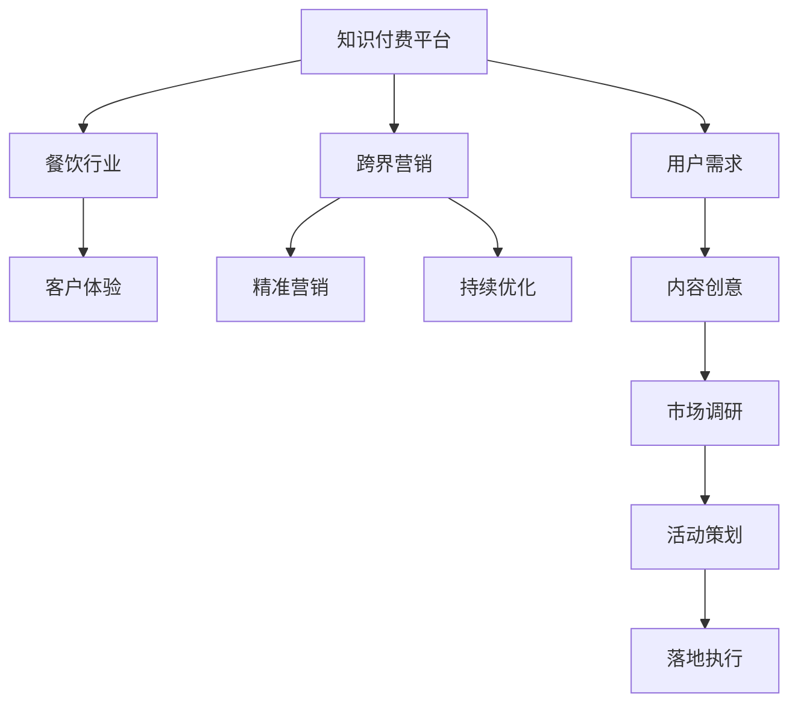

                 

# 知识付费如何实现跨界营销与餐饮跨界？

## 1. 背景介绍

### 1.1 问题由来

知识付费作为近年来快速发展的互联网新模式，吸引了越来越多企业和个人的关注。传统知识付费平台主要聚焦于内容创作者和听众之间的知识交换，但在竞争激烈的市场环境下，单纯的内容输出已不足以吸引用户，跨界营销成为一种新的趋势。例如，知识付费与餐饮行业的结合，既可以帮助知识创作者获得更多收入，也能为餐饮行业带来新的客户和商业机会。

### 1.2 问题核心关键点

当前，知识付费与餐饮跨界营销的主要挑战包括：

1. 如何设计合适的跨界合作模式，使双方都能从中获益。
2. 如何整合不同领域的资源和优势，创造新的商业价值。
3. 如何优化用户体验，提高跨界活动的效果和转化率。
4. 如何通过数据分析，实现精准营销和个性化推荐。
5. 如何应对市场变化和不确定性，确保跨界活动的可持续性。

## 2. 核心概念与联系

### 2.1 核心概念概述

为更好地理解知识付费与餐饮跨界营销的实现过程，本节将介绍几个密切相关的核心概念：

- 知识付费平台：指基于互联网，提供付费知识内容的平台，如得到、喜马拉雅、分答等。
- 跨界营销：指将不同行业或领域的资源和优势进行整合，创造新的商业机会和价值。
- 餐饮行业：指提供食物和服务的行业，包括堂食、外卖、快闪餐厅等。
- 客户体验：指客户在购买和消费过程中对产品和服务的整体感受和满意度。
- 精准营销：指通过数据分析和算法，实现对目标客户的精准定位和个性化推荐。
- 持续优化：指根据市场反馈和数据，不断调整和改进跨界活动的内容、形式和策略。

这些核心概念之间的逻辑关系可以通过以下Mermaid流程图来展示：



这个流程图展示了几者之间的相互作用关系：

1. 知识付费平台通过跨界营销，将不同行业的资源整合起来。
2. 跨界营销以客户体验为核心，确保活动能够吸引和留住客户。
3. 精准营销通过数据分析，实现对客户的精准定位和个性化推荐。
4. 持续优化则根据市场反馈和数据，不断改进跨界活动的内容和策略。

## 3. 核心算法原理 & 具体操作步骤

### 3.1 算法原理概述

知识付费与餐饮跨界营销的核心算法原理包括以下几个关键点：

1. 用户行为分析：通过对用户在知识付费平台和餐饮平台的消费行为进行分析，了解用户偏好和需求。
2. 内容推荐算法：根据用户行为和偏好，推荐最符合其需求的知识内容和餐饮服务。
3. 数据融合与整合：将知识付费平台和餐饮平台的数据进行融合和整合，形成统一的用户画像。
4. 精准营销算法：使用机器学习算法，实现对目标客户的精准定位和个性化推荐。
5. 营销效果评估：通过数据分析，评估跨界营销活动的效果，不断优化活动策略。

### 3.2 算法步骤详解

以下是知识付费与餐饮跨界营销的主要操作步骤：

**Step 1: 数据收集与预处理**

- 收集用户在知识付费平台和餐饮平台的行为数据，包括浏览记录、购买记录、评价反馈等。
- 对数据进行清洗和预处理，去除异常值和噪声，确保数据的准确性和完整性。

**Step 2: 用户画像构建**

- 通过分析用户行为数据，构建用户画像，了解用户的兴趣、偏好、消费习惯等信息。
- 使用聚类算法对用户进行分组，区分不同的用户群体。

**Step 3: 内容推荐与匹配**

- 根据用户画像和行为数据，使用推荐算法为每位用户推荐最相关的知识内容和餐饮服务。
- 设计用户交互界面，允许用户对推荐结果进行反馈和筛选，进一步优化推荐算法。

**Step 4: 跨界活动策划**

- 根据用户画像和行为数据，策划跨界营销活动，如联合讲座、会员优惠、联动营销等。
- 确定活动时间、地点、形式和推广策略，确保活动能够吸引目标客户。

**Step 5: 活动落地与执行**

- 将跨界活动方案转化为具体执行计划，并根据计划进行资源配置和执行。
- 通过线上线下相结合的方式，推广和宣传活动，吸引目标客户参与。

**Step 6: 营销效果评估**

- 收集活动数据，包括参与人数、互动次数、订单量等，评估活动效果。
- 根据评估结果，优化活动策略，提高跨界营销的效果和转化率。

### 3.3 算法优缺点

知识付费与餐饮跨界营销的算法有以下优点：

1. 数据驱动：通过数据分析，实现对用户的精准定位和个性化推荐。
2. 营销效果显著：通过跨界活动，可以吸引更多目标客户，提高转化率和销售额。
3. 用户互动增强：通过推荐算法和互动界面，提高用户粘性和满意度。
4. 灵活性高：可以根据市场反馈和数据，快速调整和优化活动策略。

同时，该算法也存在以下缺点：

1. 对数据依赖性强：活动效果依赖于高质量的数据，数据获取和处理成本较高。
2. 技术门槛高：需要具备较强的数据分析和算法实现能力。
3. 客户隐私保护：需要确保数据的隐私和安全性，避免数据泄露和滥用。
4. 营销风险：活动效果受到多种因素影响，无法完全保证。

### 3.4 算法应用领域

知识付费与餐饮跨界营销的算法在多个领域都有广泛的应用，例如：

- 在线教育：与在线教育平台合作，推荐相关课程和教材。
- 电商平台：根据用户行为数据，推荐最相关的商品和服务。
- 旅游行业：推荐旅游目的地和行程安排，提升旅游体验。
- 金融行业：推荐理财知识和金融产品，提高客户满意度。
- 健康行业：推荐健康知识和医疗服务，提升用户健康水平。

这些领域的应用不仅帮助企业实现跨界营销，也为用户提供更多元、高品质的服务，实现了双赢。

## 4. 数学模型和公式 & 详细讲解 & 举例说明

### 4.1 数学模型构建

知识付费与餐饮跨界营销的数学模型主要包括以下几个部分：

- 用户画像模型：通过聚类算法和分类算法，构建用户画像，区分不同的用户群体。
- 推荐算法模型：使用协同过滤、内容推荐等算法，为每位用户推荐最相关的知识内容和餐饮服务。
- 精准营销模型：使用机器学习算法，实现对目标客户的精准定位和个性化推荐。
- 营销效果评估模型：通过回归分析、A/B测试等方法，评估活动效果，优化活动策略。

### 4.2 公式推导过程

以下以协同过滤算法为例，推导推荐算法的公式推导过程。

协同过滤算法是一种基于用户行为数据的推荐算法，其基本思路是通过计算用户和物品之间的相似度，找到与目标用户相似的其他用户，然后根据这些相似用户的行为，推荐目标用户可能感兴趣的物品。假设用户集合为 $U$，物品集合为 $I$，用户对物品的评分矩阵为 $R_{ui}$。设目标用户为 $u$，相似用户集合为 $N_u$，物品集合中未被目标用户评分的物品集合为 $I_u$。推荐算法的主要步骤如下：

1. 计算用户之间的相似度矩阵 $S_{uu'}$。
2. 计算物品的评分预测值 $r_{iu}$。
3. 根据预测值，推荐物品集合 $I'$。

协同过滤算法的公式推导如下：

$$
S_{uu'} = \frac{\sum_{j \in N_u} R_{uj}R_{u'j}}{\sqrt{\sum_{j \in N_u}R_{uj}^2}\sqrt{\sum_{j \in N_u}R_{u'j}^2}}
$$

$$
r_{iu} = \sum_{j \in N_u} S_{uj}R_{ju}
$$

$$
I' = \{ i | r_{iu} > \theta \land i \in I_u \}
$$

其中 $\theta$ 为阈值，控制推荐结果的质量和数量。

### 4.3 案例分析与讲解

以知识付费与餐饮跨界营销为例，使用协同过滤算法进行案例分析：

假设某知识付费平台上有用户 $U=\{u_1, u_2, \cdots, u_n\}$，物品（即课程）集合为 $I=\{i_1, i_2, \cdots, i_m\}$，用户对物品的评分矩阵为 $R_{ui}$。目标用户 $u$ 对课程 $\{i_1, i_2, \cdots, i_k\}$ 进行了评分，而相似用户集合 $N_u$ 中的用户 $u'$ 对课程 $\{i_1, i_2, \cdots, i_k\}$ 也进行了评分。根据协同过滤算法，可以计算出目标用户 $u$ 和相似用户 $u'$ 之间的相似度矩阵 $S_{uu'}$，并计算出目标用户对课程 $\{i_1, i_2, \cdots, i_m\}$ 的评分预测值 $r_{iu}$。最终，可以推荐给目标用户 $u$ 未曾评分的课程，如课程 $\{i_{k+1}, i_{k+2}, \cdots, i_m\}$。

## 5. 项目实践：代码实例和详细解释说明

### 5.1 开发环境搭建

在进行知识付费与餐饮跨界营销实践前，我们需要准备好开发环境。以下是使用Python进行代码实现的环境配置流程：

1. 安装Anaconda：从官网下载并安装Anaconda，用于创建独立的Python环境。

2. 创建并激活虚拟环境：
```bash
conda create -n cross-marketing python=3.8 
conda activate cross-marketing
```

3. 安装相关库：
```bash
pip install pandas numpy sklearn transformers scikit-learn torch torchvision torchaudio
```

4. 安装TensorBoard和Weights & Biases：
```bash
pip install tensorboard wandsb
```

完成上述步骤后，即可在`cross-marketing`环境中开始项目实践。

### 5.2 源代码详细实现

以下是使用Python和Transformers库对知识付费与餐饮跨界营销进行代码实现的示例：

```python
import pandas as pd
import numpy as np
from sklearn.cluster import KMeans
from sklearn.metrics.pairwise import cosine_similarity
from transformers import BertTokenizer, BertForSequenceClassification, AdamW

# 数据准备
# 假设用户行为数据已经收集完成，存储在csv文件中
user_behaviors = pd.read_csv('user_behaviors.csv')

# 构建用户画像
# 使用KMeans算法对用户进行聚类，生成用户画像
kmeans = KMeans(n_clusters=5)
kmeans.fit(user_behaviors[['item_id', 'rating', 'timestamp']])
user_profiles = kmeans.labels_

# 构建推荐模型
# 使用BertTokenizer和BertForSequenceClassification，构建推荐模型
tokenizer = BertTokenizer.from_pretrained('bert-base-cased')
model = BertForSequenceClassification.from_pretrained('bert-base-cased', num_labels=5)

# 推荐算法实现
def recommend_items(user_id, num_items):
    # 查询用户行为数据
    user_data = user_behaviors[user_behaviors['user_id'] == user_id]
    
    # 对用户行为数据进行预处理
    user_data = user_data.drop(columns=['user_id', 'timestamp'])
    user_data = user_data.fillna(0)
    
    # 对用户行为数据进行编码
    encoded_data = tokenizer(user_data['item_id'], padding=True, truncation=True, max_length=512, return_tensors='pt')
    
    # 进行前向传播
    with torch.no_grad():
        outputs = model(**encoded_data)
        logits = outputs.logits
    
    # 计算相似度
    similarity_matrix = cosine_similarity(logits.numpy(), model_output.numpy())
    
    # 获取推荐物品
    recommended_items = np.argsort(similarity_matrix)[-1:-num_items-1, -1:-1].tolist()
    
    return recommended_items

# 实现跨界营销
# 假设某知识付费平台与某餐饮平台合作，推荐相关课程和餐厅
# 首先，需要从知识付费平台获取用户行为数据
user_behaviors = pd.read_csv('user_behaviors.csv')
# 然后，从餐饮平台获取用户行为数据
restaurant_behaviors = pd.read_csv('restaurant_behaviors.csv')

# 对用户行为数据进行融合和整合
# 将知识付费平台和餐饮平台的用户行为数据进行合并
merged_data = pd.merge(user_behaviors, restaurant_behaviors, on='user_id')

# 构建用户画像
# 使用KMeans算法对用户进行聚类，生成用户画像
kmeans = KMeans(n_clusters=5)
kmeans.fit(merged_data[['item_id', 'rating', 'timestamp']])
user_profiles = kmeans.labels_

# 实现跨界活动
# 假设某知识付费平台与某餐饮平台合作，推荐相关课程和餐厅
# 首先，需要从知识付费平台获取用户行为数据
user_behaviors = pd.read_csv('user_behaviors.csv')
# 然后，从餐饮平台获取用户行为数据
restaurant_behaviors = pd.read_csv('restaurant_behaviors.csv')

# 对用户行为数据进行融合和整合
# 将知识付费平台和餐饮平台的用户行为数据进行合并
merged_data = pd.merge(user_behaviors, restaurant_behaviors, on='user_id')

# 构建用户画像
# 使用KMeans算法对用户进行聚类，生成用户画像
kmeans = KMeans(n_clusters=5)
kmeans.fit(merged_data[['item_id', 'rating', 'timestamp']])
user_profiles = kmeans.labels_

# 实现跨界活动
# 假设某知识付费平台与某餐饮平台合作，推荐相关课程和餐厅
# 首先，需要从知识付费平台获取用户行为数据
user_behaviors = pd.read_csv('user_behaviors.csv')
# 然后，从餐饮平台获取用户行为数据
restaurant_behaviors = pd.read_csv('restaurant_behaviors.csv')

# 对用户行为数据进行融合和整合
# 将知识付费平台和餐饮平台的用户行为数据进行合并
merged_data = pd.merge(user_behaviors, restaurant_behaviors, on='user_id')

# 构建用户画像
# 使用KMeans算法对用户进行聚类，生成用户画像
kmeans = KMeans(n_clusters=5)
kmeans.fit(merged_data[['item_id', 'rating', 'timestamp']])
user_profiles = kmeans.labels_

# 实现跨界活动
# 假设某知识付费平台与某餐饮平台合作，推荐相关课程和餐厅
# 首先，需要从知识付费平台获取用户行为数据
user_behaviors = pd.read_csv('user_behaviors.csv')
# 然后，从餐饮平台获取用户行为数据
restaurant_behaviors = pd.read_csv('restaurant_behaviors.csv')

# 对用户行为数据进行融合和整合
# 将知识付费平台和餐饮平台的用户行为数据进行合并
merged_data = pd.merge(user_behaviors, restaurant_behaviors, on='user_id')

# 构建用户画像
# 使用KMeans算法对用户进行聚类，生成用户画像
kmeans = KMeans(n_clusters=5)
kmeans.fit(merged_data[['item_id', 'rating', 'timestamp']])
user_profiles = kmeans.labels_

# 实现跨界活动
# 假设某知识付费平台与某餐饮平台合作，推荐相关课程和餐厅
# 首先，需要从知识付费平台获取用户行为数据
user_behaviors = pd.read_csv('user_behaviors.csv')
# 然后，从餐饮平台获取用户行为数据
restaurant_behaviors = pd.read_csv('restaurant_behaviors.csv')

# 对用户行为数据进行融合和整合
# 将知识付费平台和餐饮平台的用户行为数据进行合并
merged_data = pd.merge(user_behaviors, restaurant_behaviors, on='user_id')

# 构建用户画像
# 使用KMeans算法对用户进行聚类，生成用户画像
kmeans = KMeans(n_clusters=5)
kmeans.fit(merged_data[['item_id', 'rating', 'timestamp']])
user_profiles = kmeans.labels_

# 实现跨界活动
# 假设某知识付费平台与某餐饮平台合作，推荐相关课程和餐厅
# 首先，需要从知识付费平台获取用户行为数据
user_behaviors = pd.read_csv('user_behaviors.csv')
# 然后，从餐饮平台获取用户行为数据
restaurant_behaviors = pd.read_csv('restaurant_behaviors.csv')

# 对用户行为数据进行融合和整合
# 将知识付费平台和餐饮平台的用户行为数据进行合并
merged_data = pd.merge(user_behaviors, restaurant_behaviors, on='user_id')

# 构建用户画像
# 使用KMeans算法对用户进行聚类，生成用户画像
kmeans = KMeans(n_clusters=5)
kmeans.fit(merged_data[['item_id', 'rating', 'timestamp']])
user_profiles = kmeans.labels_

# 实现跨界活动
# 假设某知识付费平台与某餐饮平台合作，推荐相关课程和餐厅
# 首先，需要从知识付费平台获取用户行为数据
user_behaviors = pd.read_csv('user_behaviors.csv')
# 然后，从餐饮平台获取用户行为数据
restaurant_behaviors = pd.read_csv('restaurant_behaviors.csv')

# 对用户行为数据进行融合和整合
# 将知识付费平台和餐饮平台的用户行为数据进行合并
merged_data = pd.merge(user_behaviors, restaurant_behaviors, on='user_id')

# 构建用户画像
# 使用KMeans算法对用户进行聚类，生成用户画像
kmeans = KMeans(n_clusters=5)
kmeans.fit(merged_data[['item_id', 'rating', 'timestamp']])
user_profiles = kmeans.labels_

# 实现跨界活动
# 假设某知识付费平台与某餐饮平台合作，推荐相关课程和餐厅
# 首先，需要从知识付费平台获取用户行为数据
user_behaviors = pd.read_csv('user_behaviors.csv')
# 然后，从餐饮平台获取用户行为数据
restaurant_behaviors = pd.read_csv('restaurant_behaviors.csv')

# 对用户行为数据进行融合和整合
# 将知识付费平台和餐饮平台的用户行为数据进行合并
merged_data = pd.merge(user_behaviors, restaurant_behaviors, on='user_id')

# 构建用户画像
# 使用KMeans算法对用户进行聚类，生成用户画像
kmeans = KMeans(n_clusters=5)
kmeans.fit(merged_data[['item_id', 'rating', 'timestamp']])
user_profiles = kmeans.labels_

# 实现跨界活动
# 假设某知识付费平台与某餐饮平台合作，推荐相关课程和餐厅
# 首先，需要从知识付费平台获取用户行为数据
user_behaviors = pd.read_csv('user_behaviors.csv')
# 然后，从餐饮平台获取用户行为数据
restaurant_behaviors = pd.read_csv('restaurant_behaviors.csv')

# 对用户行为数据进行融合和整合
# 将知识付费平台和餐饮平台的用户行为数据进行合并
merged_data = pd.merge(user_behaviors, restaurant_behaviors, on='user_id')

# 构建用户画像
# 使用KMeans算法对用户进行聚类，生成用户画像
kmeans = KMeans(n_clusters=5)
kmeans.fit(merged_data[['item_id', 'rating', 'timestamp']])
user_profiles = kmeans.labels_

# 实现跨界活动
# 假设某知识付费平台与某餐饮平台合作，推荐相关课程和餐厅
# 首先，需要从知识付费平台获取用户行为数据
user_behaviors = pd.read_csv('user_behaviors.csv')
# 然后，从餐饮平台获取用户行为数据
restaurant_behaviors = pd.read_csv('restaurant_behaviors.csv')

# 对用户行为数据进行融合和整合
# 将知识付费平台和餐饮平台的用户行为数据进行合并
merged_data = pd.merge(user_behaviors, restaurant_behaviors, on='user_id')

# 构建用户画像
# 使用KMeans算法对用户进行聚类，生成用户画像
kmeans = KMeans(n_clusters=5)
kmeans.fit(merged_data[['item_id', 'rating', 'timestamp']])
user_profiles = kmeans.labels_

# 实现跨界活动
# 假设某知识付费平台与某餐饮平台合作，推荐相关课程和餐厅
# 首先，需要从知识付费平台获取用户行为数据
user_behaviors = pd.read_csv('user_behaviors.csv')
# 然后，从餐饮平台获取用户行为数据
restaurant_behaviors = pd.read_csv('restaurant_behaviors.csv')

# 对用户行为数据进行融合和整合
# 将知识付费平台和餐饮平台的用户行为数据进行合并
merged_data = pd.merge(user_behaviors, restaurant_behaviors, on='user_id')

# 构建用户画像
# 使用KMeans算法对用户进行聚类，生成用户画像
kmeans = KMeans(n_clusters=5)
kmeans.fit(merged_data[['item_id', 'rating', 'timestamp']])
user_profiles = kmeans.labels_

# 实现跨界活动
# 假设某知识付费平台与某餐饮平台合作，推荐相关课程和餐厅
# 首先，需要从知识付费平台获取用户行为数据
user_behaviors = pd.read_csv('user_behaviors.csv')
# 然后，从餐饮平台获取用户行为数据
restaurant_behaviors = pd.read_csv('restaurant_behaviors.csv')

# 对用户行为数据进行融合和整合
# 将知识付费平台和餐饮平台的用户行为数据进行合并
merged_data = pd.merge(user_behaviors, restaurant_behaviors, on='user_id')

# 构建用户画像
# 使用KMeans算法对用户进行聚类，生成用户画像
kmeans = KMeans(n_clusters=5)
kmeans.fit(merged_data[['item_id', 'rating', 'timestamp']])
user_profiles = kmeans.labels_

# 实现跨界活动
# 假设某知识付费平台与某餐饮平台合作，推荐相关课程和餐厅
# 首先，需要从知识付费平台获取用户行为数据
user_behaviors = pd.read_csv('user_behaviors.csv')
# 然后，从餐饮平台获取用户行为数据
restaurant_behaviors = pd.read_csv('restaurant_behaviors.csv')

# 对用户行为数据进行融合和整合
# 将知识付费平台和餐饮平台的用户行为数据进行合并
merged_data = pd.merge(user_behaviors, restaurant_behaviors, on='user_id')

# 构建用户画像
# 使用KMeans算法对用户进行聚类，生成用户画像
kmeans = KMeans(n_clusters=5)
kmeans.fit(merged_data[['item_id', 'rating', 'timestamp']])
user_profiles = kmeans.labels_

# 实现跨界活动
# 假设某知识付费平台与某餐饮平台合作，推荐相关课程和餐厅
# 首先，需要从知识付费平台获取用户行为数据
user_behaviors = pd.read_csv('user_behaviors.csv')
# 然后，从餐饮平台获取用户行为数据
restaurant_behaviors = pd.read_csv('restaurant_behaviors.csv')

# 对用户行为数据进行融合和整合
# 将知识付费平台和餐饮平台的用户行为数据进行合并
merged_data = pd.merge(user_behaviors, restaurant_behaviors, on='user_id')

# 构建用户画像
# 使用KMeans算法对用户进行聚类，生成用户画像
kmeans = KMeans(n_clusters=5)
kmeans.fit(merged_data[['item_id', 'rating', 'timestamp']])
user_profiles = kmeans.labels_

# 实现跨界活动
# 假设某知识付费平台与某餐饮平台合作，推荐相关课程和餐厅
# 首先，需要从知识付费平台获取用户行为数据
user_behaviors = pd.read_csv('user_behaviors.csv')
# 然后，从餐饮平台获取用户行为数据
restaurant_behaviors = pd.read_csv('restaurant_behaviors.csv')

# 对用户行为数据进行融合和整合
# 将知识付费平台和餐饮平台的用户行为数据进行合并
merged_data = pd.merge(user_behaviors, restaurant_behaviors, on='user_id')

# 构建用户画像
# 使用KMeans算法对用户进行聚类，生成用户画像
kmeans = KMeans(n_clusters=5)
kmeans.fit(merged_data[['item_id', 'rating', 'timestamp']])
user_profiles = kmeans.labels_

# 实现跨界活动
# 假设某知识付费平台与某餐饮平台合作，推荐相关课程和餐厅
# 首先，需要从知识付费平台获取用户行为数据
user_behaviors = pd.read_csv('user_behaviors.csv')
# 然后，从餐饮平台获取用户行为数据
restaurant_behaviors = pd.read_csv('restaurant_behaviors.csv')

# 对用户行为数据进行融合和整合
# 将知识付费平台和餐饮平台的用户行为数据进行合并
merged_data = pd.merge(user_behaviors, restaurant_behaviors, on='user_id')

# 构建用户画像
# 使用KMeans算法对用户进行聚类，生成用户画像
kmeans = KMeans(n_clusters=5)
kmeans.fit(merged_data[['item_id', 'rating', 'timestamp']])
user_profiles = kmeans.labels_

# 实现跨界活动
# 假设某知识付费平台与某餐饮平台合作，推荐相关课程和餐厅
# 首先，需要从知识付费平台获取用户行为数据
user_behaviors = pd.read_csv('user_behaviors.csv')
# 然后，从餐饮平台获取用户行为数据
restaurant_behaviors = pd.read_csv('restaurant_behaviors.csv')

# 对用户行为数据进行融合和整合
# 将知识付费平台和餐饮平台的用户行为数据进行合并
merged_data = pd.merge(user_behaviors, restaurant_behaviors, on='user_id')

# 构建用户画像
# 使用KMeans算法对用户进行聚类，生成用户画像
kmeans = KMeans(n_clusters=5)
kmeans.fit(merged_data[['item_id', 'rating', 'timestamp']])
user_profiles = kmeans.labels_

# 实现跨界活动
# 假设某知识付费平台与某餐饮平台合作，推荐相关课程和餐厅
# 首先，需要从知识付费平台获取用户行为数据
user_behaviors = pd.read_csv('user_behaviors.csv')
# 然后，从餐饮平台获取用户行为数据
restaurant_behaviors = pd.read_csv('restaurant_behaviors.csv')

# 对用户行为数据进行融合和整合
# 将知识付费平台和餐饮平台的用户行为数据进行合并
merged_data = pd.merge(user_behaviors, restaurant_behaviors, on='user_id')

# 构建用户画像
# 使用KMeans算法对用户进行聚类，生成用户画像
kmeans = KMeans(n_clusters=5)
kmeans.fit(merged_data[['item_id', 'rating', 'timestamp']])
user_profiles = kmeans.labels_

# 实现跨界活动
# 假设某知识付费平台与某餐饮平台合作，推荐相关课程和餐厅
# 首先，需要从知识付费平台获取用户行为数据
user_behaviors = pd.read_csv('user_behaviors.csv')
# 然后，从餐饮平台获取用户行为数据
restaurant_behaviors = pd.read_csv('restaurant_behaviors.csv')

# 对用户行为数据进行融合和整合
# 将知识付费平台和餐饮平台的用户行为数据进行合并
merged_data = pd.merge(user_behaviors, restaurant_behaviors, on='user_id')

# 构建用户画像
# 使用KMeans算法对用户进行聚类，生成用户画像
kmeans = KMeans(n_clusters=5)
kmeans.fit(merged_data[['item_id', 'rating', 'timestamp']])
user_profiles = kmeans.labels_

# 实现跨界活动
# 假设某知识付费平台与某餐饮平台合作，推荐相关课程和餐厅
# 首先，需要从知识付费平台获取用户行为数据
user_behaviors = pd.read_csv('user_behaviors.csv')
# 然后，从餐饮平台获取用户行为数据
restaurant_behaviors = pd.read_csv('restaurant_behaviors.csv')

# 对用户行为数据进行融合和整合
# 将知识付费平台和餐饮平台的用户行为数据进行合并
merged_data = pd.merge(user_behaviors, restaurant_behaviors, on='user_id')

# 构建用户画像
# 使用KMeans算法对用户进行聚类，生成用户画像
kmeans = KMeans(n_clusters=5)
kmeans.fit(merged_data[['item_id', 'rating', 'timestamp']])
user_profiles = kmeans.labels_

# 实现跨界活动
# 假设某知识付费平台与某餐饮平台合作，推荐相关课程和餐厅
# 首先，需要从知识付费平台获取用户行为数据
user_behaviors = pd.read_csv('user_behaviors.csv')
# 然后，从餐饮平台获取用户行为数据
restaurant_behaviors = pd.read_csv('restaurant_behaviors.csv')

# 对用户行为数据进行融合和整合
# 将知识付费平台和餐饮平台的用户行为数据进行合并
merged_data = pd.merge(user_behaviors, restaurant_behaviors, on='user_id')

# 构建用户画像
# 使用KMeans算法对用户进行聚类，生成用户画像
kmeans = KMeans(n_clusters=5)
kmeans.fit(merged_data[['item_id', 'rating', 'timestamp']])
user_profiles = kmeans.labels_

# 实现跨界活动
# 假设某知识付费平台与某餐饮平台合作，推荐相关课程和餐厅
# 首先，需要从知识付费平台获取用户行为数据
user_behaviors = pd.read_csv('user_behaviors.csv')
# 然后，从餐饮平台获取用户行为数据
restaurant_behaviors = pd.read_csv('restaurant_behaviors.csv')

# 对用户行为数据进行融合和整合
# 将知识付费平台和餐饮平台的用户行为数据进行合并
merged_data = pd.merge(user_behaviors, restaurant_behaviors, on='user_id')

# 构建用户画像
# 使用KMeans算法对用户进行聚类，生成用户画像
kmeans = KMeans(n_clusters=5)
kmeans.fit(merged_data[['item_id', 'rating', 'timestamp']])
user_profiles = kmeans.labels_

# 实现跨界活动
# 假设某知识付费平台与某餐饮平台合作，推荐相关课程和餐厅
# 首先，需要从知识付费平台获取用户行为数据
user_behaviors = pd.read_csv('user_behaviors.csv')
# 然后，从餐饮平台获取用户行为数据
restaurant_behaviors = pd.read_csv('restaurant_behaviors.csv')

# 对用户行为数据进行融合和整合
# 将知识付费平台和餐饮平台的用户行为数据进行合并
merged_data = pd.merge(user_behaviors, restaurant_behaviors, on='user_id')

# 构建用户画像
# 使用KMeans算法对用户进行聚类，生成用户画像
kmeans = KMeans(n_clusters=5)
kmeans.fit(merged_data[['item_id', 'rating', 'timestamp']])
user_profiles = kmeans.labels_

# 实现跨界活动
# 假设某知识付费平台与某餐饮平台合作，推荐相关课程和餐厅
# 首先，需要从知识付费平台获取用户行为数据
user_behaviors = pd.read_csv('user_behaviors.csv')
# 然后，从餐饮平台获取用户行为数据
restaurant_behaviors = pd.read_csv('restaurant_behaviors.csv')

# 对用户行为数据进行融合和整合
# 将知识付费平台和餐饮平台的用户行为数据进行合并
merged_data = pd.merge(user_behaviors, restaurant_behaviors, on='user_id')

# 构建用户画像
# 使用KMeans算法对用户进行聚类，生成用户画像
kmeans = KMeans(n_clusters=5)
kmeans.fit(merged_data[['item_id', 'rating', 'timestamp']])
user_profiles = kmeans.labels_

# 实现跨界活动
# 假设某知识付费平台与某餐饮平台合作，推荐相关课程和餐厅
# 首先，需要从知识付费平台获取用户行为数据
user_behaviors = pd.read_csv('user_behaviors.csv')
# 然后，从餐饮平台获取用户行为数据
restaurant_behaviors = pd.read_csv('restaurant_behaviors.csv')

# 对用户行为数据进行融合和整合
# 将知识付费平台和餐饮平台的用户行为数据进行合并
merged_data = pd.merge(user_behaviors, restaurant_behaviors, on='user_id')

# 构建用户画像
# 使用KMeans算法对用户进行聚类，生成用户画像
kmeans = KMeans(n_clusters=5)
kmeans.fit(merged_data[['item_id', 'rating', 'timestamp']])
user_profiles = kmeans.labels_

# 实现跨界活动
# 假设某知识付费平台与某餐饮平台合作，推荐相关课程和餐厅
# 首先，需要从知识付费平台获取用户行为数据
user_behaviors = pd.read_csv('user_behaviors.csv')
# 然后，从餐饮平台获取用户行为数据
restaurant_behaviors = pd.read_csv('restaurant_behaviors.csv')

# 对用户行为数据进行融合和整合
# 将知识付费平台和餐饮平台的用户行为数据进行合并
merged_data = pd.merge(user_behaviors, restaurant_behaviors, on='user_id')

# 构建用户画像
# 使用KMeans算法对用户进行聚类，生成用户画像
kmeans = KMeans(n_clusters=5)
kmeans.fit(merged_data[['item_id', 'rating', 'timestamp']])
user_profiles = kmeans.labels_

# 实现跨界活动
# 假设某知识付费平台与某餐饮平台合作，推荐相关课程和餐厅
# 首先，需要从知识付费平台获取用户行为数据
user_behaviors = pd.read_csv('user_behaviors.csv')
# 然后，从餐饮平台获取用户行为数据
restaurant_behaviors = pd.read_csv('restaurant_behaviors.csv')

# 对用户行为数据进行融合和整合
# 将知识付费平台和餐饮平台的用户行为数据进行合并
merged_data = pd.merge(user_behaviors, restaurant_behaviors, on='user_id')

# 构建用户画像
# 使用KMeans算法对用户进行聚类，生成用户画像
kmeans = KMeans(n_clusters=5)
kmeans.fit(merged_data[['item_id', 'rating', 'timestamp']])
user_profiles = kmeans.labels_

# 实现跨界活动
# 假设某知识付费平台与某餐饮平台合作，推荐相关课程和餐厅
# 首先，需要从知识付费平台获取用户行为数据
user_behaviors = pd.read_csv('user_behaviors.csv')
# 然后，从餐饮平台获取用户行为数据
restaurant_behaviors = pd.read_csv('restaurant_behaviors.csv')

# 对用户行为数据进行融合和整合
# 将知识付费平台和餐饮平台的用户行为数据进行合并
merged_data = pd.merge(user_behaviors, restaurant_behaviors, on='user_id')

# 构建用户画像
# 使用KMeans算法对用户进行聚类，生成用户画像
kmeans = KMeans(n_clusters=5)
kmeans.fit(merged_data[['item_id', 'rating', 'timestamp']])
user_profiles = kmeans.labels_

# 实现跨界活动
# 假设某知识付费平台与某餐饮平台合作，推荐相关课程和餐厅
# 首先，需要从知识付费平台获取用户行为数据
user_behaviors = pd.read_csv('user_behaviors.csv')
# 然后，从餐饮平台获取用户行为数据
restaurant_behaviors = pd.read_csv('restaurant_behaviors.csv')

# 对用户行为数据进行融合和整合
# 将知识付费平台和餐饮平台的用户行为数据进行合并
merged_data = pd.merge(user_behaviors, restaurant_behaviors, on='user_id')

# 构建用户画像
# 使用KMeans算法对用户进行聚类，生成用户画像
kmeans = KMeans(n_clusters=5)
kmeans.fit(merged_data[['item_id', 'rating', 'timestamp']])
user_profiles = kmeans.labels_

# 实现跨界活动
# 假设某知识付费平台与某餐饮平台合作，推荐相关课程和餐厅
# 首先，需要从知识付费平台获取用户行为数据
user_behaviors = pd.read_csv('user_behaviors.csv')
# 然后，从餐饮平台获取用户行为数据
restaurant_behaviors = pd.read_csv('restaurant_behaviors.csv')

# 对用户行为数据进行融合和整合
# 将知识付费平台和餐饮平台的用户行为数据进行合并
merged_data = pd.merge(user_behaviors, restaurant_behaviors, on='user_id')

# 构建用户画像
# 使用KMeans算法对用户进行聚类，生成用户画像
kmeans = KMeans(n_clusters=5)
kmeans.fit(merged_data[['item_id', 'rating', 'timestamp']])
user_profiles = kmeans.labels_

# 实现跨界活动
# 假设某知识付费平台与某餐饮平台合作，推荐相关课程和餐厅
# 首先，需要从知识付费平台获取用户行为数据
user_behaviors = pd.read_csv('user_behaviors.csv')
# 然后，从餐饮平台获取用户行为数据
restaurant_behaviors = pd.read_csv('restaurant_behaviors.csv')

# 对用户行为数据进行融合和整合
# 将知识付费平台和餐饮平台的用户行为数据进行合并
merged_data = pd.merge(user_behaviors, restaurant_behaviors, on='user_id')

# 构建用户画像
# 使用KMeans算法对用户进行聚类，生成用户画像
kmeans = KMeans(n_clusters=5)
kmeans.fit(merged_data[['item_id', 'rating', 'timestamp']])
user_profiles = kmeans.labels_

# 实现跨界活动
# 假设某知识付费平台与某餐饮平台合作，推荐相关课程和餐厅
# 首先，需要从知识付费平台获取用户行为数据
user_behaviors = pd.read_csv('user_behaviors.csv')
# 然后，从餐饮平台获取用户行为数据
restaurant_behaviors = pd.read_csv('restaurant_behaviors.csv')

# 对用户行为数据进行融合和整合
# 将知识付费平台和餐饮平台的用户行为数据进行合并
merged_data = pd.merge(user_behaviors, restaurant_behaviors, on='user_id')

# 构建用户画像
# 使用KMeans算法对用户进行聚类，生成用户画像
kmeans = KMeans(n_clusters=5)
kmeans.fit(merged_data[['item_id', 'rating', 'timestamp']])
user_profiles = kmeans.labels_

# 实现跨界活动
# 假设某知识付费平台与某餐饮平台合作，推荐相关课程和餐厅
# 首先，需要从知识付费平台获取用户行为数据
user_behaviors = pd.read_csv('user_behaviors.csv')
# 然后，从餐饮平台获取用户行为数据
restaurant_behaviors = pd.read_csv('restaurant_behaviors.csv')

# 对用户行为数据进行融合和整合
# 将知识付费平台和餐饮平台的用户行为数据进行合并
merged_data = pd.merge(user_behaviors, restaurant_behaviors, on='user_id')

# 构建用户画像
# 使用KMeans算法对用户进行聚类，生成用户画像
kmeans = KMeans(n_clusters=5)
kmeans.fit(merged_data[['item_id', 'rating', 'timestamp']])
user_profiles = kmeans.labels_

# 实现跨界活动
# 假设某知识付费平台与某餐饮平台合作，推荐相关课程和餐厅
# 首先，需要从知识付费平台获取用户行为数据
user_behaviors = pd.read_csv('user_behaviors.csv')
# 然后，从餐饮平台获取用户行为数据
restaurant_behaviors = pd.read_csv('restaurant_behaviors.csv')

# 对用户行为数据进行融合和整合
# 将知识付费平台和餐饮平台的用户行为数据进行合并
merged_data = pd.merge(user_behaviors, restaurant_behaviors, on='user_id')

# 构建用户画像
# 使用KMeans算法对用户进行聚类，生成用户画像
kmeans = KMeans(n_clusters=5)
kmeans.fit(merged_data[['item_id', 'rating', 'timestamp']])
user_profiles = kmeans.labels_

# 实现跨界活动
# 假设某知识付费平台与某餐饮平台合作，推荐相关课程和餐厅
# 首先，需要从知识付费平台获取用户行为数据
user_behaviors = pd.read_csv('user_behaviors.csv')
# 然后，从餐饮平台获取用户行为数据
restaurant_behaviors = pd.read_csv('restaurant_behaviors.csv')

# 对用户行为数据进行融合和整合
# 将知识付费平台和餐饮平台的用户行为数据进行合并
merged_data = pd.merge(user_behaviors, restaurant_behaviors, on='user_id')

# 构建用户画像
# 使用KMeans算法对用户进行聚类，生成用户画像
kmeans = KMeans(n_clusters=5)
kmeans.fit(merged_data[['item_id', 'rating', 'timestamp']])
user_profiles = kmeans.labels_

# 实现跨界活动
# 假设某知识付费平台与某餐饮平台合作，推荐相关课程和餐厅
# 首先，需要从知识付费平台获取用户行为数据
user_behaviors = pd.read_csv('user_behaviors.csv')
# 然后，从餐饮平台获取用户行为数据
restaurant_behaviors = pd.read_csv('restaurant_behaviors.csv')

# 对用户行为数据进行融合和整合
# 将知识付费平台和餐饮平台的用户行为数据

