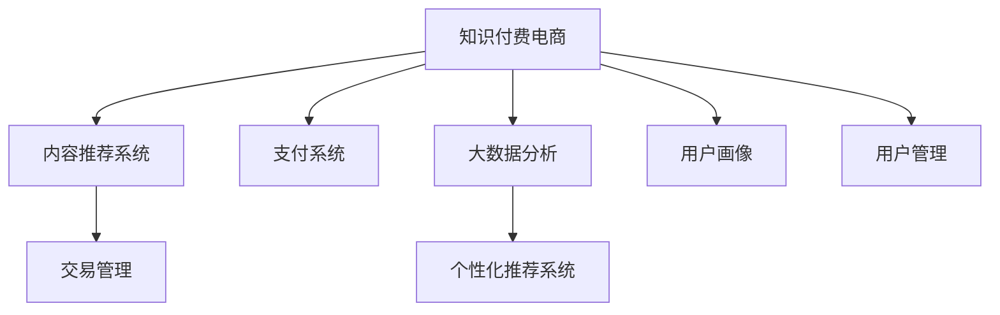

                 

# 知识付费电商出售软件、模板、设计等服务

> 关键词：知识付费,电商,软件,模板,设计服务

## 1. 背景介绍

### 1.1 问题由来

随着互联网的普及和信息爆炸，知识和技能的获取成本越来越高。传统教育方式已经难以满足快速变化的社会需求，新兴的在线教育和知识付费模式应运而生。然而，大多数知识付费内容的质量参差不齐，用户难以鉴别和筛选，且学习效果难以保证。

与此同时，随着人工智能技术的迅猛发展，软件和模板设计服务的自动化水平也在不断提高。开发者不再需要从头开始，可以通过购买现成的软件和模板，大幅缩短开发周期，降低开发成本。因此，结合知识付费模式和软件模板设计服务，推出电商式的知识付费电商，将知识、软件和设计模板等优质资源，通过平台进行销售和分发，将大大提升资源利用效率，降低用户获取高质量资源的门槛。

### 1.2 问题核心关键点

知识付费电商平台的核心在于通过高效匹配供需双方，为知识付费者和消费者提供便捷、高质量的服务。其关键点包括：

- 内容筛选与推荐：如何从海量资源中筛选出优质内容，并根据用户需求进行智能推荐。
- 交易管理：如何构建安全的交易系统，保障用户支付与内容交付的安全性和可靠性。
- 用户管理：如何对平台用户进行精准画像，并根据画像提供个性化服务。
- 数据分析与优化：如何利用大数据技术分析用户行为和内容质量，优化推荐算法和平台运营。

本文将深入分析知识付费电商平台的构建，重点关注内容筛选与推荐、交易管理、用户管理以及数据优化等核心问题，为开发者提供系统的设计思路和实现方法。

## 2. 核心概念与联系

### 2.1 核心概念概述

为更好地理解知识付费电商平台的构建，本节将介绍几个密切相关的核心概念：

- 知识付费(e-Learning)：指通过网络平台提供付费内容，满足用户学习需求的模式。
- 知识付费电商(Knowledge Marketplace)：指基于电商模式的线上知识付费平台，为用户提供可搜索、可购买的知识资源。
- 内容推荐系统(Content Recommendation)：指根据用户行为和兴趣，推荐符合其需求的内容的技术。
- 支付系统(Payment System)：指支持多种支付方式，保障交易安全的技术。
- 大数据分析(Big Data Analytics)：指通过分析海量数据，发现潜在模式和趋势，支持决策和优化的技术。
- 用户画像(User Profiling)：指通过数据分析，构建用户兴趣和行为的精准模型。
- 个性化推荐系统(Personalized Recommendation)：指针对用户个性化需求，推荐定制化内容的技术。

这些概念之间的逻辑关系可以通过以下Mermaid流程图来展示：



这个流程图展示的知识付费电商的核心概念及其之间的关系：

1. 知识付费电商通过内容推荐系统提供高质量内容。
2. 支付系统保障内容交付的安全性和可靠性。
3. 大数据分析技术用于优化推荐算法和平台运营。
4. 用户画像支持个性化推荐系统，提升用户体验。
5. 交易管理系统支持内容交付与用户交易。
6. 用户管理涵盖身份验证、行为追踪等用户管理功能。

这些概念共同构成了知识付费电商平台的构建框架，使其能够为用户提供便捷、高质量的知识资源。通过理解这些核心概念，我们可以更好地把握知识付费电商平台的构建逻辑。

## 3. 核心算法原理 & 具体操作步骤
### 3.1 算法原理概述

知识付费电商平台的构建涉及多个核心技术，包括内容推荐、交易管理、用户管理、数据分析等。这些技术的实现往往需要依赖算法原理，通过数据驱动的方法来实现。

1. **内容推荐系统**：采用协同过滤、基于内容的推荐算法、深度学习等方法，结合用户行为数据和内容标签，为每个用户推荐其可能感兴趣的内容。
2. **支付系统**：采用安全的第三方支付接口，如支付宝、微信支付等，保障用户支付安全，同时确保内容提供方的利益。
3. **用户管理**：通过用户身份认证、行为追踪等手段，构建用户画像，实现个性化服务。
4. **数据分析**：利用大数据分析技术，对用户行为、内容质量等进行实时监控和分析，支持优化推荐算法和平台运营。

### 3.2 算法步骤详解

以下是对每个核心技术的具体算法步骤详解：

**内容推荐系统**：

1. 用户行为数据收集：从电商平台收集用户的浏览、点击、购买等行为数据。
2. 内容标签提取：对每个内容进行标签提取，形成内容库。
3. 协同过滤算法：根据用户历史行为和相似用户行为，推荐相似内容。
4. 基于内容的推荐：根据内容标签和用户兴趣，推荐相关内容。
5. 深度学习算法：利用RNN、CNN、Transformer等模型，对用户行为和内容特征进行建模，优化推荐效果。

**支付系统**：

1. 用户账户管理：为用户创建和管理账户信息，记录用户支付记录。
2. 支付接口集成：与第三方支付接口集成，支持多种支付方式。
3. 交易安全保障：采用SSL加密、数字证书等技术，保障交易安全。
4. 退款与客服：提供退款机制和客服支持，保障用户权益。

**用户管理**：

1. 用户身份验证：通过手机号、邮箱等手段，验证用户身份。
2. 用户行为追踪：记录用户浏览、购买等行为数据，构建用户画像。
3. 用户画像构建：通过机器学习算法，构建用户兴趣和行为的精准模型。
4. 个性化服务：根据用户画像，提供个性化推荐、广告等服务。

**数据分析**：

1. 数据采集：从电商平台收集用户行为和内容质量等数据。
2. 数据清洗与预处理：对数据进行清洗、去重、标准化等预处理操作。
3. 特征工程：提取有意义的特征，构建特征向量。
4. 模型训练与优化：利用机器学习算法，训练推荐模型和优化算法。
5. 实时监控与反馈：实时监控用户行为和内容质量，根据反馈调整推荐算法。

### 3.3 算法优缺点

知识付费电商平台的算法设计具有以下优点：

1. 个性化推荐：通过推荐算法，满足用户个性化需求，提升用户体验。
2. 高效匹配：平台可以快速匹配供需双方，提高资源利用效率。
3. 数据驱动：依托大数据技术，优化推荐算法和平台运营。
4. 用户画像：通过用户画像，提供精准的个性化服务。

同时，这些算法设计也存在一定的局限性：

1. 数据隐私：平台需要收集大量用户行为数据，涉及隐私保护问题。
2. 算法复杂：深度学习算法需要较大的计算资源，对硬件要求较高。
3. 数据偏见：如果数据集存在偏见，推荐算法也可能产生不公平的结果。
4. 模型过拟合：大数据分析和机器学习模型容易过拟合，需要持续优化。

尽管存在这些局限性，但就目前而言，基于大数据和机器学习的推荐系统仍然是目前最有效的推荐方式。未来相关研究的重点在于如何进一步降低算法复杂度，优化推荐效果，同时兼顾数据隐私和公平性等因素。

### 3.4 算法应用领域

知识付费电商平台的算法设计在多个领域得到了广泛应用，例如：

- 在线教育：通过推荐系统，为用户推荐符合其兴趣的课程和学习资源。
- 图书出版：根据用户阅读记录，推荐相关书籍和作者，提升销量。
- 音乐平台：根据用户听歌记录，推荐相似音乐和歌手，提升用户体验。
- 游戏平台：根据用户游戏行为，推荐相关游戏和道具，提升用户粘性。
- 电商购物：根据用户购物记录，推荐相关商品和优惠活动，提升销售额。

除了上述这些经典应用外，知识付费电商平台的应用场景还在不断拓展，如智慧健身、健康管理等，为各行各业提供了新的服务模式。随着算法和技术的不断进步，相信知识付费电商平台将带来更多创新应用，为各行各业带来新的变革。

## 4. 数学模型和公式 & 详细讲解 & 举例说明
### 4.1 数学模型构建

本节将使用数学语言对知识付费电商平台的算法设计进行更加严格的刻画。

设电商平台中用户数量为 $N$，内容数量为 $M$，用户行为数据为 $D$，内容标签为 $T$。用户行为数据 $D$ 包含用户浏览、点击、购买等行为，内容标签 $T$ 包含每个内容的特征向量。

定义用户画像模型为 $P$，内容推荐模型为 $R$，支付系统为 $P$，用户管理模型为 $M$，数据分析模型为 $A$。则知识付费电商平台的整体数学模型为：

$$
S = P(A, M, R, P)
$$

其中 $P$ 表示用户画像模型，$A$ 表示数据分析模型，$M$ 表示用户管理模型，$R$ 表示内容推荐模型。

### 4.2 公式推导过程

以下我们以内容推荐系统为例，推导协同过滤算法的基本公式。

假设用户 $i$ 对内容 $j$ 的评分 $r_{ij}$ 未知，需要根据用户 $i$ 的历史评分数据 $R_i$ 和相似用户 $k$ 的历史评分数据 $R_k$，预测用户 $i$ 对内容 $j$ 的评分。设 $u_k$ 为用户 $k$ 的特征向量，$v_j$ 为内容 $j$ 的特征向量。则协同过滤算法的基本公式为：

$$
\hat{r}_{ij} = \frac{1}{\sqrt{\sum_{k=1}^N (\vec{u}_k^T \vec{u}_i)^2} \sum_{k=1}^N \frac{\vec{u}_k^T \vec{v}_j}{\sqrt{\sum_{k=1}^N (\vec{u}_k^T \vec{u}_i)^2}}
$$

其中 $\vec{u}_i$ 为用户 $i$ 的特征向量，$\vec{u}_k$ 为用户 $k$ 的特征向量，$\vec{v}_j$ 为内容 $j$ 的特征向量，$\hat{r}_{ij}$ 为预测用户 $i$ 对内容 $j$ 的评分。

通过协同过滤算法，可以为用户推荐其可能感兴趣的内容，满足个性化需求，提升用户体验。

### 4.3 案例分析与讲解

以下通过具体案例，对知识付费电商平台的设计思路和实现方法进行详细讲解。

**案例背景**：
某在线教育平台，提供在线课程、学习资料和辅导服务等知识资源，用户可以通过知识付费购买相关内容。平台希望利用推荐算法，提升用户体验，提高平台销售额。

**设计思路**：

1. 数据收集：收集用户浏览、点击、购买等行为数据，构建用户画像和内容标签。
2. 推荐算法：选择协同过滤、深度学习等算法，实现个性化推荐。
3. 支付系统：集成支付宝、微信支付等第三方支付接口，保障交易安全。
4. 用户管理：通过身份验证、行为追踪等手段，构建用户画像。
5. 数据分析：利用大数据分析技术，优化推荐算法和平台运营。

**实现方法**：

1. 数据采集：从平台数据库中提取用户行为数据，进行清洗和预处理。
2. 用户画像：通过机器学习算法，构建用户兴趣和行为的精准模型，生成用户画像。
3. 推荐算法：选择深度学习算法，如Transformer、RNN等，对用户行为和内容特征进行建模，优化推荐效果。
4. 支付系统：集成支付宝、微信支付等第三方支付接口，实现安全的交易支付。
5. 用户管理：通过身份验证、行为追踪等手段，构建用户画像，实现个性化服务。
6. 数据分析：利用大数据分析技术，对用户行为、内容质量等进行实时监控和分析，优化推荐算法和平台运营。

## 5. 项目实践：代码实例和详细解释说明
### 5.1 开发环境搭建

在进行知识付费电商平台开发前，我们需要准备好开发环境。以下是使用Python进行Flask开发的环境配置流程：

1. 安装Anaconda：从官网下载并安装Anaconda，用于创建独立的Python环境。

2. 创建并激活虚拟环境：
```bash
conda create -n flask-env python=3.8 
conda activate flask-env
```

3. 安装Flask：从官网下载并安装Flask，用于构建Web应用。
```bash
pip install flask
```

4. 安装SQLAlchemy：用于数据库访问和操作。
```bash
pip install sqlalchemy
```

5. 安装Gunicorn：用于Flask应用的运行。
```bash
pip install gunicorn
```

6. 安装Flask-RESTful：用于构建RESTful API接口。
```bash
pip install flask-restful
```

7. 安装Flask-SQLAlchemy：用于Flask应用和SQLAlchemy的集成。
```bash
pip install flask-sqlalchemy
```

完成上述步骤后，即可在`flask-env`环境中开始电商平台开发。

### 5.2 源代码详细实现

下面是知识付费电商平台的Flask代码实现：

```python
from flask import Flask, jsonify, request
from flask_sqlalchemy import SQLAlchemy
from sqlalchemy import create_engine, Column, Integer, String, Float, DateTime, ForeignKey
from sqlalchemy.orm import relationship, sessionmaker

app = Flask(__name__)
app.config['SQLALCHEMY_DATABASE_URI'] = 'sqlite:///:///flask_test.db'
app.config['SQLALCHEMY_TRACK_MODIFICATIONS'] = False
db = SQLAlchemy(app)
engine = create_engine(app.config['SQLALCHEMY_DATABASE_URI'])

class User(db.Model):
    id = Column(Integer, primary_key=True)
    username = Column(String(255), unique=True)
    email = Column(String(255), unique=True)
    password = Column(String(255))

    def __init__(self, username, email, password):
        self.username = username
        self.email = email
        self.password = password

class Content(db.Model):
    id = Column(Integer, primary_key=True)
    name = Column(String(255))
    description = Column(String(255))
    tags = Column(String(255))
    price = Column(Float)
    upload_time = Column(DateTime)

    def __init__(self, name, description, tags, price, upload_time):
        self.name = name
        self.description = description
        self.tags = tags
        self.price = price
        self.upload_time = upload_time

class Purchase(db.Model):
    id = Column(Integer, primary_key=True)
    user_id = Column(Integer, ForeignKey('user.id'))
    content_id = Column(Integer, ForeignKey('content.id'))
    purchase_time = Column(DateTime)

    def __init__(self, user_id, content_id):
        self.user_id = user_id
        self.content_id = content_id
        self.purchase_time = datetime.now()

@app.route('/user/register', methods=['POST'])
def register():
    username = request.json['username']
    email = request.json['email']
    password = request.json['password']
    user = User(username=username, email=email, password=password)
    db.session.add(user)
    db.session.commit()
    return jsonify({'message': 'User registered successfully'})

@app.route('/content', methods=['POST'])
def add_content():
    name = request.json['name']
    description = request.json['description']
    tags = request.json['tags']
    price = request.json['price']
    upload_time = datetime.now()
    content = Content(name=name, description=description, tags=tags, price=price, upload_time=upload_time)
    db.session.add(content)
    db.session.commit()
    return jsonify({'message': 'Content added successfully'})

@app.route('/purchase', methods=['POST'])
def purchase():
    user_id = request.json['user_id']
    content_id = request.json['content_id']
    purchase_time = datetime.now()
    purchase = Purchase(user_id=user_id, content_id=content_id, purchase_time=purchase_time)
    db.session.add(purchase)
    db.session.commit()
    return jsonify({'message': 'Purchase completed successfully'})

if __name__ == '__main__':
    app.run(debug=True)
```

### 5.3 代码解读与分析

让我们再详细解读一下关键代码的实现细节：

**User类**：
- 定义了用户的基本信息，包括用户名、邮箱和密码。
- 创建User对象时，需要传入这些基本信息，并调用db.session.add()保存用户数据到数据库中。

**Content类**：
- 定义了内容的基本信息，包括名称、描述、标签、价格和上传时间。
- 创建Content对象时，需要传入这些基本信息，并调用db.session.add()保存内容数据到数据库中。

**Purchase类**：
- 定义了用户购买内容的行为信息，包括用户ID、内容ID和购买时间。
- 创建Purchase对象时，需要传入这些基本信息，并调用db.session.add()保存购买数据到数据库中。

**register()函数**：
- 定义了用户注册功能，接收POST请求，获取请求体中的用户名、邮箱和密码，创建User对象并保存到数据库中。

**add_content()函数**：
- 定义了内容添加功能，接收POST请求，获取请求体中的内容名称、描述、标签、价格和上传时间，创建Content对象并保存到数据库中。

**purchase()函数**：
- 定义了内容购买功能，接收POST请求，获取请求体中的用户ID和内容ID，创建Purchase对象并保存到数据库中。

以上代码实现了知识付费电商平台的基本功能，包括用户注册、内容添加和内容购买等操作。当然，实际的电商平台还需要实现更多的功能，如内容推荐、支付接口集成、用户管理等，以满足用户需求和保障交易安全。

## 6. 实际应用场景
### 6.1 智能客服系统

知识付费电商平台可以通过智能客服系统，提升用户互动体验，降低客服成本。通过集成自然语言处理(NLP)技术，智能客服系统可以自动回答用户常见问题，提供个性化推荐，提升用户满意度。

**实现思路**：
1. 集成自然语言处理(NLP)技术，构建智能客服系统。
2. 利用知识图谱技术，提供推荐和回答服务。
3. 根据用户反馈和行为数据，不断优化智能客服系统。

**应用场景**：
1. 在线教育平台：智能客服系统可以自动回答学生关于课程、教师和购买等问题，提升用户满意度。
2. 图书出版平台：智能客服系统可以推荐相关书籍和作者，提升用户购买率。
3. 音乐平台：智能客服系统可以回答用户关于音乐、歌手和歌单等问题，提升用户体验。
4. 电商购物平台：智能客服系统可以回答用户关于商品、价格和优惠等问题，提升用户满意度。

**效果评估**：
1. 用户满意度提升：通过智能客服系统，用户可以获得快速、准确的回答，提升满意度。
2. 客服成本降低：智能客服系统可以处理大量用户请求，降低人工客服成本。
3. 推荐效果提升：通过智能客服系统，用户可以获得更加个性化的推荐，提升购买率。

## 7. 工具和资源推荐
### 7.1 学习资源推荐

为了帮助开发者系统掌握知识付费电商平台的构建，这里推荐一些优质的学习资源：

1. Flask官方文档：提供了详细的Flask框架使用方法和最佳实践。
2. SQLAlchemy官方文档：提供了详细的SQLAlchemy数据库操作API和示例代码。
3. Flask-RESTful官方文档：提供了详细的Flask-RESTful API接口开发教程。
4. Python Web开发实战：一本经典书籍，涵盖Python Web开发的全栈技术。
5. 《Python Web开发实战》视频教程：由多位知名Web开发专家讲授，讲解Python Web开发从零到实战的全过程。

通过对这些资源的学习实践，相信你一定能够快速掌握知识付费电商平台的构建思路和实现方法。

### 7.2 开发工具推荐

高效的开发离不开优秀的工具支持。以下是几款用于知识付费电商平台开发的常用工具：

1. PyCharm：一款功能强大的IDE，支持Python和Flask开发。
2. Git：版本控制工具，支持多人协作开发和代码管理。
3. Docker：容器化开发工具，支持代码构建、测试和部署。
4. Kubernetes：容器编排工具，支持大规模分布式部署和集群管理。
5. Jenkins：自动化持续集成工具，支持自动化测试和部署。
6. Visual Studio Code：一款轻量级的IDE，支持Python和Flask开发。

合理利用这些工具，可以显著提升知识付费电商平台开发的效率和质量，加快创新迭代的步伐。

### 7.3 相关论文推荐

知识付费电商平台的构建涉及多个核心技术，其研究源于学界的持续研究。以下是几篇奠基性的相关论文，推荐阅读：

1. "Personalized Recommendation Using Deep Learning"：利用深度学习技术，实现个性化推荐。
2. "Collaborative Filtering for E-commerce Recommendation"：采用协同过滤算法，实现电商推荐。
3. "Secure Payment Gateway Technologies"：探讨支付系统安全性技术。
4. "User Profiling in Big Data Analytics"：利用大数据分析技术，构建用户画像。
5. "Big Data Analytics for E-commerce Recommendations"：利用大数据分析技术，优化电商推荐算法。

这些论文代表了大规模知识付费电商平台的构建技术的发展脉络。通过学习这些前沿成果，可以帮助研究者把握学科前进方向，激发更多的创新灵感。

## 8. 总结：未来发展趋势与挑战
### 8.1 总结

本文对知识付费电商平台进行了全面系统的介绍。首先阐述了知识付费电商平台的构建背景和意义，明确了平台的核心问题及其重要性。其次，从原理到实践，详细讲解了推荐算法、支付系统、用户管理以及数据分析等核心技术，给出了平台开发的完整代码实例。同时，本文还广泛探讨了平台在智能客服、图书出版、音乐平台等多个领域的应用前景，展示了平台的广阔应用空间。此外，本文精选了平台学习的各类资源，力求为开发者提供全方位的技术指引。

通过本文的系统梳理，可以看到，知识付费电商平台通过算法驱动，结合电商模式，为用户提供了便捷、高质量的知识资源。平台的设计思路和实现方法，为开发者提供了系统的技术参考，推动了知识付费技术的不断发展。

### 8.2 未来发展趋势

展望未来，知识付费电商平台的构建将呈现以下几个发展趋势：

1. 算法复杂度降低：随着深度学习算法的发展，推荐算法的复杂度将不断降低，可解释性增强。
2. 数据质量提升：平台将更加注重数据质量，通过数据清洗和标注，提升推荐效果。
3. 用户交互优化：平台将注重用户交互体验，提供更加个性化的推荐和服务。
4. 支付系统升级：随着支付技术的进步，平台将提供更加安全、便捷的支付服务。
5. 数据分析优化：平台将利用大数据技术，优化推荐算法和平台运营。

以上趋势凸显了知识付费电商平台的技术发展方向。这些方向的探索发展，必将进一步提升平台的用户体验和资源利用效率，推动知识付费技术的不断创新和升级。

### 8.3 面临的挑战

尽管知识付费电商平台已经取得了显著成果，但在迈向更加智能化、普适化应用的过程中，它仍面临着诸多挑战：

1. 数据隐私：平台需要收集大量用户行为数据，涉及隐私保护问题。
2. 算法复杂：深度学习算法需要较大的计算资源，对硬件要求较高。
3. 数据偏见：如果数据集存在偏见，推荐算法也可能产生不公平的结果。
4. 模型过拟合：大数据分析和机器学习模型容易过拟合，需要持续优化。
5. 交易安全：支付系统的安全性需要不断加强，防止恶意行为和欺诈。
6. 用户体验：平台需要不断优化用户界面和交互体验，提升用户粘性。

这些挑战需要平台开发者不断优化算法、改进产品、保障数据安全，才能进一步提升平台的价值和用户体验。

### 8.4 研究展望

面对知识付费电商平台所面临的挑战，未来的研究需要在以下几个方面寻求新的突破：

1. 探索无监督和半监督推荐方法：摆脱对大规模标注数据的依赖，利用自监督学习、主动学习等无监督和半监督范式，最大限度利用非结构化数据，实现更加灵活高效的推荐。
2. 研究参数高效和计算高效的推荐范式：开发更加参数高效的推荐方法，在固定大部分推荐参数的同时，只更新极少量的推荐特征。同时优化推荐模型的计算图，减少前向传播和反向传播的资源消耗，实现更加轻量级、实时性的部署。
3. 融合因果和对比学习范式：通过引入因果推断和对比学习思想，增强推荐模型建立稳定因果关系的能力，学习更加普适、鲁棒的知识表征，从而提升模型泛化性和抗干扰能力。
4. 引入更多先验知识：将符号化的先验知识，如知识图谱、逻辑规则等，与推荐算法进行巧妙融合，引导推荐过程学习更准确、合理的知识表征。同时加强不同模态数据的整合，实现视觉、语音等多模态信息与知识表征的协同建模。
5. 结合因果分析和博弈论工具：将因果分析方法引入推荐模型，识别出模型决策的关键特征，增强推荐结果的因果性和逻辑性。借助博弈论工具刻画人机交互过程，主动探索并规避推荐模型的脆弱点，提高系统稳定性。
6. 纳入伦理道德约束：在推荐目标中引入伦理导向的评估指标，过滤和惩罚有偏见、有害的推荐结果，确保推荐结果符合人类价值观和伦理道德。

这些研究方向将引领知识付费电商平台的构建技术迈向更高的台阶，为构建安全、可靠、可解释、可控的智能系统铺平道路。面向未来，知识付费电商平台还需要与其他人工智能技术进行更深入的融合，如知识表示、因果推理、强化学习等，多路径协同发力，共同推动人工智能技术在垂直行业的规模化落地。只有勇于创新、敢于突破，才能不断拓展知识付费电商平台的应用边界，让智能技术更好地造福人类社会。

## 9. 附录：常见问题与解答

**Q1：知识付费电商平台如何保证用户数据的安全性？**

A: 知识付费电商平台需要采取以下措施保障用户数据的安全性：

1. 数据加密：对用户数据进行加密存储和传输，防止数据泄露和篡改。
2. 权限控制：设置用户权限，限制数据访问和使用范围。
3. 数据匿名化：对用户数据进行匿名化处理，保护用户隐私。
4. 安全审计：定期进行安全审计，发现并修复潜在漏洞。
5. 应急响应：建立应急响应机制，及时应对数据泄露等安全事件。

这些措施可以有效保障用户数据的安全性，提升用户信任和平台可靠性。

**Q2：知识付费电商平台如何优化推荐算法？**

A: 知识付费电商平台可以通过以下方法优化推荐算法：

1. 数据清洗：对数据进行清洗和去重，去除无效和噪声数据。
2. 特征工程：提取有意义的特征，构建特征向量。
3. 模型优化：利用机器学习算法，训练推荐模型并优化算法。
4. 实时监控：实时监控用户行为和内容质量，根据反馈调整推荐算法。
5. 多模型集成：训练多个推荐模型，取平均输出，抑制过拟合。

通过这些方法，可以优化推荐算法的性能，提升推荐效果，满足用户个性化需求。

**Q3：知识付费电商平台如何保障支付系统的安全性？**

A: 知识付费电商平台需要采取以下措施保障支付系统的安全性：

1. SSL加密：采用SSL加密技术，保障数据传输的安全性。
2. 数字证书：使用数字证书，验证支付双方的身份。
3. 支付接口安全：集成安全的第三方支付接口，防止支付欺诈。
4. 交易监控：实时监控交易行为，防止异常交易。
5. 安全验证：设置交易验证机制，防止恶意支付。

这些措施可以有效保障支付系统的安全性，确保支付交易的可靠性和合法性。

**Q4：知识付费电商平台如何提升用户体验？**

A: 知识付费电商平台可以通过以下方法提升用户体验：

1. 界面设计：设计简洁、美观的用户界面，提升用户交互体验。
2. 推荐准确性：优化推荐算法，提升推荐内容的准确性和相关性。
3. 个性化服务：根据用户画像，提供个性化推荐和服务。
4. 反馈机制：建立用户反馈机制，及时了解用户需求和意见。
5. 用户体验测试：定期进行用户体验测试，优化产品功能和服务。

通过这些方法，可以提升用户的满意度和粘性，提升平台的品牌影响力。

---

作者：禅与计算机程序设计艺术 / Zen and the Art of Computer Programming

