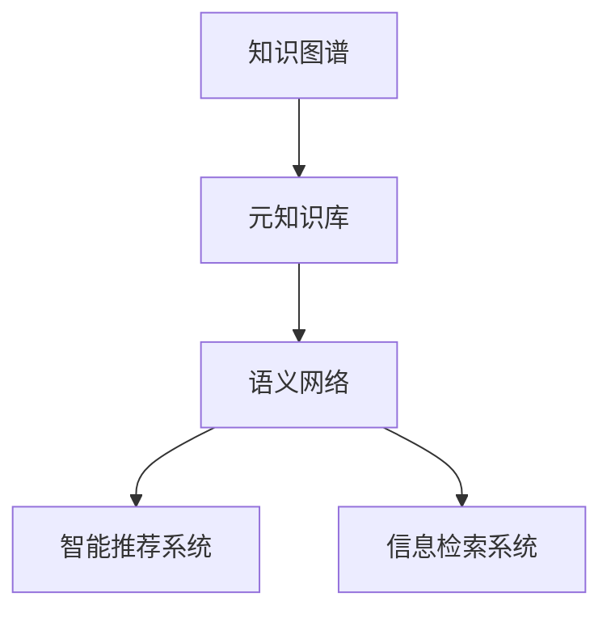

                 

# 知识体系的构建：从基本元素到复杂结构

> 关键词：知识图谱，语义网络，元知识库，智能推荐，信息检索，自动学习

## 1. 背景介绍

### 1.1 问题由来
随着互联网技术的飞速发展，人类获取知识的方式发生了深刻变化。从传统的纸质书籍、报刊到网络搜索、电子阅读器，再到如今的语音助手、人工智能推荐系统，我们的学习和生活方式已经变得更加便捷和高效。然而，知识爆炸也带来了新的挑战：海量的信息需要被整理、筛选和分类，才能为我们所用。因此，构建一个高效的知识体系，使我们能够迅速准确地获取所需信息，成为当前研究的热点之一。

### 1.2 问题核心关键点
构建知识体系的核心在于如何将知识进行结构化、系统化的组织。从基本元素到复杂结构，构建知识体系可以分为以下几个关键步骤：

1. **知识元素的定义**：明确哪些信息构成了知识体系的基本单元，如事实、概念、关系等。
2. **元知识库的构建**：利用计算机技术和人工智能算法，将知识元素组织成一个或多个层次化的数据库。
3. **语义网络的构建**：使用图形结构描述知识元素之间的关系，形成一个语义网络。
4. **智能推荐与信息检索**：在知识体系的基础上，通过机器学习算法实现智能推荐和信息检索，提升用户获取信息的速度和准确性。
5. **自动学习与知识更新**：利用自动化算法，从互联网等外部数据源持续学习新知识，更新现有知识体系。

## 2. 核心概念与联系

### 2.1 核心概念概述

为更好地理解知识体系的构建过程，本节将介绍几个密切相关的核心概念：

- **知识图谱(Knowledge Graph)**：通过语义网络的方式，将知识元素组织成一个或多个层次化的数据库，表示实体及其之间的关系。
- **元知识库(Metaknowledge Base)**：包含了关于知识元素的元信息，如定义、关系、来源等，用于构建和维护知识体系。
- **语义网络(Semantic Network)**：使用图形结构描述知识元素之间的语义关系，如实体之间的属性、类型、实例等。
- **智能推荐系统(Intelligent Recommendation System)**：基于用户的行为数据和知识体系，通过算法为用户推荐相关信息。
- **信息检索系统(Information Retrieval System)**：使用算法和索引技术，从大量数据中快速检索出满足用户查询需求的信息。

这些核心概念之间的逻辑关系可以通过以下Mermaid流程图来展示：



这个流程图展示了知识体系的构建过程：

1. 从元知识库构建知识图谱。
2. 通过语义网络表示知识元素之间的关系。
3. 基于知识图谱实现智能推荐和信息检索。

## 3. 核心算法原理 & 具体操作步骤
### 3.1 算法原理概述

构建知识体系的过程本质上是一个从数据到模型的映射过程。其核心思想是：将原始数据转换为知识图谱，通过语义网络表示实体间的关系，并在此基础上实现智能推荐和信息检索。

形式化地，假设原始数据集为 $D=\{x_1, x_2, \dots, x_n\}$，其中 $x_i$ 表示一个事实或概念。构建知识体系的过程可以分为以下几个步骤：

1. **实体抽取**：从数据中抽取实体，并将它们映射到知识图谱中的节点。
2. **关系抽取**：识别实体之间的关系，并将它们映射到知识图谱中的边。
3. **知识融合**：将抽取的实体和关系进行语义上的融合，形成一个层次化的语义网络。
4. **智能推荐**：基于用户的行为数据和知识图谱，通过算法为用户推荐相关信息。
5. **信息检索**：使用算法和索引技术，从知识图谱中快速检索出满足用户查询需求的信息。

### 3.2 算法步骤详解

构建知识体系的一般流程包括：

**Step 1: 数据预处理**
- 收集数据源：从互联网、书籍、数据库等获取相关数据。
- 清洗和预处理：去除噪声数据、标准化数据格式、处理缺失值等。

**Step 2: 实体抽取**
- 利用自然语言处理技术，如命名实体识别(NER)、词性标注等，从文本中抽取实体。
- 将实体映射到知识图谱中的节点。

**Step 3: 关系抽取**
- 利用机器学习算法，如分类器、关系抽取器等，识别实体之间的关系。
- 将关系映射到知识图谱中的边。

**Step 4: 知识融合**
- 使用语义网络表示实体之间的关系，形成一个层次化的知识图谱。
- 利用元知识库提供的信息，对知识图谱进行补全和优化。

**Step 5: 智能推荐与信息检索**
- 基于知识图谱，使用算法（如协同过滤、基于内容的推荐等）实现智能推荐。
- 利用索引技术和算法，如倒排索引、搜索引擎等，实现快速的信息检索。

### 3.3 算法优缺点

构建知识体系的方法具有以下优点：
1. 系统化结构：通过语义网络将知识元素组织成一个层次化的数据库，便于管理和查询。
2. 高效检索：使用倒排索引等技术，可以快速检索出满足用户需求的信息。
3. 个性化推荐：基于用户行为数据和知识图谱，实现个性化的信息推荐。
4. 动态更新：通过自动学习算法，持续更新知识图谱，保持信息的时效性和准确性。

同时，该方法也存在一些局限性：
1. 数据获取成本高：构建知识体系需要大量高质量的数据，数据获取和预处理成本较高。
2. 算法复杂度高：知识融合、智能推荐等步骤需要复杂的算法实现，实现难度较大。
3. 数据更新挑战：知识图谱需要定期更新，以保持信息的最新性，但更新过程复杂，工作量大。
4. 模型泛化能力有限：知识图谱通常依赖特定的领域或场景，泛化能力有限，难以应对复杂多变的应用需求。
5. 隐私和安全问题：知识图谱中可能包含敏感信息，需要采取相应的隐私保护和安全措施。

尽管存在这些局限性，但构建知识体系的方法在信息管理和智能推荐等领域已得到了广泛应用，成为构建信息系统的核心技术之一。

### 3.4 算法应用领域

构建知识体系的方法在多个领域都有广泛应用，包括但不限于：

- **图书馆和博物馆**：通过知识图谱管理图书、文物等信息，提供智能化的信息检索和推荐服务。
- **电商和零售**：利用知识图谱优化商品推荐，提高用户购物体验。
- **金融和保险**：通过知识图谱进行风险评估、欺诈检测等金融分析。
- **医疗和健康**：利用知识图谱进行疾病诊断、药物推荐等医疗信息管理。
- **教育和学习**：构建学习知识图谱，提供个性化的学习路径和资源推荐。
- **社交媒体**：通过知识图谱进行信息过滤、内容推荐等社交媒体管理。

## 4. 数学模型和公式 & 详细讲解 & 举例说明
### 4.1 数学模型构建

本节将使用数学语言对构建知识体系的过程进行更加严格的刻画。

假设知识图谱由实体 $E$ 和关系 $R$ 构成，其中 $E=\{e_1, e_2, \dots, e_n\}$，$R=\{r_1, r_2, \dots, r_m\}$。设每个实体 $e_i$ 包含属性 $A$，每个关系 $r_j$ 包含属性 $B$。知识图谱可以用三元组 $(e_i, r_j, e_k)$ 表示，其中 $e_i$ 和 $e_k$ 为实体，$r_j$ 为关系。

定义实体之间的关系 $r_j$ 为 $(r_{i,j}^{k})$，其中 $r_{i,j}^{k}$ 表示实体 $e_i$ 和 $e_k$ 之间存在关系 $r_j$。知识图谱可以用语义网络表示为：

$$
\mathcal{G} = (E, R, A, B, \mathcal{E})
$$

其中 $A$ 和 $B$ 为属性集合，$\mathcal{E}$ 为三元组集合。

### 4.2 公式推导过程

以下我们以医疗知识图谱为例，推导知识图谱的构建和查询公式。

假设医疗知识图谱包含疾病、药物、治疗等实体和它们之间的关系。我们可以使用以下公式描述实体和关系：

- 疾病 $d_i$：包含症状、类型、传播途径等属性。
- 药物 $m_j$：包含成分、剂量、副作用等属性。
- 治疗 $t_k$：包含方法、效果、风险等属性。
- 关系 $r_l$：如疾病与药物的关系、疾病与治疗的关系等。

知识图谱可以用以下三元组表示：

$$
\mathcal{G} = \{(d_i, r_{d,m}^{d}, m_j), (d_i, r_{d,t}^{t}, t_k)\}
$$

其中 $r_{d,m}^{d}$ 表示疾病与药物的关系，$r_{d,t}^{t}$ 表示疾病与治疗的关系。

假设用户查询“X疾病治疗”，查询结果可以通过以下步骤实现：

1. 通过语义网络，查询与“X疾病”相关的治疗 $t_k$。
2. 通过索引和算法，快速检索出与 $t_k$ 相关的药物 $m_j$。
3. 返回结果：“X疾病”相关的治疗和药物。

### 4.3 案例分析与讲解

假设我们要构建一个包含医学知识的在线问答系统。我们可以按照以下步骤实现：

1. **数据收集**：收集医学文献、临床试验、患者记录等数据，作为知识图谱的数据源。
2. **数据预处理**：清洗和标准化数据，去除噪声和冗余信息。
3. **实体抽取**：使用命名实体识别(NER)技术，从文本中抽取疾病、药物、症状等实体。
4. **关系抽取**：使用关系抽取器，识别实体之间的关系。
5. **知识融合**：将抽取的实体和关系进行语义上的融合，形成一个层次化的语义网络。
6. **智能推荐**：基于用户行为数据和知识图谱，为用户推荐相关疾病、药物和治疗。
7. **信息检索**：使用倒排索引等技术，实现快速的信息检索。

通过上述步骤，我们可以构建一个完整的医学知识图谱，并基于其提供智能化的问答服务。

## 5. 项目实践：代码实例和详细解释说明
### 5.1 开发环境搭建

在进行知识图谱构建实践前，我们需要准备好开发环境。以下是使用Python进行SPARQL查询的环境配置流程：

1. 安装RDF库：从官网下载并安装RDF库，用于处理和查询RDF数据。
2. 安装Python-SPARQL库：使用pip安装Python-SPARQL库，用于执行SPARQL查询。

```bash
pip install rdf
pip install python-sparql
```

完成上述步骤后，即可在本地环境中开始构建知识图谱的实践。

### 5.2 源代码详细实现

下面我们以医疗知识图谱为例，给出使用RDF库和Python-SPARQL库进行知识图谱构建的Python代码实现。

首先，定义知识图谱的RDF模型：

```python
from rdf import RDF
from rdf.namespace import Namespace

# 定义命名空间
ns = Namespace('http://example.org/')

# 定义实体和关系
disease = ns['disease']
drug = ns['drug']
treatment = ns['treatment']
relation_disease_drug = ns['relation_disease_drug']
relation_disease_treatment = ns['relation_disease_treatment']

# 构建知识图谱
g = RDF()
g.add((disease('X'), relation_disease_drug, drug('A')))
g.add((disease('X'), relation_disease_treatment, treatment('B')))
```

然后，执行SPARQL查询：

```python
from sparql import Sparql

# 创建Sparql对象
sparql = Sparql(g)

# 查询与疾病相关的治疗和药物
query = '''
SELECT ?d, ?m, ?t
WHERE {
  ?d <{}:relation_disease_drug> <{}:drug> ?m .
  ?d <{}:relation_disease_treatment> <{}:t> .
  FILTER (?d = <{}:X>)
}
ORDER BY ?m ASC
LIMIT 10
'''.format(ns, ns, ns, ns, ns)

# 执行查询
results = sparql.query(query)

# 打印结果
for result in results:
    print(result)
```

最后，保存知识图谱和查询结果：

```python
g.save('graph.ttl')
results.save('results.ttl')
```

以上就是使用RDF和Python-SPARQL构建医疗知识图谱的完整代码实现。可以看到，利用这些工具，我们可以方便地构建和查询知识图谱，实现智能推荐和信息检索等功能。

### 5.3 代码解读与分析

让我们再详细解读一下关键代码的实现细节：

**RDF类定义**：
- 使用RDF类定义实体和关系，并使用命名空间进行命名。
- 实体和关系可以用类实例化，如disease('X')表示一个名为“X”的疾病。

**SPARQL查询**：
- 使用SPARQL语言定义查询语句，指定查询的实体、关系和条件。
- 使用`<{}:relation_disease_drug>`等命名空间中的前缀表示关系，确保查询语义正确。
- 使用`FILTER`限制查询结果，只返回特定实体（如“X”疾病）的推荐结果。

**代码实现**：
- 利用RDF类构建知识图谱，使用Python-SPARQL执行查询，将结果保存到本地文件。

可以看到，RDF和SPARQL是构建知识图谱的重要工具，它们可以方便地将知识图谱转换为机器可读和可查询的RDF数据，从而实现智能推荐和信息检索等功能。

## 6. 实际应用场景
### 6.1 医疗信息管理

构建医疗知识图谱，可以用于医疗信息管理和疾病诊疗。通过知识图谱，医生可以快速查找疾病相关药物和治疗，提高诊疗效率和准确性。同时，患者也可以通过知识图谱获取相关疾病信息，增强自我管理和健康意识。

具体而言，我们可以构建包含疾病、药物、治疗等实体和它们之间的关系的知识图谱，利用SPARQL等工具实现智能推荐和信息检索。系统可以根据患者的病情，推荐适合的药物和治疗方案，并实时更新知识图谱，确保信息的最新性和准确性。

### 6.2 电商商品推荐

在电商领域，通过构建商品知识图谱，可以实现个性化的商品推荐。系统可以根据用户的历史购买行为和评分，利用知识图谱快速推荐相关商品，提升用户购物体验。同时，系统还可以实时更新商品信息和用户行为数据，优化推荐算法，保持推荐结果的动态性和个性化。

具体实现上，我们可以收集商品信息、用户行为数据等，构建商品知识图谱。利用SPARQL等工具，实现智能推荐和信息检索。系统可以根据用户兴趣，推荐相关的商品，同时提供相关商品、相似商品、热门商品等推荐信息，满足用户多样化的需求。

### 6.3 图书馆和博物馆

图书馆和博物馆可以利用知识图谱管理图书、文物等信息，提供智能化的信息检索和推荐服务。系统可以根据用户的搜索需求，快速检索出相关图书或文物，并提供相似图书、相关文物等推荐信息，提升用户的阅读和参观体验。

具体实现上，我们可以收集图书、文物等信息，构建知识图谱。利用SPARQL等工具，实现智能推荐和信息检索。系统可以根据用户的搜索需求，推荐相关的图书或文物，同时提供相关图书、类似文物等推荐信息，帮助用户快速找到所需信息。

### 6.4 金融和保险

在金融和保险领域，通过构建知识图谱，可以进行风险评估、欺诈检测等金融分析。系统可以根据用户的信用记录、财务状况等，利用知识图谱进行风险评估，预测用户的违约概率。同时，系统还可以实时更新金融数据和知识图谱，优化风险评估算法，提升评估结果的准确性。

具体实现上，我们可以收集金融数据、用户信息等，构建知识图谱。利用SPARQL等工具，实现智能推荐和信息检索。系统可以根据用户的信用记录、财务状况等，推荐相关的金融产品，同时提供相似产品、相关产品等推荐信息，帮助用户做出合理的财务决策。

## 7. 工具和资源推荐
### 7.1 学习资源推荐

为了帮助开发者系统掌握知识体系的构建理论基础和实践技巧，这里推荐一些优质的学习资源：

1. **《知识图谱与语义网络》系列博文**：由知识图谱领域专家撰写，深入浅出地介绍了知识图谱的基本概念、构建方法及应用案例。

2. **斯坦福大学《知识图谱与语义网络》课程**：斯坦福大学开设的课程，涵盖了知识图谱的基本原理和应用方法，适合入门学习。

3. **《语义网络与知识图谱》书籍**：介绍语义网络和知识图谱的基本概念和应用场景，适合深入学习。

4. **W3C RDF标准文档**：W3C制定的RDF标准文档，是学习RDF和SPARQL等技术的重要参考。

5. **Google Sparql Playground**：Google提供的SPARQL查询测试平台，可以方便地进行SPARQL查询练习。

通过对这些资源的学习实践，相信你一定能够快速掌握知识体系构建的精髓，并用于解决实际的业务问题。

### 7.2 开发工具推荐

高效的开发离不开优秀的工具支持。以下是几款用于知识体系构建开发的常用工具：

1. **RDF库**：Python的RDF库，用于处理和查询RDF数据，支持多种RDF格式的解析和序列化。

2. **Python-SPARQL库**：Python的SPARQL库，用于执行SPARQL查询，支持多种SPARQL查询语言的解析和执行。

3. **Protege**：开源的知识图谱构建和管理工具，提供可视化界面和丰富的查询功能。

4. **Neo4j**：商业化的图形数据库，支持复杂的关系查询和图数据库的特性。

5. **TinkerPop**：开源的图形数据处理框架，支持多种图形数据库和查询语言。

6. **Google Sparql Playground**：Google提供的SPARQL查询测试平台，可以方便地进行SPARQL查询练习。

合理利用这些工具，可以显著提升知识体系构建的开发效率，加快创新迭代的步伐。

### 7.3 相关论文推荐

知识图谱和语义网络的发展源于学界的持续研究。以下是几篇奠基性的相关论文，推荐阅读：

1. **The Web of Trust and its Implications**：由万维网的发明者蒂姆·伯纳斯·李(Tim Berners-Lee)撰写，介绍了Web知识图谱的基本概念和构建方法。

2. **Linked Data**：由蒂姆·伯纳斯·李(Tim Berners-Lee)撰写，介绍了Linked Data的基本概念和应用场景。

3. **The Knowledge Graph Problem**：介绍知识图谱在信息检索和推荐系统中的应用，成为知识图谱研究的重要起点。

4. **SPARQL Queries**：介绍SPARQL查询语言的基本概念和使用方法，是SPARQL查询技术的重要参考。

5. **Knowledge Graph Embedding**：介绍知识图谱嵌入技术，用于将知识图谱转化为向量表示，支持复杂的查询和推理。

这些论文代表了大规模语料的预训练语言模型的发展脉络。通过学习这些前沿成果，可以帮助研究者把握学科前进方向，激发更多的创新灵感。

## 8. 总结：未来发展趋势与挑战
### 8.1 研究成果总结

本文对知识图谱和语义网络的构建过程进行了全面系统的介绍。首先阐述了知识图谱和语义网络的基本概念和构建方法，明确了其对信息管理和智能推荐的重要意义。其次，从原理到实践，详细讲解了知识图谱的构建步骤，给出了知识图谱构建的完整代码实例。同时，本文还广泛探讨了知识图谱在医疗、电商、图书馆、金融等多个领域的应用前景，展示了知识图谱的广阔前景。此外，本文精选了知识图谱构建的相关资源，力求为读者提供全方位的技术指引。

通过本文的系统梳理，可以看到，知识图谱和语义网络的构建技术正在成为信息管理的核心技术之一，极大地拓展了信息获取和智能推荐的能力。受益于大规模语料的预训练语言模型的发展，知识图谱和语义网络的应用将更加广泛，为信息时代的技术进步和社会发展注入新的动力。

### 8.2 未来发展趋势

展望未来，知识图谱和语义网络的发展趋势包括：

1. **数据规模不断扩大**：随着互联网和物联网技术的普及，知识图谱的数据规模将不断扩大，涵盖更多的实体和关系。
2. **自动化知识构建**：利用自动化算法和机器学习技术，从大规模数据中自动构建知识图谱，降低人工干预成本。
3. **跨领域知识融合**：知识图谱将突破单一领域的限制，实现跨领域知识的融合，提升综合分析能力。
4. **多模态知识表示**：结合文本、图像、语音等多模态数据，构建多模态知识图谱，提升信息获取的全面性和准确性。
5. **实时动态更新**：知识图谱需要不断更新，以保持信息的最新性。实时动态更新技术将使知识图谱更加灵活，适应性更强。
6. **分布式知识管理**：知识图谱将从集中式管理向分布式管理转变，通过云计算和边缘计算技术，提升系统的可扩展性和可用性。
7. **个性化推荐引擎**：利用深度学习技术，构建更加智能和个性化的推荐引擎，提升用户体验。

这些趋势凸显了知识图谱和语义网络技术的广阔前景。这些方向的探索发展，必将进一步提升信息管理的智能化水平，为人类认知智能的进化带来深远影响。

### 8.3 面临的挑战

尽管知识图谱和语义网络技术已经取得了瞩目成就，但在迈向更加智能化、普适化应用的过程中，它仍面临着诸多挑战：

1. **数据获取瓶颈**：构建知识图谱需要大量高质量的数据，数据获取和预处理成本较高。如何降低数据获取成本，成为重要难题。
2. **算法复杂度高**：知识图谱的构建和查询需要复杂的算法实现，算法复杂度较高。如何简化算法实现，提高效率，是研究的重要方向。
3. **模型泛化能力有限**：知识图谱通常依赖特定的领域或场景，泛化能力有限，难以应对复杂多变的应用需求。如何提升模型的泛化能力，是研究的重要方向。
4. **数据更新挑战**：知识图谱需要定期更新，以保持信息的最新性。如何降低知识图谱的更新成本，提高更新效率，是重要的研究课题。
5. **模型安全性和隐私保护**：知识图谱中可能包含敏感信息，需要采取相应的隐私保护和安全措施。如何保障知识图谱的安全性和隐私保护，是重要的研究课题。

正视知识图谱和语义网络面临的这些挑战，积极应对并寻求突破，将是大规模语料预训练语言模型的技术走向成熟的必由之路。相信随着学界和产业界的共同努力，这些挑战终将一一被克服，知识图谱和语义网络必将在构建人机协同的智能时代中扮演越来越重要的角色。

### 8.4 研究展望

面对知识图谱和语义网络所面临的挑战，未来的研究需要在以下几个方面寻求新的突破：

1. **自动化知识构建**：开发自动化知识图谱构建算法，从大规模数据中自动构建知识图谱，降低人工干预成本。
2. **跨领域知识融合**：构建跨领域知识图谱，实现多模态数据的融合，提升信息获取的全面性和准确性。
3. **实时动态更新**：利用分布式计算和云计算技术，实现知识图谱的实时动态更新，保持信息的最新性。
4. **个性化推荐引擎**：利用深度学习技术，构建更加智能和个性化的推荐引擎，提升用户体验。
5. **安全性和隐私保护**：在知识图谱构建过程中，采取隐私保护和安全措施，保障用户隐私和数据安全。
6. **模型泛化能力提升**：利用迁移学习和多模态学习方法，提升知识图谱的泛化能力，使其能够适应更加多样化的应用场景。
7. **分布式知识管理**：利用云计算和边缘计算技术，实现知识图谱的分布式管理，提升系统的可扩展性和可用性。

这些研究方向的探索，必将引领知识图谱和语义网络技术迈向更高的台阶，为构建安全、可靠、可解释、可控的智能系统铺平道路。面向未来，知识图谱和语义网络技术还需要与其他人工智能技术进行更深入的融合，如知识表示、因果推理、强化学习等，多路径协同发力，共同推动自然语言理解和智能交互系统的进步。只有勇于创新、敢于突破，才能不断拓展语料预训练语言模型的边界，让智能技术更好地造福人类社会。

## 9. 附录：常见问题与解答

**Q1：知识图谱和语义网络构建需要哪些步骤？**

A: 知识图谱和语义网络的构建过程可以分为以下几个关键步骤：

1. **数据预处理**：收集数据源，清洗和预处理数据，去除噪声和冗余信息。
2. **实体抽取**：使用自然语言处理技术，如命名实体识别(NER)、词性标注等，从文本中抽取实体。
3. **关系抽取**：利用机器学习算法，如分类器、关系抽取器等，识别实体之间的关系。
4. **知识融合**：将抽取的实体和关系进行语义上的融合，形成一个层次化的语义网络。
5. **智能推荐与信息检索**：基于知识图谱，使用算法（如协同过滤、基于内容的推荐等）实现智能推荐，利用索引技术和算法，如倒排索引、搜索引擎等，实现快速的信息检索。

**Q2：知识图谱的查询效率如何优化？**

A: 知识图谱的查询效率可以通过以下方法进行优化：

1. **索引技术**：利用倒排索引、B+树等索引技术，加快查询速度。
2. **查询优化**：使用SPARQL等查询语言，进行查询优化，减少不必要的数据读取和计算。
3. **缓存技术**：利用缓存技术，缓存常用查询结果，减少重复查询。
4. **分布式查询**：利用分布式计算技术，将查询任务分布到多个节点上，提升查询效率。
5. **查询引擎优化**：优化查询引擎，提升查询算法的效率和准确性。

这些方法可以显著提升知识图谱的查询效率，优化查询体验。

**Q3：如何保证知识图谱的安全性和隐私保护？**

A: 知识图谱的安全性和隐私保护可以通过以下方法实现：

1. **数据匿名化**：对知识图谱中的敏感数据进行匿名化处理，减少隐私泄露风险。
2. **访问控制**：设置访问控制机制，限制对知识图谱的访问权限。
3. **加密技术**：对知识图谱进行加密处理，防止未经授权的访问。
4. **数据隔离**：对不同用户的数据进行隔离，防止数据泄露和篡改。
5. **审计和监控**：对知识图谱的使用情况进行审计和监控，发现异常行为及时处理。

这些方法可以有效保障知识图谱的安全性和隐私保护，减少隐私泄露和数据篡改的风险。

**Q4：知识图谱在推荐系统中的应用前景如何？**

A: 知识图谱在推荐系统中的应用前景非常广阔。利用知识图谱，推荐系统可以更加全面地理解用户需求和产品特征，提供更加个性化的推荐结果。具体来说：

1. **实体推荐**：利用知识图谱中的实体关系，推荐相关的商品、文章、音乐等。
2. **路径推荐**：利用知识图谱中的路径信息，推荐用户的兴趣路径和推荐路径。
3. **多模态推荐**：结合文本、图像、语音等多模态数据，提供更加全面和准确的推荐结果。
4. **动态推荐**：利用实时数据和知识图谱，进行动态推荐，提升推荐结果的时效性和个性化。

这些应用将使推荐系统更加智能和个性化，提升用户满意度。

**Q5：知识图谱在医疗信息管理中的应用前景如何？**

A: 知识图谱在医疗信息管理中的应用前景非常广阔。利用知识图谱，医疗系统可以实现更加智能和高效的信息管理和疾病诊疗。具体来说：

1. **疾病诊疗**：利用知识图谱，快速查找与疾病相关的药物和治疗，提升诊疗效率和准确性。
2. **患者管理**：利用知识图谱，提供个性化的健康管理和疾病预防建议，提升患者满意度。
3. **知识共享**：利用知识图谱，实现医疗知识的共享和传播，提升医疗服务的可及性和公平性。
4. **科研支持**：利用知识图谱，支持医学研究，加速新药研发和疾病机理研究。

这些应用将使医疗系统更加智能和高效，提升医疗服务的质量和效率。

---

作者：禅与计算机程序设计艺术 / Zen and the Art of Computer Programming

