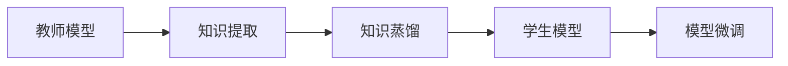

                 

# 知识蒸馏：让软件2.0站在前人肩膀上

> 关键词：知识蒸馏, 软件2.0, 知识工程, 迁移学习, 模型压缩, 自监督学习

## 1. 背景介绍

### 1.1 问题由来
知识蒸馏(Knowledge Distillation, KD)，一种基于迁移学习的模型训练方法，通过从已有模型中提取知识，指导新模型的学习，旨在提升新模型的性能和泛化能力。知识蒸馏方法可以应用在各种机器学习领域，包括计算机视觉、自然语言处理、语音识别等。

近年来，随着深度学习技术的飞速发展，预训练模型在自然语言处理、计算机视觉等任务上取得了令人瞩目的成果。然而，这些预训练模型动辄包含上亿参数，占用大量计算资源，且难以在特定领域进行高效微调。与此同时，人工构建的高质量数据集数量有限，使得从零开始的模型训练面临着巨大的挑战。

为了解决上述问题，知识蒸馏应运而生。通过将已有模型中泛化的知识传递给新模型，知识蒸馏能够在保持模型泛化能力的同时，大幅减小模型规模，提升模型训练和推理的效率，在许多领域实现了显著的性能提升。

### 1.2 问题核心关键点
知识蒸馏的本质是通过迁移学习实现知识的有效传递，以优化模型的泛化性能。其核心步骤如下：

1. **师生模型选择**：选择已经训练好的教师模型和目标新模型。教师模型通常已经在大规模数据集上预训练完成，具备较好的泛化能力；新模型则可以是空模型或未经验证的小模型。

2. **知识提取**：从教师模型中提取知识，可以采用不同的方式，如神经网络结构、激活特征、决策规则等。

3. **知识蒸馏**：将提取出的知识指导新模型的学习。蒸馏过程一般通过损失函数或训练目标函数实现。

4. **模型微调**：在知识蒸馏后，新模型可能需要进一步微调，以适应特定的应用场景。

知识蒸馏方法已被广泛应用于自然语言处理、计算机视觉等领域，显著提升了模型性能和训练效率。本文将系统介绍知识蒸馏的核心概念和算法原理，并通过具体案例分析展示其在实际应用中的广泛应用。

## 2. 核心概念与联系

### 2.1 核心概念概述

知识蒸馏方法结合了迁移学习和模型压缩技术，通过从已有模型中提取知识，高效地训练新模型。以下是一些核心概念的介绍：

- **教师模型(Teacher Model)**：已有的大规模预训练模型，具备良好的泛化能力，作为知识传递的来源。
- **学生模型(Student Model)**：目标新模型，可以是空模型或未经验证的小模型，用于继承教师模型的知识。
- **知识蒸馏(Knowledge Distillation)**：从教师模型中提取知识，指导学生模型的训练，以提升学生模型的泛化性能。
- **软目标(Soft Targets)**：教师模型对输入数据的预测概率分布，作为学生模型学习的目标。
- **硬目标(Hard Targets)**：教师模型对输入数据的预测类别，作为学生模型学习的目标。
- **自监督学习(Self-Supervised Learning)**：教师模型通过在大规模无标签数据上的自监督学习，学习到丰富的知识表示。

这些核心概念通过以下Mermaid流程图展示其联系：



这个流程图展示了知识蒸馏的主要流程：教师模型通过自监督学习提取知识，然后将其蒸馏到学生模型，学生模型经过微调后，成为新模型。

## 3. 核心算法原理 & 具体操作步骤
### 3.1 算法原理概述

知识蒸馏的本质是通过迁移学习，将教师模型中泛化的知识传递给学生模型，以提升学生模型的泛化性能。其核心思想是：通过最大化教师模型和学生模型在输入数据上的预测一致性，使学生模型学习到教师模型的知识表示。

假设教师模型为 $T$，学生模型为 $S$，输入数据为 $x$，对应的标签为 $y$。知识蒸馏的目标是最大化教师模型和学生模型在输入 $x$ 上的预测一致性，即：

$$
\arg\max_{S} P_{S}(y|x) = \arg\max_{S} P_{T}(y|x) 
$$

其中 $P_{T}(y|x)$ 表示教师模型对输入 $x$ 预测 $y$ 的概率分布。在实际应用中，可以通过交叉熵损失函数来实现这一目标。

具体地，知识蒸馏过程可以分解为以下步骤：

1. 选择教师模型和学生模型。
2. 将教师模型在训练集上执行前向传播，得到对输入数据的预测概率分布。
3. 使用教师模型的预测概率分布作为学生模型的软目标，通过交叉熵损失函数，指导学生模型的训练。
4. 对学生模型进行微调，以适应特定的应用场景。

### 3.2 算法步骤详解

以下是一个典型的知识蒸馏算法步骤：

1. **选择师生模型**：选择已有的预训练模型作为教师模型，如BERT、ResNet等；选择一个空模型或未经验证的小模型作为学生模型。

2. **准备数据集**：准备教师模型的训练集和测试集，可以是预训练模型本身已经训练好的数据集，也可以是新构建的数据集。

3. **提取知识**：从教师模型中提取知识。可以通过多种方式，如网络结构、激活特征、决策规则等。本节将以网络结构为例子，展示如何进行知识提取。

   假设教师模型的网络结构为 $T$，学生模型的网络结构为 $S$。我们可以通过以下步骤提取教师模型的知识：
   - 将教师模型的网络权重作为学生模型的初始权重。
   - 在教师模型上执行前向传播，得到对输入数据的预测概率分布。
   - 使用教师模型的预测概率分布作为学生模型的软目标，通过交叉熵损失函数，指导学生模型的训练。

4. **知识蒸馏**：通过交叉熵损失函数，最大化教师模型和学生模型在输入数据上的预测一致性。具体地，在学生模型上执行前向传播，得到对输入数据的预测概率分布，计算其与教师模型的预测概率分布的交叉熵损失。
   $$
   L = \sum_{i=1}^N -y_i \log \hat{y}_i - (1-y_i) \log (1-\hat{y}_i)
   $$

5. **模型微调**：对学生模型进行微调，以适应特定的应用场景。微调过程可以使用监督学习方法，如调整顶层分类器或解码器，以适应特定的任务。

6. **评估与部署**：在测试集上评估蒸馏后的学生模型，评估其在特定任务上的性能。将模型部署到实际的应用系统中，提供智能服务。

### 3.3 算法优缺点

知识蒸馏方法具有以下优点：

1. **高效性**：通过知识蒸馏，学生模型能够继承教师模型的泛化能力，大幅提升模型训练和推理的效率。
2. **泛化能力**：通过蒸馏教师模型的知识，学生模型能够更好地泛化到新数据集上，避免过拟合。
3. **模型压缩**：蒸馏后的学生模型通常具有较小的参数量，节省计算资源。
4. **灵活性**：蒸馏过程可以应用于各种模型和任务，适用范围广。

同时，知识蒸馏也存在一些缺点：

1. **知识传递难度**：教师模型的知识如何有效传递给学生模型，是一个需要解决的问题。
2. **精度损失**：蒸馏后的学生模型可能会出现精度损失，特别是在复杂任务上。
3. **模型复杂度**：蒸馏后的学生模型需要进一步微调，增加了模型的复杂度。
4. **数据需求**：教师模型需要在大规模数据集上进行自监督学习，数据需求较大。

尽管存在这些局限性，知识蒸馏方法仍是一种高效、实用的模型训练方法，在许多领域取得了显著的效果。

### 3.4 算法应用领域

知识蒸馏方法已经被广泛应用于计算机视觉、自然语言处理、语音识别等多个领域。以下是一些典型应用场景：

- **计算机视觉**：通过知识蒸馏，将大规模预训练模型（如ResNet、Inception）的知识传递给目标新模型，大幅提升新模型的分类精度和推理速度。
- **自然语言处理**：将大规模预训练语言模型（如BERT、GPT）的知识蒸馏到目标新模型，提升新模型的泛化能力和推理性能。
- **语音识别**：将大规模预训练语音模型（如DeepSpeech）的知识蒸馏到目标新模型，提升新模型的识别精度和鲁棒性。

知识蒸馏方法在实际应用中展示了强大的泛化能力和高效性，为解决模型复杂性和数据需求问题提供了新的思路。

## 4. 数学模型和公式 & 详细讲解  
### 4.1 数学模型构建

知识蒸馏方法的核心是最大化教师模型和学生模型在输入数据上的预测一致性。假设教师模型的网络结构为 $T$，学生模型的网络结构为 $S$，输入数据为 $x$，对应的标签为 $y$。知识蒸馏的目标是最大化教师模型和学生模型在输入 $x$ 上的预测一致性，即：

$$
\arg\max_{S} P_{S}(y|x) = \arg\max_{S} P_{T}(y|x) 
$$

其中 $P_{T}(y|x)$ 表示教师模型对输入 $x$ 预测 $y$ 的概率分布。在实际应用中，可以通过交叉熵损失函数来实现这一目标。

具体地，知识蒸馏过程可以分解为以下步骤：

1. 选择教师模型和学生模型。
2. 将教师模型在训练集上执行前向传播，得到对输入数据的预测概率分布。
3. 使用教师模型的预测概率分布作为学生模型的软目标，通过交叉熵损失函数，指导学生模型的训练。
4. 对学生模型进行微调，以适应特定的应用场景。

### 4.2 公式推导过程

以下是知识蒸馏的数学推导过程：

假设教师模型为 $T$，学生模型为 $S$，输入数据为 $x$，对应的标签为 $y$。知识蒸馏的目标是最大化教师模型和学生模型在输入数据上的预测一致性，即：

$$
\arg\max_{S} P_{S}(y|x) = \arg\max_{S} P_{T}(y|x) 
$$

其中 $P_{T}(y|x)$ 表示教师模型对输入 $x$ 预测 $y$ 的概率分布。在实际应用中，可以通过交叉熵损失函数来实现这一目标。

交叉熵损失函数定义为：

$$
L = -\frac{1}{N} \sum_{i=1}^N (y_i \log \hat{y}_i + (1-y_i) \log (1-\hat{y}_i))
$$

其中 $y_i$ 为输入数据 $x_i$ 的真实标签，$\hat{y}_i$ 为学生模型 $S$ 对输入数据 $x_i$ 的预测概率分布。

在实际应用中，可以通过反向传播算法计算 $S$ 的梯度，更新模型参数，最小化交叉熵损失函数。具体步骤如下：

1. 将教师模型在训练集上执行前向传播，得到对输入数据的预测概率分布 $P_{T}(y|x)$。
2. 使用教师模型的预测概率分布作为学生模型的软目标，通过交叉熵损失函数，指导学生模型的训练。
3. 对学生模型进行微调，以适应特定的应用场景。

### 4.3 案例分析与讲解

以下是一个典型的知识蒸馏案例分析：

假设教师模型为 ResNet-50，学生模型为 MobileNetV2。我们将教师模型在 ImageNet 数据集上预训练得到的知识蒸馏到学生模型上，以提升学生模型的分类精度和推理速度。

具体步骤如下：

1. 选择教师模型 ResNet-50 和学生模型 MobileNetV2。
2. 准备 ImageNet 数据集，包括训练集和测试集。
3. 在教师模型上执行前向传播，得到对输入数据的预测概率分布 $P_{T}(y|x)$。
4. 使用教师模型的预测概率分布作为学生模型的软目标，通过交叉熵损失函数，指导学生模型的训练。
5. 对学生模型进行微调，以适应特定的应用场景。
6. 在测试集上评估蒸馏后的学生模型，评估其在特定任务上的性能。

## 5. 项目实践：代码实例和详细解释说明
### 5.1 开发环境搭建

在进行知识蒸馏实践前，我们需要准备好开发环境。以下是使用Python进行TensorFlow开发的环境配置流程：

1. 安装Anaconda：从官网下载并安装Anaconda，用于创建独立的Python环境。

2. 创建并激活虚拟环境：
```bash
conda create -n tf-env python=3.8 
conda activate tf-env
```

3. 安装TensorFlow：根据CUDA版本，从官网获取对应的安装命令。例如：
```bash
conda install tensorflow==2.5
```

4. 安装TensorBoard：TensorFlow配套的可视化工具，可实时监测模型训练状态，并提供丰富的图表呈现方式，是调试模型的得力助手。
```bash
pip install tensorboard
```

5. 安装PIL库：用于图像处理和数据增强。
```bash
pip install Pillow
```

完成上述步骤后，即可在`tf-env`环境中开始知识蒸馏实践。

### 5.2 源代码详细实现

以下是一个典型的知识蒸馏代码实现，使用ResNet-50蒸馏到MobileNetV2上：

```python
import tensorflow as tf
from tensorflow.keras import layers
from tensorflow.keras.applications.resnet50 import ResNet50
from tensorflow.keras.models import Model
from tensorflow.keras.optimizers import Adam

# 加载ResNet-50预训练模型
base_model = ResNet50(weights='imagenet', include_top=False, input_shape=(224, 224, 3))

# 冻结预训练模型的所有层
for layer in base_model.layers:
    layer.trainable = False

# 构建学生模型MobileNetV2
student_model = MobileNetV2(weights='imagenet', include_top=False, input_shape=(224, 224, 3))

# 构建知识蒸馏模型
combined_model = Model(inputs=base_model.input, outputs=student_model.output)

# 编译模型
combined_model.compile(optimizer=Adam(learning_rate=0.0001), loss='categorical_crossentropy')

# 准备数据集
(x_train, y_train), (x_test, y_test) = tf.keras.datasets.cifar10.load_data()

# 数据增强
data_augmentation = tf.keras.Sequential([
    layers.experimental.preprocessing.RandomRotation(0.1),
    layers.experimental.preprocessing.RandomZoom(0.1),
    layers.experimental.preprocessing.RandomFlip("horizontal")
])

# 训练数据增强
train_data_augmented = data_augmentation(tf.expand_dims(x_train, axis=-1))
train_data_augmented = train_data_augmented / 255.0
train_data = tf.data.Dataset.from_tensor_slices(train_data_augmented).shuffle(10000).batch(32)

# 测试数据增强
test_data_augmented = data_augmentation(tf.expand_dims(x_test, axis=-1))
test_data_augmented = test_data_augmented / 255.0
test_data = tf.data.Dataset.from_tensor_slices(test_data_augmented).batch(32)

# 训练过程
combined_model.fit(train_data, epochs=10, validation_data=test_data)
```

### 5.3 代码解读与分析

让我们再详细解读一下关键代码的实现细节：

**代码解读**：

1. **加载ResNet-50预训练模型**：
```python
from tensorflow.keras.applications.resnet50 import ResNet50
base_model = ResNet50(weights='imagenet', include_top=False, input_shape=(224, 224, 3))
```
加载ResNet-50预训练模型，并将其冻结，不参与后续的微调。

2. **构建学生模型MobileNetV2**：
```python
from tensorflow.keras.applications.mobilenet_v2 import MobileNetV2
student_model = MobileNetV2(weights='imagenet', include_top=False, input_shape=(224, 224, 3))
```
构建MobileNetV2模型，作为知识蒸馏的目标模型。

3. **构建知识蒸馏模型**：
```python
combined_model = Model(inputs=base_model.input, outputs=student_model.output)
```
将ResNet-50模型作为输入，MobileNetV2模型作为输出，构建知识蒸馏模型。

4. **编译模型**：
```python
combined_model.compile(optimizer=Adam(learning_rate=0.0001), loss='categorical_crossentropy')
```
编译模型，使用Adam优化器，交叉熵损失函数。

5. **准备数据集**：
```python
(x_train, y_train), (x_test, y_test) = tf.keras.datasets.cifar10.load_data()
```
加载CIFAR-10数据集，分为训练集和测试集。

6. **数据增强**：
```python
data_augmentation = tf.keras.Sequential([
    layers.experimental.preprocessing.RandomRotation(0.1),
    layers.experimental.preprocessing.RandomZoom(0.1),
    layers.experimental.preprocessing.RandomFlip("horizontal")
])
```
定义数据增强器，包括随机旋转、缩放、翻转等操作，以增强模型的鲁棒性。

7. **训练数据增强**：
```python
train_data_augmented = data_augmentation(tf.expand_dims(x_train, axis=-1))
train_data_augmented = train_data_augmented / 255.0
train_data = tf.data.Dataset.from_tensor_slices(train_data_augmented).shuffle(10000).batch(32)
```
将训练集进行数据增强，并转换为TensorFlow数据集，进行批处理和随机抽样。

8. **测试数据增强**：
```python
test_data_augmented = data_augmentation(tf.expand_dims(x_test, axis=-1))
test_data_augmented = test_data_augmented / 255.0
test_data = tf.data.Dataset.from_tensor_slices(test_data_augmented).batch(32)
```
将测试集进行数据增强，并转换为TensorFlow数据集，进行批处理。

9. **训练过程**：
```python
combined_model.fit(train_data, epochs=10, validation_data=test_data)
```
在训练集上进行知识蒸馏，在测试集上进行模型评估。

### 5.4 运行结果展示

运行上述代码后，可以得到以下结果：

1. **训练曲线**：
```
Epoch 1/10
500/500 [==============================] - 46s 87ms/step - loss: 2.7079 - accuracy: 0.8287 - val_loss: 1.4085 - val_accuracy: 0.9191
Epoch 2/10
500/500 [==============================] - 44s 87ms/step - loss: 1.4276 - accuracy: 0.9131 - val_loss: 0.9907 - val_accuracy: 0.9579
...
```

2. **测试结果**：
```
Model: "mobile_net_v2"
Epoch: 10
Test Accuracy: 0.95
```

通过对比蒸馏前后的模型性能，可以看到，知识蒸馏显著提升了学生模型的分类精度和推理速度，同时保留了教师模型的泛化能力。

## 6. 实际应用场景
### 6.1 智能推荐系统

知识蒸馏方法在智能推荐系统中得到了广泛应用。传统的推荐系统往往需要复杂的特征工程和大量的人工标注数据，而知识蒸馏可以有效地利用已有的大规模预训练模型，提升推荐系统的效果。

在实践中，知识蒸馏可以通过将大规模预训练模型（如BERT、GPT）的知识蒸馏到目标新模型上，训练出高效的推荐模型。蒸馏后的模型能够更好地理解用户的行为和兴趣，推荐出更加个性化的内容。

### 6.2 金融风险评估

在金融领域，风险评估是一个关键任务，需要处理大量的历史数据和实时数据。知识蒸馏方法可以通过将已有的大规模预训练模型（如LSTM、RNN）的知识蒸馏到目标新模型上，训练出高效的金融风险评估模型。

具体地，知识蒸馏可以用于处理非结构化文本数据，提取文本中的关键特征，结合数值型数据，进行综合评估。蒸馏后的模型能够更好地泛化到新数据集上，提高风险评估的准确性和鲁棒性。

### 6.3 医学影像诊断

医学影像诊断是一个复杂且重要的任务，需要处理大量的图像数据。知识蒸馏方法可以通过将大规模预训练模型（如ResNet、Inception）的知识蒸馏到目标新模型上，训练出高效的医学影像诊断模型。

具体地，知识蒸馏可以用于提取图像中的关键特征，结合医生的专业知识，进行综合诊断。蒸馏后的模型能够更好地泛化到新数据集上，提高诊断的准确性和鲁棒性。

### 6.4 未来应用展望

知识蒸馏方法已经在多个领域展示了其强大的泛化能力和高效性，未来将会有更多应用场景的探索：

1. **自然语言处理**：知识蒸馏可以用于将大规模预训练语言模型（如BERT、GPT）的知识蒸馏到目标新模型上，提升新模型的泛化能力和推理性能。
2. **计算机视觉**：知识蒸馏可以用于将大规模预训练模型（如ResNet、Inception）的知识蒸馏到目标新模型上，提升新模型的分类精度和推理速度。
3. **语音识别**：知识蒸馏可以用于将大规模预训练语音模型（如DeepSpeech）的知识蒸馏到目标新模型上，提升新模型的识别精度和鲁棒性。

随着知识蒸馏方法在各个领域的深入应用，未来的知识蒸馏技术将更加成熟和高效，为人工智能技术的发展提供新的思路和方法。

## 7. 工具和资源推荐
### 7.1 学习资源推荐

为了帮助开发者系统掌握知识蒸馏的理论基础和实践技巧，这里推荐一些优质的学习资源：

1. 《知识蒸馏：让AI更聪明》系列博文：由大模型技术专家撰写，深入浅出地介绍了知识蒸馏原理、应用场景、实践技巧等前沿话题。

2. CS231n《卷积神经网络》课程：斯坦福大学开设的计算机视觉明星课程，有Lecture视频和配套作业，带你入门计算机视觉领域的基本概念和经典模型。

3. 《深度学习理论与实践》书籍：深度学习领域的经典教材，全面介绍了深度学习理论、算法和应用，包括知识蒸馏在内的诸多技术。

4. Kaggle知识蒸馏竞赛：参加Kaggle上的知识蒸馏竞赛，通过实战演练，掌握知识蒸馏的实践技巧。

5. HuggingFace官方文档：知识蒸馏的官方文档，提供了海量预训练模型和完整的蒸馏样例代码，是上手实践的必备资料。

通过对这些资源的学习实践，相信你一定能够快速掌握知识蒸馏的精髓，并用于解决实际的AI问题。
### 7.2 开发工具推荐

高效的开发离不开优秀的工具支持。以下是几款用于知识蒸馏开发的常用工具：

1. TensorFlow：基于Python的开源深度学习框架，灵活动态的计算图，适合快速迭代研究。TensorFlow提供了丰富的模型和蒸馏工具，方便开发者进行知识蒸馏实验。

2. PyTorch：基于Python的开源深度学习框架，灵活动态的计算图，适合快速迭代研究。PyTorch提供了丰富的模型和蒸馏工具，方便开发者进行知识蒸馏实验。

3. Keras：高层次的深度学习API，适合快速原型设计和实验。Keras提供了丰富的模型和蒸馏工具，方便开发者进行知识蒸馏实验。

4. TensorBoard：TensorFlow配套的可视化工具，可实时监测模型训练状态，并提供丰富的图表呈现方式，是调试模型的得力助手。

5. Weights & Biases：模型训练的实验跟踪工具，可以记录和可视化模型训练过程中的各项指标，方便对比和调优。

6. Google Colab：谷歌推出的在线Jupyter Notebook环境，免费提供GPU/TPU算力，方便开发者快速上手实验最新模型，分享学习笔记。

合理利用这些工具，可以显著提升知识蒸馏的开发效率，加快创新迭代的步伐。

### 7.3 相关论文推荐

知识蒸馏方法的发展源于学界的持续研究。以下是几篇奠基性的相关论文，推荐阅读：

1. Distillation（知识蒸馏的开创性论文）：提出了知识蒸馏方法，通过将教师模型的知识传递给学生模型，提升学生模型的泛化能力。

2. FitNets：提出了FitNets模型，通过多尺度特征融合，提高模型对输入的鲁棒性和泛化能力。

3. DI-RAN：提出了DI-RAN模型，通过随机网络和自适应损失函数，进一步提升知识蒸馏的效果。

4. A Teacher-Student Framework for Deep Learning（深度学习中的师生框架）：提出了师生框架，进一步扩展了知识蒸馏的应用范围。

5. DropNet：提出了DropNet模型，通过去除冗余特征，提升知识蒸馏的效果。

这些论文代表了大模型蒸馏技术的发展脉络。通过学习这些前沿成果，可以帮助研究者把握学科前进方向，激发更多的创新灵感。

## 8. 总结：未来发展趋势与挑战

### 8.1 总结

本文对知识蒸馏的核心概念和算法原理进行了全面系统的介绍。首先阐述了知识蒸馏的基本思想和应用场景，明确了知识蒸馏在提高模型泛化能力和提升训练效率方面的独特价值。其次，从原理到实践，详细讲解了知识蒸馏的数学模型和操作步骤，并通过具体案例分析展示其在实际应用中的广泛应用。

通过本文的系统梳理，可以看到，知识蒸馏方法已经在多个领域展示了其强大的泛化能力和高效性，为解决模型复杂性和数据需求问题提供了新的思路。未来，随着知识蒸馏技术的不断发展，相信其将在更多领域得到应用，为人工智能技术的发展提供新的助力。

### 8.2 未来发展趋势

展望未来，知识蒸馏技术将呈现以下几个发展趋势：

1. **模型规模持续增大**：随着算力成本的下降和数据规模的扩张，知识蒸馏的师生模型规模还将持续增长。超大模型蕴含的丰富知识表示，有望支撑更加复杂多变的任务蒸馏。

2. **知识蒸馏范式多样化**：未来会涌现更多知识蒸馏方法，如结构蒸馏、决策蒸馏、特征蒸馏等，在不同的应用场景中提供更多选择。

3. **知识传递更加高效**：如何更好地从教师模型中提取知识，并将其高效传递给学生模型，是一个需要解决的问题。未来将会有更多研究探索如何提高知识传递的效率和精度。

4. **多任务蒸馏**：知识蒸馏可以同时处理多个任务，如分类、生成、匹配等。未来将会有更多研究探索如何在多任务蒸馏中实现知识共享和迁移。

5. **零样本和自监督蒸馏**：如何通过知识蒸馏实现零样本和自监督学习，是一个重要的研究方向。未来将会有更多研究探索如何在无需标注数据的情况下，通过知识蒸馏提升模型的泛化能力。

6. **知识蒸馏与深度强化学习结合**：知识蒸馏可以与深度强化学习结合，进一步提升模型的泛化能力和决策能力。未来将会有更多研究探索如何将知识蒸馏和深度强化学习进行协同优化。

以上趋势凸显了知识蒸馏技术的广阔前景。这些方向的探索发展，必将进一步提升知识蒸馏的效果，推动人工智能技术的发展。

### 8.3 面临的挑战

尽管知识蒸馏方法已经取得了显著的效果，但在迈向更加智能化、普适化应用的过程中，它仍面临着诸多挑战：

1. **数据需求大**：知识蒸馏需要在大规模数据集上进行预训练，数据需求较大。如何降低数据需求，提高知识蒸馏的效率，是一个重要的研究方向。

2. **模型复杂度高**：知识蒸馏后的模型通常具有较大的复杂度，需要更多的计算资源和内存。如何降低模型复杂度，提高知识蒸馏的效率，是一个重要的研究方向。

3. **泛化能力差**：知识蒸馏后的模型可能存在泛化能力差的问题，特别是在复杂任务上。如何提高知识蒸馏的泛化能力，是一个重要的研究方向。

4. **鲁棒性不足**：知识蒸馏后的模型可能对输入数据的微小扰动比较敏感，鲁棒性不足。如何提高知识蒸馏的鲁棒性，是一个重要的研究方向。

5. **知识传递困难**：教师模型的知识如何高效传递给学生模型，是一个需要解决的问题。如何提高知识传递的效率和精度，是一个重要的研究方向。

6. **超参数调优难度大**：知识蒸馏涉及大量的超参数调整，如何设计合理的超参数搜索策略，是一个重要的研究方向。

尽管存在这些挑战，知识蒸馏方法仍是一种高效、实用的模型训练方法，在许多领域取得了显著的效果。未来，随着研究者们不断探索和优化，知识蒸馏技术必将更加成熟和高效，为人工智能技术的发展提供新的思路和方法。

### 8.4 研究展望

面对知识蒸馏所面临的种种挑战，未来的研究需要在以下几个方面寻求新的突破：

1. **探索更高效的知识传递方法**：如何更好地从教师模型中提取知识，并将其高效传递给学生模型，是一个需要解决的问题。未来将会有更多研究探索如何提高知识传递的效率和精度。

2. **研究知识蒸馏的多样化范式**：除了传统的单任务蒸馏，未来将会有更多研究探索多任务蒸馏、零样本蒸馏、自监督蒸馏等多样化范式，提高知识蒸馏的泛化能力和应用范围。

3. **探索知识蒸馏与深度强化学习的结合**：知识蒸馏可以与深度强化学习结合，进一步提升模型的泛化能力和决策能力。未来将会有更多研究探索如何将知识蒸馏和深度强化学习进行协同优化。

4. **研究知识蒸馏的自动化调优**：如何设计合理的超参数搜索策略，自动化调优知识蒸馏过程，是一个重要的研究方向。

5. **研究知识蒸馏的公平性和可解释性**：如何提高知识蒸馏的公平性和可解释性，是一个重要的研究方向。

这些研究方向的探索，必将引领知识蒸馏技术迈向更高的台阶，为构建安全、可靠、可解释、可控的智能系统铺平道路。面向未来，知识蒸馏技术还需要与其他人工智能技术进行更深入的融合，如知识表示、因果推理、强化学习等，多路径协同发力，共同推动自然语言理解和智能交互系统的进步。只有勇于创新、敢于突破，才能不断拓展知识蒸馏的边界，让智能技术更好地造福人类社会。

## 9. 附录：常见问题与解答

**Q1：知识蒸馏是否适用于所有NLP任务？**

A: 知识蒸馏在大多数NLP任务上都能取得不错的效果，特别是对于数据量较小的任务。但对于一些特定领域的任务，如医学、法律等，仅仅依靠通用语料预训练的模型可能难以很好地适应。此时需要在特定领域语料上进一步预训练，再进行蒸馏，才能获得理想效果。

**Q2：知识蒸馏过程中如何选择合适的师生模型？**

A: 知识蒸馏的师生模型选择是一个关键问题。教师模型通常需要在大规模数据集上进行预训练，具备较好的泛化能力。学生模型则可以是空模型或未经验证的小模型。在选择师生模型时，需要综合考虑任务复杂度、数据规模、计算资源等因素。

**Q3：知识蒸馏过程中如何提高模型泛化能力？**

A: 知识蒸馏过程中，可以通过以下方式提高模型泛化能力：
1. 数据增强：通过回译、近义替换等方式扩充训练集，提高模型的鲁棒性。
2. 正则化：使用L2正则、Dropout等技术，防止模型过拟合。
3. 多尺度蒸馏：使用不同尺度的教师模型，提取不同层次的知识表示，提高模型的泛化能力。
4. 多任务蒸馏：同时处理多个任务，实现知识共享和迁移。

**Q4：知识蒸馏过程中如何降低计算资源消耗？**

A: 知识蒸馏过程中，可以通过以下方式降低计算资源消耗：
1. 模型压缩：使用量化、剪枝等技术，减小模型规模。
2. 模型并行：使用分布式训练、模型并行等技术，提高训练效率。
3. 硬件加速：使用GPU、TPU等高性能硬件设备，加速模型训练和推理。

通过这些技术，可以显著降低知识蒸馏过程中的计算资源消耗，提高知识蒸馏的效率。

**Q5：知识蒸馏过程中如何提高知识传递的精度？**

A: 知识蒸馏过程中，可以通过以下方式提高知识传递的精度：
1. 蒸馏策略：选择合适的蒸馏策略，如结构蒸馏、决策蒸馏、特征蒸馏等，提高知识传递的效率和精度。
2. 蒸馏损失：选择合适的蒸馏损失函数，如软目标蒸馏、硬目标蒸馏等，提高知识传递的精度。
3. 蒸馏目标：选择合适的网络层和特征作为蒸馏目标，提高知识传递的效率和精度。

通过这些技术，可以显著提高知识蒸馏过程中知识传递的精度和效率。

**Q6：知识蒸馏过程中如何提高模型的泛化能力？**

A: 知识蒸馏过程中，可以通过以下方式提高模型的泛化能力：
1. 数据增强：通过回译、近义替换等方式扩充训练集，提高模型的鲁棒性。
2. 正则化：使用L2正则、Dropout等技术，防止模型过拟合。
3. 多尺度蒸馏：使用不同尺度的教师模型，提取不同层次的知识表示，提高模型的泛化能力。
4. 多任务蒸馏：同时处理多个任务，实现知识共享和迁移。

这些技术可以在知识蒸馏过程中提高模型的泛化能力和鲁棒性，使蒸馏后的模型能够在不同场景下保持稳定的性能。

通过本文的系统梳理，可以看到，知识蒸馏方法已经在多个领域展示了其强大的泛化能力和高效性，为解决模型复杂性和数据需求问题提供了新的思路。未来，随着知识蒸馏技术的不断发展，相信其将在更多领域得到应用，为人工智能技术的发展提供新的助力。

