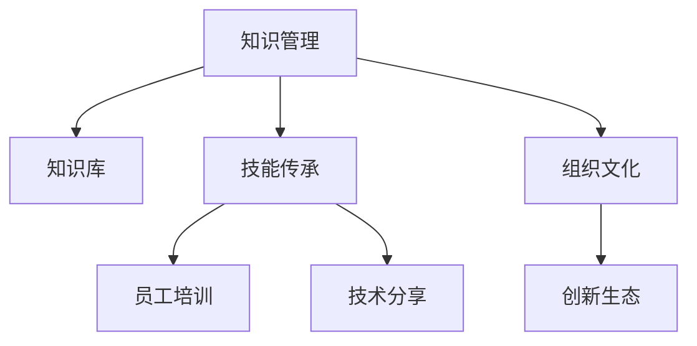

                 

# 知识转移：确保关键技能在组织内传承

> 关键词：知识管理,知识转移,技能传承,组织文化,员工培训,技术分享,创新生态

## 1. 背景介绍

### 1.1 问题由来
在当今快速变化和竞争激烈的市场环境中，组织要想保持持续的竞争优势，不仅需要不断引进新技术、新知识，还需要确保组织内部的关键技能和知识能够得到有效的传承和应用。然而，由于知识转移和技能传承的复杂性，很多组织难以确保这些关键资源能够被所有员工充分理解和利用。

### 1.2 问题核心关键点
知识转移和技能传承的核心关键点包括：
- 知识识别：确定哪些知识对组织最为关键，能够促进业务发展。
- 知识获取：构建有效的知识库，以文档、数据库、在线平台等多种形式存储知识。
- 知识传递：利用培训、工作坊、导师制等多种方式，将知识传递给员工。
- 知识内化：通过持续的学习和实践，使知识成为员工的一部分，转化为技能。
- 知识共享：建立知识分享机制，鼓励员工之间的交流与合作。

### 1.3 问题研究意义
解决知识转移和技能传承问题，对于组织的持续发展具有重要意义：
- 提升效率：通过知识转移，员工可以更快地掌握工作所需的技能，提高工作效率。
- 降低成本：减少新员工培训成本，避免因知识空缺导致的业务停滞。
- 促进创新：通过内部知识分享，激发员工创新思维，提升组织竞争力。
- 增强团队协作：知识共享促进团队成员之间的互动与合作，增强团队凝聚力。
- 支持战略实施：确保关键知识能够支持组织的长期战略目标。

## 2. 核心概念与联系

### 2.1 核心概念概述

为更好地理解知识转移和技能传承的过程，本节将介绍几个核心概念：

- **知识管理(Knowledge Management, KM)**：通过系统化的方法识别、组织、共享和应用知识，以支持组织目标。
- **知识库(Knowledge Base)**：集中存储组织知识的平台，包含文档、数据库、搜索引擎等功能。
- **技能传承(Skill Transfer)**：通过培训、导师制等方式，将特定技能传递给员工的过程。
- **组织文化(Organizational Culture)**：组织成员共同遵守的价值观念、行为准则和团队合作方式，影响知识转移和技能传承的成效。
- **员工培训(Training & Development)**：通过课程、工作坊等方式，系统地提升员工技能和知识。
- **技术分享(的技术分享(分享技术分享**：通过内部技术会议、代码审查等形式，促进技术知识的交流与共享。
- **创新生态(Innovation Ecosystem)**：组织内部的创新环境，鼓励新知识的生成和应用。

这些概念之间的逻辑关系可以通过以下Mermaid流程图来展示：



这个流程图展示了我知识转移和技能传承的核心概念及其之间的关系：

1. 知识管理通过系统化方法获取、组织和应用知识。
2. 知识库作为知识存储的集中平台。
3. 技能传承通过多种方式将技能传递给员工。
4. 员工培训通过系统课程提升员工技能。
5. 技术分享通过交流平台促进知识共享。
6. 组织文化影响知识转移和技能传承的成效。
7. 创新生态支持新知识的生成和应用。

## 3. 核心算法原理 & 具体操作步骤
### 3.1 算法原理概述

知识转移和技能传承的算法原理可以概括为以下几个步骤：

1. **知识识别与评估**：识别对业务发展至关重要的知识，评估知识的重要性和紧急性。
2. **知识获取与存储**：通过文档、数据库、在线平台等方式收集和存储知识。
3. **知识传递与内化**：通过培训、导师制、工作坊等形式传递知识，并帮助员工将其内化为技能。
4. **知识共享与反馈**：建立知识分享机制，收集反馈，持续优化知识库和培训内容。

### 3.2 算法步骤详解

1. **知识识别与评估**：
   - 制定知识管理策略，明确知识分类标准。
   - 利用问卷调查、专家访谈等方式，识别关键知识领域。
   - 评估知识的重要性和紧急性，确定优先级。

2. **知识获取与存储**：
   - 建立知识库，选择合适的知识管理工具。
   - 收集文档、数据、经验总结等多种形式的资料。
   - 对知识进行分类、标注、存储，并确保易于访问和搜索。

3. **知识传递与内化**：
   - 设计合适的培训计划，包括课程、工作坊、在线学习等多种形式。
   - 确定导师制度，安排经验丰富的员工指导新员工。
   - 通过模拟、实战等方式，帮助员工内化所学知识。

4. **知识共享与反馈**：
   - 建立知识分享平台，如内部论坛、技术博客等。
   - 定期组织技术分享会、代码审查会议等，鼓励知识交流。
   - 收集员工反馈，优化知识库和培训内容。

### 3.3 算法优缺点

知识转移和技能传承的方法具有以下优点：
1. 提升工作效率：员工快速掌握关键技能，提高工作效率。
2. 降低培训成本：减少新员工培训成本，避免知识空缺。
3. 促进创新：知识共享激发创新思维，提升组织竞争力。
4. 增强团队合作：知识传递加强团队协作，增强凝聚力。
5. 支持战略实施：确保关键知识支持长期战略目标。

同时，这些方法也存在一些局限性：
1. 实施成本高：建立知识库、设计培训计划等需要大量人力和资源。
2. 知识更新慢：现有知识库和培训内容可能需要较长时间才能更新，无法及时应对市场变化。
3. 知识传递效果不一：培训质量、导师水平等因素影响知识传递效果。
4. 组织文化障碍：组织文化可能影响知识转移和技能传承的成效。
5. 员工参与度不足：部分员工可能对知识转移缺乏兴趣或参与积极性不高。

尽管存在这些局限性，但通过合理的策略和措施，知识转移和技能传承仍然是组织发展的关键驱动力。

### 3.4 算法应用领域

知识转移和技能传承的方法适用于各种组织和行业，包括但不限于：

- **IT行业**：通过技术分享、代码审查等方式，提升开发团队的编码能力和技术水平。
- **医疗行业**：通过患者案例分析、医疗操作培训等方式，提升医护人员的临床技能和知识水平。
- **金融行业**：通过市场分析、投资策略培训等方式，提升金融分析师和交易员的专业能力。
- **教育行业**：通过教学法培训、课程设计等方式，提升教师的教学技能和教育水平。
- **制造业**：通过工艺改进培训、设备维护培训等方式，提升生产工人的生产技能和知识水平。
- **服务行业**：通过服务流程培训、客户沟通技巧培训等方式，提升服务人员的服务质量和服务效率。

## 4. 数学模型和公式 & 详细讲解  
### 4.1 数学模型构建

知识管理与技能传承的数学模型可以构建为以下形式：

- **知识识别与评估**：
  - 定义知识重要性和紧急性的评分标准。
  - 使用统计方法计算各知识点的综合评分。
  - 根据评分结果确定知识优先级。

- **知识获取与存储**：
  - 定义知识库中知识项的表示方法。
  - 设计知识库的搜索和过滤算法。
  - 使用机器学习模型推荐相关知识。

- **知识传递与内化**：
  - 定义培训计划的效果评估指标。
  - 使用回归模型预测培训效果。
  - 设计反馈机制优化培训计划。

- **知识共享与反馈**：
  - 定义知识共享平台的访问和使用指标。
  - 使用社交网络模型分析知识共享网络结构。
  - 设计激励机制提高员工参与度。

### 4.2 公式推导过程

- **知识识别与评估**：
  $$
  \text{重要性评分} = w_1 \cdot I + w_2 \cdot E
  $$
  其中，$I$ 为知识的重要性评分，$E$ 为知识的紧急性评分，$w_1$ 和 $w_2$ 为权重。

- **知识获取与存储**：
  - 使用倒排索引实现快速搜索。
  - 使用TF-IDF算法计算知识项的权重。
  - 使用协同过滤算法推荐相关知识。

- **知识传递与内化**：
  $$
  \text{培训效果} = \beta_1 \cdot \text{培训时间} + \beta_2 \cdot \text{导师评分} + \beta_3 \cdot \text{测试成绩}
  $$
  其中，$\beta_1$ 至 $\beta_3$ 为回归模型系数。

- **知识共享与反馈**：
  $$
  \text{知识共享网络} = G(V,E)
  $$
  其中，$V$ 为节点（员工）集合，$E$ 为边（知识共享关系）集合。

### 4.3 案例分析与讲解

假设某科技公司采用知识管理策略提升研发团队的代码质量。首先，通过问卷调查和专家访谈，识别出代码审查、编码规范、测试用例编写等关键知识领域。然后，建立知识库，存储相关的文档、代码示例和经验总结。通过知识库搜索和分类，帮助员工快速找到所需知识。最后，定期组织代码审查会议和技术分享会，鼓励员工之间的知识交流。

## 5. 项目实践：代码实例和详细解释说明
### 5.1 开发环境搭建

在进行知识管理与技能传承的实践前，我们需要准备好开发环境。以下是使用Python进行知识管理工具开发的环境配置流程：

1. 安装Anaconda：从官网下载并安装Anaconda，用于创建独立的Python环境。

2. 创建并激活虚拟环境：
```bash
conda create -n knowledge-env python=3.8 
conda activate knowledge-env
```

3. 安装Python包：
```bash
pip install pandas numpy scikit-learn nltk
```

4. 安装知识管理工具：
```bash
pip install Flask PyTorch Gensim Scrapy
```

5. 安装各类工具包：
```bash
pip install tqdm matplotlib sklearn
```

完成上述步骤后，即可在`knowledge-env`环境中开始知识管理实践。

### 5.2 源代码详细实现

这里我们以知识库的构建和管理为例，给出使用Flask和Gensim进行知识库开发的PyTorch代码实现。

首先，定义知识库的API：

```python
from flask import Flask, request, jsonify
from gensim import corpora, models

app = Flask(__name__)

# 加载知识库数据
corpus = corpora.load("corpus.txt")

@app.route('/knowledge', methods=['GET'])
def get_knowledge():
    topics = models.KeyedVectors.topics(corpus, topn=10)
    return jsonify(topics)

if __name__ == '__main__':
    app.run()
```

然后，定义知识库的实体：

```python
class Knowledge:
    def __init__(self, title, content):
        self.title = title
        self.content = content

    def __str__(self):
        return f"{self.title}：\n{self.content}\n"

# 创建知识库实例
knowledge_base = []
knowledge_base.append(Knowledge("Python教程", "Python编程基础..."))
knowledge_base.append(Knowledge("数据结构与算法", "数据结构与算法..."))

# 保存知识库到文件
with open("knowledge.txt", "w") as f:
    for k in knowledge_base:
        f.write(str(k) + "\n")
```

最后，启动知识库服务：

```bash
python knowledge_app.py
```

打开浏览器访问`http://localhost:5000/knowledge`，即可以看到知识库中存储的知识内容。

### 5.3 代码解读与分析

让我们再详细解读一下关键代码的实现细节：

**Knowledge类**：
- 定义知识库中的知识实体，包含标题和内容。

**知识库API**：
- 定义一个Flask路由，通过`topn`参数获取最热门的知识库内容。

**知识库实体**：
- 创建知识库实例，保存知识库到文件中。

**知识库服务**：
- 启动Flask服务，监听指定端口。

可以看到，Python配合Flask和Gensim使得知识库的构建和管理变得简洁高效。开发者可以将更多精力放在知识库的内容管理、数据治理等高层逻辑上，而不必过多关注底层的实现细节。

当然，工业级的系统实现还需考虑更多因素，如知识库的搜索和过滤、数据的实时更新、安全防护等。但核心的知识库构建和管理逻辑基本与此类似。

## 6. 实际应用场景
### 6.1 组织内培训平台

构建基于知识库的组织内培训平台，可以大幅提升员工的技能和知识水平。传统培训方式往往缺乏针对性，难以满足所有员工的个性化需求。而利用知识库，结合在线课程和虚拟教室，员工可以自主学习，按照自身进度掌握新技能。

在技术实现上，可以设计一个基于知识库的培训平台，根据员工的技能水平和职业需求，推荐适合的培训课程。通过在线直播和视频录制，员工可以随时随地进行学习。培训过程中，可以通过互动讨论、代码挑战等方式，增强学习效果。

### 6.2 内部技术分享会

组织内部技术分享会是知识共享的重要形式。通过定期举办技术分享会，员工可以展示自己的项目成果和技术见解，促进团队内部的技术交流与合作。分享会可以采用线上线下相结合的形式，邀请外部专家进行专题讲座，丰富知识内容。

在技术实现上，可以搭建一个内部技术分享平台，记录和传播分享内容。平台可以提供评论、点赞等功能，方便员工之间的互动和反馈。分享会结束后，可以将分享内容整理成文档，存储到知识库中，供后续参考和查阅。

### 6.3 技术博客与技术社区

技术博客和技术社区是知识分享的重要渠道。通过公开的知识库和博客，组织可以对外展示其技术能力和创新成果，吸引外部技术人才的关注和参与。同时，技术博客和技术社区也可以作为内部知识共享的平台，促进员工之间的交流和合作。

在技术实现上，可以搭建一个技术博客和技术社区系统，提供文章发表、评论、分类等功能。通过SEO优化，提升博客的访问量和传播效果。同时，通过技术社区的讨论和互动，员工可以不断积累和更新知识，提升自身技术水平。

### 6.4 未来应用展望

随着知识管理与技能传承技术的不断发展，基于知识库和培训平台的解决方案将得到更广泛的应用，为组织内部的知识转移和技能传承提供更多可能性。

在智慧教育领域，知识管理与技能传承技术可以为学生提供个性化的学习资源和路径，促进教育的公平和质量。

在企业生产中，通过知识库和培训平台，企业可以提升员工的业务技能和生产效率，增强企业的竞争力。

在政府公共服务中，知识管理与技能传承技术可以为公众提供便捷的在线服务，提升政府的透明度和公众满意度。

此外，在医疗健康、科研创新、金融服务等多个领域，知识管理与技能传承技术也将不断涌现，为社会进步和经济发展提供新的动力。

## 7. 工具和资源推荐
### 7.1 学习资源推荐

为了帮助开发者系统掌握知识管理与技能传承的理论基础和实践技巧，这里推荐一些优质的学习资源：

1. 《知识管理与组织学习》系列书籍：深入解析知识管理的方法论和技术工具。
2. 《组织设计与变革管理》课程：介绍如何通过知识管理提升组织绩效。
3. 《企业内部培训手册》：提供系统化的培训流程和案例分析。
4. 《技术博客与社区建设》书籍：介绍如何搭建和运营技术博客与社区。
5. 《知识管理系统工具集》：推荐几款流行的知识管理系统工具和插件。

通过对这些资源的学习实践，相信你一定能够快速掌握知识管理与技能传承的精髓，并用于解决实际的组织问题。
###  7.2 开发工具推荐

高效的开发离不开优秀的工具支持。以下是几款用于知识管理与技能传承开发的常用工具：

1. Flask：基于Python的开源Web应用框架，适合快速迭代研究。
2. Gensim：自然语言处理工具包，提供高效的知识库构建和搜索功能。
3. Scrapy：Python爬虫框架，用于自动抓取和存储知识库内容。
4. ElasticSearch：分布式搜索引擎，适合构建大规模的知识库系统。
5. GitLab：代码托管平台，提供知识库管理和在线协作功能。

合理利用这些工具，可以显著提升知识管理与技能传承任务的开发效率，加快创新迭代的步伐。

### 7.3 相关论文推荐

知识管理与技能传承的研究源于学界的持续研究。以下是几篇奠基性的相关论文，推荐阅读：

1. "Knowledge Transfer in Organizations" by Robert E. Evans：研究知识在组织中的传播机制，提出知识转移的框架和模型。
2. "Towards a Theory of Knowledge Transfer" by Eric Schfirmann：提出知识转移理论，探讨知识传递和内化的过程。
3. "Cross-Border Knowledge Transfer in Multinational Corporations" by David Mattila：分析跨国公司的知识转移策略和效果。
4. "The Dynamics of Knowledge Transfer" by Lena Koppert：研究知识转移的动力学和影响因素，提出促进知识转移的策略。
5. "Knowledge Transfer for Organizational Innovation" by Hanne Scherer：探讨知识转移对组织创新的促进作用，提出创新生态的构建方法。

这些论文代表了大规模知识管理与技能传承的研究进展。通过学习这些前沿成果，可以帮助研究者把握学科前进方向，激发更多的创新灵感。

## 8. 总结：未来发展趋势与挑战
### 8.1 研究成果总结

本文对知识管理与技能传承的方法进行了全面系统的介绍。首先阐述了知识转移和技能传承的研究背景和意义，明确了知识管理对组织发展的关键作用。其次，从原理到实践，详细讲解了知识转移和技能传承的数学模型和操作步骤，给出了知识管理任务开发的完整代码实例。同时，本文还探讨了知识管理与技能传承在多个行业领域的应用前景，展示了知识管理与技能传承技术的巨大潜力。

通过本文的系统梳理，可以看到，知识管理与技能传承技术在组织内部的知识转移和技能传承中发挥着重要作用。通过有效的知识库构建、培训计划设计和技术分享机制，组织可以最大化地利用内部知识资源，提升员工技能和组织绩效。

### 8.2 未来发展趋势

展望未来，知识管理与技能传承技术将呈现以下几个发展趋势：

1. **智能推荐系统**：利用机器学习和自然语言处理技术，开发智能化的知识推荐系统，提升知识获取和传递的效率。
2. **增强现实(AR)和虚拟现实(VR)**：结合AR和VR技术，通过虚拟场景展示和互动，提升知识学习的体验和效果。
3. **微学习与持续学习**：开发微学习平台，通过短小精悍的知识块，支持员工随时随地进行学习。利用持续学习技术，使知识库和培训内容能够动态更新，保持最新的知识状态。
4. **跨领域知识融合**：将不同领域的知识进行融合，构建跨领域的知识图谱，提升知识的内在联系和应用价值。
5. **知识图谱与本体库**：利用知识图谱和本体库技术，提升知识表示和搜索的准确性和全面性。
6. **知识生态系统的构建**：通过知识生态系统的构建，实现知识在组织内部和外部的流动和共享，促进组织的创新和竞争力。

以上趋势凸显了知识管理与技能传承技术的广阔前景。这些方向的探索发展，必将进一步提升组织的知识转移和技能传承效果，为组织的持续发展和创新提供更强大的动力。

### 8.3 面临的挑战

尽管知识管理与技能传承技术已经取得了显著进展，但在实践中仍面临一些挑战：

1. **知识碎片化**：随着知识库的不断扩充，知识管理和共享变得复杂，难以维护知识的一致性和完整性。
2. **知识孤立**：不同知识库之间缺乏有效连接，知识难以形成系统化的积累和应用。
3. **知识传递效果不一**：员工的知识获取方式和习惯不同，知识传递效果参差不齐。
4. **组织文化障碍**：组织文化可能影响知识转移和技能传承的成效，部分员工对知识共享缺乏兴趣。
5. **员工参与度不足**：部分员工可能对知识管理缺乏积极性和参与度，影响知识库和培训平台的效果。
6. **知识更新慢**：知识库和培训内容需要定期更新，但更新过程耗时耗力，难以跟上市场变化的速度。

尽管存在这些挑战，但通过合理的策略和措施，知识管理与技能传承仍然是组织发展的关键驱动力。

### 8.4 研究展望

面对知识管理与技能传承面临的挑战，未来的研究需要在以下几个方面寻求新的突破：

1. **知识整合与关联**：开发知识整合和关联技术，构建统一的知识图谱，促进知识的系统化和应用。
2. **知识共享平台**：构建更加开放和协作的知识共享平台，鼓励员工之间的互动和合作。
3. **知识生态系统**：建立知识生态系统，促进知识在组织内部和外部的流动和共享。
4. **个性化学习**：开发个性化学习平台，根据员工的需求和兴趣，推荐适合的学习内容和路径。
5. **员工参与激励**：设计激励机制，提高员工的知识管理和共享积极性。
6. **持续学习技术**：利用持续学习技术，实现知识的动态更新和知识库的实时优化。

这些研究方向的探索，必将引领知识管理与技能传承技术迈向更高的台阶，为组织内部的知识转移和技能传承提供新的思路和工具。

## 9. 附录：常见问题与解答

**Q1：知识管理与技能传承是否适用于所有组织？**

A: 知识管理与技能传承方法适用于大多数组织，尤其是那些拥有大量知识资源和技术人才的组织。但不同组织在知识库建设、培训计划设计等方面，需要根据自身特点进行定制化调整。

**Q2：如何选择合适的知识库管理系统？**

A: 选择合适的知识库管理系统需要考虑多个因素，如组织规模、知识类型、访问需求等。常见选择包括Confluence、SharePoint、Alfresco等。可以根据需求进行评估和选择。

**Q3：员工培训的效果如何评估？**

A: 员工培训的效果可以通过多种方式进行评估，如培训后的测试成绩、工作绩效提升、知识库使用情况等。建议使用多维度评估指标，综合衡量培训效果。

**Q4：组织内的知识共享文化如何构建？**

A: 构建组织内的知识共享文化需要从组织层面上进行推动，如设立知识共享奖励机制、提供知识共享平台、宣传知识共享的重要性等。同时，领导层的示范作用也非常关键。

**Q5：知识管理与技能传承的未来趋势是什么？**

A: 知识管理与技能传承的未来趋势包括智能推荐系统、AR/VR技术、微学习与持续学习、跨领域知识融合、知识图谱与本体库、知识生态系统等。这些技术的发展将进一步提升知识转移和技能传承的效果。

---

作者：禅与计算机程序设计艺术 / Zen and the Art of Computer Programming

