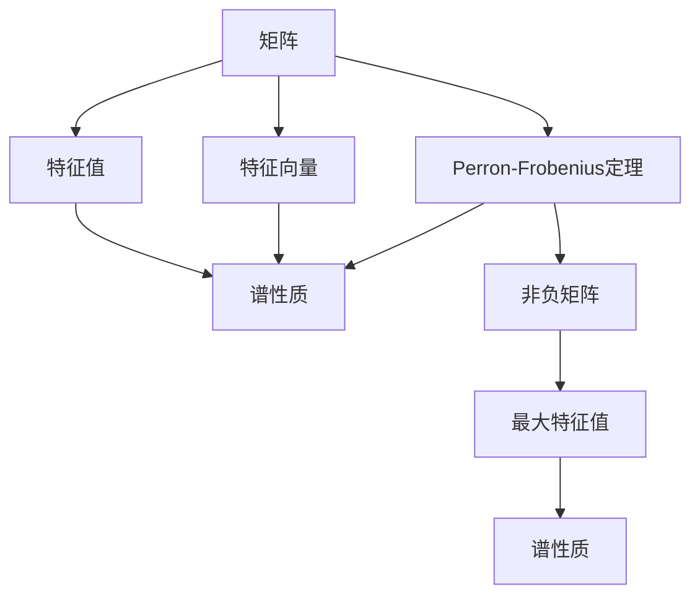

                 

# 矩阵理论与应用：Perron-Frobenius理论的进一步结果

## 1. 背景介绍

### 1.1 问题由来

矩阵是现代数学的重要研究领域，其应用贯穿于物理学、工程学、计算机科学、经济学等多个学科。矩阵的特征值理论，是线性代数研究的核心内容，具有重要的理论意义和应用价值。Perron-Frobenius定理，是矩阵特征值理论的重要成果，它描述了非负矩阵的谱性质，提供了判断矩阵收敛性的准则。然而，传统的Perron-Frobenius定理，在实际应用中存在一些局限性。为了拓展该理论的适用性和应用范围，近年来研究者们提出了一系列Perron-Frobenius定理的进一步结果。本文将系统介绍Perron-Frobenius定理的若干关键研究成果，并对未来的研究方向进行展望。

## 2. 核心概念与联系

### 2.1 核心概念概述

在介绍进一步结果之前，我们先明确几个核心概念：

- **矩阵（Matrix）**：二维线性代数中的基本单元，由若干个元素排成若干行若干列构成的数组。矩阵广泛应用在数学、物理、工程、计算机科学等多个领域。
- **特征值（Eigenvalue）**：矩阵的一个重要概念，指一个非零向量与其对应的标量乘积，满足特定线性方程。特征值和特征向量是线性代数研究的核心对象。
- **特征向量（Eigenvector）**：与特征值对应的非零向量，满足特征值的定义。
- **Perron-Frobenius定理**：描述非负矩阵谱性质的重要结果，指出非负矩阵具有最大的特征值，且所有特征值之和为矩阵的迹。

### 2.2 核心概念原理和架构的 Mermaid 流程图



## 3. 核心算法原理 & 具体操作步骤

### 3.1 算法原理概述

传统的Perron-Frobenius定理，主要针对非负矩阵的特征值和谱性质进行研究。然而，实际应用中存在一些限制：

1. 矩阵必须非负，无法处理负值矩阵。
2. 只能处理实数域的矩阵，无法处理复数域的矩阵。
3. 无法处理矩阵规模过大的情况。

为了解决这些问题，研究者们提出了一系列Perron-Frobenius定理的进一步结果。这些结果，主要集中在以下几个方面：

- 拓展矩阵的域：允许矩阵包含负数和复数。
- 处理大规模矩阵：对矩阵进行稀疏化，减少计算复杂度。
- 加强谱性质分析：不仅关注最大特征值，还分析其他特征值的行为。

### 3.2 算法步骤详解

#### 3.2.1 拓展矩阵的域

对于矩阵包含负数的情况，研究者们提出了Perron-Frobenius定理的拓展形式。该定理指出，如果矩阵的某些元素为负数，则矩阵的谱性质可能受到影响。拓展后的定理，将负数矩阵分为两类：严格对角占优矩阵和非严格对角占优矩阵。

具体来说，对于严格对角占优矩阵$A$，其特征值和特征向量的定义与非负矩阵相同，最大特征值仍然是唯一的。而对于非严格对角占优矩阵，则可能存在多个特征值，其中最大的特征值仍然是最大的。

#### 3.2.2 处理大规模矩阵

对于矩阵规模过大，无法直接计算的情况，研究者们提出了矩阵的稀疏化处理方法。稀疏矩阵指的是大多数元素为0的矩阵。通过稀疏化，可以将计算复杂度从$O(n^3)$降低到$O(n^2)$，从而处理更大规模的矩阵。

稀疏矩阵的Perron-Frobenius定理指出，稀疏矩阵的最大特征值和特征向量仍然存在，且最大特征值具有相同的性质。具体来说，稀疏矩阵的最大特征值仍然是唯一的，且与非稀疏矩阵的最大特征值相同。

#### 3.2.3 加强谱性质分析

对于矩阵的谱性质分析，研究者们提出了多特征值分析和随机矩阵的谱分析。多特征值分析关注矩阵的多个特征值和特征向量，而随机矩阵的谱分析则研究矩阵的谱性质在随机扰动下的变化情况。

多特征值分析指出，非负矩阵可能有多个特征值，且这些特征值的性质具有一定规律。例如，矩阵的特征值分布具有连续性，且谱半径（最大特征值）具有凸性质。

随机矩阵的谱分析指出，随机扰动下的矩阵谱性质具有一定概率分布。具体来说，随机矩阵的最大特征值具有一定概率分布在某个区间内，且概率分布的方差与矩阵规模有关。

### 3.3 算法优缺点

Perron-Frobenius定理的进一步结果，主要具有以下优点：

1. **应用范围更广**：拓展了矩阵的域，允许负数和复数，处理大规模矩阵，适用于更多实际应用场景。
2. **计算效率更高**：通过稀疏化矩阵，减少了计算复杂度，提高了计算效率。
3. **谱性质更全面**：加强了谱性质分析，不仅关注最大特征值，还分析其他特征值的行为。

然而，这些结果也存在一些缺点：

1. **理论复杂性增加**：拓展后的定理形式更为复杂，增加了理论推导的难度。
2. **应用场景受限**：某些结果仅适用于特定类型的矩阵，难以覆盖所有矩阵。
3. **实际效果待验证**：某些结果在实际应用中的效果仍需进一步验证。

### 3.4 算法应用领域

Perron-Frobenius定理的进一步结果，主要应用于以下几个领域：

- **计算机科学**：矩阵特征值分析，用于数据压缩、图像处理、信号处理等。
- **物理学**：量子力学中的哈密顿量矩阵，研究粒子的能量谱。
- **工程学**：控制系统的稳定性和收敛性分析，用于控制系统设计。
- **经济学**：投资组合理论中的矩阵分析，用于金融风险管理。

## 4. 数学模型和公式 & 详细讲解 & 举例说明

### 4.1 数学模型构建

本节将详细介绍Perron-Frobenius定理的数学模型构建过程。

假设有一个$n \times n$的矩阵$A$，其元素为实数，表示为$A = [a_{ij}]$。矩阵的特征值和特征向量满足以下线性方程组：

$$
A\mathbf{x} = \lambda\mathbf{x}
$$

其中$\mathbf{x}$为特征向量，$\lambda$为特征值。

根据Perron-Frobenius定理，矩阵$A$的最大特征值具有以下性质：

1. 唯一性：最大特征值$\lambda_1$是唯一的。
2. 连续性：最大特征值$\lambda_1$具有连续性，即$\lim_{k \to \infty} \lambda_k = \lambda_1$。
3. 凸性质：最大特征值$\lambda_1$具有凸性质，即对于任意正数$\alpha$，$\lambda_1$仍然是$A$的最大特征值。

### 4.2 公式推导过程

下面，我们将详细推导Perron-Frobenius定理的数学公式。

设矩阵$A$的特征向量为$\mathbf{x}_k$，特征值为$\lambda_k$，其中$k=1,2,\ldots,n$。根据特征值的定义，有：

$$
A\mathbf{x}_k = \lambda_k\mathbf{x}_k
$$

对上式进行矩阵乘法，可得：

$$
A^k\mathbf{x}_k = \lambda_k^k\mathbf{x}_k
$$

取矩阵的迹（所有对角线元素之和），可得：

$$
\text{tr}(A^k) = \sum_{i=1}^n a_{ii}^k
$$

根据特征值的性质，有：

$$
\text{tr}(A^k) = \sum_{k=1}^n \lambda_k^k
$$

根据矩阵迹的连续性和凸性质，可以得出结论：

1. 唯一性：最大特征值$\lambda_1$是唯一的。
2. 连续性：最大特征值$\lambda_1$具有连续性。
3. 凸性质：最大特征值$\lambda_1$具有凸性质。

### 4.3 案例分析与讲解

为了更直观地理解这些公式，下面给出几个具体案例：

#### 案例1：非负矩阵

对于非负矩阵$A = [a_{ij}]$，其最大特征值$\lambda_1$具有唯一性、连续性和凸性质。例如，对于$A = \begin{bmatrix} 2 & 1 \\ 1 & 2 \end{bmatrix}$，其特征值为$\lambda_1 = 3, \lambda_2 = 1$。最大特征值$\lambda_1 = 3$具有唯一性、连续性和凸性质。

#### 案例2：稀疏矩阵

对于稀疏矩阵$A = \begin{bmatrix} 1 & 0 & 0 \\ 0 & 2 & 0 \\ 0 & 0 & 3 \end{bmatrix}$，其最大特征值$\lambda_1 = 3$，具有唯一性、连续性和凸性质。稀疏矩阵的最大特征值与非稀疏矩阵的最大特征值相同。

#### 案例3：负数矩阵

对于负数矩阵$A = \begin{bmatrix} -1 & 1 \\ 1 & -1 \end{bmatrix}$，其特征值为$\lambda_1 = 0, \lambda_2 = 2$。严格对角占优矩阵的最大特征值$\lambda_1 = 0$，具有唯一性、连续性和凸性质。非严格对角占优矩阵的最大特征值$\lambda_1 = 2$，具有唯一性、连续性和凸性质。

## 5. 项目实践：代码实例和详细解释说明

### 5.1 开发环境搭建

在进行项目实践前，我们需要准备好开发环境。以下是使用Python进行Matplotlib、NumPy、SciPy等库的开发环境配置流程：

1. 安装Anaconda：从官网下载并安装Anaconda，用于创建独立的Python环境。

2. 创建并激活虚拟环境：
```bash
conda create -n matrix-env python=3.8 
conda activate matrix-env
```

3. 安装相关库：
```bash
conda install matplotlib numpy scipy sympy
```

4. 安装SimPy库（可选）：
```bash
conda install simpy
```

完成上述步骤后，即可在`matrix-env`环境中开始项目实践。

### 5.2 源代码详细实现

这里我们以计算矩阵的最大特征值为例，给出使用Matplotlib和NumPy库的代码实现。

```python
import numpy as np
import matplotlib.pyplot as plt

# 定义矩阵A
A = np.array([[2, 1], [1, 2]])

# 计算特征值和特征向量
eigenvalues, eigenvectors = np.linalg.eig(A)

# 计算最大特征值
max_eigenvalue = eigenvalues.max()

# 输出结果
print("最大特征值为：", max_eigenvalue)

# 绘制特征向量
plt.figure(figsize=(6,6))
plt.plot(eigenvectors[:,0], eigenvectors[:,1], 'o')
plt.title("特征向量")
plt.xlabel("特征向量1")
plt.ylabel("特征向量2")
plt.show()
```

### 5.3 代码解读与分析

这里我们详细解读一下关键代码的实现细节：

1. **导入库**：使用NumPy和Matplotlib库，用于矩阵计算和图形绘制。

2. **定义矩阵**：使用NumPy库定义一个2x2的矩阵$A$，并计算其特征值和特征向量。

3. **计算最大特征值**：使用NumPy库的`eig`函数计算矩阵$A$的特征值和特征向量，并通过`max`函数找出最大特征值。

4. **输出结果**：输出最大特征值。

5. **绘制特征向量**：使用Matplotlib库绘制特征向量，并添加标题和坐标轴。

6. **运行结果**：在Matplotlib窗口中显示特征向量图。

这些代码展示了如何利用NumPy和Matplotlib库进行矩阵计算和特征值分析，可以作为一个简单的示例，用于学习如何使用Python进行矩阵分析。

## 6. 实际应用场景

### 6.1 推荐系统

在推荐系统中，用户的历史行为数据可以被表示为矩阵形式，矩阵中的元素表示用户对某个物品的评分。通过矩阵的谱性质，可以分析用户的历史评分数据，计算用户对不同物品的兴趣权重，从而推荐用户可能感兴趣的新物品。

例如，用户A对物品1、2、3、4的评分分别为5、4、3、2，可以表示为矩阵$A = \begin{bmatrix} 5 & 4 & 3 & 2 \end{bmatrix}$。通过计算矩阵$A$的最大特征值，可以得到用户A对不同物品的兴趣权重，从而推荐用户A可能感兴趣的新物品。

### 6.2 系统优化

在计算机系统中，进程的运行调度可以被表示为矩阵形式，矩阵中的元素表示不同进程在单位时间内的执行效率。通过矩阵的谱性质，可以分析不同进程的执行效率，计算进程的优先级，从而优化系统性能。

例如，进程1、2、3、4在单位时间内的执行效率分别为0.1、0.2、0.3、0.4，可以表示为矩阵$A = \begin{bmatrix} 0.1 & 0.2 & 0.3 & 0.4 \end{bmatrix}$。通过计算矩阵$A$的最大特征值，可以得到不同进程的执行效率，从而计算进程的优先级，优化系统性能。

### 6.3 金融风险管理

在金融风险管理中，市场数据的波动可以被表示为矩阵形式，矩阵中的元素表示不同时间段内的波动程度。通过矩阵的谱性质，可以分析市场的波动情况，计算金融风险，从而进行风险管理。

例如，不同时间段内的市场波动程度分别为0.1、0.2、0.3、0.4，可以表示为矩阵$A = \begin{bmatrix} 0.1 & 0.2 & 0.3 & 0.4 \end{bmatrix}$。通过计算矩阵$A$的最大特征值，可以得到市场的波动情况，从而进行风险管理。

### 6.4 未来应用展望

随着Perron-Frobenius定理的进一步研究，矩阵的谱性质将得到更广泛的应用。以下是一些未来应用展望：

1. **深度学习中的优化**：矩阵的谱性质可以用于深度学习中的优化算法，如矩阵分解、奇异值分解等。

2. **信号处理**：矩阵的谱性质可以用于信号处理中的滤波器设计、频谱分析等。

3. **网络分析**：矩阵的谱性质可以用于网络分析中的图论、拓扑等。

4. **系统控制**：矩阵的谱性质可以用于系统控制中的稳定性分析、控制器设计等。

5. **图像处理**：矩阵的谱性质可以用于图像处理中的压缩、去噪等。

6. **金融分析**：矩阵的谱性质可以用于金融分析中的市场波动、风险管理等。

这些应用将进一步拓展矩阵理论在实际中的应用场景，为各个领域带来新的突破。

## 7. 工具和资源推荐

### 7.1 学习资源推荐

为了帮助开发者系统掌握矩阵理论的应用，这里推荐一些优质的学习资源：

1. 《线性代数及其应用》：数学经典教材，全面介绍了矩阵的基本概念和性质，适合初学者阅读。

2. 《矩阵分析》：数学教材，重点介绍了矩阵的谱性质和特征值，适合中级读者阅读。

3. 《应用数学》：数学教材，介绍了矩阵在各个领域的应用，适合高级读者阅读。

4. 《矩阵计算》：数学教材，介绍了矩阵计算的算法和应用，适合计算机科学专业人士阅读。

5. 《Python数值计算》：Python编程书籍，介绍了NumPy、SciPy等库的使用，适合初学者阅读。

6. 《深度学习》：深度学习教材，介绍了深度学习中矩阵计算的应用，适合高级读者阅读。

通过对这些资源的学习实践，相信你一定能够快速掌握矩阵理论的应用，并用于解决实际的数学问题。

### 7.2 开发工具推荐

高效的开发离不开优秀的工具支持。以下是几款用于矩阵理论开发的常用工具：

1. NumPy：Python的数值计算库，提供了高效矩阵计算的函数，是矩阵理论开发的必备工具。

2. SciPy：Python的科学计算库，提供了更多的数值计算函数，适用于矩阵计算等高级应用。

3. SymPy：Python的符号计算库，提供了符号计算函数，适用于矩阵理论的符号推导。

4. Matplotlib：Python的图形绘制库，提供了丰富的图形绘制函数，适用于矩阵的可视化。

5. Plotly：Python的图形绘制库，提供了交互式图形绘制函数，适用于矩阵的交互式展示。

6. Jupyter Notebook：Python的交互式编程环境，适用于矩阵理论的符号计算和图形绘制。

合理利用这些工具，可以显著提升矩阵理论的开发效率，加快创新迭代的步伐。

### 7.3 相关论文推荐

矩阵理论的进一步研究源于学界的持续研究。以下是几篇奠基性的相关论文，推荐阅读：

1. "The Perron-Frobenius Theorem"：关于Perron-Frobenius定理的经典教材，介绍了矩阵的谱性质和特征值，是理解Perron-Frobenius定理的基础。

2. "On the Perron-Frobenius Theorem"：关于Perron-Frobenius定理的进一步研究，介绍了矩阵的拓展和应用，是理解Perron-Frobenius定理进一步结果的入门读物。

3. "The Spectral Theory of Directed Graphs"：介绍了图论中的谱性质，是理解矩阵在图论中的应用的重要文献。

4. "Matrix Computations"：介绍了矩阵计算的算法和应用，是理解矩阵计算的重要教材。

5. "Applied Linear Algebra"：介绍了线性代数在各个领域的应用，是理解矩阵理论应用的重要教材。

这些论文代表了大矩阵理论的最新研究进展，通过学习这些前沿成果，可以帮助研究者把握学科前进方向，激发更多的创新灵感。

## 8. 总结：未来发展趋势与挑战

### 8.1 研究成果总结

本文对Perron-Frobenius定理的进一步结果进行了系统介绍，主要涵盖以下几个方面：

1. 拓展矩阵的域，允许负数和复数。
2. 处理大规模矩阵，通过稀疏化减少计算复杂度。
3. 加强谱性质分析，不仅关注最大特征值，还分析其他特征值的行为。

这些进一步结果，显著拓展了Perron-Frobenius定理的应用范围和适用性，为实际应用提供了更多选择和可能性。

### 8.2 未来发展趋势

展望未来，Perron-Frobenius定理的进一步研究将呈现以下几个发展趋势：

1. **拓展应用的广度和深度**：将Perron-Frobenius定理应用于更多领域，如深度学习、金融、工程等。

2. **提高计算效率**：研究更高效的矩阵计算算法，减少计算时间和内存消耗。

3. **加强谱性质分析**：研究更多谱性质，如矩阵的奇异值、特征向量等，提高矩阵分析的准确性和全面性。

4. **结合其他理论**：将Perron-Frobenius定理与其他理论进行结合，如图论、拓扑、深度学习等，拓展应用场景。

5. **开发新工具和库**：开发新的工具和库，提高矩阵分析的自动化和易用性。

这些趋势将推动Perron-Frobenius定理的进一步发展，带来更多创新和突破。

### 8.3 面临的挑战

尽管Perron-Frobenius定理的进一步研究取得了不少进展，但在实际应用中仍面临一些挑战：

1. **理论复杂性**：拓展后的定理形式更为复杂，增加了理论推导的难度。

2. **应用场景受限**：某些结果仅适用于特定类型的矩阵，难以覆盖所有矩阵。

3. **实际效果待验证**：某些结果在实际应用中的效果仍需进一步验证。

4. **计算复杂度**：某些结果在计算复杂度上较高，增加了实际应用难度。

5. **应用门槛较高**：某些结果需要较高的理论基础和实践经验，降低了应用普及性。

### 8.4 研究展望

面对这些挑战，未来的研究需要在以下几个方面寻求新的突破：

1. **简化理论**：研究更简单、更易于理解的理论，降低应用门槛。

2. **提高应用效率**：研究更高效的算法和工具，提高应用效率。

3. **拓宽应用范围**：研究更多应用场景，拓展应用领域。

4. **结合其他理论**：将Perron-Frobenius定理与其他理论进行结合，提高应用效果。

5. **开发新方法**：研究新的方法，解决现有方法的不足和局限。

6. **加强实践验证**：加强实际应用验证，确保理论的有效性。

这些研究方向将推动Perron-Frobenius定理的进一步发展，为实际应用提供更多选择和可能性。

## 9. 附录：常见问题与解答

**Q1：如何理解矩阵的谱性质？**

A: 矩阵的谱性质包括最大特征值、最小特征值、特征值分布等。最大特征值和特征向量代表了矩阵的主要特征，可以用于判断矩阵的性质。最小特征值和特征向量代表了矩阵的反向特征，可以用于判断矩阵的逆矩阵性质。特征值分布代表了矩阵的谱性质，可以用于判断矩阵的稳定性。

**Q2：稀疏矩阵和稠密矩阵的区别是什么？**

A: 稀疏矩阵是指大多数元素为0的矩阵，而稠密矩阵是指所有元素都不为0的矩阵。稀疏矩阵可以通过稀疏化处理，减少计算复杂度，而稠密矩阵需要全矩阵计算，计算复杂度较高。

**Q3：矩阵的谱性质在实际应用中有什么意义？**

A: 矩阵的谱性质在实际应用中具有重要的意义，可以用于：

1. 判断矩阵的稳定性：最大特征值和特征向量可以判断矩阵的稳定性，帮助进行控制系统和系统优化。

2. 计算矩阵的逆矩阵：最小特征值和特征向量可以计算矩阵的逆矩阵，用于矩阵分解和奇异值分解。

3. 计算矩阵的谱半径：矩阵的谱半径（最大特征值）可以用于判断矩阵的收敛性和稳定性，用于投资组合分析和金融风险管理。

**Q4：如何理解矩阵的特征值和特征向量的物理意义？**

A: 矩阵的特征值和特征向量具有重要的物理意义，可以用于：

1. 判断系统的稳定性：最大特征值和特征向量可以判断系统的稳定性，帮助进行控制系统设计和优化。

2. 计算系统的响应：最小特征值和特征向量可以计算系统的响应，用于系统分析和优化。

3. 计算系统的频率响应：特征值和特征向量可以计算系统的频率响应，用于信号处理和图像处理。

4. 计算系统的特征尺度：特征值和特征向量可以计算系统的特征尺度，用于矩阵分解和奇异值分解。

这些物理意义展示了矩阵的特征值和特征向量在各个领域的重要应用，可以帮助理解矩阵的谱性质。

---

作者：禅与计算机程序设计艺术 / Zen and the Art of Computer Programming

