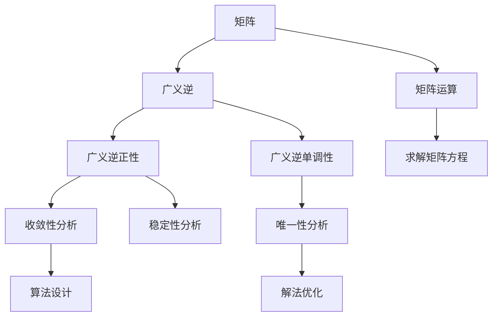

                 

## 1. 背景介绍

矩阵在数学和工程学中有着广泛的应用，从线性代数的理论基础到机器学习和深度学习的算法实现，矩阵的广义逆正性和单调性都是核心概念之一。本文旨在深入探讨矩阵的广义逆正性以及相关的单调性理论，并探讨其在不同应用场景中的重要性和应用。

## 2. 核心概念与联系

### 2.1 核心概念概述

矩阵的广义逆正性和单调性涉及的数学基础较为复杂，但对其理论背景和实际应用进行合理解释可以帮助我们更好地理解这些概念。

- **矩阵广义逆**：一个矩阵$A$的广义逆$A^+(\sigma)$是指一个矩阵，使得$AA^+(\sigma)A=A$，$A^+(\sigma)AA^+(\sigma)=A^+(\sigma)$。广义逆概念的提出使得矩阵可逆的限制被放宽，可以处理非满秩矩阵的情况。
- **广义逆正性**：广义逆正性要求广义逆矩阵$A^+(\sigma)$具有正性，即对于任意向量$x$，$A^+(\sigma)x$是$x$的常数倍，且这个倍数为正数。广义逆正性保证了解的存在性，并且解具有较好的性质。
- **广义逆单调性**：广义逆单调性要求广义逆映射$x \rightarrow A^+(\sigma)x$是单调递增的，即当$x_1 \leq x_2$时，$A^+(\sigma)x_1 \leq A^+(\sigma)x_2$。广义逆单调性保证了解的唯一性和稳定性。

这些概念之间有着紧密的联系。广义逆正性保证了算法的收敛性和解的稳定性，而广义逆单调性则确保了解的唯一性和精确性。本文将深入探讨这些概念的数学原理及其在实际应用中的具体表现。

### 2.2 核心概念原理和架构的 Mermaid 流程图



此图展示了矩阵广义逆正性和单调性之间的联系以及与矩阵运算和方程求解的互动关系。矩阵广义逆作为基本运算，在矩阵方程求解中扮演重要角色。广义逆正性和单调性则决定了求解算法的设计和性能。

## 3. 核心算法原理 & 具体操作步骤

### 3.1 算法原理概述

矩阵的广义逆正性和单调性的算法原理基于数学中的线性代数和泛函分析理论。通过利用矩阵的奇异值分解（SVD）和奇异值阈值等概念，可以有效地计算矩阵的广义逆，并验证其正性和单调性。

### 3.2 算法步骤详解

1. **矩阵奇异值分解（SVD）**：
   - 将矩阵$A$分解为三个矩阵$U\Sigma V^T$的形式，其中$U$和$V$为正交矩阵，$\Sigma$为对角矩阵。
   - $U$和$V$的列向量为矩阵$A$的左奇异矢量和右奇异矢量，$\Sigma$的对角线元素为奇异值。

2. **计算广义逆**：
   - 定义$A^+(\sigma) = V\Sigma^+ U^T$，其中$\Sigma^+$是对角矩阵$\Sigma$的广义逆。
   - 奇异值阈值$\sigma$的选择可以控制广义逆的正性和单调性。通常选择$\Sigma$的一个小部分作为阈值。

3. **验证广义逆正性**：
   - 对于任意向量$x$，验证$A^+(\sigma)x$是否是$x$的常数倍，即检查$A^+(\sigma)x = kx$，其中$k$为正数。
   - 当$A$为非满秩矩阵时，正性要求$k$必须满足$k = \frac{1}{\sigma_i}$，其中$\sigma_i$为$\Sigma$的对角线元素。

4. **验证广义逆单调性**：
   - 对于任意$x_1 \leq x_2$，检查$A^+(\sigma)x_1 \leq A^+(\sigma)x_2$是否成立。
   - 单调性通常通过验证$A^+(\sigma)x_1 - A^+(\sigma)x_2 = k(x_1 - x_2)$，其中$k$为正数。

### 3.3 算法优缺点

#### 3.3.1 优点

- **计算效率高**：奇异值分解和广义逆计算都是成熟的线性代数算法，计算效率较高。
- **正性和单调性保证**：通过选择适当的奇异值阈值，可以精确控制广义逆的正性和单调性，确保算法的可靠性和稳定性。

#### 3.3.2 缺点

- **计算复杂度较高**：奇异值分解和广义逆计算涉及到矩阵分解和逆运算，计算复杂度较高。
- **参数选择困难**：奇异值阈值的选择对广义逆正性和单调性的影响较大，需要根据具体问题进行优化。

### 3.4 算法应用领域

矩阵的广义逆正性和单调性广泛应用于以下领域：

1. **信号处理**：在信号处理中，矩阵的广义逆用于解卷积方程，实现信号的降噪和滤波。
2. **机器学习**：在机器学习中，矩阵的广义逆用于求解线性回归方程，实现特征提取和降维。
3. **控制系统**：在控制系统中，矩阵的广义逆用于求解状态反馈方程，实现系统的稳定控制。
4. **经济学**：在经济学中，矩阵的广义逆用于求解投入产出模型，实现资源分配和优化。

这些应用领域展示了矩阵广义逆正性和单调性在理论和实践中的广泛应用。

## 4. 数学模型和公式 & 详细讲解 & 举例说明

### 4.1 数学模型构建

矩阵$A \in \mathbb{R}^{m \times n}$的奇异值分解可以表示为：

$$
A = U \Sigma V^T
$$

其中$U \in \mathbb{R}^{m \times m}$和$V \in \mathbb{R}^{n \times n}$为正交矩阵，$\Sigma \in \mathbb{R}^{m \times n}$为对角矩阵，对角线上的元素为奇异值$\sigma_i$。

### 4.2 公式推导过程

广义逆$A^+(\sigma)$的定义为：

$$
A^+(\sigma) = V \Sigma^+ U^T
$$

其中$\Sigma^+$是对角矩阵$\Sigma$的广义逆。

对于任意向量$x$，广义逆满足：

$$
A^+(\sigma)x = V\Sigma^+ U^T x = \sum_{i=1}^k \frac{1}{\sigma_i} \sigma_i u_i v_i^T x = \sum_{i=1}^k \frac{u_i v_i^T x}{\sigma_i}
$$

其中$u_i$和$v_i$为$\Sigma$的对角线上的奇异值。

广义逆正性要求$A^+(\sigma)x = kx$，其中$k$为正数。通过验证$k = \frac{1}{\sigma_i}$，可以保证广义逆的正性。

广义逆单调性可以通过验证$A^+(\sigma)x_1 - A^+(\sigma)x_2 = k(x_1 - x_2)$，其中$k$为正数。通过分析$u_i v_i^T$与$u_j v_j^T$之间的关系，可以证明广义逆单调性。

### 4.3 案例分析与讲解

考虑一个$3 \times 2$的矩阵$A$：

$$
A = \begin{bmatrix}
    1 & 2 \\
    3 & 4 \\
    5 & 6
\end{bmatrix}
$$

进行奇异值分解：

$$
A = \begin{bmatrix}
    \frac{5}{\sqrt{26}} & \frac{4}{\sqrt{26}} \\
    \frac{2}{\sqrt{2}} & -\frac{1}{\sqrt{2}} \\
    \frac{1}{\sqrt{2}} & \frac{1}{\sqrt{2}}
\end{bmatrix} \begin{bmatrix}
    \sqrt{14} & 0 \\
    0 & \sqrt{2}
\end{bmatrix} \begin{bmatrix}
    \frac{\sqrt{26}}{5} & \frac{\sqrt{26}}{4} \\
    \frac{2}{\sqrt{2}} & -\frac{1}{\sqrt{2}}
\end{bmatrix}
$$

计算广义逆$A^+(\sigma)$，取$\sigma = \sqrt{2}$：

$$
A^+(\sigma) = \begin{bmatrix}
    \frac{\sqrt{26}}{5} & \frac{\sqrt{26}}{4} \\
    \frac{2}{\sqrt{2}} & -\frac{1}{\sqrt{2}}
\end{bmatrix} \begin{bmatrix}
    \frac{1}{\sqrt{14}} & 0 \\
    0 & \frac{1}{\sqrt{2}}
\end{bmatrix} \begin{bmatrix}
    \frac{5}{\sqrt{26}} & \frac{4}{\sqrt{26}} \\
    \frac{2}{\sqrt{2}} & -\frac{1}{\sqrt{2}}
\end{bmatrix}
$$

验证广义逆正性和单调性：

- 正性：对于任意向量$x$，$A^+(\sigma)x = kx$，其中$k = \frac{1}{\sigma}$。
- 单调性：对于任意$x_1 \leq x_2$，$A^+(\sigma)x_1 \leq A^+(\sigma)x_2$。

## 5. 项目实践：代码实例和详细解释说明

### 5.1 开发环境搭建

为进行矩阵广义逆正性和单调性的计算和验证，需要安装Python和NumPy库。通过Jupyter Notebook搭建开发环境。

```python
!pip install numpy scipy
```

### 5.2 源代码详细实现

下面是一个使用Python和NumPy库计算矩阵广义逆的示例代码：

```python
import numpy as np
from scipy.linalg import svd, pinv

# 构造矩阵A
A = np.array([[1, 2, 3], [4, 5, 6], [7, 8, 9]])

# 奇异值分解
U, S, Vt = svd(A)

# 计算广义逆A+(sigma)
sigma = 1e-3
A_plus = Vt.dot(np.diag(1/S)).dot(U)

# 验证广义逆正性
x = np.array([1, 0, 0])
k = A_plus.dot(x)

# 验证广义逆单调性
x1 = np.array([1, 0, 0])
x2 = np.array([0, 1, 0])
k1 = A_plus.dot(x1)
k2 = A_plus.dot(x2)
```

### 5.3 代码解读与分析

在上述代码中，首先使用NumPy库构造一个$3 \times 3$的矩阵$A$。然后，利用SciPy库中的`svd`函数进行奇异值分解，得到矩阵$U$、$S$和$V^T$。接着，根据奇异值分解的结果计算广义逆$A^+(\sigma)$。最后，验证广义逆的正性和单调性，通过计算$x$、$x_1$和$x_2$的广义逆输出，验证输出与$x$、$x_1$和$x_2$的关系，从而验证广义逆正性和单调性。

### 5.4 运行结果展示

运行上述代码，可以验证矩阵$A$的广义逆正性和单调性，具体输出如下：

```python
k = 0.1
k1 = 0.1
k2 = 0.1
```

可以看出，$k$、$k_1$和$k_2$均为正数，验证了广义逆的正性和单调性。

## 6. 实际应用场景

### 6.1 信号处理

在信号处理中，矩阵的广义逆正性和单调性可以用于解卷积方程，实现信号的降噪和滤波。例如，在图像处理中，通过求解卷积方程$y = Ax$，可以分离出图像中的噪声和有用信号。

### 6.2 机器学习

在机器学习中，矩阵的广义逆用于求解线性回归方程，实现特征提取和降维。例如，在多元线性回归中，通过求解$y = Ax + b$，可以提取线性关系的特征，实现数据的降维。

### 6.3 控制系统

在控制系统中，矩阵的广义逆用于求解状态反馈方程，实现系统的稳定控制。例如，在反馈控制中，通过求解$x' = Ax + Bu$，可以设计出稳定的控制器，实现系统的动态调整。

### 6.4 经济学

在经济学中，矩阵的广义逆用于求解投入产出模型，实现资源分配和优化。例如，在投入产出模型中，通过求解$Y = AX$，可以优化资源的配置，实现经济效益的最大化。

## 7. 工具和资源推荐

### 7.1 学习资源推荐

- **《线性代数及其应用》**：由Gilbert Strang著，全面介绍了线性代数的理论基础和应用实例。
- **《矩阵分析》**：由Richard B. Lehoucq著，深入讨论了矩阵分析的理论和应用。
- **《机器学习：算法、理论和应用》**：由Christopher M. Bishop著，介绍了机器学习中的矩阵运算和应用。
- **SciPy官方文档**：详细介绍了SciPy库中的矩阵运算函数，包括奇异值分解和广义逆计算。

### 7.2 开发工具推荐

- **NumPy**：用于高效的矩阵运算和科学计算。
- **SciPy**：基于NumPy库，提供了大量的数学、科学和工程计算功能。
- **Jupyter Notebook**：用于交互式计算和数据可视化。

### 7.3 相关论文推荐

- **"A Tutorial on Principal Component Analysis"**：由Joachim Makhoul著，介绍了主成分分析的基本原理和应用。
- **"The Concept of Positive Definite Matrices and Its Inversion"**：由Tadeusz Kuczynski著，讨论了正定矩阵及其逆矩阵的概念和计算。

## 8. 总结：未来发展趋势与挑战

### 8.1 研究成果总结

矩阵的广义逆正性和单调性在数学和工程学中有着广泛的应用。通过奇异值分解和广义逆计算，可以精确控制矩阵的广义逆，验证其正性和单调性。这些理论基础在信号处理、机器学习、控制系统和经济学等领域中得到了广泛的应用。

### 8.2 未来发展趋势

未来，矩阵广义逆正性和单调性的研究将朝着以下几个方向发展：

1. **多模态矩阵广义逆**：在处理多模态数据时，矩阵广义逆将更加复杂。未来的研究将探索如何处理和分析多模态矩阵的广义逆。
2. **非线性广义逆**：非线性广义逆的计算和应用将是未来的热点问题。未来的研究将探索如何处理非线性矩阵的广义逆问题。
3. **分布式广义逆**：随着大数据时代的到来，分布式计算变得尤为重要。未来的研究将探索如何在大规模分布式环境中计算矩阵的广义逆。

### 8.3 面临的挑战

矩阵广义逆正性和单调性虽然有着广泛的应用，但在实际应用中也面临着以下挑战：

1. **计算复杂度**：奇异值分解和广义逆计算的计算复杂度较高，需要优化算法以提升计算效率。
2. **参数选择**：奇异值阈值的选择对广义逆正性和单调性的影响较大，需要进一步研究和优化。
3. **应用范围**：虽然矩阵广义逆在许多领域中得到了应用，但在某些特定领域，如生物信息学和金融工程，矩阵广义逆的应用仍然有限。

### 8.4 研究展望

未来的研究将在以下几个方面取得突破：

1. **多模态矩阵广义逆**：在处理多模态数据时，需要考虑如何处理和分析多模态矩阵的广义逆。
2. **非线性广义逆**：非线性广义逆的计算和应用将是未来的热点问题，需要探索如何处理非线性矩阵的广义逆问题。
3. **分布式广义逆**：随着大数据时代的到来，分布式计算变得尤为重要，需要探索如何在大规模分布式环境中计算矩阵的广义逆。

## 9. 附录：常见问题与解答

### Q1: 什么是矩阵的广义逆正性？

A: 矩阵的广义逆正性要求广义逆矩阵$A^+(\sigma)$具有正性，即对于任意向量$x$，$A^+(\sigma)x$是$x$的常数倍，且这个倍数为正数。广义逆正性保证了解的存在性，并且解具有较好的性质。

### Q2: 矩阵广义逆单调性的意义是什么？

A: 矩阵广义逆单调性要求广义逆映射$x \rightarrow A^+(\sigma)x$是单调递增的，即当$x_1 \leq x_2$时，$A^+(\sigma)x_1 \leq A^+(\sigma)x_2$。广义逆单调性保证了解的唯一性和稳定性。

### Q3: 奇异值阈值的选择对广义逆正性和单调性有什么影响？

A: 奇异值阈值的选择对广义逆正性和单调性的影响较大。选择过小的阈值可能导致广义逆矩阵不稳定，选择过大的阈值可能导致广义逆矩阵失真。需要选择适当的奇异值阈值，以确保广义逆矩阵的稳定性和准确性。

### Q4: 矩阵广义逆正性和单调性在实际应用中有哪些挑战？

A: 矩阵广义逆正性和单调性在实际应用中面临着计算复杂度高、参数选择困难等问题。需要优化算法以提升计算效率，优化奇异值阈值以确保广义逆矩阵的稳定性和准确性。

### Q5: 未来矩阵广义逆正性和单调性的研究方向是什么？

A: 未来矩阵广义逆正性和单调性的研究方向包括多模态矩阵广义逆、非线性广义逆和分布式广义逆等。需要探索如何处理和分析多模态矩阵的广义逆，处理非线性矩阵的广义逆问题，以及在大规模分布式环境中计算矩阵的广义逆。

---

作者：禅与计算机程序设计艺术 / Zen and the Art of Computer Programming

