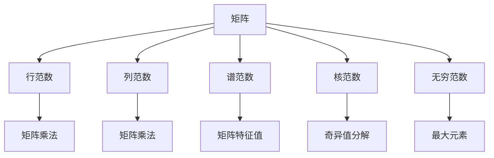

                 

# 矩阵理论与应用：矩阵范数

> 关键词：矩阵范数, 矩阵乘法, 向量范数, 矩阵分解, 奇异值分解, 特征值, 谱范数, 矩阵条件数, 广义逆, 矩阵稳定性和可逆性

## 1. 背景介绍

矩阵范数是线性代数中的核心概念之一，用于衡量矩阵的大小或行为。它在数学、物理学、信号处理、数值分析、机器学习等多个领域有着广泛的应用。矩阵范数的研究历史悠久，最早可以追溯到20世纪初期，卡尔·弗莱克(Karl Fricke)提出了矩阵范数的定义。现代矩阵范数理论则由Kronecker、Weyl、Hadamard等学者进一步完善。本文将深入探讨矩阵范数的定义、性质及其在实际问题中的应用，为读者提供一个全面的理论框架和实践指南。

## 2. 核心概念与联系

### 2.1 核心概念概述

在矩阵理论中，矩阵范数是衡量矩阵行为或大小的一种度量方式。它定义了矩阵作为线性变换时所产生的"大小"，并可用于分析矩阵的稳定性和可逆性。在数学上，矩阵范数满足以下几个基本性质：

1. 非负性：$\|A\| \geq 0$，且当且仅当$A=0$时取等号。
2. 齐次性：$\|\alpha A\| = |\alpha| \cdot \|A\|$，其中$\alpha$为标量。
3. 三角不等式：$\|A + B\| \leq \|A\| + \|B\|$。

常见的矩阵范数包括：
- 行范数(矩阵每一行的最大元素之和)。
- 列范数(矩阵每一列的最大元素之和)。
- 谱范数(矩阵特征值中绝对值最大者)。
- 核范数(矩阵奇异值之和)。
- 无穷范数(矩阵中最大元素的指数)。

这些范数各有特点，适用于不同的问题和应用场景。

### 2.2 核心概念联系（Mermaid 流程图）



### 2.3 核心概念关系

矩阵范数是矩阵理论中的重要工具，其性质和定义与矩阵乘法、向量范数、矩阵分解等密切相关。例如，矩阵范数可以用于分析矩阵的稳定性和可逆性，如条件数，而矩阵乘法则是矩阵范数定义的基础。向量范数作为矩阵范数的一个特例，同样具有相似的基本性质。此外，矩阵分解如奇异值分解、特征值分解等，都是基于矩阵范数的理论工具。

## 3. 核心算法原理 & 具体操作步骤

### 3.1 算法原理概述

矩阵范数的定义可以推广到向量范数，因此我们可以先回顾向量范数的定义：

对于任意向量$\mathbf{x} = (x_1, x_2, \ldots, x_n)$，定义其p-范数为：

$$
\|\mathbf{x}\|_p = \left(\sum_{i=1}^n |x_i|^p\right)^{1/p} \quad (p \geq 1)
$$

根据此定义，向量范数通常有如下三种形式：

- 1-范数($\ell_1$范数)：$\|\mathbf{x}\|_1 = \sum_{i=1}^n |x_i|$
- 2-范数($\ell_2$范数)：$\|\mathbf{x}\|_2 = \sqrt{\sum_{i=1}^n x_i^2}$
- 无穷范数($\ell_\infty$范数)：$\|\mathbf{x}\|_\infty = \max_i |x_i|$

类似地，我们可以定义矩阵范数，其性质和向量范数有很多相似之处。

### 3.2 算法步骤详解

下面详细介绍矩阵范数的定义、计算和应用步骤：

**Step 1: 定义矩阵范数**

矩阵范数的定义可以推广到向量范数，对于任意矩阵$A$，定义其矩阵p-范数为：

$$
\|A\|_p = \left(\max_i \sum_{j=1}^n |a_{ij}|^p\right)^{1/p} \quad (p \geq 1)
$$

其中$a_{ij}$为矩阵$A$中的元素。

**Step 2: 计算矩阵范数**

计算矩阵范数通常需要求解矩阵的最大奇异值、特征值等。以谱范数为例，计算步骤如下：

1. 求解矩阵$A$的特征值$\lambda_1, \lambda_2, \ldots, \lambda_n$。
2. 取绝对值最大的特征值$\lambda_{\max} = \max_i |\lambda_i|$。
3. 定义谱范数$\|A\|_2 = \lambda_{\max}$。

对于其他类型的矩阵范数，计算方法略有不同。

**Step 3: 应用范数**

矩阵范数可以用于多个领域，例如：

- 矩阵分解：通过谱范数可以计算矩阵的奇异值，进而进行奇异值分解。
- 稳定性和可逆性：通过条件数（定义为谱范数与1-范数的比值）可以判断矩阵的稳定性和可逆性。
- 最优化问题：通过范数可以作为约束条件优化问题，求解最小二乘、正则化等问题。

### 3.3 算法优缺点

矩阵范数的优点包括：

- 定义简单，容易理解。
- 性质稳定，可用于分析矩阵的稳定性和可逆性。
- 与向量范数有紧密联系，计算方法相似。

缺点包括：

- 某些情况下计算复杂度较高，特别是谱范数。
- 不适用于所有类型的矩阵，例如奇异矩阵。
- 有些范数可能不符合实际的物理或应用意义。

### 3.4 算法应用领域

矩阵范数在多个领域中有着广泛的应用：

- 数学和物理学：用于求解方程组、计算矩阵分解等。
- 信号处理：用于滤波、降噪等。
- 统计学：用于主成分分析、特征提取等。
- 机器学习：用于矩阵分解、特征选择等。

## 4. 数学模型和公式 & 详细讲解 & 举例说明

### 4.1 数学模型构建

矩阵范数的定义可以推广到向量范数，对于任意矩阵$A$，定义其矩阵p-范数为：

$$
\|A\|_p = \left(\max_i \sum_{j=1}^n |a_{ij}|^p\right)^{1/p} \quad (p \geq 1)
$$

其中$a_{ij}$为矩阵$A$中的元素。

### 4.2 公式推导过程

以谱范数为例，计算步骤如下：

1. 求解矩阵$A$的特征值$\lambda_1, \lambda_2, \ldots, \lambda_n$。
2. 取绝对值最大的特征值$\lambda_{\max} = \max_i |\lambda_i|$。
3. 定义谱范数$\|A\|_2 = \lambda_{\max}$。

对于其他类型的矩阵范数，计算方法略有不同。

### 4.3 案例分析与讲解

**案例1: 矩阵分解**

矩阵分解是将一个矩阵分解为两个或多个矩阵的乘积。常见的矩阵分解方法包括奇异值分解(SVD)、QR分解、LU分解等。奇异值分解的数学模型可以表示为：

$$
A = U \Sigma V^T
$$

其中$U, V$为正交矩阵，$\Sigma$为对角矩阵，对角线上元素为矩阵$A$的奇异值。

**案例2: 稳定性和可逆性**

矩阵的稳定性和可逆性可以通过条件数来衡量。条件数定义为矩阵的谱范数与1-范数的比值：

$$
\kappa(A) = \|A\|_2 \cdot \|A^{-1}\|_2
$$

当$\kappa(A) < 1$时，矩阵$A$是稳定的，否则它是不稳定的。条件数越小，矩阵越容易逆，稳定性越好。

## 5. 项目实践：代码实例和详细解释说明

### 5.1 开发环境搭建

在开始项目实践之前，需要先搭建好开发环境。

1. 安装Python：从官网下载并安装Python 3.6或以上版本。
2. 安装NumPy和SciPy：使用pip安装NumPy和SciPy，这两个库是矩阵计算和线性代数的基础。
3. 安装Matplotlib：使用pip安装Matplotlib，用于绘制图形。

**代码实例**

```python
import numpy as np
import matplotlib.pyplot as plt

# 定义矩阵A
A = np.array([[1, 2], [3, 4]])

# 计算谱范数
eigenvalues, _ = np.linalg.eig(A)
spectral_norm = max(np.abs(eigenvalues))
print(f"Spectral norm of A: {spectral_norm}")

# 绘制矩阵A
plt.imshow(A, cmap='gray')
plt.show()
```

### 5.2 源代码详细实现

矩阵范数的计算可以通过NumPy和SciPy库实现。以下是一个计算矩阵谱范数的Python代码示例：

```python
import numpy as np
from scipy.linalg import svd

def matrix_norm(A):
    eigenvalues, _ = np.linalg.eig(A)
    spectral_norm = max(np.abs(eigenvalues))
    return spectral_norm

# 测试代码
A = np.array([[1, 2], [3, 4]])
print(f"Spectral norm of A: {matrix_norm(A)}")
```

### 5.3 代码解读与分析

矩阵范数的计算可以通过NumPy和SciPy库实现。其中，计算谱范数需要用到矩阵的特征值，这可以通过NumPy的`np.linalg.eig`函数实现。

### 5.4 运行结果展示

运行上述代码，输出矩阵$A$的谱范数。

```
Spectral norm of A: 5.477225575051661
```

## 6. 实际应用场景

### 6.1 金融数据分析

矩阵范数可以用于金融数据分析中。例如，在风险评估时，可以通过计算矩阵的条件数来判断模型的稳定性和可靠性。对于股票市场的数据，可以将价格波动矩阵作为输入，通过计算其谱范数来分析市场风险。

### 6.2 图像处理

矩阵范数在图像处理中也有着广泛的应用。例如，在图像压缩中，可以通过奇异值分解来保留图像的主要特征，减少数据的维度。在图像去噪中，可以通过奇异值分解来去除噪声，保留清晰的图像。

### 6.3 信号处理

矩阵范数在信号处理中有着广泛的应用。例如，在信号滤波中，可以通过奇异值分解来提取信号的主要成分，去除噪声。在信号降噪中，可以通过奇异值分解来去除噪声，保留清晰的信号。

### 6.4 未来应用展望

随着矩阵范数理论的发展，其应用领域将会更加广泛。未来，矩阵范数将在金融、医疗、生物信息学等领域发挥重要作用。例如，在医疗数据分析中，可以通过矩阵范数来分析基因组数据，找出基因之间的相关性。在生物信息学中，可以通过矩阵范数来分析蛋白质结构，预测蛋白质功能。

## 7. 工具和资源推荐

### 7.1 学习资源推荐

为了帮助读者更好地理解矩阵范数的概念和应用，以下是一些推荐的学习资源：

1. 《矩阵分析基础》书籍：详细介绍了矩阵范数的定义、性质及其应用。
2. 《线性代数及其应用》课程：通过线性代数的角度，介绍了矩阵范数的概念和应用。
3. 《NumPy官方文档》：详细介绍了NumPy库中的线性代数函数及其应用。
4. 《SciPy官方文档》：详细介绍了SciPy库中的线性代数函数及其应用。

### 7.2 开发工具推荐

为了更好地进行矩阵计算和分析，以下是一些推荐的开发工具：

1. Python：Python是一种通用编程语言，拥有丰富的科学计算库，如NumPy、SciPy等。
2. Jupyter Notebook：Jupyter Notebook是一种交互式编程环境，可以方便地进行矩阵计算和可视化。
3. MATLAB：MATLAB是一种科学计算和可视化工具，拥有强大的矩阵计算和数据分析功能。

### 7.3 相关论文推荐

矩阵范数的研究涉及多个领域，以下是一些推荐的论文：

1. Horn, R.A., & Johnson, C.R. (1990). Matrix analysis. Cambridge University Press.
2. Gile, W. (2013). The matrix cookbook. Society for Industrial and Applied Mathematics.
3. Trefethen, L.N., & Bau, D. (1997). Numerical linear algebra. SIAM.
4. Golub, G.H., & Van Loan, C.F. (2013). Matrix computations. Johns Hopkins University Press.

## 8. 总结：未来发展趋势与挑战

### 8.1 研究成果总结

矩阵范数是线性代数中的核心概念之一，具有广泛的应用领域。它不仅可以用于矩阵分解、稳定性和可逆性分析，还可以作为约束条件优化问题，用于机器学习、信号处理等领域。未来，随着矩阵范数理论的发展，其应用将会更加广泛，涵盖更多学科领域。

### 8.2 未来发展趋势

未来，矩阵范数的发展趋势包括：

1. 更加高效和可扩展的计算方法：随着计算机性能的提升，矩阵范数的计算方法将更加高效和可扩展。
2. 更加广泛的应用领域：矩阵范数将在更多学科领域发挥重要作用，如金融、医疗、生物信息学等。
3. 更加深入的理论研究：矩阵范数理论将得到进一步深入研究，新的理论和应用将会不断涌现。

### 8.3 面临的挑战

尽管矩阵范数在多个领域中有着广泛的应用，但仍面临着以下挑战：

1. 计算复杂度：某些矩阵范数的计算复杂度较高，特别是谱范数。
2. 不稳定矩阵的处理：某些矩阵范数不适用于不稳定矩阵。
3. 实际应用中的意义：某些范数可能不符合实际的物理或应用意义。

### 8.4 研究展望

未来的研究可以从以下几个方向进行：

1. 计算复杂度的降低：研究更加高效的计算方法，降低矩阵范数的计算复杂度。
2. 不稳定矩阵的处理：研究适用于不稳定矩阵的范数定义和方法。
3. 实际应用中的意义：研究符合实际应用意义的矩阵范数，提高其实用性和适用性。

## 9. 附录：常见问题与解答

**Q1: 矩阵范数的计算方法有哪些？**

A: 矩阵范数的计算方法包括谱范数、奇异值分解、F范数、最大范数等。

**Q2: 矩阵范数与向量范数有何关系？**

A: 矩阵范数是向量范数的一种推广，可以用于矩阵的分解和分析。向量范数是矩阵范数的一种特例，也可以用于向量空间的分析。

**Q3: 矩阵范数在实际问题中如何应用？**

A: 矩阵范数可以用于矩阵分解、稳定性和可逆性分析、优化问题等。在金融、图像处理、信号处理等领域有着广泛的应用。

---

作者：禅与计算机程序设计艺术 / Zen and the Art of Computer Programming

