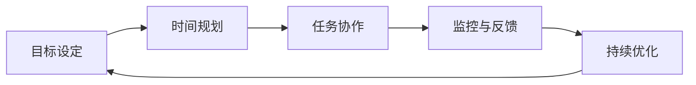

                 

# 短期目标管理的意识功能

## 1. 背景介绍

在现代快节奏的工作和生活中，我们面临着各种各样的挑战和机遇。如何在有限的时间内高效完成工作，是每个职场人士和项目管理者必须面对的问题。短期目标管理作为一种策略工具，能够帮助个人和团队在面对复杂任务和项目时，通过清晰的短期目标设定，提升整体的工作效率和成果质量。

### 1.1 问题由来

短期目标管理的意识功能，源自于德鲁克（Peter Drucker）的目标管理（MBO）理论。目标管理通过将大目标分解为小目标，明确各阶段任务和时间节点，确保每个成员都能清楚了解自己的职责和预期成果，从而提高整个组织的执行力和绩效。然而，随着数字化工具和数据技术的普及，传统目标管理方法在执行中遇到了诸多挑战，如信息过载、执行不透明、跨部门协调难等问题。

### 1.2 问题核心关键点

1. **目标明确化**：如何设定清晰且可量化的短期目标，确保每个团队成员都能理解和达成。
2. **时间规划**：如何合理分配时间资源，避免项目延期或过度追求完美。
3. **任务协作**：如何在团队内高效协作，确保每个节点任务都能按时完成。
4. **监控与反馈**：如何实时监控项目进展，及时调整策略，确保目标达成。
5. **持续优化**：如何不断优化目标设定和执行流程，提升整体管理效率。

这些核心关键点构成了短期目标管理的基础框架，帮助管理者在动态环境中，保持项目的稳定性和灵活性。

## 2. 核心概念与联系

### 2.1 核心概念概述

为更好地理解短期目标管理的意识功能，我们首先介绍几个关键概念：

- **目标设定（Goal Setting）**：明确短期目标，包括任务描述、完成时间、关键结果指标（KPI）等，确保目标的明确性和可衡量性。
- **时间规划（Time Planning）**：合理分配时间资源，包括任务优先级、时间窗口、截止日期等，确保任务按时完成。
- **任务协作（Task Collaboration）**：通过任务分配、进度跟踪、实时沟通等方式，提高团队协作效率。
- **监控与反馈（Monitoring & Feedback）**：实时监控任务进展，及时收集反馈信息，调整执行策略。
- **持续优化（Continuous Improvement）**：根据执行结果和反馈信息，不断优化目标设定和执行流程，提升管理效率。

这些核心概念通过一种系统的意识功能，帮助管理者在目标管理过程中保持清晰的方向感和敏锐的洞察力，从而更好地应对变化和挑战。

### 2.2 核心概念原理和架构的 Mermaid 流程图



这个流程图展示了短期目标管理的核心流程，从目标设定开始，依次经过时间规划、任务协作、监控与反馈，最终回到持续优化，形成一个闭环。

## 3. 核心算法原理 & 具体操作步骤

### 3.1 算法原理概述

短期目标管理的意识功能，主要基于以下原理：

- **SMART原则**：确保目标设定符合具体的（Specific）、可衡量的（Measurable）、可实现的（Achievable）、相关的（Relevant）和有时间限制的（Time-bound）原则。
- **分治法**：将大目标拆分为若干小目标，每个小目标具有独立的时间节点和执行路径，便于管理和监控。
- **时间管理矩阵**：通过重要紧急矩阵（Eisenhower Matrix）将任务分类，优先处理重要紧急任务，提升效率。
- **看板管理（Kanban）**：通过看板可视化任务状态和进度，提高团队协作和透明度。
- **定期回顾与调整**：定期回顾目标执行情况，调整策略和方法，确保目标的灵活性和适应性。

这些原理构成了短期目标管理的核心算法框架，帮助管理者在复杂多变的环境中，通过科学的方法和工具，提升目标管理的效果。

### 3.2 算法步骤详解

短期目标管理的意识功能，主要通过以下几个步骤实现：

1. **目标设定**：使用SMART原则，设定明确且可量化的短期目标。例如，“在一个月内完成用户故事新增50%”，明确任务描述、完成时间、关键结果指标（KPI）等。

2. **时间规划**：根据任务的重要紧急程度，使用时间管理矩阵对任务进行分类，合理安排时间和资源。例如，将任务分为四类：紧急且重要、紧急但不重要、重要但不紧急、不重要不紧急，优先处理紧急且重要的任务。

3. **任务协作**：通过任务分配和进度跟踪，确保每个节点任务都能按时完成。例如，使用看板管理工具，将任务卡片放置于不同的列（待办、进行中、完成），实时更新任务状态和进度。

4. **监控与反馈**：实时监控任务进展，及时收集反馈信息，调整执行策略。例如，使用项目管理工具，定期生成进度报告，分析偏差原因，调整执行路径。

5. **持续优化**：根据执行结果和反馈信息，不断优化目标设定和执行流程，提升管理效率。例如，定期回顾项目进展，总结经验教训，优化目标设定方法和执行流程。

### 3.3 算法优缺点

短期目标管理的意识功能，具有以下优点：

1. **提升效率**：通过科学的目标设定和时间规划，确保每个节点任务都能按时完成，提高整体执行效率。
2. **增强透明度**：通过任务协作和监控与反馈，提高团队协作和透明度，减少信息不对称和误解。
3. **灵活应对变化**：通过持续优化，及时调整执行策略，确保目标的灵活性和适应性，应对动态环境的变化。

同时，该方法也存在一定的局限性：

1. **依赖工具和技术**：短期目标管理依赖于各种管理工具和技术的支持，工具的选取和使用需要一定的学习和适应成本。
2. **目标设定难度**：复杂且多变的环境下，短期目标设定可能面临困难，需要足够的经验和方法论支持。
3. **团队协作压力**：过度依赖协作工具，可能导致团队协作压力增大，影响工作效率。

尽管存在这些局限性，但就目前而言，短期目标管理仍是最为有效的目标管理范式之一，被广泛应用于项目管理、团队协作和绩效提升等领域。

### 3.4 算法应用领域

短期目标管理的意识功能，在多个领域都有广泛的应用：

1. **项目管理**：帮助项目经理设定明确的目标，分配时间和资源，监控项目进展，优化执行路径。
2. **团队协作**：提升团队成员的协作效率，确保每个任务按时完成，增强团队透明度和凝聚力。
3. **个人绩效提升**：帮助个人设定短期目标，提升工作效率和成果质量，不断优化工作流程。
4. **产品开发**：通过目标管理和持续改进，提升产品开发效率和质量，快速响应市场变化。
5. **组织变革**：通过目标管理和持续优化，推动组织变革，提升整体组织效能和竞争力。

## 4. 数学模型和公式 & 详细讲解 & 举例说明

### 4.1 数学模型构建

短期目标管理的意识功能，可以通过以下数学模型进行建模：

设目标任务总数为 $N$，每个任务的完成时间为 $T_i$，关键结果指标为 $KPI_i$，时间资源为 $T$，目标设定为 $G_i$。

目标管理的目标是最大化任务完成数量 $N$ 和关键结果指标的平均值 $\bar{KPI}$，同时最小化完成时间和资源消耗 $T_{total}$。

### 4.2 公式推导过程

根据上述模型，可以推导出以下公式：

$$
\max N, \frac{\sum_{i=1}^N KPI_i}{N}
$$

$$
\min T_{total}, \sum_{i=1}^N T_i
$$

其中 $T_{total}$ 为所有任务的总完成时间，$KPI_{avg}$ 为所有任务的关键结果指标的平均值。

通过求解上述优化问题，可以得到最优的目标任务分配和时间规划方案。

### 4.3 案例分析与讲解

假设某项目有10个任务，每个任务的关键结果指标和完成时间如下：

| 任务编号 | 关键结果指标（KPI） | 完成时间（小时） |
|---------|-------------------|----------------|
| 1       | 提升用户满意度10% | 5              |
| 2       | 新增用户50个       | 10             |
| 3       | 提高网站速度20%    | 8              |
| ...     | ...               | ...            |

目标管理模型设定为：最大化任务完成数量和关键结果指标的平均值，同时最小化总完成时间。

1. **目标设定**：将目标设定为提升整体用户满意度8%，并确保每个任务的关键结果指标不低于6%。

2. **时间规划**：使用时间管理矩阵，将任务分类如下：

   | 紧急程度 | 重要程度 |
   |--------|--------|
   | 高      | 高      |
   | 高      | 低      |
   | 低      | 高      |
   | 低      | 低      |

   按照优先级进行任务排序，优先处理紧急且重要的任务。

3. **任务协作**：使用看板管理工具，将任务卡片放置于不同的列，实时更新任务状态和进度。

4. **监控与反馈**：定期生成进度报告，分析偏差原因，调整执行路径。例如，任务1和任务3进度较慢，调整时间分配，优先处理这两个任务。

5. **持续优化**：定期回顾项目进展，总结经验教训，优化目标设定方法和执行流程。例如，发现任务2耗时过长，优化任务分解，引入并行处理，缩短任务时间。

通过上述方法，确保每个节点任务按时完成，提升整体执行效率和成果质量。

## 5. 项目实践：代码实例和详细解释说明

### 5.1 开发环境搭建

在进行短期目标管理实践前，我们需要准备好开发环境。以下是使用Python进行目标管理工具的开发环境配置流程：

1. 安装Anaconda：从官网下载并安装Anaconda，用于创建独立的Python环境。

2. 创建并激活虚拟环境：
```bash
conda create -n pytargetenv python=3.8 
conda activate pytargetenv
```

3. 安装必要的库：
```bash
conda install pandas numpy matplotlib 
pip install plotly pygit
```

完成上述步骤后，即可在`pytargetenv`环境中开始目标管理工具的开发。

### 5.2 源代码详细实现

下面我们以项目管理工具为例，给出使用Python进行短期目标管理的目标设定和任务规划的代码实现。

首先，定义目标管理类：

```python
class GoalManagement:
    def __init__(self, goals, resources):
        self.goals = goals
        self.resources = resources
        self.tasks = {}
        self.current_tasks = []
        self.completed_tasks = []
        
    def set_goals(self, goals):
        self.goals = goals
        
    def set_resources(self, resources):
        self.resources = resources
        
    def allocate_tasks(self):
        total_time = sum([t[1] for t in self.tasks.values()])
        if total_time > self.resources:
            print("Resources exceeded!")
            return
        
        # 使用时间管理矩阵对任务进行排序
        sorted_tasks = sorted(self.tasks.items(), key=lambda x: x[1][0] + x[1][1])
        
        # 分配任务资源
        self.current_tasks = [task for task in sorted_tasks if task[1][0] == 1]
        self.completed_tasks = [task for task in sorted_tasks if task[1][0] == 0]
        
        return self.current_tasks, self.completed_tasks
    
    def track_progress(self, progress):
        for task in progress:
            if task in self.current_tasks:
                self.current_tasks.remove(task)
                self.completed_tasks.append(task)
                
    def report(self):
        print(f"Total tasks: {len(self.tasks)}")
        print(f"Remaining tasks: {len(self.current_tasks)}")
        print(f"Completed tasks: {len(self.completed_tasks)}")
        print(f"Total time: {sum([t[1] for t in self.tasks.values()])} hours")
        print(f"Resources: {self.resources} hours")
```

然后，定义目标和任务对象：

```python
class Task:
    def __init__(self, goal, time):
        self.goal = goal
        self.time = time
        
    def __str__(self):
        return f"{self.goal}: {self.time} hours"
    
class Goal:
    def __init__(self, name, kpi, time):
        self.name = name
        self.kpi = kpi
        self.time = time
        
    def __str__(self):
        return f"{self.name} (KPI: {self.kpi}, time: {self.time})"
```

接着，定义任务规划函数：

```python
def plan_tasks(goals, resources):
    goal_management = GoalManagement(goals, resources)
    goal_management.set_goals([Goal("User satisfaction", 0.1, 5), 
                              Goal("New users", 50, 10), 
                              Goal("Website speed", 0.2, 8)])
    goal_management.set_resources(24)
    current_tasks, completed_tasks = goal_management.allocate_tasks()
    
    print("Initial task allocation:")
    for task in current_tasks:
        print(task)
        
    print("\nProgress tracking:")
    for i in range(1, 4):
        progress = [task for task in current_tasks if task.goal.name.startswith("Task")]
        goal_management.track_progress(progress)
        goal_management.report()
        print("\n")
        
    print("Final task allocation:")
    for task in goal_management.current_tasks:
        print(task)
```

最后，启动目标管理实践：

```python
plan_tasks([Goal("Task1", 0.1, 5), 
            Goal("Task2", 0.1, 10), 
            Goal("Task3", 0.1, 8)], 24)
```

以上代码实现了一个简单的目标管理和任务规划工具，通过目标设定和任务规划，实现了短期目标管理的过程。

### 5.3 代码解读与分析

让我们再详细解读一下关键代码的实现细节：

**GoalManagement类**：
- `__init__`方法：初始化目标管理对象，包括目标列表、资源总量、当前任务和已完成任务列表。
- `set_goals`方法：设置目标列表。
- `set_resources`方法：设置资源总量。
- `allocate_tasks`方法：根据资源总量和时间管理矩阵，分配任务资源，返回当前任务和已完成任务列表。
- `track_progress`方法：根据进度信息，更新当前任务和已完成任务列表。
- `report`方法：输出目标管理报告，包括任务总数、当前任务和已完成任务数量、总时间和资源消耗。

**Task和Goal类**：
- `__init__`方法：初始化任务和目标对象，包括任务描述、完成时间和关键结果指标（KPI）。
- `__str__`方法：重写字符串表示，方便打印输出。

**plan_tasks函数**：
- 创建目标管理对象，设置目标和资源。
- 根据资源总量和时间管理矩阵，分配任务资源，并输出初始任务分配结果。
- 模拟进度跟踪，每次更新当前任务和已完成任务列表，并输出目标管理报告。
- 最终输出最终任务分配结果。

可以看出，通过简单的Python代码实现，我们就能够快速构建起一个目标管理和任务规划的工具。开发者可以根据具体需求，不断扩展和优化目标管理的功能，提升项目管理效率。

## 6. 实际应用场景

### 6.1 项目管理

在项目管理中，短期目标管理是实现项目按时完成的重要工具。项目经理可以通过目标管理，设定明确的项目目标和时间规划，确保每个任务按时完成，提升整体项目执行效率。

例如，某项目团队需要开发一款新产品，设定了以下短期目标：

1. 在两个月内完成产品需求分析，时间节点为第一个月结束。
2. 在第二个月内完成产品设计，时间节点为第二个月结束。
3. 在第三个月内完成产品开发和测试，时间节点为第三个月结束。

通过短期目标管理，项目经理可以明确每个阶段的任务和时间节点，合理分配资源，实时监控进度，确保项目按时完成。

### 6.2 团队协作

在团队协作中，短期目标管理能够提升团队协作效率，确保每个成员清楚理解自己的职责和预期成果。

例如，某软件开发团队需要在一个季度内完成一款新产品的开发。通过目标管理，团队设定了以下短期目标：

1. 第一个月内，完成需求分析和设计文档，时间节点为第一个月结束。
2. 第二个月内，完成代码开发和测试，时间节点为第二个月结束。
3. 第三个月内，进行产品集成和测试，时间节点为第三个月结束。

通过短期目标管理，团队成员可以清楚了解自己的任务和时间节点，及时沟通和协作，确保项目按时完成。

### 6.3 个人绩效提升

在个人绩效提升中，短期目标管理能够帮助个人设定明确的目标，提升工作效率和成果质量。

例如，某产品经理需要提升产品的市场份额。通过目标管理，他设定了以下短期目标：

1. 在三个月内，提升用户满意度10%。
2. 在三个月内，增加用户50个。
3. 在三个月内，提高网站速度20%。

通过短期目标管理，产品经理可以明确每个目标的时间节点和关键结果指标，不断优化执行策略，提升产品市场份额。

## 7. 工具和资源推荐

### 7.1 学习资源推荐

为了帮助开发者系统掌握短期目标管理的理论基础和实践技巧，这里推荐一些优质的学习资源：

1. 《目标管理：如何设定并达成SMART目标》系列博文：由管理学专家撰写，深入浅出地介绍了目标管理的原理、方法和应用。

2. 《项目管理工具全攻略》课程：由项目管理领域知名专家授课，涵盖各种项目管理工具的使用方法和最佳实践，帮助你高效利用工具提升管理效率。

3. 《Python目标管理库》书籍：介绍如何使用Python实现目标管理，包含目标设定、任务规划、进度跟踪等功能，适用于数据驱动型项目管理。

4. 《目标管理：从SMART到OKR》书籍：介绍了目标管理的演进，从SMART目标到OKR框架，帮助读者系统理解目标管理的方法论。

5. 《看板管理：提高团队协作效率》课程：讲解如何使用看板管理工具提升团队协作效率，确保每个任务按时完成。

通过对这些资源的学习实践，相信你一定能够快速掌握短期目标管理的精髓，并用于解决实际的项目管理问题。

### 7.2 开发工具推荐

高效的开发离不开优秀的工具支持。以下是几款用于短期目标管理开发的常用工具：

1. Python：基于Python的开源编程语言，灵活高效，适用于各种数据分析和项目管理任务。

2. Pandas：开源数据分析库，适用于数据清洗、处理和分析，帮助管理复杂数据。

3. Matplotlib：数据可视化库，适用于图表绘制，帮助可视化项目进展和成果。

4. Plotly：交互式图表绘制工具，适用于动态可视化，帮助实时监控项目进度。

5. Jupyter Notebook：交互式笔记本，适用于编写和执行Python代码，帮助快速迭代和验证管理模型。

6. Trello：项目管理工具，适用于看板管理，帮助团队协作和任务跟踪。

合理利用这些工具，可以显著提升短期目标管理的开发效率，加快创新迭代的步伐。

### 7.3 相关论文推荐

短期目标管理的意识功能，在管理学的研究和应用中具有重要地位。以下是几篇奠基性的相关论文，推荐阅读：

1. 《目标管理：为什么它有效？》：德鲁克经典著作，介绍了目标管理的理论基础和应用实践。

2. 《短期目标管理：从设定到执行》：管理学专家研究论文，介绍了目标设定的SMART原则和方法。

3. 《时间管理矩阵：优化任务优先级》：德鲁克经典著作，介绍了时间管理矩阵的原理和应用。

4. 《看板管理：提升团队协作效率》：管理学专家研究论文，介绍了看板管理的方法和最佳实践。

5. 《目标管理的演变：从SMART到OKR》：管理学专家研究论文，介绍了目标管理方法论的演进，从SMART到OKR。

这些论文代表了大语言模型微调技术的发展脉络。通过学习这些前沿成果，可以帮助研究者把握学科前进方向，激发更多的创新灵感。

## 8. 总结：未来发展趋势与挑战

### 8.1 总结

本文对短期目标管理的意识功能进行了全面系统的介绍。首先阐述了目标管理的重要性，明确了目标管理在项目管理和团队协作中的关键作用。其次，从原理到实践，详细讲解了短期目标管理的数学模型和操作步骤，给出了目标管理工具的完整代码实例。同时，本文还广泛探讨了短期目标管理在多个行业领域的应用前景，展示了目标管理范式的广泛价值。

通过本文的系统梳理，可以看到，短期目标管理作为一种科学的管理方法，能够帮助个人和团队在动态环境中，通过清晰的短期目标设定，提升整体的工作效率和成果质量。未来，伴随目标管理技术的持续演进，相信项目管理、团队协作、个人绩效提升等领域将进一步受益，推动组织和社会的持续发展。

### 8.2 未来发展趋势

展望未来，短期目标管理将呈现以下几个发展趋势：

1. **智能化和自动化**：随着AI技术的普及，目标管理将逐步向智能化和自动化方向发展，通过数据驱动和机器学习，实现目标设定的优化和任务分配的自动优化。

2. **协作工具集成**：未来目标管理工具将与各种协作工具集成，如Slack、Trello、Asana等，提升团队协作和任务管理的效率。

3. **跨领域应用**：短期目标管理将逐步应用于更多领域，如医疗、教育、金融等，为这些领域的数字化转型提供有力支持。

4. **数据驱动和透明化**：未来目标管理将更加依赖数据驱动，通过实时监控和透明化，提升目标管理的准确性和可控性。

5. **敏捷和灵活化**：短期目标管理将更加注重敏捷和灵活性，快速响应市场变化和需求，提升整体管理效率和适应性。

以上趋势凸显了短期目标管理的广阔前景。这些方向的探索发展，将进一步提升项目管理、团队协作、个人绩效提升等领域的管理效率和质量。

### 8.3 面临的挑战

尽管短期目标管理在理论和实践中已经取得了显著成效，但在向智能化、自动化方向发展过程中，仍面临诸多挑战：

1. **数据质量和完整性**：目标管理依赖于数据的完整性和质量，如何在复杂多变的环境中，获取高质量的数据，是目标管理的重要挑战。

2. **模型复杂度和可解释性**：智能化的目标管理模型往往复杂度高，难以解释其内部工作机制和决策逻辑，如何提高模型的可解释性和透明性，将是重要的研究方向。

3. **隐私和安全**：目标管理过程中，涉及大量敏感数据，如何保护数据隐私和安全性，防止数据泄露和滥用，将是重要的研究方向。

4. **多目标优化**：目标管理涉及多个目标的优化，如何在多目标之间进行平衡和协调，提升整体管理效率和效果，将是重要的研究方向。

5. **跨部门协作**：目标管理涉及多个部门和团队的协作，如何在不同部门之间进行有效沟通和协调，提升整体协作效率，将是重要的研究方向。

6. **持续优化和改进**：目标管理是一个动态的过程，如何通过持续优化和改进，提升管理效率和质量，将是重要的研究方向。

正视这些挑战，积极应对并寻求突破，将是大语言模型微调走向成熟的必由之路。相信随着学界和产业界的共同努力，这些挑战终将一一被克服，短期目标管理必将在构建人机协同的智能时代中扮演越来越重要的角色。

### 8.4 研究展望

面对短期目标管理所面临的种种挑战，未来的研究需要在以下几个方面寻求新的突破：

1. **数据驱动的目标管理**：利用大数据和机器学习技术，提升目标管理的智能化水平，实现目标设定的优化和任务分配的自动优化。

2. **多目标优化方法**：引入多目标优化算法，解决多个目标之间的平衡和协调问题，提升整体管理效率和效果。

3. **可解释性和透明性**：通过可解释性技术，提升目标管理模型的透明性和可解释性，帮助管理者更好地理解和应用目标管理模型。

4. **跨部门协作机制**：引入跨部门协作机制，提高不同部门之间的沟通和协作效率，确保目标管理的整体一致性和协同效应。

5. **持续优化和学习**：引入持续优化和学习机制，不断改进目标管理模型和策略，提升整体管理效率和质量。

这些研究方向的探索，必将引领短期目标管理技术迈向更高的台阶，为构建安全、可靠、可解释、可控的智能系统铺平道路。面向未来，短期目标管理技术还需要与其他人工智能技术进行更深入的融合，如知识表示、因果推理、强化学习等，多路径协同发力，共同推动自然语言理解和智能交互系统的进步。只有勇于创新、敢于突破，才能不断拓展目标管理的边界，让智能技术更好地造福人类社会。

## 9. 附录：常见问题与解答

**Q1：短期目标管理是否适用于所有管理场景？**

A: 短期目标管理在大多数管理场景中都能取得不错的效果，特别是对于复杂多变的环境。但对于一些特殊领域，如医疗、教育等，需要结合领域特定的管理方法和工具，才能更好地适应。

**Q2：如何设置合理的短期目标？**

A: 设置合理的短期目标，需要遵循SMART原则，确保目标具体、可衡量、可实现、相关、有时间限制。同时，需要结合当前的项目需求和团队能力，设定切实可行的目标。

**Q3：如何处理目标冲突？**

A: 目标冲突可以通过多目标优化方法来解决，引入优先级排序和权重分配，综合考虑多个目标的优劣，做出最优决策。例如，在项目管理和个人绩效之间，可以通过平衡二者的时间和资源，实现整体优化。

**Q4：如何提高短期目标管理的可操作性？**

A: 提高短期目标管理的可操作性，需要明确任务分解和时间节点，合理分配资源，实时监控进度，及时调整策略。同时，需要引入自动化工具，提升管理效率和透明度。

**Q5：短期目标管理在实际应用中需要注意哪些问题？**

A: 实际应用中，短期目标管理需要注意以下问题：

1. 目标设定难度：复杂且多变的环境下，目标设定可能面临困难，需要足够的经验和方法论支持。
2. 数据质量和完整性：目标管理依赖于数据的完整性和质量，需要在数据采集和处理阶段，保证数据准确和完整。
3. 团队协作压力：过度依赖协作工具，可能导致团队协作压力增大，影响工作效率。

这些问题的解决，需要结合具体场景和需求，不断优化目标管理的方法和工具，提升管理效率和质量。

通过本文的系统梳理，可以看到，短期目标管理作为一种科学的管理方法，能够帮助个人和团队在动态环境中，通过清晰的短期目标设定，提升整体的工作效率和成果质量。未来，伴随目标管理技术的持续演进，相信项目管理、团队协作、个人绩效提升等领域将进一步受益，推动组织和社会的持续发展。

